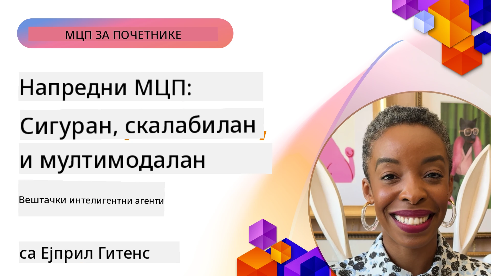

# Напредне теме у МЦП-у

_(Кликните на горњу слику да бисте гледали видео о овој лекцији)_

Ово поглавље покрива низ напредних тема у имплементацији Протокола за Контекст Модела (MCP), укључујући вишемодалну интеграцију, скалабилност, најбоље безбедносне праксе и интеграцију у предузећима. Ове теме су кључне за изградњу робусних и продукцијски спремних MCP апликација које могу испунити захтеве савремених AI система.

## Преглед

Ова лекција истражује напредне концепте у имплементацији Протокола за Контекст Модела, са фокусом на вишемодалну интеграцију, скалабилност, најбоље безбедносне праксе и интеграцију у предузеће. Ове теме су неопходне за изградњу продукцијских MCP апликација које могу да обраде сложене захтеве у предузетничким окружењима.

> **Напомена о тренутној спецификацији:** MCP `2026-07-28` означава као застареле примитиве Роотс и
> Семплинг о којима се говори у лекцијама 5.4 и 5.6. Такође премешта
> експерименталну функцију Таск које се помињу у Протокол Фичерсима (5.16) у
> посебан екстензију Таскс. Ове лекције се задржавају за застареле
> `2025-11-25` имплементације и укључују смернице за миграцију. Погледајте
> [Шта се променило у MCP: Спецификација 2026-07-28](../01-CoreConcepts/mcp-2026-07-28.md).

## Циљеви учења

На крају ове лекције моћи ћете да:

- Имплементирате вишемодалне могућности у рамковима MCP-а
- Дизајнирате скалирајуће MCP архитектуре за сценарије велике потражње
- Примените најбоље безбедносне праксе у складу са MCP безбедносним принципима
- Интегришете MCP са предузетничким AI системима и оквирима
- Оптимизујете перформансе и поузданост у продукцијским окружењима

## Лекције и пример пројеката

| Линк | Наслов | Опис |
|------|-------|-------------|
| [5.1 Интеграција са Ажуром](./mcp-integration/README.md) | Интегриши се са Ажуром | Научите како да интегришете свој MCP сервер на Ажуру |
| [5.2 Вишемодални пример](./mcp-multi-modality/README.md) | MCP Вишемодални примери  | Примери за аудио, слике и вишемодални одговор |
| [5.3 MCP OAuth2 пример](../../../05-AdvancedTopics/mcp-oauth2-demo) | MCP OAuth2 демо | Минимална Spring Boot апликација која демонстрира OAuth2 са MCP као Authorization и Resource сервером. Приказује безбедно издавање токена, заштићене крајње тачке, распоређивање на Azure Container Apps, и интеграцију са API Management-ом. |
| [5.4 Роот Контексти](./mcp-root-contexts/README.md) | Роот контексти  | Научите застарелу `2025-11-25` Роотс примитиву и тренутне опције миграције (заоштрену у `2026-07-28`) |
| [5.5 Рутинг](./mcp-routing/README.md) | Рутинг | Научите различите типове рутирања |
| [5.6 Семплинг](./mcp-sampling/README.md) | Семплинг | Научите застарелу `2025-11-25` Семплинг примитиву и тренутне опције миграције (заоштрену у `2026-07-28`) |
| [5.7 Склалирање](./mcp-scaling/README.md) | Склалирање  | Научите о скалирању |
| [5.8 Безбедност](./mcp-security/README.md) | Безбедност  | Осигурајте свој MCP сервер |
| [5.9 Веб претрага пример](./web-search-mcp/README.md) | Веб претрага MCP | Python MCP сервер и клијент интегрисани са SerpAPI за претрагу веба, вести, производа и питања и одговора у реалном времену. Демонстрира оркестрацију више алата, интеграцију спољашњих API-а и робусно руковање грешкама. |
| [5.10 Реалтиме стриминг](./mcp-realtimestreaming/README.md) | Стриминг  | Стриминг података у реалном времену постао је неопходан у данашњем свету вођеном подацима, где предузећа и апликације захтевају тренутан приступ информацијама ради правовремених одлука.|
| [5.11 Реалтиме Веб претрага](./mcp-realtimesearch/README.md) | Веб претрага | Како MCP трансформише претрагу веба у реалном времену пружајући стандардирани приступ управљању контекстом кроз AI моделе, претраживаче и апликације.| 
| [5.12 Ентра ID Аутентикација за MCP сервере](./mcp-security-entra/README.md) | Ентра ID аутентикација | Microsoft Entra ID пружа робусно решење за управљање идентитетом и приступом у облаку, помажући да само овлашћени корисници и апликације могу комуницирати са вашим MCP сервером.|
| [5.13 Интеграција Microsoft Foundry агента](./mcp-foundry-agent-integration/README.md) | Microsoft Foundry интеграција | Научите како да интегришете MCP сервере са Microsoft Foundry агентима, омогућавајући моћну оркестрацију алата и предузетничке AI могућности уз стандардизоване конекције спољашњих извора података.|
| [5.14 Инжењеринг контекста](./mcp-contextengineering/README.md) | Инжењеринг контекста | Будуће могућности техника инжењеринга контекста за MCP сервере, укључујући оптимизацију контекста, динамичко управљање контекстом и стратегије за ефикасан промпт инжењеринг у оквиру MCP рамкова.|
| [5.15 Прилагођени транспорт MCP-а](./mcp-transport/README.md) | Прилагођени транспорт | Научите како да имплементирате прилагођене транспортне механизме за специјализоване сценарије комуникације у MCP-у.|
| [5.16 Детаљан преглед протокол функција](./mcp-protocol-features/README.md) | Протокол функције | Савладајте напредне протокол функције укључујући обавештења о напретку, отказивање захтева, шаблоне ресурса и узорке руковања грешкама.|
| [5.17 Адверзаријално вишега агената размишљање](./mcp-adversarial-agents/README.md) | Адверзаријални агенти | Користите два агента с супротним позицијама, делећи један MCP сет алата, да откријете халуцинације, издвојите ивичне случајеве и произвежете боље калибрисане резултате кроз структуриран дебатни процес.|

> **Историјска напомена `2025-11-25`:** та ревизија је увела експерименталне
> Таскс и проширила неколико протокол функција. У `2026-07-28`, Таскс су прешли у
> званичну екстензију и Роотс су постали застарели. Не користите
> статус функције из `2025-11-25` као тренутну препоруку; погледајте
> [2026-07-28 измене](https://modelcontextprotocol.io/specification/2026-07-28/changelog).

## Додатне референце

За најсвежије информације о напредним MCP темама, погледајте:
- [MCP Документација](https://modelcontextprotocol.io/)
- [MCP Спецификација (2026-07-28)](https://modelcontextprotocol.io/specification/2026-07-28/)
- [GitHub Репозиторијум](https://github.com/modelcontextprotocol)
- [OWASP MCP Топ 10](https://microsoft.github.io/mcp-azure-security-guide/mcp/) - Безбедносни ризици и мере
- [MCP Безбедносни Самит Воркшоп (Sherpa)](https://azure-samples.github.io/sherpa/) - Практична обука безбедности

## Кључне поруке

- Вишемодалне MCP имплементације проширују AI могућности изнад обраде текста
- Скалирање је неопходно за предузетничке поставке и може се решити хоризонталним и вертикалним скалирањем
- Свеобухватне безбедносне мере штите податке и осигуравају правилну контролу приступа
- Интеграција у предузећа са платформама као што су Azure OpenAI и Microsoft AI Foundry побољшава могућности MCP-а
- Напредне MCP имплементације имају користи од оптимизованих архитектура и пажљивог управљања ресурсима

## Вежба

Дизајнирајте MCP имплементацију класе за предузеће за конкретан случај употребе:

1. Идентификујте вишемодалне захтеве за ваш случај употребе
2. Нагласите безбедносне контроле потребне за заштиту осетљивих података
3. Дизајнирајте скалирајућу архитектуру која може да поднесе варијабилно оптерећење
4. Испланирајте интеграционе тачке са предузетничким AI системима
5. Документирајте потенцијалне уске грла у перформансама и стратегије за њихово ублажавање

## Додатни ресурси

- [Azure OpenAI документација](https://learn.microsoft.com/en-us/azure/ai-services/openai/)
- [Microsoft AI Foundry документација](https://learn.microsoft.com/en-us/ai-services/)

---

## Шта следи

Истражите лекције у овом модулу почевши од: [5.1 MCP интеграција](./mcp-integration/README.md)

Када завршите овај модул, наставите са: [Модул 6: Заједнички доприноси](../06-CommunityContributions/README.md)

---

<!-- CO-OP TRANSLATOR DISCLAIMER START -->
**Изјава о одрицању одговорности**:
Овај документ је преведен коришћењем услуге за аутоматски превод [Co-op Translator](https://github.com/Azure/co-op-translator). Иако тежимо тачности, имајте у виду да аутоматски преводи могу садржати грешке или нетачности. Оригинални документ на његовом изворном језику треба сматрати ауторитативним извором. За критичне информације препоручује се професионални људски превод. Нисмо одговорни за било каква неспоразума или погрешна тумачења која произилазе из коришћења овог превода.
<!-- CO-OP TRANSLATOR DISCLAIMER END -->