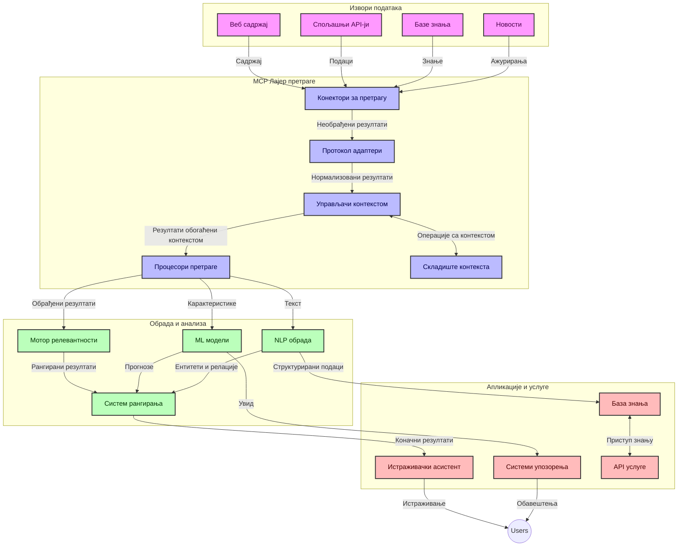
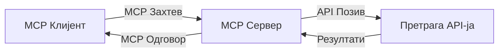
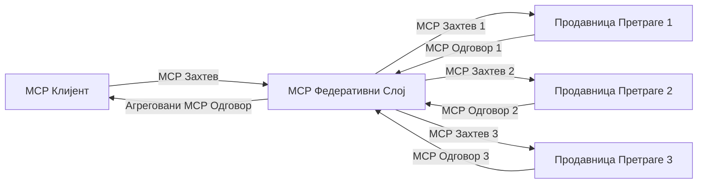
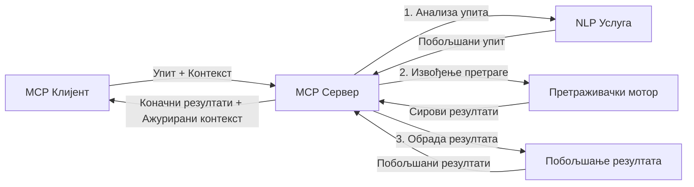

# Протокол контекста модела за претрагу веба у реалном времену

## Преглед

Претрага веба у реалном времену постала је кључна у данашњем информатички оријентисаном окружењу, где апликације требају непосредан приступ ажурираним информацијама са интернета како би пружиле релевантне и благовремене одговоре. Протокол контекста модела (MCP) представља значајан помак у оптимизацији ових процеса претраге у реалном времену, побољшавајући ефикасност претраге, одржавајући контекстуалну целовитост и унапређујући укупне перформансе система.

Овај модул истражује како MCP трансформише претрагу веба у реалном времену пружајући стандардизован приступ управљању контекстом између AI модела, претраживача и апликација.

### Шта ћете научити

У овом детаљном водичу сазнаћете:

- Како MCP ствара несметану везу између AI модела и могућности претраге у реалном времену
- Архитектонске обрасце за примену ефикасних и скалабилних претраживачких решења уз MCP
- Технике за очување контекста претраге кроз више упита и интеракција
- Практичне имплементације кода у Python и JavaScript за различите сценарије претраге
- Методе за баланс између релевантности, освежења и перформанси у системима претраге уз MCP

## Увод у претрагу веба у реалном времену

Претрага веба у реалном времену је технолошки приступ који омогућава континуирано упитовање, обраду и анализу информација са веба како се објављују или ажурирају, омогућавајући системима да пруже свеже и релевантне податке са минималним кашњењем. За разлику од традиционалних система претраге који раде на индексираним подацима који могу бити старости сатима или данима, претрага у реалном времену обрађује живе податке са веба, испоручујући увиде и информације које одражавају тренутно стање онлајн садржаја.

### Кључни концепти претраге веба у реалном времену:

- **Континуирана обрада упита**: Упити за претрагу се обрађују на основу стално ажурираних извора података
- **Приоритет свеже информације**: Системи су дизајнирани да приоритет дају најсвежијим информацијама
- **Уравнотежење релевантности**: Одржавање баланса између релевантности и освежења
- **Скалабилна архитектура**: Системи морају да поднесу варијабилна оптерећења упита и волумен података
- **Контекстуално разумевање**: Одржавање корисничког контекста кроз више итерација претраге је кључно за значајне резултате
- **Динамичка реформаулација упита**: Прилагођавање упита на основу контекста и претходних резултата
- **Интеграција више извора**: Комбиновaње резултата из више претраживача и веб извора
- **Семантичко разумевање**: Обрада упита и садржаја на основу значења, а не само кључних речи
- **Рангирање у реалном времену**: Континуирано прилагођавање ранг листе резултата како нове информације постају доступне

### Протокол контекста модела и претрага веба у реалном времену

Протокол контекста модела (MCP) решава неколико кључних изазова у окружењима претраге веба у реалном времену:

1. **Очување контекста претраге**: MCP стандардизује начин на који се контекст одржава кроз расподељене компоненте претраге, осигуравајући да AI модели и процесни чворови имају приступ релевантној историји упита и корисничким преференцама.

2. **Ефикасно управљање упитима**: Пружајући структуриране механизме за пренос контекста, MCP смањује оптерећење понављања контекста у свакој итерацији претраге.

3. **Интероперабилност**: MCP ствара заједнички језик за дељење контекста између различитих претраживачких технологија и AI модела, омогућавајући флексибилније и проширивије архитектуре.

4. **Контекст оптимизован за претрагу**: MCP имплементације могу да приоритизују које елементе контекста су најрелевантнији за ефикасну претрагу, оптимизујући и перформансе и прецизност.

5. **Адаптивна обрада претраге**: Уз одговарајуће управљање контекстом кроз MCP, системи претраге могу динамички прилагођавати обраду на основу развијајућих потреба корисника и информационих пејзажа.

У модерним апликацијама, од агрегатора вести до истраживачких асистената, интеграција MCP са технологијама претраге веба омогућава интелигентнију, контекстуално свесну претрагу која може пружити све релевантније резултате како се корисничке интеракције настављају.

## Циљеви учења

До краја овог часа бићете у стању да:

- Разумете основе претраге веба у реалном времену и њене изазове у савременим апликацијама
- Објасните како Протокол контекста модела (MCP) побољшава могућности претраге у реалном времену
- Имплементирате претраживачка решења заснована на MCP користећи популарне оквире и API-је
- Дизајнирате и поставите скалабилне, високо перформантне архитектуре претраге уз MCP
- Примeните MCP концепте на различите случајеве употребе, укључујући семантичку претрагу, истраживачку асистенцију и AI-подржано прегледање
- Процените нове трендове и будуће иновације у технологијама претраге заснованим на MCP
- Развијете системе претраге свесне контекста који уче из корисничких интеракција
- Интегриштете могућности претраге веба у AI асистенте користећи стандардизоване MCP протоколе
- Креирате вишестепене претраживачке цевоводе који прогресивно унапређују резултате на основу контекста
- Оптимизујете перформансе претраге уз одржавање свеобухватне свести о контексту

### Дефиниција и значај

Претрага веба у реалном времену подразумева континуирано упитовање, преузимање и испоруку веб-базираних информација са минималним кашњењем. За разлику од традиционалних претраживача који периодично прегледају и индексирају веб, претрага у реалном времену има за циљ да открива информације чим постану доступне, омогућавајући тренутан приступ најактуелнијем садржају.

Кључне карактеристике претраге веба у реалном времену укључују:

- **Свеже информације**: Приоритет недавно објављеном садржају и ажурирањима
- **Континуирана обрада**: Стално праћење нових информација
- **Прилагођавање упита**: Рафинисање претраживачких упита на основу контекста и повратних информација
- **Одмах испорука**: Испорука резултата претраге са минималним закашњењем
- **Одржавање контекста**: Надоградња на претходне упите ради побољшане релевантности

### Изазови у традиционалној претрази веба

Традиционални приступи претрази веба имају многа ограничења када се користе у реално-временским сценаријима:

1. **Фрагментација контекста**: Тешкоће у одржавању контекста претраге кроз више упита
2. **Свеже информације**: Изазови у приступу и проналажењу најновијих информација
3. **Комплексност интеграције**: Проблеми интероперабилности између претраживачких система и апликација
4. **Проблеми са латенцијом**: Избалансираност свеобухватне претраге са временом одговора
5. **Подешавање релевантности**: Осигуравање прецизности и релевантности уз приоритет освежења

## Разумевање Протокола контекста модела (MCP) за претрагу

### Шта је MCP у контексту претраге?

Протокол контекста модела (MCP) је стандардизовани протокол комуникације дизајниран да омогући ефикасну интеракцију између AI модела и апликација. У контексту претраге веба у реалном времену, MCP пружа оквир за:

- Очување контекста претраге током низа упита
- Стандардизацију формата претраживачких упита и резултата
- Оптимизацију преноса параметара претраге и резултата
- Побољшање комуникације између модела и претраживача

### Основне компоненте и архитектура

Архитектура MCP за претрагу веба у реалном времену састоји се из неколико кључних компоненти:

1. **Управљачи контекстом упита**: Управљају и одржавају контекст претраге кроз више упита
2. **Обрадјивачи претраге**: Обрађују долазне захтеве за претрагу користећи технике свесне контекста
3. **Протокол адаптери**: Претварају између различитих API-ја претраге уз очување контекста
4. **Складиште контекста**: Ефикасно складишти и преузима историју претраге и преференце
5. **Конектори за претрагу**: Повезују се са разним претраживачким моторима и веб API-јима



### Како MCP побољшава претрагу веба у реалном времену

MCP решава изазове традиционалне претраге веба кроз:

- **Контекстуална континуитет**: Одржавање веза између упита кроз целу сесију претраге
- **Оптимизовани пренос**: Смањење понављања параметара претраге интелигентним управљањем контекстом
- **Стандардизовани интерфејси**: Пружање конзистентних API-ја за претраживачке компоненте
- **Смањена латенција**: Минимализовање трошкова обраде уз ефикасно руковођење контекстом
- **Побољшана релевантност**: Унапређење релевантности претраге очувањем корисничких намера кроз више упита

## Интеграција и имплементација

Системи претраге веба у реалном времену захтевају пажљиви архитектонски дизајн и имплементацију како би одржали и перформансе и контекстуалну целовитост. Протокол контекста модела нуди стандардизовани приступ интеграцији AI модела и претраживачких технологија, омогућавајући софистицираније, контекстуално свесне претраживачке цевоводе.

### Преглед интеграције MCP у архитектуре претраге

Имплементација MCP у окружењима претраге веба у реалном времену укључује неколико кључних разматрања:

1. **Серијализација контекста претраге**: MCP пружа ефикасне механизме за кодирање контекстуалних информација унутар захтева за претрагу, осигуравајући да кључни контекст прати упит кроз цео процес обраде. Ово укључује стандардизоване формате серијализације оптимизоване за метаподатке везане за претрагу.

2. **Државна обрада претраге**: MCP омогућава интелигентније државно управљање тако што одржава конзистентну репрезентацију контекста кроз итерације претраге. Ово је посебно вредно у вишестепеним претраживачким цевоводима где рафинирање контекста унапређује резултате.

3. **Проширење и рафинисање упита**: MCP имплементације у системима претраге могу олакшати софистицирано проширење и рафинисање упита на основу акумулираног контекста, омогућавајући све релевантније резултате како сесија претраге напредује.

4. **Кеширање и приоритизација резултата**: Стандардизацијом руковања контекстом, MCP помаже у управљању кеширањем и приоритизацијом резултата, дозвољавајући компонентама да се прилагођавају на основу развијајућег се контекста претраге.

5. **Федерација и агрегaција претраге**: MCP олакшава софистициранију федерацију претраге преко више задњих сервера пружајући структуриране репрезентације контекста претраге, омогућавајући значајнију агрегaцију резултата из различитих извора.

Имплементација MCP у различитим претраживачким технологијама створeнa је заједнички приступ управљању контекстом смањујући потребу за прилагођеним интеграционим кодом, истовремено повећавајући способност система да одржи значајан контекст како се претраживачки упити развијају.

### MCP у разним имплементацијама претраге веба

Ови примери прате тренутну MCP спецификацију која је усредсређена на JSON-RPC базирани протокол са различитим транспорт механизмима. Код показује како можете имплементирати прилагођене интеграције претраге уз одржавање пуне компатибилности са MCP протоколом.


<details>
<summary>Python имплементација са општим API-јем за претрагу</summary>

```python
import asyncio
import json
import aiohttp
from typing import Dict, Any, Optional, List
from contextlib import asynccontextmanager
from collections.abc import AsyncIterator

# Увези стандардне MCP библиотеке
from mcp.client.session import ClientSession
from mcp.client.streamable_http import streamablehttp_client
from mcp.types import TextContent, CreateMessageRequestParams, CreateMessageResult
from mcp.server.fastmcp import FastMCP

# Креирај FastMCP сервер за претрагу веба
search_server = FastMCP("WebSearch")

# Класа за руковање операцијама претраге веба
class WebSearchHandler:
    def __init__(self, api_endpoint: str, api_key: str):
        self.api_endpoint = api_endpoint
        self.api_key = api_key
        self.session = None
        
    async def initialize(self):
        """Initialize the HTTP session"""
        self.session = aiohttp.ClientSession(
            headers={"Authorization": f"Bearer {self.api_key}"}
        )
    
    async def close(self):
        """Close the HTTP session"""
        if self.session:
            await self.session.close()
            
    async def perform_search(self, query: str, max_results: int = 5, 
                           include_domains: List[str] = None, 
                           exclude_domains: List[str] = None,
                           time_period: str = "any") -> Dict[str, Any]:
        """Perform web search using the search API"""
        # Конструиши параметре претраге
        search_params = {
            "q": query,
            "limit": max_results,
            "time": time_period
        }
        
        if include_domains:
            search_params["site"] = ",".join(include_domains)
            
        if exclude_domains:
            search_params["exclude_site"] = ",".join(exclude_domains)
        
        # Изврши захтев за претрагу
        try:
            async with self.session.get(
                self.api_endpoint,
                params=search_params
            ) as response:
                if response.status != 200:
                    error_text = await response.text()
                    raise Exception(f"Search API error: {response.status} - {error_text}")
                
                search_data = await response.json()
                
                # Претвори одговор специфичан за API у стандардни формат
                results = []
                for item in search_data.get("results", []):
                    results.append({
                        "title": item.get("title", ""),
                        "url": item.get("url", ""),
                        "snippet": item.get("snippet", ""),
                        "date": item.get("published_date", ""),
                        "source": item.get("source", "")
                    })
                
                return {
                    "query": query,
                    "totalResults": len(results),
                    "results": results
                }
        except Exception as e:
            print(f"Search API request error: {e}")
            raise

# Иницијализуј руковаоца претрагом
search_handler = WebSearchHandler(
    api_endpoint="https://api.search-service.example/search",
    api_key="your-api-key-here"
)

# Подеси животни век за управљање руковаоцем претрагом
@asyncio.asynccontextmanager
async def app_lifespan(server: FastMCP):
    """Manage application lifecycle"""
    await search_handler.initialize()
    try:
        yield {"search_handler": search_handler}
    finally:
        await search_handler.close()

# Постави животни век за сервер
search_server = FastMCP("WebSearch", lifespan=app_lifespan)

# Региструј алатку за претрагу веба
@search_server.tool()
async def web_search(query: str, max_results: int = 5, 
                   include_domains: List[str] = None,
                   exclude_domains: List[str] = None,
                   time_period: str = "any") -> Dict[str, Any]:
    """
    Search the web for information
    
    Args:
        query: The search query
        max_results: Maximum number of results to return (default: 5)
        include_domains: List of domains to include in search results
        exclude_domains: List of domains to exclude from search results
        time_period: Time period for results ("day", "week", "month", "any")
        
    Returns:
        Dictionary containing search results
    """
    ctx = search_server.get_context()
    search_handler = ctx.request_context.lifespan_context["search_handler"]
    
    results = await search_handler.perform_search(
        query=query,
        max_results=max_results,
        include_domains=include_domains,
        exclude_domains=exclude_domains,
        time_period=time_period
    )
    
    return results

# Пример коришћења клијента
async def client_example():
    # Повежи се на сервер претраге користећи Streamable HTTP транспорт
    async with streamablehttp_client("http://localhost:8000/mcp") as (read, write, _):
        async with ClientSession(read, write) as session:
            # Иницијализуј везу
            await session.initialize()
            
            # Позови алатку web_search
            search_results = await session.call_tool(
                "web_search", 
                {
                    "query": "latest developments in AI and Model Context Protocol",
                    "max_results": 5,
                    "time_period": "day",
                    "include_domains": ["github.com", "microsoft.com"]
                }
            )
            
            print(f"Search results: {search_results}")

# Пример извршења сервера
if __name__ == "__main__":
    # Покрени сервер са Streamable HTTP транспортом
    search_server.run(transport="streamable-http")
```
</details> 

<details>
<summary>JavaScript имплементација са претрагом у браузеру</summary>


```javascript
// Имплементација MCP сервера за претрагу веба
import { McpServer, ResourceTemplate } from '@modelcontextprotocol/sdk/server/mcp.js';
import { StreamableHTTPServerTransport } from '@modelcontextprotocol/sdk/server/streamableHttp.js';
import { z } from 'zod';

// Креирај MCP сервер за претрагу веба
const searchServer = new McpServer({
    name: "BrowserSearch",
    description: "A server that provides web search capabilities"
});

// Класа сервиса за претрагу
class SearchService {
    constructor(searchApiUrl, apiKey) {
        this.searchApiUrl = searchApiUrl;
        this.apiKey = apiKey;
    }

    async performSearch(parameters) {
        const {
            query = '',
            maxResults = 5,
            includeDomains = [],
            excludeDomains = [],
            timePeriod = 'any'
        } = parameters;
        
        // Конструиши URL за претрагу са параметрима
        const url = new URL(this.searchApiUrl);
        url.searchParams.append('q', query);
        url.searchParams.append('limit', maxResults);
        url.searchParams.append('time', timePeriod);
        
        if (includeDomains.length > 0) {
            url.searchParams.append('site', includeDomains.join(','));
        }
        
        if (excludeDomains.length > 0) {
            url.searchParams.append('exclude_site', excludeDomains.join(','));
        }
        
        try {
            const response = await fetch(url.toString(), {
                method: 'GET',
                headers: {
                    'Authorization': `Bearer ${this.apiKey}`,
                    'Content-Type': 'application/json'
                }
            });
            
            if (!response.ok) {
                const errorText = await response.text();
                throw new Error(`Search API error: ${response.status} - ${errorText}`);
            }
            
            const searchData = await response.json();
            
            // Претвори одговор специфичан за API у стандардни формат
            const results = searchData.results?.map(item => ({
                title: item.title || '',
                url: item.url || '',
                snippet: item.snippet || '',
                date: item.published_date || '',
                source: item.source || ''
            })) || [];
            
            return {
                query,
                totalResults: results.length,
                results
            };
        } catch (error) {
            console.error('Search API request error:', error);
            throw error;
        }
    }
}

// Иницијализуј сервис претраге
const searchService = new SearchService(
    'https://api.search-service.example/search',
    'your-api-key-here'
);

// Подеси провајдер контекста за сервер
searchServer.setContextProvider(() => {
    return {
        searchService
    };
});

// Региструј алат за претрагу веба
searchServer.tool({
    name: 'web_search',
    description: 'Search the web for information',
    parameters: {
        type: 'object',
        properties: {
            query: {
                type: 'string',
                description: 'The search query'
            },
            maxResults: {
                type: 'integer',
                description: 'Maximum number of results to return',
                default: 5
            },
            includeDomains: {
                type: 'array',
                items: { type: 'string' },
                description: 'List of domains to include in search results'
            },
            excludeDomains: {
                type: 'array',
                items: { type: 'string' },
                description: 'List of domains to exclude from search results'
            },
            timePeriod: {
                type: 'string',
                description: 'Time period for results',
                enum: ['day', 'week', 'month', 'any'],
                default: 'any'
            }
        },
        required: ['query']
    },
    handler: async (params, context) => {
        const { searchService } = context;
        return await searchService.performSearch(params);
    }
});

// Пример клијент кода за повезивање са сервером за претрагу
import { Client } from '@modelcontextprotocol/sdk/client/index.js';
import { StreamableHTTPClientTransport } from '@modelcontextprotocol/sdk/client/streamableHttp.js';

async function connectToSearchServer() {
    // Повеже се са сервером за претрагу
    const transport = new StreamableHTTPClientTransport(
        new URL('http://localhost:8000/mcp')
    );
    
    const client = new Client({
        name: 'search-client',
        version: '1.0.0'
    });
    
    await client.connect(transport);
    
    // Изврши алат за претрагу
    const searchResults = await client.callTool({
        name: 'web_search',
        arguments: {
            query: 'Model Context Protocol implementation examples',
            maxResults: 10,
            timePeriod: 'week',
            includeDomains: ['github.com', 'docs.microsoft.com']
        }
    });
    
    console.log('Search results:', searchResults);
    
    // Очисти
    await client.disconnect();
}

// Покрени сервер
const transport = new StreamableHTTPServerTransport();
await searchServer.connect(transport);
console.log('Search server running at http://localhost:8000/mcp');

// У посебном процесу или након што је сервер покренут
// connectToSearchServer().catch(console.error);
```
</details> 


## Одрицање одговорности за примере кода

> **Важно обавештење**: Примери кода у наставку показују интеграцију Протокола контекста модела (MCP) са функционалностима претраге веба. Иако прате обрасце и структуре званичних MCP SDK-ова, поједностављени су у образовне сврхе.
> 
> Ови примери укључују:
> 
> 1. **Python имплементацију**: FastMCP серверску имплементацију која пружа алат за претрагу веба и повезује се са спољним search API-јем. Овај пример показује исправно управљање животним циклусом, руковање контекстом и имплементацију алата пратећи обрасце из [званичног MCP Python SDK-а](https://github.com/modelcontextprotocol/python-sdk). Сервер користи препоручени Streamable HTTP транспорт који је заменио старији SSE транспорт за продукционе примене.
> 
> 2. **JavaScript имплементацију**: TypeScript/JavaScript имплементацију која користи FastMCP образац из [званичног MCP TypeScript SDK-а](https://github.com/modelcontextprotocol/typescript-sdk) за креирање сервера претраге са исправним дефиницијама алата и клијентским везама. Прати најновије препоручене обрасце за управљање сесијом и очување контекста.
> 
> Ови примери захтевају додатно руковање грешкама, аутентификацију и специфичан API интеграциони код за продукциону употребу. Приказани search API крајњи јелови (`https://api.search-service.example/search`) су замене и треба их заменити стварним крајњим тачкама услуге претраге.
> 
> За потпуне детаље имплементације и најсавременије приступе, молимо погледајте [званичну MCP спецификацију](https://spec.modelcontextprotocol.io/) и документацију SDK-а.

## Основни концепти

### Протокол контекста модела (MCP) оквир

У својој основи, Протокол контекста модела пружа стандардизовани начин за размену контекста између AI модела, апликација и сервиса. У претрази веба у реалном времену, овај оквир је незаменљив за креирање кохерентних искустава претраге са више корака. Кључне компоненте укључују:

1. **Клијент-сервер архитектура**: MCP успоставља јасно раздвајање између клијената претраге (захтеватеља) и сервера претраге (пружалаца), омогућавајући флексибилне модели распореда.

2. **JSON-RPC комуникација**: Протокол користи JSON-RPC за размену порука, што га чини компатибилним са веб технологијама и лако имплементибилним на различитим платформама.

3. **Управљање контекстом**: MCP дефинише структуриране методе за одржавање, ажурирање и коришћење контекста претраге кроз више интеракција.

4. **Дефиниције алата**: Могућности претраге излажу се као стандардизовани алати са добро дефинисаним параметрима и вредностима повратка.

5. **Подршка за стриминг**: Протокол подржава стриминг резултата, што је важно за претрагу у реалном времену где резултати могу пристизати постепено.

### Обрасци интеграције претраге веба

При интеграцији MCP са претрагом веба јављају се неки узорци:

#### 1. Директна интеграција пружаоца претраге



У овом обрaцу MCP сервер директно комуницира са једним или више API-ја за претрагу, преводећи MCP захтеве у специфичне API позиве и форматирајући резултате као MCP одговоре.

#### 2. Федеративна претрага са очувањем контекста



Овај образац распоређује упите за претрагу кроз више MCP-компатибилних пружалаца, од којих сваки може бити специјализован за различите врсте садржаја или могућности претраге, док одржава јединствени контекст.

#### 3. Ланац претраге побољшан контекстом



У овом обрaцу процес претраге је подељен у више фаза, са контекстом који се обогаћује на сваком кораку, што резултује поступно релевантнијим резултатима.

### Компоненте контекста претраге

У претрази веба заснованој на MCP-у, контекст обично укључује:

- **Историја упита**: Претходни претраживачки упити у сесији
- **Корисничке преференце**: Језик, регион, подешавања сигурне претраге
- **Историја интеракција**: Који су резултати кликнути, време проведено на резултатима
- **Параметри претраге**: Филтери, редослед сортирања и други модификатори претраге
- **Стручност у домену**: Контекст специфичан за предметну област релевантан претрази
- **Временски контекст**: Фактори релевантности засновани на времену
- **Преференције извора**: Поверљиви или одабрани извори информација

## Случајеви употребе и апликације

### Истраживање и прикупљање информација

MCP унапређује радне токове истраживања путем:

- Очувања контекста истраживања кроз сесије претраге
- Омогућавања софистициранијих и контекстуално релевантних упита
- Подршке федерацији претраге из више извора
- Олакшавања извлачења знања из резултата претраге

### Праћење вести и трендова у реалном времену

Претрага покретана MCP-ом нуди предности у праћењу вести:

- Откривање новонасталих вести у готово реалном времену
- Контекстуална филтрација релевантних информација
- Праћење тема и ентитета преко више извора
- Персонализовани алерти о новостима засновани на корисничком контексту

### AI-подржано прегледање и истраживање

MCP отвара нове могућности за AI-подржано прегледање:

- Контекстуалне предлоге претраге на основу тренутне активности у прегледачу
- Несметана интеграција претраге веба са асистентима покретаним LLM-ом
- Претрага са више корака уз очуван контекст
- Побољшана провера чињеница и верификација информација

## Будући трендови и иновације

### Еволуција MCP-а у претрази веба

У будућности очекујемо да MCP еволуира како би решио:


- **Мултимодална претрага**: Интеграција претраге текста, слике, звука и видео записа уз очувани контекст  
- **Децентрализована претрага**: Подршка дистрибуираним и федеративним екосистемима претраге  
- **Приватност претраге**: Механизми заштите приватности у претрази свесни контекста  
- **Разумевање упита**: Дубока семантичка анализа природних језика у претраживачким упитима  

### Потенцијални напредак у технологији  

Појављујуће технологије које ће обликовати будућност MCP претраге:  

1. **Невронске претраживачке архитектуре**: Системи претраге засновани на уграђивањима оптимизовани за MCP  
2. **Персонализовани контекст претраге**: Учење образаца претраге појединачних корисника током времена  
3. **Интеграција графа знања**: Контекстуална претрага побољшана графовима знања специфичним за домене  
4. **Прекомерна контекстуалност**: Очекивање контекста кроз различите модалитете претраге  

## Практични задаци  

### Задатак 1: Подешавање основног MCP претраживачког процеса  

У овом задатку ћете научити како да:  
- Конфигуришете основно MCP претраживачко окружење  
- Имплементирате управљаче контекста за веб претрагу  
- Тестирате и проверите очувања контекста током више претраживачких итерација  

### Задатак 2: Израда помоћника за истраживање уз MCP претрагу  

Направите комплетну апликацију која:  
- Обрађује питања за истраживање на природном језику  
- Изводи претрагу на вебу уз свест о контексту  
- Синтетише информације из више извора  
- Представља организоване налазе истраживања  

### Задатак 3: Имплементација федерације више извора претраге уз MCP  

Напредни задатак који обухвата:  
- Контекстуално усмеравање упита ка више претраживача  
- Рангирање и агрегирање резултата  
- Контекстуално уклањање дупликата у резултатима претраге  
- Руковање метаподацима специфичним за изворе  

## Додатни ресурси  

- [Model Context Protocol Specification](https://spec.modelcontextprotocol.io/) - Званична спецификација MCP-а и детаљна протокол документација  
- [Model Context Protocol Documentation](https://modelcontextprotocol.io/) - Детаљни упутства и водичи за имплементацију  
- [MCP Python SDK](https://github.com/modelcontextprotocol/python-sdk) - Званична Python имплементација MCP протокола  
- [MCP TypeScript SDK](https://github.com/modelcontextprotocol/typescript-sdk) - Званична TypeScript имплементација MCP протокола  
- [MCP Reference Servers](https://github.com/modelcontextprotocol/servers) - Пример имплементација MCP сервера  
- [Bing Web Search API Documentation](https://learn.microsoft.com/en-us/bing/search-apis/bing-web-search/overview) - Веб претраживачки API компаније Microsoft  
- [Google Custom Search JSON API](https://developers.google.com/custom-search/v1/overview) - Google програмски претраживач  
- [SerpAPI Documentation](https://serpapi.com/search-api) - API за странице са резултатима претраге  
- [Meilisearch Documentation](https://www.meilisearch.com/docs) - Отворени претраживач  
- [Elasticsearch Documentation](https://www.elastic.co/guide/index.html) - Дистрибуирани претраживач и систем за аналитику  
- [LangChain Documentation](https://python.langchain.com/docs/get_started/introduction) - Израда апликација са LLM-овима  

## Резултати учења  

Након завршетка овог модула, моћи ћете да:  

- Разумете основе претраге у реалном времену на вебу и њене изазове  
- Објасните како Model Context Protocol (MCP) побољшава могућности претраге у реалном времену  
- Имплементирате претраживачка решења заснована на MCP користећи популарне оквире и API-је  
- Дизајнирате и имплементирате скалабилне, високоперформансне претраживачке архитектуре уз MCP  
- Примените MCP концепте у различитим случајевима употребе, укључујући семантичку претрагу, помоћ у истраживању и претраживање уз подршку вештачке интелигенције  
- Процените нове трендове и будуће иновације у MCP-заснованим технологијама претраге  


### Разматрања о поверењу и безбедности  

При имплементацији MCP-базираних решења за веб претрагу, имајте у виду следећа важна начела из MCP спецификације:  

1. **Пријава и контрола корисника**: Корисници морају изричито пристати и разумети сву обраду и приступ подацима. Ово је посебно важно за веб претраге које могу приступати спољним изворима података.  

2. **Приватност података**: Обезбедите прикладно руковање претраживачким упитима и резултатима, посебно ако могу садржати осетљиве информације. Имплементирајте адекватне контроле приступа за заштиту корисничких података.  

3. **Безбедност алата**: Имплементирајте одговарајућу ауторизацију и валидацију алата за претрагу, јер они могу представљати безбедносне ризике кроз извршавање произвољног кода. Описи понашања алата требају се сматрати непоузданим осим ако нису добијени од поузданог сервера.  

4. **Јасна документација**: Обезбедите јасну документацију о могућностима, ограничењима и безбедносним аспектима ваше MCP-базиране имплементације, пратећи смернице из MCP спецификације.  

5. **Снажни токови сагласности**: Креирајте робусне токове сагласности и ауторизације који јасно објашњавају шта сваки алат ради пре овере његове употребе, посебно за алате који комуницирају са спољним веб ресурсима.  

За потпуне детаље о безбедности и разматрањима поверења везаним за MCP, погледајте [званичну документацију](https://modelcontextprotocol.io/specification/2025-11-25/basic/security_best_practices).  

## Шта следи  

- [5.12 Entra ID Authentication for Model Context Protocol Servers](../mcp-security-entra/README.md)  

---

<!-- CO-OP TRANSLATOR DISCLAIMER START -->
**Изјава о одрицању одговорности**:
Овај документ је преведен коришћењем услуге за аутоматски превод [Co-op Translator](https://github.com/Azure/co-op-translator). Иако тежимо тачности, имајте у виду да аутоматски преводи могу садржати грешке или нетачности. Оригинални документ на његовом изворном језику треба сматрати ауторитативним извором. За критичне информације препоручује се професионални људски превод. Нисмо одговорни за било каква неспоразума или погрешна тумачења која произилазе из коришћења овог превода.
<!-- CO-OP TRANSLATOR DISCLAIMER END -->