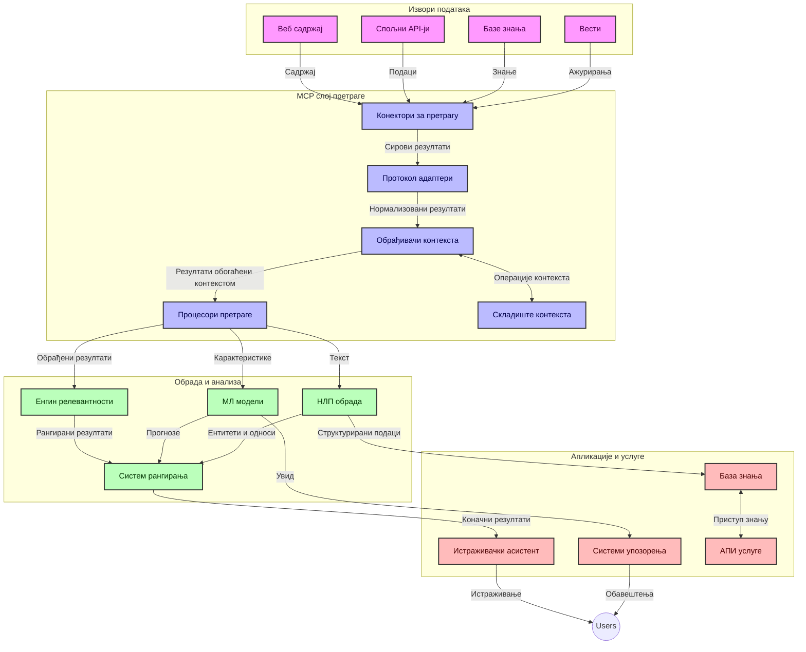
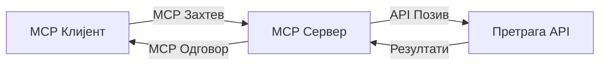
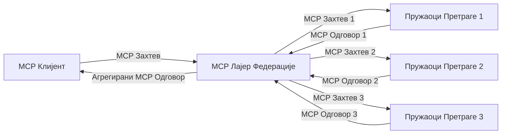
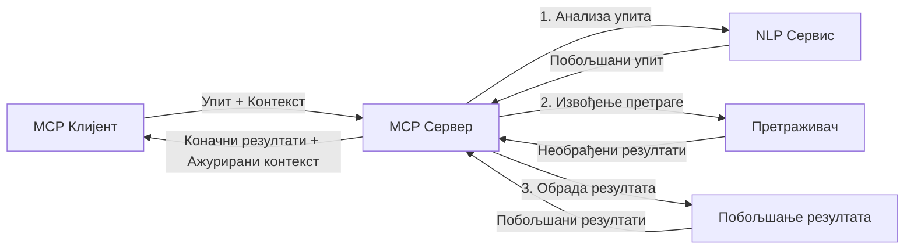

# Протокол контекста модела за претрагу веба у реалном времену

## Преглед

Претрага веба у реалном времену постала је неопходна у данашњем окружењу пуном информација, где апликације захтевају тренутни приступ ажурираним подацима са интернета како би пружиле релевантне и благовремене одговоре. Протокол контекста модела (MCP) представља значајан напредак у оптимизацији ових процеса претраге у реалном времену, побољшавајући ефикасност претраге, одржавајући контекстуални интегритет и унапређујући укупне перформансе система.

Овај модул истражује како MCP трансформише претрагу веба у реалном времену пружајући стандардизован приступ управљању контекстом између AI модела, претраживача и апликација.

### Шта ћете научити

У овом свеобухватном водичу сазнаћете:

- Како MCP ствара беспрекоран мост између AI модела и могућности претраге веба у реалном времену
- Архитектонске шаблоне за имплементацију ефикасних и скалабилних решења претраге са MCP
- Технике за очување контекста претраге кроз више упита и интеракција
- Практичне код имплементације у Питону и ЈаваСкрипту за различите сценарије претраге
- Методе за балансирање релевантности, актуелности и перформанси у системима претраге покретаним MCP-ом

## Увод у претрагу веба у реалном времену

Претрага веба у реалном времену је технолошки приступ који омогућава континуирано извршавање упита, процесирање и анализу веб-базираних информација чим се објаве или ажурирају, омогућавајући системима да пруже свеже и релевантне информације са минималним закашњењем. За разлику од традиционалних система претраге који раде на индексним подацима који могу бити стара више сати или дана, претрага у реалном времену обрађује податке у живом времену са мреже, пружајући увиде и информације које одражавају актуелно стање онлајн садржаја.

### Основни појмови претраге веба у реалном времену:

- **Континуирано процесирање упита**: Упити за претрагу се процесуирају у односу на стално ажуриране изворе података
- **Приоритизација актуелности**: Системи су дизајнирани да дају предност свежим информацијама
- **Баланс релевантности**: Одржавање равнотеже између релевантности и актуелности
- **Скалабилна архитектура**: Системи морају да поднесу променљиво оптерећење упитима и волумен података
- **Контекстуално разумевање**: Одржавање корисничког контекста кроз више итерација претраге је кључно за смислене резултате
- **Динамичка реформулација упита**: Прилагодно модификовање упита на основу контекста и претходних резултата
- **Интеграција више извора**: Комбиновaње резултата из више претраживача и веб извора
- **Семантичко разумевање**: Обрада упита и садржаја на основу значења, а не само кључних речи
- **Ранговање у реалном времену**: Континуирано подешавање ранга резултата како нове информације постају доступне

### Протокол контекста модела и претрага веба у реалном времену

Протокол контекста модела (MCP) решава неколико кључних изазова у окружењима претраге веба у реалном времену:

1. **Одржавање контекста претраге**: MCP стандардизује начин на који се контекст одржава између расподељених компоненти претраге, обезбеђујући да AI модели и процесни чворови имају приступ релевантној историји упита и корисничким преференцама.

2. **Ефикасно управљање упитима**: Обезбеђујући структуиране механизме за пренос контекста, MCP смањује трошак понављања контекста у свакој итерацији претраге.

3. **Интероперабилност**: MCP ствара заједнички језик за размену контекста између разноликих претраживачких технологија и AI модела, омогућавајући флексибилније и проширивије архитектуре.

4. **Контекст оптимизован за претрагу**: Имплементације MCP-а могу да приоритизују које су елементе контекста најрелевантнији за ефикасну претрагу, оптимизујући и перформансе и прецизност.

5. **Адаптивна обрада претраге**: Са правилним управљањем контекстом кроз MCP, системи претраге могу динамички прилагођавати процесирање на основу еволуирајућих потреба корисника и информацијских пејзажа.

У савременим апликацијама, од агрегатора вести до истраживачких асистената, интеграција MCP-а са веб претраживачким технологијама омогућава интелигентнију, контекстуално свесну претрагу која може пружати све релевантније резултате како интеракција са корисником напредује.

## Циљеви учења

До краја овог часа моћи ћете да:

- Разумете основе претраге веба у реалном времену и њене изазове у савременим апликацијама
- Објасните како Протокол контекста модела (MCP) унапређује могућности претраге у реалном времену
- Имплементирате решења претраге заснована на MCP-у користећи популарне оквире и API-је
- Дизајнирате и унапређујете скалабилне архитектуре претраге високих перформанси са MCP-ом
- Примените концепте MCP-а у различитим случајевима коришћења укључујући семантичку претрагу, истраживачку помоћ и претраживање уз подршку AI
- Процените нове трендове и будуће иновације у MCP-базираним претраживачким технологијама
- Развијете системе претраге свесне контекста који уче из интеракција корисника
- Интегришете капацитете претраге веба у AI асистенте користећи стандардизоване MCP протоколе
- Креирате мултифазне претраживачке цевоводе који поступно унапређују резултате на основу контекста
- Оптимизујете перформансе претраге уз одржавање свеобухватне свести о контексту

### Дефиниција и значај

Претрага веба у реалном времену подразумева континуирано извршавање упита, проналажење и доставу веб-базираних информација са минималним закашњењем. За разлику од традиционалних претраживача који периодично индетсирају и прегледају веб, претрага у реалном времену има за циљ да прикаже информације одмах када постану доступне, омогућавајући тренутни приступ најактуелнијем садржају.

Кључне карактеристике претраге веба у реалном времену укључују:

- **Свеже информације**: Приоритизација недавно објављеног садржаја и ажурирања
- **Континуирано процесирање**: Стално праћење нових информација
- **Прилагођавање упита**: Унапређење претраживачких упита на основу контекста и повратних информација
- **Одмах достава**: Пружање резултата претраге са минималним закашњењем
- **Задржавање контекста**: Надоградња претходних упита ради побољшања релевантности

### Изазови у традиционалној претрази веба

Традиционални приступи претрази веба суочавају се са више ограничења када се примењују у сценаријима у реалном времену:

1. **Фрагментација контекста**: Тешкоћа у одржавању контекста претраге кроз више упита
2. **Актуелност информација**: Изазови у приступу и приоритизацији најновијих информација
3. **Комплексност интеграције**: Проблеми с интероперабилношћу између система претраге и апликација
4. **Проблеми са латенцијом**: Балансирање свеобухватне претраге са захтевима за временом одговора
5. **Подударање релевантности**: Осигурање тачности и релевантности уз приоритет актуелности

## Разумевање Протокола контекста модела (MCP) за претрагу

### Шта је MCP у контексту претраге?

Протокол контекста модела (MCP) је стандардизовани комуникациони протокол дизајниран да олакша ефикасну интеракцију између AI модела и апликација. У контексту претраге веба у реалном времену, MCP пружа оквир за:

- Очување контекста претраге током секвенци упита
- Стандардизацију формата упита и резултата претраге
- Оптимизацију преноса параметара претраге и резултата
- Побршање комуникације између модела и претраживача

### Основне компоненте и архитектура

Архитектура MCP-а за претрагу веба у реалном времену састоји се од неколико кључних компоненти:

1. **Руковаоци контекстом упита**: Управљају и одржавају контекст претраге кроз више упита
2. **Процесори претраге**: Обрађују долазне претраживачке захтеве коришћењем техника свесних контекста
3. **Протоколски адаптери**: Претварају између различитих претраживачких API-ја уз очување контекста
4. **Продавница контекста**: Ефикасно складишти и преузима историју претраживања и преференције
5. **Претраживачки конектори**: Повезују се са разним претраживачима и веб API јевима



### Како MCP унапређује претрагу веба у реалном времену

MCP решава изазове традиционалне претраге веба кроз:

- **Контекстуална континуитет**: Одржавајући везе између упита током целе претраживачке сесије
- **Оптимизован пренос**: Смањење редунданије у параметрима претраге кроз интелигентно управљање контекстом
- **Стандартизовани интерфејси**: Пружање доследних API-ја за претраживачке компоненте
- **Смањена латенција**: Минимални трошкови процесирања кроз ефикасно управљање контекстом
- **Побољшана релевантност**: Побољшање релевантности претраге очувањем намере корисника кроз више упита

## Интеграција и имплементација

Системи претраге веба у реалном времену захтевају пажљив дизајн архитектуре и имплементацију како би одржали и перформансе и контекстуални интегритет. Протокол контекста модела пружа стандардизован приступ интеграцији AI модела и претраживачких технологија, омогућавајући софистицираније, контекстуално свесне претраживачке цевоводе.

### Преглед интеграције MCP-а у архитектуре претраге

Имплементација MCP-а у окружењима претраге веба у реалном времену укључује неколико кључних фактора:

1. **Серијализација контекста претраге**: MCP пружа ефикасне механизме за кодирање контекстуалних информација у претраживачким захтевима, обезбеђујући да суштински контекст прати упит кроз цео процесни ланац. Ово укључује стандардизоване формате серијализације оптимизоване за метаподатке везане за претрагу.

2. **Статфул процесирање претраге**: MCP омогућава интелигентно статфул процесирање одржавајући доследну репрезентацију контекста током више итерација претраге. Ово је нарочито вредно у мултифазним претраживачким цевоводима где унапређење контекста побољшава резултате.

3. **Проширење и унапређење упита**: Имплементације MCP-а у системима претраге могу олакшати софистицирано проширење и унапређење упита на основу акумулираног контекста, омогућавајући све релевантније резултате како сесија претраге напредује.

4. **Кеширање и приоритизација резултата**: Стандардизовањем руковања контекстом, MCP помаже управљању кеширањем и приоритизацијом резултата, омогућавајући компонентама да се прилагоде на основу еволуирајућег контекста претраге.

5. **Федерација и агрегат претраге**: MCP олакшава софистициранију федерацију претраге преко више позадинских система пружајући структуиране репрезентације претраживачког контекста, омогућавајући смисленију агрегацију резултата из различитих извора.

Имплементација MCP-а кроз различите претраживачке технологије ствара јединствен приступ управљању контекстом, смањујући потребу за прилагођеним интеграционим кодом док унапређује способност система да одржи значајан контекст како се упити за претрагу развијају.

### MCP у различитим имплементацијама претраге веба

Ови примери следе тренутну спецификацију MCP-а која се фокусира на JSON-RPC протокол са различитим транспортним механизмима. Код показује како можете реализовати прилагођене интеграције претраге уз пуну компатибилност са MCP протоколом.


<details>
<summary>Имплементација у Питону са општим претраживачким API-јем</summary>

```python
import asyncio
import json
import aiohttp
from typing import Dict, Any, Optional, List
from contextlib import asynccontextmanager
from collections.abc import AsyncIterator

# Импортујте стандардне МЦП библиотеке
from mcp.client.session import ClientSession
from mcp.client.streamable_http import streamablehttp_client
from mcp.types import TextContent, CreateMessageRequestParams, CreateMessageResult
from mcp.server.fastmcp import FastMCP

# Креирајте ФастМЦП сервер за претрагу на вебу
search_server = FastMCP("WebSearch")

# Класа за руковање операцијама претраге на вебу
class WebSearchHandler:
    def __init__(self, api_endpoint: str, api_key: str):
        self.api_endpoint = api_endpoint
        self.api_key = api_key
        self.session = None
        
    async def initialize(self):
        """Initialize the HTTP session"""
        self.session = aiohttp.ClientSession(
            headers={"Authorization": f"Bearer {self.api_key}"}
        )
    
    async def close(self):
        """Close the HTTP session"""
        if self.session:
            await self.session.close()
            
    async def perform_search(self, query: str, max_results: int = 5, 
                           include_domains: List[str] = None, 
                           exclude_domains: List[str] = None,
                           time_period: str = "any") -> Dict[str, Any]:
        """Perform web search using the search API"""
        # Конструишите параметре претраге
        search_params = {
            "q": query,
            "limit": max_results,
            "time": time_period
        }
        
        if include_domains:
            search_params["site"] = ",".join(include_domains)
            
        if exclude_domains:
            search_params["exclude_site"] = ",".join(exclude_domains)
        
        # Извршите захтев за претрагу
        try:
            async with self.session.get(
                self.api_endpoint,
                params=search_params
            ) as response:
                if response.status != 200:
                    error_text = await response.text()
                    raise Exception(f"Search API error: {response.status} - {error_text}")
                
                search_data = await response.json()
                
                # Претворите одговор специфичан за АПИ у стандардни формат
                results = []
                for item in search_data.get("results", []):
                    results.append({
                        "title": item.get("title", ""),
                        "url": item.get("url", ""),
                        "snippet": item.get("snippet", ""),
                        "date": item.get("published_date", ""),
                        "source": item.get("source", "")
                    })
                
                return {
                    "query": query,
                    "totalResults": len(results),
                    "results": results
                }
        except Exception as e:
            print(f"Search API request error: {e}")
            raise

# Иницијализујте руковалац претрагом
search_handler = WebSearchHandler(
    api_endpoint="https://api.search-service.example/search",
    api_key="your-api-key-here"
)

# Подесите животни век да бисте управљали руковаоцем претрагом
@asyncio.asynccontextmanager
async def app_lifespan(server: FastMCP):
    """Manage application lifecycle"""
    await search_handler.initialize()
    try:
        yield {"search_handler": search_handler}
    finally:
        await search_handler.close()

# Подесите животни век за сервер
search_server = FastMCP("WebSearch", lifespan=app_lifespan)

# Региструјте алатку за претрагу на вебу
@search_server.tool()
async def web_search(query: str, max_results: int = 5, 
                   include_domains: List[str] = None,
                   exclude_domains: List[str] = None,
                   time_period: str = "any") -> Dict[str, Any]:
    """
    Search the web for information
    
    Args:
        query: The search query
        max_results: Maximum number of results to return (default: 5)
        include_domains: List of domains to include in search results
        exclude_domains: List of domains to exclude from search results
        time_period: Time period for results ("day", "week", "month", "any")
        
    Returns:
        Dictionary containing search results
    """
    ctx = search_server.get_context()
    search_handler = ctx.request_context.lifespan_context["search_handler"]
    
    results = await search_handler.perform_search(
        query=query,
        max_results=max_results,
        include_domains=include_domains,
        exclude_domains=exclude_domains,
        time_period=time_period
    )
    
    return results

# Пример коришћења клијента
async def client_example():
    # Повежите се са сервером за претрагу користећи Стримабле ХТТП транспорт
    async with streamablehttp_client("http://localhost:8000/mcp") as (read, write, _):
        async with ClientSession(read, write) as session:
            # Иницијализујте везу
            await session.initialize()
            
            # Позовите алатку веб_претрага
            search_results = await session.call_tool(
                "web_search", 
                {
                    "query": "latest developments in AI and Model Context Protocol",
                    "max_results": 5,
                    "time_period": "day",
                    "include_domains": ["github.com", "microsoft.com"]
                }
            )
            
            print(f"Search results: {search_results}")

# Пример извршења сервера
if __name__ == "__main__":
    # Покрените сервер са Стримабле ХТТП транспортом
    search_server.run(transport="streamable-http")
```
</details> 

<details>
<summary>Имплементација у ЈаваСкрипту са претрагом у оквиру прегледача</summary>


```javascript
// Имплементација MCP сервера за веб претрагу
import { McpServer, ResourceTemplate } from '@modelcontextprotocol/sdk/server/mcp.js';
import { StreamableHTTPServerTransport } from '@modelcontextprotocol/sdk/server/streamableHttp.js';
import { z } from 'zod';

// Креирај MCP сервер за веб претрагу
const searchServer = new McpServer({
    name: "BrowserSearch",
    description: "A server that provides web search capabilities"
});

// Класа сервиса за претрагу
class SearchService {
    constructor(searchApiUrl, apiKey) {
        this.searchApiUrl = searchApiUrl;
        this.apiKey = apiKey;
    }

    async performSearch(parameters) {
        const {
            query = '',
            maxResults = 5,
            includeDomains = [],
            excludeDomains = [],
            timePeriod = 'any'
        } = parameters;
        
        // Конструиши URL за претрагу са параметрима
        const url = new URL(this.searchApiUrl);
        url.searchParams.append('q', query);
        url.searchParams.append('limit', maxResults);
        url.searchParams.append('time', timePeriod);
        
        if (includeDomains.length > 0) {
            url.searchParams.append('site', includeDomains.join(','));
        }
        
        if (excludeDomains.length > 0) {
            url.searchParams.append('exclude_site', excludeDomains.join(','));
        }
        
        try {
            const response = await fetch(url.toString(), {
                method: 'GET',
                headers: {
                    'Authorization': `Bearer ${this.apiKey}`,
                    'Content-Type': 'application/json'
                }
            });
            
            if (!response.ok) {
                const errorText = await response.text();
                throw new Error(`Search API error: ${response.status} - ${errorText}`);
            }
            
            const searchData = await response.json();
            
            // Претвори API-специфичан одговор у стандардни формат
            const results = searchData.results?.map(item => ({
                title: item.title || '',
                url: item.url || '',
                snippet: item.snippet || '',
                date: item.published_date || '',
                source: item.source || ''
            })) || [];
            
            return {
                query,
                totalResults: results.length,
                results
            };
        } catch (error) {
            console.error('Search API request error:', error);
            throw error;
        }
    }
}

// Инициализуј сервис за претрагу
const searchService = new SearchService(
    'https://api.search-service.example/search',
    'your-api-key-here'
);

// Постави провајдера контекста за сервер
searchServer.setContextProvider(() => {
    return {
        searchService
    };
});

// Региструј алат за веб претрагу
searchServer.tool({
    name: 'web_search',
    description: 'Search the web for information',
    parameters: {
        type: 'object',
        properties: {
            query: {
                type: 'string',
                description: 'The search query'
            },
            maxResults: {
                type: 'integer',
                description: 'Maximum number of results to return',
                default: 5
            },
            includeDomains: {
                type: 'array',
                items: { type: 'string' },
                description: 'List of domains to include in search results'
            },
            excludeDomains: {
                type: 'array',
                items: { type: 'string' },
                description: 'List of domains to exclude from search results'
            },
            timePeriod: {
                type: 'string',
                description: 'Time period for results',
                enum: ['day', 'week', 'month', 'any'],
                default: 'any'
            }
        },
        required: ['query']
    },
    handler: async (params, context) => {
        const { searchService } = context;
        return await searchService.performSearch(params);
    }
});

// Пример клијентског кода за повезивање на сервер за претрагу
import { Client } from '@modelcontextprotocol/sdk/client/index.js';
import { StreamableHTTPClientTransport } from '@modelcontextprotocol/sdk/client/streamableHttp.js';

async function connectToSearchServer() {
    // Повежи се са сервером за претрагу
    const transport = new StreamableHTTPClientTransport(
        new URL('http://localhost:8000/mcp')
    );
    
    const client = new Client({
        name: 'search-client',
        version: '1.0.0'
    });
    
    await client.connect(transport);
    
    // Покрени алат за претрагу
    const searchResults = await client.callTool({
        name: 'web_search',
        arguments: {
            query: 'Model Context Protocol implementation examples',
            maxResults: 10,
            timePeriod: 'week',
            includeDomains: ['github.com', 'docs.microsoft.com']
        }
    });
    
    console.log('Search results:', searchResults);
    
    // Очисти ресурсе
    await client.disconnect();
}

// Покрени сервер
const transport = new StreamableHTTPServerTransport();
await searchServer.connect(transport);
console.log('Search server running at http://localhost:8000/mcp');

// У посебном процесу или након што је сервер покренут
// connectToSearchServer().catch(console.error);
```
</details> 


## Изјава о примерима кода

> **Важна напомена**: Испод наведени примери кода демонстрирају интеграцију Протокола контекста модела (MCP) са функционалношћу претраге веба. Иако следе обрасце и структуре званичних MCP SDK-ова, они су поједностављени у образовне сврхе.
> 
> Ови примери показују:
> 
> 1. **Имплементацију у Питону**: Имплементацију FastMCP сервера која пружа алат за претрагу веба и повезује се са спољним претраживачким API-јем. Овај пример показује правилно управљање животним циклусом, руковање контекстом и имплементацију алата пратећи обрасце званичног MCP Python SDK-а. Сервер користи препоручени Streamable HTTP транспорт који је заменио старији SSE транспорт за продукцијска окружења.
> 
> 2. **Имплементацију у ЈаваСкрипту**: Имплементацију у TypeScript/JavaScript-у користећи FastMCP образац из званичног MCP TypeScript SDK-а за креирање сервера за претрагу с правилним дефиницијама алата и клијентским везама. Прати најновије препоручене обрасце за управљање сесијом и очување контекста.
> 
> Ови примери би захтевали додатно руковање грешкама, аутентификацију и специфичан код за интеграцију API-ја за продукцијско коришћење. Приказани крајњи тачке претраживачког API-ја (`https://api.search-service.example/search`) су замене и требало би да буду замењени стварним крајњим тачкама претраживачке услуге.
> 
> За комплетне детаље имплементације и најсавременије приступе,
> обратите се [званичној MCP спецификацији](https://modelcontextprotocol.io/specification/2026-07-28/)
> и документацији SDK-а.

## Основни појмови

### Оквир Протокола контекста модела (MCP)

У свом основу, Протокол контекста модела пружа стандардизовани начин за размену контекста између AI модела, апликација и сервиса. У претрази веба у реалном времену, овај оквир је есенцијалан за креирање кохерентних претраживачких искустава са више корака. Кључне компоненте су:

1. **Архитектура клијент-сервер**: MCP успоставља јасну подјелу између клијената претраге (захтеватеља) и сервера претраге (пружаоца), омогућавајући флексибилне моделe распоређивања.

2. **JSON-RPC комуникација**: Протокол користи JSON-RPC за размену порука, чинећи га компатибилним са веб технологијама и лако применљивим на различитим платформама.

3. **Управљање контекстом**: MCP дефинише структуиране методе за одржавање, ажурирање и коришћење контекста претраге кроз више интеракција.

4. **Дефиниције алата**: Претраживачке могућности су изложене као стандардизовани алати са јасно дефинисаним параметрима и вредностима повратка.

5. **Подршка за стриминг**: Протокол подржава стримовање резултата, што је кључно за претрагу у реалном времену где резултати могу пристизати постепено.

### Шаблони интеграције за претрагу веба

При интеграцији MCP-а са претрагом веба појављује се неколико шаблона:

#### 1. Директна интеграција пружаоца претраге



У овом шаблону, MCP сервер директно комуницира са једним или више претраживачких API-ја, преводећи MCP захтеве у API специфичне позиве и форматирајући резултате као MCP одговоре.

#### 2. Федеративна претрага са очувањем контекста



Овај шаблон дистрибуира упите за претрагу међу више MCP-компатибилних пружаоца претраге, од којих сваки може бити специјализован за различите типове садржаја или претраживачке могућности, док задржава уједињени контекст.

#### 3. Ланчана претрага ојачана контекстом



У овом шаблону, процес претраге је подељен у више фаза, са обогаћеним контекстом у сваком кораку, што резултује прогресивно релевантнијим резултатима.

### Компоненте контекста претраге

У претрази веба заснованој на MCP-у, контекст обично укључује:

- **Историју упита**: Претходни претраживачки упити у сесији
- **Корисничке преференције**: Језик, регион, подешавања безбедне претраге
- **Историју интеракција**: Који су резултати кликнути, време проведено на резултатима
- **Параметре претраге**: Филтери, редоследи сортирања и други модификатори претраге
- **Знање домена**: Контекст специфичан за тему релевантан претрази
- **Временски контекст**: Фактори релевантности засновани на времену
- **Преференције извора**: Поуздани или омиљени извори информација

## Случајеви употребе и апликације

### Истраживање и прикупљање информација

MCP унапређује токове рада истраживања кроз:

- Очување контекста истраживања кроз претраживачке сесије
- Омогућавање софистициранијих и контекстуално релевантнијих упита
- Подршку федерације претраге из више извора
- Олакшавање извлачења знања из резултата претраге

### Праћење вести и трендова у реалном времену

MCP-покретана претрага нуди предности за праћење вести:

- Откривање нових вести у скоро реалном времену
- Контекстуално филтрирање релевантних информација
- Праћење тема и ентитета преко више извора
- ПPersonalизовани обавештења о вестима на основу контекста корисника

### Претраживање и истраживање уз подршку AI

MCP креира нове могућности за претраживање уз подршку AI:

- Контекстуалне предлоге претраге базиране на активностима у прегледачу
- Беспријекорна интеграција претраге веба са асистентима покретаним великим језичким моделима (LLM)
- Унапређење претраге кроз више корака уз одржавање контекста
- Побољшано проверавање чињеница и верификација информација

## Будући трендови и иновације

### Еволуција MCP-а у претрази веба

Гледајући у будућност, очекујемо да се MCP развија како би одговорио на:


- **Мултимодално претраживање**: Интеграција претраживања текста, слике, аудија и видеа са очуваним контекстом
- **Децентрализовано претраживање**: Подршка дистрибуираним и федеративним претраживачким екосистемима
- **Приватност претраживања**: Механизми претраживања са очувањем приватности у контексту
- **Разумевање упита**: Дубинска семантичка анализа природних језичких претраживачких упита

### Потенцијални напредак у технологији

Нове технологије које ће обликовати будућност MCP претраживања:

1. **Невронске архитектуре претраживања**: Системи претраживања базирани на уграђивањима оптимизовани за MCP
2. **Персонализовани контекст претраживања**: Учење образаца претраживања појединачних корисника током времена
3. **Интеграција графова знања**: Контекстуално претраживање унапређено графовима знања специфичним за домен
4. **Прекумодални контекст**: Oчување контекста кроз различите модалитете претраживања

## Практичне вежбе

### Вежба 1: Подешавање основне MCP претраживачке линије

У овој вежби ћете научити како да:
- Конфигуришете основно MCP претраживачко окружење
- Имплементирате обрађиваче контекста за претраживање веба
- Тестирате и потврдите очување контекста кроз претраживачке итерације

### Вежба 2: Изградња истраживачког асистента са MCP претраживањем

Направите комплетну апликацију која:
- Обрађује истраживачка питања у природном језику
- Изводи претраживања веба са свешћу о контексту
- Синтетизује информације из више извора
- Приказује организоване резултате истраживања

### Вежба 3: Имплементација федерације претраживања из више извора са MCP

Напредна вежба која обухвата:
- Управа упитима свесна контекста на више претраживачких мотора
- Рангирање и агрегирање резултата
- Контекстуално дедуплицирање резултата претраживања
- Обраду метаподатака специфичних за извор

## Додатни ресурси

- [Спецификација Model Context Protocol](https://modelcontextprotocol.io/specification/2026-07-28/) - Званична спецификација MCP и детаљна документација протокола
- [Документација Model Context Protocol](https://modelcontextprotocol.io/) - Детаљни туторијали и водичи за имплементацију
- [MCP Python SDK](https://github.com/modelcontextprotocol/python-sdk) - Званична Python имплементација MCP протокола
- [MCP TypeScript SDK](https://github.com/modelcontextprotocol/typescript-sdk) - Званична TypeScript имплементација MCP протокола
- [MCP референтни сервери](https://github.com/modelcontextprotocol/servers) - Референтне имплементације MCP сервера
- [Документација Bing Web Search API](https://learn.microsoft.com/en-us/bing/search-apis/bing-web-search/overview) - Microsoft-ов веб претраживачки API
- [Google Custom Search JSON API](https://developers.google.com/custom-search/v1/overview) - Google-ов програмабилни претраживачки мотор
- [SerpAPI документација](https://serpapi.com/search-api) - API резултата претраживачких страница
- [Meilisearch документација](https://www.meilisearch.com/docs) - Отворени извор претраживачког мотора
- [Elasticsearch документација](https://www.elastic.co/guide/index.html) - Дистрибуирани претраживач и аналитички мотор
- [LangChain документација](https://python.langchain.com/docs/get_started/introduction) - Изградња апликација са LLM-овима

## Исходи учења

Завршетком овог модула бићете у могућности да:

- Разумете основе претраживања веба у реалном времену и његове изазове
- Објасните како Model Context Protocol (MCP) побољшава могућности претраживања веба у реалном времену
- Имплементирате решења за претраживање базирана на MCP користећи популарне оквире и API-је
- Дизајнирате и примените скалабилне и високо перформасне претраживачке архитектуре са MCP
- Примeните MCP концепте на различите случајеве коришћења укључујући семантичко претраживање, помоћ при истраживању и претраживање подржано вештачком интелигенцијом
- Процените нове трендове и будуће иновације у MCP-базираним претраживачким технологијама


### Разматрања у вези са поверењем и безбедношћу

Када имплементирате MCP-базирана решења за веб претраживање, имајте на уму ове важне принципе из MCP спецификације:

1. **Сагласност и контрола корисника**: Корисници морају јасно пристати и разумети све приступе и операције са подацима. Ово је посебно важно за имплементације веб претраживања које могу приступити спољним изворима података.

2. **Приватност података**: Обезбедите адекватно поступање са претраживачким упитима и резултатима, нарочито када могу садржати осетљиве информације. Имплементирајте одговарајуће контроле приступа за заштиту корисничких података.

3. **Безбедност алата**: Имплементирајте одговарајућу ауторизацију и валидацију за претраживачке алате, јер представљају потенцијалне безбедносне ризике због извођења произвољног кода. Описе понашања алата треба сматрати незваничним осим ако нису добијени са поузданог сервера.

4. **Јасна документација**: Обезбедите јасну документацију о могућностима, ограничењима и безбедносним разматрањима ваше MCP базиране имплементације претраживања, пратећи смернице из MCP спецификације.

5. **Јаке процедуре сагласности**: Изградите јаке токове сагласности и ауторизације који јасно објашњавају шта сваки алат ради пре него што овластите његову употребу, посебно за алате који комуницирају са спољним веб ресурсима.

За потпуне детаље о безбедности и разматрањима поверења MCP-а, погледајте
[званичну документацију](https://modelcontextprotocol.io/specification/2026-07-28/basic/security_best_practices).

## Шта следи

- [5.12 Entra ID аутентификација за Model Context Protocol сервере](../mcp-security-entra/README.md)

---

<!-- CO-OP TRANSLATOR DISCLAIMER START -->
**Изјава о одрицању одговорности**:
Овај документ је преведен коришћењем услуге за аутоматски превод [Co-op Translator](https://github.com/Azure/co-op-translator). Иако тежимо тачности, имајте у виду да аутоматски преводи могу садржати грешке или нетачности. Оригинални документ на његовом изворном језику треба сматрати ауторитативним извором. За критичне информације препоручује се професионални људски превод. Нисмо одговорни за било каква неспоразума или погрешна тумачења која произилазе из коришћења овог превода.
<!-- CO-OP TRANSLATOR DISCLAIMER END -->