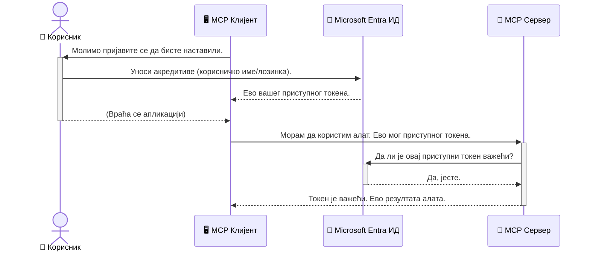

# Осигурање АИ радних токова: Ентра ИД аутентификација за Модел Контекст Протокол сервере

> [!NOTE]
> Удаљени серверски код у овој лекцији штити застареле `/sse` и `/message`
> крајње тачке и циља MCP `2025-11-25`. Сачувајте његове праксе идентификације и валидације токена,
> али користите `2026-07-28`-компатибилни Стриимабле HTTP транспорт за нове
> имплементације.

## Увод
Осигурање вашег Модел Контекст Протокол (MCP) сервера је подједнако важно као и закључавање главних врата куће. Остављање вашег MCP сервера отвореним изложиће ваше алате и податке неовлашћеном приступу, што може довести до сигурносних пропуста. Microsoft Entra ID пружа робусно решење за управљање идентитетима и приступом у облаку, помажући да само овлашћени корисници и апликације могу да комуницирају са вашим MCP сервером. У овом поглављу научићете како да заштитите своје АИ радне токове користећи Entra ID аутентификацију.

## Циљеви учења
До краја овог дела бићете у стању да:

- Разумете значај осигурања MCP сервера.
- Објасните основе Microsoft Entra ID и OAuth 2.0 аутентификације.
- Препознате разлику између јавних и поверљивих корисника.
- Имплементирате Entra ID аутентификацију у локалним (јавни клијент) и удаљеним (поверљиви клијент) MCP серверским сценаријима.
- Примените најбоље безбедносне праксе приликом развоја АИ радних токова.

## Безбедност и MCP

Баш као што не бисте оставили главна врата куће откључана, не бисте требали оставити MCP сервер отвореним за приступ свима. Осигурање ваших АИ радних токова је кључно за изградњу робусних, поузданих и безбедних апликација. Ово поглавље ће вас упознати с коришћењем Microsoft Entra ID за осигурање ваших MCP сервера, осигуравајући да само овлашћени корисници и апликације могу да приступе вашим алатима и подацима.

## Зашто је безбедност битна за MCP сервере

Замислите да ваш MCP сервер има алат који може слати имејлове или приступати бази података корисника. Несигуран сервер би значио да било ко може потенцијално да користи тај алат, што доводи до неовлашћеног приступа подацима, спама или других злонамерних активности.

Имплементирањем аутентификације осигуравате да сваки захтев према вашем серверу буде верификован, потврђујући идентитет корисника или апликације која упућује захтев. Ово је први и најважнији корак у осигурању ваших АИ радних токова.

## Увод у Microsoft Entra ID

[**Microsoft Entra ID**](https://adoption.microsoft.com/microsoft-security/entra/) је сервис за управљање идентитетима и приступом у облаку. Размотрите га као универзалног чувara безбедности ваших апликација. Он управља сложеним процесом верификације идентитета корисника (аутентификација) и одређује шта им је дозвољено да раде (ауторизација).

Коришћењем Entra ID можете:

- Омогућити безбедно пријављивање корисника.
- Заштитити API-је и сервисе.
- Управљати политикама приступа са централизоване локације.

За MCP сервере, Entra ID пружа робусно и широко поуздано решење за управљање оним ко може приступити могућностима вашег сервера.

---

## Разумевање магије: Како ради Entra ID аутентификација

Entra ID користи отворене стандарде као што је **OAuth 2.0** за управљање аутентификацијом. Иако детаљи могу бити сложени, основна идеја је једноставна и може се разумети кроз аналогију.

### Љубазан увод у OAuth 2.0: Кључ за парковача

Замислите OAuth 2.0 као услугу парковача за ваш аутомобил. Када стигнете у ресторан, не дајете парковачу главни кључ. Уместо тога, давате **кључ парковача** који има ограничена овлашћења — може да упали ауто и закључа врата, али не може да отвори пртљажник или касету за рукавице.

У овој аналогији:

- **Ви** сте **корисник**.
- **Ваш аутомобил** је **MCP сервер** са својим вредним алатима и подацима.
- **Парковач** је **Microsoft Entra ID**.
- **Службеник за паркинг** је **MCP клијент** (апликација која покушава да приступи серверу).
- **Кључ парковача** је **Access Token**.

Токен приступа је сигуран низ текста који MCP клијент добија од Entra ID након што се пријавите. Клијент тај токен затим предаје MCP серверу уз сваки захтев. Сервер може проверити токен да осигура да је захтев легитиман и да клијент има потребне дозволе, све без потребе да се рукује вашим стварним акредитивима (као што је ваша лозинка).

### Ток аутентификације

Овако процес функционише у пракси:



### Увођење Microsoft Authentication Library (MSAL)

Пре него што заронимо у код, важно је представити кључну компоненту коју ћете видети у примерима: **Microsoft Authentication Library (MSAL)**.

MSAL је библиотека коју је развио Microsoft и која програмерима олакшава руковање аутентификацијом. Уместо да пишете сав сложени код за управљање безбедносним токенима, управљање пријавама и освежавање сесија, MSAL обавља те послове.

Коришћење библиотеке као што је MSAL се топло препоручује зато што:

- **Безбедна је:** Имплементира индустријске стандарде и најбоље безбедносне праксе, смањујући ризик од рањивости у вашем коду.
- **Једностављује развој:** Скрета сложеност OAuth 2.0 и OpenID Connect протокола, омогућавајући вам да додате робусну аутентификацију у апликацију са само неколико линија кода.
- **Подржавана је:** Microsoft активно одржава и ажурира MSAL да би одговорио на нове безбедносне претње и промене платформи.

MSAL подржава велики број језика и оквира за апликације, укључујући .NET, JavaScript/TypeScript, Python, Java, Go и мобилне платформе попут iOS и Android. То значи да можете користити исти доследни образац аутентификације у целом свом технолошком снопу.

За више информација о MSAL, можете погледати званичну [MSAL прегледну документацију](https://learn.microsoft.com/entra/identity-platform/msal-overview).

---

## Осигуравање вашег MCP сервера са Entra ID: Вођство корак по корак

Хајде да прођемо како да осигурате локални MCP сервер (који комуницира преко `stdio`) користећи Entra ID. Овај пример користи **јавног клијента**, који је погодан за апликације које раде на машини корисника, као што је десктоп апликација или локални развојни сервер.

### Сценарио 1: Осигуравање локалног MCP сервера (са јавним клијентом)

У овом сценарију, погледаћемо MCP сервер који ради локално, комуницира преко `stdio` и користи Entra ID да аутентификује корисника пре него што му дозволи приступ алатима. Сервер ће имати један алат који преузима информације о профилу корисника из Microsoft Graph API.

#### 1. Подешавање апликације у Entra ID

Пре него што напишете било какав код, потребно је да региструјете вашу апликацију у Microsoft Entra ID. Ово обавештава Entra ID о вашој апликацији и даје јој дозволу да користи сервис аутентификације.

1. Идите на **[Microsoft Entra портал](https://entra.microsoft.com/)**.
2. Идите на **App registrations** и кликните **New registration**.
3. Дајте апликацији име (нпр. „My Local MCP Server“).
4. За **Supported account types**, изаберите **Accounts in this organizational directory only**.
5. Можете оставити **Redirect URI** празно за овај пример.
6. Кликните **Register**.

Када је апликација регистрована, запишите **Application (client) ID** и **Directory (tenant) ID**. Биће вам потребни у вашем коду.

#### 2. Код: Разрада

Погледајмо кључне делове кода који се баве аутентификацијом. Пун код овог примера доступан је у фасцикли [Entra ID - Local - WAM](https://github.com/Azure-Samples/mcp-auth-servers/tree/main/src/entra-id-local-wam) репозиторијума [mcp-auth-servers GitHub](https://github.com/Azure-Samples/mcp-auth-servers).

**`AuthenticationService.cs`**

Ова класа је задужена за руковање интеракцијом са Entra ID.

- **`CreateAsync`**: Ова метода иницијализује `PublicClientApplication` из MSAL (Microsoft Authentication Library). Конфигурисана је са `clientId` и `tenantId` ваше апликације.
- **`WithBroker`**: Ово омогућава коришћење брокера (као што је Windows Web Account Manager), који пружа сигурније и беспрекорно једноставно пријављивање.
- **`AcquireTokenAsync`**: Ово је примарна метода. Прво покушава да добије токен тишином (што значи да корисник не мора поново да се пријављује ако већ има валидну сесију). Ако тишина не успе, тражи се интерактивна пријава корисника.

```csharp
// Simplified for clarity
public static async Task<AuthenticationService> CreateAsync(ILogger<AuthenticationService> logger)
{
    var msalClient = PublicClientApplicationBuilder
        .Create(_clientId) // Your Application (client) ID
        .WithAuthority(AadAuthorityAudience.AzureAdMyOrg)
        .WithTenantId(_tenantId) // Your Directory (tenant) ID
        .WithBroker(new BrokerOptions(BrokerOptions.OperatingSystems.Windows))
        .Build();

    // ... cache registration ...

    return new AuthenticationService(logger, msalClient);
}

public async Task<string> AcquireTokenAsync()
{
    try
    {
        // Try silent authentication first
        var accounts = await _msalClient.GetAccountsAsync();
        var account = accounts.FirstOrDefault();

        AuthenticationResult? result = null;

        if (account != null)
        {
            result = await _msalClient.AcquireTokenSilent(_scopes, account).ExecuteAsync();
        }
        else
        {
            // If no account, or silent fails, go interactive
            result = await _msalClient.AcquireTokenInteractive(_scopes).ExecuteAsync();
        }

        return result.AccessToken;
    }
    catch (Exception ex)
    {
        _logger.LogError(ex, "An error occurred while acquiring the token.");
        throw; // Optionally rethrow the exception for higher-level handling
    }
}
```

**`Program.cs`**

Овде се поставља MCP сервер и интегрише аутентификациони сервис.

- **`AddSingleton<AuthenticationService>`**: Овим се региструје `AuthenticationService` у контенеру за dependency injection, тако да га други делови апликације (као што је наш алат) могу користити.
- **`GetUserDetailsFromGraph` алат**: Овај алат захтева инстанцу `AuthenticationService`. Пре било каквог рада, позива `authService.AcquireTokenAsync()` да добије валидан токен приступа. Ако је аутентификација успешна, користи токен за позив Microsoft Graph API-ју и преузима корисничке податке.

```csharp
// Simplified for clarity
[McpServerTool(Name = "GetUserDetailsFromGraph")]
public static async Task<string> GetUserDetailsFromGraph(
    AuthenticationService authService)
{
    try
    {
        // This will trigger the authentication flow
        var accessToken = await authService.AcquireTokenAsync();

        // Use the token to create a GraphServiceClient
        var graphClient = new GraphServiceClient(
            new BaseBearerTokenAuthenticationProvider(new TokenProvider(authService)));

        var user = await graphClient.Me.GetAsync();

        return System.Text.Json.JsonSerializer.Serialize(user);
    }
    catch (Exception ex)
    {
        return $"Error: {ex.Message}";
    }
}
```

#### 3. Како све функционише заједно

1. Када MCP клијент покуша да користи `GetUserDetailsFromGraph` алат, он прво позива `AcquireTokenAsync`.
2. `AcquireTokenAsync` покреће MSAL да провери валидан токен.
3. Ако не пронађе токен, MSAL преко брокера ће тражити од корисника да се пријави помоћу Entra ID налога.
4. Када се корисник пријави, Entra ID издаје токен приступа.
5. Алат добија токен и користи га за сигуран позив Microsoft Graph API-ју.
6. Подaци о кориснику се враћају MCP клијенту.

Овај процес обезбеђује да само аутентификовани корисници могу да користе алат, ефикасно осигуравајући ваш локални MCP сервер.

### Сценарио 2: Осигуравање удаљеног MCP сервера (са поверљивим клијентом)

Када ваш MCP сервер ради на удаљеној машини (као што је cloud сервер) и комуницира преко протокола као што је HTTP Streaming, безбедносни захтеви су другачији. У овом случају треба користити **поверљиви клијент** и **Authorization Code Flow**. Ово је безбеднији метод јер тајне апликације никада нису изложене претраживачу.

Овај пример користи TypeScript-базирани MCP сервер који користи Express.js за руковање HTTP захтевима.

#### 1. Подешавање апликације у Entra ID

Подешавање у Entra ID је слично као код јавног клијента, али са једном виталном разликом: потребно је направити **taјни клијента**.

1. Идите на **[Microsoft Entra портал](https://entra.microsoft.com/)**.
2. У регистрацији апликације идите на картицу **Certificates & secrets**.
3. Кликните **New client secret**, дајте опис и кликните **Add**.
4. **Важно:** Одмах копирајте вредност тајне. Више нећете имати прилику да је видите.
5. Такође морате конфигурисати **Redirect URI**. Идите на картицу **Authentication**, кликните **Add a platform**, изаберите **Web** и унесите redirect URI апликације (нпр. `http://localhost:3001/auth/callback`).

> **⚠️ Важно безбедносно упозорење:** За продукцијске апликације Microsoft снажно препоручује коришћење метода аутентификације без тајни, као што су **Managed Identity** или **Workload Identity Federation**, уместо клијентских тајни. Клијентске тајне представљају безбедносни ризик јер могу бити изложене или компромитоване. Managed identities пружају безбеднији приступ елиминишући потребу за чувањем акредитива у коду или конфигурацији.
>
> За више информација о managed identities и како их имплементирати, погледајте [Преглед Managed identities за Azure ресурсе](https://learn.microsoft.com/entra/identity/managed-identities-azure-resources/overview).

#### 2. Код: Разрада

Овај пример користи приступ базиран на сесијама. Када се корисник аутентификује, сервер чува access token и refresh token у сесији и даје кориснику сессион токен. Тај сесијски токен се затим користи за наредне захтеве. Пун код овог примера доступан је у фасцикли [Entra ID - Confidential client](https://github.com/Azure-Samples/mcp-auth-servers/tree/main/src/entra-id-cca-session) репозиторијума [mcp-auth-servers GitHub](https://github.com/Azure-Samples/mcp-auth-servers).

**`Server.ts`**

Овај фајл поставља Express сервер и MCP транспортни слој.

- **`requireBearerAuth`**: Ово је middleware који штити крајње тачке `/sse` и `/message`. Проверава валидан bearer токен у заглављу `Authorization` захтева.
- **`EntraIdServerAuthProvider`**: Ово је прилагођена класа која имплементира интерфејс `McpServerAuthorizationProvider`. Задужена је за управљање OAuth 2.0 протоком.
- **`/auth/callback`**: Ова крајња тачка обрађује преусмеравање из Entra ID након што се корисник аутентификовао. Мења authorization код за access token и refresh token.

```typescript
// Поједностављено ради јасноће
const app = express();
const { server } = createServer();
const provider = new EntraIdServerAuthProvider();

// Заштитите SSE крајњу тачку
app.get("/sse", requireBearerAuth({
  provider,
  requiredScopes: ["User.Read"]
}), async (req, res) => {
  // ... повежите се на транспорт ...
});

// Заштитите крајњу тачку поруке
app.post("/message", requireBearerAuth({
  provider,
  requiredScopes: ["User.Read"]
}), async (req, res) => {
  // ... обрадите поруку ...
});

// Обрадите OAuth 2.0 повратну функцију
app.get("/auth/callback", (req, res) => {
  provider.handleCallback(req.query.code, req.query.state)
    .then(result => {
      // ... обрадите успех или неуспех ...
    });
});
```

**`Tools.ts`**

Овај фајл дефинише алате које MCP сервер пружа. Алат `getUserDetails` је сличан оном из претходног примера, али узима токен приступа из сесије.

```typescript
// Поједностављено ради јасноће
server.setRequestHandler(CallToolRequestSchema, async (request) => {
  const { name } = request.params;
  const context = request.params?.context as { token?: string } | undefined;
  const sessionToken = context?.token;

  if (name === ToolName.GET_USER_DETAILS) {
    if (!sessionToken) {
      throw new AuthenticationError("Authentication token is missing or invalid. Ensure the token is provided in the request context.");
    }

    // Узми Entra ID токен из продавнице сесије
    const tokenData = tokenStore.getToken(sessionToken);
    const entraIdToken = tokenData.accessToken;

    const graphClient = Client.init({
      authProvider: (done) => {
        done(null, entraIdToken);
      }
    });

    const user = await graphClient.api('/me').get();

    // ... врати детаље о кориснику ...
  }
});
```

**`auth/EntraIdServerAuthProvider.ts`**

Ова класа управља логиком за:

- Преусмеравање корисника на Entra ID страницу за пријаву.
- Размену authorization кода за токен приступа.
- Складиштење токена у `tokenStore`.
- Освежавање токена приступа када истекне.


#### 3. Како све ово функционише заједно

1. Када корисник први пут покуша да се повеже на MCP сервер, `requireBearerAuth` middleware ће уочити да нема важећу сесију и преусмериће га на страницу за пријаву у Entra ID.
2. Корисник се пријављује својим Entra ID налогом.
3. Entra ID преусмерава корисника назад на `/auth/callback` крајњу тачку са ауторизационим кодом.
4. Сервер размењује код за приступни токен и освежавајући токен, чува их и креира сесијски токен који се шаље клијенту.
5. Клијент сада може да користи овај сесијски токен у заглављу `Authorization` за све будуће захтеве ка MCP серверу.
6. Када се позове алатка `getUserDetails`, она користи сесијски токен да би приступила Entra ID приступном токену, а затим га користи за позив Microsoft Graph API-ja.

Овај ток је сложенији од јавног клијентског тока, али је неопходан за крајње тачке које су јавне на интернету. Пошто су удаљени MCP сервери доступни преко јавног интернета, потребне су јаче безбедносне мере ради заштите од неовлашћеног приступа и потенцијалних напада.


## Најбоље праксе безбедности

- **Увек користите HTTPS**: Енкриптујте комуникацију између клијента и сервера да бисте заштитили токене од пресретања.
- **Имплементирајте контролу приступа засновану на улогама (RBAC)**: Не проверавајте само *да ли* је корисник аутентификован; проверите *шта* му је дозвољено да ради. Можете дефинисати улоге у Entra ID и проверити их у вашем MCP серверу.
- **Пратите и ревидирајте**: Забележите све догађаје аутентификације како бисте могли да детектујете и реагујете на сумњиве активности.
- **Реагујте на ограничења и успоравања**: Microsoft Graph и други API-ји имају ограничења учесталости позива како би спречили злоупотребу. Имплементирајте експоненцијално поновно покушавање и логику поновног покушаја у вашем MCP серверу да бисте лепо обрадили HTTP 429 (Превише захтева). Размотрите кеширање често приступаних података ради смањења броја API позива.
- **Безбедно чувајте токене**: Складиштите приступне и освежавајуће токене на безбедан начин. За локалне апликације користите системске безбедносне механизме. За серверске апликације размислите о употреби енкриптованог складишта или сервиса за управљање кључевима као што је Azure Key Vault.
- **Обрада истека токена**: Приступни токени имају ограничен рок трајања. Имплементирајте аутоматско освежавање токена коришћењем освежавајућих токена како бисте одржали беспрекидан кориснички доживљај без поновне аутентификације.
- **Размотрите употребу Azure API Management**: Иако имплементација безбедности директно у вашем MCP серверу пружа фину контролу, API Gateway-ји као што је Azure API Management могу аутоматски решити многе безбедносне проблеме, укључујући аутентификацију, ауторизацију, ограничења учесталости и праћење. Они пружају централизовани безбедносни слој који стоји између ваших клијената и MCP сервера. За више детаља о коришћењу API Gateway-ја са MCP, погледајте наш [Azure API Management Your Auth Gateway For MCP Servers](https://techcommunity.microsoft.com/blog/integrationsonazureblog/azure-api-management-your-auth-gateway-for-mcp-servers/4402690).


## Кључне поуке

- Заштита вашег MCP сервера је кључна за заштиту података и алата.
- Microsoft Entra ID пружа поуздано и скалабилно решење за аутентификацију и ауторизацију.
- Користите **јавног клијента** за локалне апликације и **поверљивог клијента** за удаљене сервере.
- **Authorization Code Flow** је најбезбеднија опција за веб апликације.


## Вежба

1. Размислите о MCP серверу који бисте могли градити. Да ли би то био локални сервер или удаљени сервер?
2. Обзиром на ваш одговор, да ли бисте користили јавног или поверљивог клијента?
3. Коју дозволу би ваш MCP сервер захтевао да изврши радње према Microsoft Graph-у?


## Практичне вежбе

### Вежба 1: Региструјте апликацију у Entra ID
Идите на портал Microsoft Entra.
Региструјте нову апликацију за ваш MCP сервер.
Запишите Application (client) ID и Directory (tenant) ID.

### Вежба 2: Обезбедите локални MCP сервер (јавни клијент)
- Пратите пример кода за интеграцију MSAL (Microsoft Authentication Library) за аутентификацију корисника.
- Тестирајте ток аутентификације позивајући MCP алатку која преузима детаље корисника из Microsoft Graph-а.

### Вежба 3: Обезбедите удаљени MCP сервер (поверљиви клијент)
- Региструјте поверљивог клијента у Entra ID и направите client secret.
- Конфигуришите ваш Express.js MCP сервер да користи Authorization Code Flow.
- Тестирајте заштићене крајње тачке и потврдите приступ на основу токена.

### Вежба 4: Примените најбоље праксе безбедности
- Укључите HTTPS за ваш локални или удаљени сервер.
- Имплементирајте контролу приступа засновану на улогама (RBAC) у логици вашег сервера.
- Додајте обраду истека токена и безбедно чување токена.

## Ресурси

1. **MSAL Преглед документације**  
   Научите како Microsoft Authentication Library (MSAL) омогућава сигурно добијање токена на различитим платформама:  
   [MSAL Overview on Microsoft Learn](https://learn.microsoft.com/en-gb/entra/msal/overview)

2. **Azure-Samples/mcp-auth-servers GitHub Репозиторијум**  
   Референце имплементације MCP сервера који демонстрирају токове аутентификације:  
   [Azure-Samples/mcp-auth-servers on GitHub](https://github.com/Azure-Samples/mcp-auth-servers)

3. **Преглед Managed Identities за Azure ресурсе**  
   Разумите како елиминисати тајне коришћењем системских или кориснички додељених managed identities:  
   [Managed Identities Overview on Microsoft Learn](https://learn.microsoft.com/en-us/entra/identity/managed-identities-azure-resources/)

4. **Azure API Management: Ваш Auth Gateway за MCP сервере**  
   Детаљан увид у коришћење APIM-а као сигурног OAuth2 gateway-а за MCP сервере:  
   [Azure API Management Your Auth Gateway For MCP Servers](https://techcommunity.microsoft.com/blog/integrationsonazureblog/azure-api-management-your-auth-gateway-for-mcp-servers/4402690)

5. **Референца дозвола за Microsoft Graph**  
   Комплетна листа делегираних и апликацијских дозвола за Microsoft Graph:  
   [Microsoft Graph Permissions Reference](https://learn.microsoft.com/zh-tw/graph/permissions-reference)


## Очекивани исходи учења
Након завршетка овог одељка моћи ћете да:

- Објасните зашто је аутентификација кључна за MCP сервере и AI токове рада.
- Подесите и конфигуришете Entra ID аутентификацију за локалне и удаљене MCP сервере.
- Изаберете одговарајући тип клијента (јавни или поверљиви) на основу типа сервера.
- Имплементирате сигурне праксе програмирања, укључујући чување токена и ауторизацију засновану на улогама.
- Са увереношћу заштитите свој MCP сервер и његове алате од неовлашћеног приступа.

## Шта следи

- [5.13 Model Context Protocol (MCP) интеграција са Microsoft Foundry](../mcp-foundry-agent-integration/README.md)

---

<!-- CO-OP TRANSLATOR DISCLAIMER START -->
**Изјава о одрицању одговорности**:
Овај документ је преведен коришћењем услуге за аутоматски превод [Co-op Translator](https://github.com/Azure/co-op-translator). Иако тежимо тачности, имајте у виду да аутоматски преводи могу садржати грешке или нетачности. Оригинални документ на његовом изворном језику треба сматрати ауторитативним извором. За критичне информације препоручује се професионални људски превод. Нисмо одговорни за било каква неспоразума или погрешна тумачења која произилазе из коришћења овог превода.
<!-- CO-OP TRANSLATOR DISCLAIMER END -->