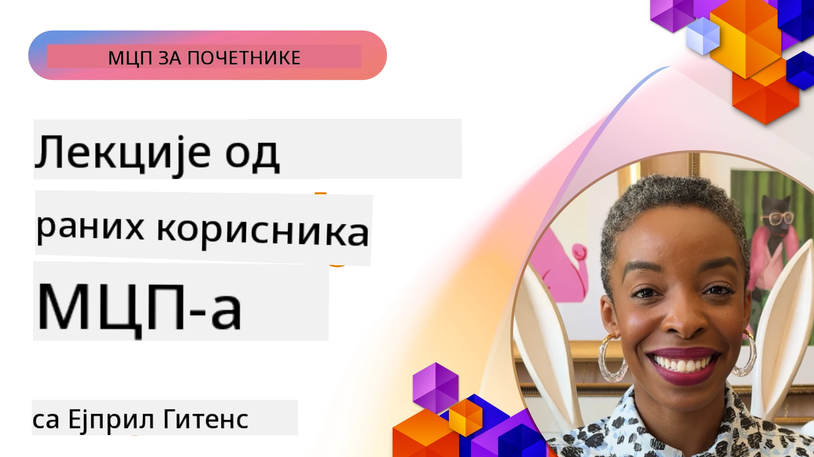

# 🌟 Поучне лекције од раних усвајача

[](https://youtu.be/jds7dSmNptE)

_(Кликните на слику изнад да бисте погледали видео о овој лекцији)_

## 🎯 Шта овај модул покрива

Овај модул истражује како прве организације и програмери користе Протокол контекста модела (MCP) да реше стварне изазове и подстакну иновације. Кроз детаљне студије случајева, практичне пројекте и конкретне примере, сазнаћете како MCP омогућава безбедну, скалабилну интеграцију вештачке интелигенције која повезује језичке моделе, алате и пословне податке.

### 📚 Видите MCP у акцији

Желите да видите како се ови принципи примењују на алатима спремним за продукцију? Погледајте наш [**10 Microsoft MCP сервера који трансформишу продуктивност програмера**](microsoft-mcp-servers.md), који приказује стварне Microsoft MCP сервере које можете користити данас.

## Преглед

Ова лекција истражује како су први усвајачи искористили Протокол контекста модела (MCP) да реше стварне изазове и покрену иновације у различитим индустријама. Кроз детаљне студије случајева и практичне пројекте, видећете како MCP омогућава стандартизовану, безбедну и скалабилну интеграцију вештачке интелигенције — повезујући велике језичке моделе, алате и пословне податке у јединствени оквир. Стећи ћете практично искуство у дизајнирању и изградњи решења заснованих на MCP-у, научити из проверених образаца имплементације и открити најбоље праксе за примену MCP-а у продукционим окружењима. Лекција такође истиче нове трендове, будуће правце и ресурсе отвореног кода како бисте остали у току с MCP технологијом и њеним еволуирајућим екосистемом.

## Циљеви учења

- Анализирати реалне имплементације MCP-а у различитим индустријама
- Дизајнирати и изградити потпуне апликације засноване на MCP-у
- Истражити нове трендове и будуће смернице у MCP технологији
- Применити најбоље праксе у стварним развојним сценаријима

## Реалне MCP имплементације

### Студија случаја 1: Аутоматизација корисничке подршке за предузећа

Мултинационална корпорација имплементирала је решење засновано на MCP-у за стандардизацију интеракција вештачке интелигенције у својим системима за корисничку подршку. Ово им је омогућило:

- Креирање јединственог интерфејса за више добављача великих језичких модела
- Одржавање доследног управљања упутствима у различитим одељењима
- Имплементацију робусне безбедности и контрола усклађености
- Лако пребацивање између различитих AI модела према специфичним потребама

**Техничка имплементација:**

```python
# Python MCP сервер имплементација за корисничку подршку
import logging
import asyncio
from modelcontextprotocol import create_server, ServerConfig
from modelcontextprotocol.server import MCPServer
from modelcontextprotocol.transports import create_http_transport
from modelcontextprotocol.resources import ResourceDefinition
from modelcontextprotocol.prompts import PromptDefinition
from modelcontextprotocol.tool import ToolDefinition

# Конфигуришите логовање
logging.basicConfig(level=logging.INFO)

async def main():
    # Креирајте конфигурацију сервера
    config = ServerConfig(
        name="Enterprise Customer Support Server",
        version="1.0.0",
        description="MCP server for handling customer support inquiries"
    )
    
    # Иницијализујте MCP сервер
    server = create_server(config)
    
    # Регистроване базе знања ресурса
    server.resources.register(
        ResourceDefinition(
            name="customer_kb",
            description="Customer knowledge base documentation"
        ),
        lambda params: get_customer_documentation(params)
    )
    
    # Регистровани шаблони упита
    server.prompts.register(
        PromptDefinition(
            name="support_template",
            description="Templates for customer support responses"
        ),
        lambda params: get_support_templates(params)
    )
    
    # Регистровани алати за подршку
    server.tools.register(
        ToolDefinition(
            name="ticketing",
            description="Create and update support tickets"
        ),
        handle_ticketing_operations
    )
    
    # Покрените сервер са HTTP транспортом
    transport = create_http_transport(port=8080)
    await server.run(transport)

if __name__ == "__main__":
    asyncio.run(main())
```

**Резултати:** Смањење трошкова модела за 30%, побољшана конзистентност одговора за 45% и повећана усклађеност у оквиру глобалног пословања.

### Студија случаја 2: Помоћник за дијагностику у здравству

Пружаоц услуга у здравству развио је MCP инфраструктуру за интеграцију више специјализованих медицинских AI модела уз обезбеђење заштите осетљивих података пацијената:

- Беспрекорно прелазак између општих и специјализованих медицинских модела
- Строге контроле приватности и ревизијски трагови
- Интеграција са постојећим системима електронских здравствених евиденција (EHR)
- Доследно креирање упутстава за медицинску терминологију

**Техничка имплементација:**

```csharp
// C# MCP host application implementation in healthcare application
using Microsoft.Extensions.DependencyInjection;
using ModelContextProtocol.SDK.Client;
using ModelContextProtocol.SDK.Security;
using ModelContextProtocol.SDK.Resources;

public class DiagnosticAssistant
{
    private readonly MCPHostClient _mcpClient;
    private readonly PatientContext _patientContext;
    
    public DiagnosticAssistant(PatientContext patientContext)
    {
        _patientContext = patientContext;
        
        // Configure MCP client with healthcare-specific settings
        var clientOptions = new ClientOptions
        {
            Name = "Healthcare Diagnostic Assistant",
            Version = "1.0.0",
            Security = new SecurityOptions
            {
                Encryption = EncryptionLevel.Medical,
                AuditEnabled = true
            }
        };
        
        _mcpClient = new MCPHostClientBuilder()
            .WithOptions(clientOptions)
            .WithTransport(new HttpTransport("https://healthcare-mcp.example.org"))
            .WithAuthentication(new HIPAACompliantAuthProvider())
            .Build();
    }
    
    public async Task<DiagnosticSuggestion> GetDiagnosticAssistance(
        string symptoms, string patientHistory)
    {
        // Create request with appropriate resources and tool access
        var resourceRequest = new ResourceRequest
        {
            Name = "patient_records",
            Parameters = new Dictionary<string, object>
            {
                ["patientId"] = _patientContext.PatientId,
                ["requestingProvider"] = _patientContext.ProviderId
            }
        };
        
        // Request diagnostic assistance using appropriate prompt
        var response = await _mcpClient.SendPromptRequestAsync(
            promptName: "diagnostic_assistance",
            parameters: new Dictionary<string, object>
            {
                ["symptoms"] = symptoms,
                patientHistory = patientHistory,
                relevantGuidelines = _patientContext.GetRelevantGuidelines()
            });
            
        return DiagnosticSuggestion.FromMCPResponse(response);
    }
}
```

**Резултати:** Побољшани предлози за дијагнозу за лекаре уз пуну усклађеност са HIPAA и значајно смањен број промена контекста између система.

### Студија случаја 3: Анализа ризика у финансијским услугама

Финансијска институција имплементирала је MCP за стандардизацију процеса анализе ризика у различитим одељењима:

- Креиран јединствени интерфејс за моделe кредитног ризика, детекције преваре и инвестиционог ризика
- Имплементиране строге контроле приступа и верзионисање модела
- Обезбеђена ревизија свих AI препорука
- Одржаван доследан формат података у различитим системима

**Техничка имплементација:**

```java
// Јава MCP сервер за процену финансијских ризика
import org.mcp.server.*;
import org.mcp.security.*;

public class FinancialRiskMCPServer {
    public static void main(String[] args) {
        // Креирај MCP сервер са функцијама за финансијску усаглашеност
        MCPServer server = new MCPServerBuilder()
            .withModelProviders(
                new ModelProvider("risk-assessment-primary", new AzureOpenAIProvider()),
                new ModelProvider("risk-assessment-audit", new LocalLlamaProvider())
            )
            .withPromptTemplateDirectory("./compliance/templates")
            .withAccessControls(new SOCCompliantAccessControl())
            .withDataEncryption(EncryptionStandard.FINANCIAL_GRADE)
            .withVersionControl(true)
            .withAuditLogging(new DatabaseAuditLogger())
            .build();
            
        server.addRequestValidator(new FinancialDataValidator());
        server.addResponseFilter(new PII_RedactionFilter());
        
        server.start(9000);
        
        System.out.println("Financial Risk MCP Server running on port 9000");
    }
}
```

**Резултати:** Побољшана усклађеност са регулаторним стандардима, 40% бржи циклуси имплементације модела и побољшана конзистентност процене ризика у одељењима.

### Студија случаја 4: Microsoft Playwright MCP сервер за аутоматизацију прегледача

Microsoft је развио [Playwright MCP сервер](https://github.com/microsoft/playwright-mcp) који омогућава безбедну, стандардизовану аутоматизацију прегледача путем Протокола контекста модела. Овај сервер спреман за продукцију омогућава AI агентима и великим језичким моделима да контролишу веб прегледаче на контролисан, ревидован и проширив начин — омогућавајући случајеве попут аутоматизованог веб тестирања, извлачења података и потпуних радних токова.

> **🎯 Алат спреман за продукцију**
> 
> Ова студија случаја приказује стварни MCP сервер који можете користити данас! Сазнајте више о Playwright MCP серверу и још 9 других Microsoft MCP сервера у нашем [**Водичу за Microsoft MCP сервере**](microsoft-mcp-servers.md#8--playwright-mcp-server).

**Кључне карактеристике:**
- Пружа могућности аутоматизације прегледача (навигација, попуњавање форми, снимање слика екрана итд.) као MCP алате
- Имплементира строге контроле приступа и изолацију како би спречио неовлашћене радње
- Пружа детаљне евиденције свих интеракција са прегледачем
- Подржава интеграцију са Azure OpenAI и другим добављачима великих језичких модела за аутоматизацију вођену агентима
- Погонски мотор Coding агента GitHub Copilot-а са могућностима прегледања веба

**Техничка имплементација:**

```typescript
// TypeScript: Регистрација Playwright алата за аутоматизацију прегледача у MCP серверу
import { createServer, ToolDefinition } from 'modelcontextprotocol';
import { launch } from 'playwright';

const server = createServer({
  name: 'Playwright MCP Server',
  version: '1.0.0',
  description: 'MCP server for browser automation using Playwright'
});

// Региструјте алат за навигацију до УРЛ-а и снимање снимка екрана
server.tools.register(
  new ToolDefinition({
    name: 'navigate_and_screenshot',
    description: 'Navigate to a URL and capture a screenshot',
    parameters: {
      url: { type: 'string', description: 'The URL to visit' }
    }
  }),
  async ({ url }) => {
    const browser = await launch();
    const page = await browser.newPage();
    await page.goto(url);
    const screenshot = await page.screenshot();
    await browser.close();
    return { screenshot };
  }
);

// Покрени MCP сервер
server.listen(8080);
```

**Резултати:**

- Омогућена безбедна, програмска аутоматизација прегледача за AI агенте и велике језичке моделе
- Смањен ручни напор у тестирању и побољшано покриће тестова веб апликација
- Обезбеђен поновљив, проширив оквир за интеграцију алата заснованих на прегледачу у пословним окружењима
- Погонски мотор могућности прегледања веба GitHub Copilot-а

**Референце:**

- [Playwright MCP Server GitHub репозиторијум](https://github.com/microsoft/playwright-mcp)
- [Microsoft AI и Аутоматизацијска решења](https://azure.microsoft.com/en-us/products/ai-services/)

### Студија случаја 5: Azure MCP – MCP као услуга на нивоу предузећа

Azure MCP сервер ([https://aka.ms/azmcp](https://aka.ms/azmcp)) представља Microsoft-ову управљану, решење на нивоу предузећа за Протокол контекста модела, дизајниран да пружи скалабилне, безбедне и усклађене могућности MCP сервера као услуге у облаку. Azure MCP омогућава организацијама брзу имплементацију, управљање и интеграцију MCP сервера са Azure AI, подацима и безбедносним услугама, смањујући оперативне трошкове и убрзавајући усвајање вештачке интелигенције.

> **🎯 Алат спреман за продукцију**
> 
> Ово је стварни MCP сервер који можете користити данас! Сазнајте више о Microsoft Foundry MCP серверу у нашем [**Водичу за Microsoft MCP сервере**](microsoft-mcp-servers.md).


- Потпуно управљани хостинг MCP сервера са уграђеним скалирањем, надзором и безбедношћу
- Натавана интеграција са Azure OpenAI, Azure AI Search и другим Azure услугама
- Аутентификација и ауторизација на нивоу предузећа преко Microsoft Entra ID
- Подршка за прилагођене алате, шаблоне упита и кључеве ресурса
- Усклађеност са корпоративним безбедносним и регулаторним захтевима

**Техничка имплементација:**

```yaml
# Example: Azure MCP server deployment configuration (YAML)
apiVersion: mcp.microsoft.com/v1
kind: McpServer
metadata:
  name: enterprise-mcp-server
spec:
  modelProviders:
    - name: azure-openai
      type: AzureOpenAI
      endpoint: https://<your-openai-resource>.openai.azure.com/
      apiKeySecret: <your-azure-keyvault-secret>
  tools:
    - name: document_search
      type: AzureAISearch
      endpoint: https://<your-search-resource>.search.windows.net/
      apiKeySecret: <your-azure-keyvault-secret>
  authentication:
    type: EntraID
    tenantId: <your-tenant-id>
  monitoring:
    enabled: true
    logAnalyticsWorkspace: <your-log-analytics-id>
```

**Резултати:**  
- Скратило време до вредности за пројекте вештачке интелигенције у предузећима пружајући спремну за коришћење и усклађену MCP сервер платформу
- Поједноставила интеграцију великих језичких модела, алата и извора корпоративних података
- Побољшала безбедност, надзор и оперативну ефикасност за MCP радне оптерећења
- Побољшан квалитет кода коришћењем најбољих пракси Azure SDK и савремених образаца аутентификације

**Референце:**  
- [Документација Azure MCP](https://aka.ms/azmcp)
- [Azure MCP Server GitHub репозиторијум](https://github.com/Azure/azure-mcp)
- [Azure AI услуге](https://azure.microsoft.com/en-us/products/ai-services/)
- [Microsoft MCP центар](https://mcp.azure.com)

## Студија случаја 6: NLWeb 
MCP (Протокол контекста модела) је нови протокол за Чатботове и AI асистенте да комуницирају са алатима. Сваки примерак NLWeb-а је такође MCP сервер, који подржава једну основну методу, ask, којом се поставља питање веб-сајту у природном језику. Одговор користи schema.org, широко коришћени вокабулар за описивање веб података. Оквирно гледано, MCP је као што је NLWeb према HTTP-у, тако и HTTP према HTML-у. NLWeb комбинује протоколе, Schema.org формате и пример кода како би помогао сајтовима да брзо креирају ове крајње тачке, користећи их како људи кроз разговорне интерфејсе тако и машине кроз природну интеракцију агент-на-агент.

Постоје два различита дела NLWeb-а.
- Протокол, веома једноставан за почетак, за интерфејс са сајтом на природном језику и форматирање уз коришћење json и schema.org за одговор. Погледајте документацију REST API-ја за детаље.
- Једноставна имплементација (1) која користи постојећу структуру за сајтове који се могу апстраховати као листе ставки (производи, рецепти, атракције, рецензије итд.). Заједно са скупом корисничких интерфејс видџета, сајтови лако пружају разговорне интерфејсе за свој садржај. Више детаља у документацији о Life of a chat query.
 
**Референце:**  
- [Документација Azure MCP](https://aka.ms/azmcp)
- [NLWeb](https://github.com/microsoft/NlWeb)

### Студија случаја 7: Microsoft Foundry MCP сервер – интеграција AI агената у предузећима

Microsoft Foundry MCP сервери показују како се MCP може користити за оркестрацију и управљање AI агентима и радним токовима у пословним окружењима. Интеграцијом MCP-а са Microsoft Foundry-ом, организације могу стандардирати интеракције агената, користити управљање радним токовима Foundry-а и обезбедити безбедне, скалабилне имплементације.

> **🎯 Алат спреман за продукцију**
> 
> Ово је стварни MCP сервер који можете користити данас! Сазнајте више о Microsoft Foundry MCP серверу у нашем [**Водичу за Microsoft MCP сервере**](microsoft-mcp-servers.md#9--microsoft-foundry-mcp-server).

**Кључне карактеристике:**
- Комплетан приступ Azure AI екосистему, укључујући каталоге модела и управљање применом
- Индексирање знања са Azure AI Search за RAG апликације
- Алати за процену перформанси AI модела и контролу квалитета
- Интеграција са Microsoft Foundry Catalog и Labs за напредне истраживачке моделе
- Могућности управљања и процене агената за продукционе сценарије

**Резултати:**
- Брзо прототиписање и робусно праћење радних токова AI агената
- Беспрекорна интеграција са Azure AI услугама за напредне сценарије
- Јединствени интерфејс за изградњу, примену и праћење агената
- Побољшана безбедност, усклађеност и оперативна ефикасност за предузећа
- Убрзано усвајање вештачке интелигенције уз одржавање контроле над сложеним процесима активираним агентима

**Референце:**
- [Microsoft Foundry MCP Server GitHub репозиторијум](https://github.com/azure-ai-foundry/mcp-foundry)
- [Интеграција Azure AI агената са MCP (Microsoft Foundry блог)](https://devblogs.microsoft.com/foundry/integrating-azure-ai-agents-mcp/)

### Студија случаја 8: Foundry MCP Playground – експериментисање и прототипирање

Foundry MCP Playground нуди спремно окружење за експериментисање са MCP серверима и интеграцијама Microsoft Foundry-а. Програмери могу брзо да прототипизирају, тестирају и процењују AI моделе и радне токове агената користећи ресурсе из Microsoft Foundry Catalog и Labs. Плаyгроунд поједностављује подешавање, пружа пример пројеката и подржава колаборативни развој, чинећи лакшим истраживање најбољих пракси и нових сценарија уз минималан напор. Посебно је користан тимовима који желе да верификују идеје, деле експерименте и убрзају учење без потребе за сложеном инфраструктуром. Смањењем препрека за улазак, плаyгроунд подстиче иновације и доприносе заједнице у MCP и Microsoft Foundry екосистему.

**Референце:**

- [Foundry MCP Playground GitHub репозиторијум](https://github.com/azure-ai-foundry/foundry-mcp-playground)

### Студија случаја 9: Microsoft Learn Docs MCP сервер – приступ документацији покретаној вештачком интелигенцијом

Microsoft Learn Docs MCP сервер је облачна услуга која пружа AI асистентима приступ у реалном времену званичној Microsoft документацији путем Протокола контекста модела. Овај сервер спреман за продукцију повезује се са обимним Microsoft Learn екосистемом и омогућава семантичко претраживање кроз све званичне Microsoft изворе.

> **🎯 Алат спреман за продукцију**
> 
> Ово је стварни MCP сервер који можете користити данас! Сазнајте више о Microsoft Learn Docs MCP серверу у нашем [**Водичу за Microsoft MCP сервере**](microsoft-mcp-servers.md#1--microsoft-learn-docs-mcp-server).

**Кључне карактеристике:**
- Приступ у реалном времену званичној Microsoft документацији, Azure документацији и Microsoft 365 документацији
- Напредне могућности семантичког претраживања које разумеју контекст и намеру
- Увек ажуриране информације јер се садржај Microsoft Learn објављује
- Обимно покривање Microsoft Learn, Azure документације и извора Microsoft 365
- Враћа до 10 висококвалитетних делова садржаја са насловима чланака и URL адресама

**Зашто је критично:**
- Решава проблем "застареле AI основе знања" за Microsoft технологије
- Омогућава AI асистентима приступ најновијим функцијама .NET, C#, Azure и Microsoft 365
- Пружа ауторитативне, изворне информације за тачну генерисање кода
- Неопходно за програмере који раде са брзо развијајућим Microsoft технологијама

**Резултати:**
- Драстично побољшана тачност AI генерисаног кода за Microsoft технологије
- Смањено време проведено тражећи актуелну документацију и најбоље праксе
- Побољшана продуктивност програмера уз преузимање документације са свешћу о контексту
- Беспрекорна интеграција са развојним токовима без напуштања IDE-а

**Референце:**
- [Microsoft Learn Docs MCP Server GitHub репозиторијум](https://github.com/MicrosoftDocs/mcp)
- [Microsoft Learn документација](https://learn.microsoft.com/)

## Практични пројекти

### Пројекат 1: Креирајте MCP сервер са више добављача

**Циљ:** Направити MCP сервер који може усмеравати захтеве ка више добављача AI модела на основу одређених критеријума.

**Захтеви:**

- Подржати најмање три различита добављача модела (нпр. OpenAI, Anthropic, локални модели)
- Имплементирати механизам усмеравања заснован на метаподацима захтева
- Креирати систем конфигурације за управљање акредитивима добављача
- Додати кеширање за оптимизацију перформанси и трошкова
- Направити једноставан контролни панел за праћење коришћења

**Кораци имплементације:**

1. Поставити основну MCP сервер инфраструктуру
2. Имплементирати адаптере добављача за сваки AI модел сервис
3. Креирати логику усмеравања засновану на атрибутима захтева
4. Додати механизме кеширања за учестале захтеве
5. Развити мониторинг панел
6. Тестирати са разним шемама захтева

**Технологије:** Изаберите између Python (.NET/Java/Python по вашем избору), Redis за кеширање и једноставан веб оквир за контролни панел.

### Пројекат 2: Систем за корпоративно управљање упитима

**Циљ:** Развити систем заснован на MCP-у за управљање, верзионисање и примену шаблона упита у организацији.

**Захтеви:**


- Креирајте централизиран репозиторијум за шаблоне упита
- Имплементирајте контроле верзија и радне токове одобравања
- Изградите могућности тестирања шаблона са примерима улаза
- Развијте контролу приступа засновану на улогама
- Креирајте API за преузимање и распоређивање шаблона

**Кораци имплементације:**

1. Дизајнирајте шему базе података за складиштење шаблона
2. Креирајте основни API за CRUD операције шаблона
3. Имплементирајте систем контроле верзија
4. Изградите радни ток одобравања
5. Развијте оквир за тестирање
6. Креирајте једноставан веб интерфејс за управљање
7. Интегришите са MCP сервером

**Технологије:** Ваш избор бекенд фрејмворка, SQL или NoSQL базе података и фронтенд фрејмворк за интерфејс за управљање.

### Пројекат 3: Платформа за генерисање садржаја заснована на MCP-у

**Циљ:** Изградити платформу за генерисање садржаја која користи MCP како би обезбедила доследне резултате за различите типове садржаја.

**Захтеви:**

- Подршка за више формата садржаја (блог постови, друштвени медији, маркетиншки текстови)
- Имплементација генерисања заснованог на шаблонима са опцијама прилагођавања
- Креирање система за рецензију и повратне информације о садржају
- Праћење метрика перформанси садржаја
- Подршка за верзионисање и итерацију садржаја

**Кораци имплементације:**

1. Поставите инфраструктуру MCP клијента
2. Креирајте шаблоне за различите типове садржаја
3. Изградите пипелине за генерисање садржаја
4. Имплементирајте систем рецензије
5. Развијте систем за праћење метрика
6. Креирајте кориснички интерфејс за управљање шаблонима и генерисање садржаја

**Технологије:** Ваш омиљени програмски језик, веб фрејмворк и систем базе података.

## Будући правци за MCP технологију

### Нови трендови

1. **Вишемодални MCP**
   - Проширење MCP-а за стандардизацију интеракција са моделима слика, аудио и видеа
   - Развој способности крос-модалног расуђивања
   - Стандаризовани формати упита за различите модалитете

2. **Федерисана MCP инфраструктура**
   - Дистрибуиране MCP мреже које могу делити ресурсе између организација
   - Стандаризовани протоколи за безбедно дељење модела
   - Технике за очување приватности при рачунарству

3. **MCP тржишта**
   - Екосистеми за дељење и монетизацију MCP шаблона и додатака
   - Процеси контроле квалитета и сертификације
   - Интеграција са тржиштима модела

4. **MCP за Edge компјутинг**
   - Прилагођавање MCP стандарда за уређаје са ограниченим ресурсима на ивици мреже
   - Оптимизовани протоколи за окружења са малим пропусним опсегом
   - Специјализоване MCP имплементације за IoT екосистеме

5. **Регулаторни оквири**
   - Развој проширења MCP-а за усаглашеност са прописима
   - Стандартизовани записи ревизија и интерфејси за објашњивост
   - Интеграција са новим оквирима за управљање вештачком интелигенцијом

### MCP решења од компаније Microsoft

Microsoft и Azure су развили неколико open-source репозиторијума који помажу програмерима да имплементирају MCP у различитим сценаријима:

#### Организација Microsoft

1. [playwright-mcp](https://github.com/microsoft/playwright-mcp) - Playwright MCP сервер за аутоматизацију и тестирање у прегледачу
2. [files-mcp-server](https://github.com/microsoft/files-mcp-server) - Имплементација MCP сервера за OneDrive за локално тестирање и допринос заједници
3. [NLWeb](https://github.com/microsoft/NlWeb) - NLWeb је колекција отворених протокола и повезаних open source алата. Главни фокус је на успостављању основног слоја за AI Web

#### Организација Azure-Samples

1. [mcp](https://github.com/Azure-Samples/mcp) - Линкови ка примерима, алатима и ресурсима за изградњу и интеграцију MCP сервера на Azure користећи више програмских језика
2. [mcp-auth-servers](https://github.com/Azure-Samples/mcp-auth-servers) - Референцни MCP сервери који демонстрирају аутентификацију према тренутној спецификацији Model Context Protocol-а
3. [remote-mcp-functions](https://github.com/Azure-Samples/remote-mcp-functions) - Почетна страница за имплементације удаљених MCP сервера у Azure Functions са линковима ка репозиторијумима специфичним за језике
4. [remote-mcp-functions-python](https://github.com/Azure-Samples/remote-mcp-functions-python) - Темељни шаблон за изградњу и распоређивање прилагођених удаљених MCP сервера користећи Azure Functions и Python
5. [remote-mcp-functions-dotnet](https://github.com/Azure-Samples/remote-mcp-functions-dotnet) - Темељни шаблон за изградњу и распоређивање прилагођених удаљених MCP сервера користећи Azure Functions и .NET/C#
6. [remote-mcp-functions-typescript](https://github.com/Azure-Samples/remote-mcp-functions-typescript) - Темељни шаблон за изградњу и распоређивање прилагођених удаљених MCP сервера користећи Azure Functions и TypeScript
7. [remote-mcp-apim-functions-python](https://github.com/Azure-Samples/remote-mcp-apim-functions-python) - Azure API Management као AI Gatewey ка удаљеним MCP серверима користећи Python
8. [AI-Gateway](https://github.com/Azure-Samples/AI-Gateway) - APIM ❤️ AI експерименти укључујући MCP могућности, интегрисане са Azure OpenAI и AI Foundry

Ови репозиторијуми пружају различите имплементације, шаблоне и ресурсе за рад са Model Context Protocol-ом у различитим програмским језицима и Azure сервисима. Обухватају низ употребних случајева од основних имплементација сервера, аутентификације, облачног распореда до сценарија интеграције у предузећима.

#### MCP директоријум ресурса

[MCP Resources directory](https://github.com/microsoft/mcp/tree/main/Resources) у званичном Microsoft MCP репозиторијуму пружа курирану колекцију примерка ресурса, шаблона упита и дефиниција алата за коришћење са Model Context Protocol серверима. Овај директоријум је дизајниран да помогне програмерима да брзо почну са MCP нудећи поновно употребљиве градивне блокове и примере добрих пракси за:

- **Шаблоне упита:** Спремни за употребу шаблони упита за уобичајене AI задатке и сценарије, који се могу прилагодити за ваше имплементације MCP сервера.
- **Дефиниције алата:** Пример шема алата и метаподатака за стандардизацију интеграције и позивања алата на различитим MCP серверима.
- **Примерци ресурса:** Пример дефиниција ресурса за повезивање са изворима података, API-јима и екстерним сервисима у оквиру MCP оквира.
- **Референтне имплементације:** Практични примерци који показују како структурирати и организовати ресурсе, упите и алате у реалним MCP пројектима.

Ови ресурси убрзавају развој, промовишу стандардизацију и помажу да се обезбеде добре праксе при изградњи и распоређивању решења заснованих на MCP-у.

#### MCP директоријум ресурса

- [MCP Resources (Sample Prompts, Tools, and Resource Definitions)](https://github.com/microsoft/mcp/tree/main/Resources)

### Истраживачке могућности

- Ефикасне технике оптимизације упита у оквиру MCP оквира
- Безбедносни модели за мултитенант MCP распореде
- Мерења перформанси кроз различите MCP имплементације
- Формалне методе верификације за MCP сервере

## Закључак

Model Context Protocol (MCP) брзо обликује будућност стандардиране, безбедне и интероперабилне интеграције AI-а преко индустрија. Кроз студије случаја и практичне пројекте у овој лекцији, видели сте како рани усвојитељи—укључујући Microsoft и Azure—користе MCP за решавање стварних изазова, убрзавање усвајања AI-а и обезбеђивање усаглашености, безбедности и скалабилности. Модуларни приступ MCP-а омогућава организацијама повезивање великих језичких модела, алата и предузетничких података у јединствени, ревидирајући оквир. Како MCP наставља да се развија, одржавање контакта са заједницом, истраживање open-source ресурса и примена најбољих пракси биће кључни за изградњу робусних, будућности спремних AI решења.

## Додатни ресурси

- [MCP Foundry GitHub Repository](https://github.com/azure-ai-foundry/mcp-foundry)
- [Foundry MCP Playground](https://github.com/azure-ai-foundry/foundry-mcp-playground)
- [Интеграција Azure AI агената са MCP (Microsoft Foundry Blog)](https://devblogs.microsoft.com/foundry/integrating-azure-ai-agents-mcp/)
- [MCP GitHub Repository (Microsoft)](https://github.com/microsoft/mcp)
- [MCP Resources Directory (Sample Prompts, Tools, and Resource Definitions)](https://github.com/microsoft/mcp/tree/main/Resources)
- [MCP Community & Documentation](https://modelcontextprotocol.io/introduction)
- [MCP Specification (2026-07-28)](https://modelcontextprotocol.io/specification/2026-07-28/)
- [Azure MCP Documentation](https://aka.ms/azmcp)
- [OWASP MCP Top 10](https://microsoft.github.io/mcp-azure-security-guide/mcp/) - Најбоље безбедносне праксе
- [Playwright MCP Server GitHub Repository](https://github.com/microsoft/playwright-mcp)
- [Files MCP Server (OneDrive)](https://github.com/microsoft/files-mcp-server)
- [Azure-Samples MCP](https://github.com/Azure-Samples/mcp)
- [MCP Auth Servers (Azure-Samples)](https://github.com/Azure-Samples/mcp-auth-servers)
- [Remote MCP Functions (Azure-Samples)](https://github.com/Azure-Samples/remote-mcp-functions)
- [Remote MCP Functions Python (Azure-Samples)](https://github.com/Azure-Samples/remote-mcp-functions-python)
- [Remote MCP Functions .NET (Azure-Samples)](https://github.com/Azure-Samples/remote-mcp-functions-dotnet)
- [Remote MCP Functions TypeScript (Azure-Samples)](https://github.com/Azure-Samples/remote-mcp-functions-typescript)
- [Remote MCP APIM Functions Python (Azure-Samples)](https://github.com/Azure-Samples/remote-mcp-apim-functions-python)
- [AI-Gateway (Azure-Samples)](https://github.com/Azure-Samples/AI-Gateway)
- [Microsoft AI and Automation Solutions](https://azure.microsoft.com/en-us/products/ai-services/)

## Вежбе

1. Анализирајте једну од студија случаја и предложите алтернативни приступ имплементацији.
2. Изаберите једну од идеја за пројекат и направите детаљну техничку спецификацију.
3. Истражите индустрију која није обухваћена студијама случајева и изложите како MCP може да реши њене специфичне изазове.
4. Истражите један од будућих праваца и креирајте концепт новог MCP проширења које га подржава.

## Шта следи

Истражите више: [Microsoft MCP Servers](./microsoft-mcp-servers.md)

Наставите на: [Модул 8: Најбоље праксе](../08-BestPractices/README.md)

---

<!-- CO-OP TRANSLATOR DISCLAIMER START -->
**Изјава о одрицању одговорности**:
Овај документ је преведен коришћењем услуге за аутоматски превод [Co-op Translator](https://github.com/Azure/co-op-translator). Иако тежимо тачности, имајте у виду да аутоматски преводи могу садржати грешке или нетачности. Оригинални документ на његовом изворном језику треба сматрати ауторитативним извором. За критичне информације препоручује се професионални људски превод. Нисмо одговорни за било каква неспоразума или погрешна тумачења која произилазе из коришћења овог превода.
<!-- CO-OP TRANSLATOR DISCLAIMER END -->