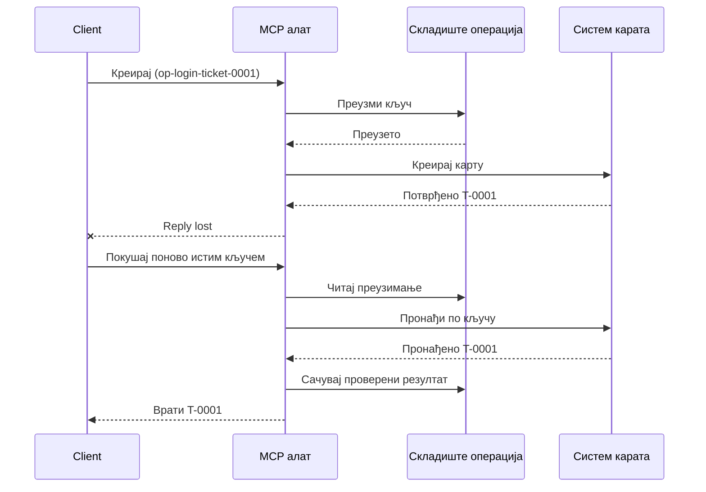
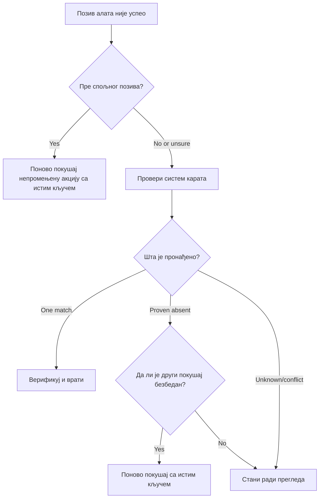

# Безбедни поновни покушаји за МЦП алате: образац поузданости са спољним носачем

Недостајући одговор не значи да радња не постоји. Алат за подршку може направити карту `T-0001`
и затим изгубити везу пре него што клијент види резултат. Ако клијент поново покуша слепо,
може направити `T-0002`.

Ова лекција показује како препознати ту неодређену исход, задржати једну стабилну
идентитет за намерну радњу и проверити систем карата пре поновног покушаја.
Практична Python вежба се покреће локално са стандардном библиотеком
и SQLite-ом.

## Зашто тајмаут значи „исход непознат“

Претпоставимо да клијент позива `create_support_ticket` са кључем операције
`op-login-ticket-0001`:



Веза не успе после што је карта снимљена али пре него што резултат стигне.
Клијент зна само да одговор недостаје. Не зна да ли карта недостаје.
Поново коришћење кључа операције омогућава алату да пронађе и врати
`T-0001` уместо да креира `T-0002`.

## Шта ради поуздани спољни носач

Поуздани спољни носач је код апликације који чува стање опоравка око
алата. Може бити библиотека, посреднички слој, сервис заснован на бази података, или једноставно
део имплементације алата. Не мора бити засебан процес,
и није карактеристика МЦП протокола.

Спољни носач има четири задатка:

1. сачувати намерну радњу пре позива спољног система;
2. дозволити само једном раднику да преузме ту радњу;
3. запамтити довољно стање за опоравак после пада; и
4. проверити спољни систем када је исход неодређен.

Ова лекција циља на коначно МЦП спецификацију `2026-07-28`. МЦП нема
протоколну сесију, тако да је кључ операције обичан аргумент алата
заснован на трајном стању апликације. Исти образац ради и са ранијим
верзијама МЦП-а.

## Четири идентификатора која решавају различите проблеме

Ови идентификатори су повезани, али нису мењиви међу собом:

| Идентификатор | Шта идентификује | Да ли преживљава поновни покушај? |
| --- | --- | --- |
| JSON-RPC ID | Један захтев и одговор | Не; користити нови ID захтева |
| MCP Task ID | Један дуготрајни задатак | Да; задржати за праћење |
| Кључ операције | Једна намењена радња | Да; поново користити за ту радњу |
| ИД карте | Сачувани резултат | Да; враћати након верификације |

Обавештења о напретку и контекст праћења помажу да пратите захтев.
Отказивање тражи заустављање рада. Ниједан не спречава дупликат карте.

## Направите чувар

Креирајте кључ операције пре првог позива алата и сачувајте га са
током рада. Сваки покушај креирања исте намењене карте користи исти кључ:

```json
{
  "operation_key": "op-login-ticket-0001",
  "title": "Cannot sign in"
}
```

Другачија намењена карта добија нови кључ. У продукцији, генеришите непрозирну,
непредвидиву вредност уместо да стављате податке клијента у кључ.

Ево комплетне МЦП шеме алата коришћене у овој лекцији:

```json
{
  "name": "create_support_ticket",
  "title": "Create support ticket",
  "description": "Creates or recovers one support ticket for an operation key.",
  "inputSchema": {
    "$schema": "https://json-schema.org/draft/2020-12/schema",
    "type": "object",
    "properties": {
      "operation_key": {
        "type": "string",
        "minLength": 16,
        "maxLength": 128,
        "description": "Stable key reused for the same intended action."
      },
      "title": {
        "type": "string",
        "minLength": 1,
        "maxLength": 200
      }
    },
    "required": ["operation_key", "title"],
    "additionalProperties": false
  },
  "outputSchema": {
    "$schema": "https://json-schema.org/draft/2020-12/schema",
    "type": "object",
    "properties": {
      "ticket_id": {
        "type": "string"
      },
      "operation_key": {
        "type": "string"
      },
      "status": {
        "type": "string",
        "const": "verified"
      }
    },
    "required": ["ticket_id", "operation_key", "status"],
    "additionalProperties": false
  }
}
```

Идентитет аутентификованог позиваоца долази из контекста сервера, а не из
алатских улазних података које даје модел. Опсег сваке сачуване операције треба да буде:

- тај позиваоц, закупац или сервисни налог;
- име и верзија алата; и
- хеш нормализованих уноса који дефинишу спољашњу радњу.

Хеш уноса одговара на једноставно питање: „Да ли овај поновни покушај тражи исту
карту?“ Ако кључ већ припада другој наслови, одбијте позив.

Враћање ранијег резултата за промењени унос би сакрило грешку у уговору.

Сачувај захтев једном атомском базом података операцијом. „Атомско“ значи да два радника
не могу оба да уоче празан запис и оба постану власник. Локална закључавања процеса
нису довољна када други инстанца сервера може да прими поновни покушај.

Радни ток креира кључ док је акција `планирана`. Пример затим
уписује ове стања:

- `потражено`: један радник је резервисао операцију;
- `завршено`: систем тикета је вратио резултат; и
- `потврђено`: читање из система тикета потврђује резултат.

Рачунарски пад може оставити сачувано стање на „потражено“ чак и након што је тикет
креиран. Сваки нестабилни захтев третирај као несигуран док га спољни докази
не разјасне. Немој претпостављати да „потражено“ значи „није се ништа десило“.

## Опоравак пре поновног покушаја

Када позив алата не успе, одлучи шта је познато пре слања другог спољног
уписа:



Валидација која не успе пре позива тикет API-ја је познат неуспех.
Поново покрени непромењену акцију са истим кључем операције. Ако корекција уноса
мења намењени тикет, направи нови кључ за ту нову акцију.

Ако захтев можда стигао до система тикета, најпре га усагласи.
Усаглашавање значи упоређивање сачуваног захтева са ауторитативним записом тикета.
Врати постојећи тикет када се пронађе тачно један одговарајући запис.
Поновно покрени само када тикет недвосмислено не постоји и даљи уговор
омогућава безбедан други покушај.

„Није пронађен“ није увек коначно. Провајдер са евентуално конзистентном
претрагом може захтевати ограничио чек и још један преглед. Ако систем не може
да се претражује, даје супротстављене резултате или не може безбедно да елиминише
дупликате другог покушаја, заустави се и пријави `исход непознат`. Овде се заустављање
понекад назива „грешка која блокира“: радни ток одбија да претпостави.

## Докази, задаци и отказивање

Одговор алата каже шта је алат пријавио. Сачувани контролни пункт каже шта је
радни ток забележио. Најјачи доказ долази из система који је власник
резултата: за овај пример, читање из система тикета које пронађе тачно један
одговарајући тикет.

Усклади доказе са ризиком. ИД поруке провајдера може бити довољан за
обавештење са ниским ризиком. Исплате, распореди и деструктивне радње могу
захтевати доказе статуса провајдера, књиге или ручне провере.

MCP Tasks проширење допуњује овај образац за дуготрајан рад. ИД задатка
омогућава клијенту да настави са праћењем након прекида везе, али не идентификује
или елиминише дупликате самог тикета. Када се користе Задаци, идентитети се повезују
овако:

```text
operation key -> Task ID -> ticket ID -> verification evidence
```

Отказивање је кооперативно, не повлачење. Тикет још увек може бити креиран
након што је отказивање прихваћено, па несигуран резултат и даље захтева
уклапање.

## Покрени вежбу убацивања грешке

Пример користи две SQLite датотеке: једна представља продавницу операција, а друга
представља спољни систем тикета. Не постоји трансакција која обухвата
обе датотеке. Грешка се убацује након што тикет потврди, али пре него што
"sidecar" забележи завршетак.

Директна Python метода прихвата `caller_id` као замена за аутентификовани
серверски контекст. Немој додавати `caller_id` у MCP улазну шему коју контролише модел.


Предвиди резултат пре покретања тестова:

| Путања | Резултат након поновног покушаја | Број тикета |
| --- | --- | --- |
| Слепи поновни покушај | Креира `T-0002` након губитка одговора за `T-0001` | 2 |

| Строга поновна покушаја | Пронађе и враћа `T-0001` | 1 |

Извршите:

```bash
cd 08-BestPractices/reliability-sidecars/python
python -m unittest discover -p "test_*.py" -v
```

Шест тестова показују да:

1. слепа поновна покушаја ствара дупликат;
2. губитак одговора плус поновно покретање опоравља једну карту из трајног захтева;
3. верификована поновна покушаја поново користи сачувани резултат;
4. промењени унос или конфликтни спољни докази се одбацују;
5. постојећи захтев без спољног доказа безбедно зауставља извршавање; и
6. конкурентни захтеви дозвољавају једног власника без регресије верификованог резултата.

Отворите пример:

- [Python имплементација](../../../../08-BestPractices/reliability-sidecars/python/reliability_sidecar.py)
- [Детерминистички тестови](../../../../08-BestPractices/reliability-sidecars/python/test_reliability_sidecar.py)

Пример намерно изоставља закупе за застареле захтеве. Политика преузимања у продукцији
захтева ограничени закуп, атомски пренос власништва и још једну спољашњу
проверу пре извршења.

## Опциона заједничка имплементација

Agent Enhancer Utilities је једна заједничка имплементација овог
шаблона на нивоу апликације. Његов планер бира приступ опоравку, док његова
контрола тачке записује стања захтева и неодређеног резултата. Домен алат или MCP
сервер и даље извршавају и верификују стварну акцију. Ова услуга није део
MCP спецификације и није потребна за ову лекцију.

| Концепт лекције | Део Agent Enhancer-а | Важна ограничења |
| --- | --- | --- |
| План опоравка | `workflow-guard-planner` | Не позива домен алат |
| Захтев и опоравак | `workflow-checkpoint` | `external_proof` остаје `false` |
| Тачна репродукција помоћног сервиса | `lab.invoke_tool` | Користи посебан кључ идемпотентности |
| Верификација стварне акције | Претрага/учитавање одредишта | Власништво домена MCP |

За тачну поновну покушају једног позива помоћног сервиса, `lab.invoke_tool` прихвата спољашњи
`idempotency_key`. Тај кључ идентификује позив помоћног сервиса; он није
пословни `operation_key` који се користи за карту.

Означени јавни уговор и опционални мрежни пример су доступни
овде:

- [Уговор о Reliability Sidecar v1](https://github.com/artiehinz/Agent-Enhancer-Utilities/blob/v1.6.0/docs/RELIABILITY_SIDECAR_CONTRACT_V1.md)
- [Пример планера и мок-домена](https://github.com/artiehinz/Agent-Enhancer-Utilities/tree/v1.6.0/examples/reliability-sidecar)

Ови линкови илуструју шаблон апликације. Не тврде да
домаћин услуга у потпуности прати MCP `2026-07-28`, а стање контролне тачке никада се не рачуна
као спољашњи доказ карте.

## Контролна листа за производњу

- [ ] Креирајте и сачувајте кључ операције пре првог спољашњег покушаја.
- [ ] Везујте кључ за позиваоца, верзију алата и нормализовани хаш уноса.
- [ ] Одбаците промењени унос под постојећим кључем.
- [ ] Дозволите једног власника атомском операцијом у заједничком складишту.
- [ ] Проследите кључ пружаоцу услуге испод ако подржава идемпотентност.
- [ ] Ускладите неодређене исходе пре другог писања.
- [ ] Чувајте верификоване резултате и доказе током цеог периода поновних покушаја.
- [ ] Зауставите се ради прегледа када се спољашњи исход не може безбедно утврдити.

## Референце

- [MCP спецификација `2026-07-28`](https://modelcontextprotocol.io/specification/2026-07-28)
- [MCP `2026-07-28` упутства за алате](https://modelcontextprotocol.io/specification/2026-07-28/server/tools)
- [MCP проширење задатака](https://modelcontextprotocol.io/extensions/tasks/overview)
- [JSON-RPC 2.0 спецификација](https://www.jsonrpc.org/specification)

---

<!-- CO-OP TRANSLATOR DISCLAIMER START -->
**Изјава о одрицању одговорности**:
Овај документ је преведен коришћењем услуге за аутоматски превод [Co-op Translator](https://github.com/Azure/co-op-translator). Иако тежимо тачности, имајте у виду да аутоматски преводи могу садржати грешке или нетачности. Оригинални документ на његовом изворном језику треба сматрати ауторитативним извором. За критичне информације препоручује се професионални људски превод. Нисмо одговорни за било каква неспоразума или погрешна тумачења која произилазе из коришћења овог превода.
<!-- CO-OP TRANSLATOR DISCLAIMER END -->