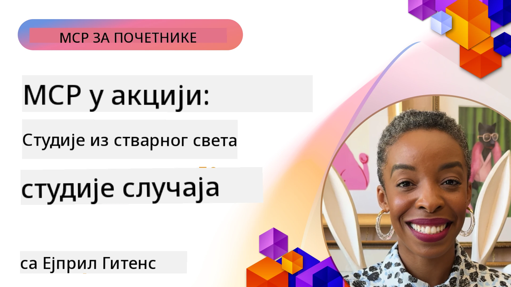

# MCP у пракси: Студије случаја из стварног света

_(Кликните на слику изнад да бисте погледали видео о овом лекцији)_

Протокол контекста модела (MCP) мења начин на који AI апликације комуницирају са подацима, алатима и услугама. Овај одељак представља студије случаја из стварног света које показују практичну примену MCP-а у различитим пословним сценаријима.

## Преглед

Овај одељак приказује конкретне примере имплементација MCP-а, истичући како организације користе овај протокол за решавање сложених пословних изазова. Проучавањем ових студија случаја добићете увид у свестраност, скалабилност и практичне користи MCP-а у стварним сценаријима.

## Кључни циљеви учења

Проучавањем ових студија случаја, научићете:

- Како MCP може бити примењен за решавање специфичних пословних проблема
- О различитим шаблонима интеграције и архитектонским приступима
- Препознавање најбољих пракси за имплементацију MCP-а у пословним окружењима
- Добијање увида у изазове и решења на које се наилази у стварним имплементацијама
- Идентификовање могућности примене сличних образаца у вашим пројектима

## Истакнуте студије случаја

### 1. [Azure AI агенти за путовања – Референцна имплементација](./travelagentsample.md)

Ова студија случаја испитује свеобухватно референцно решење компаније Microsoft које показује како изградити апликацију за планирање путовања са више агената која користи MCP, Azure OpenAI и Azure AI Search. Пројекат приказује:

- Оркестрацију више агената преко MCP-а
- Интеграцију пословних података са Azure AI Search
- Сигурну, скалабилну архитектуру користећи Azure услуге
- Прошириве алате са поновно употребљивим MCP компонентама
- Конверзацијско корисничко искуство покретано Azure OpenAI

Архитектонски и имплементациони детаљи пружају вредне увиде како изградити сложене системе са више агената, са MCP-ом као слојем координације.

### 2. [Ажурирање Azure DevOps ставки са YouTube подацима](./UpdateADOItemsFromYT.md)

Ова студија случаја показује практичну примену MCP-а за аутоматизацију радних процеса. Приказује како се MCP алати могу користити за:

- Издвајање података са онлајн платформи (YouTube)
- Ажурирање радних ставки у Azure DevOps системима
- Креирање понављајућих аутоматизованих радних токова
- Интеграцију података између различитих система

Овај пример показује како чак и релативно једноставне MCP имплементације могу значајно повећати ефикасност аутоматизацијом рутинских задатака и побољшањем конзистентности података између система.

### 3. [Пребацивање документације у реалном времену преко MCP-а](./docs-mcp/README.md)

Ова студија вас води кроз повезивање Python конзолног клијента са MCP сервером ради преузимања и евидентирања актуелне, контекстуално свесне Microsoft документације у реалном времену. Научићете како да:

- Повежете се на MCP сервер користећи Python клијент и званични MCP SDK
- Користите стреаминг HTTP клијенте за ефикасно и реално-претрага података
- Позовете алате за документацију на серверу и директно евидентирате одговоре у конзоли
- Интегришете ажурну Microsoft документацију у свој радни ток без напуштања терминала

Поглавље укључује практичну задатак, минималан радни пример кода и линкове ка додатним ресурсима за дубље учење. Погледајте цео водич и код у наведеном поглављу да бисте разумели како MCP може трансформисати приступ документацији и продуктивност програмера у конзолним окружењима.

### 4. [Веб апликација за интерактивно генерисање студијских планова са MCP-ом](./docs-mcp/README.md)

Ова студија случаја показује како изградити интерактивну веб апликацију користећи Chainlit и MCP да бисте генерисали персонализоване студијске планове за било коју тему. Корисници могу да одреде предмет (на пример „сертификација AI-900“) и трајање учења (нпр. 8 недеља), а апликација ће пружити недељни распоред препорученог материјала. Chainlit омогућава конверзацијски интерфејс, чинећи искуство занимљивим и прилагодљивим.

- Конверзацијска веб апликација покретана Chainlit-ом
- Кориснички вођени упити за тему и трајање
- Препоруке садржаја недељу по недељу коришћењем MCP-а
- Одговори у реалном времену и прилагодљиви у интерфејсу за ћаскање

Пројекат илуструје како се конверзацијска AI и MCP могу комбиновати у динамичке, кориснички вођене образовне алате у модерном веб окружењу.

### 5. [Документација у едитору помоћу MCP сервера у VS Code-у](./docs-mcp/README.md)

Ова студија случаја показује како да доведете Microsoft Learn документацију директно у своје VS Code окружење користећи MCP сервер — без пребацивања картица у прегледачу! Видећете како да:

- Одмах претражујете и читате документацију унутар VS Code-а преко MCP панела или командне палете
- Превуците документацију и уметните линкове директно у README или markdown датотеке курса
- Користите GitHub Copilot и MCP за беспрекорне AI-покретане токове рада са документацијом и кодом
- Валидација и побољшавање документације са повратним информацијама у реалном времену и тачношћу добијеном од Microsoft-а
- Интегришете MCP с GitHub токовима рада за континуирану валидацију документације

Имплементација укључује:

- Пример конфигурације `.vscode/mcp.json` за једноставно подешавање
- Скриншотови и корак по корак водичи искуства у едитору
- Савети за комбиновaње Copilot-а и MCP-а за максималну продуктивност

Овај сценарио је идеалан за ауторе курсева, писце документације и програмере који желе да остану фокусирани у свом едитору док раде са документацијом, Copilot-ом и алатима за валидацију — све подржано MCP-ом.

### 6. [Креирање APIM MCP сервера](./apimsample.md)

Ова студија случаја пружа корак по корак водич како креирати MCP сервер користећи Azure API Management (APIM). Обухвата:

- Постављање MCP сервера у Azure API Management
- Излагање API операција као MCP алата
- Конфигурисање политика за ограничење брзине и безбедност
- Тестирање MCP сервера користећи Visual Studio Code и GitHub Copilot

Овај пример показује како искористити могућности Azure-а за креирање робусног MCP сервера који се може користити у различитим апликацијама, побољшавајући интеграцију AI система са пословним API-јима.

### 7. [GitHub MCP регистар — Убрзање агентске интеграције](https://github.com/mcp)

Ова студија случаја испитује како GitHub-ов MCP регистар, лансиран у септембру 2025. године, решава критичан изазов у AI екосистему: фрагментисано откривање и распоређивање Model Context Protocol (MCP) сервера.

#### Преглед
**MCP регистар** решава проблем расутих MCP сервера по репозиторијумима и регистрима, што је раније чинило интеграцију спором и подложном грешкама. Ови сервери омогућавају AI агенатима интеракцију са спољним системима попут API-ја, база података и извора документације.

#### Изазов
Развојни инжењери који граде агентске токове рада су се суочавали са неколико изазова:
- **Слаба откривеност** MCP сервера на различитим платформама
- **Непотребна питања о подешавању** широм форума и документације
- **Безбедносни ризици** од непроверених и непоузданих извора
- **Недостатак стандарда** у квалитету и компатибилности сервера

#### Архитектура решења
MCP регистар GitHub-а централизује поуздане MCP сервере са кључним функцијама:
- **Интеграција једним кликом** преко VS Code-а за поједностављено подешавање
- **Сортирање сигнал-по-шуму** према звездицама, активности и потврдама заједнице
- **Директна интеграција** са GitHub Copilot-ом и другим MCP компатибилним алатима
- **Отворени модел доприноса** који омогућава доприносе заједнице и пословних партнера

#### Пословни утицај
Регистар је донео мерљива побољшања:
- **Брже укључивање** за развојне инжењере који користе алате као што је Microsoft Learn MCP Server, који преноси званичну документацију директно агентима
- **Повећану продуктивност** преко специјализованих сервера као што је `github-mcp-server`, који омогућава аутоматизацију GitHub-а на природном језику (креирање PR, поновно покретање CI, скенирање кода)
- **Јачи екосистемски поверење** кроз куриране листе и транспарентне стандарде конфигурације

#### Стратешка вредност
За практичаре специјализоване за управљање животним циклусом агената и репродуктивне токове рада, MCP регистар пружа:
- **Модуларне могућности распореда агената** са стандардизованим компонентама
- **Процесе процене подржане регистром** за доследно тестирање и валидацију
- **Интероперабилност међу алатима** која омогућава беспрекорну интеграцију између различитих AI платформи

Ова студија случаја показује да MCP регистар није само директоријум — то је темељна платформа за скалабилну интеграцију модела и распореде агентских система у стварном свету.

### 8. [Објављивање на друштвеним мрежама преко агента](./publora-social-publishing.md)

Ова студија случаја приказује **пишући даљински MCP сервер** — сервер чији алати на неповратан начин делују у име корисника — користећи друштвено публиковање као пример. Агент саставља објаву, човек је одобрава, а сервер планира објаве на мрежама.

Занимљив део су дизајнерска ограничења која објављивање намеће, а која важe за сваки сервер који пише, а не само чита:

- **Отворено откривање, аутентификовано извршење** — `tools/list` је доступно без провере идентитета да би регистри и клијенти могли да унутрашње провере, док сваки `tools/call` захтева токен и иначе враћа `401` са заглављем `WWW-Authenticate`
- **OAuth регистрација без офлајн корака** — динамичка регистрација клијента данас, са Client ID Metadata Documents као смерницом ка спецификацији од `2026-07-28`
- **Анотације алата** (`readOnlyHint`, `destructiveHint`, `idempotentHint`) које клијенти користе да одлуче шта да потврде — сугестије а не принуде, и нешто што сада очекују директоријуми конектора за преглед
- **Неизмишљиви идентификатори**, тако да лажна вредност грозно греши уместо да делује на основу вероватне
- **Кључеви идемпотентности на алатима за креирање објава**, тако да поновни покушај покретања агента не резултује дуплирањем публикације
- **Неоперативни циљ описан у шеми алата** који вежба цео пут писања, али не објављује ништа, за рецензенте и CI

Поглавље се завршава кратким списком за проверу који можете применити на сервер који градите.

## Закључак

Ових осам свеобухватних студија случаја доказују изузетну свестраност и практичну примену протокола Model Context Protocol у различитим стварним сценаријама. Од сложених система за планирање путовања са више агената и управљања API-јима у предузећима до поједностављених радних токова документације и револуционарног GitHub MCP регистра, ови примери показују како MCP обезбеђује стандардизован начин који се може скалирати за повезивање AI система са алатима, подацима и услугама потребним за испоруку изврсне вредности.

Студије случаја покривају више димензија имплементације MCP-а:
- **Интеграција у предузећима**: Azure API Management и аутоматизација Azure DevOps-а
- **Оркестрација више агената**: планирање путовања са координисаним AI агентима
- **Продуктивност програмера**: интеграција VS Code-а и приступ документацији у реалном времену
- **Развој екосистема**: GitHub MCP регистар као темељна платформа
- **Образовне апликације**: Инергxктивни генератори студијских планова и конверзацијски интерфејси

Проучавањем ових имплементација добијате важне увиде у:
- **Архитектонски шаблони** за различите размере и случајеве употребе
- **Стратегије имплементације** које балансирају функционалност и одрживост
- **Безбедност и скалабилност** за продукцијска окружења
- **Најбоље праксе** за развој MCP сервера и интеграцију клијената
- **Мислиње о екосистему** за изградњу међусобно повезаних AI-покретаних решења

Ови примери заједно показују да MCP није само теоријски оквир већ зрел, продукцијски спреман протокол који омогућава практична решења за сложене пословне изазове. Без обзира да ли градите једноставне алате за аутоматизацију или сложене системе са више агената, шаблони и приступи приказани овде пружају чврсту основу за ваше MCP пројекте.

## Додатни ресурси

- [Azure AI Travel Agents GitHub Репозиторијум](https://github.com/Azure-Samples/azure-ai-travel-agents)
- [Azure DevOps MCP Алат](https://github.com/microsoft/azure-devops-mcp)
- [Playwright MCP Алат](https://github.com/microsoft/playwright-mcp)
- [Microsoft Docs MCP Сервер](https://github.com/MicrosoftDocs/mcp)
- [GitHub MCP Регистар — Убрзање агентске интеграције](https://github.com/mcp)
- [MCP Заједнички Примери](https://github.com/microsoft/mcp)

## Шта следи

- Претходно: [Модул 8: Најбоље праксе](../08-BestPractices/README.md)
- Следеће: [Модул 10: Поједностављивање AI радних токова: Изградња MCP сервера помоћу AI алатног сета](../10-StreamliningAIWorkflowsBuildingAnMCPServerWithAIToolkit/README.md)

---

<!-- CO-OP TRANSLATOR DISCLAIMER START -->
**Изјава о одрицању одговорности**:
Овај документ је преведен коришћењем услуге за аутоматски превод [Co-op Translator](https://github.com/Azure/co-op-translator). Иако тежимо тачности, имајте у виду да аутоматски преводи могу садржати грешке или нетачности. Оригинални документ на његовом изворном језику треба сматрати ауторитативним извором. За критичне информације препоручује се професионални људски превод. Нисмо одговорни за било каква неспоразума или погрешна тумачења која произилазе из коришћења овог превода.
<!-- CO-OP TRANSLATOR DISCLAIMER END -->