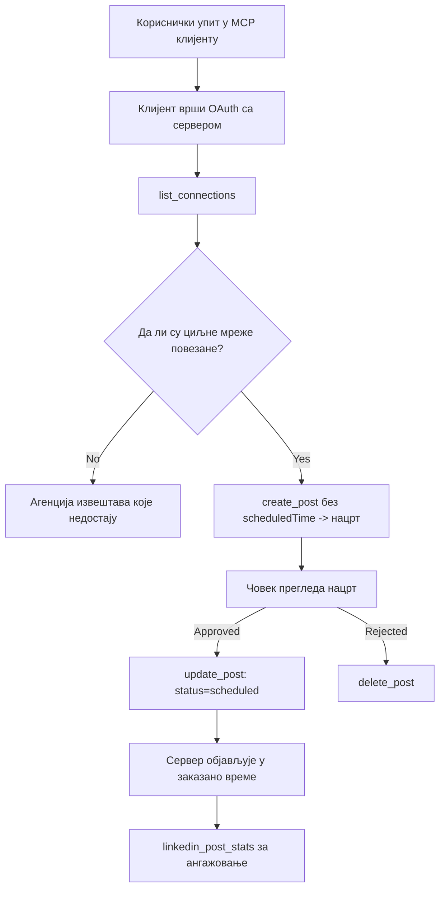

# Студија случаја: Објављивање на друштвеним мрежама из агента са удаљеним MCP сервером

> **Одука:** Неколико услуга и пројеката отвореног кода може објављивати на друштвеним мрежама, а тим такође може директно интегрисати API сваке мреже. Сценарио у наставку представља један пример како се може дизајнирати и користити **удаљени MCP сервер способан за писање**. Publora је комерцијална услуга са бесплатним слојем; описани обрасци важе за било који MCP сервер који извршава неповратне радње у име корисника.

## Преглед

Агенти су добри у креирању садржаја, али лоши у његовом објављивању. Модел може написати саопштење за објаву за неколико секунди, а онда рад престаје: објављивање захтева API за сваку мрежу, OAuth апликацију за сваку мрежу и различит скуп медијских правила за сваку. Већина тимова то решава ручним копирањем текста у прегледач.

Ова студија случаја приказује како се тај последњи корак решава са једним удаљеним MCP сервером, и — што је корисније за оне који праве такав сервер — о дизајнерским одлукама које сервер **способан за писање** мора исправно решити. Читање података је флексибилно. Објављивање није: погрешан позив алата је видљив публици и не може се поништити.

## Сценарио

Мали тим за односе са програмерима креира постове унутар агента (Claude, VS Code, Cursor — клијент није битан). Желе да агент:

- види које су друштвене налоге тим повезао,
- направи нацрт поста и сачува га као нацрт док га човек не одобри,
- прикачи слику,
- распореди објављивање на неколико мрежа у изабрано време,
- а касније пријави како је пост прошао.

Кључно, желе да агент *не може* случајно да објави док они још увек експериментишу.

## Користећи алати

- [Publora MCP Сервис](https://github.com/publora/mcp-server) — удаљени MCP сервер (`streamable-http`) који пружа алате за објављивање, распореди, медије и LinkedIn аналитику. Регистарисан у званичном MCP регистру као `com.publora/mcp-server`.

## Радни ток корак по корак

1. **Повежите сервер.** Клијенти који користе OAuth завршавају ауторизациони флоу са PKCE помоћу сопственог екрана за сагласност сервера; клијенти који то не раде, као што су headless CLI-ји, користе Publora API кључ у заглављу. Обе путање су подржане, а који ће бити коришћен зависи од клијента, не од сервера.
2. **Погледајте везе.** Агент позива `list_connections` и добија повезане налоге са њиховим идентификаторима.
3. **Креирајте нацрт.** Агент позива `create_post` *без* заказаног времена. Пост је сачуван као нацрт — ништа није објављено.
4. **Прикачите медије.** Јавни URL-ови слика се шаљу у истом позиву; сервер их преузима и верификује.
5. **Заказивање.** Када човек одобри, `update_post` поставља статус на заказано са ISO 8601 временом.
6. **Мерење.** За LinkedIn, `linkedin_post_stats` враћа ангажовање након што пост постане активан.

## Пример захтева

```text
Which social accounts do I have connected?
Draft a post announcing our new changelog page, attach the screenshot at
https://example.com/changelog.png, and keep it as a draft — do not publish it.
Once I approve, schedule it to LinkedIn and Bluesky for tomorrow at 09:00 UTC.
```

## Дијаграм у Mermaid-у



## Техничка имплементација

Учења испод представљају преносиви део ове студије случаја.

### Отворено откривање, аутентификовано извршење

`tools/list` је доступан без акредитација; сваки `tools/call` захтева токен и у супротном враћа `401` са заглављем `WWW-Authenticate` које упућује на заштићену метаподаци ресурса. (Сервер такође одговара на неаутентификовани позив `initialize`, што је важно само за клијенте старијих протоколних верзија пре `2026-07-28`; та ревизија је укинула целокупно руковање.)

Ова подела је у пракси важна. Регистри, каталоге и клијенти могу да прегледају листу алата — имена, шеме, ознаке — без чувања тајне, док се ништа не може *извршити* анонимно. Сервер који тражи токен за `initialize` је у пракси невидљив за алатке; сервер који дозвољава анонимни `tools/call` је ризик.

### Регистрација: динамичка регистрација клијената, и шта је замењује

Сервер објављује `/.well-known/oauth-protected-resource` и `/.well-known/oauth-authorization-server`, и подржава ауторизациони кодни ток са PKCE (`S256`), refresh токене и **динамичку регистрацију клијената**.

Динамичка регистрација уклања ручни корак: без ње сваки клијент треба унапред издато `client_id`, што значи одвојени захтев произвођачу за сваки нови клијент.

Ову функцију треба третирати као понашање за компатибилност а не као дизајн за копирање. Ревизија спецификације од `2026-07-28` уклања динамичку регистрацију у корист Client ID Metadata Documents, где клијент хостира мета-документ на стабилном HTTPS URL-у, а тај URL *је* `client_id`. DCR и даље ради, али сервер који се данас гради треба да планира за CIMD и да задржи DCR само за старије клијенте.

### Ознаке алата нису декорација

Сваки алат носи `title` и применљиве наговештаје: `readOnlyHint`, `destructiveHint`, `idempotentHint`, `openWorldHint`.

Два разлога за улагање у њих. Прво, клијенти користе наговештаје да одлуче шта да потврде од корисника — клијент може аутоматски извршити читање и зауставити се за одобрење пре брисања. Спецификација је јасна да су ознаке ненадмашна помоћ, не ауторизациони механизам: обликују шта клијент нуди да уради, не спречавају ништа на серверу, и сервер мора ипак да примењује своја правила. Друго, главни регистри конектора сада *захтевају* их за ревизију; сервер чији алати немају наслове и наговештаје биће враћен без обзира колико добро ради.

### Идентификатори не смеју бити измишљени

Идентификатори платформи су нејасни низови који се враћају позивом `list_connections`, и опис шеме изричито каже да их мораш копирати дословно и никад погађати. Сервер одбија све друго.

Модели су вешти у погађању. Сваки сервер способан за писање треба да претпостави да ће идентфикатор бити на крају халуциниран и да тај пут треба јасно и рано да стане, уместо да делује на вероватну вредност.

### Неуспех пре објављивања, са поруком којој се може приступити

Неке мреже одбијају постове који садрже само текст и захтевају слику или видео. То се проверава када се пост заказује, а грешка именује платформу и шта недостаје.

Агент може опоравити грешку "Instagram захтева медије — прикачите слику или видео" без још једног путовања. Не може се опоравити од опште грешке `400`.

### Онемогућите опасне поновне покушаје

Два алата која креирају садржај, `create_post` и `update_post`, прихватају кључ идемпотентности: поновно коришћење са идентичним захтевом поново враћа оригинални одговор уместо да направи други пост. Сервиси агента поново покушавају прекинуте позиве; без идемпотентности спор одговор постаје дупле публикације. Остали алати за писање — брисања, медијске операције, LinkedIn реакције и коментари — не користе кључ, тако да поновни покушај тамо није увек сигуран. Важно је знати који су ваши захтеви заштићени, а који нису.

### Обезбедите начин тестирања без објављивања било чега

Сервер прихвата резервисану дестинацију, `publora-playground`, која се валида и прихвата као стварна, а онда одбацује — ниједна жива веза не добија објаву. Ово је описано у самој шеми алата, коју сваки клијент може прочитати без акредитација: поље `platforms` у `create_post` описује као "цилј за тест повезаности који не захтева стварну везу — пост се прихвата и одбацује, ништа није објављено". Позовите га тако што ћете упутити једину ставку: `platforms: ["publora-playground"]`.

Ово се показало као један од најкориснијих детаља на целој површини. Ревизори каталога конектора, сарадници и CI могу извршити цео пут писања крај до краја без ризика по живу публику. Сваком MCP серверу који извршава неповратне радње користи документација о no-op дестинацији.

## Резултати и утицај

- Корак објављивања је премештен из прегледача у исти разговор у којем се садржај пише, а навика нацрта прво оставља човека у петљи. Будите прецизни шта то значи: нацрт је конвенција, не граница. Иста акредитација може заказати или објавити, тако да онај коме треба стварна капија одобрења мора то да спроводи ван површине алата — одвојене акредитације или слој политике испред сервера.
- Разлике по мрежама — медијски захтеви, умрежавање постова, контроле одговора — обрађују се једном у серверу уместо у сваком агенту који с њим комуницира.
- Исти сервер подржава неколико MCP клијената без посебног рада по клијенту, јер је откривање отворено и регистрација динамичка.
- Дизајнерска ограничења изнад формирали су као рецензије каталога конектора тако и корисници: ознаке, OAuth и сигуран циљ за тест су били захтев за бар једног од њих.

## Референце

- [Publora MCP Сервис (извор)](https://github.com/publora/mcp-server)
- [Publora API и MCP документација](https://docs.publora.com)
- [MCP Регистар унос: `com.publora/mcp-server`](https://registry.modelcontextprotocol.io/v0/servers?search=com.publora/mcp-server)
- [MCP спецификација — Ауторизација](https://modelcontextprotocol.io/specification/draft/basic/authorization)
- [MCP спецификација — Ознаке алата](https://modelcontextprotocol.io/docs/concepts/tools)

## Шта следи

- Узмите MCP сервер који градите и проверите три најједноставнија побољшања овде: ознаке на сваком алату, кључ идемпотентности на сваком писању и документациони no-op циљ.
- Испробајте отворено откривање: позовите `tools/list` на јавном удаљеном серверу без акредитација, затим позовите алат и погледајте `401` одговор.
- Размислите шта „поништавање“ значи за ваш домен. Објављивање има нацрте и брисање; ако ваше радње немају еквивалент, потврда припада дизајну алата, не упиту.

---

<!-- CO-OP TRANSLATOR DISCLAIMER START -->
**Изјава о одрицању одговорности**:
Овај документ је преведен коришћењем услуге за аутоматски превод [Co-op Translator](https://github.com/Azure/co-op-translator). Иако тежимо тачности, имајте у виду да аутоматски преводи могу садржати грешке или нетачности. Оригинални документ на његовом изворном језику треба сматрати ауторитативним извором. За критичне информације препоручује се професионални људски превод. Нисмо одговорни за било каква неспоразума или погрешна тумачења која произилазе из коришћења овог превода.
<!-- CO-OP TRANSLATOR DISCLAIMER END -->