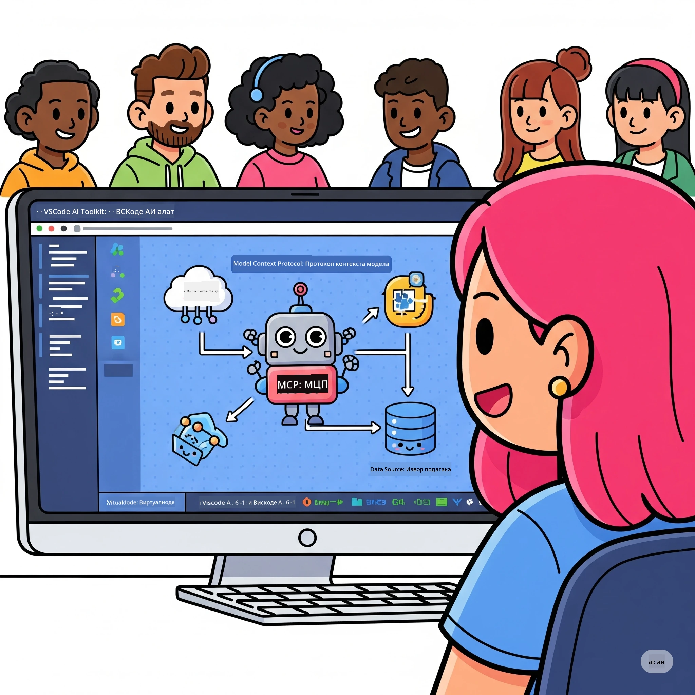
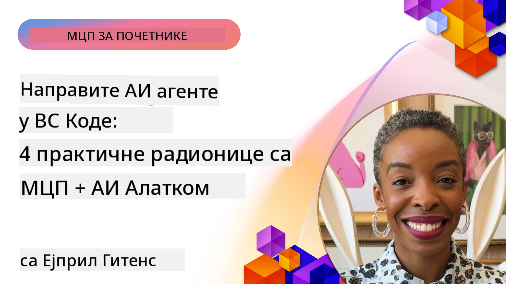

# Поједностављење AI радних токова: Израда MCP сервера са Microsoft Foundry Toolkit-ом

## 🎯 Преглед

_(Кликните слику горе да бисте гледали видео овог часа)_

Добродошли на **Model Context Protocol (MCP) радионицу**! Ова свеобухватна практична радионица комбинује две врхунске технологије за револуцију у развоју AI апликација:

> **Напомена о компатибилности:** код радионице је изграђен и тестиран са MCP
> `2025-11-25`, као што је приказано ознаком изнад. Користите
> [тренутну `2026-07-28` спецификацију](https://modelcontextprotocol.io/specification/2026-07-28/)
> за нове имплементације протокола и прегледајте белешке о издању SDK-а пре
> миграције лабораторија.

- **🔗 Model Context Protocol (MCP)**: Отворени стандард за беспрекорну интеграцију AI алата
- **🛠️ Microsoft Foundry Toolkit проширење за VS Code**: Моћно Microsoft AI развојно проширење

### 🎓 Шта ћете научити

До краја ове радионице савладаћете уметност израде интелигентних апликација које повезују AI моделе са алатима и услугама из стварног света. Од аутоматизованог тестирања до прилагођених API интеграција, стећи ћете практичне вештине за решавање сложених пословних изазова.

## 🏗️ Технолошки скуп

### 🔌 Model Context Protocol (MCP)

MCP је **"USB-C за AI"** – универзални стандард који повезује AI моделе са спољним алатима и изворима података.

**✨ Кључне карактеристике:**

- 🔄 **Стандаризована интеграција**: Универзални интерфејс за везу AI алата
- 🏛️ **Флексибилна архитектура**: Локални и удаљени сервери преко stdio/SSE транспорта
- 🧰 **Богат екосистем**: Алати, подстицаји и ресурси у једном протоколу
- 🔒 **Спреман за предузећа**: Уграђена безбедност и поузданост

**🎯 Зашто је MCP важан:**
Баш као што је USB-C елиминисао пометњу са кабловима, MCP елиминише сложеност AI интеграција. Један протокол, бескрајне могућности.

### 🤖 Microsoft Foundry Toolkit проширење за VS Code

Водеће Microsoft AI развојно проширење које претвара VS Code у AI центар снаге.

**🚀 Основне могућности:**

- 📦 **Каталог модела**: Приступ моделима из Azure AI, GitHub, Hugging Face, Ollama
- ⚡ **Локално закључивање**: ONNX оптимизован извршавање на CPU/GPU/NPU
- 🏗️ **Израђивач агената**: Визуални развој AI агената са MCP интеграцијом
- 🎭 **Мултимодално**: Подршка за текст, визуелне и структуриране излазе

**💡 Предности развоја:**

- Изградња модела без конфигурације
- Визуелно инжењерство подстицаја
- Песак за тестирање у реалном времену
- Беспрекорна интеграција MCP сервера

## 📚 Пут учења

### [🚀 Модул 1: Основе Microsoft Foundry Toolkit-а](./lab1/README.md)

**Трајање**: 15 минута

- 🛠️ Инсталирајте и конфигуришите Microsoft Foundry Toolkit за VS Code
- 🗂️ Истражите Каталог модела (100+ модела са GitHub-а, ONNX-а, OpenAI-а, Anthropic-а, Google-а)
- 🎮 Савладајте Интерактивни песак за тестирање модела у реалном времену
- 🤖 Направите свог првог AI агента са Agent Builder-ом
- 📊 Оцените перформансе модела са уграђеним метрикама (F1, релевантност, сличност, кохерентност)
- ⚡ Научите могућности појединачне обраде и мултимодалне подршке

**🎯 Резултат учења**: Креирајте функционалног AI агента са свеобухватним разумевањем могућности Microsoft Foundry Toolkit-а

### [🌐 Модул 2: MCP са Основама Microsoft Foundry Toolkit-а](./lab2/README.md)

**Трајање**: 20 минута

- 🧠 Савладајте архитектуру и концепте Model Context Protocol-а (MCP)
- 🌐 Истражите Microsoft MCP сервер екосистем
- 🤖 Направите агента за аутоматизацију претраживача користећи Playwright MCP сервер
- 🔧 Интегришите MCP сервере са Microsoft Foundry Toolkit Agent Builder-ом
- 📊 Конфигуришите и тестирајте MCP алате унутар својих агената
- 🚀 Извезите и примените агенте покретане MCP-ом за производно коришћење

**🎯 Резултат учења**: Поставите AI агента појачаног спољним алатима путем MCP-а

### [🔧 Модул 3: Напредни MCP развој са Microsoft Foundry Toolkit-ом](./lab3/README.md)

**Трајање**: 20 минута

- 💻 Креирајте прилагођене MCP сервере користећи Microsoft Foundry Toolkit
- 🐍 Конфигуришите и користите најновији MCP Python SDK (v1.9.3)
- 🔍 Поставите и користите MCP Inspector за отклањање грешака
- 🛠️ Направите Weather MCP Сервер са професионалним токовима отклањања грешака
- 🧪 Отлањајте грешке у MCP серверима у окружењима Agent Builder и Inspector

**🎯 Резултат учења**: Развијајте и отклањајте грешке прилагођених MCP сервера модерним алатима

### [🐙 Модул 4: Практични MCP развој - Прилагођени GitHub Clone сервер](./lab4/README.md)

**Трајање**: 30 минута

- 🏗️ Изградите MCP Сервер за клонирање GitHub репозиторијума за развојне токове
- 🔄 Имплементирајте паметно клонирање репозиторијума са валидацијом и обрадом грешака
- 📁 Креирајте интелигентно управљање директоријумима и интеграцију са VS Code-ом
- 🤖 Користите GitHub Copilot Agent Мод са прилагођеним MCP алатима
- 🛡️ Примена поузданости спремне за производњу и компатибилности на више платформи

**🎯 Резултат учења**: Поставите MCP сервер спреман за производњу који поједностављује стварне развојне токове

## 💡 Примене у стварном свету и утицај

### 🏢 Пословни случајеви

#### 🔄 Аутоматизација DevOps-а

Промените свој развојни радни ток интелигентном аутоматизацијом:

- **Паметно управљање репозиторијумом**: Преглед и доношење одлука о мењању кода помоћу AI
- **Интелигентни CI/CD**: Аутоматска оптимизација процеса на основу промена у коду
- **Триажа нерешених проблема**: Аутоматска класификација грешака и додела

#### 🧪 Револуција у обезбеђењу квалитета

Подигните тестирање уз AI-аутоматизацију:

- **Интелигентна генерација тестова**: Аутоматско креирање свеобухватних тест пакета
- **Визуелно тестирање регресије**: Детекција промена у UI уз помоћ AI
- **Мониторинг перформанси**: Проактивно идентификовање и решавање проблема

#### 📊 Интелигенција податковних токова

Креирајте паметније токове обраде података:

- **Адаптивни ETL процеси**: Само-оптимизујуће трансформације података
- **Детекција аномалија**: Надзор квалитета података у реалном времену
- **Интелигентно усмеравање**: Паметно управљање протоком података

#### 🎧 Побољшање корисничког искуства

Креирајте изузетне корисничке интеракције:

- **Подршка са свешћу о контексту**: AI агенти са приступом историји корисника
- **Проактивно решавање проблема**: Превентивна корисничка подршка
- **Мулти-канална интеграција**: Унифицирано AI искуство на платформама

## 🛠️ Захтеви и подешавање

### 💻 Захтеви система

| Компонента | Захтев | Белешке |
|-----------|-------------|-------|
| **Оперативни систем** | Windows 10+, macOS 10.15+, Linux | Било који модерни ОС |
| **Visual Studio Code** | Најновија стабилна верзија | Потребно за Microsoft Foundry Toolkit |
| **Node.js** | v18.0+ и npm | За развој MCP сервера |
| **Python** | 3.10+ | Опционо за Python MCP сервере |
| **Рам меморија** | минимум 8GB | 16GB препоручено за локалне моделе |

### 🔧 Развојно окружење

#### Препоручени VS Code додаци

- **Microsoft Foundry Toolkit** (ms-windows-ai-studio.windows-ai-studio)
- **Python** (ms-python.python)
- **Python Debugger** (ms-python.debugpy)
- **GitHub Copilot** (GitHub.copilot) - Опционо али корисно

#### Опционо алати

- **uv**: Модеран Python пакет менаџер
- **MCP Inspector**: Визуелни алат за отклањање грешака MCP сервера
- **Playwright**: За примере веб аутоматизације

## 🎖️ Резултати учења и пут сертификовања

### 🏆 Контрола савладавања вештина

Завршетком ове радионице, остварићете савладвање у:

#### 🎯 Кључне компетенције

- [ ] **Мастерство MCP протокола**: Дубоко разумевање архитектуре и образаца имплементације
- [ ] **Вештина у Microsoft Foundry Toolkit-у**: Стручна употреба Microsoft Foundry Toolkit-а за брзи развој
- [ ] **Развој прилагођених сервера**: Изградња, имплементација и одржавање производних MCP сервера
- [ ] **Одлична интеграција алата**: Беспрекорна веза AI-а са постојећим развојним токовима
- [ ] **Примена решавања проблема**: Примена стечених вештина на стварне пословне изазове

#### 🔧 Техничке вештине

- [ ] Подешавање и конфигурисање Microsoft Foundry Toolkit-а у VS Code-у
- [ ] Дизајн и израда прилагођених MCP сервера
- [ ] Интеграција GitHub модела са MCP архитектуром
- [ ] Изградња аутоматизованих радних токова за тестирање са Playwright-ом
- [ ] Деплой AI агената за производну употребу
- [ ] Отклањање грешака и оптимизација перформанси MCP сервера

#### 🚀 Напредне могућности

- [ ] Архитектура интеграција AI-а на нивоу предузећа
- [ ] Примена безбедносних најбољих пракси за AI апликације
- [ ] Дизајн скалабилних архитектура MCP сервера
- [ ] Креирање прилагођених ланаца алата за специфичне домене
- [ ] Менторство у AI-нативном развоју

## 📖 Додатни ресурси

- [MCP спецификација (2026-07-28)](https://modelcontextprotocol.io/specification/2026-07-28/)
- [Microsoft Foundry Toolkit GitHub репозиторијум](https://github.com/microsoft/vscode-ai-toolkit)
- [Збирка пример MCP сервера](https://github.com/modelcontextprotocol/servers)
- [Водич најбољих пракси](https://modelcontextprotocol.io/docs/best-practices)
- [OWASP MCP Топ 10](https://microsoft.github.io/mcp-azure-security-guide/mcp/) - најбоље праксе безбедности

---

**🚀 Спремни да револуционишете свој AI развојни ток?**

Хајде да заједно изградимо будућност интелигентних апликација уз MCP и Microsoft Foundry Toolkit!

## Следеће кораке

Наставите на: [Модул 11: MCP Server Hands-On Labs](../11-MCPServerHandsOnLabs/README.md)

---

<!-- CO-OP TRANSLATOR DISCLAIMER START -->
**Изјава о одрицању одговорности**:
Овај документ је преведен коришћењем услуге за аутоматски превод [Co-op Translator](https://github.com/Azure/co-op-translator). Иако тежимо тачности, имајте у виду да аутоматски преводи могу садржати грешке или нетачности. Оригинални документ на његовом изворном језику треба сматрати ауторитативним извором. За критичне информације препоручује се професионални људски превод. Нисмо одговорни за било каква неспоразума или погрешна тумачења која произилазе из коришћења овог превода.
<!-- CO-OP TRANSLATOR DISCLAIMER END -->