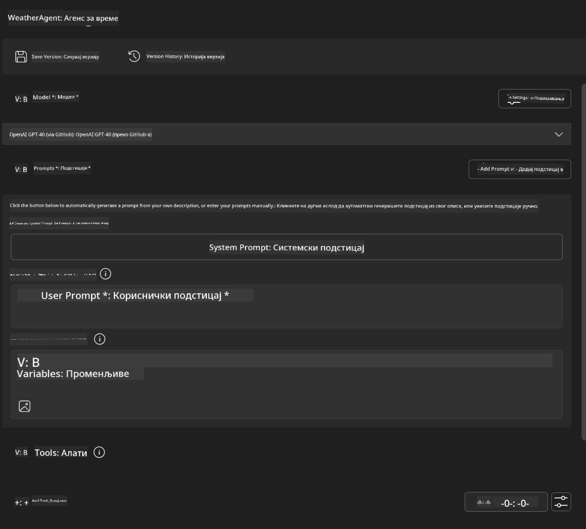
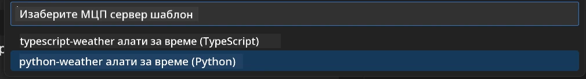
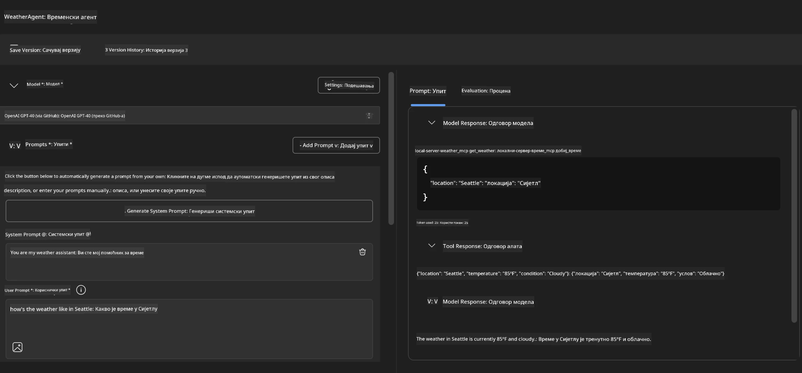
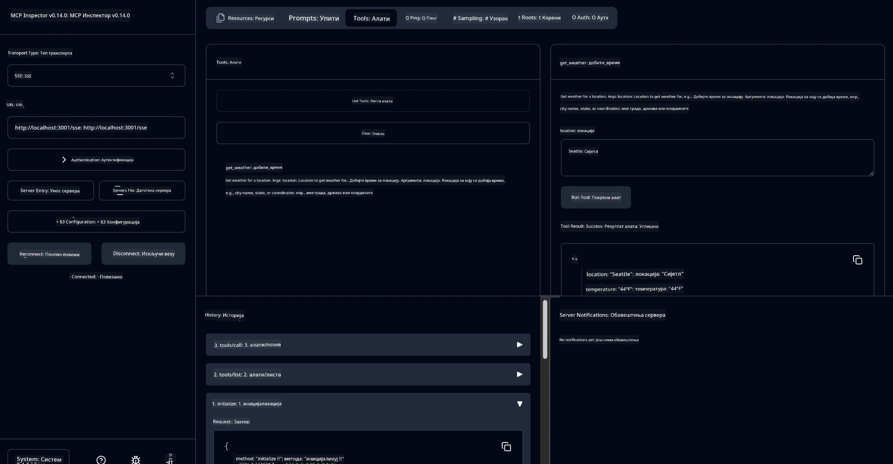

# 🔧 Модул 3: Напредни развој MCP са Microsoft Foundry Toolkit

> [!NOTE]
> URL-ови инспектора у овој лабораторији користе стару `/sse` крајњу тачку и циљају
> фиксне зависности MCP SDK `1.9.3` и Inspector `0.14.0`. Није у питању
> актуелни `2026-07-28` Streamable HTTP примери.


## 🎯 Циљеви учења

До краја ове лабораторије ћете моћи да:

- ✅ Креирате прилагођене MCP сервере користећи Microsoft Foundry Toolkit
- ✅ Конфигуришете и користите најновији MCP Python SDK (верзија 1.9.3)
- ✅ Подесите и користите MCP Inspector за отклањање грешака
- ✅ Отклањате грешке MCP сервера у Agent Builder и Inspector окружењима
- ✅ Разумете напредне радне токове развоја MCP сервера

## 📋 Предуслови

- Завршена Лабораторија 2 (Основе MCP)
- VS Code са инсталираном Microsoft Foundry Toolkit екстензијом
- Python окружење 3.10+
- Node.js и npm за постављање Inspectora

## 🏗️ Шта ћете изградити

У овој лабораторији направићете **Weather MCP Server** који демонстрира:
- Прилагођену имплементацију MCP сервера
- Интеграцију са Microsoft Foundry Toolkit Agent Builder-ом
- Професионалне радне токове за отклањање грешака
- Савремене обрасце коришћења MCP SDK

---

## 🔧 Преглед кључних компоненти

### 🐍 MCP Python SDK
Model Context Protocol Python SDK пружа темељ за изградњу прилагођених MCP сервера. Користићете верзију 1.9.3 са побољшаним могућностима отклањања грешака.

### 🔍 MCP Inspector
Моћан алат за отклањање грешака који пружа:
- Надзор сервера у реалном времену
- Визуелизацију извршења алата
- Инспекцију мрежних захтева/одговора
- Интерактивно окружење за тестирање

---

## 📖 Корак по корак имплементација

### Корак 1: Креирање WeatherAgent у Agent Builder-у

1. **Покрените Agent Builder** у VS Code кроз Microsoft Foundry Toolkit екстензију
2. **Креирајте нови агент** са следећом конфигурацијом:
   - Име агента: `WeatherAgent`



### Корак 2: Иницијализујте MCP Server пројекат

1. **Идите на Tools** → **Add Tool** у Agent Builder-у
2. **Изаберите „MCP Server“** из доступних опција
3. **Изаберите „Create A new MCP Server“**
4. **Изаберите шаблон `python-weather`**
5. **Назовите ваш сервер:** `weather_mcp`



### Корак 3: Отворите и прегледајте пројекат

1. **Отворите генерисани пројекат** у VS Code-у
2. **Прегледајте структуру пројекта:**
   ```
   weather_mcp/
   ├── src/
   │   ├── __init__.py
   │   └── server.py
   ├── inspector/
   │   ├── package.json
   │   └── package-lock.json
   ├── .vscode/
   │   ├── launch.json
   │   └── tasks.json
   ├── pyproject.toml
   └── README.md
   ```

### Корак 4: Надоградите на најновији MCP SDK

> **🔍 Зашто надоградња?** Желимо да користимо најновији MCP SDK (верзија 1.9.3) и Inspector сервис (0.14.0) за проширене функције и боље могућности отклањања грешака.

#### 4а. Ажурирајте Python зависности

**Уредите `pyproject.toml`:** ажурирајте [./code/weather_mcp/pyproject.toml](../../../../10-StreamliningAIWorkflowsBuildingAnMCPServerWithAIToolkit/lab3/code/weather_mcp/pyproject.toml)


#### 4б. Ажурирајте инспектор конфигурацију

**Уредите `inspector/package.json`:** ажурирајте [./code/weather_mcp/inspector/package.json](../../../../10-StreamliningAIWorkflowsBuildingAnMCPServerWithAIToolkit/lab3/code/weather_mcp/inspector/package.json)

#### 4ц. Ажурирајте инспектор зависности

**Уредите `inspector/package-lock.json`:** ажурирајте [./code/weather_mcp/inspector/package-lock.json](../../../../10-StreamliningAIWorkflowsBuildingAnMCPServerWithAIToolkit/lab3/code/weather_mcp/inspector/package-lock.json)

> **📝 Напомена:** Овај фајл садржи обимне дефиниције зависности. Испод је основна структура – пун садржај обезбеђује правилно решавање зависности.


> **⚡ Пуно закључавање пакета:** Комплетни package-lock.json садржи око 3000 линија дефиниција зависности. Горња слика приказује кључну структуру – користите приложени фајл за потпуно решавање зависности.

### Корак 5: Конфигуришите VS Code отклањање грешака

*Напомена: Молимо копирајте датотеку на назначену локацију да замените одговарајућу локалну датотеку*

#### 5а. Ажурирајте конфигурацију покретања

**Уредите `.vscode/launch.json`:**

```json
{
  "version": "0.2.0",
  "configurations": [
    {
      "name": "Attach to Local MCP",
      "type": "debugpy",
      "request": "attach",
      "connect": {
        "host": "localhost",
        "port": 5678
      },
      "presentation": {
        "hidden": true
      },
      "internalConsoleOptions": "neverOpen",
      "postDebugTask": "Terminate All Tasks"
    },
    {
      "name": "Launch Inspector (Edge)",
      "type": "msedge",
      "request": "launch",
      "url": "http://localhost:6274?timeout=60000&serverUrl=http://localhost:3001/sse#tools",
      "cascadeTerminateToConfigurations": [
        "Attach to Local MCP"
      ],
      "presentation": {
        "hidden": true
      },
      "internalConsoleOptions": "neverOpen"
    },
    {
      "name": "Launch Inspector (Chrome)",
      "type": "chrome",
      "request": "launch",
      "url": "http://localhost:6274?timeout=60000&serverUrl=http://localhost:3001/sse#tools",
      "cascadeTerminateToConfigurations": [
        "Attach to Local MCP"
      ],
      "presentation": {
        "hidden": true
      },
      "internalConsoleOptions": "neverOpen"
    }
  ],
  "compounds": [
    {
      "name": "Debug in Agent Builder",
      "configurations": [
        "Attach to Local MCP"
      ],
      "preLaunchTask": "Open Agent Builder",
    },
    {
      "name": "Debug in Inspector (Edge)",
      "configurations": [
        "Launch Inspector (Edge)",
        "Attach to Local MCP"
      ],
      "preLaunchTask": "Start MCP Inspector",
      "stopAll": true
    },
    {
      "name": "Debug in Inspector (Chrome)",
      "configurations": [
        "Launch Inspector (Chrome)",
        "Attach to Local MCP"
      ],
      "preLaunchTask": "Start MCP Inspector",
      "stopAll": true
    }
  ]
}
```

**Уредите `.vscode/tasks.json`:**

```
{
  "version": "2.0.0",
  "tasks": [
    {
      "label": "Start MCP Server",
      "type": "shell",
      "command": "python -m debugpy --listen 127.0.0.1:5678 src/__init__.py sse",
      "isBackground": true,
      "options": {
        "cwd": "${workspaceFolder}",
        "env": {
          "PORT": "3001"
        }
      },
      "problemMatcher": {
        "pattern": [
          {
            "regexp": "^.*$",
            "file": 0,
            "location": 1,
            "message": 2
          }
        ],
        "background": {
          "activeOnStart": true,
          "beginsPattern": ".*",
          "endsPattern": "Application startup complete|running"
        }
      }
    },
    {
      "label": "Start MCP Inspector",
      "type": "shell",
      "command": "npm run dev:inspector",
      "isBackground": true,
      "options": {
        "cwd": "${workspaceFolder}/inspector",
        "env": {
          "CLIENT_PORT": "6274",
          "SERVER_PORT": "6277",
        }
      },
      "problemMatcher": {
        "pattern": [
          {
            "regexp": "^.*$",
            "file": 0,
            "location": 1,
            "message": 2
          }
        ],
        "background": {
          "activeOnStart": true,
          "beginsPattern": "Starting MCP inspector",
          "endsPattern": "Proxy server listening on port"
        }
      },
      "dependsOn": [
        "Start MCP Server"
      ]
    },
    {
      "label": "Open Agent Builder",
      "type": "shell",
      "command": "echo ${input:openAgentBuilder}",
      "presentation": {
        "reveal": "never"
      },
      "dependsOn": [
        "Start MCP Server"
      ],
    },
    {
      "label": "Terminate All Tasks",
      "command": "echo ${input:terminate}",
      "type": "shell",
      "problemMatcher": []
    }
  ],
  "inputs": [
    {
      "id": "openAgentBuilder",
      "type": "command",
      "command": "ai-mlstudio.agentBuilder",
      "args": {
        "initialMCPs": [ "local-server-weather_mcp" ],
        "triggeredFrom": "vsc-tasks"
      }
    },
    {
      "id": "terminate",
      "type": "command",
      "command": "workbench.action.tasks.terminate",
      "args": "terminateAll"
    }
  ]
}
```


---

## 🚀 Покретање и тестирање вашег MCP сервера

### Корак 6: Инсталирање зависности

Након измена конфигурације, покрените следеће наредбе:

**Инсталирајте Python зависности:**
```bash
uv sync
```

**Инсталирајте Inspector зависности:**
```bash
cd inspector
npm install
```

### Корак 7: Отклањање грешака уз Agent Builder

1. **Притисните F5** или користите конфигурацију **"Debug in Agent Builder"**
2. **Изаберите компаунд конфигурацију** из панела за отклањање грешака
3. **Сачекајте да сервер крене** и да се Agent Builder отвори
4. **Тестирајте ваш weather MCP сервер** помоћу упита на природном језику

Унесите упит као овако

SYSTEM_PROMPT

```
You are my weather assistant
```

USER_PROMPT

```
How's the weather like in Seattle
```



### Корак 8: Отклањање грешака са MCP Inspector-ом

1. **Користите конфигурацију "Debug in Inspector"** (Edge или Chrome)
2. **Отворите Inspector интерфејс** на `http://localhost:6274`
3. **Истражите интерактивно тестирачко окружење:**
   - Погледајте доступне алате
   - Тестирајте извршење алата
   - Пратите мрежне захтеве
   - Отклањајте грешке одговора сервера



---

## 🎯 Кључни резултати учења

Завршетком ове лабораторије сте:

- [x] **Креирали прилагођени MCP сервер** користећи Microsoft Foundry Toolkit шаблоне
- [x] **Надоградили на најновији MCP SDK** (верзија 1.9.3) за проширену функционалност
- [x] **Конфигурисали професионалне радне токове отклањања грешака** за Agent Builder и Inspector
- [x] **Подесили MCP Inspector** за интерактивно тестирање сервера
- [x] **Овладали VS Code конфигурацијама отклањања грешака** за MCP развој

## 🔧 Истражене напредне функције

| Функција | Опис | Кориснички случај |
|---------|-------------|----------|
| **MCP Python SDK v1.9.3** | Најновија имплементација протокола | Модерни развој сервера |
| **MCP Inspector 0.14.0** | Интерактивни алат за отклањање грешака | Тестирање сервера у реалном времену |
| **VS Code Debugging** | Интегрисано развојно окружење | Професионални радни ток отклањања грешака |
| **Интеграција са Agent Builder-ом** | Директна веза са Microsoft Foundry Toolkit-ом | Комплетно тестирање агената |

## 📚 Додатни ресурси

- [МCP Python SDK документација](https://modelcontextprotocol.io/docs/sdk/python)
- [Водич за Microsoft Foundry Toolkit екстензију](https://code.visualstudio.com/docs/ai/ai-toolkit)
- [Документација о отклањању грешака у VS Code-у](https://code.visualstudio.com/docs/editor/debugging)
- [Спецификација Model Context Protocol](https://modelcontextprotocol.io/docs/concepts/architecture)

---

**🎉 Честитамо!** Успешно сте завршили Лабораторију 3 и сада можете креирати, отклањати грешке и распоређивати прилагођене MCP сервере користећи професионалне радне токове развоја.

### 🔜 Наставите на следећи модул

Спремни сте да примените ваше MCP вештине у реалном развојном процесу? Наставите на **[Модул 4: Практични MCP развој - Прилагођени GitHub Clone сервер](../lab4/README.md)** где ћете:
- Изградити производно спреман MCP сервер који аутоматизује рад са GitHub репозиторијумима
- Имплементирати функционалност клонирања GitHub репозиторијума преко MCP-а
- Интегрисати прилагођене MCP сервере са VS Code и GitHub Copilot Agent Mode
- Тестирати и распоређивати прилагођене MCP сервере у продукцијским окружењима
- Научити практичну аутоматизацију радних токова за програмере

---

<!-- CO-OP TRANSLATOR DISCLAIMER START -->
**Изјава о одрицању одговорности**:
Овај документ је преведен коришћењем услуге за аутоматски превод [Co-op Translator](https://github.com/Azure/co-op-translator). Иако тежимо тачности, имајте у виду да аутоматски преводи могу садржати грешке или нетачности. Оригинални документ на његовом изворном језику треба сматрати ауторитативним извором. За критичне информације препоручује се професионални људски превод. Нисмо одговорни за било каква неспоразума или погрешна тумачења која произилазе из коришћења овог превода.
<!-- CO-OP TRANSLATOR DISCLAIMER END -->