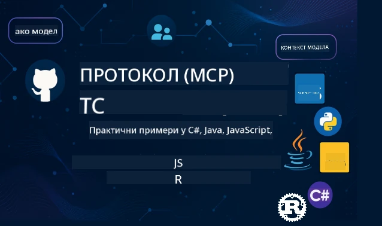

 

[](https://GitHub.com/microsoft/mcp-for-beginners/graphs/contributors)
[](https://GitHub.com/microsoft/mcp-for-beginners/issues)
[](https://GitHub.com/microsoft/mcp-for-beginners/pulls)
[](http://makeapullrequest.com)

[](https://GitHub.com/microsoft/mcp-for-beginners/watchers)
[](https://GitHub.com/microsoft/mcp-for-beginners/fork)
[](https://GitHub.com/microsoft/mcp-for-beginners/stargazers)


[](https://discord.gg/nTYy5BXMWG)

Пратите ове кораке да започнете коришћење ових ресурса:
1. **Форк репозиторијума**: Кликните [](https://GitHub.com/microsoft/mcp-for-beginners/fork)
2. **Клонирајте репозиторијум**:   `git clone https://github.com/microsoft/mcp-for-beginners.git`
3. **Придружите се** [](https://discord.gg/nTYy5BXMWG)


### 🌐 Подршка за више језика

#### Подржано преко GitHub акције (Аутоматски и увек ажурирано)

<!-- CO-OP TRANSLATOR LANGUAGES TABLE START -->
[Arabic](../ar/README.md) | [Bengali](../bn/README.md) | [Bulgarian](../bg/README.md) | [Burmese (Myanmar)](../my/README.md) | [Chinese (Simplified)](../zh-CN/README.md) | [Chinese (Traditional, Hong Kong)](../zh-HK/README.md) | [Chinese (Traditional, Macau)](../zh-MO/README.md) | [Chinese (Traditional, Taiwan)](../zh-TW/README.md) | [Croatian](../hr/README.md) | [Czech](../cs/README.md) | [Danish](../da/README.md) | [Dutch](../nl/README.md) | [Estonian](../et/README.md) | [Finnish](../fi/README.md) | [French](../fr/README.md) | [German](../de/README.md) | [Greek](../el/README.md) | [Hebrew](../he/README.md) | [Hindi](../hi/README.md) | [Hungarian](../hu/README.md) | [Indonesian](../id/README.md) | [Italian](../it/README.md) | [Japanese](../ja/README.md) | [Kannada](../kn/README.md) | [Korean](../ko/README.md) | [Lithuanian](../lt/README.md) | [Malay](../ms/README.md) | [Malayalam](../ml/README.md) | [Marathi](../mr/README.md) | [Nepali](../ne/README.md) | [Nigerian Pidgin](../pcm/README.md) | [Norwegian](../no/README.md) | [Persian (Farsi)](../fa/README.md) | [Polish](../pl/README.md) | [Portuguese (Brazil)](../pt-BR/README.md) | [Portuguese (Portugal)](../pt-PT/README.md) | [Punjabi (Gurmukhi)](../pa/README.md) | [Romanian](../ro/README.md) | [Russian](../ru/README.md) | [Serbian (Cyrillic)](./README.md) | [Slovak](../sk/README.md) | [Slovenian](../sl/README.md) | [Spanish](../es/README.md) | [Swahili](../sw/README.md) | [Swedish](../sv/README.md) | [Tagalog (Filipino)](../tl/README.md) | [Tamil](../ta/README.md) | [Telugu](../te/README.md) | [Thai](../th/README.md) | [Turkish](../tr/README.md) | [Ukrainian](../uk/README.md) | [Urdu](../ur/README.md) | [Vietnamese](../vi/README.md)

> **Више волите да клонирате локално?**
>
> Овај репозиторијум укључује преко 50 превода на језике што знатно повећава величину преузимања. Да бисте клонирали без превода, користите sparse checkout:
>
> **Bash / macOS / Linux:**
> ```bash
> git clone --filter=blob:none --sparse https://github.com/microsoft/mcp-for-beginners.git
> cd mcp-for-beginners
> git sparse-checkout set --no-cone '/*' '!translations' '!translated_images'
> ```
>
> **CMD (Windows):**
> ```cmd
> git clone --filter=blob:none --sparse https://github.com/microsoft/mcp-for-beginners.git
> cd mcp-for-beginners
> git sparse-checkout set --no-cone "/*" "!translations" "!translated_images"
> ```
>
> Ово вам даје све што вам је потребно за завршавање курса уз много брже преузимање.
<!-- CO-OP TRANSLATOR LANGUAGES TABLE END -->

# 🚀 Наставни план за Model Context Protocol (MCP) за почетнике

## **Научите MCP уз практичне примере кода у C#, Java, JavaScript, Rust, Python и TypeScript**

## 🧠 Преглед наставног плана за Model Context Protocol
Добродошли на ваше путовање у свет Model Context Protocol! Ако сте се икада питали како AI апликације комуницирају са различитим алатима и услугама, спремни сте да откријете елегантно решење које мења начин на који програмери изграђују интелигентне системе.

Замислите MCP као универзалног преводиоца за AI апликације — баш као што вам USB портови дозвољавају да повежете било који уређај са рачунаром, MCP омогућава AI моделима да се повежу са било којим алатом или услугом на стандардизован начин. Без обзира да ли градите свог првог чат-бота или радите на сложеним AI радним токовима, разумевање MCP ће вам дати моћ да креирате способније и флексибилније апликације.

Овај наставни план је осмишљен са стрпљењем и пажњом за ваше учење. Почећемо са једноставним концептима које већ разумете и постепено ћемо градити ваше вештине кроз практичан рад у вашем омиљеном програмском језику. Сваког корака вас чекају јасна објашњења, практични примери и пуно подршке.

Када завршите ово путовање, имаћете самопоуздање да направите сопствене MCP сервере, интегришете их са популарним AI платформама и разумете како ова технологија преобликује будућност развоја AI. Хајде да заједно започнемо ову узбудљиву авантуру!

### Званична документација и спецификације

Овај наставни план је усклађен са **MCP спецификацијом 2025-11-25** (најновије стабилно издање). MCP спецификација користи верзионисање базирано на датуму (формат ГГГГ-ММ-ДД) како би се обезбедило јасно праћење верзија протокола.

Ови ресурси постају све вреднији како ваша разумевања расте, али немојте се осећати обавезно да све читате одмах. Почните са областима које вас највише занимају!
- 📘 [MCP документација](https://modelcontextprotocol.io/) – Ово је ваш основни извор за корак-по-корак упутства и водиче за кориснике. Документација је написана имајући почетнике у виду, пружајући јасне примере које можете пратити својим темпом.
- 📜 [MCP спецификација](https://modelcontextprotocol.io/specification/2025-11-25) – Разматрајте ово као ваш свеобухватни референтни приручник. Како радите кроз наставни план, враћаћете се овде да проучите конкретне детаље и истражите напредне функције.
- 📜 [MCP верзионисање спецификације](https://modelcontextprotocol.io/specification/versioning) – Садржи информације о историјату верзија протокола и како MCP користи верзионисање засновано на датуму (формат ГГГГ-ММ-ДД).
- 🧑‍💻 [MCP GitHub репозиторијум](https://github.com/modelcontextprotocol) – Овде ћете пронаћи SDK-ове, алате и примере кода на више програмских језика. То је као ризница практичних примера и компоненти спремних за употребу.
- 🌐 [MCP заједница](https://github.com/orgs/modelcontextprotocol/discussions) – Придружите се другим учесницима и искусним програмерима у дискусијама о MCP. Ово је подржавајућа заједница у којој су питања добродошла а знање се слободно дели.
  
## Циљеви учења

До краја овог наставног плана осећаћете се самопоуздано и узбуђено због нових способности. Ево шта ћете постићи:

• **Разумети основе MCP-а**: Разумећете шта је Model Context Protocol и зашто револуционише рад AI апликација заједно, користећи аналогне примере и јасне илустрације.

• **Направити свој први MCP сервер**: Креираћете радни MCP сервер у жељеном програмском језику, почевши од једноставних примера и постепено развијајући своје вештине.

• **Повезати AI моделе са стварним алатима**: Научићете како да повеђете јаз између AI модела и стварних услуга, дајући вашим апликацијама јаке нове могућности.

• **Примењивати најбоље безбедносне праксе**: Разумеваћете како да обезбедите своје MCP имплементације, штитећи и апликације и кориснике.

• **Деплојовати са поверењем**: Знаћете како да своје MCP пројекте пребаците из развоја у продукцију уз практичне стратегије које функционишу у стварном свету.

• **Придружити се MCP заједници**: Постаћете део растуће заједнице програмера који обликују будућност развоја AI апликација.

## Основно предзнање

Пре него што зароните у MCP специфичности, хајде да проверимо да ли сте удобни са неким основним концептима. Не брините ако нисте стручњак у овим областима — све ћемо објаснити како идемо!

### Разумевање протокола (Основ)

Протокол замислите као правила за разговор. Када зовете пријатеља, обoje знате да треба да кажете "здраво" кад се јавите, да се смењујете док говорите и да на крају кажете "довиђења". Програмима су такође потребна слична правила да би ефикасно комуницирали.

MCP је протокол — скуп договорених правила који помажу AI моделима и апликацијама да имају продуктивне "разговоре" са алатима и услугама. Баш као што правила разговора чине људску комуникацију глатком, MCP чини комуникацију AI апликација поузданијом и моћнијом.

### Клијент-сервер односи (Како програми раде заједно)

Већ користите клијент-сервер односе сваког дана! Када користите веб претраживач (клијент) да посетите веб страницу, повезујете се са веб сервером који вам шаље садржај странице. Прегледач зна како да затражи информације, а сервер како да одговори.

У MCP-у имамо сличан однос: AI модели делују као клијенти који траже информације или радње, док MCP сервери обезбеђују те могућности. То је као да имате корисног асистента (сервер) кога AI може замолити да обави одређене задатке.

### Зашто је стандардизација важна (Чини да ствари раде заједно)

Замислите да сваки произвођач аутомобила користи различите облике пумпи за гориво — морали бисте да имате другачији адаптер за сваки ауто! Стандардизација значи договор оједначених приступа како би све радило беспрекорно заједно.

MCP обезбеђује ову стандардизацију за AI апликације. Уместо да сваки AI модел треба посебан код да би радио са сваким алатом, MCP креира универзалан начин да комуницирају. То значи да програмери могу направити алате једном и учинити их функционалним са многим различитим AI системима.

## 🧭 Преглед вашег пута учења

Ваше MCP путовање је пажљиво структурирано да постепено изграђује ваше самопоуздање и вештине. Свака фаза уводи нове концепте уз појачавање оног што сте већ научили.

### 🌱 Фаза темеља: Разумевање основа (Модули 0-2)

Ово је место где почиње ваша авантура! Увешћемо вас у MCP концепте користећи познате аналогије и једноставне примере. Разумећете шта је MCP, зашто постоји и како се уклапа у шири свет AI развоја.

• **Модул 0 - Увод у MCP**: Почећемо истраживањем шта је MCP и зашто је важан за модерне AI апликације. Видећете примере MCP у пракси и разумети како решава честе проблеме са којима се суочавају програмери.

• **Модул 1 - Објашњавање основних појмова**: Овде ћете научити основне градивне блокове MCP-а. Користићемо много аналогија и визуелних примера да ти концепти делују природно и јасно.

• **Модул 2 - Безбедност у MCP-у**: Безбедност може звучати застрашујуће, али показаћемо вам како MCP има уграђене безбедносне функције и научити ћемо вас најбољим праксама које штите ваше апликације од самог почетка.

### 🔨 Фаза изградње: Креирање ваших првих имплементација (Модул 3)

Сада почиње права забава! Добићете практично искуство прављења стварних MCP сервера и клијената. Не брините — почећемо једноставно и водити вас кроз сваки корак.
Овај модул укључује више практичних водича који вам омогућавају да вежбате у вашем омиљеном програмском језику. Направићете свој први сервер, израдити клијента који ће се повезати с њим, и чак интегрисати са популарним алатима за развој као што је VS Code.

Сваки водич садржи комплетне примере кода, савете за решавање проблема и објашњења зашто доносимо одређене дизајнерске одлуке. До краја ове фазе, имаћете радне MCP имплементације на које можете бити поносни!

### 🚀 Фаза раста: Напредни концепти и примена у стварном свету (Модули 4-5)

Када савладате основе, спремни сте за истраживање сложенијих функција MCP-а. Обухватићемо практичне стратегије имплементације, технике отклањања грешака и напредне теме као што је мулти-модална AI интеграција.

Такође ћете научити како да мерите ваше MCP имплементације за производну употребу и интегришете их са облачним платформама као што је Azure. Ови модули вас припремају за прављење MCP решења која могу да задовоље захтеве стварног света.

### 🌟 Фаза мајсторства: Заједница и специјализација (Модули 6-11)

Завршна фаза се фокусира на придруживање MCP заједници и специјализацију у областима које вас највише занимају. Научићете како да доприносите пројектима отвореног кода у оквиру MCP-а, имплементирате напредне образце аутентификације и градите обухватна решења интегрисана са базама података.

Модул 11 заслужује посебну пажњу – то је комплетан пут учења кроз 13 лабораторија који вас учи како да градите сервере спремне за производњу са PostgreSQL интеграцијом. То је као завршни пројекат који сабира све што сте научили!

### 📚 Комплетна структура наставног плана

| Модул | Тема | Опис | Линк |
|--------|-------|-------------|------|
| **Модули 0-3: Основе** | | | |
| 00 | Увод у MCP | Преглед модела протокола контекста и његова значаја у AI пипелинима | [Прочитајте више](./00-Introduction/README.md) |
| 01 | Објашњење основних концепата | Детаљно истраживање основних концепата MCP-а | [Прочитајте више](./01-CoreConcepts/README.md) |
| 02 | Безбедност у MCP-у | Безбедносне претње и најбоље праксе | [Прочитајте више](./02-Security/README.md) |
| 03 | Започињање са MCP-ом | Подешавање окружења, основни сервери/клијенти, интеграција | [Прочитајте више](./03-GettingStarted/README.md) |
| **Модул 3: Израда вашег првог сервера и клијента** | | | |
| 3.1 | Први сервер | Направите свој први MCP сервер | [Водич](./03-GettingStarted/01-first-server/README.md) |
| 3.2 | Први клијент | Развијте основни MCP клијент | [Водич](./03-GettingStarted/02-client/README.md) |
| 3.3 | Клијент са LLM | Интегришите велике језичке моделе | [Водич](./03-GettingStarted/03-llm-client/README.md) |
| 3.4 | Интеграција у VS Code | Користите MCP сервере у VS Code-у | [Водич](./03-GettingStarted/04-vscode/README.md) |
| 3.5 | stdio сервер | Направите сервере користећи stdio транспорт | [Водич](./03-GettingStarted/05-stdio-server/README.md) |
| 3.6 | HTTP стриминг | Имплементирајте HTTP стриминг у MCP-у | [Водич](./03-GettingStarted/06-http-streaming/README.md) |
| 3.7 | AI алат | Користите AI Toolkit са MCP-ом | [Водич](./03-GettingStarted/07-aitk/README.md) |
| 3.8 | Тестирање | Тестирајте вашу MCP сервер имплементацију | [Водич](./03-GettingStarted/08-testing/README.md) |
| 3.9 | Размештање | Распоредите MCP сервере у продукцију | [Водич](./03-GettingStarted/09-deployment/README.md) |
| 3.10 | Напредна употреба сервера | Користите напредне сервере за коришћење напредних функција и побољшану архитектуру | [Водич](./03-GettingStarted/10-advanced/README.md) |
| 3.11 | Једноставна аутентификација | Поглавље које вам показује аутентификацију од почетка и RBAC | [Водич](./03-GettingStarted/11-simple-auth/README.md) |
| 3.12 | MCP домаћини | Конфигуришите Claude Desktop, Cursor, Cline и друге MCP домаћине | [Водич](./03-GettingStarted/12-mcp-hosts/README.md) |
| 3.13 | MCP инспектор | Отклањајте грешке и тестирајте MCP сервере помоћу алата Inspector | [Водич](./03-GettingStarted/13-mcp-inspector/README.md) |
| 3.14 | Узорковање | Користите узорковање за сарадњу са клијентом | [Водич](./03-GettingStarted/14-sampling/README.md) |
| 3.15 | MCP апликације | Градите MCP апликације | [Водич](./03-GettingStarted/15-mcp-apps/README.md) |
| **Модули 4-5: Практично и напредно** | | | |
| 04 | Практична имплементација | SDK-ови, отклањање грешака, тестирање, поновно употребљиви шаблони упита | [Прочитајте више](./04-PracticalImplementation/README.md) |
| 4.1 | Пагинација | Обрадите велике скупове резултата помоћу пагинације засноване на курсору | [Водич](./04-PracticalImplementation/pagination/README.md) |
| 05 | Напредне теме у MCP-у | Мулти-модална AI, масштабирање, коришћење у предузећима | [Прочитајте више](./05-AdvancedTopics/README.md) |
| 5.1 | Azure интеграција | MCP интеграција са Azure-ом | [Водич](./05-AdvancedTopics/mcp-integration/README.md) |
| 5.2 | Мулти-модалност | Рад са више модалитета | [Водич](./05-AdvancedTopics/mcp-multi-modality/README.md) |
| 5.3 | Демонстрација OAuth2 | Имплементација OAuth2 аутентификације | [Водич](./05-AdvancedTopics/mcp-oauth2-demo/README.md) |
| 5.4 | Рутни контексти | Разумевање и имплементација рутних контекста | [Водич](./05-AdvancedTopics/mcp-root-contexts/README.md) |
| 5.5 | Рутирање | Стратегије рутирања у MCP-у | [Водич](./05-AdvancedTopics/mcp-routing/README.md) |
| 5.6 | Узорковање | Технике узорковања у MCP-у | [Водич](./05-AdvancedTopics/mcp-sampling/README.md) |
| 5.7 | Масхтирање | Масхтирање MCP имплементација | [Водич](./05-AdvancedTopics/mcp-scaling/README.md) |
| 5.8 | Безбедност | Напредне безбедносне разматрања | [Водич](./05-AdvancedTopics/mcp-security/README.md) |
| 5.9 | Веб претрага | Имплементација веб претраге | [Водич](./05-AdvancedTopics/web-search-mcp/README.md) |
| 5.10 | Стреаминг у реалном времену | Изградња функционалности стриминга у реалном времену | [Водич](./05-AdvancedTopics/mcp-realtimestreaming/README.md) |
| 5.11 | Претрага у реалном времену | Имплементација претраге у реалном времену | [Водич](./05-AdvancedTopics/mcp-realtimesearch/README.md) |
| 5.12 | Аутентификација са Entra ID | Аутентификација помоћу Microsoft Entra ID | [Водич](./05-AdvancedTopics/mcp-security-entra/README.md) |
| 5.13 | Foundry интеграција | Интеграција са Azure AI Foundry-ом | [Водич](./05-AdvancedTopics/mcp-foundry-agent-integration/README.md) |
| 5.14 | Инжењеринг контекста | Технике за ефикасан инжењеринг контекста | [Водич](./05-AdvancedTopics/mcp-contextengineering/README.md) |
| 5.15 | MCP прилагођени транспорт | Прилагођене имплементације транспорта | [Водич](./05-AdvancedTopics/mcp-transport/README.md) |
| 5.16 | Карактеристике протокола | Обавештења о напретку, отказивање, шаблони ресурса | [Водич](./05-AdvancedTopics/mcp-protocol-features/README.md) |
| **Модули 6-10: Заједница и најбоље праксе** | | | |
| 06 | Доприноси заједници | Како допринети MCP екосистему | [Водич](./06-CommunityContributions/README.md) |
| 07 | Увид из раног усвајања | Приче о имплементацији у стварном свету | [Водич](./07-LessonsfromEarlyAdoption/README.md) |
| 08 | Најбоље праксе за MCP | Перформансе, отпорност на грешке, стабилност | [Водич](./08-BestPractices/README.md) |
| 09 | Студије случаја MCP-а | Практични примери имплементације | [Водич](./09-CaseStudy/README.md) |
| 10 | Практични радионица | Израда MCP сервера са AI Toolkit-ом | [Лаб](./10-StreamliningAIWorkflowsBuildingAnMCPServerWithAIToolkit/README.md) |
| **Модул 11: MCP сервер лабораторије** | | | |
| 11 | MCP сервер и интеграција базе података | Комплетан пут учења кроз 13 лабораторија за интеграцију са PostgreSQL | [Лабораторије](./11-MCPServerHandsOnLabs/README.md) |
| 11.1 | Увод | Преглед MCP-а са интеграцијом базе података и употребни случај аналитике трговине | [Лаб 00](./11-MCPServerHandsOnLabs/00-Introduction/README.md) |
| 11.2 | Основна архитектура | Разумевање архитектуре MCP сервера, слојева базе и безбедносних образаца | [Лаб 01](./11-MCPServerHandsOnLabs/01-Architecture/README.md) |
| 11.3 | Безбедност и мулти-тенантност | Безбедност на нивоу редова, аутентификација и приступ мулти-тенантним подацима | [Лаб 02](./11-MCPServerHandsOnLabs/02-Security/README.md) |
| 11.4 | Подешавање окружења | Постављање развојног окружења, Docker-а, Azure ресурса | [Лаб 03](./11-MCPServerHandsOnLabs/03-Setup/README.md) |
| 11.5 | Дизајн базе података | Подешавање PostgreSQL-а, дизајн шеме за трговину и пример података | [Лаб 04](./11-MCPServerHandsOnLabs/04-Database/README.md) |
| 11.6 | Имплементација MCP сервера | Израда FastMCP сервера са интеграцијом базе података | [Лаб 05](./11-MCPServerHandsOnLabs/05-MCP-Server/README.md) |
| 11.7 | Развој алата | Креирање алата за упите базе података и инспекцију шеме | [Лаб 06](./11-MCPServerHandsOnLabs/06-Tools/README.md) |
| 11.8 | Семантичка претрага | Имплементација векторских уграђивања са Azure OpenAI и pgvector | [Лаб 07](./11-MCPServerHandsOnLabs/07-Semantic-Search/README.md) |
| 11.9 | Тестирање и отклањање грешака | Стратегије тестирања, алати за отклањање грешака и приступи валидацији | [Лаб 08](./11-MCPServerHandsOnLabs/08-Testing/README.md) |
| 11.10 | Интеграција у VS Code | Конфигурисање VS Code MCP интеграције и коришћење AI чата | [Лаб 09](./11-MCPServerHandsOnLabs/09-VS-Code/README.md) |
| 11.11 | Стратегије развоја | Распоређивање помоћу Docker-а, Azure Container Apps и разматрања у вези са масштабирањем | [Лаб 10](./11-MCPServerHandsOnLabs/10-Deployment/README.md) |
| 11.12 | Мониторинг | Application Insights, логовање, праћење перформанси | [Лаб 11](./11-MCPServerHandsOnLabs/11-Monitoring/README.md) |
| 11.13 | Најбоље праксе | Оптимизација перформанси, ојачавање безбедности и савети за продукцију | [Лаб 12](./11-MCPServerHandsOnLabs/12-Best-Practices/README.md) |

### 💻 Пример пројеката са кодом

Један од најузбудљивијих делова учења MCP-а јесте постепени развој ваших вештина кода. Дизајнирали смо наше примере кода да почну једноставно и постану сложенији како ваше разумевање буде дубље. Ево како представљамо концепте – са кодом који је лако разумљив али приказује стварне MCP принципе, нећете разумети само шта овај код ради, већ и зашто је структуриран на тај начин и како се уклапа у веће MCP апликације.

#### Основни примери MCP калкулатора

| Језик | Опис | Линк |
|----------|-------------|------|
| C# | Пример MCP сервера | [Погледај код](./03-GettingStarted/samples/csharp/README.md) |
| Java | MCP калкулатор | [Погледај код](./03-GettingStarted/samples/java/calculator/README.md) |
| JavaScript | MCP демонстрација | [Погледај код](./03-GettingStarted/samples/javascript/README.md) |
| Python | MCP сервер | [Погледај код](../../03-GettingStarted/samples/python/mcp_calculator_server.py) |
| TypeScript | MCP пример | [Погледај код](./03-GettingStarted/samples/typescript/README.md) |
| Rust | MCP пример | [Погледај код](./03-GettingStarted/samples/rust/README.md) |

#### Напредне MCP имплементације

| Језик | Опис | Линк |
|----------|-------------|------|
| C# | Напредни пример | [Погледај код](./04-PracticalImplementation/samples/csharp/README.md) |
| Java са Spring-ом | Пример контейнер апликације | [Погледај код](./04-PracticalImplementation/samples/java/containerapp/README.md) |
| JavaScript | Напредни пример | [Погледај код](./04-PracticalImplementation/samples/javascript/README.md) |
| Python | Сложена имплементација | [Погледај код](./04-PracticalImplementation/samples/python/README.md) |
| TypeScript | Пример са контејнером | [Погледај код](./04-PracticalImplementation/samples/typescript/README.md) |


## 🎯 Предуслови за учење MCP-а

Да бисте извукли максимум из овог наставног плана, требало би да имате:
- Основно знање програмирања у најмање једном од следећих језика: C#, Java, JavaScript, Python или TypeScript
- Разумевање клијент-сервер модела и API-ја
- Познавање REST и HTTP концепата
- (Опционо) Позадина у AI/ML концептима

- Учествовање у дискусијама наше заједнице ради подршке

## 📚 Водич за учење и ресурси

Ово складиште садржи неколико ресурса који ће вам помоћи да се ефикасно кретате и учите:

### Водич за учење

Доступан је свеобухватан [Водич за учење](./study_guide.md) који ће вам помоћи да се ефикасно крећете овим репозиторијумом. Ова визуелна мапа наставног плана показује како су све теме повезане и пружа смернице како да користите пример пројекте на ефективан начин. Посебно је корисна ако сте визуелни ученик који воле да виде целину.

Водич укључује:
- Визуелну мапу наставног плана која приказује све обухваћене теме
- Детаљан преглед сваког дела репозиторијума
- Упутства како користити пример пројекте
- Препоручене путање учења за различите нивое вештина
- Додатне ресурсе који допуњују ваш пут учења

### Измене (Changelog)

Одржавамо детаљан [Измене](./changelog.md) који прати све значајне измене у материјалима наставног плана, тако да можете бити у току са најновијим побољшањима и додацима.
- Додавање новог садржаја
- Структуралне промене
- Побољшања функција
- Ажурирања документације

## 🛠️ Како ефикасно користити овај наставни план

Свака лекција у овом водичу укључује:

1. Јасна објашњења MCP концепата  
2. Примере кода уживо у више језика  
3. Вежбе за израду правих MCP апликација  
4. Додатне ресурсе за напредне ученике

### Хајде да научимо MCP са C# - серија туторијала
Хајде да научимо о Model Context Protocol (MCP), савременом оквиру дизајнираном да стандардизује интеракције између AI модела и клијентских апликација. Кроз ову почетничку сесију представићемо вам MCP и водити вас кроз креирање вашег првог MCP сервера.
#### C#: [https://aka.ms/letslearnmcp-csharp](https://aka.ms/letslearnmcp-csharp)
#### Java: [https://aka.ms/letslearnmcp-java](https://aka.ms/letslearnmcp-java)
#### JavaScript: [https://aka.ms/letslearnmcp-javascript](https://aka.ms/letslearnmcp-javascript)
#### Python: [https://aka.ms/letslearnmcp-python](https://aka.ms/letslearnmcp-python)

## 🎓 Ваш MCP пут почиње

Честитамо! Управо сте направили први корак у узбудљивом путовању које ће проширити ваше програмерске способности и повезати вас са најсавременијим развојем AI-а.

### Шта сте већ постигли

Читањем овог уводног дела, већ сте почели да градите своју MCP основе знања. Разумете шта је MCP, зашто је важан и како ће вам овај наставни план помоћи у учењу. То је значајан успех и почетак вашег стручног знања о овој важној технологији.

### Пријатељство које је пред вама

Како будете напредовали кроз модуле, сетите се да је сваки стручњак некада био почетник. Концепти који вам сада могу деловати сложено постаће природни док их будете вежбали и примењивали. Сваки мали корак гради моћне способности које ће вам служити током целе развојне каријере.

### Ваша мрежа подршке

Придружујете се заједници ученика и стручњака који су страствени око MCP-а и спремни да помогну другима да успеју. Без обзира да ли сте заглављени на неком изазову у кодирању или узбуђени што желите да поделите свој успех, заједница је ту да подржи ваше путовање.

Ако сте заглављени или имате питања о прављењу AI апликација, придружите се колегама ученицима и искусним програмерима у дискусијама о MCP-у. То је заједница са подршком где су питања добродошла, а знање се слободно дели.

[](https://discord.gg/nTYy5BXMWG)

Ако имате повратне информације о производу или грешке приликом развоја посetite:

[](https://aka.ms/foundry/forum)

### Спремни за почетак?

Ваша MCP авантура почиње сада! Почните са Модулом 0 да зароните у своја прва практична MCP искуства, или истражите пример пројекте да видите шта ћете градити. Запамтите - сваки експерт је почео управо тамо где сте ви сада, а стрпљењем и праксом бићете изненађени шта све можете да постигнете.

Добродошли у свет развоја Model Context Protocol-а. Хајде да заједно направимо нешто невероватно!

## 🤝 Допринос заједници ученика

Овај наставни план јача уз доприносе ученика као што сте ви! Без обзира да ли исправљате правописну грешку, сугерирате јасније објашњење или додајете нови пример, ваши доприноси помажу другим почетницима да успеју.

Хвала Microsoft Valued Professional [Shivam Goyal](https://www.linkedin.com/in/shivam2003/) на доприносу примерима кода.

Процес доприноса је осмишљен да буде пријатељски и подржавајућ. Већина доприноса захтева Contributor License Agreement (CLA), али аутоматизовани алати ће вас водити кроз процес глатко.

## 📜 Отворено учење

Цео овај наставни план је доступан под MIT [LICENSE](../../LICENSE), што значи да га можете слободно користити, модификовати и делити. Ово подржава нашу мисију да омогућимо приступ MCP знању програмерима широм света.

## 🤝 Упутства за допринос

Овај пројекат поздравља доприносе и предлоге. Већина доприноса захтева да се сагласите са Contributor License Agreement (CLA) којим изјављујете да имате право и да нам заиста дајете права на коришћење вашег доприноса. За детаље посетите <https://cla.opensource.microsoft.com>.

Када пошаљете pull request, CLA бот ће аутоматски одредити да ли је потребно да доставите CLA и означити PR у складу са тим (нпр. проверу статуса, коментар). Једноставно пратите упутства која даје бот. Ово ћете морати урадити само једном за све репозиторијуме који користе наш CLA.

Овај пројекат је усвојио [Microsoft Open Source Code of Conduct](https://opensource.microsoft.com/codeofconduct/).
За више информација погледајте [Code of Conduct FAQ](https://opensource.microsoft.com/codeofconduct/faq/) или
контактирајте [opencode@microsoft.com](mailto:opencode@microsoft.com) за додатна питања или коментаре.

---

*Спремни да започнете своје MCP путовање? Почните са [Модул 00 - Увод у MCP](./00-Introduction/README.md) и направите своје прве кораке у свет развоја Model Context Protocol-а!*


## 🎒 Остали курсеви
Наш тим производи и друге курсеве! Погледајте:

<!-- CO-OP TRANSLATOR OTHER COURSES START -->
### LangChain
[](https://aka.ms/langchain4j-for-beginners)
[](https://aka.ms/langchainjs-for-beginners?WT.mc_id=m365-94501-dwahlin)
[](https://github.com/microsoft/langchain-for-beginners?WT.mc_id=m365-94501-dwahlin)
---

### Azure / Edge / MCP / Agents
[](https://github.com/microsoft/AZD-for-beginners?WT.mc_id=academic-105485-koreyst)
[](https://github.com/microsoft/edgeai-for-beginners?WT.mc_id=academic-105485-koreyst)
[](https://github.com/microsoft/mcp-for-beginners?WT.mc_id=academic-105485-koreyst)
[](https://github.com/microsoft/ai-agents-for-beginners?WT.mc_id=academic-105485-koreyst)

---
 
### Generative AI Series
[](https://github.com/microsoft/generative-ai-for-beginners?WT.mc_id=academic-105485-koreyst)
[-9333EA?style=for-the-badge&labelColor=E5E7EB&color=9333EA)](https://github.com/microsoft/Generative-AI-for-beginners-dotnet?WT.mc_id=academic-105485-koreyst)
[-C084FC?style=for-the-badge&labelColor=E5E7EB&color=C084FC)](https://github.com/microsoft/generative-ai-for-beginners-java?WT.mc_id=academic-105485-koreyst)
[-E879F9?style=for-the-badge&labelColor=E5E7EB&color=E879F9)](https://github.com/microsoft/generative-ai-with-javascript?WT.mc_id=academic-105485-koreyst)

---
 
### Основно учење
[](https://aka.ms/ml-beginners?WT.mc_id=academic-105485-koreyst)
[](https://aka.ms/datascience-beginners?WT.mc_id=academic-105485-koreyst)
[](https://aka.ms/ai-beginners?WT.mc_id=academic-105485-koreyst)
[](https://github.com/microsoft/Security-101?WT.mc_id=academic-96948-sayoung)
[](https://aka.ms/webdev-beginners?WT.mc_id=academic-105485-koreyst)
[](https://aka.ms/iot-beginners?WT.mc_id=academic-105485-koreyst)
[](https://github.com/microsoft/xr-development-for-beginners?WT.mc_id=academic-105485-koreyst)

---
 
### Copilot серија

[](https://aka.ms/GitHubCopilotAI?WT.mc_id=academic-105485-koreyst)
[](https://github.com/microsoft/mastering-github-copilot-for-dotnet-csharp-developers?WT.mc_id=academic-105485-koreyst)
[](https://github.com/microsoft/CopilotAdventures?WT.mc_id=academic-105485-koreyst)
<!-- CO-OP TRANSLATOR OTHER COURSES END -->

---

<!-- CO-OP TRANSLATOR DISCLAIMER START -->
**Изјава о одрицању одговорности**:
Овај документ је преведен помоћу АИ услуге за превођење [Co-op Translator](https://github.com/Azure/co-op-translator). Иако се трудимо да превод буде тачан, имајте у виду да аутоматски преводи могу садржати грешке или нетачности. Изворни документ на оригиналном језику треба сматрати ауторитетним. За критичне информације препоручује се професионални превод од стране људског преводиоца. Нисмо одговорни за било каква непоразумевања или погрешне интерпретације које могу настати употребом овог превода.
<!-- CO-OP TRANSLATOR DISCLAIMER END -->