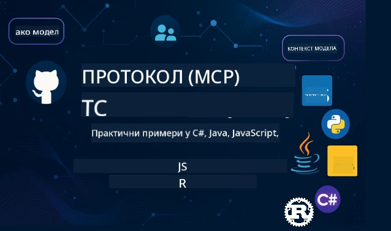

 

[](https://GitHub.com/microsoft/mcp-for-beginners/graphs/contributors)
[](https://GitHub.com/microsoft/mcp-for-beginners/issues)
[](https://GitHub.com/microsoft/mcp-for-beginners/pulls)
[](http://makeapullrequest.com)
[](https://mcptoplist.com/server/mcp.so%2Fmcp-for-beginners%2Fmicrosoft)

[](https://GitHub.com/microsoft/mcp-for-beginners/watchers)
[](https://GitHub.com/microsoft/mcp-for-beginners/fork)
[](https://GitHub.com/microsoft/mcp-for-beginners/stargazers)


[](https://discord.gg/nTYy5BXMWG)

Pratite ove korake da biste započeli korišćenje ovih resursa:
1. **Napravite viljušku (Fork) repozitorijuma**: Kliknite na [](https://GitHub.com/microsoft/mcp-for-beginners/fork)
2. **Klounirajte repozitorijum**:   `git clone https://github.com/microsoft/mcp-for-beginners.git`
3. **Pridružite se** [](https://discord.gg/nTYy5BXMWG)


### 🌐 Višejezička podrška

#### Podržano putem GitHub Akcije (Automatski i Uvek Ažurirano)

<!-- CO-OP TRANSLATOR LANGUAGES TABLE START -->
[Arabic](../ar/README.md) | [Bengali](../bn/README.md) | [Bulgarian](../bg/README.md) | [Burmese (Myanmar)](../my/README.md) | [Chinese (Simplified)](../zh-CN/README.md) | [Chinese (Traditional, Hong Kong)](../zh-HK/README.md) | [Chinese (Traditional, Macau)](../zh-MO/README.md) | [Chinese (Traditional, Taiwan)](../zh-TW/README.md) | [Croatian](../hr/README.md) | [Czech](../cs/README.md) | [Danish](../da/README.md) | [Dutch](../nl/README.md) | [Estonian](../et/README.md) | [Finnish](../fi/README.md) | [French](../fr/README.md) | [German](../de/README.md) | [Greek](../el/README.md) | [Hebrew](../he/README.md) | [Hindi](../hi/README.md) | [Hungarian](../hu/README.md) | [Indonesian](../id/README.md) | [Italian](../it/README.md) | [Japanese](../ja/README.md) | [Kannada](../kn/README.md) | [Khmer](../km/README.md) | [Korean](../ko/README.md) | [Lithuanian](../lt/README.md) | [Malay](../ms/README.md) | [Malayalam](../ml/README.md) | [Marathi](../mr/README.md) | [Nepali](../ne/README.md) | [Nigerian Pidgin](../pcm/README.md) | [Norwegian](../no/README.md) | [Persian (Farsi)](../fa/README.md) | [Polish](../pl/README.md) | [Portuguese (Brazil)](../pt-BR/README.md) | [Portuguese (Portugal)](../pt-PT/README.md) | [Punjabi (Gurmukhi)](../pa/README.md) | [Romanian](../ro/README.md) | [Russian](../ru/README.md) | [Serbian (Cyrillic)](./README.md) | [Slovak](../sk/README.md) | [Slovenian](../sl/README.md) | [Spanish](../es/README.md) | [Swahili](../sw/README.md) | [Swedish](../sv/README.md) | [Tagalog (Filipino)](../tl/README.md) | [Tamil](../ta/README.md) | [Telugu](../te/README.md) | [Thai](../th/README.md) | [Turkish](../tr/README.md) | [Ukrainian](../uk/README.md) | [Urdu](../ur/README.md) | [Vietnamese](../vi/README.md)

> **Преферирате локално клонирање?**
>
> Овај репозиторијум укључује преводе на преко 50 језика што значајно повећава величину преузимања. Да бисте клонирали без превода, користите sparse checkout:
>
> **Bash / macOS / Linux:**
> ```bash
> git clone --filter=blob:none --sparse https://github.com/microsoft/mcp-for-beginners.git
> cd mcp-for-beginners
> git sparse-checkout set --no-cone '/*' '!translations' '!translated_images'
> ```
>
> **CMD (Windows):**
> ```cmd
> git clone --filter=blob:none --sparse https://github.com/microsoft/mcp-for-beginners.git
> cd mcp-for-beginners
> git sparse-checkout set --no-cone "/*" "!translations" "!translated_images"
> ```
>
> Ово вам даје све што вам је потребно да завршите курс са много бржим преузимањем.
<!-- CO-OP TRANSLATOR LANGUAGES TABLE END -->

# 🚀 План учења за Model Context Protocol (MCP) за почетнике

## **Учење MCP уз примере кода у C#, Java, JavaScript, Rust, Python и TypeScript**

## 🧠 Преглед плана учења Model Context Protocol
Добро дошли на путовање у Model Context Protocol! Ако сте икада размишљали како АИ апликације комуницирају са различитим алаткама и сервисима, управо ћете открити елегантно решење које мења начин на који програмери граде интелигентне системе.

Замислите MCP као универзалног преводиоца за АИ апликације – као што вам УСБ портови омогућавају да повежете било који уређај са рачунаром, MCP омогућава АИ моделима да се повежу са било којим алатом или сервисом на стандардизовани начин. Без обзира да ли правите свог првог чатбота или радите на сложеним АИ токовима, разумевање MCP ће вам дати моћ да креирате способније и флексибилније апликације.

Овај план учења је осмишљен са стрпљењем и пажњом за ваше учење. Почећемо са једноставним концептима које већ разумете и постепено ћемо градити ваше вештине кроз практичну примену у вашем омиљеном програмском језику. Свак корак укључује јасна објашњења, практичне примере и много охрабрења током целог пута.

Када завршите ово путовање, имаћете поверење да направите своје MCP сервере, интегришете их са популарним АИ платформама и разумете како ова технологија обликује будућност развоја АИ. Хајде да заједно започнемо ову узбудљиву авантуру!

### Службена документација и спецификације

Овај план учења је усклађен са **MCP спецификацијом 2025-11-25** (најновије стабилно издање). MCP спецификација користи верзионисање засновано на датуму (формат ГГГГ-ММ-ДД) за јасно праћење верзија протокола.

> **Поглед унапред:** кандидат за издање следеће верзије спецификације, **2026-07-28**, планира се за 28. јул 2026. Чини протокол бездржавним на нивоу транспорта, формализује оквир за проширења (MCP апликације, задаци), појачава ауторизацију и укида Roots, Sampling и Logging. Погледајте [Шта се мења у MCP: Кандидат за издање 2026-07-28](./01-CoreConcepts/mcp-2026-07-28-release-candidate.md) за детаљан преглед.

Ови ресурси постају вреднији како ваше разумевање расте, али немојте се осећати притискани да одмах све прочитате. Почните са областима које вас највише занимају!
- 📘 [MCP документација](https://modelcontextprotocol.io/) – Ово је ваш главни ресурс за корак-по-корак туторијале и корисничке водиче. Документација је написана са почетницима на уму, пружајући јасне примере које можете пратити својим темпом.
- 📜 [MCP спецификација](https://modelcontextprotocol.io/specification/2025-11-25) – Смарајте ово као свој комплетни референтни приручник. Док будете радили кроз план учења, враћаћете се овде да проверите специфичне детаље и истражите напредне функције.
- 📜 [MCP верзионисање спецификација](https://modelcontextprotocol.io/specification/versioning) – Ово садржи информације о историји верзија протокола и о томе како MCP користи верзионисање засновано на датуму (формат ГГГГ-ММ-ДД).
- 🧑‍💻 [MCP GitHub репозиторијум](https://github.com/modelcontextprotocol) – Овде ћете наћи SDK-ове, алате и примере кода на више програмских језика. То је као ризница практичних примера и компоненти спремних за употребу.
- 🌐 [MCP заједница](https://github.com/orgs/modelcontextprotocol/discussions) – Придружите се другим ученцима и искусним програмерима у дискусијама о MCP-у. То је подршкајућа заједница где су питања добродошла и знање се слободно дели.
  
## Циљеви учења

Када завршите овај план учења, осећаћете се сигурно и узбуђено због својих нових способности. Ево шта ћете постићи:

• **Разумети основе MCP-а**: Разумете шта је Model Context Protocol и зашто револуционише начин на који АИ апликације раде заједно, користећи аналогне и примере који имају смисла.

• **Креирати свој први MCP сервер**: Направићете радни MCP сервер у свом омиљеном програмском језику, почињући од једноставних примера и постепено развијајући вештине.

• **Повезати АИ моделе са стварним алаткама**: Научићете како да пређете јаз између АИ модела и стварних сервиса, дајући вашим апликацијама моћне нове могућности.

• **Примена најбољих безбедносних пракси**: Разумете како да ваше MCP имплементације буду безбедне, штитећи и ваше апликације и кориснике.

• **Деплој са поверењем**: Знаћете како да одведете своје MCP пројекте из развоја у продукцију, користећи практичне стратегије за примену које функционишу у стварном свету.

• **Придружити се MCP заједници**: Постаћете део растуће заједнице програмера који обликују будућност развоја АИ апликација.

## Основно предзнање

Пре него што уронимо у специфичности MCP-а, хајде да се уверимо да сте удобни са неким темељним појмовима. Не брините ако нисте стручњак у овим областима – све ћемо вам објаснити како идемо!

### Разумевање протокола (Темељ)

Замислите протокол као правила за разговор. Када зовете пријатеља, обоје знате да треба да кажете „здраво“ када се јавите, да се смењујете у говору и да кажете „довиђења“ када завршите. Компјутерски програми такође требају слична правила да би ефикасно комуницирали.

MCP је протокол – скуп договорених правила која помажу АИ моделима и апликацијама да имају продуктивне „разговоре“ са алаткама и сервисима. Баш као што правила за разговор олакшавају људску комуникацију, тако MCP чини комуникацију АИ апликација поузданијом и моћнијом.

### Клијент-сервер односи (Како програми раде заједно)

Већ свакодневно користите клијент-сервер односе! Када користите веб прегледач (клијент) да посетите вебсајт, повезујете се са веб сервером који вам шаље садржај странице. Прегледач зна како да затражи информације, а сервер зна како да одговори.

У MCP-у, имамо сличан однос: АИ модели делују као клијенти који захтевају информације или акције, док MCP сервери пружају те могућности. То је као да имате помоћног асистента (сервер) коме АИ може да затражи одређене задатке.

### Зашто стандардизација има значаја (Учини да ствари раде заједно)

Замислите да сваки произвођач аутомобила користи другачије облике прикључака за гориво – требало би вам другачији адаптер за сваки ауто! Стандардизација значи договор о заједничким приступима како би ствари радиле беспрекорно.

MCP пружа ову стандардизацију за АИ апликације. Уместо да сваки АИ модел захтева прилагођени код да ради са сваким алатом, MCP ствара универзалан начин за њихову комуникацију. Ово значи да програмери могу направити алате једном и користити их са многим различитим АИ системима.

## 🧭 Преглед вашег пута учења

Ваше MCP путовање је пажљиво структуирано да постепено гради ваше поверење и вештине. Свака фаза уводи нове концепте док потврђује оно што сте већ научили.

### 🌱 Фаза темеља: Разумевање основа (Модули 0-2)

Овде почиње ваша авантура! Увешћемо вас у MCP концепте користећи познате аналогне и једноставне примере. Разумете шта је MCP, зашто постоји и како се уклапа у ширии свет развоја АИ.


• **Модул 0 - Увод у MCP**: Почећемо истраживањем шта је MCP и зашто је толико важан за модерне АИ апликације. Видео ћете примере MCP у акцији из стварног света и разумети како решава уобичајене проблеме са којима се програмери суочавају.

• **Модул 1 - Објашњени основни концепти**: Овде ћете научити основне градивне блокове MCP. Користићемо много аналогија и визуелних примера како бисмо осигурали да концепти буду природни и разумљиви.

• **Модул 2 - Безбедност у MCP**: Безбедност може звучати застрашујуће, али показаћемо вам како MCP укључује уграђене безбедносне функције и научити вас најбољим праксама које штите ваше апликације од самог почетка.

### 🔨 Фаза изградње: Креирање ваших првих имплементација (Модул 3)

Сада почиње права забава! Добићете практично искуство у изградњи стварних MCP сервера и клијената. Не брините - почећемо од простог и водити вас кроз сваки корак.

Овај модул укључује више практичних упутстава која вам омогућавају да вежбате на вашем омиљеном програмском језику. Креираћете свој први сервер, направити клијента који се прикључује на њега и чак интегрисати са популарним развојним алатима као што је VS Code.

Сваки водич укључује комплетне примере кода, савете за решавање проблема и објашњења зашто правимо одређене дизајнерске изборе. На крају ове фазе, имаћете функционалне MCP имплементације на које можете бити поносни!

### 🚀 Фаза раста: Напредни концепти и примена у стварном свету (Модули 4-5)

Са основама савладаним, спремни сте да истражите софистицираније функције MCP. Обухватићемо практичне стратегије имплементације, технике дебаговања и напредне теме попут интеграције мулти-модалног АИ.

Такође ћете научити како да скалирате своје MCP имплементације за продукционо коришћење и интегришете их са облачним платформама као што је Azure. Ови модули вас припремају да градите MCP решења која могу да издрже захтеве из стварног света.

### 🌟 Фаза усавршавања: Заједница и специјализација (Модули 6-11)

Последња фаза се фокусира на придруживање MCP заједници и специјализацију у областима које вас највише занимају. Научићете како да допринесете пројектима отвореног кода MCP, имплементирате напредне шаблоне аутентификације и градите свеобухватна решења интегрисана са базама података.

Модул 11 заслужује посебну пажњу - то је комплетан пут учења са 13 практичних лабораторијских вежби који вас учи како да изградите продукционо спремне MCP сервере са PostgreSQL интеграцијом. То је као круна пројекта која сабира све што сте научили!

### 📚 Комплетна структура курикулума

| Модул | Тема | Опис | Линк |
|--------|-------|-------------|------|
| **Модули 0-3: Основе** | | | |
| 00 | Увод у MCP | Преглед Протокола контекста модела и његова значајност у АИ пијакама | [Read more](./00-Introduction/README.md) |
| 01 | Објашњени основни концепти | Детаљно истраживање основних MCP концепата | [Read more](./01-CoreConcepts/README.md) |
| 1.1 | Шта се мења у MCP (2026-07-28 RC) | Протокол без стања, оквир екстензија и депрецјације функција које долазе у следећој верзији спецификације | [Guide](./01-CoreConcepts/mcp-2026-07-28-release-candidate.md) |
| 02 | Безбедност у MCP | Безбедносне претње и најбоље праксе | [Read more](./02-Security/README.md) |
| 03 | Почетак рада са MCP | Подешавање окружења, основни сервери/клијенти, интеграција | [Read more](./03-GettingStarted/README.md) |
| **Модул 3: Изградња вашег првог сервера и клијента** | | | |
| 3.1 | Први сервер | Креирајте свој први MCP сервер | [Guide](./03-GettingStarted/01-first-server/README.md) |
| 3.2 | Први клијент | Развијте основни MCP клијент | [Guide](./03-GettingStarted/02-client/README.md) |
| 3.3 | Клијент са LLM | Интегрисање великих језичких модела | [Guide](./03-GettingStarted/03-llm-client/README.md) |
| 3.4 | Интеграција VS Code | Конзумирајте MCP сервере у VS Code | [Guide](./03-GettingStarted/04-vscode/README.md) |
| 3.5 | stdio сервер | Креирање сервера помоћу stdio транспорта | [Guide](./03-GettingStarted/05-stdio-server/README.md) |
| 3.6 | HTTP стриминг | Имплементација HTTP стриминга у MCP | [Guide](./03-GettingStarted/06-http-streaming/README.md) |
| 3.7 | Microsoft Foundry Toolkit | Коришћење Microsoft Foundry Toolkit са MCP | [Guide](./03-GettingStarted/07-aitk/README.md) |
| 3.8 | Тестирање | Тестирајте своју имплементацију MCP сервера | [Guide](./03-GettingStarted/08-testing/README.md) |
| 3.9 | Деплојмент | Размештај MCP сервера у продукцији | [Guide](./03-GettingStarted/09-deployment/README.md) |
| 3.10 | Напредна употреба сервера | Користите напредне сервере за напредне функције и побољшану архитектуру | [Guide](./03-GettingStarted/10-advanced/README.md) |
| 3.11 | Једноставна аутентификација | Поглавље које вам показује аутентификацију од почетка и RBAC | [Guide](./03-GettingStarted/11-simple-auth/README.md) |
| 3.12 | MCP хостови | Подешавање Claude Desktop, Cursor, Cline и других MCP хостова | [Guide](./03-GettingStarted/12-mcp-hosts/README.md) |
| 3.13 | MCP инспектор | Дебагујте и тестирајте MCP сервере уз алат Inspector | [Guide](./03-GettingStarted/13-mcp-inspector/README.md) |
| 3.14 | Узорковање | Користите узорковање за сарадњу са клијентом | [Guide](./03-GettingStarted/14-sampling/README.md) |
| 3.15 | MCP апликације | Креирајте MCP апликације | [Guide](./03-GettingStarted/15-mcp-apps/README.md) |
| **Модули 4-5: Практично и напредно** | | | |
| 04 | Практична имплементација | SDK-ови, дебаговање, тестирање, поновно употребљиви шаблони промптова | [Read more](./04-PracticalImplementation/README.md) |
| 4.1 | Пагинација | Руководите великим резултатима помоћу пагинације са курсором | [Guide](./04-PracticalImplementation/pagination/README.md) |
| 05 | Напредне теме у MCP | Мулти-модални АИ, скалирање, коришћење у ентерпрајзу | [Read more](./05-AdvancedTopics/README.md) |
| 5.1 | Azure интеграција | MCP интеграција са Azure | [Guide](./05-AdvancedTopics/mcp-integration/README.md) |
| 5.2 | Мулти-модалност | Рад са више модалитета | [Guide](./05-AdvancedTopics/mcp-multi-modality/README.md) |
| 5.3 | OAuth2 демо | Имплементација OAuth2 аутентификације | [Guide](./05-AdvancedTopics/mcp-oauth2-demo/README.md) |
| 5.4 | Рут контексти | Разумевање и имплементација коренских контекста | [Guide](./05-AdvancedTopics/mcp-root-contexts/README.md) |
| 5.5 | Роутинг | MCP стратегије рутирања | [Guide](./05-AdvancedTopics/mcp-routing/README.md) |
| 5.6 | Узорковање | Технике узорковања у MCP | [Guide](./05-AdvancedTopics/mcp-sampling/README.md) |
| 5.7 | Скалирање | Скалирање MCP имплементација | [Guide](./05-AdvancedTopics/mcp-scaling/README.md) |
| 5.8 | Безбедност | Напредна безбедносна разматрања | [Guide](./05-AdvancedTopics/mcp-security/README.md) |
| 5.9 | Веб претрага | Имплементација могућности веб претраге | [Guide](./05-AdvancedTopics/web-search-mcp/README.md) |
| 5.10 | Реални стриминг | Креирање функционалности за реално време стриминг | [Guide](./05-AdvancedTopics/mcp-realtimestreaming/README.md) |
| 5.11 | Реална претрага | Имплементација реалне претраге | [Guide](./05-AdvancedTopics/mcp-realtimesearch/README.md) |
| 5.12 | Аутентификација Entra ID | Аутентификација са Microsoft Entra ID | [Guide](./05-AdvancedTopics/mcp-security-entra/README.md) |
| 5.13 | Интеграција Foundry | Интеграција са Microsoft Foundry | [Guide](./05-AdvancedTopics/mcp-foundry-agent-integration/README.md) |
| 5.14 | Инжењеринг контекста | Технике за ефикасан инжењеринг контекста | [Guide](./05-AdvancedTopics/mcp-contextengineering/README.md) |
| 5.15 | Кастом транспорт MCP | Имплементације прилагођених транспорта | [Guide](./05-AdvancedTopics/mcp-transport/README.md) |
| 5.16 | Функције протокола | Обавештења о напретку, отказивање, шаблони ресурса | [Guide](./05-AdvancedTopics/mcp-protocol-features/README.md) |
| 5.17 | Адверзијални мулти-агентно размишљање | Два агента расправљају супротстављене стране користећи заједничке MCP алате, оцењује судијски агент | [Guide](./05-AdvancedTopics/mcp-adversarial-agents/README.md) |
| **Модули 6-10: Заједница и најбоље праксе** | | | |
| 06 | Заједнички доприноси | Како допринети MCP екосистему | [Guide](./06-CommunityContributions/README.md) |
| 07 | Увид из раних усвајања | Прича о реалним имплементацијама | [Guide](./07-LessonsfromEarlyAdoption/README.md) |
| 08 | Најбоље праксе за MCP | Перформансе, толеранција на грешке, отпорност | [Guide](./08-BestPractices/README.md) |
| 09 | MCP студије случаја | Практични примери имплементације | [Guide](./09-CaseStudy/README.md) |
| 10 | Практична радионица | Изградња MCP сервера са Microsoft Foundry Toolkit | [Lab](./10-StreamliningAIWorkflowsBuildingAnMCPServerWithAIToolkit/README.md) |
| **Модул 11: Практична лабораторија MCP сервера** | | | |
| 11 | Интеграција MCP сервера са базом података | Свеобухватан пут учења са 13 лабораторијских вежби за интеграцију PostgreSQL | [Labs](./11-MCPServerHandsOnLabs/README.md) |
| 11.1 | Увод | Преглед MCP-а са интеграцијом базе података и случајем коришћења у малопродаји аналитике | [Lab 00](./11-MCPServerHandsOnLabs/00-Introduction/README.md) |
| 11.2 | Основна архитектура | Разумевање архитектуре MCP сервера, слојеви базе података и безбедносни шаблони | [Lab 01](./11-MCPServerHandsOnLabs/01-Architecture/README.md) |
| 11.3 | Безбедност и вишекористнички приступ | Безбедност на нивоу реда, аутентификација и приступ вишекорисничким подацима | [Lab 02](./11-MCPServerHandsOnLabs/02-Security/README.md) |
| 11.4 | Подешавање окружења | Постављање развојног окружења, Docker, Azure ресурси | [Lab 03](./11-MCPServerHandsOnLabs/03-Setup/README.md) |
| 11.5 | Дизајн базе података | Подешавање PostgreSQL, дизајн малопродајне шеме и пример података | [Lab 04](./11-MCPServerHandsOnLabs/04-Database/README.md) |
| 11.6 | Имплементација MCP сервера | Изградња FastMCP сервера са интеграцијом базе података | [Lab 05](./11-MCPServerHandsOnLabs/05-MCP-Server/README.md) |
| 11.7 | Развој алата | Креирање алата за упите у базу података и интроспекцију шеме | [Lab 06](./11-MCPServerHandsOnLabs/06-Tools/README.md) |
| 11.8 | Семантичка претрага | Имплементација векторских уградања са Azure OpenAI и pgvector | [Lab 07](./11-MCPServerHandsOnLabs/07-Semantic-Search/README.md) |
| 11.9 | Тестирање и дебаговање | Стратегије тестирања, алати за дебаговање и приступи валидацији | [Lab 08](./11-MCPServerHandsOnLabs/08-Testing/README.md) |
| 11.10 | Интеграција VS Code | Конфигурисање MCP интеграције у VS Code и коришћење AI ћаскања | [Lab 09](./11-MCPServerHandsOnLabs/09-VS-Code/README.md) |
| 11.11 | Стратегије деплојмента | Docker деплојмент, Azure Container Apps и параметри скалирања | [Lab 10](./11-MCPServerHandsOnLabs/10-Deployment/README.md) |
| 11.12 | Мониторинг | Application Insights, логовање, праћење перформанси | [Lab 11](./11-MCPServerHandsOnLabs/11-Monitoring/README.md) |
| 11.13 | Најбоље праксе | Оптимизација перформанси, ојачавање безбедности и савети за продукцију | [Lab 12](./11-MCPServerHandsOnLabs/12-Best-Practices/README.md) |
| **Модул 12: MCP алати** | | | |
| 12.1 | Алатке | Коришћење MCP у Copilot апликацији | [ Guide ](./12-tooling/README.md) |

### 💻 Примери код пројеката

Један од најузбудљивијих делова учења MCP је постепено развијање ваших вештина кода. Дизајнирали смо наше примерке кода да почну једноставно и постају све софистициранији како ваше разумевање расте. Ево како уводимо концепте - са кодом који је лак за разумевање али демонстрира праве MCP принципе, схватићете не само шта овај код ради, већ и зашто је структуриран овако и како се уклапа у веће MCP апликације.

#### Основни примери MCP калкулатора

| Језик | Опис | Линк |
|----------|-------------|------|

| C# | MCP Пример за сервер | [View Code](./03-GettingStarted/samples/csharp/README.md) |
| Java | MCP Калкулатор | [View Code](./03-GettingStarted/samples/java/calculator/README.md) |
| JavaScript | MCP Демо | [View Code](./03-GettingStarted/samples/javascript/README.md) |
| Python | MCP Сервер | [View Code](../../03-GettingStarted/samples/python/mcp_calculator_server.py) |
| TypeScript | MCP Пример | [View Code](./03-GettingStarted/samples/typescript/README.md) |
| Rust | MCP Пример | [View Code](./03-GettingStarted/samples/rust/README.md) |

#### Напредне MCP имплементације

| Језик | Опис | Веза |
|----------|-------------|------|
| C# | Напредни пример | [View Code](./04-PracticalImplementation/samples/csharp/README.md) |
| Јава са Spring | Пример контејнер апликације | [View Code](./04-PracticalImplementation/samples/java/containerapp/README.md) |
| JavaScript | Напредни пример | [View Code](./04-PracticalImplementation/samples/javascript/README.md) |
| Python | Комплексна имплементација | [View Code](./04-PracticalImplementation/samples/python/README.md) |
| TypeScript | Пример контејнера | [View Code](./04-PracticalImplementation/samples/typescript/README.md) |


## 🎯 Претходни услови за учење MCP

Да бисте извукли максимум из овог курикулума, требало би да имате:

- Основно знање програмирања у бар једном од следећих језика: C#, Java, JavaScript, Python, или TypeScript
- Разумевање клијент-сервер модела и API-ја
- Познавање REST и HTTP концепата
- (Опционо) Позадина у AI/ML концептима

- Учествовање у дискусијама заједнице за подршку

## 📚 Водич за учење и ресурси

Овај репозиторијум укључује више ресурса који ће вам помоћи да се ефикасно крећете и учите:

### Водич за учење

Доступан је свеобухватан [Водич за учење](./study_guide.md) који ће вам помоћи да се ефикасно оријентишете у овом репозиторијуму. Ова визуелна мапа курикулума показује како су сви теме повезани и пружа смернице како ефикасно користити пример пројекте. Посебно је корисна ако сте визуелни ученик који воли да види целокупну слику.

Водич укључује:
- Визуелну мапу курикулума која приказује све покривене теме
- Детаљан преглед сваког одељка репозиторијума
- Смернице како користити пример пројекте
- Препоручене путеве учења за различите нивое вештина
- Додатне ресурсе који допуњују ваше учење

### Листа измена

Одржавамо детаљну [Листу измена](./changelog.md) која прати све значајне измене у материјалима курикулума, тако да можете остати у току са најновијим побољшањима и додацима.
- Нови садржаји
- Структурне измене
- Побољшања функција
- Ажурирања документације

## 🛠️ Како ефикасно користити овај курикулум

Свака лекција у овом водичу укључује:

1. Јасна објашњења MCP концепата  
2. Примере кода уживо на више језика  
3. Вежбе за израду стварних MCP апликација  
4. Додатне ресурсе за напредне ученике

### Хајде да учимо MCP са C# - серија туторијала
Хајде да упознамо Model Context Protocol (MCP), најсавременији оквир дизајниран да стандардизује интеракције између AI модела и клијент апликација. Кроз ову сесију прилагођену почетницима, представићемо вам MCP и водити вас кроз креирање вашег првог MCP сервера.
#### C#: [https://aka.ms/letslearnmcp-csharp](https://aka.ms/letslearnmcp-csharp)
#### Java: [https://aka.ms/letslearnmcp-java](https://aka.ms/letslearnmcp-java)
#### JavaScript: [https://aka.ms/letslearnmcp-javascript](https://aka.ms/letslearnmcp-javascript)
#### Python: [https://aka.ms/letslearnmcp-python](https://aka.ms/letslearnmcp-python)

## 🎓 Ваш MCP пут почиње

Честитамо! Управо сте направили први корак на узбудљивом путу који ће проширити ваше програмерске могућности и повезати вас са најсавременијим развојем AI.

### Шта сте већ постигли

Читајући овај увод, већ сте почели да градите своју основу знања о MCP. Разумете шта је MCP, зашто је важан и како ће вам овај курикулум помоћи у вашем учењу. То је значајно достигнуће и почетак ваше експертизе у овој важној технологији.

### Авантуре које су пред вама

Како напредујете кроз модуле, сетите се да је сваки стручњак некада био почетник. Концепти који можда сада изгледају компликовано постаће вам друга природа како будете вежбали и примењивали их. Сваки мали корак гради моћне вештине које ће вас служити кроз вашу развојну каријеру.

### Ваша мрежа подршке

Придружујете се заједници ученика и стручњака који су страствени према MCP и жељни да помогну другима да успеју. Без обзира да ли сте заглављени у изазову кодирања или сте узбуђени да поделите свој пробој, заједница је ту да подржи ваш пут.

Ако се заглавите или имате питања о изради AI апликација, придружите се другим ученицима и искусним програмерима у дискусијама о MCP-у. То је подржавајућа заједница где су питања добродошла а знање се слободно дели.

[](https://discord.gg/nTYy5BXMWG)

Ако имате повратне информације о производу или грешке током израде посetite:

[](https://aka.ms/foundry/forum)

### Спремни да започнете?

Ваша MCP авантура почиње сада! Почните са Модулом 0 да зароните у ваше прво практично искуство са MCP, или истражите пример пројекте да видите шта ћете градити. Запамтите - сваки стручњак је започео баш као и ви сада, а са стрпљењем и вежбом изненадићете се шта све можете постићи.

Добродошли у свет Model Context Protocol развоја. Хајде да заједно направимо нешто невероватно!

## 🤝 Допринос заједници учења

Овај курикулум јача уз доприносе ученика као што сте ви! Без обзира да ли исправљате типографску грешку, предлажете јасније објашњење или додајете нови пример, ваши доприноси помажу другим почетницима да успеју.

Захваљујемо Microsoft Valued Professional-у [Shivam Goyal](https://www.linkedin.com/in/shivam2003/) на доприносу примерима кода.

Процес доприноса је осмишљен да буде пријатељски и подржавајући. Већина доприноса захтева Споразум о лиценци за допринос (CLA), али аутоматизовани алати ће вас водити кроз поступак без проблема.

## 📜 Отворено учење

Цео овај курикулум је доступан под MIT [ЛИЦЕНЦОМ](../../LICENSE), што значи да га можете користити, модификовати и делити слободно. Ово подржава нашу мисију да учење MCP учинимо приступачним програмерима свуда.
## 🤝 Упутства за допринос

Овај пројекат добродошао је за доприносе и сугестије. Већина доприноса захтева да се сагласите са
Споразумом о лиценци за допринос (CLA) којим изјављујете да имате право и заправо дајете
права да користимо ваш допринос. За детаље посетите <https://cla.opensource.microsoft.com>.

Када пошаљете pull request, CLA бот ће аутоматски одредити да ли треба да пружите
CLA и одговарајуће означи PR (нпр. провера статуса, коментар). Једноставно пратите инструкције
које пружа бот. Ово морате урадити само једном за све репозиторијуме који користе наш CLA.

Овај пројекат је усвојио [Microsoft Open Source Code of Conduct](https://opensource.microsoft.com/codeofconduct/).
За више информација погледајте [Често Постављана Питања о Кодексу понашања](https://opensource.microsoft.com/codeofconduct/faq/) или
контактирајте [opencode@microsoft.com](mailto:opencode@microsoft.com) за додатна питања или коментаре.

---

*Спремни да започнете своју MCP авантуру? Почните са [Модул 00 - Увод у MCP](./00-Introduction/README.md) и направите своје прве кораке у свету Model Context Protocol развоја!*


## 🎒 Остали курсеви
Наш тим производи и друге курсеве! Погледајте:

<!-- CO-OP TRANSLATOR OTHER COURSES START -->
### LangChain
[](https://aka.ms/langchain4j-for-beginners)
[](https://aka.ms/langchainjs-for-beginners?WT.mc_id=m365-94501-dwahlin)
[](https://github.com/microsoft/langchain-for-beginners?WT.mc_id=m365-94501-dwahlin)
---

### Azure / Edge / MCP / Agents
[](https://github.com/microsoft/AZD-for-beginners?WT.mc_id=academic-105485-koreyst)
[](https://github.com/microsoft/edgeai-for-beginners?WT.mc_id=academic-105485-koreyst)
[](https://github.com/microsoft/mcp-for-beginners?WT.mc_id=academic-105485-koreyst)
[](https://github.com/microsoft/ai-agents-for-beginners?WT.mc_id=academic-105485-koreyst)

---
 
### Сертификати за генеративни AI
[](https://github.com/microsoft/generative-ai-for-beginners?WT.mc_id=academic-105485-koreyst)
[-9333EA?style=for-the-badge&labelColor=E5E7EB&color=9333EA)](https://github.com/microsoft/Generative-AI-for-beginners-dotnet?WT.mc_id=academic-105485-koreyst)
[-C084FC?style=for-the-badge&labelColor=E5E7EB&color=C084FC)](https://github.com/microsoft/generative-ai-for-beginners-java?WT.mc_id=academic-105485-koreyst)
[-E879F9?style=for-the-badge&labelColor=E5E7EB&color=E879F9)](https://github.com/microsoft/generative-ai-with-javascript?WT.mc_id=academic-105485-koreyst)

---
 
### Основно учење
[](https://aka.ms/ml-beginners?WT.mc_id=academic-105485-koreyst)
[](https://aka.ms/datascience-beginners?WT.mc_id=academic-105485-koreyst)
[](https://aka.ms/ai-beginners?WT.mc_id=academic-105485-koreyst)

[](https://github.com/microsoft/Security-101?WT.mc_id=academic-96948-sayoung)
[](https://aka.ms/webdev-beginners?WT.mc_id=academic-105485-koreyst)
[](https://aka.ms/iot-beginners?WT.mc_id=academic-105485-koreyst)
[](https://github.com/microsoft/xr-development-for-beginners?WT.mc_id=academic-105485-koreyst)

---
 
### Серия Копилот
[](https://aka.ms/GitHubCopilotAI?WT.mc_id=academic-105485-koreyst)
[](https://github.com/microsoft/mastering-github-copilot-for-dotnet-csharp-developers?WT.mc_id=academic-105485-koreyst)
[](https://github.com/microsoft/CopilotAdventures?WT.mc_id=academic-105485-koreyst)
<!-- CO-OP TRANSLATOR OTHER COURSES END -->

---

<!-- CO-OP TRANSLATOR DISCLAIMER START -->
**Изјава о одрицању одговорности**:
Овај документ је преведен коришћењем услуге за аутоматски превод [Co-op Translator](https://github.com/Azure/co-op-translator). Иако тежимо тачности, имајте у виду да аутоматски преводи могу садржати грешке или нетачности. Оригинални документ на његовом изворном језику треба сматрати ауторитативним извором. За критичне информације препоручује се професионални људски превод. Нисмо одговорни за било каква неспоразума или погрешна тумачења која произилазе из коришћења овог превода.
<!-- CO-OP TRANSLATOR DISCLAIMER END -->