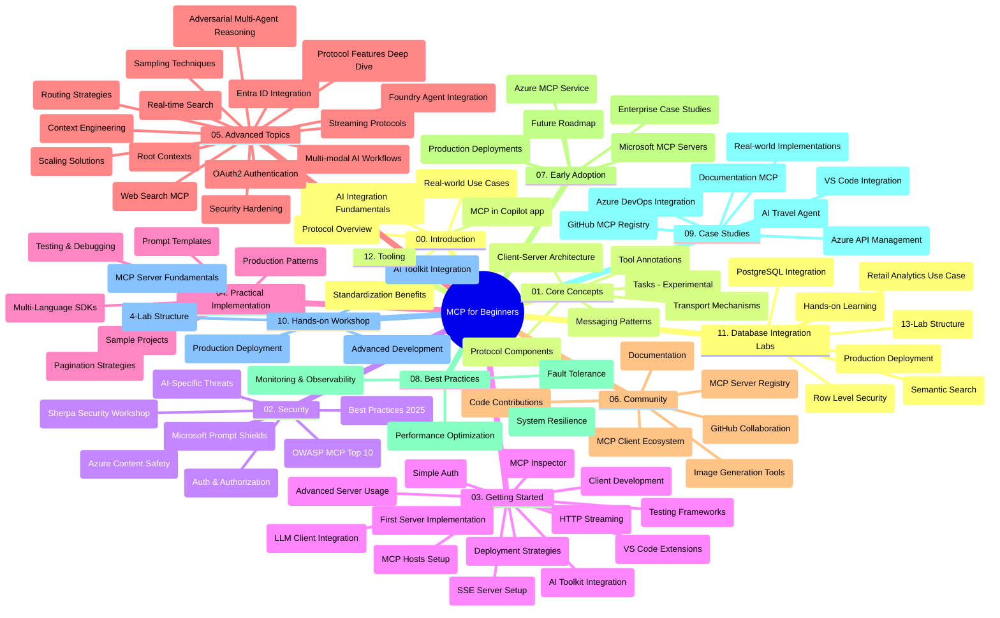

# Протокол модела контекста (MCP) за почетнике - Водич за учење

Овај водич за учење пружа преглед структуре и садржаја репозиторијума за наставни план "Протокол модела контекста (MCP) за почетнике". Користите овај водич за ефикасно сналажење у репозиторијуму и максимално коришћење расположивих ресурса.

## Преглед репозиторијума

Протокол модела контекста (MCP) је стандардизован оквир за интеракције између AI модела и клијент апликација. Првобитно креиран од стране Anthropic-а, MCP сада одржава шира MCP заједница кроз званичну GitHub организацију. Овај репозиторијум пружа свеобухватан наставни план са практичним примерима кода у C#, Java, JavaScript, Python и TypeScript, намењен AI програмерима, системским архитектама и софтверским инжењерима.

## Визуелна мапа наставног плана

## Структура репозиторијума

Репозиторијум је организован у дванаест главних секција, при чему се свака фокусира на различите аспекте MCP:

1. **Увод (00-Introduction/)**
   - Преглед Протокола модела контекста
   - Зашто је стандардизација важна у AI процесима
   - Практични примери употребе и користи

2. **Основни концепти (01-CoreConcepts/)**
   - Клијент-сервер архитектура
   - Кључне компоненте протокола
   - Обрасци комуникације у MCP-у
   - Тренутна спецификација: [Шта се променило у MCP: Спецификација од 28.07.2026](./01-CoreConcepts/mcp-2026-07-28.md) — бездржавни протоколног језгро, оквир за проширења и отказивање корена/узорковања/логовања

3. **Безбедност (02-Security/)**
   - Безбедносне претње у системима заснованим на MCP-у
   - Најбоље праксе за обезбеђење имплементација
   - Стратегије аутентикације и ауторизације
   - Практичан пример [CIMD и DCR ауторизације](./02-Security/samples/cimd-dcr-auth/README.md)
   - **Комплетна документација о безбедности**:
     - Најбоље безбедносне праксе за MCP
     - Водич за имплементацију Azure Content Safety
     - Контроле и технике безбедности MCP-а
     - Брзи референтни водич за најбоље праксе MCP-а
   - **Кључне теме безбедности**:
     - Напади убризгавања упита и тровања алатима
     - Отмица сесије и проблеми са конфузним посредником
     - Ранљивости пропуштања токена
     - Прекомерна овлашћења и контролa приступа
     - Безбедност ланца снабдевања за AI компоненте
     - Интеграција Microsoft Prompt Shields

4. **Почетак рада (03-GettingStarted/)**
   - Подешавање и конфигурација окружења
   - Креирање основних MCP сервера и клијената
   - Интеграција са постојећим апликацијама
   - Укључује секције за:
     - Прву имплементацију сервера
     - Развој клијента
     - Интеграцију LLM клијента
     - Интеграцију у VS Code
     - Server-Sent Events (SSE) сервер
     - Напредну употребу сервера
     - HTTP стриминг
     - Интеграцију AI алатки
     - Стратегије тестирања
     - Смернице за постављање у производну средину

5. **Практична имплементација (04-PracticalImplementation/)**
   - Kоришћење SDK-ова на разним програмским језицима
   - Технике отклањања грешака, тестирања и валидације
   - Израда поновно употребљивих шаблона упита и токова рада
   - Пример пројеката са примерима имплементације

6. **Напредне теме (05-AdvancedTopics/)**
   - Технике инжењеринга контекста
   - Интеграција Foundry агента
   - Мултимодални AI токови рада
   - Демонстрације OAuth2 аутентикације
   - Могућности претраживања у реалном времену
   - Стриминг у реалном времену
   - Имплементација корена контекста
   - Стратегије усмеравanja
   - Технике узорковања
   - Приступи скалирању
   - Безбедносне консидерције
   - Интеграција безбедности Entra ID
   - Интеграција веб претраживања
   - Адверзијални мулти-агентски размишљaчки модели (образци дебате)

7. **Заједнички доприноси (06-CommunityContributions/)**
   - Како допринети кодом и документацијом
   - Сарадња путем GitHub-а
   - Побољшања и повратне информације од заједнице
   - Kоришћење различитих MCP клијената (Claude Desktop, Cline, VSCode)
   - Рад са популарним MCP серверима укључујући генерисање слика

8. **Усвојење и лекције из раног периода (07-LessonsfromEarlyAdoption/)**
   - Примери из стварног света и приче о успеху
   - Изградња и коришћење решења заснованих на MCP-у
   - Трендови и будућа мапа пута
   - **Водич за Microsoft MCP сервере**: Комплетан водич за 10 MCP сервера спремних за производњу укључујући:
     - Microsoft Learn Docs MCP сервер
     - Azure MCP сервер (15+ специјализованих конектора)
     - GitHub MCP сервер
     - Azure DevOps MCP сервер
     - MarkItDown MCP сервер
     - SQL Server MCP сервер
     - Playwright MCP сервер
     - Dev Box MCP сервер
     - Microsoft Foundry MCP сервер
     - Microsoft 365 Agents Toolkit MCP сервер

9. **Најбоље праксе (08-BestPractices/)**
   - Подешавање перформанси и оптимизација
   - Дизајн MCP система отпорних на грешке
   - Стратегије тестирања и отпорности

10. **Студије случаја (09-CaseStudy/)**
    - **Седам свеобухватних студија случаја** које показују свестраност MCP-а у различитим сценаријима:
    - **Azure AI туристички агенти**: Оркестрација више агената са Azure OpenAI и AI претрагом
    - **Интеграција Azure DevOps**: Аутоматизација процеса рада са YouTube ажурирањима података
    - **Претраживање докумената у реалном времену**: Python конзолни клијент са HTTP стримингом
    - **Интерактивни генератор студијског плана**: Chainlit веб апликација са разговорним AI-јем
    - **Документација у едитору**: Интеграција у VS Code са GitHub Copilot токовима рада
    - **Azure API менаџмент**: Интеграција ентерпрајз API-ja са креирањем MCP сервера
    - **GitHub MCP Registry**: Развој екосистема и платформа за агентске интеграције
    - Примери имплементација у домену ентерпрајз интеграција, продуктивности програмера и развоја екосистема

11. **Практична радионица (10-StreamliningAIWorkflowsBuildingAnMCPServerWithAIToolkit/)**
    - Комплетна практична радионица која комбинује MCP са AI Toolkit-ом
    - Изградња интелигентних апликација које повезују AI моделе са алатима из стварног света
    - Практични модули који покривају основе, развој прилагођених сервера и стратегије производног распореда
    - **Структура радионице**:
      - Радионица 1: Основе MCP сервера
      - Радионица 2: Напредни развој MCP сервера
      - Радионица 3: Интеграција AI алатки
      - Радионица 4: Производно постављање и скалирање
    - Метод учења заснован на лабораторијским вежбама са корак по корак упутствима

12. **Лабораторије за интеграцију MCP сервера са базом података (11-MCPServerHandsOnLabs/)**
    - **Свеобухватан пут учења са 13 лабораторијских вежби** за изградњу MCP сервера спремних за производњу са PostgreSQL интеграцијом
    - **Примена у реалном свету на примеру Зава малопродаје**
    - **Обрасци ентерпрајз квалитета** укључујући Row Level Security (RLS), семантичко претраживање и приступ мулти-тенант подацима
    - **Комплетна структура лабораторија**:
      - **Лабораторије 00-03: Основе** - Увод, Архитектура, Безбедност, Подешавање окружења
      - **Лабораторије 04-06: Изградња MCP сервера** - Дизајн базе података, Имплементација MCP сервера, Развој алата

      - **Лабораторије 07-09: Напредне Функције** - Семантичко Претрага, Тестирање и Отстрањивање Грешака, Интеграција са VS Code
      - **Лабораторије 10-12: Производња и Најбоље Практике** - Деплојмент, Мониторинг, Оптимизација
    - **Технологије Обухваћене**: FastMCP рамворк, PostgreSQL, Azure OpenAI, Azure Container Apps, Application Insights
    - **Циљеви Учeња**: MCP сервери спремни за производњу, обрасци интеграције базе података, аналитика на бази вештачке интелигенције, корпоративна безбедност

13. **Алатке (12-tooling/)**
    - Научите како да користите MCP у апликацији Copilot и другим алатима

## Додатни Ресурси

Репозиторијум укључује помоћне ресурсе:

- **Фолдер са сликама**: Садржи дијаграме и илустрације коришћене кроз цео курикулум
- **Преводи**: Подршка више језика са аутоматизованим преводима документације
- **Званични MCP Ресурси**:
  - [MCP Документација](https://modelcontextprotocol.io/)
  - [MCP Спецификација](https://modelcontextprotocol.io/specification/2026-07-28/)
  - [MCP GitHub Репозиторијум](https://github.com/modelcontextprotocol)

## Како Користити Овај Репозиторијум

1. **Секвенцијално Учјење**: Пратите поглавља по реду (00 до 11) за структуриран процес учења.
2. **Фокус на Конкретан Језик**: Ако сте заинтересовани за одређени програмски језик, прегледајте примере у одговарајућим директоријумима са примерима у вашем омиљеном језику.
3. **Практична Имплементација**: Почните са одељком "Започети" да поставите своје окружење и креирате први MCP сервер и клијента.
4. **Напредна Истраживања**: Када савладате основе, уроните у напредне теме да проширите своје знање.
5. **Укључивање Заједнице**: Придружите се MCP заједници кроз GitHub дискусије и Discord канале да бисте се повезали са стручњацима и другим развојним инжењерима.

## MCP Клијенти и Алатке

Курикулум обухвата различите MCP клијенте и алатке:

1. **Званични Клијенти**:
   - Visual Studio Code 
   - MCP у Visual Studio Code
   - Claude Desktop
   - Claude у VSCode 
   - Claude API

2. **Заједнички Клијенти**:
   - Cline (терминалски базиран)
   - Cursor (уређивач кода)
   - ChatMCP
   - Windsurf

3. **MCP Управљачки Алатке**:
   - MCP CLI
   - MCP Manager
   - MCP Linker
   - MCP Router

## Популарни MCP Сервери

Репозиторијум представља разне MCP сервере, укључујући:

1. **Званични Microsoft MCP Сервери**:
   - Microsoft Learn Docs MCP сервер
   - Azure MCP сервер (15+ специјализованих конектора)
   - GitHub MCP сервер
   - Azure DevOps MCP сервер
   - MarkItDown MCP сервер
   - SQL Server MCP сервер
   - Playwright MCP сервер
   - Dev Box MCP сервер
   - Microsoft Foundry MCP сервер
   - Microsoft 365 Agents Toolkit MCP сервер

2. **Званични Референтни Сервери**:
   - Фајл систем
   - Fetch
   - Меморија
   - Секвенцијално Размишљање

3. **Генерација Слика**:
   - Azure OpenAI DALL-E 3
   - Stable Diffusion WebUI
   - Replicate

4. **Развојни Алатке**:
   - Git MCP
   - Контрола Терминала
   - Помоћник за Кодирање

5. **Специјализовани Сервери**:
   - Salesforce
   - Microsoft Teams
   - Jira & Confluence

## Допринос

Овај репозиторијум поздравља доприносе из заједнице. Погледајте одељак Заједнички Доприноси за смернице како ефикасно допринети MCP екосистему.

----

*Овај приручник за учење последњи пут је ажуриран 9. септембра 2026. Одражава MCP
Спецификацију `2026-07-28`, тренутну ревизију протокола. Неки примери за праксу
остају експлицитно верзионирани на `2025-11-25` док њихови SDK-ови и алатке
усвајају API-је бездржавног протокола.*

---

<!-- CO-OP TRANSLATOR DISCLAIMER START -->
**Изјава о одрицању одговорности**:
Овај документ је преведен коришћењем услуге за аутоматски превод [Co-op Translator](https://github.com/Azure/co-op-translator). Иако тежимо тачности, имајте у виду да аутоматски преводи могу садржати грешке или нетачности. Оригинални документ на његовом изворном језику треба сматрати ауторитативним извором. За критичне информације препоручује се професионални људски превод. Нисмо одговорни за било каква неспоразума или погрешна тумачења која произилазе из коришћења овог превода.
<!-- CO-OP TRANSLATOR DISCLAIMER END -->