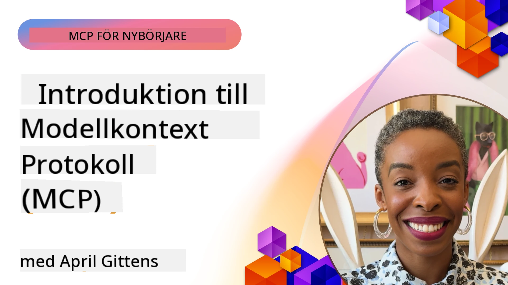
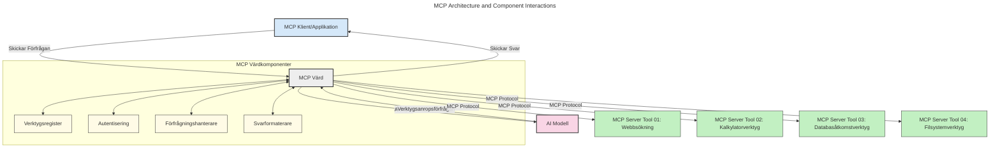
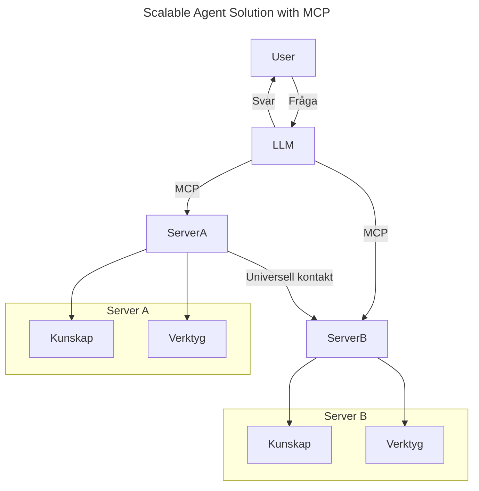
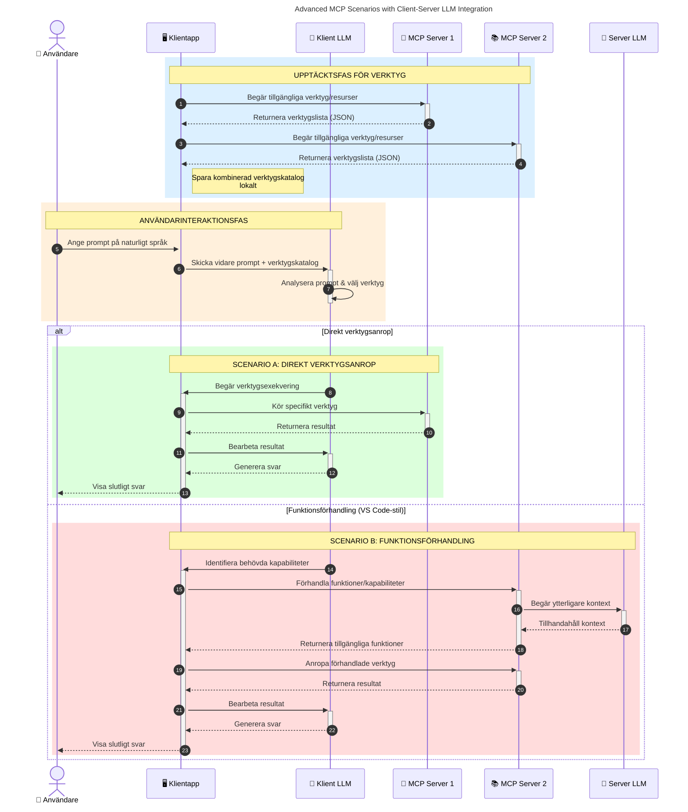

# Introduktion till Model Context Protocol (MCP): Varför det är viktigt för skalbara AI-applikationer

_(Klicka på bilden ovan för att se videon för denna lektion)_

Generativa AI-applikationer är ett stort steg framåt eftersom de ofta låter användaren interagera med appen via naturliga språkpromptar. Men när mer tid och resurser investeras i sådana appar vill du säkerställa att du enkelt kan integrera funktioner och resurser på ett sådant sätt att det är lätt att utöka, att din app kan hantera mer än en modell samtidigt, och hantera olika modellkomplexiteter. Kort sagt, att bygga Gen AI-appar är enkelt i början, men när de växer och blir mer komplexa behöver du börja definiera en arkitektur och kommer sannolikt behöva förlita dig på en standard för att säkerställa att dina appar byggs på ett konsekvent sätt. Här kommer MCP in för att organisera och tillhandahålla en standard.

---

## **🔍 Vad är Model Context Protocol (MCP)?**

**Model Context Protocol (MCP)** är ett **öppet, standardiserat gränssnitt** som låter stora språkmodeller (LLMs) interagera sömlöst med externa verktyg, API:er och datakällor. Det tillhandahåller en konsekvent arkitektur för att förbättra AI-modellers funktionalitet bortom deras träningsdata, vilket möjliggör smartare, skalbara och mer responsiva AI-system.

---

## **🎯 Varför standardisering inom AI är viktigt**

När generativa AI-applikationer blir mer komplexa är det viktigt att anta standarder som säkerställer **skalbarhet, utbyggbarhet, underhållbarhet** och **att undvika leverantörslåsningar**. MCP adresserar dessa behov genom att:

- Förenhetliga integrationer mellan modeller och verktyg
- Minska ömtåliga, skräddarsydda engångslösningar
- Tillåta flera modeller från olika leverantörer att samexistera inom ett ekosystem

**Notera:** Även om MCP kallar sig en öppen standard, finns inga planer på att standardisera MCP genom några befintliga standardiseringsorgan som IEEE, IETF, W3C, ISO eller något annat standardorgan.

---

## **📚 Läromål**

I slutet av denna artikel kommer du att kunna:

- Definiera **Model Context Protocol (MCP)** och dess användningsområden
- Förstå hur MCP standardiserar kommunikationen mellan modeller och verktyg
- Identifiera de centrala komponenterna i MCP-arkitekturen
- Utforska verkliga användningsfall för MCP i företags- och utvecklingssammanhang

---

## **💡 Varför Model Context Protocol (MCP) är en revolutionerande förändring**

### **🔗 MCP löser fragmentering i AI-interaktioner**

Före MCP krävde integration av modeller med verktyg:

- Egengjord kod för varje verktygs- och modellpar
- Icke-standardiserade API:er för varje leverantör
- Frekventa avbrott vid uppdateringar
- Dålig skalbarhet när fler verktyg tillkommer

### **✅ Fördelar med MCP-standardisering**

| **Fördel**               | **Beskrivning**                                                                |
|--------------------------|--------------------------------------------------------------------------------|
| Interoperabilitet        | LLM:er fungerar sömlöst med verktyg från olika leverantörer                    |
| Konsekvens               | Enhetligt beteende över plattformar och verktyg                               |
| Återanvändbarhet         | Verktyg byggda en gång kan användas i olika projekt och system                |
| Accelererad utveckling   | Minska utvecklingstid genom användning av standardiserade, plug-and-play-gränssnitt |

---

## **🧱 Översikt av MCP-arkitektur på hög nivå**

MCP följer en **klient-server-modell**, där:

- **MCP Hosts** kör AI-modellerna
- **MCP Clients** initierar förfrågningar
- **MCP Servers** tillhandahåller kontext, verktyg och kapabiliteter

### **Nyckelkomponenter:**

- **Resurser** – Statisk eller dynamisk data för modeller  
- **Prompter** – Fördefinierade arbetsflöden för styrd generering  
- **Verktyg** – Körbara funktioner som sökning, beräkningar  
- **Sampling** – Agentlikt beteende via rekursiva interaktioner (föråldrat i
    MCP `2026-07-28`; nya implementationer bör integrera direkt med en LLM-
    leverantör)
- **Elicitation** – Serverinitierade förfrågningar om användarinmatning
- **Roots** – Informationsfilsystemslägen relevanta för en server
    (föråldrat i MCP `2026-07-28`; föredra verktygsparametrar, resurs-URIs eller
    serverkonfiguration)

### **Protokollarkitektur:**

MCP använder en tvålagersarkitektur:
- **Datalager**: JSON-RPC 2.0-meddelanden, metadata per förfrågan, upptäckt och
    protokollprimitive
- **Transportlager**: stdio för lokala underprocesser och Streamable HTTP för
    fjärrservrar. Streamable HTTP kan använda SSE-ramverk för strömmade svar,
    men den äldre HTTP+SSE-transporten är föråldrad.

---

## Hur MCP-servrar fungerar

MCP-servrar fungerar på följande sätt:

- **Förfrågningsflöde**:
    1. En förfrågan initieras av en slutanvändare eller programvara som agerar på deras vägnar.
    2. **MCP-klienten** skickar förfrågan till en **MCP Host**, som hanterar AI-modellens runtime.
    3. **AI-modellen** tar emot användarens prompt och kan begära tillgång till externa verktyg eller data via en eller flera verktygsanrop.
    4. **MCP Host**, inte modellen direkt, kommunicerar med lämpliga **MCP Server(s)** med hjälp av det standardiserade protokollet.
- **MCP Host-funktionalitet**:
    - **Verktygsregister**: Underhåller en katalog över tillgängliga verktyg och deras kapabiliteter.
    - **Autentisering**: Verifierar behörighet för verktygsåtkomst.
    - **Förfrågningshanterare**: Bearbetar inkommande verktygsförfrågningar från modellen.
    - **Svarformatterare**: Strukturerar verktygsutdata i ett format som modellen kan förstå.
- **MCP Server-exekvering**:
    - **MCP Host** dirigerar verktygsanrop till en eller flera **MCP Servers**, som vardera exponerar specialiserade funktioner (t.ex. sökning, beräkningar, databasfrågor).
    - **MCP Servers** utför sina respektive operationer och returnerar resultat till **MCP Host** i ett konsekvent format.
    - **MCP Host** formaterar och vidarebefordrar dessa resultat till **AI-modellen**.
- **Slutförande av svar**:
    - **AI-modellen** integrerar verktygsutdata i ett slutgiltigt svar.
    - **MCP Host** skickar tillbaka detta svar till **MCP Client**, som levererar det till slutanvändaren eller anropande programvara.
    

## 👨‍💻 Hur man bygger en MCP-server (med exempel)

MCP-servrar låter dig utöka LLM-funktionaliteter genom att tillhandahålla data och funktionalitet.

Redo att testa? Här är språk- och/eller stack-specifika SDK:er med exempel på att skapa enkla MCP-servrar i olika språk/stackar:

- **Python SDK**: https://github.com/modelcontextprotocol/python-sdk

- **TypeScript SDK**: https://github.com/modelcontextprotocol/typescript-sdk

- **Java SDK**: https://github.com/modelcontextprotocol/java-sdk

- **C#/.NET SDK**: https://github.com/modelcontextprotocol/csharp-sdk

## 🌍 Verkliga användningsfall för MCP

MCP möjliggör en rad applikationer genom att utöka AI-kapabiliteter:

| **Applikation**               | **Beskrivning**                                                                |
|------------------------------|--------------------------------------------------------------------------------|
| Företagsdataintegration      | Koppla LLM:er till databaser, CRM-system eller interna verktyg                  |
| Agentlika AI-system          | Möjliggör autonoma agenter med verktygstillgång och arbetsflöden för beslutsfattande |
| Multimodala applikationer    | Kombinera text-, bild- och ljudverktyg inom en enda enhetlig AI-app             |
| Realtidsdataintegration      | Ta in live-data i AI-interaktioner för mer exakta, aktuella resultat           |

### 🧠 MCP = Universell standard för AI-interaktioner

Model Context Protocol (MCP) fungerar som en universell standard för AI-interaktioner, precis som USB-C standardiserade fysiska anslutningar för enheter. Inom AI-världen tillhandahåller MCP ett konsekvent gränssnitt som låter modeller (klienter) integreras sömlöst med externa verktyg och dataleverantörer (servrar). Detta eliminerar behovet av olika, skräddarsydda protokoll för varje API eller datakälla.

Under MCP följer ett MCP-kompatibelt verktyg (kallat en MCP-server) en enhetlig standard. Dessa servrar kan lista de verktyg eller åtgärder de erbjuder och utföra dessa när de efterfrågas av en AI-agent. AI-agentplattformar som stödjer MCP kan upptäcka tillgängliga verktyg från servrarna och anropa dem via detta standardprotokoll.

### 💡 Underlättar tillgång till kunskap

Utöver att erbjuda verktyg underlättar MCP även tillgång till kunskap. Det möjliggör för applikationer att ge kontext till stora språkmodeller (LLMs) genom att länka dem till olika datakällor. Till exempel kan en MCP-server representera ett företags dokumentarkiv, vilket tillåter agenter att hämta relevant information vid behov. En annan server kan hantera specifika åtgärder som att skicka e-post eller uppdatera register. Ur agentens perspektiv är detta helt enkelt verktyg den kan använda – vissa verktyg returnerar data (kunskapskontext), medan andra utför handlingar. MCP hanterar båda effektivt.

En agent som ansluter till en MCP-server lär automatiskt sig serverns tillgängliga kapabiliteter och åtkomliga data via ett standardiserat format. Denna standardisering möjliggör dynamisk verktygstillgänglighet. Till exempel gör tillägg av en ny MCP-server till en agents system dess funktioner omedelbart användbara utan att kräva ytterligare anpassning av agentens instruktioner.

Denna strömlinjeformade integration stämmer överens med flödet som visas i följande diagram, där servrar tillhandahåller både verktyg och kunskap, vilket säkerställer sömlöst samarbete mellan system.

### 👉 Exempel: Skalbar agentslösning

Den universella connectorn möjliggör att MCP-servrar kommunicerar och delar kapabiliteter med varandra, vilket tillåter ServerA att delegera uppgifter till ServerB eller få tillgång till dess verktyg och kunskap. Detta federerar verktyg och data över servrar, vilket stödjer skalbara och modulära agentarkitekturer. Eftersom MCP standardiserar exponering av verktyg kan agenter dynamiskt upptäcka och dirigera förfrågningar mellan servrar utan hårdkodade integrationer.

Verktygs- och kunskapsfederation: Verktyg och data kan nås över servrar, vilket möjliggör mer skalbara och modulära agentlika arkitekturer.

### 🔄 Avancerade MCP-scenarier med klientbaserad LLM-integration

Utöver den grundläggande MCP-arkitekturen finns avancerade scenarier där både klient och server innehåller LLM:er, vilket möjliggör mer sofistikerade interaktioner. I följande diagram kan **Client App** vara en IDE med ett antal MCP-verktyg tillgängliga för användning av LLM:

## 🔐 Praktiska fördelar med MCP

Här är de praktiska fördelarna med att använda MCP:

- **Aktualitet**: Modeller kan komma åt uppdaterad information utöver sin träningsdata
- **Kapabilitetsutökning**: Modeller kan använda specialiserade verktyg för uppgifter de inte tränades för
- **Minskade hallucinationer**: Externa datakällor ger faktabaserad grund
- **Sekretess**: Känslig data kan stanna inom säkra miljöer istället för att bäddas in i promptar

## 📌 Viktiga slutsatser

Följande är viktiga slutsatser för användning av MCP:

- **MCP** standardiserar hur AI-modeller interagerar med verktyg och data
- Främjar **utbyggbarhet, konsekvens och interoperabilitet**
- MCP hjälper till att **minska utvecklingstid, förbättra tillförlitlighet och utöka modelleffektivitet**
- Klient-server-arkitekturen **möjliggör flexibla, utbyggbara AI-applikationer**

## 🧠 Övning

Fundera på en AI-applikation du är intresserad av att bygga.

- Vilka **externa verktyg eller data** skulle kunna förbättra dess kapaciteter?
- Hur skulle MCP göra integrationen **enklare och mer pålitlig?**

## Ytterligare resurser

- [MCP GitHub Repository](https://github.com/modelcontextprotocol)

## Vad som kommer härnäst

Nästa: [Kapitel 1: Grundläggande begrepp](../01-CoreConcepts/README.md)

---

<!-- CO-OP TRANSLATOR DISCLAIMER START -->
**Ansvarsfriskrivning**:
Detta dokument har översatts med hjälp av AI-översättningstjänsten [Co-op Translator](https://github.com/Azure/co-op-translator). Även om vi strävar efter noggrannhet, var vänlig notera att automatiska översättningar kan innehålla fel eller brister. Det ursprungliga dokumentet på dess modersmål bör betraktas som den auktoritativa källan. För kritisk information rekommenderas professionell mänsklig översättning. Vi ansvarar inte för några missförstånd eller feltolkningar som uppstår till följd av användningen av denna översättning.
<!-- CO-OP TRANSLATOR DISCLAIMER END -->