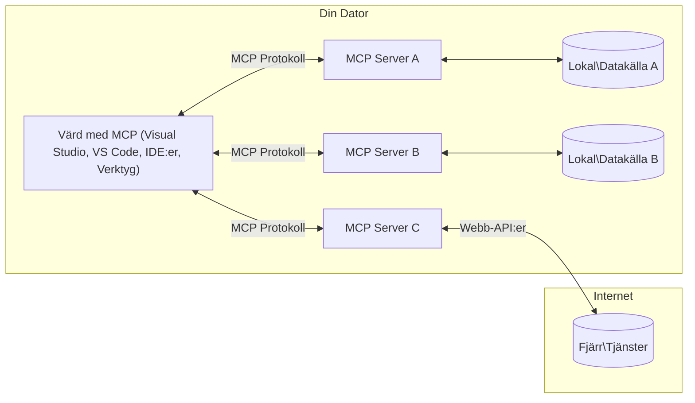

# MCP Core Concepts: Bemästra Model Context Protocol för AI-integration

[](https://youtu.be/earDzWGtE84)

_(Klicka på bilden ovan för att se videon för denna lektion)_

[Model Context Protocol (MCP)](https://github.com/modelcontextprotocol) är ett kraftfullt, standardiserat ramverk som optimerar kommunikationen mellan stora språkmodeller (LLM) och externa verktyg, applikationer och datakällor.  
Denna guide leder dig genom MCP:s kärnkoncept. Du kommer att lära dig om dess klient-server-arkitektur, viktiga komponenter, kommunikationsmekanismer och bästa praxis för implementering.

- **Explicit användarsamtycke**: All dataåtkomst och operationer kräver uttryckligt användargodkännande innan de utförs. Användare måste tydligt förstå vilken data som kommer att nås och vilka åtgärder som kommer att utföras, med detaljerad kontroll över behörigheter och auktorisationer.

- **Skydd av datasekretess**: Användardata exponeras endast med uttryckligt samtycke och måste skyddas av robusta åtkomstkontroller under hela interaktionslivscykeln. Implementeringar måste förhindra obehörig dataöverföring och upprätthålla strikta sekretessgränser.

- **Säker verktygsexekvering**: Varje verktygsanrop kräver uttryckligt användarsamtycke med klar förståelse för verktygets funktionalitet, parametrar och potentiell påverkan. Robust säkerhetsgränser måste förhindra oavsiktlig, osäker eller skadlig verktygsexekvering.

- **Transportlagersäkerhet**: Alla kommunikationskanaler bör använda lämplig kryptering och autentiseringsmekanismer. Fjärranslutningar bör implementera säkra transportprotokoll och korrekt hantering av autentiseringsuppgifter.

#### Implementeringsriktlinjer:

- **Behörighetshantering**: Implementera finmaskiga behörighetssystem som låter användare kontrollera vilka servrar, verktyg och resurser som är tillgängliga  
- **Autentisering & Auktorisation**: Använd säkra autentiseringsmetoder (OAuth, API-nycklar) med korrekt tokenhantering och utgångsdatum  
- **Inmatningsvalidering**: Validera alla parametrar och dataingångar enligt definierade scheman för att förhindra injektionsattacker  
- **Revisionsloggning**: Behåll omfattande loggar över alla operationer för säkerhetsövervakning och efterlevnad

## Översikt

Denna lektion utforskar den grundläggande arkitekturen och komponenterna som utgör Model Context Protocol (MCP)-ekosystemet. Du kommer att lära dig om klient-server-arkitekturen, nyckelkomponenter och kommunikationsmekanismer som driver MCP-interaktioner.

## Viktiga lärandemål

I slutet av denna lektion kommer du att:

- Förstå MCP:s klient-server-arkitektur.  
- Identifiera roller och ansvar för Hosts, Clients och Servers.  
- Analysera kärnfunktionerna som gör MCP till ett flexibelt integrationslager.  
- Lära dig hur information flödar inom MCP-ekosystemet.  
- Få praktiska insikter genom kodexempel i .NET, Java, Python och JavaScript.

## MCP-arkitektur: En djupare titt

MCP-ekosystemet är byggt på en klient-server-modell. Denna modulära struktur tillåter AI-applikationer att effektivt interagera med verktyg, databaser, API:er och kontextuella resurser. Låt oss bryta ner denna arkitektur i dess kärnkomponenter.

I grunden följer MCP en klient-server-arkitektur där en host-applikation kan ansluta till flera servrar:


- **MCP Hosts**: Program som VSCode, Claude Desktop, IDE:er eller AI-verktyg som vill få tillgång till data via MCP  
- **MCP Clients**: Protokollklienter som upprätthåller 1:1-anslutningar med servrar  
- **MCP Servers**: Lättviktiga program som var och en exponerar specifika funktioner genom det standardiserade Model Context Protocol  
- **Lokala datakällor**: Din dators filer, databaser och tjänster som MCP-servrar kan nå säkert  
- **Fjärrtjänster**: Externa system tillgängliga över internet som MCP-servrar kan ansluta till via API:er.

MCP-protokollet är en utvecklande standard som använder datum-baserad versionshantering (formatet ÅÅÅÅ-MM-DD). Den aktuella protokollversionen är **2025-11-25**. Du kan se de senaste uppdateringarna i [protokollspecificeringen](https://modelcontextprotocol.io/specification/2025-11-25/)

### 1. Hosts

I Model Context Protocol (MCP) är **Hosts** AI-applikationer som fungerar som det primära gränssnittet genom vilket användare interagerar med protokollet. Hosts koordinerar och hanterar anslutningar till flera MCP-servrar genom att skapa dedikerade MCP-klienter för varje serveranslutning. Exempel på Hosts inkluderar:

- **AI-applikationer**: Claude Desktop, Visual Studio Code, Claude Code  
- **Utvecklingsmiljöer**: IDE:er och kodredigerare med MCP-integration  
- **Anpassade applikationer**: Specialbyggda AI-agenter och verktyg

**Hosts** är applikationer som koordinerar AI-modellinteraktioner. De:

- **Orkestrerar AI-modeller**: Utför eller interagerar med LLM för att generera svar och koordinera AI-arbetsflöden  
- **Hantera klientanslutningar**: Skapar och upprätthåller en MCP-klient per MCP-serveranslutning  
- **Kontrollerar användargränssnitt**: Hanterar konversationsflöde, användarinteraktioner och presentationssvar  
- **Upprätthåller säkerhet**: Kontrollerar behörigheter, säkerhetsbegränsningar och autentisering  
- **Hantera användarsamtycke**: Hanterar användarens godkännande för datadelning och verktygsexekvering

### 2. Clients

**Clients** är viktiga komponenter som upprätthåller dedikerade en-till-en-anslutningar mellan Hosts och MCP-servrar. Varje MCP-klient instansieras av Host för att ansluta till en specifik MCP-server, vilket säkerställer organiserade och säkra kommunikationskanaler. Flera klienter möjliggör att Hosts kan ansluta till flera servrar samtidigt.

**Clients** är anslutningskomponenter inom host-applikationen. De:

- **Protokollkommunikation**: Skickar JSON-RPC 2.0-förfrågningar till servrar med prompts och instruktioner  
- **Funktionalitetsförhandling**: Förhandlar om stödda funktioner och protokollversioner med servrar under initiering  
- **Verktygsexekvering**: Hanterar verktygsanropsförfrågningar från modeller och bearbetar svar  
- **Uppdateringar i realtid**: Hanterar notifikationer och realtidsuppdateringar från servrar  
- **Svarshantering**: Bearbetar och formaterar serversvar för visning till användare

### 3. Servers

**Servers** är program som tillhandahåller kontext, verktyg och funktioner till MCP-klienter. De kan köras lokalt (på samma maskin som Host) eller fjärrstyrt (på externa plattformar) och ansvarar för att hantera klientförfrågningar och tillhandahålla strukturerade svar. Servrar exponerar specifik funktionalitet genom det standardiserade Model Context Protocol.

**Servers** är tjänster som tillhandahåller kontext och funktioner. De:

- **Funktionregistrering**: Registrerar och exponerar tillgängliga primitiva element (resurser, prompts, verktyg) till klienter  
- **Förfrågningshantering**: Tar emot och utför verktygsanrop, resursförfrågningar och promptförfrågningar från klienter  
- **Kontexttillhandahållande**: Ger kontextuell information och data för att förbättra modelsvar  
- **Tillståndshantering**: Upprätthåller sessionsstatus och hanterar tillståndsberoende interaktioner vid behov  
- **Notifikationer i realtid**: Skickar notifikationer om funktionsändringar och uppdateringar till anslutna klienter

Servrar kan utvecklas av vem som helst för att utöka modellers kapabiliteter med specialiserad funktionalitet, och de stödjer både lokala och fjärrbaserade distributionsscenarier.

### 4. Server Primitives

Servrar i Model Context Protocol (MCP) tillhandahåller tre kärn-**primitiver** som definierar de grundläggande byggstenarna för rika interaktioner mellan klienter, hosts och språkmodeller. Dessa primitiv definierar typer av kontextuell information och tillgängliga åtgärder genom protokollet.

MCP-servrar kan exponera vilken kombination som helst av följande tre kärnprimitiver:

#### Resurser

**Resurser** är datakällor som tillhandahåller kontextuell information till AI-applikationer. De representerar statiskt eller dynamiskt innehåll som kan förbättra modellens förståelse och beslutsfattande:

- **Kontextuell data**: Strukturerad information och kontext för AI-modellens konsumtion  
- **Kunskapsbaser**: Dokumentarkiv, artiklar, manualer och forskningspapper  
- **Lokala datakällor**: Filer, databaser och lokal systeminformation  
- **Extern data**: API-svar, webbtjänster och fjärrsystemdata  
- **Dynamiskt innehåll**: Realtidsdata som uppdateras baserat på externa förhållanden

Resurser identifieras med URI:er och stödjer upptäckt via `resources/list` och hämtning via `resources/read` metoder:

```text
file://documents/project-spec.md
database://production/users/schema
api://weather/current
```

#### Prompts

**Prompts** är återanvändbara mallar som hjälper till att strukturera interaktioner med språkmodeller. De tillhandahåller standardiserade interaktionsmönster och mallade arbetsflöden:

- **Mallbaserade interaktioner**: Förstrukturerade meddelanden och konversationsstartare  
- **Arbetsflödesmallar**: Standardiserade sekvenser för vanliga uppgifter och interaktioner  
- **Få-exempel**: Exempelbaserade mallar för modellinstruktion  
- **Systemprompts**: Grundläggande prompts som definierar modellbeteende och kontext  
- **Dynamiska mallar**: Parameteriserade prompts som anpassar sig till specifika kontexter

Prompts stödjer variabelsubstitution och kan upptäckas via `prompts/list` och hämtas med `prompts/get`:

```markdown
Generate a {{task_type}} for {{product}} targeting {{audience}} with the following requirements: {{requirements}}
```

#### Verktyg

**Verktyg** är exekverbara funktioner som AI-modeller kan anropa för att utföra specifika åtgärder. De representerar "verb" i MCP-ekosystemet och möjliggör för modeller att interagera med externa system:

- **Exekverbara funktioner**: Diskreta operationer som modeller kan anropa med specifika parametrar  
- **Integration med externa system**: API-anrop, databasfrågor, filoperationer, beräkningar  
- **Unik identitet**: Varje verktyg har ett distinkt namn, beskrivning och parameterschema  
- **Strukturerad I/O**: Verktyg accepterar validerade parametrar och returnerar strukturerade, typade svar  
- **Åtgärdskapabiliteter**: Möjliggör för modeller att utföra verkliga åtgärder och hämta live-data

Verktyg definieras med JSON Schema för parameter-validering och upptäcks via `tools/list` och exekveras via `tools/call`:

```typescript
server.tool(
  "search_products", 
  {
    query: z.string().describe("Search query for products"),
    category: z.string().optional().describe("Product category filter"),
    max_results: z.number().default(10).describe("Maximum results to return")
  }, 
  async (params) => {
    // Utför sökning och returnera strukturerade resultat
    return await productService.search(params);
  }
);
```

## Klientprimitiver

I Model Context Protocol (MCP) kan **klienter** exponera primitiv som gör det möjligt för servrar att begära ytterligare funktioner från host-applikationen. Dessa klientbaserade primitiv möjliggör rikare, mer interaktiva serverimplementationer som kan få tillgång till AI-modellfunktioner och användarinteraktioner.

### Sampling

**Sampling** tillåter servrar att begära språkmodellskompletteringar från klientens AI-applikation. Denna primitiv gör det möjligt för servrar att få tillgång till LLM-funktioner utan att bädda in egna modellberoenden:

- **Modelloberoende åtkomst**: Servrar kan begära kompletteringar utan att inkludera LLM-SDK:er eller hantera modellåtkomst  
- **Serverinitierad AI**: Möjliggör för servrar att autonomt generera innehåll med klientens AI-modell  
- **Rekursiva LLM-interaktioner**: Stöder komplexa scenarier där servrar behöver AI-hjälp för bearbetning  
- **Dynamisk innehållsgenerering**: Tillåter servrar att skapa kontextuella svar med hostens modell

Sampling initieras via metoden `sampling/complete`, där servrar skickar kompletteringsförfrågningar till klienter.

### Elicitation

**Elicitation** gör det möjligt för servrar att begära ytterligare information eller bekräftelse från användare via klientgränssnittet:

- **Begäran om användarinmatning**: Servrar kan be om ytterligare information när det behövs för verktygsexekvering  
- **Bekräftelsedialoger**: Begär användargodkännande för känsliga eller påverkande operationer  
- **Interaktiva arbetsflöden**: Möjliggör för servrar att skapa steg-för-steg-användarinteraktioner  
- **Dynamisk parameterinsamling**: Samlar in saknade eller valfria parametrar under verktygsexekvering

Elicitation-förfrågningar görs med metoden `elicitation/request` för att samla in användarinmatning via klientens gränssnitt.

### Loggning

**Loggning** tillåter servrar att skicka strukturerade loggmeddelanden till klienter för felsökning, övervakning och operativ insyn:

- **Felsökningsstöd**: Möjliggör för servrar att tillhandahålla detaljerade exekveringsloggar för felsökning  
- **Operativ övervakning**: Skicka statusuppdateringar och prestandamått till klienter  
- **Felrapportering**: Tillhandahålla detaljerad felkontext och diagnostisk information  
- **Revisionsspår**: Skapa omfattande loggar över serveroperationer och beslut

Loggmeddelanden skickas till klienter för att ge transparens i serveroperationer och underlätta felsökning.

## Informationsflöde i MCP

Model Context Protocol (MCP) definierar ett strukturerat informationsflöde mellan hosts, clients, servers och modeller. Att förstå detta flöde hjälper till att klargöra hur användarförfrågningar bearbetas och hur externa verktyg och data integreras i modelsvar.

- **Host initierar anslutning**  
  Host-applikationen (som en IDE eller chattgränssnitt) etablerar en anslutning till en MCP-server, vanligtvis via STDIO, WebSocket eller annan stödd transport.

- **Funktionalitetsförhandling**  
  Klienten (inbäddad i hosten) och servern utbyter information om sina stödda funktioner, verktyg, resurser och protokollversioner. Detta säkerställer att båda sidor förstår vilka kapabiliteter som är tillgängliga för sessionen.

- **Användarförfrågan**  
  Användaren interagerar med hosten (t.ex. anger en prompt eller kommando). Hosten samlar in denna inmatning och skickar den till klienten för bearbetning.

- **Användning av resurs eller verktyg**  
  - Klienten kan begära ytterligare kontext eller resurser från servern (såsom filer, databasposter eller kunskapsbasartiklar) för att berika modellens förståelse.  
  - Om modellen avgör att ett verktyg behövs (t.ex. för att hämta data, utföra en beräkning eller anropa ett API), skickar klienten en verktygsanropsförfrågan till servern med verktygets namn och parametrar.

- **Serverexekvering**  
  Servern tar emot resurs- eller verktygsförfrågan, utför nödvändiga operationer (som att köra en funktion, fråga en databas eller hämta en fil) och returnerar resultaten till klienten i ett strukturerat format.

- **Svarsgenerering**  
  Klienten integrerar serverns svar (resursdata, verktygsutdata etc.) i den pågående modellinteraktionen. Modellen använder denna information för att generera ett omfattande och kontextuellt relevant svar.

- **Resultatpresentation**  
  Hosten tar emot det slutgiltiga resultatet från klienten och presenterar det för användaren, ofta inklusive både modellens genererade text och eventuella resultat från verktygsexekveringar eller resursuppslagningar.

Detta flöde möjliggör att MCP kan stödja avancerade, interaktiva och kontextmedvetna AI-applikationer genom att sömlöst koppla modeller med externa verktyg och datakällor.

## Protokollarkitektur & lager

MCP består av två distinkta arkitekturlager som samarbetar för att tillhandahålla ett komplett kommunikationsramverk:

### Datalager

**Datalagret** implementerar kärnprotokollet MCP med **JSON-RPC 2.0** som grund. Detta lager definierar meddelandestruktur, semantik och interaktionsmönster:

#### Kärnkomponenter:

- **JSON-RPC 2.0-protokoll**: All kommunikation använder standardiserat JSON-RPC 2.0-meddelandformat för metodanrop, svar och notifikationer
- **Livscykelhantering**: Hanterar anslutningsinitiering, kapabilitetsförhandling och sessionsavslut mellan klienter och servrar  
- **Serverprimitiver**: Gör det möjligt för servrar att tillhandahålla kärnfunktionalitet genom verktyg, resurser och prompts  
- **Klientprimitiver**: Gör det möjligt för servrar att begära sampling från LLM:er, hämta användarinmatning och skicka loggmeddelanden  
- **Notifieringar i realtid**: Stöder asynkrona notifieringar för dynamiska uppdateringar utan polling  

#### Nyckelfunktioner:

- **Protokollversionsförhandling**: Använder datum-baserad versionering (ÅÅÅÅ-MM-DD) för att säkerställa kompatibilitet  
- **Kapabilitetsupptäckt**: Klienter och servrar utbyter information om stödda funktioner vid initiering  
- **Stateful Sessions**: Behåller anslutningstillstånd över flera interaktioner för kontextkontinuitet  

### Transportlager

**Transportlagret** hanterar kommunikationskanaler, meddelanderamning och autentisering mellan MCP-deltagare:

#### Stödda transportmekanismer:

1. **STDIO-transport**:  
   - Använder standard in-/ut-strömmar för direkt processkommunikation  
   - Optimalt för lokala processer på samma maskin utan nätverksöverliggande  
   - Vanligt för lokala MCP-serverimplementationer  

2. **Streambar HTTP-transport**:  
   - Använder HTTP POST för klient-till-server-meddelanden  
   - Valfri Server-Sent Events (SSE) för server-till-klient-strömning  
   - Möjliggör fjärrserverkommunikation över nätverk  
   - Stöder standard HTTP-autentisering (bearer tokens, API-nycklar, anpassade headers)  
   - MCP rekommenderar OAuth för säker tokenbaserad autentisering  

#### Transportabstraktion:

Transportlagret abstraherar kommunikationsdetaljer från datalagret, vilket möjliggör samma JSON-RPC 2.0-meddelandesformat över alla transportmekanismer. Denna abstraktion tillåter applikationer att sömlöst växla mellan lokala och fjärrservrar.

### Säkerhetsöverväganden

MCP-implementationer måste följa flera kritiska säkerhetsprinciper för att säkerställa säkra, pålitliga och trygga interaktioner över alla protokolloperationer:

- **Användarsamtycke och kontroll**: Användare måste ge uttryckligt samtycke innan någon data nås eller operationer utförs. De ska ha tydlig kontroll över vilken data som delas och vilka åtgärder som auktoriseras, understödda av intuitiva användargränssnitt för granskning och godkännande av aktiviteter.

- **Datasekretess**: Användardata ska endast exponeras med uttryckligt samtycke och måste skyddas med lämpliga åtkomstkontroller. MCP-implementationer måste skydda mot obehörig datatransmission och säkerställa att sekretess upprätthålls under alla interaktioner.

- **Verktygssäkerhet**: Innan något verktyg anropas krävs uttryckligt användarsamtycke. Användare ska ha en klar förståelse för varje verktygs funktionalitet, och robusta säkerhetsgränser måste upprätthållas för att förhindra oavsiktlig eller osäker verktygsexekvering.

Genom att följa dessa säkerhetsprinciper säkerställer MCP användarförtroende, sekretess och säkerhet över alla protokollinteraktioner samtidigt som kraftfulla AI-integrationer möjliggörs.

## Kodexempel: Nyckelkomponenter

Nedan finns kodexempel i flera populära programmeringsspråk som illustrerar hur man implementerar nyckelkomponenter i en MCP-server och verktyg.

### .NET-exempel: Skapa en enkel MCP-server med verktyg

Här är ett praktiskt .NET-kodexempel som visar hur man implementerar en enkel MCP-server med anpassade verktyg. Exemplet visar hur man definierar och registrerar verktyg, hanterar förfrågningar och ansluter servern med Model Context Protocol.

```csharp
using System;
using System.Threading.Tasks;
using ModelContextProtocol.Server;
using ModelContextProtocol.Server.Transport;
using ModelContextProtocol.Server.Tools;

public class WeatherServer
{
    public static async Task Main(string[] args)
    {
        // Create an MCP server
        var server = new McpServer(
            name: "Weather MCP Server",
            version: "1.0.0"
        );
        
        // Register our custom weather tool
        server.AddTool<string, WeatherData>("weatherTool", 
            description: "Gets current weather for a location",
            execute: async (location) => {
                // Call weather API (simplified)
                var weatherData = await GetWeatherDataAsync(location);
                return weatherData;
            });
        
        // Connect the server using stdio transport
        var transport = new StdioServerTransport();
        await server.ConnectAsync(transport);
        
        Console.WriteLine("Weather MCP Server started");
        
        // Keep the server running until process is terminated
        await Task.Delay(-1);
    }
    
    private static async Task<WeatherData> GetWeatherDataAsync(string location)
    {
        // This would normally call a weather API
        // Simplified for demonstration
        await Task.Delay(100); // Simulate API call
        return new WeatherData { 
            Temperature = 72.5,
            Conditions = "Sunny",
            Location = location
        };
    }
}

public class WeatherData
{
    public double Temperature { get; set; }
    public string Conditions { get; set; }
    public string Location { get; set; }
}
```

### Java-exempel: MCP-serverkomponenter

Detta exempel visar samma MCP-server och verktygsregistrering som .NET-exemplet ovan, men implementerat i Java.

```java
import io.modelcontextprotocol.server.McpServer;
import io.modelcontextprotocol.server.McpToolDefinition;
import io.modelcontextprotocol.server.transport.StdioServerTransport;
import io.modelcontextprotocol.server.tool.ToolExecutionContext;
import io.modelcontextprotocol.server.tool.ToolResponse;

public class WeatherMcpServer {
    public static void main(String[] args) throws Exception {
        // Skapa en MCP-server
        McpServer server = McpServer.builder()
            .name("Weather MCP Server")
            .version("1.0.0")
            .build();
            
        // Registrera ett väderverktyg
        server.registerTool(McpToolDefinition.builder("weatherTool")
            .description("Gets current weather for a location")
            .parameter("location", String.class)
            .execute((ToolExecutionContext ctx) -> {
                String location = ctx.getParameter("location", String.class);
                
                // Hämta väderdata (förenklat)
                WeatherData data = getWeatherData(location);
                
                // Returnera formaterat svar
                return ToolResponse.content(
                    String.format("Temperature: %.1f°F, Conditions: %s, Location: %s", 
                    data.getTemperature(), 
                    data.getConditions(), 
                    data.getLocation())
                );
            })
            .build());
        
        // Anslut servern med stdio-transport
        try (StdioServerTransport transport = new StdioServerTransport()) {
            server.connect(transport);
            System.out.println("Weather MCP Server started");
            // Håll servern igång tills processen avslutas
            Thread.currentThread().join();
        }
    }
    
    private static WeatherData getWeatherData(String location) {
        // Implementeringen skulle anropa ett väder-API
        // Förenklat för exempeländamål
        return new WeatherData(72.5, "Sunny", location);
    }
}

class WeatherData {
    private double temperature;
    private String conditions;
    private String location;
    
    public WeatherData(double temperature, String conditions, String location) {
        this.temperature = temperature;
        this.conditions = conditions;
        this.location = location;
    }
    
    public double getTemperature() {
        return temperature;
    }
    
    public String getConditions() {
        return conditions;
    }
    
    public String getLocation() {
        return location;
    }
}
```

### Python-exempel: Bygga en MCP-server

Detta exempel använder fastmcp, så se till att installera det först:

```python
pip install fastmcp
```
Kodexempel:

```python
#!/usr/bin/env python3
import asyncio
from fastmcp import FastMCP
from fastmcp.transports.stdio import serve_stdio

# Skapa en FastMCP-server
mcp = FastMCP(
    name="Weather MCP Server",
    version="1.0.0"
)

@mcp.tool()
def get_weather(location: str) -> dict:
    """Gets current weather for a location."""
    return {
        "temperature": 72.5,
        "conditions": "Sunny",
        "location": location
    }

# Alternativ metod med en klass
class WeatherTools:
    @mcp.tool()
    def forecast(self, location: str, days: int = 1) -> dict:
        """Gets weather forecast for a location for the specified number of days."""
        return {
            "location": location,
            "forecast": [
                {"day": i+1, "temperature": 70 + i, "conditions": "Partly Cloudy"}
                for i in range(days)
            ]
        }

# Registrera klassverktyg
weather_tools = WeatherTools()

# Starta servern
if __name__ == "__main__":
    asyncio.run(serve_stdio(mcp))
```

### JavaScript-exempel: Skapa en MCP-server

Detta exempel visar skapande av MCP-server i JavaScript och hur man registrerar två väderrelaterade verktyg.

```javascript
// Använder den officiella Model Context Protocol SDK
import { McpServer } from "@modelcontextprotocol/sdk/server/mcp.js";
import { StdioServerTransport } from "@modelcontextprotocol/sdk/server/stdio.js";
import { z } from "zod"; // För parametervalidering

// Skapa en MCP-server
const server = new McpServer({
  name: "Weather MCP Server",
  version: "1.0.0"
});

// Definiera ett väderverktyg
server.tool(
  "weatherTool",
  {
    location: z.string().describe("The location to get weather for")
  },
  async ({ location }) => {
    // Detta skulle normalt anropa en väder-API
    // Förenklat för demonstration
    const weatherData = await getWeatherData(location);
    
    return {
      content: [
        { 
          type: "text", 
          text: `Temperature: ${weatherData.temperature}°F, Conditions: ${weatherData.conditions}, Location: ${weatherData.location}` 
        }
      ]
    };
  }
);

// Definiera ett prognosverktyg
server.tool(
  "forecastTool",
  {
    location: z.string(),
    days: z.number().default(3).describe("Number of days for forecast")
  },
  async ({ location, days }) => {
    // Detta skulle normalt anropa en väder-API
    // Förenklat för demonstration
    const forecast = await getForecastData(location, days);
    
    return {
      content: [
        { 
          type: "text", 
          text: `${days}-day forecast for ${location}: ${JSON.stringify(forecast)}` 
        }
      ]
    };
  }
);

// Hjälpfunktioner
async function getWeatherData(location) {
  // Simulera API-anrop
  return {
    temperature: 72.5,
    conditions: "Sunny",
    location: location
  };
}

async function getForecastData(location, days) {
  // Simulera API-anrop
  return Array.from({ length: days }, (_, i) => ({
    day: i + 1,
    temperature: 70 + Math.floor(Math.random() * 10),
    conditions: i % 2 === 0 ? "Sunny" : "Partly Cloudy"
  }));
}

// Anslut servern med stdio-transport
const transport = new StdioServerTransport();
server.connect(transport).catch(console.error);

console.log("Weather MCP Server started");
```

Detta JavaScript-exempel visar hur man skapar en MCP-klient som ansluter till en server, skickar en prompt och bearbetar svaret inklusive eventuella verktygsanrop som gjordes.

## Säkerhet och auktorisering

MCP inkluderar flera inbyggda koncept och mekanismer för att hantera säkerhet och auktorisering genom hela protokollet:

1. **Verktygstillståndskontroll**:  
   Klienter kan specificera vilka verktyg en modell får använda under en session. Detta säkerställer att endast uttryckligen auktoriserade verktyg är tillgängliga, vilket minskar risken för oavsiktliga eller osäkra operationer. Tillstånd kan konfigureras dynamiskt baserat på användarpreferenser, organisationspolicyer eller interaktionskontext.

2. **Autentisering**:  
   Servrar kan kräva autentisering innan åtkomst till verktyg, resurser eller känsliga operationer beviljas. Detta kan involvera API-nycklar, OAuth-token eller andra autentiseringsscheman. Korrekt autentisering säkerställer att endast betrodda klienter och användare kan anropa serverfunktioner.

3. **Validering**:  
   Parameterkontroll tillämpas för alla verktygsanrop. Varje verktyg definierar förväntade typer, format och begränsningar för sina parametrar, och servern validerar inkommande förfrågningar därefter. Detta förhindrar felaktig eller skadlig indata från att nå verktygsimplementationer och hjälper till att upprätthålla operationernas integritet.

4. **Begränsning av anropstakt (Rate Limiting)**:  
   För att förhindra missbruk och säkerställa rättvis användning av serverresurser kan MCP-servrar implementera begränsningar för verktygsanrop och resursåtkomst. Begränsningar kan tillämpas per användare, per session eller globalt, och hjälper till att skydda mot överbelastningsattacker eller överdriven resursförbrukning.

Genom att kombinera dessa mekanismer erbjuder MCP en säker grund för att integrera språkmodeller med externa verktyg och datakällor, samtidigt som användare och utvecklare får finmaskig kontroll över åtkomst och användning.

## Protokollmeddelanden & kommunikationsflöde

MCP-kommunikation använder strukturerade **JSON-RPC 2.0**-meddelanden för att möjliggöra tydliga och pålitliga interaktioner mellan värdar, klienter och servrar. Protokollet definierar specifika meddelandemönster för olika typer av operationer:

### Kärnmeddelandetyper:

#### **Initieringsmeddelanden**
- **`initialize`-förfrågan**: Etablerar anslutning och förhandlar protokollversion och kapabiliteter  
- **`initialize`-svar**: Bekräftar stödda funktioner och serverinformation  
- **`notifications/initialized`**: Signalera att initiering är klar och sessionen är redo  

#### **Upptäcktsmeddelanden**
- **`tools/list`-förfrågan**: Upptäcker tillgängliga verktyg från servern  
- **`resources/list`-förfrågan**: Listar tillgängliga resurser (datakällor)  
- **`prompts/list`-förfrågan**: Hämtar tillgängliga promptmallar  

#### **Exekveringsmeddelanden**  
- **`tools/call`-förfrågan**: Kör ett specifikt verktyg med angivna parametrar  
- **`resources/read`-förfrågan**: Hämtar innehåll från en specifik resurs  
- **`prompts/get`-förfrågan**: Hämtar en promptmall med valfria parametrar  

#### **Klientsidemedelanden**
- **`sampling/complete`-förfrågan**: Servern begär LLM-komplettering från klienten  
- **`elicitation/request`**: Servern begär användarinmatning via klientgränssnittet  
- **Loggningsmeddelanden**: Servern skickar strukturerade loggmeddelanden till klienten  

#### **Notifieringsmeddelanden**
- **`notifications/tools/list_changed`**: Servern meddelar klienten om verktygsändringar  
- **`notifications/resources/list_changed`**: Servern meddelar klienten om resursändringar  
- **`notifications/prompts/list_changed`**: Servern meddelar klienten om promptändringar  

### Meddelandestruktur:

Alla MCP-meddelanden följer JSON-RPC 2.0-format med:  
- **Förfrågningsmeddelanden**: Innehåller `id`, `method` och valfria `params`  
- **Svarmeddelanden**: Innehåller `id` och antingen `result` eller `error`  
- **Notifieringsmeddelanden**: Innehåller `method` och valfria `params` (ingen `id` eller svar förväntas)  

Denna strukturerade kommunikation säkerställer pålitliga, spårbara och utbyggbara interaktioner som stöder avancerade scenarier som realtidsuppdateringar, verktygskedjning och robust felhantering.

## Viktiga slutsatser

- **Arkitektur**: MCP använder en klient-server-arkitektur där värdar hanterar flera klientanslutningar till servrar  
- **Deltagare**: Ekosystemet inkluderar värdar (AI-applikationer), klienter (protokollkopplingar) och servrar (kapabilitetsleverantörer)  
- **Transportmekanismer**: Kommunikation stöder STDIO (lokal) och Streambar HTTP med valfri SSE (fjärr)  
- **Kärnprimitiver**: Servrar exponerar verktyg (exekverbara funktioner), resurser (datakällor) och prompts (mallar)  
- **Klientprimitiver**: Servrar kan begära sampling (LLM-kompletteringar), elicitation (användarinmatning) och loggning från klienter  
- **Protokollgrund**: Bygger på JSON-RPC 2.0 med datum-baserad versionering (nuvarande: 2025-11-25)  
- **Realtidsfunktioner**: Stöder notifieringar för dynamiska uppdateringar och realtidssynkronisering  
- **Säkerhet först**: Uttryckligt användarsamtycke, dataskydd och säker transport är kärnkrav  

## Övning

Designa ett enkelt MCP-verktyg som skulle vara användbart inom ditt område. Definiera:  
1. Vad verktyget skulle heta  
2. Vilka parametrar det skulle acceptera  
3. Vilket resultat det skulle returnera  
4. Hur en modell kan använda detta verktyg för att lösa användarproblem  

---

## Vad händer härnäst

Nästa: [Kapitel 2: Säkerhet](../02-Security/README.md)

---

<!-- CO-OP TRANSLATOR DISCLAIMER START -->
**Ansvarsfriskrivning**:
Detta dokument har översatts med hjälp av AI-översättningstjänsten [Co-op Translator](https://github.com/Azure/co-op-translator). Även om vi strävar efter noggrannhet, vänligen observera att automatiska översättningar kan innehålla fel eller brister. Det ursprungliga dokumentet på dess modersmål bör betraktas som den auktoritativa källan. För kritisk information rekommenderas professionell mänsklig översättning. Vi ansvarar inte för några missförstånd eller feltolkningar som uppstår till följd av användningen av denna översättning.
<!-- CO-OP TRANSLATOR DISCLAIMER END -->