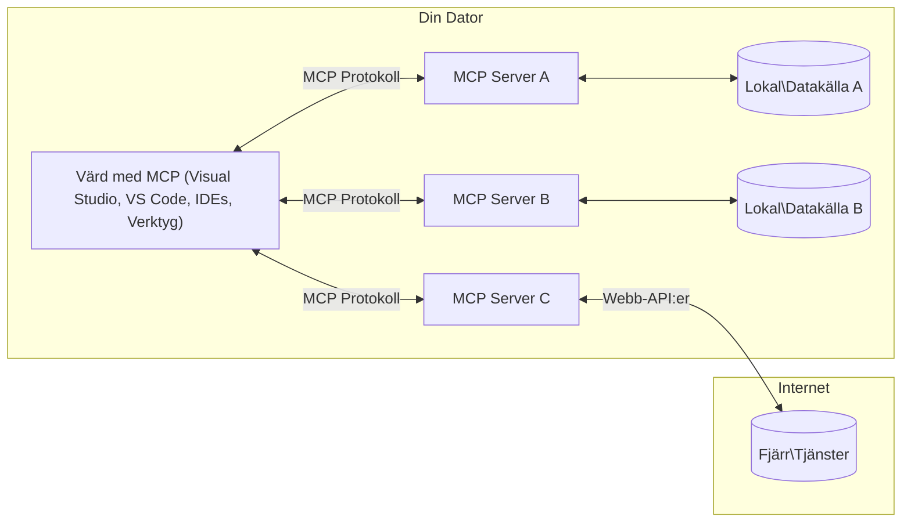

# MCP Kärnbegrepp: Bemästra Model Context Protocol för AI-integration

[](https://youtu.be/earDzWGtE84)

_(Klicka på bilden ovan för att se videon för denna lektion)_

[Model Context Protocol (MCP)](https://github.com/modelcontextprotocol) är ett kraftfullt, standardiserat ramverk som optimerar kommunikationen mellan Large Language Models (LLMs) och externa verktyg, applikationer och datakällor.
Denna guide leder dig genom MCP:s kärnbegrepp. Du kommer att lära dig om dess klient-serverarkitektur, viktiga komponenter, kommunikationsmekanik och bästa praxis för implementering.

- **Användarkontroll och samtycke**: Värdar bör tydligt visa vilken data och vilka verktyg en
  server exponerar, låta användare neka operationer, och få uttryckligt godkännande
  för känsliga eller konsekvensrika åtgärder. MCP kräver inte en bekräftelsedialog
  före varje verktygsanrop.

- **Dataskydd**: Användardata exponeras endast med uttryckligt samtycke och måste skyddas med robusta åtkomstkontroller under hela interaktionscykeln. Implementeringar måste förhindra obehörig datatransmission och upprätthålla strikta sekretessgränser.

- **Säker verktygsexekvering**: Värdar bör göra verktygskörningar synliga och hålla
  en människa kunna neka dessa. Känsliga operationer bör visa verktygsinmatningar
  och påverkan före exekvering, med säkerhetsgränser som förhindrar oavsiktliga
  eller illvilliga åtgärder.

- **Transport säkerhet**: Fjärranslutningar bör använda HTTPS och MCP:s
  auktoriseringsmodell. Lokala stdio-servrar förlitar sig på processisolering, betrodd
  konfiguration och säker hantering av ärvda behörigheter.

#### Implementeringsriktlinjer:

- **Behörighetshantering**: Implementera finmaskiga behörighetssystem som tillåter användare att kontrollera vilka servrar, verktyg och resurser som är tillgängliga
- **Autentisering & Auktorisation**: Använd säkra autentiseringsmetoder (OAuth, API-nycklar) med korrekt tokenhantering och utgångsdatum  
- **Inmatningsvalidering**: Validera alla parametrar och datainmatningar enligt definierade scheman för att förhindra injektionsattacker
- **Revisionsloggning**: Underhåll omfattande loggar över alla operationer för säkerhetsövervakning och efterlevnad

## Översikt

Denna lektion utforskar den grundläggande arkitekturen och komponenterna som utgör Model Context Protocol (MCP)-ekosystemet. Du kommer att lära dig om klient-server-arkitekturen, nyckelkomponenter och kommunikationsmekanismer som driver MCP-interaktioner.

## Viktiga lärandemål

I slutet av denna lektion kommer du att:

- Förstå MCP:s klient-serverarkitektur.
- Identifiera roller och ansvar för Hosts, Clients och Servers.
- Analysera kärnfunktionerna som gör MCP till ett flexibelt integrationslager.
- Lära dig hur information flödar inom MCP-ekosystemet.
- Få praktiska insikter genom kodexempel i .NET, Java, Python och JavaScript.

## MCP-arkitektur: En djupare titt

MCP-ekosystemet är byggt på en klient-server-modell. Denna modulära struktur tillåter AI-applikationer att interagera med verktyg, databaser, API:er och kontextuella resurser effektivt. Låt oss bryta ner denna arkitektur i dess kärnkomponenter.

I grunden följer MCP en klient-server-arkitektur där en värdapplikation kan ansluta till flera servrar:


```mermaid
flowchart LR
    subgraph "Din Dator"
        Host["Värd med MCP (Visual Studio, VS Code, IDEs, Verktyg)"]
        S1["MCP Server A"]
        S2["MCP Server B"]
        S3["MCP Server C"]
        Host <-->|"MCP Protokoll"| S1
        Host <-->|"MCP Protokoll"| S2
        Host <-->|"MCP Protokoll"| S3
        S1 <--> D1[("Lokal\Datakälla A")]
        S2 <--> D2[("Lokal\Datakälla B")]
    end
    subgraph "Internet"
        S3 <-->|"Webb-API:er"| D3[("Fjärr\Tjänster")]
    end
```

- **MCP Hosts**: Program som VSCode, Claude Desktop, IDE:er eller AI-verktyg som vill få åtkomst till data genom MCP
- **MCP Clients**: Protokollkomponenter som upprätthåller ett logiskt förhållande
  med en server; MCP `2026-07-28`-förfrågningar är inte beroende av en permanent
  anslutning eller session

- **MCP-servrar**: Lätta program som var och en exponerar specifika funktioner genom det standardiserade Model Context Protocol
- **Lokala datakällor**: Din dators filer, databaser och tjänster som MCP-servrar kan nå säkert
- **Fjärrtjänster**: Externa system tillgängliga över internet som MCP-servrar kan ansluta till via API:er.

MCP-protokollet är en utvecklande standard som använder datum-baserad versionshantering
(YYYY-MM-DD format). Den nuvarande protokollversionen är **2026-07-28**. Se
[2026-07-28 protokollspecifikation](https://modelcontextprotocol.io/specification/2026-07-28/).

> **Aktuell version:** MCP `2026-07-28` gör protokollet stateless på
> transportlagret genom att ta bort `initialize` handskakningen och protokollnivåns
> sessions-ID:n. Det formaliserar också ett Extensions-ramverk och avvecklar
> Roots, Sampling och Logging till förmån för nyare mönster. Se
> [Vad som förändrats i MCP: Specifikationen 2026-07-28](./mcp-2026-07-28.md)
> för en fullständig genomgång och migrationsvägledning. Exempel som explicit riktar sig mot
> `2025-11-25` behålls som bakåtkompatibilitetslektioner.

### 1. Värdar

I Model Context Protocol (MCP) är **Värdar** AI-program som fungerar som det primära gränssnittet där användare interagerar med protokollet. Värdar samordnar och hanterar anslutningar till flera MCP-servrar genom att skapa dedikerade MCP-klienter för varje serveranslutning. Exempel på värdar inkluderar:

- **AI-applikationer**: Claude Desktop, Visual Studio Code, Claude Code
- **Utvecklingsmiljöer**: IDE:er och kodredigerare med MCP-integration  
- **Anpassade applikationer**: Specialbyggda AI-agenter och verktyg

**Värdar** är program som samordnar AI-modellsinteraktioner. De:

- **Orkestrerar AI-modeller**: Kör eller interagerar med LLM:er för att generera svar och koordinera AI-arbetsflöden
- **Hantera klientrelationer**: Skapa och hantera en MCP-klient för varje MCP-
  server som värden använder
- **Kontrollerar användargränssnittet**: Hantera konversationsflöde, användarinteraktioner och presentationssvar  
- **Säkerställa säkerhet**: Styr behörigheter, säkerhetsbegränsningar och autentisering
- **Hantera användarsamtycke**: Sköta användarens godkännande för datadelning och verktygskörning


### 2. Klienter

**Klienter** är protokollkomponenter skapade av en värd för särskilda MCP-
servrar. Detta är en logisk en-till-en-relation, inte ett krav för en
ihållande nätverksanslutning. I MCP `2026-07-28` är varje förfrågan
självständig och kan hanteras av vilken serverinstans som helst.

**Klienter** är anslutningskomponenter inom värdprogrammet. De:

- **Protokollkommunikation**: Skicka JSON-RPC 2.0-förfrågningar till servrar med prompts och instruktioner
- **Funktionupptäckt**: Använd `server/discover` för att lära dig en servers stöd för
  protokollversioner, funktioner och tillägg
- **Verktygskörning**: Hantera verktygskörningsförfrågningar från modeller och bearbeta svar
- **Uppdateringar i realtid**: Hantera notifikationer och realtidsuppdateringar från servrar
- **Svarsbehandling**: Bearbeta och formatera servrars svar för visning till användare

### 3. Servrar


**Servrar** är program som tillhandahåller kontext, verktyg och kapabiliteter till MCP-klienter. De kan köras lokalt (på samma maskin som värden) eller fjärrstyrt (på externa plattformar), och ansvarar för att hantera klientförfrågningar och leverera strukturerade svar. Servrar exponerar specifik funktionalitet genom det standardiserade Model Context Protocol.

**Servrar** är tjänster som tillhandahåller kontext och kapabiliteter. De:


- **Funktion Registrering**: Registrera och exponera tillgängliga primitiv (resurser, prompts, verktyg) för klienter
- **Begäran Bearbetning**: Ta emot och utföra verktygsanrop, resursförfrågningar och promptförfrågningar från klienter
- **Kontext Tillhandahållande**: Tillhandahåll kontextuell information och data för att förbättra modellens svar
- **Tillståndshantering**: Underhåll applikationstillstånd med explicita handtag som skickas
  i förfrågningar vid behov; MCP `2026-07-28` har inga sessions på protokollnivå
- **Realtids Notifikationer**: Skicka meddelanden om kapacitetsförändringar och uppdateringar till anslutna klienter

Servrar kan utvecklas av vem som helst för att utöka modellens kapaciteter med specialiserad funktionalitet, och de stödjer både lokala och fjärrdriftsmiljöer.

### 4. Server Primitiv

Servrar i Model Context Protocol (MCP) tillhandahåller tre kärn-**primitiv** som definierar de grundläggande byggstenarna för rika interaktioner mellan klienter, värdar och språkmodeller. Dessa primitiv specificerar typerna av kontextuell information och åtgärder som finns tillgängliga genom protokollet.

MCP-servrar kan exponera vilken kombination som helst av följande tre kärnprimitiv:

#### Resurser 

**Resurser** är datakällor som ger kontextuell information till AI-applikationer. De representerar statiskt eller dynamiskt innehåll som kan förbättra modellens förståelse och beslutsfattande:

- **Kontextuell Data**: Strukturerad information och kontext för AI-modellens konsumtion
- **Kunskapsbaser**: Dokumentarkiv, artiklar, manualer och forskningsartiklar
- **Lokala Datakällor**: Filer, databaser och lokal systeminformation  
- **Extern Data**: API-svar, webb-tjänster och fjärrsystemdata
- **Dynamiskt Innehåll**: Realtidsdata som uppdateras baserat på externa förhållanden

Resurser identifieras av URI:er och stödjer upptäckt genom `resources/list` och hämtning via `resources/read` metoder:

```text
file://documents/project-spec.md
database://production/users/schema
api://weather/current
```

#### Prompts

**Prompts** är återanvändbara mallar som hjälper till att strukturera interaktioner med språkmodeller. De ger standardiserade interaktionsmönster och mallade arbetsflöden:

- **Mallbaserade Interaktioner**: Förstrukturerade meddelanden och samtalsstartare
- **Arbetsflödesmallar**: Standardiserade sekvenser för vanliga uppgifter och interaktioner
- **Exempel med Få Skott**: Exempelbaserade mallar för modellinstruktion
- **Systemprompts**: Grundläggande prompts som definierar modellbeteende och kontext
- **Dynamiska Mallar**: Parameteriserade prompts som anpassar sig till specifika kontexter

Prompts stödjer variabelsubstitution och kan upptäckas via `prompts/list` och hämtas med `prompts/get`:

```markdown
Generate a {{task_type}} for {{product}} targeting {{audience}} with the following requirements: {{requirements}}
```

#### Verktyg

**Verktyg** är exekverbara funktioner som AI-modeller kan anropa för att utföra specifika åtgärder. De representerar "verben" i MCP-ekosystemet, vilket möjliggör för modeller att interagera med externa system:

- **Exekverbara Funktioner**: Diskreta operationer som modeller kan anropa med specifika parametrar
- **Integration av Externa System**: API-anrop, databassökningar, filoperationer, beräkningar
- **Unik Identitet**: Varje verktyg har ett distinkt namn, beskrivning och parameterschema
- **Strukturerad I/O**: Verktyg accepterar validerade parametrar och returnerar strukturerade, typade svar
- **Åtgärdskapaciteter**: Gör det möjligt för modeller att utföra verkliga åtgärder och hämta levande data

Verktyg definieras med JSON Schema för parametervalidering och upptäcks genom `tools/list` och körs via `tools/call`. Verktyg kan också innehålla **ikoner** som ytterligare metadata för bättre UI-presentation.

**Verktygsannoteringar**: Verktyg stödjer beteendemässiga annoteringar (t.ex. `readOnlyHint`, `destructiveHint`) som beskriver om ett verktyg är skrivskyddat eller destruktivt, vilket hjälper klienter att fatta informerade beslut om verktygskörning.

Exempel på verktygsdefinition:

```typescript
server.tool(
  "search_products", 
  {
    query: z.string().describe("Search query for products"),
    category: z.string().optional().describe("Product category filter"),
    max_results: z.number().default(10).describe("Maximum results to return")
  }, 
  async (params) => {
    // Utför sökning och returnera strukturerade resultat
    return await productService.search(params);
  }
);
```

## Klientprimitiv

I Model Context Protocol (MCP) kan **klienter** exponera primitiv som gör det möjligt för servrar att begära ytterligare kapabiliteter från värdapplikationen. Dessa klientsidesprimitiv möjliggör rikare, mer interaktiva serverimplementationer som kan nå AI-modellkapabiliteter och användarinteraktioner.

### Sampling

> **Föråldrat i MCP `2026-07-28`:** Sampling finns kvar för
> kompatibilitet, men nya implementationer bör integrera direkt med en LLM-
> leverantörs-API. Den är berättigad till borttagning i den första
> specifikationsrevideringen som släpps på eller efter 28 juli 2027. Se
> [Vad som ändrats i MCP: Specifikationen 2026-07-28](./mcp-2026-07-28.md).

**Sampling** tillåter servrar att begära språkmodellsfärdigställanden från klientens AI-applikation. Denna primitiv gör det möjligt för servrar att få tillgång till LLM-kapaciteter utan att bädda in egna modellberoenden:

- **Modelloberoende åtkomst**: Servrar kan begära färdigställanden utan att inkludera LLM SDK:er eller hantera modellåtkomst
- **Serverinitierad AI**: Möjliggör för servrar att självständigt generera innehåll med klientens AI-modell
- **Rekursiva LLM-interaktioner**: Stödjer komplexa scenarier där servrar behöver AI-assistans för bearbetning
- **Dynamisk Innehållsgenerering**: Låter servrar skapa kontextuella svar med värdens modell
- **Verktygsanropsstöd**: Servrar kan inkludera `tools` och `toolChoice` parametrar för att möjliggöra klientens modell att anropa verktyg under sampling

Sampling använder metoden `sampling/createMessage`, där servrar begär en
färdigställning från klienter.

### Roots

> **Föråldrat i MCP `2026-07-28`:** Roots finns kvar för
> kompatibilitet, men nya implementationer bör skicka mappar eller filer via
> verktygsparametrar, resurs-URI:er eller serverkonfiguration. Roots är berättigade
> till borttagning i den första specifikationsrevideringen som släpps på eller efter
> 28 juli 2027. Se
> [Vad som ändrats i MCP: Specifikationen 2026-07-28](./mcp-2026-07-28.md).

**Roots** tillhandahåller ett standardiserat sätt för klienter att identifiera filsystem
platser som är relevanta för servrar:

- **Filsystemhintar**: Identifiera kataloger och filer relevanta för förfrågan
- **Separat Auktorisering**: Ger inte åtkomst eller upprätthåller säkerhetsgräns
- **Kapabilitet per förfrågan**: Klienter annonserar stöd för Roots i förfrågningsmetadata
- **URI-Baserad Identifiering**: Roots använder `file://` URI:er för att identifiera åtkomliga kataloger och filer

I MCP `2026-07-28` begär en server `roots/list` genom ett
`InputRequiredResult` medan den bearbetar en stödd klientförfrågan. Klienten
returnerar roots när den försöker igen med den ursprungliga förfrågan.

### Elicitation  

**Elicitation** möjliggör för servrar att begära ytterligare information eller bekräftelse från användare via klientgränssnittet:

- **Användarinmatningsförfrågningar**: Servrar kan begära ytterligare information när det behövs för verktygsutförande
- **Bekräftelsedialoger**: Begär användarens godkännande för känsliga eller påverkande operationer
- **Interaktiva Arbetsflöden**: Möjliggör för servrar att skapa steg-för-steg användarinteraktioner
- **Dynamisk Parametersamling**: Samla in saknade eller valfria parametrar under verktygsutförande

Elicitation använder metoden `elicitation/create` inuti ett
`InputRequiredResult` för att samla användarinmatning via klientens gränssnitt.


**URL-lägeselicitering**: Servrar kan också begära URL-baserade användarinteraktioner, vilket tillåter servrar att dirigera användare till externa webbsidor för autentisering, bekräftelse eller datainmatning.

### Loggning

> **Föråldrad i MCP `2026-07-28`:** Loggning finns kvar för
> kompatibilitet, men nya implementationer bör använda `stderr` med stdio och
> OpenTelemetry för strukturerad observerbarhet. Loggning är föremål för borttagning
> i den första specifikationsrevisonen som släpps den 28 juli 2027 eller efter det. Se
> [Vad som ändrats i MCP: Specifikationen 2026-07-28](./mcp-2026-07-28.md).

**Loggning** tillåter servrar att skicka strukturerade loggmeddelanden till klienter för felsökning, övervakning och operativ insyn:

- **Felsökningsstöd**: Möjliggör för servrar att tillhandahålla detaljerade exekveringsloggar för felsökning
- **Operativ övervakning**: Skicka statusuppdateringar och prestandamått till klienter
- **Felrapportering**: Tillhandahåll detaljerad fellogg och diagnostisk information
- **Revisionsspår**: Skapa omfattande loggar över serveroperationer och beslut

Loggmeddelanden skickas till klienter för att ge insyn i serveroperationer och underlätta felsökning.

## Informationsflöde i MCP

Model Context Protocol (MCP) definierar ett strukturerat informationsflöde mellan värdar, klienter, servrar och modeller. Att förstå detta flöde hjälper till att klargöra hur användarförfrågningar behandlas och hur externa verktyg och data integreras i modelresponses.

- **Värden initierar anslutning**  
  Värdprogrammet (till exempel en IDE eller chattgränssnitt) etablerar en anslutning till en MCP-server, vanligtvis via STDIO, WebSocket eller en annan stödd transport.

- **Funktionalitetförhandling**  
  Klienten (inbäddad i värden) och servern utbyter information om sina stödjade funktioner, verktyg, resurser och protokollversioner. Detta säkerställer att båda sidor förstår vilka möjligheter som är tillgängliga för sessionen.

- **Användarförfrågan**  
  Användaren interagerar med värden (t.ex. matar in en prompt eller kommando). Värden samlar in denna input och skickar vidare till klienten för bearbetning.

- **Användning av resurs eller verktyg**  
  - Klienten kan begära ytterligare kontext eller resurser från servern (såsom filer, databaspostningar eller kunskapsbasartiklar) för att berika modellens förståelse.
  - Om modellen avgör att ett verktyg behövs (t.ex. för att hämta data, utföra en beräkning eller anropa ett API), skickar klienten en verktygsanropsförfrågan till servern, där verktygets namn och parametrar specificeras.

- **Serverexekvering**  
  Servern tar emot resurs- eller verktygsförfrågan, utför nödvändiga operationer (t.ex. köra en funktion, fråga en databas eller hämta en fil) och returnerar resultaten till klienten i ett strukturerat format.

- **Generering av svar**  
  Klienten integrerar serverns svar (resursdata, verktygsutdata, etc.) i den pågående modellinteraktionen. Modellen använder denna information för att generera ett omfattande och kontextuellt relevant svar.

- **Resultatpresentation**  
  Värden tar emot den slutgiltiga utsignalen från klienten och presenterar den för användaren, ofta inklusive både modellens genererade text och eventuella resultat från verktygsexekveringar eller resursuppslag.

Detta flöde möjliggör att MCP stödjer avancerade, interaktiva och kontextmedvetna AI-applikationer genom att sömlöst koppla ihop modeller med externa verktyg och datakällor.

## Protokollarkitektur och lager

MCP består av två distinkta arkitekturlager som samarbetar för att tillhandahålla en komplett kommunikationsram:

### Datalager

**Datalagret** implementerar kärnprotokollet i MCP med **JSON-RPC 2.0** som grund. Detta lager definierar meddelandestruktur, semantik och interaktionsmönster:

#### Kärnkomponenter:

- **JSON-RPC 2.0-protokoll**: All kommunikation använder standardiserat JSON-RPC 2.0-meddelandformat för metodanrop, svar och notifikationer
- **Livscykelhantering**: Hanterar anslutningsinitiering, funktionalitetsförhandling och sessionsavslut mellan klienter och servrar
- **Server-primtiver**: Möjliggör för servrar att tillhandahålla kärnfunktionalitet via verktyg, resurser och promptar
- **Klient-primtiver**: Möjliggör för servrar att begära provtagning från LLM:er, elicitera användarinmatning och skicka loggmeddelanden
- **Notifieringar i realtid**: Stöder asynkrona notifieringar för dynamiska uppdateringar utan att behöva polling

#### Nyckelfunktioner:

- **Protokollversionsförhandling**: Använder datum-baserad versionering (ÅÅÅÅ-MM-DD) för att säkerställa kompatibilitet
- **Funktionalitetsupptäckt**: Klienter och servrar utbyter information om stödjade funktioner vid initiering
- **Tillståndsbevarande sessioner**: Bibehåller anslutningstillstånd över flera interaktioner för kontextkontinuitet

### Transportlager

**Transportlagret** hanterar kommunikationskanaler, meddelanderamning och autentisering mellan MCP-deltagare:

#### Stödja transportmekanismer:

1. **STDIO-transport**:
   - Använder standard in-/utflöden för direkt processkommunikation
   - Optimalt för lokala processer på samma maskin utan nätverksöverhuvud
   - Vanligt förekommande för lokala MCP-serverimplementationer

2. **Strömningsbar HTTP-transport**:
   - Använder HTTP POST för klient-till-server-meddelanden  
   - Valfri Server-Sent Events (SSE) för server-till-klient-strömning
   - Möjliggör kommunikation med fjärrservrar över nätverk
   - Stöder standard HTTP-autentisering (bearer tokens, API-nycklar, anpassade headers)
   - MCP rekommenderar OAuth för säker tokenbaserad autentisering

#### Transportabstraktion:

Transportlagret abstrakterar kommunikationsdetaljer från datalagret, vilket möjliggör samma JSON-RPC 2.0-meddelandformat över alla transportmekanismer. Denna abstraktion tillåter applikationer att sömlöst växla mellan lokala och fjärrservrar.

### Säkerhetshänsyn

MCP-implementationer måste följa flera kritiska säkerhetsprinciper för att säkerställa säkra, pålitliga och trygga interaktioner över alla protokolloperationer:

- **Användarsamtycke och kontroll**: Användare måste ge explicit samtycke innan någon data nås eller operationer utförs. De ska ha tydlig kontroll över vilken data som delas och vilka åtgärder som är godkända, understött av intuitiva användargränssnitt för att granska och godkänna aktiviteter.

- **Datasekretess**: Användardata bör endast exponeras med uttryckligt samtycke och måste skyddas med lämpliga åtkomstkontroller. MCP-implementationer måste skydda mot obehörig dataöverföring och säkerställa att sekretess bibehålls under alla interaktioner.

- **Verktygssäkerhet**: Innan något verktyg anropas krävs uttryckligt användarsamtycke. Användare ska ha en klar förståelse för varje verktygs funktionalitet, och robusta säkerhetsgränser måste upprätthållas för att förhindra oavsiktlig eller osäker verktygsexekvering.

Genom att följa dessa säkerhetsprinciper säkerställer MCP att användarnas förtroende, integritet och säkerhet upprätthålls över alla protokollinteraktioner samtidigt som kraftfulla AI-integrationer möjliggörs.

## Kodexempel: Nyckelkomponenter

Nedan finns kodexempel i flera populära programmeringsspråk som illustrerar hur man implementerar nyckelkomponenter i en MCP-server och verktyg.

### .NET-exempel: Skapa en enkel MCP-server med verktyg

Här är ett praktiskt .NET-kodexempel som demonstrerar hur man implementerar en enkel MCP-server med anpassade verktyg. Detta exempel visar hur man definierar och registrerar verktyg, hanterar förfrågningar och kopplar servern med Model Context Protocol.

```csharp
using System;
using System.Threading.Tasks;
using ModelContextProtocol.Server;
using ModelContextProtocol.Server.Transport;
using ModelContextProtocol.Server.Tools;

public class WeatherServer
{
    public static async Task Main(string[] args)
    {
        // Create an MCP server
        var server = new McpServer(
            name: "Weather MCP Server",
            version: "1.0.0"
        );
        
        // Register our custom weather tool
        server.AddTool<string, WeatherData>("weatherTool", 
            description: "Gets current weather for a location",
            execute: async (location) => {
                // Call weather API (simplified)
                var weatherData = await GetWeatherDataAsync(location);
                return weatherData;
            });
        
        // Connect the server using stdio transport
        var transport = new StdioServerTransport();
        await server.ConnectAsync(transport);
        
        Console.WriteLine("Weather MCP Server started");
        
        // Keep the server running until process is terminated
        await Task.Delay(-1);
    }
    
    private static async Task<WeatherData> GetWeatherDataAsync(string location)
    {
        // This would normally call a weather API
        // Simplified for demonstration
        await Task.Delay(100); // Simulate API call
        return new WeatherData { 
            Temperature = 72.5,
            Conditions = "Sunny",
            Location = location
        };
    }
}

public class WeatherData
{
    public double Temperature { get; set; }
    public string Conditions { get; set; }
    public string Location { get; set; }
}
```

### Java-exempel: MCP-serverkomponenter

Detta exempel demonstrerar samma MCP-server och verktygsregistrering som .NET-exemplet ovan, men implementerat i Java.

```java
import io.modelcontextprotocol.server.McpServer;
import io.modelcontextprotocol.server.McpToolDefinition;
import io.modelcontextprotocol.server.transport.StdioServerTransport;
import io.modelcontextprotocol.server.tool.ToolExecutionContext;
import io.modelcontextprotocol.server.tool.ToolResponse;

public class WeatherMcpServer {
    public static void main(String[] args) throws Exception {
        // Skapa en MCP-server
        McpServer server = McpServer.builder()
            .name("Weather MCP Server")
            .version("1.0.0")
            .build();
            
        // Registrera ett väderverktyg
        server.registerTool(McpToolDefinition.builder("weatherTool")
            .description("Gets current weather for a location")
            .parameter("location", String.class)
            .execute((ToolExecutionContext ctx) -> {
                String location = ctx.getParameter("location", String.class);
                
                // Hämta väderdata (förenklat)
                WeatherData data = getWeatherData(location);
                
                // Returnera formaterat svar
                return ToolResponse.content(
                    String.format("Temperature: %.1f°F, Conditions: %s, Location: %s", 
                    data.getTemperature(), 
                    data.getConditions(), 
                    data.getLocation())
                );
            })
            .build());
        
        // Anslut servern med stdio-transport
        try (StdioServerTransport transport = new StdioServerTransport()) {
            server.connect(transport);
            System.out.println("Weather MCP Server started");
            // Håll servern igång tills processen avslutas
            Thread.currentThread().join();
        }
    }
    
    private static WeatherData getWeatherData(String location) {
        // Implementeringen skulle anropa ett väder-API
        // Förenklat för exempeländamål
        return new WeatherData(72.5, "Sunny", location);
    }
}

class WeatherData {
    private double temperature;
    private String conditions;
    private String location;
    
    public WeatherData(double temperature, String conditions, String location) {
        this.temperature = temperature;
        this.conditions = conditions;
        this.location = location;
    }
    
    public double getTemperature() {
        return temperature;
    }
    
    public String getConditions() {
        return conditions;
    }
    
    public String getLocation() {
        return location;
    }
}
```

### Python-exempel: Bygga en MCP-server

Detta exempel använder fastmcp, så se till att du installerar det först:

```python
pip install fastmcp
```
Kodexempel:

```python
#!/usr/bin/env python3
import asyncio
from fastmcp import FastMCP
from fastmcp.transports.stdio import serve_stdio

# Skapa en FastMCP-server
mcp = FastMCP(
    name="Weather MCP Server",
    version="1.0.0"
)

@mcp.tool()
def get_weather(location: str) -> dict:
    """Gets current weather for a location."""
    return {
        "temperature": 72.5,
        "conditions": "Sunny",
        "location": location
    }

# Alternativt tillvägagångssätt med en klass
class WeatherTools:
    @mcp.tool()
    def forecast(self, location: str, days: int = 1) -> dict:
        """Gets weather forecast for a location for the specified number of days."""
        return {
            "location": location,
            "forecast": [
                {"day": i+1, "temperature": 70 + i, "conditions": "Partly Cloudy"}
                for i in range(days)
            ]
        }

# Registrera klassverktyg
weather_tools = WeatherTools()

# Starta servern
if __name__ == "__main__":
    asyncio.run(serve_stdio(mcp))
```

### JavaScript-exempel: Skapa en MCP-server

Detta exempel visar skapandet av en MCP-server i JavaScript och hur man registrerar två väderrelaterade verktyg.

```javascript
// Använder den officiella Model Context Protocol SDK:n
import { McpServer } from "@modelcontextprotocol/sdk/server/mcp.js";
import { StdioServerTransport } from "@modelcontextprotocol/sdk/server/stdio.js";
import { z } from "zod"; // För parameterkontroll

// Skapa en MCP-server
const server = new McpServer({
  name: "Weather MCP Server",
  version: "1.0.0"
});

// Definiera ett väderverktyg
server.tool(
  "weatherTool",
  {
    location: z.string().describe("The location to get weather for")
  },
  async ({ location }) => {
    // Detta skulle normalt anropa en väder-API
    // Förenklat för demonstration
    const weatherData = await getWeatherData(location);
    
    return {
      content: [
        { 
          type: "text", 
          text: `Temperature: ${weatherData.temperature}°F, Conditions: ${weatherData.conditions}, Location: ${weatherData.location}` 
        }
      ]
    };
  }
);

// Definiera ett prognosverktyg
server.tool(
  "forecastTool",
  {
    location: z.string(),
    days: z.number().default(3).describe("Number of days for forecast")
  },
  async ({ location, days }) => {
    // Detta skulle normalt anropa en väder-API
    // Förenklat för demonstration
    const forecast = await getForecastData(location, days);
    
    return {
      content: [
        { 
          type: "text", 
          text: `${days}-day forecast for ${location}: ${JSON.stringify(forecast)}` 
        }
      ]
    };
  }
);

// Hjälpfunktioner
async function getWeatherData(location) {
  // Simulera API-anrop
  return {
    temperature: 72.5,
    conditions: "Sunny",
    location: location
  };
}

async function getForecastData(location, days) {
  // Simulera API-anrop
  return Array.from({ length: days }, (_, i) => ({
    day: i + 1,
    temperature: 70 + Math.floor(Math.random() * 10),
    conditions: i % 2 === 0 ? "Sunny" : "Partly Cloudy"
  }));
}

// Anslut servern med stdio-transport
const transport = new StdioServerTransport();
server.connect(transport).catch(console.error);

console.log("Weather MCP Server started");
```

Detta JavaScript-exempel visar hur man skapar en MCP-server med Model Context Protocol SDK. Det visar hur man registrerar två verktyg med namnen `weatherTool` och `forecastTool` och gör dem tillgängliga för MCP-klienter via `StdioServerTransport`.

## Säkerhet och auktorisation

MCP inkluderar flera inbyggda koncept och mekanismer för att hantera säkerhet och auktorisation över hela protokollet:

1. **Verktygstillsyn**:  
  Klienter kan specificera vilka verktyg en modell får använda för varje förfrågan eller arbetsflöde.
  Detta säkerställer att endast uttryckligen auktoriserade verktyg är tillgängliga, vilket minskar
  risken för oavsiktliga eller osäkra operationer.

2. **Autentisering**:  
  Servrar kan kräva autentisering innan tillgång ges till verktyg, resurser eller känsliga operationer. Detta kan innebära API-nycklar, OAuth-token, eller andra autentiseringsscheman. Korrekt autentisering säkerställer att endast betrodda klienter och användare kan anropa serverns funktionaliteter.

3. **Validering**:  
  Parametervalidering upprätthålls för alla verktygsanrop. Varje verktyg definierar förväntade typer, format och begränsningar för sina parametrar, och servern validerar inkommande förfrågningar därefter. Detta förhindrar felaktig eller illvillig input från att nå verktygsimplementeringar och hjälper till att bibehålla operationernas integritet.

4. **Frekvensbegränsning**:  
  För att förhindra missbruk och säkerställa rättvis användning av serverresurser kan MCP-servrar
  implementera frekvensbegränsningar för verktygsanrop och resursåtkomst. Gränser kan
  tillämpas per användare, autentiseringsuppgift, operation eller globalt.

Genom att kombinera dessa mekanismer erbjuder MCP en säker grund för att integrera språkmodeller med externa verktyg och datakällor, samtidigt som användare och utvecklare ges finjusterad kontroll över åtkomst och användning.

## Protokollmeddelanden & kommunikationsflöde

MCP-kommunikation använder strukturerade **JSON-RPC 2.0**-meddelanden för att underlätta tydliga och pålitliga interaktioner mellan värdar, klienter och servrar. Protokollet definierar särskilda meddelandemönster för olika typer av operationer:

### Kärntyper av meddelanden

#### **Metadata och upptäckt för förfrågningar**

- **Metadata per förfrågan**: Varje `2026-07-28`-förfrågan är självständig och
  bär protokollversion, klientidentitet och klientfunktionaliteter i `_meta`.
- **`server/discover`-förfrågan**: Hämtar stödjade protokollversioner, servers
  identitet, funktionaliteter och tillägg när klienten behöver dem.
- **Strömningsbara HTTP-headers**: HTTP-förfrågningar inkluderar `MCP-Protocol-Version` och
  `Mcp-Method`; metoder som adressar ett namngivet verktyg eller en resurs inkluderar även
  `Mcp-Name`.

`initialize`/`initialized`-handshaken och protokollsessions-ID:n hör
till tidigare protokollrevisioner och ingår inte i MCP `2026-07-28`.

#### **Upptäcktsmeddelanden**
- **`tools/list`-förfrågan**: Upptäcker tillgängliga verktyg från servern
- **`resources/list`-förfrågan**: Lista tillgängliga resurser (datakällor)
- **`prompts/list`-förfrågan**: Hämtar tillgängliga promptmallar

#### **Exekveringsmeddelanden**  
- **`tools/call`-förfrågan**: Utför ett specifikt verktyg med angivna parametrar
- **`resources/read`-förfrågan**: Hämtar innehåll från en specifik resurs
- **`prompts/get`-förfrågan**: Hämtar en promptmall med valfria parametrar

#### **Inputförfrågningar från klientsidan**

- **`elicitation/create`**: Servern begär användarinmatning via klient
  gränssnittet under bearbetning av en klientförfrågan.
- **`sampling/createMessage`**: Föråldrad serverförfrågan för LLM-komplettering.
- **`roots/list`**: Föråldrad serverförfrågan för klientens filsystemrötter.

Under `2026-07-28` använder server-till-klient inputförfrågningar fleromgångs-
`InputRequiredResult`-mönstret istället för att förlita sig på en persistent session.

#### **Notifikationsmeddelanden**
- **`notifications/tools/list_changed`**: Server meddelar klienten om verktygsändringar
- **`notifications/resources/list_changed`**: Server meddelar klienten om resursändringar  
- **`notifications/prompts/list_changed`**: Server meddelar klienten om promptändringar

### Meddelandestruktur:

Alla MCP-meddelanden följer JSON-RPC 2.0-format med:
- **Förfrågningsmeddelanden**: Inkluderar `id`, `method` och valfria `params`
- **Svarmeddelanden**: Inkluderar `id` och antingen `result` eller `error`  
- **Notifikationsmeddelanden**: Inkluderar `method` och valfria `params` (ingen `id` eller svar förväntas)

Denna strukturerade kommunikation säkerställer pålitliga, spårbara och utbyggbara interaktioner som stödjer avancerade scenarier såsom realtidsuppdateringar, kedjning av verktyg och robust felhantering.

### Tasks-förlängning

I MCP `2026-07-28` är Tasks en officiell förlängning snarare än en experimentell
kärnfunktion. Den använder ett omarbetat livscykel för `tasks/get`, `tasks/update` och
`tasks/cancel`; `tasks/list` togs bort. Det experimentella
`2025-11-25` Tasks-API är inte bakåtkompatibelt med denna förlängning. Se
[Vad som ändrats i MCP: Specifikationen 2026-07-28](./mcp-2026-07-28.md).

**Tasks** erbjuder hållbara exekveringsomslag för fördröjd resultatåtervinning och
statusuppföljning:

- **Långvariga operationer**: Spåra kostsamma beräkningar, arbetsflödesautomation och batchbearbetning
- **Fördröjda resultat**: Pollera för status för task och hämta resultat när operationer slutförts
- **Statusuppföljning**: Övervaka task-framsteg genom definierade livscykelstadier
- **Flestegsoperationer**: Stödjer komplexa arbetsflöden som spänner över flera interaktioner

Tasks omsluter standard MCP-förfrågningar för att möjliggöra asynkrona exekveringsmönster för operationer som inte kan slutföras omedelbart.

## Viktiga slutsatser

- **Arkitektur**: MCP använder en klient-serverarkitektur där värdar hanterar flera klientanslutningar till servrar
- **Deltagare**: Ekosystemet inkluderar värdar (AI-applikationer), klienter (protokollanslutningar) och servrar (funktionalitetstillhandahållare)
- **Transportmekanismer**: Kommunikation stöder stdio (lokalt) och strömningsbar
  HTTP (fjärr); `2026-07-28` tar bort den fristående GET-eventströmmen
- **Kärnprimitiver**: Servrar exponerar verktyg (exekverbara funktioner), resurser (datakällor) och promptar (mallar)
- **Klientprimitiver**: Elicitering stödjer användarinmatning, medan Sampling och
  Roots behålls endast som föråldrade kompatibilitetsfunktioner
- **Förlängningar**: Den officiella Tasks-förlängningen erbjuder hållbara exekverings-
  omslag för långvariga operationer
- **Protokollgrund**: Bygger på JSON-RPC 2.0 med datum-baserad versionering
  (aktuell: `2026-07-28`)

- **Real-tidsfunktioner**: Stöder aviseringar för dynamiska uppdateringar och realtidssynkronisering
- **Säkerhet i första hand**: Explicit användarsamtycke, dataskydd och säker överföring är kärnkrav

## Övning

Designa ett enkelt MCP-verktyg som skulle vara användbart inom ditt område. Definiera:
1. Vad verktyget skulle heta
2. Vilka parametrar det skulle acceptera
3. Vilket resultat det skulle returnera
4. Hur en modell kan använda detta verktyg för att lösa användarproblem


---

## Vad som kommer härnäst

Nästa: [Kapitel 2: Säkerhet](../02-Security/README.md)

Läs [Vad har ändrats i MCP: Specifikationen 2026-07-28](./mcp-2026-07-28.md)
för vägledning kring migrering från `2025-11-25`.

---

<!-- CO-OP TRANSLATOR DISCLAIMER START -->
**Ansvarsfriskrivning**:
Detta dokument har översatts med hjälp av AI-översättningstjänsten [Co-op Translator](https://github.com/Azure/co-op-translator). Även om vi strävar efter noggrannhet, var vänlig notera att automatiska översättningar kan innehålla fel eller brister. Det ursprungliga dokumentet på dess modersmål bör betraktas som den auktoritativa källan. För kritisk information rekommenderas professionell mänsklig översättning. Vi ansvarar inte för några missförstånd eller feltolkningar som uppstår till följd av användningen av denna översättning.
<!-- CO-OP TRANSLATOR DISCLAIMER END -->