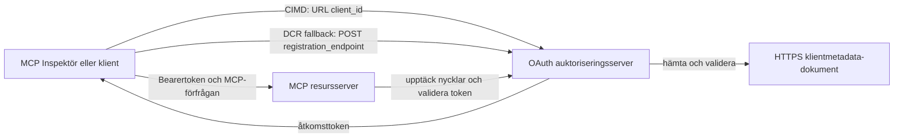

# CIMD och DCR auktoriseringsexempel

Detta TypeScript-exempel jämför två sätt en OAuth-klient kan erhålla en identitet
innan den får åtkomst till en skyddad MCP-server:

- **Client ID Metadata Documents (CIMD)** använder en stabil HTTPS-URL som
  `client_id`. Detta är den föredragna mekanismen för klienter och auktoriserings-
  servrar som inte har någon förhandsbefintlig relation.
- **Dynamic Client Registration (DCR)** ber auktoriseringsservern att skapa
  ett ogenomskinligt klient-ID i realtid. MCP `2026-07-28` behåller DCR endast för bakåt-
  kompatibilitet.

Exemplet använder den stabila MCP TypeScript SDK v2 och den statslösa
MCP `2026-07-28` begäransmodellen. Den fungerar med en extern OAuth 2.1/OpenID
Connect auktoriseringsserver såsom Auth0. MCP-servern är en resurs-
server: den validerar åtkomsttoken men autentiserar inte användare eller utfärdar
tokens.

## Lärandemål

Genom att slutföra detta exempel kommer du att kunna:

- Förklara varför CIMD föredras framför DCR för nya MCP-klienter.
- Publicera ett giltigt CIMD-dokument för en offentlig inhemsk klient.
- Konfigurera en MCP-resursserver för OAuth-upptäckt och JWT-validering.
- Öva på CIMD och DCR med samma MCP-server och auktoriseringsserver.
- Tillämpa en OAuth-scope inuti ett MCP-verktyg.
- Identifiera vilka ansvarsområden som tillhör klienten, resursservern och
  auktoriseringsservern.

## Arkitektur



Auktoriseringsservern väljer och validerar registreringsmekanismen.
MCP-servern ser bara den verifierade `client_id`-påståendet som resultat. En HTTPS-URL
med en sökväg identifierar CIMD. Ett ogenomskinligt ID räcker inte för att bevisa DCR eftersom en
förregistrerad klient också kan använda ett ogenomskinligt ID; den valfria
`DCR_CLIENT_ID_PREFIX`-inställningen tillhandahåller en leverantörsspecifik demonstrationshint.

## Registreringsprioritet

MCP-klienter som stöder alla mekanismer bör använda denna ordning:

1. Använd förregistrerad klientinformation när den redan är tillgänglig.
2. Använd CIMD när auktoriseringsservern annonserar
   `client_id_metadata_document_supported: true`.
3. Använd DCR endast som en reserv när servern annonserar en
   `registration_endpoint`.
4. Be användaren om förregistrerad klientinformation när ingen av ovanstående är
   tillgänglig.

## Projektlayout

```text
src/
  config.ts          Environment validation
  dcr.ts             DCR compatibility request
  mcp.ts             MCP tools and scope checks
  oauth.ts           Authorization metadata and JWT verification
  register-dcr.ts    DCR command-line helper
  registration.ts    CIMD document and mechanism classification
  server.ts          Express, OAuth discovery, and MCP endpoint
test/
  dcr.test.ts
  oauth.test.ts
  registration.test.ts
  server.test.ts
```

## Förutsättningar

- Node.js 20.6 eller nyare. Skripten använder `--env-file` och `--import`.
- En OAuth 2.1/OpenID Connect auktoriseringsserver som stöder:
  - Auktoriseringskodflöde med S256 PKCE.
  - OAuth Protected Resource Metadata och Resource Indicators.
  - JWT åtkomsttoken och en JWKS-endpoint.
  - CIMD, samt DCR om du vill jämföra den äldre reservmekanismen.
- MCP Inspector eller en annan MCP `2026-07-28` klient.
- En offentlig HTTPS-URL för CIMD-dokumentet. En utvecklingstunnel är lämplig
  för labben; använd en stabil domän i produktion.

## Installera och testa

```bash
npm install
npm run build
npm test
```

De tolv testerna använder lokala nycklar och mockade HTTP-endpoints. De kräver inget
auktoriseringsserverkonto. De verifierar:

- CIMD-dokumentets form och URL-begränsningar.
- Ärlig klassificering av URL och ogenomskinliga klient-ID:n.
- DCR-begäran och svarshantering.
- Avvisning av osäkra DCR-endpoints utanför loopback.
- JWT-signatur, utgivare, publik, utgångstid, klient-ID och scope-validering.
- Ett in-process MCP `2026-07-28` anrop till `registration-info`.

## Konfigurera auktoriseringsservern

De exakta kontrollnamnen varierar mellan leverantörer. Konfigurera dessa funktioner:

1. Skapa en API eller resursserver vars identifierare exakt matchar din MCP-
   URL, inklusive `/mcp`, till exempel `http://127.0.0.1:3001/mcp`.
2. Använd RS256 åtkomsttoken och inkludera en `client_id` eller `azp`-påstående.
3. Lägg till `tool:greet`-behörigheten eller scopet.
4. Aktivera auktoriseringskodflöde med S256 PKCE för offentliga inhemska klienter.
5. Aktivera Client ID Metadata Documents.
6. För endast jämförelsen, aktivera Dynamic Client Registration.
7. Säkerställ att auktoriseringsserverns metadata annonserar:
   - `issuer`
   - `authorization_endpoint`
   - `token_endpoint`
   - `jwks_uri`
   - `client_id_metadata_document_supported: true`
   - `registration_endpoint` när DCR är aktiverat

### Exempel från Auth0

För Auth0, aktivera Client ID Metadata Document Registration, OIDC Dynamic
Application Registration, och Resource Parameter-kompatibilitet. Skapa en API
vars identifierare är den exakta MCP-URL:en och lägg till `tool:greet` behörighet.
Tillåt testanvändare och tredjepartsklienter att begära den behörigheten.

Leverantörers kontrollpaneler och funktionstillgänglighet förändras över tid. Kontrollera
leverantörsdokumentationen innan du använder dessa inställningar utanför denna labb.

## Konfigurera exemplet

Skapa `.env` från exemplet:

```powershell
Copy-Item .env.example .env
```

På bash-kompatibla shell:

```bash
cp .env.example .env
```

Ange dessa värden:

```dotenv
MCP_SERVER_URL=http://127.0.0.1:3001/mcp
AUTHORIZATION_SERVER_ISSUER=https://your-tenant.example.com/
AUTHORIZATION_SERVER_METADATA_URL=https://your-tenant.example.com/.well-known/openid-configuration
CLIENT_METADATA_URL=https://your-public-host.example.com/client-metadata.json
OAUTH_REDIRECT_URIS=http://127.0.0.1:6274/oauth/callback
DCR_CLIENT_ID_PREFIX=tpc_
```

Viktiga detaljer:

- `AUTHORIZATION_SERVER_ISSUER` måste exakt matcha `issuer` i den upptäckta
  auktoriseringsserverns metadata, inklusive eventuell avslutande snedstreck.
- `MCP_SERVER_URL` måste matcha publiken (audience) för åtkomsttoken.
- `CLIENT_METADATA_URL` måste använda HTTPS, innehålla en icke-rot sökväg och vara den
  offentliga URL som tjänar metadata-rutten. Frågesträngar och fragment avvisas
  så att rutten och `client_id` förblir identiska.
- `OAUTH_REDIRECT_URIS` är en kommaseparerad tillåtelslista. Standard är MCP
  Inspectors loopback-callback.
- `DCR_CLIENT_ID_PREFIX` är valfri och leverantörsspecifik. Lämna den tom om
  din leverantör inte har något pålitligt DCR-prefix.

## Publicera CIMD-dokumentet

Starta en tunnel som vidarebefordrar sin offentliga HTTPS-ursprung till `127.0.0.1:3001`.
Sätt `CLIENT_METADATA_URL` till det ursprunget plus `/client-metadata.json`, och kör sedan:

```bash
npm run build
npm start
```

Verifiera båda upptäcktsdokumenten:

```bash
curl http://127.0.0.1:3001/health
curl http://127.0.0.1:3001/client-metadata.json
curl http://127.0.0.1:3001/.well-known/oauth-protected-resource/mcp
```

Det `client_id` som returneras av den offentliga HTTPS-metadatans URL måste vara byte-för-byte
identisk med den URL:en. Auktoriseringsservern måste validera dokumentet och
dess redirect-URI innan en token utfärdas.

> [!NOTE]
> Exemplet är värd för klientdokumentet och MCP-resursservern i en process
> för att hålla labben liten. I produktion äger och hostar MCP-klienten sitt CIMD-
> dokument oberoende av resursservern.

## Jämför CIMD och DCR

Starta MCP Inspector:

```bash
npx @modelcontextprotocol/inspector
```

Använd Streamable HTTP och anslut till `http://127.0.0.1:3001/mcp`.

### CIMD (Föredragen)

1. Ange den offentliga `CLIENT_METADATA_URL` som OAuth-klient-ID.
2. Begär `tool:greet` plus eventuella identitetsscopes som din leverantör kräver.
3. Slutför inloggning och samtycke.
4. Anropa `registration-info`. Det rapporterar `mechanism: "cimd"`.
5. Anropa `greet` för att verifiera scope-tillämpning.

### DCR (Reservmekanism för kompatibilitet)

1. Rensa Inspectors sparade OAuth-status.
2. Lämna OAuth-klient-ID tomt så Inspector kan använda den annonserade
   `registration_endpoint`.
3. Slutför inloggning och samtycke.
4. Anropa `registration-info`.
5. Om `DCR_CLIENT_ID_PREFIX` matchar leverantörens genererade ID:n, rapporterar verktyget
   `mechanism: "dcr"`; annars rapporterar det korrekt
   `opaque-client-id`.

Du kan också demonstrera registreringsförfrågan direkt:

```bash
npm run build
npm run register:dcr
```

Hjälpen skriver ut det returnerade klient-ID:t men visar aldrig en klienthemlighet.
Behandla all returnerad hemlighet som känslig och lagra den i ett korrekt hemlighetsarkiv.

## Verktyg

| Verktyg | Krävd scope | Syfte |
| --- | --- | --- |
| `registration-info` | Verifierad klient | Rapportera klient-ID-typen |
| `greet` | `tool:greet` | Demonstrera per-verktygs auktorisering |

## Säkerhetsanteckningar

- Validera JWT-signaturer genom auktoriseringsserverns JWKS-endpoint.
- Kräva exakta matchningar för utgivare och publik.
- Kräva utgångs- och klient-ID-påståenden.
- Acceptera aldrig en token utfärdad för en annan resurs.
- Passa aldrig igenom MCP-token till en nedströms-API.
- Bind DCR-referenser till den utgivare som skapade dem.
- Validera CIMD redirect-URI:er med exakt matchning.
- Applicera SSRF-kontroller när en auktoriseringsserver hämtar CIMD-URL:er.
- Använd HTTPS för auktoriserings- och metadataendpoints utanför loopback-
  utveckling.
- Härled inte DCR från ett ogenomskinligt klient-ID om inte leverantören dokumenterar en
  tillförlitlig identifieringskonvention.

## Referenser

- [MCP auktoriseringsspecifikation](https://modelcontextprotocol.io/specification/2026-07-28/basic/authorization)
- [MCP klientregistrering](https://modelcontextprotocol.io/specification/2026-07-28/basic/authorization/client-registration)
- [MCP säkerhetsbästa praxis](https://modelcontextprotocol.io/specification/2026-07-28/basic/security_best_practices)
- [MCP TypeScript SDK v2 auktoriseringsguide](https://ts.sdk.modelcontextprotocol.io/v2/serving/authorization)
- [OAuth Dynamic Client Registration (RFC 7591)](https://datatracker.ietf.org/doc/html/rfc7591)
- [OAuth Client ID Metadata Document draft](https://datatracker.ietf.org/doc/html/draft-ietf-oauth-client-id-metadata-document-00)

## Tack

Den parallella undervisningsmetoden inspirerades av
[Sambego/auth0-xmcp-cimd](https://github.com/Sambego/auth0-xmcp-cimd). Detta
exempel är en original, leverantörsneutral implementation byggd med den officiella
MCP TypeScript SDK v2 för detta kursmaterial.

---

<!-- CO-OP TRANSLATOR DISCLAIMER START -->
**Ansvarsfriskrivning**:
Detta dokument har översatts med hjälp av AI-översättningstjänsten [Co-op Translator](https://github.com/Azure/co-op-translator). Även om vi strävar efter noggrannhet, var vänlig notera att automatiska översättningar kan innehålla fel eller brister. Det ursprungliga dokumentet på dess modersmål bör betraktas som den auktoritativa källan. För kritisk information rekommenderas professionell mänsklig översättning. Vi ansvarar inte för några missförstånd eller feltolkningar som uppstår till följd av användningen av denna översättning.
<!-- CO-OP TRANSLATOR DISCLAIMER END -->