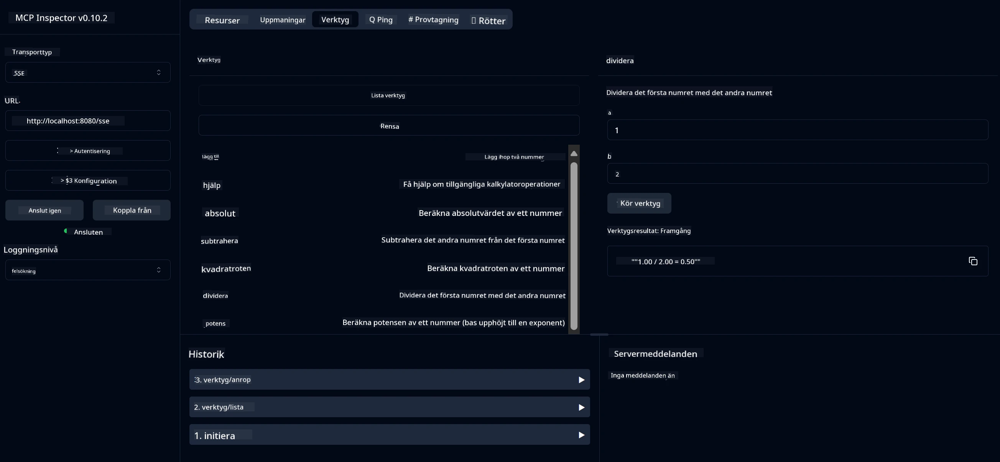

# Grundläggande Kalkylator MCP-tjänst

> [!NOTE]
> Denna Java-lösning använder den äldre HTTP+SSE-transporten och riktar sig till en SDK
> kompatibel med MCP `2025-11-25`. Den behålls för att matcha kurskod;
> nya fjärrservrar bör använda `2026-07-28` Streamable HTTP-stöd.

Denna tjänst tillhandahåller grundläggande kalkylatoroperationer via Model Context Protocol (MCP) med Spring Boot och WebFlux-transport. Den är utformad som ett enkelt exempel för nybörjare som lär sig om MCP-implementationer.

För mer information, se referensdokumentationen för [MCP Server Boot Starter](https://docs.spring.io/spring-ai/reference/api/mcp/mcp-server-boot-starter-docs.html).


## Använda tjänsten

Tjänsten exponerar följande API-endpoints via MCP-protokollet:

- `add(a, b)`: Lägg ihop två tal
- `subtract(a, b)`: Subtrahera det andra talet från det första
- `multiply(a, b)`: Multiplicera två tal
- `divide(a, b)`: Dividera det första talet med det andra (med kontroll för noll)
- `power(base, exponent)`: Beräkna potensen av ett tal
- `squareRoot(number)`: Beräkna kvadratroten (med kontroll för negativa tal)
- `modulus(a, b)`: Beräkna resten vid division
- `absolute(number)`: Beräkna absolutbeloppet

## Beroenden

Projektet kräver följande viktiga beroenden:

```xml
<dependency>
    <groupId>org.springframework.ai</groupId>
    <artifactId>spring-ai-starter-mcp-server-webflux</artifactId>
</dependency>
```

## Bygga projektet

Bygg projektet med Maven:
```bash
./mvnw clean install -DskipTests
```

## Köra servern

### Med Java

```bash
java -jar target/calculator-server-0.0.1-SNAPSHOT.jar
```

### Med MCP Inspector

MCP Inspector är ett hjälpsamt verktyg för att interagera med MCP-tjänster. För att använda det med denna kalkylatortjänst:

1. **Installera och kör MCP Inspector** i ett nytt terminalfönster:
   ```bash
   npx @modelcontextprotocol/inspector
   ```

2. **Öppna webb-UI** genom att klicka på URL:en som appen visar (vanligtvis http://localhost:6274)

3. **Konfigurera anslutningen**:
   - Ställ in transporttypen till "SSE"
   - Ange URL till din körande servers SSE-endpoint: `http://localhost:8080/sse`
   - Klicka på "Connect"

4. **Använd verktygen**:
   - Klicka på "List Tools" för att se tillgängliga kalkylatoroperationer
   - Välj ett verktyg och klicka på "Run Tool" för att köra en operation



---

<!-- CO-OP TRANSLATOR DISCLAIMER START -->
**Ansvarsfriskrivning**:
Detta dokument har översatts med hjälp av AI-översättningstjänsten [Co-op Translator](https://github.com/Azure/co-op-translator). Även om vi strävar efter noggrannhet, var vänlig notera att automatiska översättningar kan innehålla fel eller brister. Det ursprungliga dokumentet på dess modersmål bör betraktas som den auktoritativa källan. För kritisk information rekommenderas professionell mänsklig översättning. Vi ansvarar inte för några missförstånd eller feltolkningar som uppstår till följd av användningen av denna översättning.
<!-- CO-OP TRANSLATOR DISCLAIMER END -->