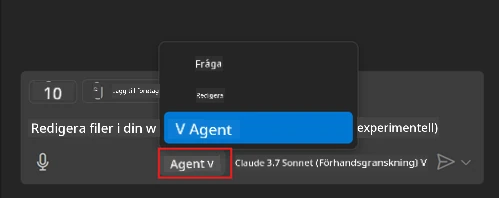
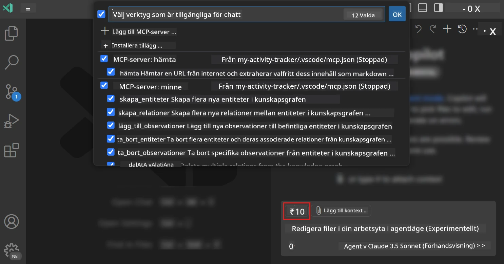
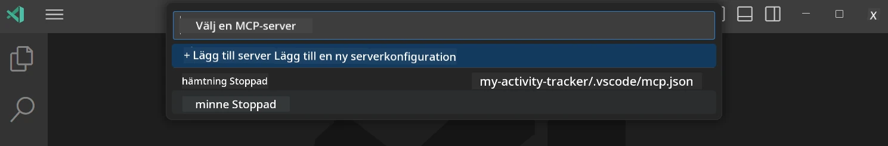
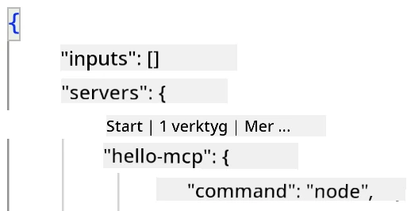
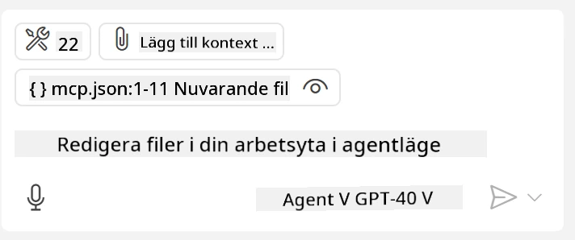
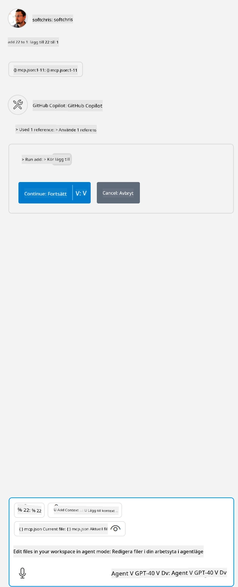

# Använda en server från GitHub Copilot Agent-läge

Visual Studio Code och GitHub Copilot kan agera som klient och konsumera en MCP-server. Varför skulle vi vilja göra det kanske du undrar? Jo, det betyder att alla funktioner som MCP-servern har nu kan användas direkt i din IDE. Föreställ dig att du lägger till till exempel GitHubs MCP-server, detta skulle möjliggöra att styra GitHub via promptar istället för att skriva specifika kommandon i terminalen. Eller tänk på något allmänt som skulle kunna förbättra din utvecklarupplevelse, allt styrt av naturligt språk. Nu börjar du förstå fördelen, eller hur?

## Översikt

Den här lektionen täcker hur man använder Visual Studio Code och GitHub Copilots Agent-läge som klient för din MCP-server.

## Läromål

I slutet av denna lektion kommer du att kunna:

- Använda en MCP-server via Visual Studio Code.
- Köra funktioner som verktyg via GitHub Copilot.
- Konfigurera Visual Studio Code för att hitta och hantera din MCP-server.

## Användning

Du kan styra din MCP-server på två olika sätt:

- Användargränssnitt, du kommer att se hur detta görs senare i detta kapitel.
- Terminal, det går att styra saker från terminalen med `code`-exekverbaren:

  För att lägga till en MCP-server till din användarprofil, använd kommandoradsalternativet --add-mcp och ange JSON-serverkonfigurationen i formen {\"name\":\"server-namn\",\"command\":...}.

  ```
  code --add-mcp "{\"name\":\"my-server\",\"command\": \"uvx\",\"args\": [\"mcp-server-fetch\"]}"
  ```

### Skärmdumpar





Låt oss prata mer om hur vi använder det visuella gränssnittet i nästa avsnitt.

## Tillvägagångssätt

Så här behöver vi närma oss detta på hög nivå:

- Konfigurera en fil för att hitta vår MCP-server.
- Starta/anslut till nämnda server för att få den att lista sina funktioner.
- Använd dessa funktioner via GitHub Copilot Chat-gränssnittet.

Bra, nu när vi förstår flödet, låt oss försöka använda en MCP-server via Visual Studio Code i en övning.

## Övning: Använda en server

I denna övning kommer vi att konfigurera Visual Studio Code för att hitta din MCP-server så att den kan användas via GitHub Copilot Chat-gränssnittet.

### -0- Försteg, aktivera MCP Server-upptäckt

Du kan behöva aktivera upptäckt av MCP-servrar.

1. Gå till `File -> Preferences -> Settings` i Visual Studio Code.

1. Sök efter "MCP" och aktivera `chat.mcp.discovery.enabled` i settings.json-filen.

### -1- Skapa en konfigurationsfil

Börja med att skapa en konfigurationsfil i din projektrot, du behöver en fil som heter MCP.json och placera den i en mapp som heter .vscode. Den ska se ut så här:

```text
.vscode
|-- mcp.json
```

Nästa steg, låt oss se hur vi kan lägga till en serverpost.

### -2- Konfigurera en server

Lägg till följande innehåll i *mcp.json*:

```json
{
    "inputs": [],
    "servers": {
       "hello-mcp": {
           "command": "node",
           "args": [
               "build/index.js"
           ]
       }
    }
}
```

Här är ett enkelt exempel ovan på hur man startar en server skriven i Node.js, för andra körmiljöer anger du rätt kommando för att starta servern med `command` och `args`.

### -3- Starta servern

Nu när du har lagt till en post, låt oss starta servern:

1. Leta upp din post i *mcp.json* och se till att du hittar "play"-ikonen:

    

1. Klicka på "play"-ikonen, du bör se verktygsikonen i GitHub Copilot Chat öka antalet tillgängliga verktyg. Om du klickar på nämnda verktygsikon kommer du att se en lista över registrerade verktyg. Du kan markera/avmarkera varje verktyg beroende på om du vill att GitHub Copilot ska använda dem som kontext:

  

1. För att köra ett verktyg, skriv en prompt som du vet matchar beskrivningen av ett av dina verktyg, till exempel en prompt som "add 22 to 1":

  

  Du bör se ett svar där det står 23.

## Uppdrag

Testa att lägga till en serverpost i din *mcp.json*-fil och se till att du kan starta/stänga av servern. Se också till att du kan kommunicera med verktygen på din server via GitHub Copilot Chat-gränssnittet.

## Lösning

[Lösning](./solution/README.md)

## Viktiga insikter

De viktigaste insikterna från detta kapitel är följande:

- Visual Studio Code är en utmärkt klient som låter dig konsumera flera MCP-servrar och deras verktyg.
- GitHub Copilot Chat-gränssnittet är hur du interagerar med servrarna.
- Du kan be användaren om indata som API-nycklar som kan skickas till MCP-servern när du konfigurerar serverposten i *mcp.json*-filen.

## Exempel

- [Java Calculator](../samples/java/calculator/README.md)
- [.Net Calculator](../../../../03-GettingStarted/samples/csharp)
- [JavaScript Calculator](../samples/javascript/README.md)
- [TypeScript Calculator](../samples/typescript/README.md)
- [Python Calculator](../../../../03-GettingStarted/samples/python)

## Ytterligare resurser

- [Visual Studio docs](https://code.visualstudio.com/docs/copilot/chat/mcp-servers)

## Vad händer härnäst

- Nästa: [Skapa en stdio-server](../05-stdio-server/README.md)

---

<!-- CO-OP TRANSLATOR DISCLAIMER START -->
**Ansvarsfriskrivning**:
Detta dokument har översatts med hjälp av AI-översättningstjänsten [Co-op Translator](https://github.com/Azure/co-op-translator). Även om vi strävar efter noggrannhet, var vänlig notera att automatiska översättningar kan innehålla fel eller brister. Det ursprungliga dokumentet på dess modersmål bör betraktas som den auktoritativa källan. För kritisk information rekommenderas professionell mänsklig översättning. Vi ansvarar inte för några missförstånd eller feltolkningar som uppstår till följd av användningen av denna översättning.
<!-- CO-OP TRANSLATOR DISCLAIMER END -->