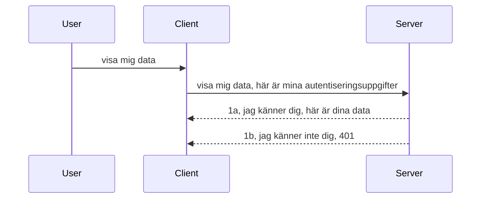

# Enkel autentisering

MCP SDK:er stödjer användningen av OAuth 2.1 som, för att vara ärlig, är en ganska invecklad process som involverar koncept som auktoriseringsserver, resursserver, att skicka in uppgifter, få en kod, byta koden mot en bearer-token tills du äntligen kan hämta dina resursdata. Om du inte är van vid OAuth, vilket är en fantastisk sak att implementera, är det en bra idé att börja med någon grundläggande nivå av autentisering och bygga vidare mot bättre och bättre säkerhet. Det är anledningen till att detta kapitel finns, för att bygga upp dig till mer avancerad autentisering.

## Autentisering, vad menar vi?

Autentisering är en förkortning av autentisering och auktorisering. Idén är att vi behöver göra två saker:

- **Autentisering**, vilket är processen att ta reda på om vi låter en person komma in i vårt hus, att de har rätt att vara "här", alltså ha åtkomst till vår resursserver där våra MCP Server-funktioner finns.
- **Auktorisering**, är processen att ta reda på om en användare ska ha tillgång till dessa specifika resurser de efterfrågar, till exempel dessa order eller dessa produkter eller om de får läsa innehållet men inte ta bort det som ett annat exempel.

## Inloggningsuppgifter: hur vi berättar för systemet vem vi är

Tja, de flesta webbprogrammerare där ute börjar tänka i termer av att tillhandahålla en autentiseringsuppgift till servern, vanligtvis en hemlighet som säger om de får vara här "Autentisering". Denna autentiseringsuppgift är vanligtvis en base64-kodad version av användarnamn och lösenord eller en API-nyckel som unikt identifierar en specifik användare.

Detta innebär att skicka den via en header kallad "Authorization" på följande sätt:

```json
{ "Authorization": "secret123" }
```

Detta kallas vanligtvis för grundläggande autentisering. Hur den övergripande flödet sedan fungerar är på följande sätt:



Nu när vi förstår hur det fungerar ur ett flödesperspektiv, hur implementerar vi det? Tja, de flesta webbservrar har ett koncept som kallas middleware, en bit kod som körs som en del av förfrågan som kan verifiera autentiseringsuppgifter, och om dessa är giltiga kan låta förfrågan passera. Om förfrågan inte har giltiga autentiseringsuppgifter får du ett autentiseringsfel. Låt oss se hur detta kan implementeras:

**Python**

```python
class AuthMiddleware(BaseHTTPMiddleware):
    async def dispatch(self, request, call_next):

        has_header = request.headers.get("Authorization")
        if not has_header:
            print("-> Missing Authorization header!")
            return Response(status_code=401, content="Unauthorized")

        if not valid_token(has_header):
            print("-> Invalid token!")
            return Response(status_code=403, content="Forbidden")

        print("Valid token, proceeding...")
       
        response = await call_next(request)
        # lägg till eventuella kundhuvuden eller ändra svaret på något sätt
        return response


starlette_app.add_middleware(CustomHeaderMiddleware)
```

Här har vi:

- Skapat middleware kallad `AuthMiddleware` där dess metod `dispatch` anropas av webbservern.
- Lagt till middleware i webbservern:

    ```python
    starlette_app.add_middleware(AuthMiddleware)
    ```

- Skrivit valideringslogik som kontrollerar om Authorization-headern finns och om den skickade hemligheten är giltig:

    ```python
    has_header = request.headers.get("Authorization")
    if not has_header:
        print("-> Missing Authorization header!")
        return Response(status_code=401, content="Unauthorized")

    if not valid_token(has_header):
        print("-> Invalid token!")
        return Response(status_code=403, content="Forbidden")
    ```

    om hemligheten finns och är giltig låter vi förfrågan passera genom att anropa `call_next` och returnerar svaret.

    ```python
    response = await call_next(request)
    # lägg till eventuella kundhuvuden eller ändra svaret på något sätt
    return response
    ```

Det fungerar så att om en webbförfrågan görs mot servern anropas middleware och med dess implementering kommer den antingen att låta förfrågan passera eller returnera ett fel som indikerar att klienten inte har tillåtelse att fortsätta.

**TypeScript**

Här skapar vi en middleware med det populära ramverket Express och fångar upp förfrågan innan den når MCP Server. Här är koden för detta:

```typescript
function isValid(secret) {
    return secret === "secret123";
}

app.use((req, res, next) => {
    // 1. Auktoriseringshuvud närvarande?
    if(!req.headers["Authorization"]) {
        res.status(401).send('Unauthorized');
    }
    
    let token = req.headers["Authorization"];

    // 2. Kontrollera giltighet.
    if(!isValid(token)) {
        res.status(403).send('Forbidden');
    }

   
    console.log('Middleware executed');
    // 3. Skicka vidare förfrågan till nästa steg i förfrågningsflödet.
    next();
});
```

I denna kod:

1. Kontrollerar om Authorization-headern finns överhuvudtaget, om inte skickar vi ett 401-fel.
2. Säkerställer att autentiseringsuppgiften/token är giltig, om inte skickar vi ett 403-fel.
3. Slutligen skickas förfrågan vidare i förfrågningspipen och returnerar den efterfrågade resursen.

## Övning: Implementera autentisering

Låt oss ta våra kunskaper och försöka implementera det. Här är planen:

Server

- Skapa en webbserver och MCP-instans.
- Implementera en middleware för servern.

Klient

- Skicka webbförfrågan med autentiseringsuppgift via header.

### -1- Skapa en webbserver och MCP-instans

> [!WARNING]
> TypeScript-exemplet nedan riktar sig mot MCP `2025-11-25`. Det spårar transporter
> med `mcp-session-id` och är inte ett aktuellt `2026-07-28` transportexempel. MCP
> `2026-07-28` tar bort `initialize` handskakningen och protokollsession-ID; nya
> implementationer använder självständiga förfrågningar. Se
> [Vad som ändrats i MCP: Specifikationen 2026-07-28](../../01-CoreConcepts/mcp-2026-07-28.md).

I vårt första steg behöver vi skapa webbserver-instansen och MCP Server.

**Python**

Här skapar vi en MCP serverinstans, skapar en starlette webbapp och hostar den med uvicorn.

```python
# skapar MCP-server

app = FastMCP(
    name="MCP Resource Server",
    instructions="Resource Server that validates tokens via Authorization Server introspection",
    host=settings["host"],
    port=settings["port"],
    debug=True
)

# skapar starlette webbapp
starlette_app = app.streamable_http_app()

# serverar app via uvicorn
async def run(starlette_app):
    import uvicorn
    config = uvicorn.Config(
            starlette_app,
            host=app.settings.host,
            port=app.settings.port,
            log_level=app.settings.log_level.lower(),
        )
    server = uvicorn.Server(config)
    await server.serve()

run(starlette_app)
```

I denna kod:

- Skapar MCP Server.
- Konstruerar starlette webbapp från MCP Server, `app.streamable_http_app()`.
- Hostar och serverar webbappen med uvicorn `server.serve()`.

**TypeScript**

Här skapar vi en MCP Server-instans.

```typescript
const server = new McpServer({
      name: "example-server",
      version: "1.0.0"
    });

    // ... ställa in serverresurser, verktyg och uppmaningar ...
```

Denna MCP Server-creation måste ske inom vår POST /mcp route-definition, så låt oss ta ovanstående kod och flytta den så här:

```typescript
import express from "express";
import { randomUUID } from "node:crypto";
import { McpServer } from "@modelcontextprotocol/sdk/server/mcp.js";
import { StreamableHTTPServerTransport } from "@modelcontextprotocol/sdk/server/streamableHttp.js";
import { isInitializeRequest } from "@modelcontextprotocol/sdk/types.js"

const app = express();
app.use(express.json());

// Karta för att lagra transporter efter sessions-ID
const transports: { [sessionId: string]: StreamableHTTPServerTransport } = {};

// Hantera POST-förfrågningar för klient-till-server kommunikation
app.post('/mcp', async (req, res) => {
  // Kontrollera om sessions-ID finns
  const sessionId = req.headers['mcp-session-id'] as string | undefined;
  let transport: StreamableHTTPServerTransport;

  if (sessionId && transports[sessionId]) {
    // Återanvänd befintlig transport
    transport = transports[sessionId];
  } else if (!sessionId && isInitializeRequest(req.body)) {
    // Ny initieringsförfrågan
    transport = new StreamableHTTPServerTransport({
      sessionIdGenerator: () => randomUUID(),
      onsessioninitialized: (sessionId) => {
        // Lagra transporten efter sessions-ID
        transports[sessionId] = transport;
      },
      // DNS-återbindningsskydd är som standard inaktiverat för bakåtkompatibilitet. Om du kör denna server
      // lokalt, se till att ange:
      // enableDnsRebindingProtection: true,
      // allowedHosts: ['127.0.0.1'],
    });

    // Rensa upp transporten när den stängs
    transport.onclose = () => {
      if (transport.sessionId) {
        delete transports[transport.sessionId];
      }
    };
    const server = new McpServer({
      name: "example-server",
      version: "1.0.0"
    });

    // ... konfigurera serverresurser, verktyg och promptar ...

    // Anslut till MCP-servern
    await server.connect(transport);
  } else {
    // Ogiltig förfrågan
    res.status(400).json({
      jsonrpc: '2.0',
      error: {
        code: -32000,
        message: 'Bad Request: No valid session ID provided',
      },
      id: null,
    });
    return;
  }

  // Hantera förfrågan
  await transport.handleRequest(req, res, req.body);
});

// Återanvändbar hanterare för GET och DELETE-förfrågningar
const handleSessionRequest = async (req: express.Request, res: express.Response) => {
  const sessionId = req.headers['mcp-session-id'] as string | undefined;
  if (!sessionId || !transports[sessionId]) {
    res.status(400).send('Invalid or missing session ID');
    return;
  }
  
  const transport = transports[sessionId];
  await transport.handleRequest(req, res);
};

// Hantera GET-förfrågningar för server-till-klient notifikationer via SSE
app.get('/mcp', handleSessionRequest);

// Hantera DELETE-förfrågningar för sessionens avslutning
app.delete('/mcp', handleSessionRequest);

app.listen(3000);
```

Nu ser du hur MCP Server-skapandet flyttades inom `app.post("/mcp")`.

Låt oss gå vidare till nästa steg med att skapa middleware så vi kan validera den inkommande autentiseringsuppgiften.

### -2- Implementera middleware för servern

Nu tar vi middleware-delen. Här skapar vi en middleware som letar efter en autentiseringsuppgift i `Authorization` headern och validerar den. Om den är acceptabel går förfrågan vidare för att göra det som behövs (t.ex. lista verktyg, läsa en resurs eller vad klienten än begärde av MCP).

**Python**

För att skapa middleware behöver vi skapa en klass som ärv från `BaseHTTPMiddleware`. Det finns två intressanta delar:

- Förfrågan `request`, där vi läser header-informationen ifrån.
- `call_next` callbacken vi behöver anropa om klienten har med sig en autentiseringsuppgift som vi accepterar.

Först måste vi hantera fallet där `Authorization` headern saknas:

```python
has_header = request.headers.get("Authorization")

# inget huvudelement närvarande, misslyckas med 401, annars fortsätt.
if not has_header:
    print("-> Missing Authorization header!")
    return Response(status_code=401, content="Unauthorized")
```

Här skickar vi ett 401 unauthorized-meddelande eftersom klienten misslyckas med autentiseringen.

Nästa steg, om en autentiseringsuppgift skickats, måste vi kontrollera dess giltighet så här:

```python
 if not valid_token(has_header):
    print("-> Invalid token!")
    return Response(status_code=403, content="Forbidden")
```

Notera hur vi skickar ett 403 forbidden-meddelande ovan. Se hela middleware-koden nedan som implementerar allt vi nämnt ovan:

```python
class AuthMiddleware(BaseHTTPMiddleware):
    async def dispatch(self, request, call_next):

        has_header = request.headers.get("Authorization")
        if not has_header:
            print("-> Missing Authorization header!")
            return Response(status_code=401, content="Unauthorized")

        if not valid_token(has_header):
            print("-> Invalid token!")
            return Response(status_code=403, content="Forbidden")

        print("Valid token, proceeding...")
        print(f"-> Received {request.method} {request.url}")
        response = await call_next(request)
        response.headers['Custom'] = 'Example'
        return response

```

Bra, men hur är det med funktionen `valid_token`? Här är den:

```python
# ANVÄND INTE i produktion - förbättra det !!
def valid_token(token: str) -> bool:
    # ta bort prefixet "Bearer "
    if token.startswith("Bearer "):
        token = token[7:]
        return token == "secret-token"
    return False
```

Detta borde uppenbarligen förbättras.

VIKTIGT: Du ska ALDRIG ha hemligheter som dessa i koden. Du bör helst hämta värdet att jämföra med från en datakälla eller från en IDP (identitetstjänstleverantör) eller ännu bättre, låta IDP göra valideringen.

**TypeScript**

För att implementera detta med Express behöver vi anropa metoden `use` som tar middleware-funktioner.

Vi behöver:

- Interagera med förfrågningsvariabeln för att kolla den passade autentiseringsuppgiften i `Authorization`-egenskapen.
- Validera autentiseringsuppgiften, och om godkänd låta förfrågan fortsätta och låta klientens MCP-begäran göra vad den ska (t.ex. lista verktyg, läsa resurs eller annat MCP-relaterat).

Här kontrollerar vi om `Authorization` headern finns och om inte stoppar vi förfrågan från att gå igenom:

```typescript
if(!req.headers["authorization"]) {
    res.status(401).send('Unauthorized');
    return;
}
```

Om headern inte skickas överhuvudtaget får du ett 401.

Nästa steg är att kontrollera om autentiseringsuppgiften är giltig, om inte stoppar vi förfrågan igen men med ett något annorlunda meddelande:

```typescript
if(!isValid(token)) {
    res.status(403).send('Forbidden');
    return;
} 
```

Notera hur du nu får ett 403-fel.

Här är hela koden:

```typescript
app.use((req, res, next) => {
    console.log('Request received:', req.method, req.url, req.headers);
    console.log('Headers:', req.headers["authorization"]);
    if(!req.headers["authorization"]) {
        res.status(401).send('Unauthorized');
        return;
    }
    
    let token = req.headers["authorization"];

    if(!isValid(token)) {
        res.status(403).send('Forbidden');
        return;
    }  

    console.log('Middleware executed');
    next();
});
```

Vi har satt upp webbservern att acceptera middleware för att kontrollera autentiseringsuppgiften klienten förhoppningsvis skickar oss. Vad säger vi om själva klienten?

### -3- Skicka webbförfrågan med autentiseringsuppgift via header

Vi behöver säkerställa att klienten skickar autentiseringsuppgiften via header. Eftersom vi ska använda en MCP-klient för detta måste vi förstå hur det görs.

**Python**

För klienten behöver vi passa en header med vår autentiseringsuppgift så här:

```python
# SKRIV INTE in värdet direkt, ha det minst i en miljövariabel eller en mer säker lagring
token = "secret-token"

async with streamablehttp_client(
        url = f"http://localhost:{port}/mcp",
        headers = {"Authorization": f"Bearer {token}"}
    ) as (
        read_stream,
        write_stream,
        session_callback,
    ):
        async with ClientSession(
            read_stream,
            write_stream
        ) as session:
            await session.initialize()
      
            # ATT GÖRA, vad du vill göra i klienten, t.ex lista verktyg, kalla verktyg etc.
```

Observera hur vi fyller `headers`-egenskapen så här: ` headers = {"Authorization": f"Bearer {token}"}`.

**TypeScript**

Vi kan lösa detta i två steg:

1. Fylla i ett konfigurationsobjekt med vår autentiseringsuppgift.
2. Skicka konfigurationsobjektet till transporten.

```typescript

// Hårdkoda INTE värdet som visas här. Ha det minst som en miljövariabel och använd något som dotenv (i utvecklingsläge).
let token = "secret123"

// definiera ett klient transportalternativ objekt
let options: StreamableHTTPClientTransportOptions = {
  sessionId: sessionId,
  requestInit: {
    headers: {
      "Authorization": "secret123"
    }
  }
};

// skicka options-objektet till transporten
async function main() {
   const transport = new StreamableHTTPClientTransport(
      new URL(serverUrl),
      options
   );
```

Här ser du ovan hur vi var tvungna att skapa ett `options`-objekt och placera våra headers under egenskapen `requestInit`.

VIKTIGT: Hur förbättrar vi detta härifrån? Tja, den aktuella implementeringen har några problem. Först och främst är det ganska riskabelt att skicka en autentiseringsuppgift så här om du inte åtminstone har HTTPS. Även då kan autentiseringsuppgiften stjälas, så du behöver ett system där du enkelt kan återkalla token och lägga till ytterligare kontroller som var i världen den kommer ifrån, händer förfrågningarna alltför ofta (bot-liknande beteende), kort sagt, det finns en mängd olika bekymmer.

Det bör ändå sägas, för mycket enkla API:er där du inte vill att vem som helst ska anropa ditt API utan att vara autentiserad är det vi har här en bra början.

Med det sagt, låt oss försöka stärka säkerheten lite genom att använda ett standardiserat format som JSON Web Token, även kallat JWT eller "JOT" tokens.

## JSON Web Tokens, JWT

Så, vi försöker förbättra saker från att skicka väldigt enkla autentiseringsuppgifter. Vilka omedelbara förbättringar får vi genom att anta JWT?

- **Säkerhetsförbättringar**. Vid grundläggande autentisering skickar du användarnamn och lösenord som en base64-kodad token (eller API-nyckel) om och om igen vilket ökar risken. Med JWT skickar du ditt användarnamn och lösenord och får en token tillbaka som dessutom är tidsbegränsad och kommer att gå ut. JWT låter dig enkelt använda finmaskig åtkomstkontroll med roller, scopes och behörigheter.
- **Statelessness och skalbarhet**. JWT:er är självförsörjande, de bär all användarinformation och eliminerar behovet av att lagra sessionsdata på serversidan. Token kan också valideras lokalt.
- **Interoperabilitet och federation**. JWT är centralt i Open ID Connect och används med kända identitetsleverantörer som Entra ID, Google Identity och Auth0. De gör också single sign-on och mycket mer möjligt vilket gör det företagsklassat.
- **Modularitet och flexibilitet**. JWT kan också används med API Gateways som Azure API Management, NGINX och fler. Det stöder även användarautentiseringsscenarier och server-till-server-kommunikation inklusive impersonering och delegation.
- **Prestanda och cachning**. JWT kan cachas efter avkodning vilket minskar behovet av ny parsing. Det hjälper särskilt med högtrafikerade appar eftersom det förbättrar genomströmningen och minskar belastningen på vald infrastruktur.
- **Avancerade funktioner**. Det stöder även introspektion (kontrollera giltighet på server) och återkallande (ogiltigförklara token).

Med alla dessa fördelar, låt oss se hur vi kan ta vår implementation till nästa nivå.

## Förvandla grundläggande autentisering till JWT

Så, de ändringar vi behöver göra på hög nivå är att:

- **Lära oss att konstruera en JWT-token** och göra den redo att skickas från klient till server.
- **Validera en JWT-token**, och om giltig låta klienten få tillgång till våra resurser.
- **Säkra token-lagring**. Hur vi sparar denna token.
- **Skydda rutter**. Vi behöver skydda rutter, i vårt fall behöver vi skydda rutter och specifika MCP-funktioner.
- **Lägga till refresh tokens**. Säkerställ att vi skapar tokens som är kortlivade men också refresh tokens som är långlivade och kan användas för att skaffa nya tokens om de går ut. Säkerställ också att det finns en refresh endpoint och en rotationsstrategi.

### -1- Konstruera en JWT-token

Först och främst har en JWT-token följande delar:

- **header**, algoritm som används och token-typ.
- **payload**, claims, som sub (användaren eller entiteten token representerar. I ett autentiseringsscenario är detta vanligtvis användarid), exp (när den går ut), role (rollen)
- **signature**, signerad med en hemlighet eller privat nyckel.

För detta behöver vi konstruera header, payload och den kodade token.

**Python**

```python

import jwt
import jwt
from jwt.exceptions import ExpiredSignatureError, InvalidTokenError
import datetime

# Hemlig nyckel som används för att signera JWT
secret_key = 'your-secret-key'

header = {
    "alg": "HS256",
    "typ": "JWT"
}

# användarinformationen och dess påståenden och utgångstid
payload = {
    "sub": "1234567890",               # Ämne (användar-ID)
    "name": "User Userson",                # Anpassat påstående
    "admin": True,                     # Anpassat påstående
    "iat": datetime.datetime.utcnow(),# Utfärdad vid
    "exp": datetime.datetime.utcnow() + datetime.timedelta(hours=1)  # Utgång
}

# koda det
encoded_jwt = jwt.encode(payload, secret_key, algorithm="HS256", headers=header)
```

I ovanstående kod har vi:

- Definierat en header med HS256 som algoritm och typ JWT.
- Konstruerat ett payload som innehåller en subject eller användar-id, ett användarnamn, en roll, när den utfärdades och när den ska gå ut och därmed implementera den tidsbegränsade aspekten vi nämnde tidigare.

**TypeScript**

Här kommer vi att behöva några beroenden som hjälper oss konstruera JWT-token.

Beroenden

```sh

npm install jsonwebtoken
npm install --save-dev @types/jsonwebtoken
```

Nu när vi har det på plats, låt oss skapa header, payload och därigenom skapa den kodade token.

```typescript
import jwt from 'jsonwebtoken';

const secretKey = 'your-secret-key'; // Använd miljövariabler i produktion

// Definiera nyttolasten
const payload = {
  sub: '1234567890',
  name: 'User usersson',
  admin: true,
  iat: Math.floor(Date.now() / 1000), // Utfärdat vid
  exp: Math.floor(Date.now() / 1000) + 60 * 60 // Går ut om 1 timme
};

// Definiera headern (valfritt, jsonwebtoken sätter standardvärden)
const header = {
  alg: 'HS256',
  typ: 'JWT'
};

// Skapa tokenen
const token = jwt.sign(payload, secretKey, {
  algorithm: 'HS256',
  header: header
});

console.log('JWT:', token);
```

Denna token är:

Signerad med HS256
Giltig i 1 timme
Innehåller claims som sub, name, admin, iat och exp.

### -2- Validera en token

Vi kommer också behöva validera en token, detta är något vi bör göra på servern för att säkerställa att det klienten skickar verkligen är giltigt. Det finns många kontroller vi bör göra här från att validera dess struktur till giltighet. Du uppmuntras även att lägga till andra kontroller för att se om användaren finns i ditt system och mer.

För att validera en token måste vi avkoda den så vi kan läsa den och sedan börja kontrollera dess giltighet:

**Python**

```python

# Avkoda och verifiera JWT
try:
    decoded = jwt.decode(token, secret_key, algorithms=["HS256"])
    print("✅ Token is valid.")
    print("Decoded claims:")
    for key, value in decoded.items():
        print(f"  {key}: {value}")
except ExpiredSignatureError:
    print("❌ Token has expired.")
except InvalidTokenError as e:
    print(f"❌ Invalid token: {e}")

```


I den här koden anropar vi `jwt.decode` med token, hemlig nyckel och det valda algoritmen som indata. Notera hur vi använder en try-catch-konstruktion eftersom en misslyckad validering leder till att ett fel kastas.

**TypeScript**

Här behöver vi anropa `jwt.verify` för att få en dekodad version av token som vi kan analysera vidare. Om detta anrop misslyckas betyder det att tokenstrukturen är felaktig eller att den inte längre är giltig.

```typescript

try {
  const decoded = jwt.verify(token, secretKey);
  console.log('Decoded Payload:', decoded);
} catch (err) {
  console.error('Token verification failed:', err);
}
```

NOTERA: som nämnts tidigare bör vi utföra ytterligare kontroller för att säkerställa att den här token pekar ut en användare i vårt system och att användaren har de rättigheter den påstår sig ha.

Låt oss nu titta på rollbaserad åtkomstkontroll, även känd som RBAC.

## Lägg till rollbaserad åtkomstkontroll

Idén är att vi vill uttrycka att olika roller har olika behörigheter. Till exempel antar vi att en admin kan göra allt, att en vanlig användare kan läsa/skiva och att en gäst endast kan läsa. Därför är här några möjliga behörighetsnivåer:

- Admin.Write 
- User.Read
- Guest.Read

Låt oss se hur vi kan implementera sådan kontroll med middleware. Middlewares kan läggas till per rutt samt för alla rutter.

**Python**

```python
from starlette.middleware.base import BaseHTTPMiddleware
from starlette.responses import JSONResponse
import jwt

# HA INTE hemligheten i koden som denna, detta är endast för demonstrationsändamål. Läs den från en säker plats.
SECRET_KEY = "your-secret-key" # lägg detta i en miljövariabel
REQUIRED_PERMISSION = "User.Read"

class JWTPermissionMiddleware(BaseHTTPMiddleware):
    async def dispatch(self, request, call_next):
        auth_header = request.headers.get("Authorization")
        if not auth_header or not auth_header.startswith("Bearer "):
            return JSONResponse({"error": "Missing or invalid Authorization header"}, status_code=401)

        token = auth_header.split(" ")[1]
        try:
            decoded = jwt.decode(token, SECRET_KEY, algorithms=["HS256"])
        except jwt.ExpiredSignatureError:
            return JSONResponse({"error": "Token expired"}, status_code=401)
        except jwt.InvalidTokenError:
            return JSONResponse({"error": "Invalid token"}, status_code=401)

        permissions = decoded.get("permissions", [])
        if REQUIRED_PERMISSION not in permissions:
            return JSONResponse({"error": "Permission denied"}, status_code=403)

        request.state.user = decoded
        return await call_next(request)


```

Det finns några olika sätt att lägga till middleware som nedan:

```python

# Alternativ 1: lägg till middleware medan starlette-appen konstrueras
middleware = [
    Middleware(JWTPermissionMiddleware)
]

app = Starlette(routes=routes, middleware=middleware)

# Alternativ 2: lägg till middleware efter att starlette-appen redan är konstruerad
starlette_app.add_middleware(JWTPermissionMiddleware)

# Alternativ 3: lägg till middleware per rutt
routes = [
    Route(
        "/mcp",
        endpoint=..., # hanterare
        middleware=[Middleware(JWTPermissionMiddleware)]
    )
]
```

**TypeScript**

Vi kan använda `app.use` och en middleware som körs för alla förfrågningar.

```typescript
app.use((req, res, next) => {
    console.log('Request received:', req.method, req.url, req.headers);
    console.log('Headers:', req.headers["authorization"]);

    // 1. Kontrollera om auktoriseringshuvudet har skickats

    if(!req.headers["authorization"]) {
        res.status(401).send('Unauthorized');
        return;
    }
    
    let token = req.headers["authorization"];

    // 2. Kontrollera om token är giltig
    if(!isValid(token)) {
        res.status(403).send('Forbidden');
        return;
    }  

    // 3. Kontrollera om token-användaren finns i vårt system
    if(!isExistingUser(token)) {
        res.status(403).send('Forbidden');
        console.log("User does not exist");
        return;
    }
    console.log("User exists");

    // 4. Verifiera att token har rätt behörigheter
    if(!hasScopes(token, ["User.Read"])){
        res.status(403).send('Forbidden - insufficient scopes');
    }

    console.log("User has required scopes");

    console.log('Middleware executed');
    next();
});

```

Det finns ganska många saker vi kan låta vår middleware göra och som vår middleware BORDE göra, nämligen:

1. Kontrollera om auktoriseringsheader finns
2. Kontrollera om token är giltig, vi anropar `isValid` som är en metod vi skrivit som kontrollerar integriteten och giltigheten av JWT-token.
3. Verifiera att användaren finns i vårt system, vi bör kontrollera detta.

   ```typescript
    // användare i DB
   const users = [
     "user1",
     "User usersson",
   ]

   function isExistingUser(token) {
     let decodedToken = verifyToken(token);

     // TODO, kontrollera om användare finns i DB
     return users.includes(decodedToken?.name || "");
   }
   ```

   Ovan har vi skapat en mycket enkel `users`-lista, som förstås borde finnas i en databas.

4. Dessutom bör vi också kontrollera att token har rätt behörigheter.

   ```typescript
   if(!hasScopes(token, ["User.Read"])){
        res.status(403).send('Forbidden - insufficient scopes');
   }
   ```

   I koden ovan från middleware kontrollerar vi att token innehåller User.Read-behörighet, annars skickar vi ett 403-fel. Nedan är hjälpfunktionen `hasScopes`.

   ```typescript
   function hasScopes(scope: string, requiredScopes: string[]) {
     let decodedToken = verifyToken(scope);
    return requiredScopes.every(scope => decodedToken?.scopes.includes(scope));
  }
   ```

Have a think which additional checks you should be doing, but these are the absolute minimum of checks you should be doing.

Using Express as a web framework is a common choice. There are helpers library when you use JWT so you can write less code.

- `express-jwt`, helper library that provides a middleware that helps decode your token.
- `express-jwt-permissions`, this provides a middleware `guard` that helps check if a certain permission is on the token.

Here's what these libraries can look like when used:

```typescript
const express = require('express');
const jwt = require('express-jwt');
const guard = require('express-jwt-permissions')();

const app = express();
const secretKey = 'your-secret-key'; // put this in env variable

// Decode JWT and attach to req.user
app.use(jwt({ secret: secretKey, algorithms: ['HS256'] }));

// Check for User.Read permission
app.use(guard.check('User.Read'));

// multiple permissions
// app.use(guard.check(['User.Read', 'Admin.Access']));

app.get('/protected', (req, res) => {
  res.json({ message: `Welcome ${req.user.name}` });
});

// Error handler
app.use((err, req, res, next) => {
  if (err.code === 'permission_denied') {
    return res.status(403).send('Forbidden');
  }
  next(err);
});

```

Nu har du sett hur middleware kan användas för både autentisering och auktorisering, men hur är det med MCP, ändrar det hur vi gör auth? Låt oss ta reda på det i nästa avsnitt.

### -3- Lägg till RBAC i MCP

Du har hittills sett hur du kan lägga till RBAC via middleware, men för MCP finns det inget enkelt sätt att lägga till RBAC per MCP-funktion, så vad gör vi då? Jo, vi måste bara lägga till kod som denna som kontrollerar i det här fallet om klienten har rättigheter att anropa ett specifikt verktyg:

Du har några olika val på hur du kan uppnå RBAC per funktion, här är några:

- Lägg till en kontroll för varje verktyg, resurs, prompt där du behöver kontrollera behörighetsnivå.

   **python**

   ```python
   @tool()
   def delete_product(id: int):
      try:
          check_permissions(role="Admin.Write", request)
      catch:
        pass # klienten misslyckades med auktorisering, höj auktoriseringsfel
   ```

   **typescript**

   ```typescript
   server.registerTool(
    "delete-product",
    {
      title: Delete a product",
      description: "Deletes a product",
      inputSchema: { id: z.number() }
    },
    async ({ id }) => {
      
      try {
        checkPermissions("Admin.Write", request);
        // att göra, skicka id till productService och fjärrinmatning
      } catch(Exception e) {
        console.log("Authorization error, you're not allowed");  
      }

      return {
        content: [{ type: "text", text: `Deletected product with id ${id}` }]
      };
    }
   );
   ```


- Använd avancerad servermetod och request-handlers så du minimerar hur många platser du behöver göra kontrollen på.

   **Python**

   ```python
   
   tool_permission = {
      "create_product": ["User.Write", "Admin.Write"],
      "delete_product": ["Admin.Write"]
   }

   def has_permission(user_permissions, required_permissions) -> bool:
      # user_permissions: lista över behörigheter användaren har
      # required_permissions: lista över behörigheter som krävs för verktyget
      return any(perm in user_permissions for perm in required_permissions)

   @server.call_tool()
   async def handle_call_tool(
     name: str, arguments: dict[str, str] | None
   ) -> list[types.TextContent]:
    # Anta att request.user.permissions är en lista över användarens behörigheter
     user_permissions = request.user.permissions
     required_permissions = tool_permission.get(name, [])
     if not has_permission(user_permissions, required_permissions):
        # Kasta fel "Du har inte behörighet att använda verktyget {name}"
        raise Exception(f"You don't have permission to call tool {name}")
     # fortsätt och kalla på verktyget
     # ...
   ```   
   

   **TypeScript**

   ```typescript
   function hasPermission(userPermissions: string[], requiredPermissions: string[]): boolean {
       if (!Array.isArray(userPermissions) || !Array.isArray(requiredPermissions)) return false;
       // Returnera sant om användaren har minst en nödvändig behörighet
       
       return requiredPermissions.some(perm => userPermissions.includes(perm));
   }
  
   server.setRequestHandler(CallToolRequestSchema, async (request) => {
      const { params: { name } } = request;
  
      let permissions = request.user.permissions;
  
      if (!hasPermission(permissions, toolPermissions[name])) {
         return new Error(`You don't have permission to call ${name}`);
      }
  
      // fortsätt..
   });
   ```

   Observera att du måste se till att din middleware tilldelar en dekodad token till begärans user-egenskap så att koden ovan görs enkel.

### Sammanfattning

Nu när vi har diskuterat hur man lägger till stöd för RBAC generellt och för MCP specifikt, är det dags att försöka implementera säkerhet på egen hand för att säkerställa att du förstått de koncept som presenterats.

## Uppgift 1: Bygg en MCP-server och MCP-klient med grundläggande autentisering

Här kommer du använda det du lärt dig om att skicka inloggningsuppgifter via headers.

## Lösning 1

[Lösning 1](./code/basic/README.md)

## Uppgift 2: Uppgradera lösningen från Uppgift 1 till att använda JWT

Ta den första lösningen men den här gången, låt oss förbättra den.

Istället för att använda Basic Auth, låt oss använda JWT.

## Lösning 2

[Lösning 2](./solution/jwt-solution/README.md)

## Utmaning

Lägg till RBAC per verktyg som vi beskriver i avsnittet "Lägg till RBAC i MCP".

## Sammanfattning

Du har förhoppningsvis lärt dig mycket i det här kapitlet, från ingen säkerhet alls, till grundläggande säkerhet, till JWT och hur det kan läggas till i MCP.

Vi har byggt en solid grund med egna JWT, men när vi växer går vi mot en standardbaserad identitetsmodell. Att använda en IdP som Entra eller Keycloak låter oss avlasta tokenutfärdande, validering och livscykelhantering till en betrodd plattform — vilket frigör oss att fokusera på applogik och användarupplevelse.

För detta finns ett mer [avancerat kapitel om Entra](../../05-AdvancedTopics/mcp-security-entra/README.md)

## Vad händer härnäst

- Nästa: [Konfigurera MCP Hosts](../12-mcp-hosts/README.md)

---

<!-- CO-OP TRANSLATOR DISCLAIMER START -->
**Ansvarsfriskrivning**:
Detta dokument har översatts med hjälp av AI-översättningstjänsten [Co-op Translator](https://github.com/Azure/co-op-translator). Även om vi strävar efter noggrannhet, var vänlig notera att automatiska översättningar kan innehålla fel eller brister. Det ursprungliga dokumentet på dess modersmål bör betraktas som den auktoritativa källan. För kritisk information rekommenderas professionell mänsklig översättning. Vi ansvarar inte för några missförstånd eller feltolkningar som uppstår till följd av användningen av denna översättning.
<!-- CO-OP TRANSLATOR DISCLAIMER END -->