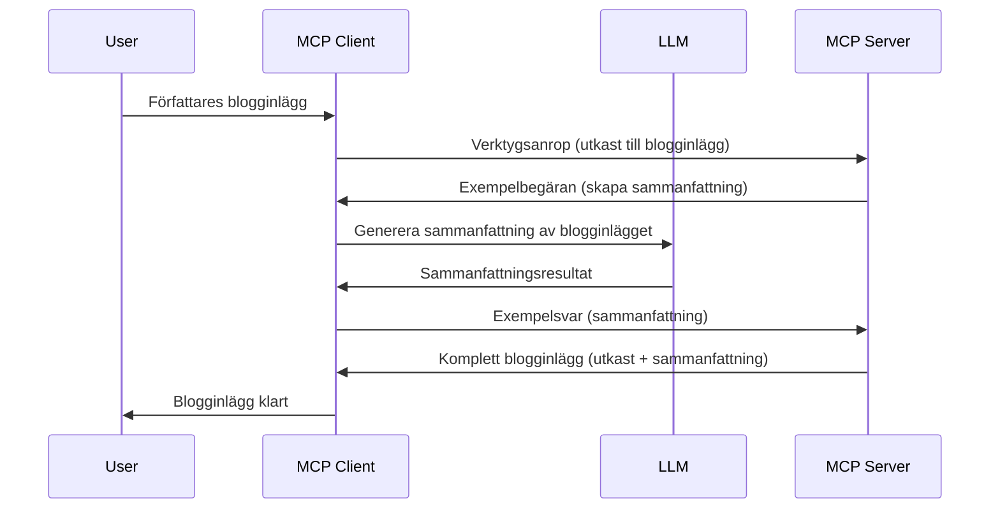

> [!VARNING]
> Sampling är föråldrat i MCP `2026-07-28`. Denna lektion behålls för
> äldre implementationer. Nya servrar bör integrera direkt med ett LLM
> leverantörs-API.

# Sampling - delegera funktioner till Klienten

> Sampling finns kvar i `2026-07-28`-specifikationen för kompatibilitet och är
> berättigad till borttagning i den första revisionen som släpps den 28 juli
> 2027 eller senare. Exempel i denna lektion kan använda SDK-API:er som implementerar `2025-11-25`.
> Se [Vad som har ändrats i MCP: Specifikationen 2026-07-28](../../01-CoreConcepts/mcp-2026-07-28.md).

I äldre implementationer låter Sampling en MCP-server be om hjälp från ett LLM
som hanteras av klienten. För nya implementationer ska du istället kalla den valda LLM-leverantören
direkt.

Låt oss utforska några användningsfall och hur man bygger en lösning som involverar sampling.

## Översikt

I denna lektion fokuserar vi på att förklara när och var Sampling ska användas och hur man konfigurerar det.

## Lärandemål

I detta kapitel kommer vi att:

- Förklara vad Sampling är och när man ska använda det.
- Visa hur man konfigurerar Sampling i MCP.
- Ge exempel på Sampling i praktiken.

## Vad är Sampling och varför använda det?

Sampling är en avancerad funktion som fungerar på följande sätt:



### Sampling-begäran

Okej, nu när vi har en övergripande bild av ett trovärdigt scenario, låt oss prata om sampling-begäran som servern skickar tillbaka till klienten. Här är hur en sådan begäran kan se ut i JSON-RPC-format:

```json
{
  "jsonrpc": "2.0",
  "id": 1,
  "method": "sampling/createMessage",
  "params": {
    "messages": [
      {
        "role": "user",
        "content": {
          "type": "text",
          "text": "Create a blog post summary of the following blog post: <BLOG POST>"
        }
      }
    ],
    "modelPreferences": {
      "hints": [
        {
          "name": "claude-3-sonnet"
        }
      ],
      "intelligencePriority": 0.8,
      "speedPriority": 0.5
    },
    "systemPrompt": "You are a helpful assistant.",
    "maxTokens": 100
  }
}
```

Det finns några saker här som är värda att påpeka:

- Prompt, under content -> text, är vår prompt som är en instruktion till LLM att sammanfatta blogginläggets innehåll.

- **modelPreferences**. Denna sektion är just det, en preferens, en rekommendation av vilken konfiguration som ska användas med LLM. Användaren kan välja att följa dessa rekommendationer eller ändra dem. I detta fall finns rekommendationer om vilken modell som ska användas samt prioritering för hastighet och intelligens.
- **systemPrompt**, detta är din normala systemprompt som ger din LLM en personlighet och innehåller vägledande instruktioner.
- **maxTokens**, detta är en annan egenskap som anger hur många tokens som rekommenderas att användas för denna uppgift.

### Sampling-svar

Detta svar är vad MCP-klienten till slut skickar tillbaka till MCP-servern och är resultatet av att klienten kallat LLM, väntat på det svaret och sedan konstruerat detta meddelande. Här är hur det kan se ut i JSON-RPC:

```json
{
  "jsonrpc": "2.0",
  "id": 1,
  "result": {
    "role": "assistant",
    "content": {
      "type": "text",
      "text": "Here's your abstract <ABSTRACT>"
    },
    "model": "gpt-5",
    "stopReason": "endTurn"
  }
}
```

Notera hur svaret är en sammanfattning av blogginlägget precis som vi bad om. Notera också hur den använda `model` inte är vad vi bad om utan "gpt-5" över "claude-3-sonnet". Detta illustrerar att användaren kan ändra sig om vad som ska användas och att din sampling-begäran är en rekommendation.

Okej, nu när vi förstår huvudflödet och en användbar uppgift att använda det för "skapa blogginlägg + sammanfattning", låt oss se vad vi behöver göra för att få det att fungera.

### Meddelandetyper

Sampling-meddelanden är inte begränsade till bara text utan du kan också skicka bilder och ljud. Så här ser JSON-RPC annorlunda ut:

**Text**

```json
{
  "type": "text",
  "text": "The message content"
}
```

**Bildinnehåll**

```json
{
  "type": "image",
  "data": "base64-encoded-image-data",
  "mimeType": "image/jpeg"
}
```

**Ljudinnehåll**

```json
{
  "type": "audio",
  "data": "base64-encoded-audio-data",
  "mimeType": "audio/wav"
}
```

> NOTE: För aktuell status och migreringsvägledning, se
> [föråldrad Sampling-dokumentation](https://modelcontextprotocol.io/specification/2026-07-28/client/sampling).

## Hur man konfigurerar Sampling i Klienten

> Notera: om du bara bygger en server behöver du inte göra så mycket här.

I en klient behöver du ange följande funktion så här:

```json
{
  "capabilities": {
    "sampling": {}
  }
}
```

Detta kommer sedan att plockas upp när din valda klient initieras med servern.

## Exempel på Sampling i praktiken - Skapa ett blogginlägg

Låt oss koda en sampling-server tillsammans, vi behöver göra följande:

1. Skapa ett verktyg på Servern.
1. Ange att verktyget ska skapa en sampling-begäran.
1. Verktyget ska vänta på att klientens sampling-begäran besvaras.
1. Verktygets resultat ska sedan produceras.

Låt oss se koden steg för steg:

### -1- Skapa verktyget

**python**

```python
@mcp.tool()
async def create_blog(title: str, content: str, ctx: Context[ServerSession, None]) -> str:
    """Create a blog post and generate a summary"""

```

### -2- Skapa en sampling-begäran

Förläng ditt verktyg med följande kod:

**python**

```python
post = BlogPost(
        id=len(posts) + 1,
        title=title,
        content=content,
        abstract=""
    )

prompt = f"Create an abstract of the following blog post: title: {title} and draft: {content} "

result = await ctx.session.create_message(
        messages=[
            SamplingMessage(
                role="user",
                content=TextContent(type="text", text=prompt),
            )
        ],
        max_tokens=100,
)

```

### -3- Vänta på svar och returnera svar

**python**

```python
post.abstract = result.content.text

posts.append(post)

# returnera hela produkten
return json.dumps({
    "id": post.title,
    "abstract": post.abstract
})
```

### -4- Fullständig kod

**python**

```python
from starlette.applications import Starlette
from starlette.routing import Mount, Host

from mcp.server.fastmcp import Context, FastMCP

from mcp.server.session import ServerSession
from mcp.types import SamplingMessage, TextContent

import json


from uuid import uuid4
from typing import List
from pydantic import BaseModel


mcp = FastMCP("Blog post generator")

# app = FastAPI()

posts = []

class BlogPost(BaseModel):
    id: int
    title: str
    content: str
    abstract: str

posts: List[BlogPost] = []

@mcp.tool()
async def create_blog(title: str, content: str, ctx: Context[ServerSession, None]) -> str:
    """Create a blog post and generate a summary"""

    post = BlogPost(
        id=len(posts) + 1,
        title=title,
        content=content,
        abstract=""
    )

    prompt = f"Create an abstract of the following blog post: title: {title} and draft: {content} "

    result = await ctx.session.create_message(
        messages=[
            SamplingMessage(
                role="user",
                content=TextContent(type="text", text=prompt),
            )
        ],
        max_tokens=100,
    )

    post.abstract = result.content.text

    posts.append(post)

    # returnera hela blogginlägget
    return json.dumps({
        "id": post.title,
        "abstract": post.abstract
    })

if __name__ == "__main__":
    print("Starting server...")
    # mcp.run()
    mcp.run(transport="streamable-http")

# kör app med: python server.py
```

### -5- Testa i Visual Studio Code

För att testa detta i Visual Studio Code, gör följande:

1. Starta servern i terminalen
1. Lägg till den i *mcp.json* (och se till att den är startad) t.ex. så här:

   ```json
   "servers": {
      "blog-server": {
        "type": "http",
        "url": "http://localhost:8000/mcp"
      }
   }
   ```

1. Skriv en prompt:

   ```text
   create a blog post named "Where Python comes from", the content is "Python is actually named after Monty Python Flying Circus"
   ```

1. Tillåt sampling att ske. Första gången du testar detta kommer du att få en extra dialogruta som du måste acceptera, sedan kommer du att se den normala dialogrutan som ber dig köra ett verktyg.

1. Inspektera resultaten. Du kommer att se resultaten både fint renderade i GitHub Copilot Chat men du kan också inspektera det råa JSON-svaret.

**Bonus**. Visual Studio Codes verktyg har utmärkt stöd för sampling. Du kan konfigurera samplingstillgång på din installerade server genom att navigera så här:

1. Navigera till extensions-sektionen.
1. Välj kugghjulsikonen för din installerade server i sektionen "MCP SERVERS - INSTALLED".
1. Välj "Configure Model Access", här kan du välja vilka modeller GitHub Copilot får använda vid sampling. Du kan också se alla sampling-begäran som nyligen gjorts genom att välja "Show Sampling requests".

## Uppgift

I denna uppgift kommer du att bygga en något annorlunda Sampling, nämligen en sampling-integration som stödjer skapande av produktbeskrivning. Här är ditt scenario:

**Scenario**: Backoffice-anställd på en e-handel behöver hjälp, det tar alldeles för lång tid att skapa produktbeskrivningar. Därför ska du bygga en lösning där du kan kalla ett verktyg "create_product" med "title" och "keywords" som argument och det ska producera en komplett produkt inklusive ett "description"-fält som ska fyllas i av en klients LLM.

TIPS: använd det du lärde dig tidigare för att skapa denna server och dess verktyg med en sampling-begäran.

## Lösning

[Lösning](./solution/README.md)

## Viktiga insikter

Sampling är en kraftfull funktion som tillåter servern att delegera uppgifter till klienten när den behöver hjälp av ett LLM.

## Vad som kommer härnäst

- [Kapitel 4 - Praktisk implementation](../../04-PracticalImplementation/README.md)

---

<!-- CO-OP TRANSLATOR DISCLAIMER START -->
**Ansvarsfriskrivning**:
Detta dokument har översatts med hjälp av AI-översättningstjänsten [Co-op Translator](https://github.com/Azure/co-op-translator). Även om vi strävar efter noggrannhet, var vänlig notera att automatiska översättningar kan innehålla fel eller brister. Det ursprungliga dokumentet på dess modersmål bör betraktas som den auktoritativa källan. För kritisk information rekommenderas professionell mänsklig översättning. Vi ansvarar inte för några missförstånd eller feltolkningar som uppstår till följd av användningen av denna översättning.
<!-- CO-OP TRANSLATOR DISCLAIMER END -->