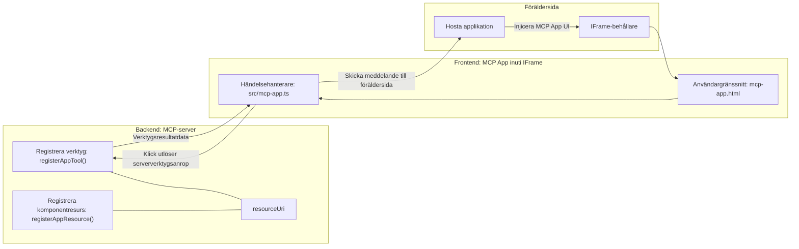
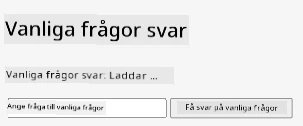
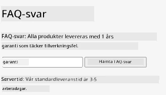
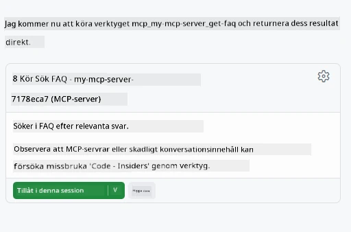

# MCP-appar

MCP-appar är ett nytt paradigmskifte inom MCP. Idén är att du inte bara svarar med data från ett verktygsanrop, utan också tillhandahåller information om hur denna information ska interageras med. Det betyder att verktygsresultat nu kan innehålla UI-information. Varför skulle vi vilja det? Jo, tänk på hur du gör idag. Du konsumerar troligen resultaten från en MCP-server genom att placera någon typ av frontend framför den, det är kod du behöver skriva och underhålla. Ibland är det vad du vill, men ibland vore det fantastiskt om du bara kunde ta in ett informationsstycke som är fristående och har allt från data till användargränssnitt.

## Översikt

Den här lektionen ger praktisk vägledning om MCP-appar, hur man kommer igång med dem och hur man integrerar dem i dina befintliga webbappar. MCP-appar är ett mycket nytt tillägg till MCP-standarden.

## Lärandemål

I slutet av denna lektion kommer du att kunna:

- Förklara vad MCP-appar är.
- När man ska använda MCP-appar.
- Bygga och integrera dina egna MCP-appar.

## MCP-appar - hur fungerar det?

Idén med MCP-appar är att tillhandahålla ett svar som i princip är en komponent som kan renderas. En sådan komponent kan ha både visuella element och interaktivitet, t.ex. knapptryckningar, användarinmatning och mer. Vi börjar med serversidan och vår MCP-server. För att skapa en MCP-appkomponent behöver du både skapa ett verktyg och en applikationsresurs. Dessa två halvor kopplas samman via en resourceUri.

Här är ett exempel. Låt oss försöka visualisera vad som ingår och vilka delar som gör vad:

```text
server.ts -- responsible for registering tools and the component as a UI component
src/
  mcp-app.ts -- wiring up event handlers
mcp-app.html -- the user interface
```

Denna visning beskriver arkitekturen för att skapa en komponent och dess logik.


Låt oss försöka beskriva ansvarsområdena för backend och frontend respektive.

### Backend

Det finns två saker vi behöver åstadkomma här:

- Registrera de verktyg vi vill interagera med.
- Definiera komponenten.

**Registrera verktyget**

```typescript
registerAppTool(
    server,
    "get-time",
    {
      title: "Get Time",
      description: "Returns the current server time.",
      inputSchema: {},
      _meta: { ui: { resourceUri } }, // Länkar detta verktyg till dess UI-resurs
    },
    async () => {
      const time = new Date().toISOString();
      return { content: [{ type: "text", text: time }] };
    },
  );

```

Koden ovan beskriver beteendet, där den exponerar ett verktyg som heter `get-time`. Det tar inga indata men producerar aktuell tid. Vi har möjlighet att definiera ett `inputSchema` för verktyg där vi vill kunna ta emot användarinmatning.

**Registrera komponenten**

I samma fil behöver vi också registrera komponenten:

```typescript
const resourceUri = "ui://get-time/mcp-app.html";

// Registrera resursen, som returnerar den bundlade HTML/JavaScript för användargränssnittet.
registerAppResource(
  server,
  resourceUri,
  resourceUri,
  { mimeType: RESOURCE_MIME_TYPE },
  async () => {
    const html = await fs.readFile(path.join(DIST_DIR, "mcp-app.html"), "utf-8");

    return {
    contents: [
        { uri: resourceUri, mimeType: RESOURCE_MIME_TYPE, text: html },
    ],
    };
  },
);
```

Notera hur vi nämner `resourceUri` för att koppla komponenten med dess verktyg. Intressant är också callbacken där vi laddar UI-filen och returnerar komponenten.

### Komponentens frontend

Precis som backend finns det två delar här:

- En frontend skriven i ren HTML.
- Kod som hanterar händelser och vad som ska göras, t.ex. anropa verktyg eller skicka meddelanden till moderfönstret.

**Användargränssnitt**

Låt oss titta på användargränssnittet.

```html
<!-- mcp-app.html -->
<!DOCTYPE html>
<html lang="en">
  <head>
    <meta charset="UTF-8" />
    <title>Get Time App</title>
  </head>
  <body>
    <p>
      <strong>Server Time:</strong> <code id="server-time">Loading...</code>
    </p>
    <button id="get-time-btn">Get Server Time</button>
    <script type="module" src="/src/mcp-app.ts"></script>
  </body>
</html>
```

**Eventkoppling**

Den sista delen är eventkopplingen. Det betyder att vi identifierar vilken del i vårt UI som behöver eventhanterare och vad som ska göras när händelser inträffar:

```typescript
// mcp-app.ts

import { App } from "@modelcontextprotocol/ext-apps";

// Hämta elementreferenser
const serverTimeEl = document.getElementById("server-time")!;
const getTimeBtn = document.getElementById("get-time-btn")!;

// Skapa appinstans
const app = new App({ name: "Get Time App", version: "1.0.0" });

// Hantera verktygsresultat från servern. Sätt innan `app.connect()` för att undvika
// att missa det initiala verktygsresultatet.
app.ontoolresult = (result) => {
  const time = result.content?.find((c) => c.type === "text")?.text;
  serverTimeEl.textContent = time ?? "[ERROR]";
};

// Koppla knapptryckning
getTimeBtn.addEventListener("click", async () => {
  // `app.callServerTool()` låter UI:n begära färsk data från servern
  const result = await app.callServerTool({ name: "get-time", arguments: {} });
  const time = result.content?.find((c) => c.type === "text")?.text;
  serverTimeEl.textContent = time ?? "[ERROR]";
});

// Anslut till värd
app.connect();
```

Som du kan se ovan är detta vanlig kod för att koppla DOM-element till händelser. Värt att nämna är anropet till `callServerTool` som i slutändan anropar ett verktyg på backend.

## Hantera användarinmatning

Hittills har vi sett en komponent som har en knapp som när den klickas anropar ett verktyg. Låt oss se om vi kan lägga till fler UI-element som ett inmatningsfält och se om vi kan skicka argument till ett verktyg. Vi skapar en FAQ-funktionalitet. Så här ska det fungera:

- Det ska finnas en knapp och ett inmatningselement där användaren skriver ett nyckelord för att söka, till exempel "Shipping". Detta ska anropa ett verktyg på backend som söker i FAQ-data.
- Ett verktyg som stödjer nämnd FAQ-sökning.

Låt oss lägga till stöd för det på backend först:

```typescript
const faq: { [key: string]: string } = {
    "shipping": "Our standard shipping time is 3-5 business days.",
    "return policy": "You can return any item within 30 days of purchase.",
    "warranty": "All products come with a 1-year warranty covering manufacturing defects.",
  }

registerAppTool(
    server,
    "get-faq",
    {
      title: "Search FAQ",
      description: "Searches the FAQ for relevant answers.",
      inputSchema: zod.object({
        query: zod.string().default("shipping"),
      }),
      _meta: { ui: { resourceUri: faqResourceUri } }, // Länkar detta verktyg till dess användargränssnittresurs
    },
    async ({ query }) => {
      const answer: string = faq[query.toLowerCase()] || "Sorry, I don't have an answer for that.";
      return { content: [{ type: "text", text: answer }] };
    },
  );
```

Vad vi ser här är hur vi fyller i `inputSchema` och ger det ett `zod`-schema så här:

```typescript
inputSchema: zod.object({
  query: zod.string().default("shipping"),
})
```

I ovanstående schema deklarerar vi att vi har en inmatningsparameter som heter `query` och att den är valfri med standardvärdet "shipping".

Okej, låt oss gå vidare till *mcp-app.html* för att se vilket UI vi behöver skapa för detta:

```html
<div class="faq">
    <h1>FAQ response</h1>
    <p>FAQ Response: <code id="faq-response">Loading...</code></p>
    <input type="text" id="faq-query" placeholder="Enter FAQ query" />
    <button id="get-faq-btn">Get FAQ Response</button>
  </div>
```

Bra, nu har vi ett inmatningselement och en knapp. Låt oss gå till *mcp-app.ts* för att koppla ihop dessa händelser:

```typescript
const getFaqBtn = document.getElementById("get-faq-btn")!;
const faqQueryInput = document.getElementById("faq-query") as HTMLInputElement;

getFaqBtn.addEventListener("click", async () => {
  const query = faqQueryInput.value;
  const result = await app.callServerTool({ name: "get-faq", arguments: { query } });
  const faq = result.content?.find((c) => c.type === "text")?.text;
  faqResponseEl.textContent = faq ?? "[ERROR]";
});
```

I koden ovan:

- Skapar vi referenser till intressanta UI-element.
- Hanterar knapptryckning för att läsa in värdet från inmatningsfältet och vi anropar också `app.callServerTool()` med `name` och `arguments` där det senare skickar `query` som värde.

Vad som faktiskt händer när du anropar `callServerTool` är att det skickas ett meddelande till föräldrafönstret och det fönstret anropar MCP-servern.

### Prova själv

Om vi testar detta borde vi nu se följande:



och här är när vi provar med indata som "warranty"



För att köra denna kod, gå till [Kodavsnittet](./code/README.md)

## Testa i Visual Studio Code

Visual Studio Code har bra stöd för MVP-appar och är troligtvis ett av de enklaste sätten att testa dina MCP-appar. För att använda Visual Studio Code, lägg till en serverpost i *mcp.json* så här:

```json
"my-mcp-server-7178eca7": {
    "url": "http://localhost:3001/mcp",
    "type": "http"
  }
```

Starta sedan servern, du ska kunna kommunicera med din MVP-app genom Chat Window förutsatt att du har GitHub Copilot installerat.

genom att aktivera via prompt, t.ex "#get-faq":



och precis som när du körde det via en webbläsare renderas det på samma sätt så här:


## Uppgift

Skapa ett sten-sax-påse-spel. Det ska bestå av följande:

UI:

- en rullgardinslista med alternativ
- en knapp för att skicka ett val
- en etikett som visar vem som valde vad och vem som vann

Server:

- ska ha ett verktyg för sten-sax-påse som tar "choice" som indata. Det ska också rendera ett datorval och avgöra vinnaren

## Lösning

[Lösning](./assignment/README.md)

## Sammanfattning

Vi har lärt oss om detta nya paradigm MCP-appar. Det är ett nytt paradigm som tillåter MCP-servrar att ha en åsikt inte bara om datan utan också om hur denna data ska presenteras.

Dessutom har vi lärt oss att dessa MCP-appar körs i en IFrame och för att kommunicera med MCP-servrar behöver de skicka meddelanden till den överordnade webbappen. Det finns flera bibliotek för både ren JavaScript och React med flera som gör denna kommunikation enklare.

## Viktiga punkter

Det här har du lärt dig:

- MCP-appar är en ny standard som kan vara användbar när du vill leverera både data och UI-funktioner.
- Denna typ av appar körs i en IFrame av säkerhetsskäl.

## Vad händer härnäst

- [Kapitel 4](../../04-PracticalImplementation/README.md)

---

<!-- CO-OP TRANSLATOR DISCLAIMER START -->
**Ansvarsfriskrivning**:
Detta dokument har översatts med hjälp av AI-översättningstjänsten [Co-op Translator](https://github.com/Azure/co-op-translator). Även om vi strävar efter noggrannhet, vänligen var medveten om att automatiska översättningar kan innehålla fel eller brister. Det ursprungliga dokumentet på dess ursprungliga språk bör betraktas som den auktoritativa källan. För kritisk information rekommenderas professionell mänsklig översättning. Vi ansvarar inte för eventuella missförstånd eller feltolkningar som uppstår vid användning av denna översättning.
<!-- CO-OP TRANSLATOR DISCLAIMER END -->