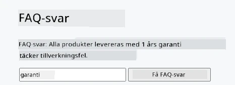
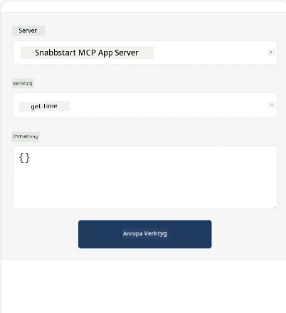
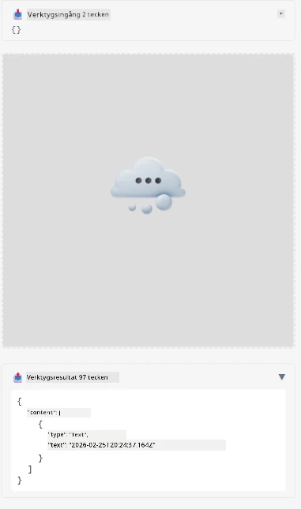

Här är ett exempel som demonstrerar MCP App

## Installera

1. Navigera till mappen *mcp-app*
1. Kör `npm install`, detta bör installera frontend- och backendberoenden

Verifiera att backenden kompilerar genom att köra:

```sh
npx tsc --noEmit
```

Det ska inte finnas någon output om allt är bra.

## Kör backend

> Detta kräver lite extra arbete om du är på en Windows-maskin eftersom MCP App-lösningen använder biblioteket `concurrently` för att köra, vilket du behöver hitta en ersättning för. Här är den aktuella raden i *package.json* på MCP App:

    ```json
    "start": "concurrently \"cross-env NODE_ENV=development INPUT=mcp-app.html vite build --watch\" \"tsx watch main.ts\""
    ```

Denna app har två delar, en backend-del och en host-del.

Starta backenden genom att köra:

```sh
npm start
```

Detta bör starta backenden på `http://localhost:3001/mcp`.

> Observera, om du är i en Codespace kan du behöva ställa in portens synlighet till offentlig. Kontrollera att du kan nå endpointen i webbläsaren via https://<namn på Codespace>.app.github.dev/mcp

## Val -1 Testa appen i Visual Studio Code

För att testa lösningen i Visual Studio Code, gör följande:

- Lägg till en serverpost i `mcp.json` så här:

    ```json
    {
        "servers": {
            "my-mcp-server-7178eca7": {
                "url": "http://localhost:3001/mcp",
                "type": "http"
            }
        },
        "inputs": []
    }
    ```

1. Klicka på "start"-knappen i *mcp.json*
1. Se till att ett chattfönster är öppet och skriv `get-faq`, du bör se ett resultat som detta:

    

## Val -2- Testa appen med en host

Repo <https://github.com/modelcontextprotocol/ext-apps> innehåller flera olika hosts som du kan använda för att testa dina MVP-appar.

Vi presenterar två olika alternativ här:

### Lokal maskin

- Navigera till *ext-apps* efter att du klonat repo.

- Installera beroenden

   ```sh
   npm install
   ```

- I ett separat terminalfönster, navigera till *ext-apps/examples/basic-host*

    > om du är i Codespace måste du navigera till serve.ts rad 27 och ersätta http://localhost:3001/mcp med din Codespace-URL för backend, till exempel https://psychic-xylophone-657rpjgvxpc5g64-3001.app.github.dev/mcp

- Kör hosten:

    ```sh
    npm start
    ```

    Detta bör koppla hosten med backenden och du bör se appen köras som så här:

    

### Codespace

Det krävs lite extra arbete för att få en Codespace-miljö att fungera. För att använda en host via Codespace:

- Se mappen *ext-apps* och navigera till *examples/basic-host*.
- Kör `npm install` för att installera beroenden
- Kör `npm start` för att starta hosten.

## Testa appen

Prova appen på följande sätt:

- Välj knappen "Call Tool" och du bör se resultaten som så här:

    

Bra, allt fungerar.

---

<!-- CO-OP TRANSLATOR DISCLAIMER START -->
**Ansvarsfriskrivning**:
Detta dokument har översatts med hjälp av AI-översättningstjänsten [Co-op Translator](https://github.com/Azure/co-op-translator). Även om vi strävar efter noggrannhet, vänligen observera att automatiska översättningar kan innehålla fel eller brister. Originaldokumentet på dess ursprungliga språk bör betraktas som den auktoritativa källan. För kritisk information rekommenderas professionell mänsklig översättning. Vi ansvarar inte för några missförstånd eller feltolkningar som uppstår vid användning av denna översättning.
<!-- CO-OP TRANSLATOR DISCLAIMER END -->