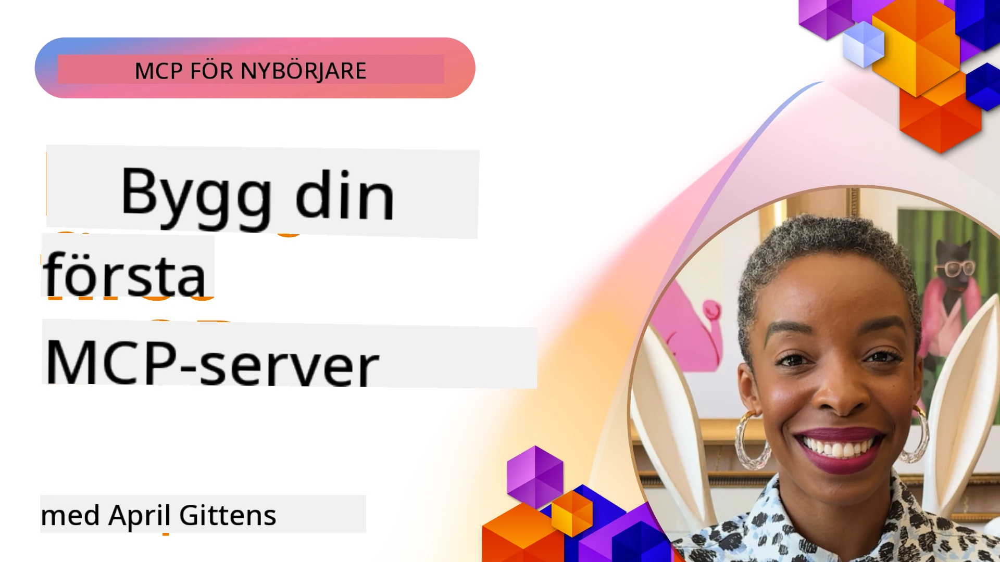

## Komma igång  

_(Klicka på bilden ovan för att se videon för denna lektion)_

Denna sektion består av flera lektioner:

- **1 Din första server**, i denna första lektion kommer du att lära dig hur du skapar din första server och undersöker den med inspektörsverktyget, ett värdefullt sätt att testa och felsöka din server, [till lektionen](01-first-server/README.md)

- **2 Klient**, i denna lektion kommer du att lära dig hur du skriver en klient som kan ansluta till din server, [till lektionen](02-client/README.md)

- **3 Klient med LLM**, ett ännu bättre sätt att skriva en klient är att lägga till ett LLM till den så att den kan "förhandla" med din server om vad som ska göras, [till lektionen](03-llm-client/README.md)

- **4 Använda en server i GitHub Copilot Agent-läge i Visual Studio Code**. Här tittar vi på att köra vår MCP Server från Visual Studio Code, [till lektionen](04-vscode/README.md)

- **5 stdio Transport Server** stdio transport är den rekommenderade standarden för lokal MCP server-till-klient kommunikation, som erbjuder säker subprocess-baserad kommunikation med inbyggd processisolering [till lektionen](05-stdio-server/README.md)

- **6 HTTP Streaming med MCP (Streamable HTTP)**. Lär dig om den standard
	fjärrtransporten i [MCP Specification 2026-07-28](https://modelcontextprotocol.io/specification/2026-07-28/basic/transports/streamable-http),
	samt den äldre sessionsbaserade implementationen som finns kvar i lektionen.
	[till lektionen](06-http-streaming/README.md)

- **7 Använda AI Toolkit för VSCode** för att konsumera och testa dina MCP-klienter och servrar [till lektionen](07-aitk/README.md)

- **8 Testning**. Här fokuserar vi särskilt på hur vi kan testa vår server och klient på olika sätt, [till lektionen](08-testing/README.md)

- **9 Utrullning**. Detta kapitel kommer att titta på olika sätt att distribuera dina MCP-lösningar, [till lektionen](09-deployment/README.md)

- **10 Avancerad serveranvändning**. Det här kapitlet täcker avancerad serveranvändning, [till lektionen](./10-advanced/README.md)

- **11 Auth**. Detta kapitel täcker hur man lägger till enkel autentisering, från Basic Auth till att använda JWT och RBAC. Du uppmuntras att börja här och sedan titta på Avancerade ämnen i Kapitel 5 och utföra ytterligare säkerhetsförstärkningar via rekommendationer i Kapitel 2, [till lektionen](./11-simple-auth/README.md)

- **12 MCP Hosts**. Konfigurera och använd populära MCP host-klienter inklusive Claude Desktop, Cursor, Cline och Windsurf. Lär dig transporttyper och felsökning, [till lektionen](./12-mcp-hosts/README.md)

- **13 MCP Inspector**. Felsök och testa dina MCP-servrar interaktivt med MCP Inspector-verktyget. Lär dig felsökningsverktyg, resurser och protokollmeddelanden, [till lektionen](./13-mcp-inspector/README.md)

- **14 Sampling**. Lär dig det äldre Sampling-primitivet för `2025-11-25` och
	hur man migrerar nya design till direkt LLM-leverantörsintegration. Sampling är
	deprecated i MCP `2026-07-28`. [till lektionen](./14-sampling/README.md)

- **15 MCP Apps**. Bygg MCP-servrar som även svarar med UI-instruktioner, [till lektionen](./15-mcp-apps/README.md)

Model Context Protocol (MCP) är ett öppet protokoll som standardiserar hur applikationer ger sammanhang till LLMs. Tänk på MCP som en USB-C-port för AI-applikationer – det ger ett standardiserat sätt att koppla AI-modeller till olika datakällor och verktyg.

## Lärandemål

När du har avslutat denna lektion kommer du att kunna:

- Ställa in utvecklingsmiljöer för MCP i C#, Java, Python, TypeScript och JavaScript
- Bygga och distribuera grundläggande MCP-servrar med anpassade funktioner (resurser, promptar och verktyg)
- Skapa host-applikationer som ansluter till MCP-servrar
- Testa och felsöka MCP-implementationer
- Förstå vanliga installationsutmaningar och deras lösningar
- Ansluta dina MCP-implementationer till populära LLM-tjänster

## Ställa in din MCP-miljö

Innan du börjar arbeta med MCP är det viktigt att förbereda din utvecklingsmiljö och förstå det grundläggande arbetsflödet. Den här sektionen kommer att guida dig genom de första installationsstegen för att säkerställa en smidig start med MCP.

### Förkunskaper

Innan du dyker in i MCP-utveckling, se till att du har:

- **Utvecklingsmiljö**: För ditt valda språk (C#, Java, Python, TypeScript eller JavaScript)
- **IDE/Editor**: Visual Studio, Visual Studio Code, IntelliJ, Eclipse, PyCharm eller någon modern kodredigerare
- **Paketförvaltare**: NuGet, Maven/Gradle, pip, eller npm/yarn
- **API-nycklar**: För alla AI-tjänster du planerar att använda i dina host-applikationer

### Officiella SDK:er

I de kommande kapitlen kommer du att se lösningar byggda med Python, TypeScript,
Java och .NET. Här är de officiella SDK:erna.

SDK-stöd för MCP `2026-07-28` rullas ut oberoende per språk.
Innan du kör ett exempel, kontrollera dess paketversion och SDK:ns versionsanteckningar
för vilka protokollsrevisioner som stöds. Se
[officiell SDK-lista](https://modelcontextprotocol.io/docs/sdk):
- [C# SDK](https://github.com/modelcontextprotocol/csharp-sdk) - Underhålls i samarbete med Microsoft
- [Java SDK](https://github.com/modelcontextprotocol/java-sdk) - Underhålls i samarbete med Spring AI
- [TypeScript SDK](https://github.com/modelcontextprotocol/typescript-sdk) - Den officiella TypeScript-implementationen
- [Python SDK](https://github.com/modelcontextprotocol/python-sdk) - Den officiella Python-implementationen (FastMCP)
- [Kotlin SDK](https://github.com/modelcontextprotocol/kotlin-sdk) - Den officiella Kotlin-implementationen
- [Swift SDK](https://github.com/modelcontextprotocol/swift-sdk) - Underhålls i samarbete med Loopwork AI
- [Rust SDK](https://github.com/modelcontextprotocol/rust-sdk) - Den officiella Rust-implementationen
- [Go SDK](https://github.com/modelcontextprotocol/go-sdk) - Den officiella Go-implementationen

## Viktiga insikter

- Att ställa in en MCP-utvecklingsmiljö är enkelt med språk-specifika SDK:er
- Att bygga MCP-servrar innebär att skapa och registrera verktyg med tydliga scheman
- MCP-klienter ansluter till servrar och modeller för att utnyttja utökade funktioner
- Testning och felsökning är avgörande för pålitliga MCP-implementationer
- Utrullningsalternativ sträcker sig från lokal utveckling till molnbaserade lösningar

## Övning

Vi har en uppsättning exempel som kompletterar övningarna du hittar i alla kapitel i denna sektion. Dessutom har varje kapitel egna övningar och uppgifter

- [Java Calculator](./samples/java/calculator/README.md)
- [.NET Calculator](../../../03-GettingStarted/samples/csharp)
- [JavaScript Calculator](./samples/javascript/README.md)
- [TypeScript Calculator](./samples/typescript/README.md)
- [Python Calculator](../../../03-GettingStarted/samples/python)

## Ytterligare resurser

- [Bygg agenter med Model Context Protocol på Azure](https://learn.microsoft.com/azure/developer/ai/intro-agents-mcp)
- [Fjärr-MCP med Azure Container Apps (Node.js/TypeScript/JavaScript)](https://learn.microsoft.com/samples/azure-samples/mcp-container-ts/mcp-container-ts/)
- [.NET OpenAI MCP Agent](https://learn.microsoft.com/samples/azure-samples/openai-mcp-agent-dotnet/openai-mcp-agent-dotnet/)

## Vad händer sedan

Börja med den första lektionen: [Skapa din första MCP Server](01-first-server/README.md)

När du är klar med detta modul, fortsätt till: [Modul 4: Praktisk implementering](../04-PracticalImplementation/README.md)

---

<!-- CO-OP TRANSLATOR DISCLAIMER START -->
**Ansvarsfriskrivning**:
Detta dokument har översatts med hjälp av AI-översättningstjänsten [Co-op Translator](https://github.com/Azure/co-op-translator). Även om vi strävar efter noggrannhet, var vänlig notera att automatiska översättningar kan innehålla fel eller brister. Det ursprungliga dokumentet på dess modersmål bör betraktas som den auktoritativa källan. För kritisk information rekommenderas professionell mänsklig översättning. Vi ansvarar inte för några missförstånd eller feltolkningar som uppstår till följd av användningen av denna översättning.
<!-- CO-OP TRANSLATOR DISCLAIMER END -->