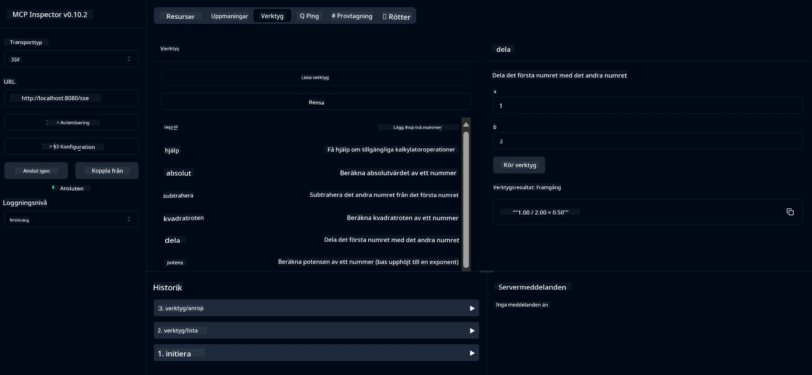

# Grundläggande Kalkylator MCP-tjänst

> [!NOTE]
> Denna exempel använder den äldre HTTP+SSE-transporten och riktar sig mot en SDK som är kompatibel
> med MCP `2025-11-25`. Nya fjärrservrar bör använda `2026-07-28` Streamable
> HTTP-support.

Denna tjänst tillhandahåller grundläggande kalkylatoroperationer via Model Context Protocol (MCP) med Spring Boot och WebFlux-transport. Den är designad som ett enkelt exempel för nybörjare som lär sig om MCP-implementationer.

För mer information, se referensdokumentationen för [MCP Server Boot Starter](https://docs.spring.io/spring-ai/reference/api/mcp/mcp-server-boot-starter-docs.html).

## Översikt

Tjänsten visar:
- Stöd för SSE (Server-Sent Events)
- Automatisk registrering av verktyg med Spring AI:s `@Tool`-annotering
- Grundläggande kalkylatorfunktioner:
  - Addition, subtraktion, multiplikation, division
  - Potensberäkning och kvadratroten
  - Modulus (rest) och absolutvärde
  - Hjälpfunktion för beskrivningar av operationer

## Funktioner

Denna kalkylatortjänst erbjuder följande möjligheter:

1. **Grundläggande aritmetiska operationer**:
   - Addition av två tal
   - Subtraktion av ett tal från ett annat
   - Multiplikation av två tal
   - Division av ett tal med ett annat (med kontroll för noll)

2. **Avancerade operationer**:
   - Potensberäkning (att höja en bas till en exponent)
   - Kvadratrotsberäkning (med kontroll för negativa tal)
   - Modulus (rest) beräkning
   - Absolutvärdesberäkning

3. **Hjälpsystem**:
   - Inbyggd hjälp-funktion som förklarar samtliga tillgängliga operationer

## Använda tjänsten

Tjänsten exponerar följande API-endpoints via MCP-protokollet:

- `add(a, b)`: Lägg ihop två tal
- `subtract(a, b)`: Subtrahera det andra talet från det första
- `multiply(a, b)`: Multiplicera två tal
- `divide(a, b)`: Dividera det första talet med det andra (med nollkontroll)
- `power(base, exponent)`: Beräkna potensen av ett tal
- `squareRoot(number)`: Beräkna kvadratroten (med kontroll för negativa tal)
- `modulus(a, b)`: Beräkna resten vid division
- `absolute(number)`: Beräkna absolutvärdet
- `help()`: Få information om tillgängliga operationer

## Testklient

En enkel testklient är inkluderad i paketet `com.microsoft.mcp.sample.client`. Klassen `SampleCalculatorClient` demonstrerar tillgängliga operationer i kalkylatortjänsten.

## Använda LangChain4j-klienten

Projektet innehåller ett LangChain4j-exempelklient i `com.microsoft.mcp.sample.client.LangChain4jClient` som visar hur man integrerar kalkylatortjänsten med LangChain4j och GitHub-modeller:

### Förutsättningar

1. **GitHub-token-inställning**:
   
   För att använda GitHubs AI-modeller (som phi-4) behöver du en personlig åtkomsttoken för GitHub:

   a. Gå till dina GitHub-kontoinställningar: https://github.com/settings/tokens
   
   b. Klicka på "Generate new token" → "Generate new token (classic)"
   
   c. Ge din token ett beskrivande namn
   
   d. Välj följande behörigheter:
      - `repo` (Full kontroll över privata repositoryn)
      - `read:org` (Läs organisations- och teammedlemskap, läs organisationsprojekt)
      - `gist` (Skapa gists)
      - `user:email` (Åtkomst till användares e-postadresser (endast läs))
   
   e. Klicka på "Generate token" och kopiera din nya token
   
   f. Sätt den som en miljövariabel:
      
      På Windows:
      ```
      set GITHUB_TOKEN=your-github-token
      ```
      
      På macOS/Linux:
      ```bash
      export GITHUB_TOKEN=your-github-token
      ```

   g. För permanent inställning, lägg till den i dina miljövariabler via systeminställningar

2. Lägg till LangChain4j GitHub-dependens i ditt projekt (redan inkluderad i pom.xml):
   ```xml
   <dependency>
       <groupId>dev.langchain4j</groupId>
       <artifactId>langchain4j-github</artifactId>
       <version>${langchain4j.version}</version>
   </dependency>
   ```

3. Säkerställ att kalkylatorsservern körs på `localhost:8080`

### Köra LangChain4j-klienten

Detta exempel demonstrerar:
- Anslutning till kalkylatorns MCP-server via SSE-transport
- Användning av LangChain4j för att skapa en chattbot som utnyttjar kalkylatoroperationer
- Integration med GitHub AI modeller (numera med phi-4 modellen)

Klienten skickar följande exempel på frågor för att visa funktionaliteten:
1. Beräkna summan av två tal
2. Hitta kvadratroten av ett tal
3. Få hjälp-information om tillgängliga kalkylatoroperationer

Kör exemplet och kontrollera konsolutskriften för att se hur AI-modellen använder kalkylatorverktygen för att svara på frågor.

### GitHub-modellkonfiguration

LangChain4j-klienten är konfigurerad att använda GitHubs phi-4 modell med följande inställningar:

```java
ChatLanguageModel model = GitHubChatModel.builder()
    .apiKey(System.getenv("GITHUB_TOKEN"))
    .timeout(Duration.ofSeconds(60))
    .modelName("phi-4")
    .logRequests(true)
    .logResponses(true)
    .build();
```

För att använda andra GitHub-modeller, ändra helt enkelt parametern `modelName` till en annan stödd modell (t.ex. "claude-3-haiku-20240307", "llama-3-70b-8192" osv.).

## Beroenden

Projektet kräver följande huvudsakliga beroenden:

```xml
<!-- For MCP Server -->
<dependency>
    <groupId>org.springframework.ai</groupId>
    <artifactId>spring-ai-starter-mcp-server-webflux</artifactId>
</dependency>

<!-- For LangChain4j integration -->
<dependency>
    <groupId>dev.langchain4j</groupId>
    <artifactId>langchain4j-mcp</artifactId>
    <version>${langchain4j.version}</version>
</dependency>

<!-- For GitHub models support -->
<dependency>
    <groupId>dev.langchain4j</groupId>
    <artifactId>langchain4j-github</artifactId>
    <version>${langchain4j.version}</version>
</dependency>
```

## Bygga projektet

Bygg projektet med Maven:
```bash
./mvnw clean install -DskipTests
```

## Köra servern

### Använda Java

```bash
java -jar target/calculator-server-0.0.1-SNAPSHOT.jar
```

### Använda MCP Inspector

MCP Inspector är ett användbart verktyg för att interagera med MCP-tjänster. För att använda det med denna kalkylatortjänst:

1. **Installera och kör MCP Inspector** i ett nytt terminalfönster:
   ```bash
   npx @modelcontextprotocol/inspector
   ```

2. **Öppna webgränssnittet** genom att klicka på URL:en som visas av appen (vanligtvis http://localhost:6274)

3. **Konfigurera anslutningen**:
   - Ställ in transporttypen till "SSE"
   - Ange URL till din körande servers SSE-endpoint: `http://localhost:8080/sse`
   - Klicka på "Connect"

4. **Använd verktygen**:
   - Klicka på "List Tools" för att se tillgängliga kalkylatoroperationer
   - Välj ett verktyg och klicka på "Run Tool" för att köra en operation



### Använda Docker

Projektet inkluderar en Dockerfile för containerbaserad distribution:

1. **Bygg Docker-avbildningen**:
   ```bash
   docker build -t calculator-mcp-service .
   ```

2. **Kör Docker-containern**:
   ```bash
   docker run -p 8080:8080 calculator-mcp-service
   ```

Detta kommer att:
- Bygga en multi-stage Docker-avbildning med Maven 3.9.9 och Eclipse Temurin 24 JDK
- Skapa en optimerad container-avbildning
- Exponera tjänsten på port 8080
- Starta MCP-kalkylatortjänsten inne i containern

Du kan nå tjänsten på `http://localhost:8080` när containern körs.

## Felsökning

### Vanliga problem med GitHub-token

1. **Problem med Tokentillstånd**: Om du får ett 403 Forbidden-fel, kontrollera att din token har rätt behörigheter enligt förutsättningarna.

2. **Token Ej Hittad**: Om du får ett "No API key found" fel, säkerställ att miljövariabeln GITHUB_TOKEN är korrekt satt.

3. **Gräns för Anrop (Rate Limiting)**: GitHub API har anropsgränser. Om du stöter på ett gränsfel (statuskod 429), vänta några minuter innan du försöker igen.

4. **Token Utgångsdatum**: GitHub-tokens kan löpa ut. Om du får autentiseringsfel efter en tid, generera en ny token och uppdatera din miljövariabel.

Om du behöver ytterligare hjälp, se [LangChain4j dokumentation](https://github.com/langchain4j/langchain4j) eller [GitHub API dokumentation](https://docs.github.com/en/rest).

---

<!-- CO-OP TRANSLATOR DISCLAIMER START -->
**Ansvarsfriskrivning**:
Detta dokument har översatts med hjälp av AI-översättningstjänsten [Co-op Translator](https://github.com/Azure/co-op-translator). Även om vi strävar efter noggrannhet, var vänlig notera att automatiska översättningar kan innehålla fel eller brister. Det ursprungliga dokumentet på dess modersmål bör betraktas som den auktoritativa källan. För kritisk information rekommenderas professionell mänsklig översättning. Vi ansvarar inte för några missförstånd eller feltolkningar som uppstår till följd av användningen av denna översättning.
<!-- CO-OP TRANSLATOR DISCLAIMER END -->