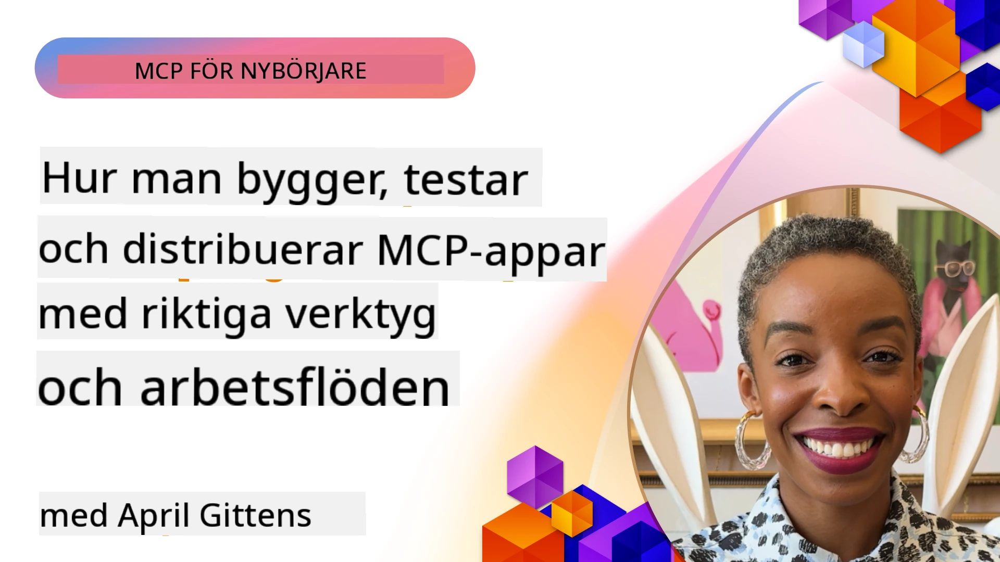
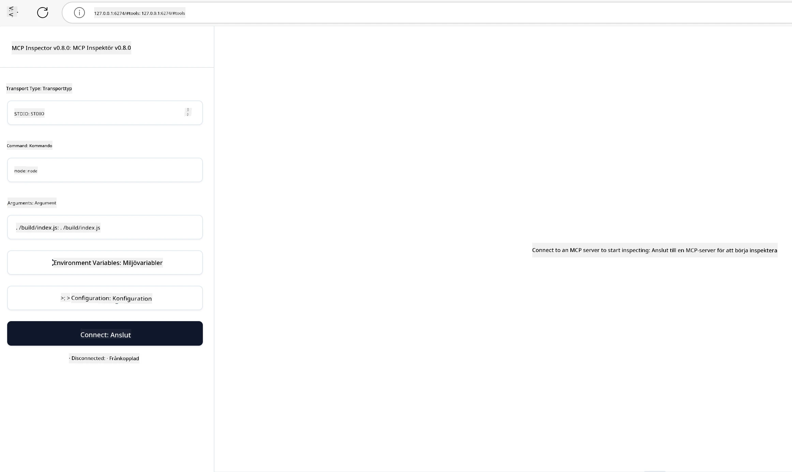

# Praktisk implementering

[](https://youtu.be/vCN9-mKBDfQ)

_(Klicka på bilden ovan för att visa videon för denna lektion)_

Praktisk implementering är där kraften i Model Context Protocol (MCP) blir påtaglig. Medan det är viktigt att förstå teorin och arkitekturen bakom MCP, framträder det verkliga värdet när du tillämpar dessa koncept för att bygga, testa och distribuera lösningar som löser verkliga problem. Detta kapitel överbryggar klyftan mellan konceptuell kunskap och praktisk utveckling och vägleder dig genom processen att ge liv åt MCP-baserade applikationer.

Oavsett om du utvecklar intelligenta assistenter, integrerar AI i affärsarbetsflöden eller bygger anpassade verktyg för databehandling, erbjuder MCP en flexibel grund. Dess språkoberoende design och officiella SDK:er för populära programmeringsspråk gör det tillgängligt för en bred utvecklarkrets. Genom att utnyttja dessa SDK:er kan du snabbt prototypa, iterera och skala dina lösningar över olika plattformar och miljöer.

I de följande avsnitten hittar du praktiska exempel, provkod och distribueringsstrategier som visar hur man implementerar MCP i C#, Java med Spring, TypeScript, JavaScript och Python. Du kommer också att lära dig hur du felsöker och testar dina MCP-servrar, hanterar API:er och distribuerar lösningar till molnet med Azure. Dessa praktiska resurser är utformade för att påskynda din inlärning och hjälpa dig att tryggt bygga robusta, produktionsklara MCP-applikationer.

## Översikt

Denna lektion fokuserar på praktiska aspekter av MCP-implementering över flera programmeringsspråk. Vi kommer att utforska hur man använder MCP SDK:er i C#, Java med Spring, TypeScript, JavaScript och Python för att bygga robusta applikationer, felsöka och testa MCP-servrar samt skapa återanvändbara resurser, prompts och verktyg.

## Lerningsmål

I slutet av denna lektion ska du kunna:

- Implementera MCP-lösningar med officiella SDK:er i olika programmeringsspråk
- Felsöka och testa MCP-servrar systematiskt
- Skapa och använda serverfunktioner (Resources, Prompts och Tools)
- Designa effektiva MCP-arbetsflöden för komplexa uppgifter
- Optimera MCP-implementeringar för prestanda och tillförlitlighet

## Officiella SDK-resurser

Model Context Protocol erbjuder officiella SDK:er för flera språk (i linje med [MCP Specification 2025-11-25](https://spec.modelcontextprotocol.io/specification/2025-11-25/)):

- [C# SDK](https://github.com/modelcontextprotocol/csharp-sdk)
- [Java med Spring SDK](https://github.com/modelcontextprotocol/java-sdk) **Obs:** kräver beroende på [Project Reactor](https://projectreactor.io). (Se [diskussionsfråga 246](https://github.com/orgs/modelcontextprotocol/discussions/246).)
- [TypeScript SDK](https://github.com/modelcontextprotocol/typescript-sdk)
- [Python SDK](https://github.com/modelcontextprotocol/python-sdk)
- [Kotlin SDK](https://github.com/modelcontextprotocol/kotlin-sdk)
- [Go SDK](https://github.com/modelcontextprotocol/go-sdk)

## Arbeta med MCP SDK:er

Detta avsnitt erbjuder praktiska exempel på att implementera MCP över flera programmeringsspråk. Du hittar exempel kod i katalogen `samples` organiserade efter språk.

### Tillgängliga exempel

Förrådet innehåller [exempelimplementationer](../../../04-PracticalImplementation/samples) i följande språk:

- [C#](./samples/csharp/README.md)
- [Java med Spring](./samples/java/containerapp/README.md)
- [TypeScript](./samples/typescript/README.md)
- [JavaScript](./samples/javascript/README.md)
- [Python](./samples/python/README.md)

Varje exempel demonstrerar viktiga MCP-koncept och implementationsmönster för just det språket och ekosystemet.

### Praktiska guider

Ytterligare guider för praktisk MCP-implementering:

- [Paginering och stora resultatuppsättningar](./pagination/README.md) – Hantera kursorbunden paginering för verktyg, resurser och stora datamängder

## Kärnserverfunktioner

MCP-servrar kan implementera vilken kombination som helst av dessa funktioner:

### Resurser

Resurser tillhandahåller kontext och data för användaren eller AI-modellen att använda:

- Dokumentarkiv
- Kunskapsbaser
- Strukturerade datakällor
- Filsystem

### Prompts

Prompter är mallade meddelanden och arbetsflöden för användare:

- Fördefinierade konversationsmallar
- Guidad interaktionsmönster
- Specialiserade dialogstrukturer

### Verktyg

Verktyg är funktioner för AI-modellen att utföra:

- Databehandlingsverktyg
- Externa API-integrationer
- Beräkningsfunktioner
- Söktjänster

## Exempelimplementeringar: C# Implementation

Den officiella C# SDK-förrådet innehåller flera exempelimplementeringar som visar olika aspekter av MCP:

- **Grundläggande MCP-klient**: Enkelt exempel som visar hur man skapar en MCP-klient och anropar verktyg
- **Grundläggande MCP-server**: Minimal serverimplementation med grundläggande verktygsregistrering
- **Avancerad MCP-server**: Fullfunktionell server med verktygsregistrering, autentisering och felhantering
- **ASP.NET-integration**: Exempel som visar integration med ASP.NET Core
- **Verktygsimplementeringsmönster**: Olika mönster för att implementera verktyg med olika komplexitetsnivåer

MCP C# SDK är i förhandsvisning och API:erna kan komma att ändras. Vi kommer att uppdatera denna blogg kontinuerligt i takt med att SDK:n utvecklas.

### Nyckelfunktioner

- [C# MCP Nuget ModelContextProtocol](https://www.nuget.org/packages/ModelContextProtocol)
- Skapa din [första MCP-server](https://devblogs.microsoft.com/dotnet/build-a-model-context-protocol-mcp-server-in-csharp/).

För kompletta C# exempel, besök det [officiella C# SDK-exempelförrådet](https://github.com/modelcontextprotocol/csharp-sdk)

## Exempelimplementation: Java med Spring

Java med Spring SDK erbjuder robusta MCP-implementeringsalternativ med företagsklassfunktioner.

### Nyckelfunktioner

- Integration med Spring Framework
- Stark typkontroll
- Stöd för reaktiv programmering
- Omfattande felhantering

För ett komplett exempel på Java med Spring-implementation, se [Java med Spring-exempel](samples/java/containerapp/README.md) i exempel-katalogen.

## Exempelimplementation: JavaScript

JavaScript SDK erbjuder en lättviktig och flexibel metod för MCP-implementation.

### Nyckelfunktioner

- Stöd för Node.js och webbläsare
- Promise-baserat API
- Enkel integration med Express och andra ramverk
- WebSocket-stöd för streaming

För ett komplett JavaScript-implementeringsexempel, se [JavaScript-exempel](samples/javascript/README.md) i exempel-katalogen.

## Exempelimplementation: Python

Python SDK erbjuder en pythonisk metod för MCP-implementation med utmärkta ML-ramverksintegrationer.

### Nyckelfunktioner

- Async/await-stöd med asyncio
- FastAPI-integration``
- Enkel verktygsregistrering
- Naturlig integration med populära ML-bibliotek

För ett komplett Python-implementeringsexempel, se [Python-exempel](samples/python/README.md) i exempel-katalogen.

## API-hantering

Azure API Management är en utmärkt lösning för hur vi kan säkra MCP-servrar. Idén är att placera en Azure API Management-instans framför din MCP-server och låta den hantera funktioner som du sannolikt vill ha, såsom:

- takbegränsning
- tokenhantering
- övervakning
- lastbalansering
- säkerhet

### Azure-exempel

Här är ett Azure-exempel som gör just detta, dvs [skapar en MCP-server och säkrar den med Azure API Management](https://github.com/Azure-Samples/remote-mcp-apim-functions-python).

Se hur auktoriseringsflödet sker i bilden nedan:


I den föregående bilden sker följande:

- Autentisering/a auktorisation sker via Microsoft Entra.
- Azure API Management fungerar som en gateway och använder policies för att leda och hantera trafik.
- Azure Monitor loggar alla förfrågningar för vidare analys.

#### Auktoriseringsflöde

Låt oss titta närmare på auktoriseringsflödet:


#### MCP-auktoriseringsspecifikation

Lär dig mer om [MCP Authorization-specifikationen](https://spec.modelcontextprotocol.io/specification/2025-11-25/basic/authorization/)

## Distribuera fjärr-MCP-server till Azure

Låt oss se om vi kan distribuera exemplet vi nämnde tidigare:

1. Klona repot

    ```bash
    git clone https://github.com/Azure-Samples/remote-mcp-apim-functions-python.git
    cd remote-mcp-apim-functions-python
    ```

1. Registrera resursleverantören `Microsoft.App`.

   - Om du använder Azure CLI, kör `az provider register --namespace Microsoft.App --wait`.
   - Om du använder Azure PowerShell, kör `Register-AzResourceProvider -ProviderNamespace Microsoft.App`. Kör sedan `(Get-AzResourceProvider -ProviderNamespace Microsoft.App).RegistrationState` efter en stund för att kontrollera om registreringen är klar.

1. Kör detta [azd](https://aka.ms/azd)-kommando för att provisionera API Management-tjänsten, funktionappen (med kod) och alla andra nödvändiga Azure-resurser

    ```shell
    azd up
    ```

    Det här kommandot ska distribuera alla molnresurser på Azure

### Testa din server med MCP Inspector

1. I ett **nytt terminalfönster**, installera och kör MCP Inspector

    ```shell
    npx @modelcontextprotocol/inspector
    ```

    Du bör se ett gränssnitt som liknar:

    

1. CTRL-klicka för att ladda MCP Inspector web app från URL:en som visas av appen (t.ex. [http://127.0.0.1:6274/#resources](http://127.0.0.1:6274/#resources))
1. Ställ in transporttypen till `SSE`
1. Ange URL:en till din körande API Management SSE-endpoint som visas efter `azd up` och **Connect**:

    ```shell
    https://<apim-servicename-from-azd-output>.azure-api.net/mcp/sse
    ```

1. **Lista verktyg**. Klicka på ett verktyg och **Kör verktyg**.

Om alla steg fungerade bör du nu vara ansluten till MCP-servern och ha kunnat anropa ett verktyg.

## MCP-servrar för Azure

[Remote-mcp-functions](https://github.com/Azure-Samples/remote-mcp-functions-dotnet): Detta set med förråd är en snabbstartsmall för att bygga och distribuera anpassade fjärr-MCP (Model Context Protocol) servrar med Azure Functions i Python, C# .NET eller Node/TypeScript.

Exemplen erbjuder en komplett lösning som tillåter utvecklare att:

- Bygga och köra lokalt: Utveckla och felsöka en MCP-server på en lokal maskin
- Distribuera till Azure: Enkel molndistribution med ett enkelt azd up-kommando
- Ansluta från klienter: Koppla upp mot MCP-servern från olika klienter inklusive VS Codes Copilot agent mode och MCP Inspector-verktyget

### Nyckelfunktioner

- Säkerhet från grunden: MCP-servern säkras med nycklar och HTTPS
- Autentiseringsalternativ: Stödjer OAuth med inbyggd auth och/eller API Management
- Nätverksisolering: Möjliggör nätverksisolering med Azure Virtual Networks (VNET)
- Serverlös arkitektur: Använder Azure Functions för skalbar, händelsedriven exekvering
- Lokal utveckling: Omfattande stöd för lokal utveckling och felsökning
- Enkel distribution: Strömlinjeformat distributionsflöde till Azure

Förrådet inkluderar alla nödvändiga konfigurationsfiler, källkod och infrastrukturbeskrivningar för att snabbt komma igång med en produktionsklar MCP-serverimplementation.

- [Azure Remote MCP Functions Python](https://github.com/Azure-Samples/remote-mcp-functions-python) - Exempel på MCP-implementation med Azure Functions i Python

- [Azure Remote MCP Functions .NET](https://github.com/Azure-Samples/remote-mcp-functions-dotnet) - Exempel på MCP-implementation med Azure Functions i C# .NET

- [Azure Remote MCP Functions Node/Typescript](https://github.com/Azure-Samples/remote-mcp-functions-typescript) - Exempel på MCP-implementation med Azure Functions i Node/TypeScript.

## Viktiga slutsatser

- MCP SDK:er erbjuder språk-specifika verktyg för att implementera robusta MCP-lösningar
- Felsöknings- och testprocessen är kritisk för tillförlitliga MCP-applikationer
- Återanvändbara promptmallar möjliggör konsekventa AI-interaktioner
- Väl utformade arbetsflöden kan orkestrera komplexa uppgifter med flera verktyg
- Implementering av MCP-lösningar kräver hänsyn till säkerhet, prestanda och felhantering

## Övning

Designa ett praktiskt MCP-arbetsflöde som adressserar ett verkligt problem inom ditt område:

1. Identifiera 3-4 verktyg som skulle vara användbara för att lösa detta problem
2. Skapa ett arbetsflödesdiagram som visar hur dessa verktyg samverkar
3. Implementera en grundläggande version av ett av verktygen med det språk du föredrar
4. Skapa en promptmall som hjälper modellen att effektivt använda ditt verktyg

## Ytterligare resurser

---

## Vad händer härnäst

Nästa: [Avancerade ämnen](../05-AdvancedTopics/README.md)

---

<!-- CO-OP TRANSLATOR DISCLAIMER START -->
**Friskrivning**:
Detta dokument har översatts med hjälp av AI-översättningstjänsten [Co-op Translator](https://github.com/Azure/co-op-translator). Även om vi strävar efter noggrannhet, vänligen notera att automatiska översättningar kan innehålla fel eller brister. Det ursprungliga dokumentet på dess modersmål ska anses vara den auktoritativa källan. För kritisk information rekommenderas professionell mänsklig översättning. Vi ansvarar inte för några missförstånd eller feltolkningar som uppstår från användningen av denna översättning.
<!-- CO-OP TRANSLATOR DISCLAIMER END -->