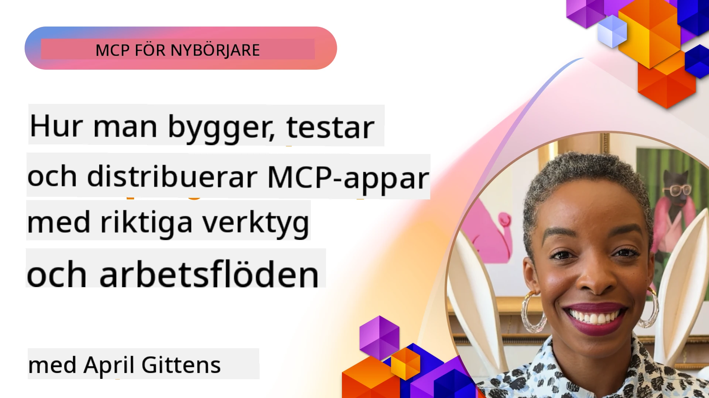
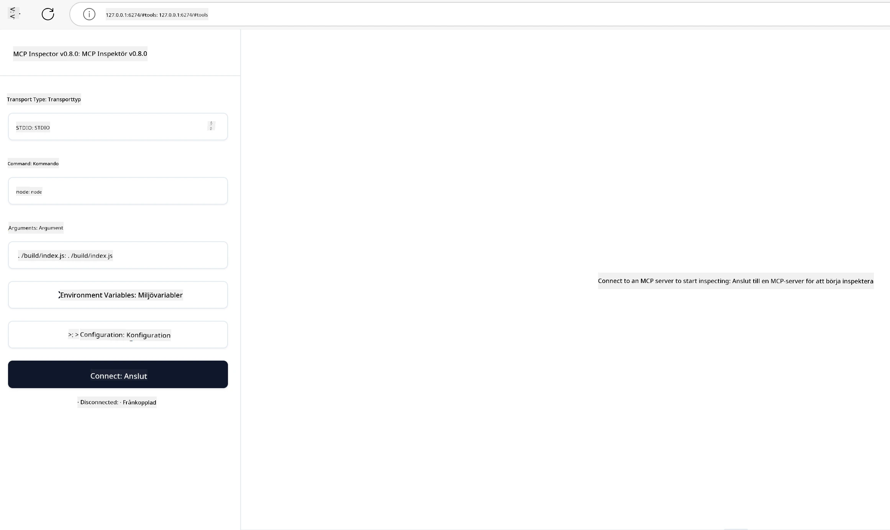

# Praktisk Implementering

[](https://youtu.be/vCN9-mKBDfQ)

_(Klicka på bilden ovan för att se videon av denna lektion)_

Praktisk implementering är där kraften i Model Context Protocol (MCP) blir påtaglig. Även om det är viktigt att förstå teorin och arkitekturen bakom MCP, uppstår det verkliga värdet när du tillämpar dessa koncept för att bygga, testa och distribuera lösningar som löser verkliga problem. Detta kapitel överbryggar gapet mellan konceptuell kunskap och praktisk utveckling, och vägleder dig genom processen att ge liv åt MCP-baserade applikationer.

Oavsett om du utvecklar intelligenta assistenter, integrerar AI i affärsarbetsflöden eller bygger specialanpassade verktyg för databehandling, erbjuder MCP en flexibel grund. Dess språkoberoende design och officiella SDK:er för populära programmeringsspråk gör den tillgänglig för en bred utvecklarbas. Genom att använda dessa SDK:er kan du snabbt skapa prototyper, iterera och skala dina lösningar över olika plattformar och miljöer.

I följande avsnitt hittar du praktiska exempel, kodexempel och distributionsstrategier som visar hur man implementerar MCP i C#, Java med Spring, TypeScript, JavaScript och Python. Du lär dig också hur du felsöker och testar dina MCP-servrar, hanterar API:er och distribuerar lösningar till molnet med Azure. Dessa praktiska resurser är utformade för att påskynda ditt lärande och hjälpa dig att tryggt bygga robusta, produktionsfärdiga MCP-applikationer.

## Översikt

Den här lektionen fokuserar på praktiska aspekter av MCP-implementering i flera programmeringsspråk. Vi utforskar hur man använder MCP SDK:er i C#, Java med Spring, TypeScript, JavaScript och Python för att bygga robusta applikationer, felsöka och testa MCP-servrar, samt skapa återanvändbara resurser, prompts och verktyg.

## Lärandemål

I slutet av denna lektion kommer du att kunna:

- Implementera MCP-lösningar med officiella SDK:er i olika programmeringsspråk
- Felsöka och testa MCP-servrar systematiskt
- Skapa och använda serverfunktioner (Resurser, Prompts och Verktyg)
- Designa effektiva MCP-arbetsflöden för komplexa uppgifter
- Optimera MCP-implementeringar för prestanda och pålitlighet

## Officiella SDK-resurser

Model Context Protocol erbjuder officiella SDK:er för flera språk. SDK-
stöd för MCP `2026-07-28` lanseras oberoende, så kontrollera varje SDK:s
versionsanteckningar och exempelpakets version innan du antar protokoll-
kompatibilitet. Se den [officiella SDK-listan](https://modelcontextprotocol.io/docs/sdk):

- [C# SDK](https://github.com/modelcontextprotocol/csharp-sdk)
- [Java med Spring SDK](https://github.com/modelcontextprotocol/java-sdk) **Notera:** kräver beroende på [Project Reactor](https://projectreactor.io). (Se [diskussionsfråga 246](https://github.com/orgs/modelcontextprotocol/discussions/246).)
- [TypeScript SDK](https://github.com/modelcontextprotocol/typescript-sdk)
- [Python SDK](https://github.com/modelcontextprotocol/python-sdk)
- [Kotlin SDK](https://github.com/modelcontextprotocol/kotlin-sdk)
- [Go SDK](https://github.com/modelcontextprotocol/go-sdk)

## Arbeta med MCP SDK:er

Detta avsnitt ger praktiska exempel på att implementera MCP i flera programmeringsspråk. Du kan hitta exempel på kod i katalogen `samples` organiserad efter språk.

### Tillgängliga exempel

Arkivet innehåller [exempelimplementationer](../../../04-PracticalImplementation/samples) i följande språk:

- [C#](./samples/csharp/README.md)
- [Java med Spring](./samples/java/containerapp/README.md)
- [TypeScript](./samples/typescript/README.md)
- [JavaScript](./samples/javascript/README.md)
- [Python](./samples/python/README.md)

Varje exempel visar viktiga MCP-koncept och implementationsmönster för det specifika språket och ekosystemet.

### Praktiska guider

Ytterligare guider för praktisk MCP-implementering:

- [Sidindelning och stora resultatmängder](./pagination/README.md) - Hantera cursor-baserad sidindelning för verktyg, resurser och stora dataset

## Kärnfunktioner för servern

MCP-servrar kan implementera vilken kombination som helst av dessa funktioner:

### Resurser

Resurser tillhandahåller kontext och data för användaren eller AI-modellen att använda:

- Dokumentarkiv
- Kunskapsbaser
- Strukturerade datakällor
- Filsystem

### Prompts

Prompts är mallade meddelanden och arbetsflöden för användare:

- Fördefinierade konversationsmallar
- Guidad interaktionsmönster
- Specialiserade dialogstrukturer

### Verktyg

Verktyg är funktioner för AI-modellen att köra:

- Databehandlingsverktyg
- Externa API-integrationer
- Beräkningskapacitet
- Sökningsfunktionalitet

## Exempelimplementationer: C# Implementation

Det officiella C# SDK-arkivet innehåller flera exempelimplementationer som visar olika aspekter av MCP:

- **Grundläggande MCP-klient**: Enkelt exempel som visar hur man skapar en MCP-klient och anropar verktyg
- **Grundläggande MCP-server**: Minimal serverimplementation med grundläggande verktygsregistrering
- **Avancerad MCP-server**: Fullständig server med verktygsregistrering, autentisering och felhantering
- **ASP.NET-integration**: Exempel som visar integration med ASP.NET Core
- **Verktygsimplementeringsmönster**: Olika mönster för att implementera verktyg med olika komplexitetsnivåer

MCP C# SDK är i förhandsversion och API:er kan komma att ändras. Vi kommer kontinuerligt att uppdatera denna blogg i takt med att SDK utvecklas.

### Nyckelfunktioner

- [C# MCP Nuget ModelContextProtocol](https://www.nuget.org/packages/ModelContextProtocol)
- Bygg din [första MCP-server](https://devblogs.microsoft.com/dotnet/build-a-model-context-protocol-mcp-server-in-csharp/).

För kompletta C# implementations-exempel, besök [officiella C# SDK-exemplearkivet](https://github.com/modelcontextprotocol/csharp-sdk)

## Exempelimplementation: Java med Spring Implementation

Java med Spring SDK erbjuder robusta MCP-implementeringsmöjligheter med företagsklassfunktioner.

### Nyckelfunktioner

- Integration med Spring Framework
- Stark typkontroll
- Support för reaktiv programmering
- Omfattande felhantering

För ett komplett exempel på Java med Spring-implementation, se [Java med Spring-exempel](samples/java/containerapp/README.md) i examples-katalogen.

## Exempelimplementation: JavaScript Implementation

JavaScript SDK ger en lättviktig och flexibel metod för MCP-implementation.

### Nyckelfunktioner

- Stöd för Node.js och webbläsare
- Promise-baserad API
- Enkel integration med Express och andra ramverk
- WebSocket-stöd för streaming

För ett komplett JavaScript-exempel, se [JavaScript-exempel](samples/javascript/README.md) i examples-katalogen.

## Exempelimplementation: Python Implementation

Python SDK erbjuder ett pythoniskt sätt att implementera MCP med utmärkta ML-ramverksintegrationer.

### Nyckelfunktioner

- Async/await-stöd med asyncio
- FastAPI-integration``
- Enkel verktygsregistrering
- Inbyggd integration med populära ML-bibliotek

För ett komplett Python-exempel, se [Python-exempel](samples/python/README.md) i examples-katalogen.

## API-hantering

Azure API Management är ett utmärkt svar på hur vi kan skydda MCP-servrar. Idén är att placera en Azure API Management-instans framför din MCP-server och låta den hantera funktioner du sannolikt kommer att behöva såsom:

- begränsning av anropstakt
- tokenhantering
- övervakning
- lastbalansering
- säkerhet

### Azure-exempel

Här är ett Azure-exempel som gör just detta, det vill säga [skapar en MCP-server och skyddar den med Azure API Management](https://github.com/Azure-Samples/remote-mcp-apim-functions-python).

Se hur auktoriseringsflödet sker i bilden nedan:


I bilden ovan sker följande:

- Autentisering/Auktorisering sker med Microsoft Entra.
- Azure API Management fungerar som gateway och använder policies för att dirigera och hantera trafik.
- Azure Monitor loggar alla förfrågningar för vidare analys.

#### Auktoriseringsflöde

Låt oss titta närmare på auktoriseringsflödet:


#### MCP:s auktoriseringsspecifikation

Läs mer om
[MCP Auktoriseringsspecifikation](https://modelcontextprotocol.io/specification/2026-07-28/basic/authorization/).

## Distribuera Remote MCP-server till Azure

Låt oss se om vi kan distribuera exemplet vi nämnde tidigare:

1. Klona repot

    ```bash
    git clone https://github.com/Azure-Samples/remote-mcp-apim-functions-python.git
    cd remote-mcp-apim-functions-python
    ```

1. Registrera resursleverantören `Microsoft.App`.

   - Om du använder Azure CLI, kör `az provider register --namespace Microsoft.App --wait`.
   - Om du använder Azure PowerShell, kör `Register-AzResourceProvider -ProviderNamespace Microsoft.App`. Kontrollera sedan `(Get-AzResourceProvider -ProviderNamespace Microsoft.App).RegistrationState` efter en stund för att se om registreringen är klar.

1. Kör detta kommando [azd](https://aka.ms/azd) för att provisionera API-hanteringstjänsten, funktionsappen (med kod) och alla andra nödvändiga Azure-resurser.

    ```shell
    azd up
    ```

    Detta kommando ska distribuera alla molnresurser på Azure.

### Testa din server med MCP Inspector

1. I ett **nytt terminalfönster**, installera och kör MCP Inspector.

    ```shell
    npx @modelcontextprotocol/inspector
    ```

    Du bör se ett gränssnitt liknande:

    

1. CTRL-klicka för att ladda MCP Inspector webbappen från den URL som appen visar (t.ex. [http://127.0.0.1:6274/#resources](http://127.0.0.1:6274/#resources))
1. Ställ in transporttypen till `SSE`
1. Ange URL till din körande API Management SSE-endpoint som visas efter `azd up` och **anslut**:

    ```shell
    https://<apim-servicename-from-azd-output>.azure-api.net/mcp/sse
    ```

1. **Lista verktyg**. Klicka på ett verktyg och **kör verktyg**.

Om alla steg fungerat borde du nu vara ansluten till MCP-servern och ha kunnat anropa ett verktyg.

## MCP-servrar för Azure

[Remote-mcp-functions](https://github.com/Azure-Samples/remote-mcp-functions-dotnet): Denna uppsättning arkiv är snabbsstarts-mallar för att bygga och distribuera anpassade fjärr-MCP-servrar med hjälp av Azure Functions med Python, C# .NET eller Node/TypeScript.

Exemplen ger en komplett lösning som låter utvecklare:

- Bygga och köra lokalt: Utveckla och felsöka en MCP-server på en lokal maskin
- Distribuera till Azure: Enkel distribution till molnet med ett enkelt kommando `azd up`
- Ansluta från klienter: Anslut till MCP-servern från olika klienter inklusive VS Code:s Copilot agent-läge och MCP Inspector-verktyget

### Nyckelfunktioner

- Säkerhet som grundprincip: MCP-servern säkras med nycklar och HTTPS
- Autentiseringsalternativ: Stöd för OAuth med inbyggd autentisering och/eller API Management
- Nätverksisolering: Möjliggör nätverksisolering med Azure Virtual Networks (VNET)
- Serverlös arkitektur: Utnyttjar Azure Functions för skalbar, händelsestyrd exekvering
- Lokal utveckling: Omfattande stöd för lokal utveckling och felsökning
- Enkel distribution: Strömlinjeformat distributionsflöde till Azure

Arkivet inkluderar alla nödvändiga konfigurationsfiler, källkod och infrastrukturbeskrivningar för att snabbt komma igång med en produktionsfärdig MCP-serverimplementation.

- [Azure Remote MCP Functions Python](https://github.com/Azure-Samples/remote-mcp-functions-python) - Exempelimplementation av MCP med Azure Functions och Python

- [Azure Remote MCP Functions .NET](https://github.com/Azure-Samples/remote-mcp-functions-dotnet) - Exempelimplementation av MCP med Azure Functions och C# .NET

- [Azure Remote MCP Functions Node/Typescript](https://github.com/Azure-Samples/remote-mcp-functions-typescript) - Exempelimplementation av MCP med Azure Functions och Node/TypeScript.

## Viktiga lärdomar

- MCP SDK:er tillhandahåller språk-specifika verktyg för att implementera robusta MCP-lösningar
- Felsöknings- och testprocessen är kritisk för tillförlitliga MCP-applikationer
- Återanvändbara promptmallar möjliggör konsekventa AI-interaktioner
- Välutformade arbetsflöden kan orkestrera komplexa uppgifter med flera verktyg
- Implementering av MCP-lösningar kräver hänsyn till säkerhet, prestanda och felhantering

## Övning

Designa ett praktiskt MCP-arbetsflöde som adresserar ett verkligt problem inom ditt område:

1. Identifiera 3-4 verktyg som skulle vara användbara för att lösa problemet
2. Skapa ett arbetsflödesdiagram som visar hur dessa verktyg samverkar
3. Implementera en grundläggande version av ett av verktygen med ditt föredragna språk
4. Skapa en promptmall som hjälper modellen att effektivt använda ditt verktyg

## Ytterligare resurser

---

## Vad som kommer härnäst

Nästa: [Avancerade ämnen](../05-AdvancedTopics/README.md)

---

<!-- CO-OP TRANSLATOR DISCLAIMER START -->
**Ansvarsfriskrivning**:
Detta dokument har översatts med hjälp av AI-översättningstjänsten [Co-op Translator](https://github.com/Azure/co-op-translator). Även om vi strävar efter noggrannhet, var vänlig notera att automatiska översättningar kan innehålla fel eller brister. Det ursprungliga dokumentet på dess modersmål bör betraktas som den auktoritativa källan. För kritisk information rekommenderas professionell mänsklig översättning. Vi ansvarar inte för några missförstånd eller feltolkningar som uppstår till följd av användningen av denna översättning.
<!-- CO-OP TRANSLATOR DISCLAIMER END -->