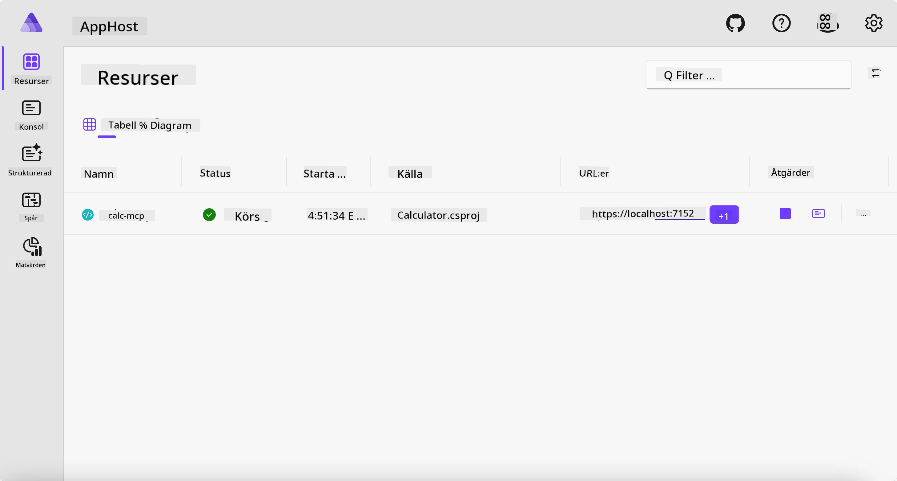
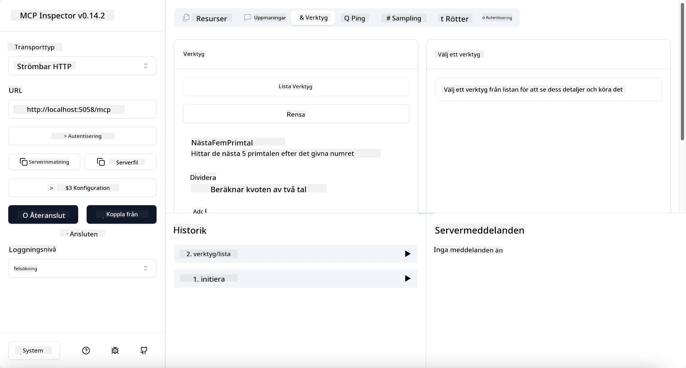
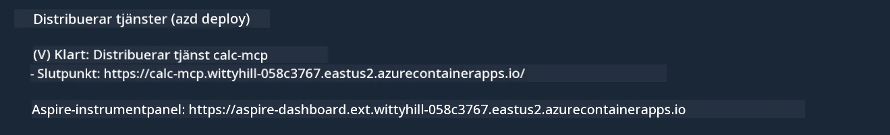

# Exempel

Föregående exempel visar hur man använder ett lokalt .NET-projekt med typen `stdio`. Och hur man kör servern lokalt i en container. Detta är en bra lösning i många situationer. Men det kan vara användbart att ha servern igång på distans, till exempel i en molnmiljö. Här kommer typen `http` in i bilden.

Tittar man på lösningen i mappen `04-PracticalImplementation` kan den se mycket mer komplex ut än den föregående. Men i verkligheten är det inte så. Om du tittar noga på projektet `src/Calculator` kommer du att se att det är mest samma kod som i det tidigare exemplet. Den enda skillnaden är att vi använder ett annat bibliotek `ModelContextProtocol.AspNetCore` för att hantera HTTP-förfrågningar. Och vi ändrar metoden `IsPrime` till att vara privat, bara för att visa att du kan ha privata metoder i din kod. Resten av koden är densamma som innan.

De andra projekten är från [Aspire](https://aspire.dev/get-started/what-is-aspire/). Att ha Aspire i lösningen förbättrar utvecklarens upplevelse under utveckling och testning och hjälper med observabilitet. Det är inte obligatoriskt för att köra servern, men det är god praxis att ha det i din lösning.

## Starta servern lokalt

1. I VS Code (med C# DevKit-tillägget) navigera till katalogen `04-PracticalImplementation/samples/csharp`.
1. Kör följande kommando för att starta servern:

   ```bash
    dotnet watch run --project ./src/AppHost
   ```

1. När en webbläsare öppnar Aspire dashboard, notera `http`-URL:en. Den bör vara något som `http://localhost:5058/`.

   

## Testa Streamable HTTP med MCP Inspector

Om du har Node.js 22.7.5 eller senare kan du använda MCP Inspector för att testa din server.

Starta servern och kör följande kommando i en terminal:

```bash
npx @modelcontextprotocol/inspector http://localhost:5058
```



- Välj `Streamable HTTP` som Transporttyp.
- I Url-fältet, ange URL:en till servern som noterades tidigare, och lägg till `/mcp`. Den bör vara `http` (inte `https`) och se ut ungefär som `http://localhost:5058/mcp`.
- tryck på Connect-knappen.

En trevlig sak med Inspector är att den ger bra insyn i vad som händer.

- Prova att lista de tillgängliga verktygen
- Testa några av dem, det ska fungera precis som tidigare.

## Testa MCP Server med GitHub Copilot Chat i VS Code

För att använda Streamable HTTP transport med GitHub Copilot Chat, ändra konfigurationen av `calc-mcp` servern som skapades tidigare till följande:

```jsonc
// .vscode/mcp.json
{
  "servers": {
    "calc-mcp": {
      "type": "http",
      "url": "http://localhost:5058/mcp"
    }
  }
}
```

Gör några tester:

- Be om "3 primtal efter 6780". Notera hur Copilot använder verktygen `NextFivePrimeNumbers` och returnerar endast de första 3 primtalen.
- Be om "7 primtal efter 111", för att se vad som händer.
- Be om "John har 24 klubbor och vill fördela dem till sina 3 barn. Hur många klubbor får varje barn?", för att se vad som händer.

## Distribuera servern till Azure

Låt oss distribuera servern till Azure så att fler kan använda den.

Från en terminal, navigera till mappen `04-PracticalImplementation/samples/csharp` och kör följande kommando:

```bash
azd up
```

När distributionen är klar ska du se ett meddelande som detta:



Ta URL:en och använd den i MCP Inspector och i GitHub Copilot Chat.

```jsonc
// .vscode/mcp.json
{
  "servers": {
    "calc-mcp": {
      "type": "http",
      "url": "https://calc-mcp.gentleriver-3977fbcf.australiaeast.azurecontainerapps.io/mcp"
    }
  }
}
```

## Vad händer härnäst?

Vi har testat olika transporttyper och testverktyg. Vi har också distribuerat din MCP-server till Azure. Men vad händer om vår server behöver åtkomst till privata resurser? Till exempel en databas eller ett privat API? I nästa kapitel ska vi se hur vi kan förbättra säkerheten för vår server.

---

<!-- CO-OP TRANSLATOR DISCLAIMER START -->
**Ansvarsfriskrivning**:
Detta dokument har översatts med hjälp av AI-översättningstjänsten [Co-op Translator](https://github.com/Azure/co-op-translator). Även om vi strävar efter noggrannhet, var vänlig notera att automatiska översättningar kan innehålla fel eller brister. Det ursprungliga dokumentet på dess modersmål bör betraktas som den auktoritativa källan. För kritisk information rekommenderas professionell mänsklig översättning. Vi ansvarar inte för några missförstånd eller feltolkningar som uppstår till följd av användningen av denna översättning.
<!-- CO-OP TRANSLATOR DISCLAIMER END -->