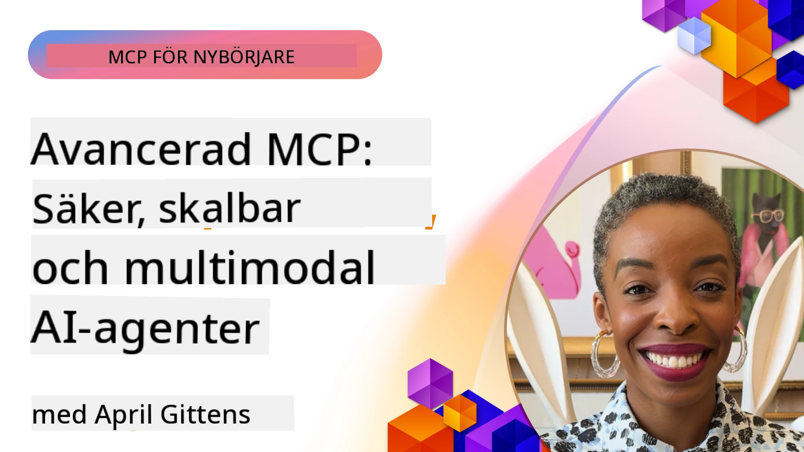

# Avancerade ämnen i MCP

_(Klicka på bilden ovan för att se videon till denna lektion)_

Detta kapitel täcker en serie avancerade ämnen inom implementeringen av Model Context Protocol (MCP), inklusive multimodal integration, skalbarhet, säkerhetsbästa praxis och företagsintegration. Dessa ämnen är avgörande för att bygga robusta och produktionsklara MCP-applikationer som kan möta kraven från moderna AI-system.

## Översikt

Denna lektion utforskar avancerade koncept inom implementeringen av Model Context Protocol med fokus på multimodal integration, skalbarhet, säkerhetsbästa praxis och företagsintegration. Dessa ämnen är viktiga för att bygga MCP-applikationer av produktionsklass som kan hantera komplexa krav i företagsmiljöer.

> **Nuvarande specifikationsanmärkning:** MCP `2026-07-28` avvecklar Roots- och
> Sampling-primitiverna som täcks i lektionerna 5.4 och 5.6. Det flyttar också
> den experimentella Tasks-funktionen som refereras i Protocol Features (5.16) till en
> dedikerad Tasks-extension. Dessa lektioner finns kvar för legacy-
> `2025-11-25`-implementationer och inkluderar migrationsvägledning. Se
> [Vad som ändrats i MCP: Specifikationen 2026-07-28](../01-CoreConcepts/mcp-2026-07-28.md).

## Lärandemål

I slutet av denna lektion kommer du att kunna:

- Implementera multimodala förmågor inom MCP-ramverk
- Designa skalbara MCP-arkitekturer för scenarier med höga krav
- Tillämpa säkerhetsbästa praxis i linje med MCP:s säkerhetsprinciper
- Integrera MCP med företags-AI-system och ramverk
- Optimera prestanda och tillförlitlighet i produktionsmiljöer

## Lektioner och exempelprojekt

| Link | Titel | Beskrivning |
|------|-------|-------------|
| [5.1 Integration med Azure](./mcp-integration/README.md) | Integrera med Azure | Lär dig hur du integrerar din MCP-server på Azure |
| [5.2 Multimodalt exempel](./mcp-multi-modality/README.md) | MCP multimodala exempel | Exempel för ljud, bild och multimodalt svar |
| [5.3 MCP OAuth2-exempel](../../../05-AdvancedTopics/mcp-oauth2-demo) | MCP OAuth2-demo | Minimal Spring Boot-app som visar OAuth2 med MCP, både som auktoriserings- och resursserver. Demonstrerar säker tokenutfärdelse, skyddade slutpunkter, distribuerad på Azure Container Apps och integration med API Management. |
| [5.4 Root Contexts](./mcp-root-contexts/README.md) | Rotkontexter | Lär dig legacy-`2025-11-25` Roots-primitiven och aktuella migrationsalternativ (avvecklade i `2026-07-28`) |
| [5.5 Routing](./mcp-routing/README.md) | Routing | Lär dig olika typer av routing |
| [5.6 Sampling](./mcp-sampling/README.md) | Sampling | Lär dig legacy-`2025-11-25` Sampling-primitiven och aktuella migrationsalternativ (avvecklade i `2026-07-28`) |
| [5.7 Skalning](./mcp-scaling/README.md) | Skalning | Lär dig om skalning |
| [5.8 Säkerhet](./mcp-security/README.md) | Säkerhet | Säkra din MCP-server |
| [5.9 Webb-sökexempel](./web-search-mcp/README.md) | Webb-sök MCP | Python MCP-server och klient som integrerar med SerpAPI för realtidswebb, nyhets-, produkt­sökning och Q&A. Demonstrerar multiverktygs-orkestrering, extern API-integration och robust felhantering. |
| [5.10 Realtidsstreaming](./mcp-realtimestreaming/README.md) | Streaming | Realtidsdataströmning har blivit avgörande i dagens datadrivna värld, där företag och applikationer kräver omedelbar tillgång till information för att fatta snabba beslut.|
| [5.11 Realtidswebbsökning](./mcp-realtimesearch/README.md) | Webb-sökning | Realtidswebbsökning – hur MCP förvandlar realtidswebbsökning genom att tillhandahålla en standardiserad metod för kontexthantering över AI-modeller, sökmotorer och applikationer.| 
| [5.12 Entra ID-autentisering för Model Context Protocol-servrar](./mcp-security-entra/README.md) | Entra ID-autentisering | Microsoft Entra ID erbjuder en robust molnbaserad identitets- och åtkomsthanteringslösning som hjälper till att säkerställa att endast auktoriserade användare och applikationer kan interagera med din MCP-server.|
| [5.13 Microsoft Foundry-agentintegration](./mcp-foundry-agent-integration/README.md) | Microsoft Foundry-integration | Lär dig hur du integrerar Model Context Protocol-servrar med Microsoft Foundry-agenter, vilket möjliggör kraftfull verktygsorkestrering och företags-AI-funktioner med standardiserade anslutningar till externa datakällor.|
| [5.14 Kontextteknik](./mcp-contextengineering/README.md) | Kontextteknik | Den framtida möjligheten för kontexttekniker för MCP-servrar, inklusive kontextoptimering, dynamisk kontexthantering och strategier för effektiv promptteknik inom MCP-ramverk.|
| [5.15 MCP-anpassad transport](./mcp-transport/README.md) | Anpassad transport | Lär dig hur man implementerar anpassade transportmekanismer för specialiserade MCP-kommunikationsscenarier.|
| [5.16 Djupdykning i protokollfunktioner](./mcp-protocol-features/README.md) | Protokollfunktioner | Bemästra avancerade protokollfunktioner inklusive framstegsaviseringar, annulleringsförfrågningar, resursmallar och felhanteringsmönster.|
| [5.17 Adversarial multi-agent resonemang](./mcp-adversarial-agents/README.md) | Adversariella agenter | Använd två agenter med motsatta positioner, som delar en enda MCP-verktygsuppsättning, för att fånga hallucinationer, lyfta fram kantfall och producera bättre kalibrerade resultat genom strukturerad debatt.|

> **Historisk `2025-11-25` anmärkning:** den versionen introducerade experimentella
> Tasks och utökade flera protokollfunktioner. I `2026-07-28` flyttades Tasks till
> en officiell extension och Roots blev avvecklade. Använd inte
> `2025-11-25` funktionsstatus som aktuell vägledning; se
> [2026-07-28 ändringslogg](https://modelcontextprotocol.io/specification/2026-07-28/changelog).

## Ytterligare referenser

För den mest uppdaterade informationen om avancerade MCP-ämnen, se:
- [MCP-dokumentation](https://modelcontextprotocol.io/)
- [MCP-specifikation (2026-07-28)](https://modelcontextprotocol.io/specification/2026-07-28/)
- [GitHub Repository](https://github.com/modelcontextprotocol)
- [OWASP MCP Topp 10](https://microsoft.github.io/mcp-azure-security-guide/mcp/) - Säkerhetsrisker och motåtgärder
- [MCP Security Summit Workshop (Sherpa)](https://azure-samples.github.io/sherpa/) - Praktisk säkerhetsträning

## Viktiga slutsatser

- Multimodala MCP-implementationer utökar AI-förmågor bortom textbehandling
- Skalbarhet är avgörande för företagsdistributioner och kan hanteras genom horisontell och vertikal skalning
- Omfattande säkerhetsåtgärder skyddar data och säkerställer korrekt åtkomstkontroll
- Företagsintegration med plattformar som Azure OpenAI och Microsoft AI Foundry förbättrar MCP-funktioner
- Avancerade MCP-implementationer gynnas av optimerade arkitekturer och noggrann resursförvaltning

## Övning

Designa en MCP-implementation av företagsklass för ett specifikt användningsfall:

1. Identifiera multimodala krav för ditt användningsfall
2. Skissera säkerhetskontroller som behövs för att skydda känslig data
3. Designa en skalbar arkitektur som kan hantera varierande belastning
4. Planera integrationspunkter med företags-AI-system
5. Dokumentera potentiella prestandaflaskhalsar och åtgärdsstrategier

## Ytterligare resurser

- [Azure OpenAI-dokumentation](https://learn.microsoft.com/en-us/azure/ai-services/openai/)
- [Microsoft AI Foundry-dokumentation](https://learn.microsoft.com/en-us/ai-services/)

---

## Vad som kommer härnäst

Utforska lektionerna i denna modul med start från: [5.1 MCP-integration](./mcp-integration/README.md)

När du har slutfört denna modul, fortsätt till: [Modul 6: Community Contributions](../06-CommunityContributions/README.md)

---

<!-- CO-OP TRANSLATOR DISCLAIMER START -->
**Ansvarsfriskrivning**:
Detta dokument har översatts med hjälp av AI-översättningstjänsten [Co-op Translator](https://github.com/Azure/co-op-translator). Även om vi strävar efter noggrannhet, var vänlig notera att automatiska översättningar kan innehålla fel eller brister. Det ursprungliga dokumentet på dess modersmål bör betraktas som den auktoritativa källan. För kritisk information rekommenderas professionell mänsklig översättning. Vi ansvarar inte för några missförstånd eller feltolkningar som uppstår till följd av användningen av denna översättning.
<!-- CO-OP TRANSLATOR DISCLAIMER END -->