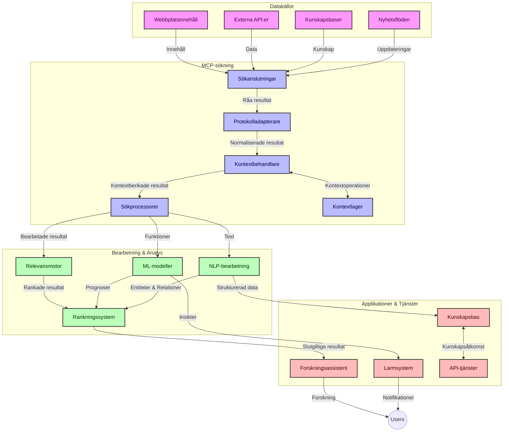
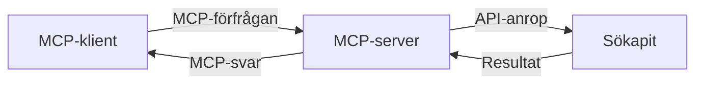
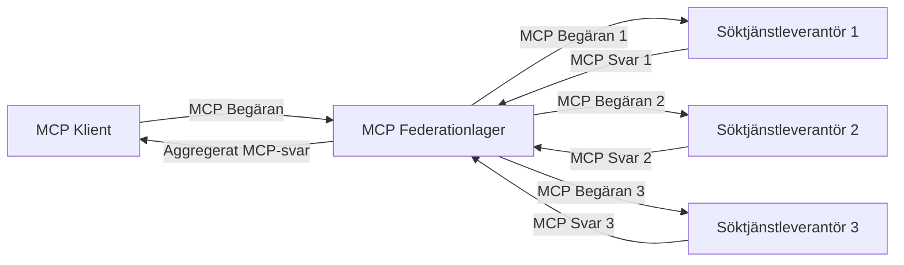
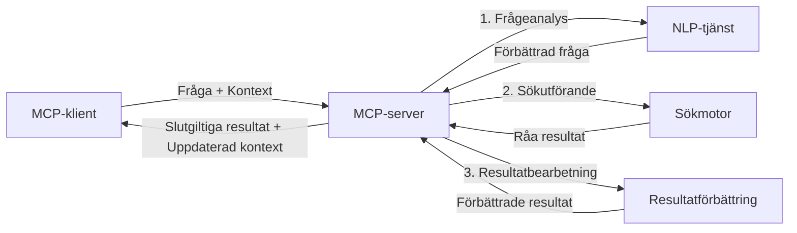

# Model Context Protocol för Realtidssökning på Webben

## Översikt

Realtidssökning på webben har blivit avgörande i dagens informationsdrivna miljö, där applikationer behöver omedelbar tillgång till uppdaterad information över internet för att kunna leverera relevanta och tidsmässigt korrekta svar. Model Context Protocol (MCP) representerar ett betydande framsteg i att optimera dessa realtidssökningsprocesser, förbättra sökeffektivitet, bibehålla kontextuell integritet och höja den övergripande systemprestandan.

Denna modul utforskar hur MCP förändrar realtidssökning på webben genom att erbjuda ett standardiserat tillvägagångssätt för kontexthantering mellan AI-modeller, sökmotorer och applikationer.

### Vad Du Kommer Lära Dig

I denna omfattande guide kommer du att upptäcka:

- Hur MCP skapar en sömlös brygga mellan AI-modeller och realtidssökningskapabiliteter
- Arkitektoniska mönster för implementering av effektiva och skalbara söklösningar med MCP
- Tekniker för att bevara sökkontext över flera frågor och interaktioner
- Praktiska kodimplementationer i Python och JavaScript för olika sökscenarier
- Metoder för att balansera relevans, aktualitet och prestanda i MCP-drivna söksystem

## Introduktion till Realtidssökning på Webben

Realtidssökning på webben är en teknologisk metod som möjliggör kontinuerlig förfrågan, bearbetning och analys av webb-baserad information i takt med att den publiceras eller uppdateras, vilket tillåter system att leverera färsk och relevant information med minimal fördröjning. Till skillnad från traditionella söksystem som arbetar med indexerad data som kan vara timmar eller dagar gammal, hanterar realtidssökning live-data från webben, och ger insikter och information som speglar det aktuella tillståndet för onlineinnehåll.

### Kärnkoncept för Realtidssökning på Webben:

- **Kontinuerlig Frågebehandling**: Sökfrågor bearbetas mot ständigt uppdaterande datakällor
- **Prioritering av Aktualitet**: System är designade för att prioritera färsk information
- **Balans mellan Relevans och Aktualitet**: Bibehålla balans mellan relevans och aktualitet
- **Skalbar Arkitektur**: System måste hantera varierande belastning av förfrågningar och datavolymer
- **Kontextuell Förståelse**: Att bibehålla användarkontext över sökiterationer är avgörande för meningsfulla resultat
- **Dynamisk Omskrivning av Frågor**: Anpassa frågor baserat på kontext och tidigare resultat
- **Integration av Flera Källor**: Kombinera resultat från flera sökleverantörer och webbkällor
- **Semantisk Förståelse**: Bearbeta frågor och innehåll baserat på mening snarare än bara nyckelord
- **Realtidsrankning**: Kontinuerligt justera resultatrankning när ny information blir tillgänglig

### Model Context Protocol och Realtidssökning på Webben

Model Context Protocol (MCP) tar itu med flera kritiska utmaningar i realtidssökningsmiljöer:

1. **Bevarande av Sökkontext**: MCP standardiserar hur kontext bibehålls över distribuerade sökkomponenter, vilket säkerställer att AI-modeller och bearbetningsnoder har tillgång till relevant frågehistorik och användarpreferenser.

2. **Effektiv Frågehantering**: Genom att tillhandahålla strukturerade mekanismer för kontextöverföring minskar MCP overheaden av att upprepa kontext i varje sökiteration.

3. **Interoperabilitet**: MCP skapar ett gemensamt språk för kontextsdelning mellan olika sökteknologier och AI-modeller, vilket möjliggör mer flexibla och utbyggbara arkitekturer.

4. **Sökoptimerad Kontext**: MCP-implementationer kan prioritera vilka kontextelement som är mest relevanta för effektiv sökning, och optimera för både prestanda och noggrannhet.

5. **Adaptiv Sökbehandling**: Med korrekt kontexthantering genom MCP kan söksystem dynamiskt justera bearbetningen baserat på utvecklande användarbehov och informationslandskap.

I moderna applikationer från nyhetsaggregat till forskningsassistenter möjliggör integrationen av MCP med webbsökning mer intelligent, kontextmedveten sökning som kan leverera alltmer relevanta resultat i takt med att användarinteraktioner fortgår.

## Lärandemål

Vid slutet av denna lektion kommer du att kunna:

- Förstå grunderna i realtidssökning på webben och dess utmaningar i moderna applikationer
- Förklara hur Model Context Protocol (MCP) förbättrar realtidssökningskapabiliteter
- Implementera MCP-baserade söklösningar med populära ramverk och API:er
- Designa och distribuera skalbara, högpresterande sökarkitekturer med MCP
- Tillämpa MCP-koncept på olika användningsfall inklusive semantisk sökning, forskningsassistans och AI-förstärkt surfning
- Utvärdera framväxande trender och framtida innovationer inom MCP-baserade sökteknologier
- Utveckla kontextmedvetna söksystem som lär från användarinteraktioner
- Integrera webbsökningskapabiliteter i AI-assistenter med hjälp av standardiserade MCP-protokoll
- Skapa flerstegs sökflöden som successivt förfinar resultat baserat på kontext
- Optimera sökprestanda samtidigt som omfattande kontextmedvetenhet bibehålls

### Definition och Betydelse

Realtidssökning på webben involverar kontinuerlig förfrågan, hämtning och leverans av webbaserad information med minimal fördröjning. Till skillnad från traditionella sökmotorer som periodiskt genomsöker och indexerar webben, syftar realtidssökning till att lyfta fram information när den blir tillgänglig, vilket möjliggör omedelbar tillgång till det mest aktuella innehållet.

Viktiga egenskaper för realtidssökning på webben inkluderar:

- **Färskhet**: Prioritera nyligen publicerat innehåll och uppdateringar
- **Kontinuerlig Bearbetning**: Ständig övervakning efter ny information
- **Frågeanpassning**: Förfina sökfrågor baserat på kontext och feedback
- **Omedelbar Leverans**: Ge sökresultat med minimal fördröjning
- **Kontextbevarande**: Bygga vidare på tidigare frågor för förbättrad relevans

### Utmaningar i Traditionell Webbsökning

Traditionella webbsökningsmetoder stöter på flera begränsningar i realtidsscenarier:

1. **Fragmentering av Kontext**: Svårigheter att bibehålla sökkontext över flera frågor
2. **Informationsfärskhet**: Utmaningar att få tillgång till och prioritera mest aktuell information
3. **Integrationskomplexitet**: Problem med interoperabilitet mellan söksystem och applikationer
4. **Fördröjningsproblem**: Balans mellan omfattande sökning och svarstid
5. **Relevansjustering**: Säkerställa noggrannhet och relevans samtidigt som aktualitet prioriteras

## Förstå Model Context Protocol (MCP) för Sökning

### Vad är MCP i Sökcontext?

Model Context Protocol (MCP) är ett standardiserat kommunikationsprotokoll utformat för att underlätta effektiv interaktion mellan AI-modeller och applikationer. I kontexten av realtidssökning på webben erbjuder MCP en ram för:

- Bevarande av sökkontext genom hela frågesekvensen
- Standardisering av sökfrågor och resultatformat
- Optimering av överföring av sökparametrar och resultat
- Förbättring av kommunikation mellan modell och sökmotor

### Kärnkomponenter och Arkitektur

MCP-arkitektur för realtidssökning på webben består av flera nyckelkomponenter:

1. **Hantera Sökkontext**: Hanterar och bibehåller sökkontext över flera frågor
2. **Sökprocessor**: Bearbetar inkommande sökförfrågningar med kontextmedvetna tekniker
3. **Protokolladapter**: Konverterar mellan olika sök-API:er samtidigt som kontext bevaras
4. **Kontextlagring**: Effektiv lagring och hämtning av sökhistorik och preferenser
5. **Sökkontakter**: Ansluter till olika sökmotorer och web-API:er



### Hur MCP Förbättrar Realtidssökning på Webben

MCP hanterar traditionella utmaningar för webbsökning genom:

- **Kontextuell Kontinuitet**: Bibehålla relationer mellan frågor under hela söksessionen
- **Optimerad Överföring**: Minska redundans i sökparametrar genom intelligent kontexthantering
- **Standardiserade Gränssnitt**: Tillhandahålla konsistenta API:er för sökkomponenter
- **Minskad Latens**: Minimera bearbetningskostnader genom effektiv kontexthantering
- **Förbättrad Relevans**: Höja sökrelevans genom att bevara användarintention över flera frågor

## Integration och Implementering

Realtidssökningssystem kräver noggrann arkitekturdesign och implementering för att bibehålla både prestanda och kontextuell integritet. Model Context Protocol erbjuder ett standardiserat tillvägagångssätt för att integrera AI-modeller och sökteknologier, vilket möjliggör mer sofistikerade, kontextmedvetna sökflöden.

### Översikt av MCP-Integration i Sökararkitekturer

Implementering av MCP i realtidssökningsmiljöer involverar flera viktiga överväganden:

1. **Serialisering av Sökkontext**: MCP erbjuder effektiva mekanismer för att koda kontextuell information inom sökförfrågningar, vilket säkerställer att viktig kontext följer med frågan genom hela bearbetningskedjan. Detta inkluderar standardiserade serialiseringsformat optimerade för sökrelevant metadata.

2. **Stateful Sökbehandling**: MCP möjliggör mer intelligent statefull bearbetning genom att bibehålla en konsekvent kontextrepresentation över sökiterationer. Detta är särskilt värdefullt i flerstegs sökflöden där kontextförfining förbättrar resultaten.

3. **Frågeexpansion och -förfining**: MCP-implementationer i söksystem kan underlätta sofistikerad frågeexpansion och förfining baserat på ackumulerad kontext, vilket tillåter alltmer relevanta resultat i takt med att söksessionen fortskrider.

4. **Resultatcache och Prioritering**: Genom att standardisera hantering av kontext, hjälper MCP till att hantera caching och prioritering av resultat, så att komponenter kan anpassa sig efter den utvecklande sökkontexten.

5. **Sökfederation och Aggregation**: MCP underlättar mer avancerad federation av sökningar över flera backends genom att tillhandahålla strukturerade representationer av sökkontext, vilket möjliggör mer meningsfull aggregering av resultat från olika källor.

Implementeringen av MCP över olika sökteknologier skapar ett enhetligt tillvägagångssätt för kontexthantering, minskar behovet av specialanpassad integrationskod samtidigt som systemets förmåga att bibehålla meningsfull kontext när sökfrågor utvecklas förbättras.

### MCP i Olika Webbsökningsimplementationer

Dessa exempel följer den aktuella MCP-specifikationen som fokuserar på ett JSON-RPC-baserat protokoll med distinkta transportmekanismer. Koden visar hur du kan implementera egna sökintegrationer samtidigt som full kompatibilitet med MCP-protokollet bibehålls.


<details>
<summary>Python-implementation med generisk sök-API</summary>

```python
import asyncio
import json
import aiohttp
from typing import Dict, Any, Optional, List
from contextlib import asynccontextmanager
from collections.abc import AsyncIterator

# Importera standard MCP-bibliotek
from mcp.client.session import ClientSession
from mcp.client.streamable_http import streamablehttp_client
from mcp.types import TextContent, CreateMessageRequestParams, CreateMessageResult
from mcp.server.fastmcp import FastMCP

# Skapa en FastMCP-server för webbsökning
search_server = FastMCP("WebSearch")

# Klass för att hantera webbsökningsoperationer
class WebSearchHandler:
    def __init__(self, api_endpoint: str, api_key: str):
        self.api_endpoint = api_endpoint
        self.api_key = api_key
        self.session = None
        
    async def initialize(self):
        """Initialize the HTTP session"""
        self.session = aiohttp.ClientSession(
            headers={"Authorization": f"Bearer {self.api_key}"}
        )
    
    async def close(self):
        """Close the HTTP session"""
        if self.session:
            await self.session.close()
            
    async def perform_search(self, query: str, max_results: int = 5, 
                           include_domains: List[str] = None, 
                           exclude_domains: List[str] = None,
                           time_period: str = "any") -> Dict[str, Any]:
        """Perform web search using the search API"""
        # Konstruera sökparametrar
        search_params = {
            "q": query,
            "limit": max_results,
            "time": time_period
        }
        
        if include_domains:
            search_params["site"] = ",".join(include_domains)
            
        if exclude_domains:
            search_params["exclude_site"] = ",".join(exclude_domains)
        
        # Utför sökförfrågan
        try:
            async with self.session.get(
                self.api_endpoint,
                params=search_params
            ) as response:
                if response.status != 200:
                    error_text = await response.text()
                    raise Exception(f"Search API error: {response.status} - {error_text}")
                
                search_data = await response.json()
                
                # Omvandla API-specifikt svar till ett standardformat
                results = []
                for item in search_data.get("results", []):
                    results.append({
                        "title": item.get("title", ""),
                        "url": item.get("url", ""),
                        "snippet": item.get("snippet", ""),
                        "date": item.get("published_date", ""),
                        "source": item.get("source", "")
                    })
                
                return {
                    "query": query,
                    "totalResults": len(results),
                    "results": results
                }
        except Exception as e:
            print(f"Search API request error: {e}")
            raise

# Initiera sökhantearen
search_handler = WebSearchHandler(
    api_endpoint="https://api.search-service.example/search",
    api_key="your-api-key-here"
)

# Ställ in livslängd för att hantera sökhantearen
@asyncio.asynccontextmanager
async def app_lifespan(server: FastMCP):
    """Manage application lifecycle"""
    await search_handler.initialize()
    try:
        yield {"search_handler": search_handler}
    finally:
        await search_handler.close()

# Sätt livslängd för servern
search_server = FastMCP("WebSearch", lifespan=app_lifespan)

# Registrera ett webbsökningsverktyg
@search_server.tool()
async def web_search(query: str, max_results: int = 5, 
                   include_domains: List[str] = None,
                   exclude_domains: List[str] = None,
                   time_period: str = "any") -> Dict[str, Any]:
    """
    Search the web for information
    
    Args:
        query: The search query
        max_results: Maximum number of results to return (default: 5)
        include_domains: List of domains to include in search results
        exclude_domains: List of domains to exclude from search results
        time_period: Time period for results ("day", "week", "month", "any")
        
    Returns:
        Dictionary containing search results
    """
    ctx = search_server.get_context()
    search_handler = ctx.request_context.lifespan_context["search_handler"]
    
    results = await search_handler.perform_search(
        query=query,
        max_results=max_results,
        include_domains=include_domains,
        exclude_domains=exclude_domains,
        time_period=time_period
    )
    
    return results

# Exempel på klientanvändning
async def client_example():
    # Anslut till sökservern med Streamable HTTP-transport
    async with streamablehttp_client("http://localhost:8000/mcp") as (read, write, _):
        async with ClientSession(read, write) as session:
            # Initiera anslutningen
            await session.initialize()
            
            # Anropa web_search-verktyget
            search_results = await session.call_tool(
                "web_search", 
                {
                    "query": "latest developments in AI and Model Context Protocol",
                    "max_results": 5,
                    "time_period": "day",
                    "include_domains": ["github.com", "microsoft.com"]
                }
            )
            
            print(f"Search results: {search_results}")

# Exempel på serverkörning
if __name__ == "__main__":
    # Kör servern med Streamable HTTP-transport
    search_server.run(transport="streamable-http")
```
</details> 

<details>
<summary>JavaScript-implementation med webbläsarbaserad sökning</summary>


```javascript
// MCP-serverimplementering för webbsökning
import { McpServer, ResourceTemplate } from '@modelcontextprotocol/sdk/server/mcp.js';
import { StreamableHTTPServerTransport } from '@modelcontextprotocol/sdk/server/streamableHttp.js';
import { z } from 'zod';

// Skapa en MCP-server för webbsökning
const searchServer = new McpServer({
    name: "BrowserSearch",
    description: "A server that provides web search capabilities"
});

// Sökningstjänstklass
class SearchService {
    constructor(searchApiUrl, apiKey) {
        this.searchApiUrl = searchApiUrl;
        this.apiKey = apiKey;
    }

    async performSearch(parameters) {
        const {
            query = '',
            maxResults = 5,
            includeDomains = [],
            excludeDomains = [],
            timePeriod = 'any'
        } = parameters;
        
        // Konstruera sök-URL med parametrar
        const url = new URL(this.searchApiUrl);
        url.searchParams.append('q', query);
        url.searchParams.append('limit', maxResults);
        url.searchParams.append('time', timePeriod);
        
        if (includeDomains.length > 0) {
            url.searchParams.append('site', includeDomains.join(','));
        }
        
        if (excludeDomains.length > 0) {
            url.searchParams.append('exclude_site', excludeDomains.join(','));
        }
        
        try {
            const response = await fetch(url.toString(), {
                method: 'GET',
                headers: {
                    'Authorization': `Bearer ${this.apiKey}`,
                    'Content-Type': 'application/json'
                }
            });
            
            if (!response.ok) {
                const errorText = await response.text();
                throw new Error(`Search API error: ${response.status} - ${errorText}`);
            }
            
            const searchData = await response.json();
            
            // Omvandla API-specifikt svar till ett standardformat
            const results = searchData.results?.map(item => ({
                title: item.title || '',
                url: item.url || '',
                snippet: item.snippet || '',
                date: item.published_date || '',
                source: item.source || ''
            })) || [];
            
            return {
                query,
                totalResults: results.length,
                results
            };
        } catch (error) {
            console.error('Search API request error:', error);
            throw error;
        }
    }
}

// Initiera söktjänsten
const searchService = new SearchService(
    'https://api.search-service.example/search',
    'your-api-key-here'
);

// Ställ in kontextleverantören för servern
searchServer.setContextProvider(() => {
    return {
        searchService
    };
});

// Registrera webbsökningsverktyg
searchServer.tool({
    name: 'web_search',
    description: 'Search the web for information',
    parameters: {
        type: 'object',
        properties: {
            query: {
                type: 'string',
                description: 'The search query'
            },
            maxResults: {
                type: 'integer',
                description: 'Maximum number of results to return',
                default: 5
            },
            includeDomains: {
                type: 'array',
                items: { type: 'string' },
                description: 'List of domains to include in search results'
            },
            excludeDomains: {
                type: 'array',
                items: { type: 'string' },
                description: 'List of domains to exclude from search results'
            },
            timePeriod: {
                type: 'string',
                description: 'Time period for results',
                enum: ['day', 'week', 'month', 'any'],
                default: 'any'
            }
        },
        required: ['query']
    },
    handler: async (params, context) => {
        const { searchService } = context;
        return await searchService.performSearch(params);
    }
});

// Exempel på klientkod för att ansluta till sökservern
import { Client } from '@modelcontextprotocol/sdk/client/index.js';
import { StreamableHTTPClientTransport } from '@modelcontextprotocol/sdk/client/streamableHttp.js';

async function connectToSearchServer() {
    // Anslut till sökservern
    const transport = new StreamableHTTPClientTransport(
        new URL('http://localhost:8000/mcp')
    );
    
    const client = new Client({
        name: 'search-client',
        version: '1.0.0'
    });
    
    await client.connect(transport);
    
    // Kör sökverktyget
    const searchResults = await client.callTool({
        name: 'web_search',
        arguments: {
            query: 'Model Context Protocol implementation examples',
            maxResults: 10,
            timePeriod: 'week',
            includeDomains: ['github.com', 'docs.microsoft.com']
        }
    });
    
    console.log('Search results:', searchResults);
    
    // Rensa upp
    await client.disconnect();
}

// Starta servern
const transport = new StreamableHTTPServerTransport();
await searchServer.connect(transport);
console.log('Search server running at http://localhost:8000/mcp');

// I en separat process eller efter att servern har startat
// connectToSearchServer().catch(console.error);
```
</details> 


## Ansvarsfriskrivning för Kodexempel

> **Viktig Notis**: Kodexemplen nedan visar integrationen av Model Context Protocol (MCP) med webbsökningsfunktionalitet. Även om de följer mönster och strukturer från de officiella MCP-SDK:erna har de förenklats för utbildningsändamål.
> 
> Dessa exempel visar:
> 
> 1. **Python-implementation**: En FastMCP-serverimplementation som tillhandahåller ett webbsökningsverktyg och kopplar till ett externt sök-API. Detta exempel demonstrerar korrekt livscykelhantering, kontexthantering och verktygsimplementering enligt mönstren i den [officiella MCP Python SDK](https://github.com/modelcontextprotocol/python-sdk). Servern använder den rekommenderade Streamable HTTP-transporten som ersatt den äldre SSE-transporten för produktionsdistributioner.
> 
> 2. **JavaScript-implementation**: En TypeScript/JavaScript-implementation som använder FastMCP-mönstret från den [officiella MCP TypeScript SDK](https://github.com/modelcontextprotocol/typescript-sdk) för att skapa en sökserver med korrekta verktygsdefinitioner och klientanslutningar. Den följer de senaste rekommenderade mönstren för sessionshantering och kontextbevarande.
> 
> Dessa exempel skulle kräva ytterligare felhantering, autentisering och specifik API-integrationskod för produktionsbruk. Sök-API-endpoints som visas (`https://api.search-service.example/search`) är platshållare och måste ersättas med faktiska söktjänstendpoints.
> 
> För fullständiga implementeringsdetaljer och de mest uppdaterade metoderna,
> hänvisa till den [officiella MCP-specifikationen](https://modelcontextprotocol.io/specification/2026-07-28/)
> och SDK-dokumentationen.

## Kärnkoncept

### Model Context Protocol (MCP)-ramverket

I sin grund utgör Model Context Protocol ett standardiserat sätt för AI-modeller, applikationer och tjänster att utbyta kontext. I realtidssökning på webben är detta ramverk avgörande för att skapa sammanhängande, flerstegs sökupplevelser. Nyckelkomponenter inkluderar:

1. **Klient-Server-arkitektur**: MCP etablerar en tydlig separation mellan sökklienter (förfrågande) och sökservrar (tillhandahållande), vilket möjliggör flexibla distributionsmodeller.

2. **JSON-RPC-kommunikation**: Protokollet använder JSON-RPC för meddelandeutbyte, vilket gör det kompatibelt med webteknologier och enkelt att implementera över olika plattformar.

3. **Kontexthantering**: MCP definierar strukturerade metoder för att bibehålla, uppdatera och utnyttja sökkontext över flera interaktioner.

4. **Verksdefinitions**: Sökmöjligheter exponeras som standardiserade verktyg med väldefinierade parametrar och returvärden.

5. **Streamingstöd**: Protokollet stödjer strömmande resultat, vilket är nödvändigt för realtidssökning där resultat kan ankomma successivt.

### Mönster för integration av webbsökning

Vid integrering av MCP med webbsökning framträder flera mönster:

#### 1. Direkt Integration med Sökleverantör



I detta mönster gränssnittar MCP-servern direkt med ett eller flera sök-API:er, översätter MCP-förfrågningar till API-specifika anrop och formaterar resultaten som MCP-svar.

#### 2. Federerad Sökning med Kontextbevarande



Detta mönster distribuerar sökfrågor över flera MCP-kompatibla sökleverantörer, var och en potentiellt specialiserad på olika typer av innehåll eller sökkapabiliteter, samtidigt som en enhetlig kontext bibehålls.

#### 3. Kontextförbättrad Söksekvens



I detta mönster delas sökprocessen upp i flera steg där kontext berikas vid varje steg, vilket resulterar i successivt mer relevanta resultat.

### Komponenter i Sökkontext

I MCP-baserad webbsökning innefattar kontext typiskt:

- **Frågehistorik**: Tidigare sökfrågor i sessionen
- **Användarpreferenser**: Språk, region, säkert sökläge
- **Interaktionshistorik**: Vilka resultat som klickats på, tid spenderad på resultat
- **Sökparametrar**: Filter, sorteringsordningar och andra sökmodifierare
- **Domänkunskap**: Ämnesspecifik kontext relevant för sökningen
- **Tidskontext**: Tidsbaserade relevansfaktorer
- **Källpreferenser**: Betrodda eller föredragna informationskällor

## Användningsfall och Applikationer

### Forskning och Informationsinsamling

MCP förbättrar forskningsarbetsflöden genom att:

- Bevara forskningskontext över söksessioner
- Möjliggöra mer sofistikerade och kontextuellt relevanta sökfrågor
- Stödja multifedererad sökning
- Underlätta kunskapsutvinning från sökresultat

### Realtidsnyheter och Trendövervakning

MCP-drivna sökningar erbjuder fördelar för nyhetsövervakning:

- Nära-realtidsupptäckt av framväxande nyhetshändelser
- Kontextuell filtrering av relevant information
- Ämnes- och enhetsspårning över flera källor
- Personliga nyhetsaviseringar baserat på användarkontext

### AI-förstärkt Surfning och Forskning

MCP skapar nya möjligheter för AI-förstärkt surfning:

- Kontextuella sökförslag baserade på aktuell webbläsaraktivitet
- Sömlös integration av webbsökning med LLM-drivna assistenter
- Flerstegs sökförfining med bibehållen kontext
- Förbättrad faktakoll och informationsverifiering

## Framtida Trender och Innovationer

### MCP:s Utveckling inom Webbsökning

Framöver förväntar vi oss att MCP utvecklas för att hantera:


- **Multimodal sökning**: Integrering av text-, bild-, ljud- och videosökning med bevarad kontext  
- **Decentraliserad sökning**: Stöd för distribuerade och federerade sökekosystem  
- **Sökningsintegritet**: Kontextmedvetna integritetsbevarande sökfunktioner  
- **Frågeförståelse**: Djup semantisk analys av naturliga språksökfrågor  

### Potentiella teknologiska framsteg  

Framväxande teknologier som kommer forma framtidens MCP-sökning:  

1. **Neurala sökarkitekturer**: Inbäddningsbaserade söksystem optimerade för MCP  
2. **Personlig sökkontext**: Inlärning av individuella användares sökmönster över tid  
3. **Integrering av kunskapsgrafer**: Kontextuell sökning förbättrad med domänspecifika kunskapsgrafer  
4. **Tvärmodal kontext**: Bibehållande av kontext över olika sökmodaliteter  

## Praktiska övningar  

### Övning 1: Sätta upp en grundläggande MCP-sökningspipeline  

I denna övning kommer du lära dig att:  
- Konfigurera en grundläggande MCP-sökmiljö  
- Implementera kontexthanterare för webbsökning  
- Testa och validera kontextbevarande över sökningens iterationer  

### Övning 2: Bygga en forskningsassistent med MCP-sökning  

Skapa en komplett applikation som:  
- Bearbetar forskningsfrågor på naturligt språk  
- Utför kontextmedvetna webbsökningar  
- Syntetiserar information från flera källor  
- Presenterar organiserade forskningsresultat  

### Övning 3: Implementera sökförbund från flera källor med MCP  

Avancerad övning som täcker:  
- Kontextmedveten frågeutdelning till flera sökmotorer  
- Resultatrankning och aggregering  
- Kontextuell deduplicering av sökresultat  
- Hantering av källspecifik metadata  

## Ytterligare resurser  

- [Model Context Protocol Specification](https://modelcontextprotocol.io/specification/2026-07-28/) - Officiell MCP-specifikation och detaljerad protokollokumentation  
- [Model Context Protocol Documentation](https://modelcontextprotocol.io/) - Detaljerade handledningar och implementationsguider  
- [MCP Python SDK](https://github.com/modelcontextprotocol/python-sdk) - Officiell Python-implementation av MCP-protokollet  
- [MCP TypeScript SDK](https://github.com/modelcontextprotocol/typescript-sdk) - Officiell TypeScript-implementation av MCP-protokollet  
- [MCP Reference Servers](https://github.com/modelcontextprotocol/servers) - Referensimplementationer av MCP-servrar  
- [Bing Web Search API Documentation](https://learn.microsoft.com/en-us/bing/search-apis/bing-web-search/overview) - Microsofts webbsöks-API  
- [Google Custom Search JSON API](https://developers.google.com/custom-search/v1/overview) - Googles programmerbara sökmotor  
- [SerpAPI Documentation](https://serpapi.com/search-api) - API för sökmotorresultatsidor  
- [Meilisearch Documentation](https://www.meilisearch.com/docs) - Öppen källkods-sökmotor  
- [Elasticsearch Documentation](https://www.elastic.co/guide/index.html) - Distribuerad sök- och analyssystem  
- [LangChain Documentation](https://python.langchain.com/docs/get_started/introduction) - Bygga applikationer med stora språkmodeller  

## Inlärningsmål  

Genom att slutföra denna modul kommer du kunna:  

- Förstå grunderna i realtidssökning på webben och dess utmaningar  
- Förklara hur Model Context Protocol (MCP) förbättrar realtidssökningsmöjligheter på webben  
- Implementera MCP-baserade söklösningar med populära ramverk och API:er  
- Designa och distribuera skalbara, högpresterande sökarkitekturer med MCP  
- Tillämpa MCP-koncept på olika användningsområden inklusive semantisk sökning, forskningshjälp och AI-förstärkt surfning  
- Bedöma framväxande trender och framtida innovationer inom MCP-baserad sökteknologi  


### Betroddhet och säkerhetsaspekter  

När du implementerar MCP-baserade webbsöklösningar, kom ihåg dessa viktiga principer från MCP-specifikationen:  

1. **Användarsamtycke och kontroll**: Användare måste uttryckligen samtycka till och förstå all dataåtkomst och alla operationer. Detta är särskilt viktigt för webbsöksimplementationer som kan komma att använda externa datakällor.  

2. **Dataintegritet**: Säkerställ korrekt hantering av sökfrågor och resultat, särskilt när de kan innehålla känslig information. Implementera lämpliga åtkomstkontroller för att skydda användardata.  

3. **Verktygssäkerhet**: Implementera korrekt auktorisering och validering för sökverktyg, eftersom de utgör potentiella säkerhetsrisker genom godtycklig kodkörning. Beskrivningar av verktygsbeteenden ska betraktas som opålitliga om de inte erhållits från en betrodd server.  

4. **Tydlig dokumentation**: Tillhandahåll tydlig dokumentation om kapabiliteter, begränsningar och säkerhetsaspekter för din MCP-baserade sökimplementation, i enlighet med implementeringsriktlinjerna från MCP-specifikationen.  

5. **Robusta samtyckesflöden**: Bygg robusta samtyckes- och auktoriseringsflöden som tydligt förklarar vad varje verktyg gör innan användning godkänns, särskilt för verktyg som interagerar med externa webbresurser.  

För fullständiga detaljer om MCP:s säkerhets- och betroddhetsöverväganden, se  
[officiell dokumentation](https://modelcontextprotocol.io/specification/2026-07-28/basic/security_best_practices).  

## Vad är nästa steg  

- [5.12 Entra ID-autentisering för Model Context Protocol-servrar](../mcp-security-entra/README.md)  

---

<!-- CO-OP TRANSLATOR DISCLAIMER START -->
**Ansvarsfriskrivning**:
Detta dokument har översatts med hjälp av AI-översättningstjänsten [Co-op Translator](https://github.com/Azure/co-op-translator). Även om vi strävar efter noggrannhet, var vänlig notera att automatiska översättningar kan innehålla fel eller brister. Det ursprungliga dokumentet på dess modersmål bör betraktas som den auktoritativa källan. För kritisk information rekommenderas professionell mänsklig översättning. Vi ansvarar inte för några missförstånd eller feltolkningar som uppstår till följd av användningen av denna översättning.
<!-- CO-OP TRANSLATOR DISCLAIMER END -->