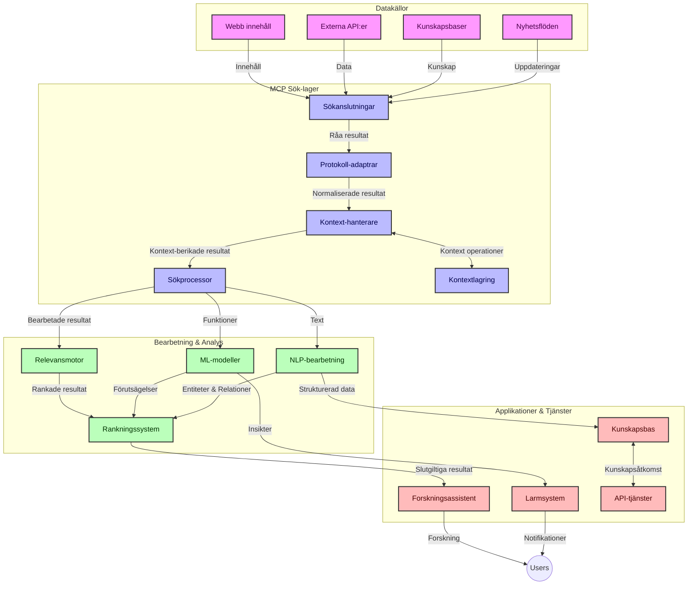
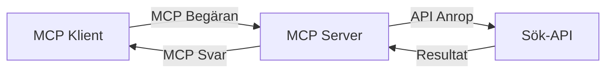
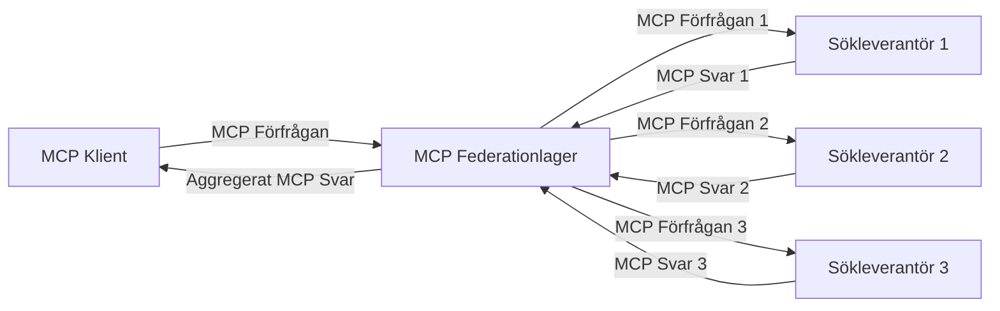
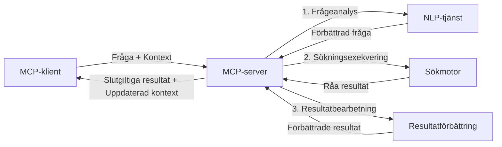

# Modellkontextprotokoll för Realtidssökning på Webben

## Översikt

Realtidssökning på webben har blivit avgörande i dagens informationsdrivna miljö, där applikationer behöver omedelbar åtkomst till uppdaterad information över internet för att erbjuda relevanta och tidsmässigt anpassade svar. Modellkontextprotokollet (MCP) representerar en betydande utveckling för att optimera dessa realtidssökningsprocesser, förbättra sökeffektiviteten, bibehålla kontextuell integritet och förbättra det övergripande systemets prestanda.

Denna modul utforskar hur MCP omvandlar realtidssökning på webben genom att erbjuda ett standardiserat tillvägagångssätt för kontexthantering mellan AI-modeller, sökmotorer och applikationer.

### Vad du kommer att lära dig

I denna omfattande guide kommer du att upptäcka:

- Hur MCP skapar en sömlös bro mellan AI-modeller och realtidssökningsmöjligheter
- Arkitektoniska mönster för implementering av effektiva och skalbara söklösningar med MCP
- Tekniker för att bevara sökkontext över flera frågor och interaktioner
- Praktiska kodimplementeringar i Python och JavaScript för olika sökscenarier
- Metoder för att balansera relevans, aktualitet och prestanda i MCP-drivna söksystem

## Introduktion till Realtidssökning på Webben

Realtidssökning på webben är en teknologisk metod som möjliggör kontinuerlig frågeställning, bearbetning och analys av webbaserad information när den publiceras eller uppdateras, vilket gör att system kan tillhandahålla färsk och relevant information med minimal fördröjning. Till skillnad från traditionella söksystem som arbetar med indexerad data som kan vara flera timmar eller dagar gammal, bearbetar realtidssökning levande data från webben, vilket levererar insikter och information som speglar det aktuella tillståndet för onlineinnehåll.

### Kärnbegrepp för Realtidssökning på Webben:

- **Kontinuerlig frågebearbetning**: Sökningsfrågor bearbetas mot konstant uppdaterande datakällor
- **Prioritering av aktualitet**: System är utformade för att prioritera färsk information
- **Balansering av relevans**: Bibehålla balans mellan relevans och aktualitet
- **Skalbar arkitektur**: System behöver hantera varierande belastning och datavolymer
- **Kontextuell förståelse**: Att bevara användarkontext över sökiterationer är avgörande för meningsfulla resultat
- **Dynamisk omformulering av frågor**: Anpassa frågor baserat på kontext och tidigare resultat
- **Integration av flera källor**: Kombinera resultat från flera sökleverantörer och webbplatser
- **Semantisk förståelse**: Bearbeta frågor och innehåll baserat på mening snarare än endast nyckelord
- **Realtidsrankning**: Kontinuerligt justera resultatens rangordning när ny information blir tillgänglig

### Modellkontextprotokollet och Realtidssökning på Webben

Modellkontextprotokollet (MCP) tar itu med flera kritiska utmaningar i realtidssökningsmiljöer på webben:

1. **Bevarande av sökkontext**: MCP standardiserar hur kontext upprätthålls mellan distribuerade sökkomponenter, vilket säkerställer att AI-modeller och bearbetningsnoder har tillgång till relevant sökhistorik och användarpreferenser.

2. **Effektiv hantering av frågor**: Genom att tillhandahålla strukturerade mekanismer för kontextöverföring minskar MCP den överbelastning som uppstår av att upprepa kontext i varje sökiterering.

3. **Interoperabilitet**: MCP skapar ett gemensamt språk för kontextdelning mellan olika sökteknologier och AI-modeller, vilket möjliggör mer flexibla och utbyggbara arkitekturer.

4. **Sökoptimerad kontext**: MCP-implementationer kan prioritera vilka kontextelement som är mest relevanta för effektiv sökning, och optimera både prestanda och noggrannhet.

5. **Adaptiv sökprocess**: Med korrekt kontexthantering via MCP kan söksystem dynamiskt justera bearbetningen baserat på föränderliga användarbehov och informationslandskap.

I moderna applikationer, från nyhetsaggregation till forskningsassistenter, möjliggör integrationen av MCP med webbsökning mer intelligenta, kontextmedvetna sökningar som kan erbjuda allt mer relevanta resultat i takt med att användarinteraktioner fortsätter.

## Lärandemål

Vid slutet av denna lektion kommer du att kunna:

- Förstå grunderna i realtidssökning på webben och dess utmaningar i moderna applikationer
- Förklara hur Modellkontextprotokollet (MCP) förbättrar realtidssökningsmöjligheter
- Implementera MCP-baserade söklösningar med populära ramverk och API:er
- Designa och distribuera skalbara, högpresterande sökarkitekturer med MCP
- Tillämpa MCP-koncept på olika användningsfall inklusive semantisk sökning, forskningsassistans och AI-förstärkt surfning
- Utvärdera framväxande trender och framtida innovationer inom MCP-baserade sökteknologier
- Utveckla kontextmedvetna söksystem som lär sig av användarinteraktioner
- Integrera webbsökningsfunktioner i AI-assistenter med hjälp av standardiserade MCP-protokoll
- Skapa mångstegs sökprocesser som successivt förfinar resultat baserat på kontext
- Optimera sökprestanda samtidigt som omfattande kontextmedvetenhet bibehålls

### Definition och Betydelse

Realtidssökning på webben innebär kontinuerlig frågeställning, återvinning och leverans av webbaserad information med minimal fördröjning. Till skillnad från traditionella sökmotorer som periodiskt genomsöker och indexerar webben, syftar realtidssökning till att exponera information i samma ögonblick den blir tillgänglig, vilket möjliggör omedelbar åtkomst till det mest aktuella innehållet.

Viktiga egenskaper för realtidssökning på webben inkluderar:

- **Färskhet**: Prioritering av nyligen publicerat innehåll och uppdateringar
- **Kontinuerlig bearbetning**: Konstant övervakning efter ny information
- **Frågeanpassning**: Förfining av sökfrågor baserat på kontext och återkoppling
- **Omedelbar leverans**: Tillhandahålla sökresultat med minimal fördröjning
- **Kontextbehållning**: Bygga vidare på tidigare frågor för förbättrad relevans

### Utmaningar i Traditionell Webbsökning

Traditionella metoder för webbsökning stöter på flera begränsningar vid tillämpning i realtidsscenarier:

1. **Fragmentering av kontext**: Svårigheter att bevara sökkontext över flera frågor
2. **Informationsfärskhet**: Utmaningar att få tillgång till och prioritera den senaste informationen
3. **Integrationskomplexitet**: Problem med interoperabilitet mellan söksystem och applikationer
4. **Latensproblem**: Att balansera omfattande sökning med svarstidskrav
5. **Justering av relevans**: Säkerställa noggrannhet och relevans samtidigt som aktualitet prioriteras

## Förstå Modellkontextprotokollet (MCP) för Sökarbeten

### Vad är MCP i Sökkontexter?

Modellkontextprotokollet (MCP) är ett standardiserat kommunikationsprotokoll utformat för att underlätta effektiv interaktion mellan AI-modeller och applikationer. I kontexten av realtidssökning på webben erbjuder MCP en ram för:

- Bevarande av sökkontext genom hela frågesekvenser
- Standardisering av format för sökfrågor och resultat
- Optimering av överföringen av sökparametrar och resultat
- Förbättrad kommunikation mellan modell och sökmotor

### Kärnkomponenter och Arkitektur

MCP-arkitekturen för realtidssökning på webben består av flera nyckelkomponenter:

1. **Hanterare för frågekontekst**: Hanterar och bibehåller sökkontext över flera frågor
2. **Sökprocessorer**: Bearbetar inkommande sökförfrågningar med kontextmedvetna tekniker
3. **Protokolladapterare**: Omvandlar mellan olika sök-API:er samtidigt som kontext bibehålls
4. **Kontextlager**: Effektiv lagring och hämtning av sökhistorik och preferenser
5. **Sökanslutningar**: Ansluter till olika sökmotorer och webb-API:er



### Hur MCP Förbättrar Realtidssökning på Webben

MCP adresserar traditionella problem i webbsökning genom:

- **Kontextuell kontinuitet**: Att bibehålla relationer mellan frågor under hela sökessionen
- **Optimerad överföring**: Minska redundans i sökparametrar genom intelligent kontexthantering
- **Standardiserade gränssnitt**: Tillhandahålla konsistenta API:er för sökkomponenter
- **Minskad latens**: Minimera bearbetningskostnader genom effektiv kontexthantering
- **Förbättrad relevans**: Förbättra sökresultatens relevans genom att bevara användarens avsikt över flera frågor

## Integration och Implementation

Realtidssöksystem kräver noggrann arkitektonisk design och implementering för att bibehålla både prestanda och kontextuell integritet. Modellkontextprotokollet erbjuder ett standardiserat tillvägagångssätt för att integrera AI-modeller och sökteknologier, vilket möjliggör mer sofistikerade, kontextmedvetna sökprocesser.

### Översikt av MCP-integration i sökarkitekturer

Implementering av MCP i realtidssökningsmiljöer innebär flera viktiga överväganden:

1. **Serialisering av sökkontext**: MCP tillhandahåller effektiva mekanismer för kodning av kontextuell information inom sökförfrågningar, vilket säkerställer att väsentlig kontext följer med frågan genom hela bearbetningskedjan. Detta inkluderar standardiserade serialiseringsformat optimerade för sökrelevant metadata.

2. **Tillståndsbaserad sökprocess**: MCP möjliggör intelligent tillståndsbaserad bearbetning genom att upprätthålla konsekvent kontextrepresentation över sökiterationer. Detta är särskilt värdefullt i mångstegs-sökprocesser där kontextförfining förbättrar resultat.

3. **Uppskalning och förfining av frågor**: MCP-implementationer i söksystem kan underlätta avancerad utökning och förfining av frågor baserat på ansamlad kontext, vilket möjliggör allt mer relevanta resultat i takt med att söksessionen fortskrider.

4. **Resultatcache och prioritering**: Genom att standardisera kontexthantering hjälper MCP till att hantera cachelagring och prioritering av resultat, vilket gör att komponenter kan anpassa sig efter den föränderliga sökkontexten.

5. **Söksamarbete och aggregering**: MCP möjliggör mer sofistikerad samverkan mellan sökningar över flera backend-tjänster genom att tillhandahålla strukturerade representationer av sökkontext, vilket möjliggör meningsfullare aggregering av resultat från skilda källor.

Implementeringen av MCP över olika sökteknologier skapar ett enhetligt tillvägagångssätt för kontexthantering, vilket minskar behovet av anpassad integrationskod samtidigt som systemets förmåga att bibehålla meningsfull kontext under sökfrågors utveckling förstärks.

### MCP i olika webbsöksimplementationer

Dessa exempel följer den aktuella MCP-specifikationen som fokuserar på ett JSON-RPC-baserat protokoll med distinkta transportmekanismer. Koden visar hur du kan implementera anpassade sökintegrationer samtidigt som full kompatibilitet med MCP-protokollet bibehålls.


<details>
<summary>Python-implementation med Generisk Sök-API</summary>

```python
import asyncio
import json
import aiohttp
from typing import Dict, Any, Optional, List
from contextlib import asynccontextmanager
from collections.abc import AsyncIterator

# Importera standard MCP-bibliotek
from mcp.client.session import ClientSession
from mcp.client.streamable_http import streamablehttp_client
from mcp.types import TextContent, CreateMessageRequestParams, CreateMessageResult
from mcp.server.fastmcp import FastMCP

# Skapa en FastMCP-server för webbsökning
search_server = FastMCP("WebSearch")

# Klass för att hantera webbsökningsoperationer
class WebSearchHandler:
    def __init__(self, api_endpoint: str, api_key: str):
        self.api_endpoint = api_endpoint
        self.api_key = api_key
        self.session = None
        
    async def initialize(self):
        """Initialize the HTTP session"""
        self.session = aiohttp.ClientSession(
            headers={"Authorization": f"Bearer {self.api_key}"}
        )
    
    async def close(self):
        """Close the HTTP session"""
        if self.session:
            await self.session.close()
            
    async def perform_search(self, query: str, max_results: int = 5, 
                           include_domains: List[str] = None, 
                           exclude_domains: List[str] = None,
                           time_period: str = "any") -> Dict[str, Any]:
        """Perform web search using the search API"""
        # Konstruera sökparametrar
        search_params = {
            "q": query,
            "limit": max_results,
            "time": time_period
        }
        
        if include_domains:
            search_params["site"] = ",".join(include_domains)
            
        if exclude_domains:
            search_params["exclude_site"] = ",".join(exclude_domains)
        
        # Utför sökförfrågan
        try:
            async with self.session.get(
                self.api_endpoint,
                params=search_params
            ) as response:
                if response.status != 200:
                    error_text = await response.text()
                    raise Exception(f"Search API error: {response.status} - {error_text}")
                
                search_data = await response.json()
                
                # Omvandla API-specifikt svar till ett standardformat
                results = []
                for item in search_data.get("results", []):
                    results.append({
                        "title": item.get("title", ""),
                        "url": item.get("url", ""),
                        "snippet": item.get("snippet", ""),
                        "date": item.get("published_date", ""),
                        "source": item.get("source", "")
                    })
                
                return {
                    "query": query,
                    "totalResults": len(results),
                    "results": results
                }
        except Exception as e:
            print(f"Search API request error: {e}")
            raise

# Initialisera sökhantaren
search_handler = WebSearchHandler(
    api_endpoint="https://api.search-service.example/search",
    api_key="your-api-key-here"
)

# Ställ in livslängd för att hantera sökhantaren
@asyncio.asynccontextmanager
async def app_lifespan(server: FastMCP):
    """Manage application lifecycle"""
    await search_handler.initialize()
    try:
        yield {"search_handler": search_handler}
    finally:
        await search_handler.close()

# Ange livslängd för servern
search_server = FastMCP("WebSearch", lifespan=app_lifespan)

# Registrera ett webbsökverktyg
@search_server.tool()
async def web_search(query: str, max_results: int = 5, 
                   include_domains: List[str] = None,
                   exclude_domains: List[str] = None,
                   time_period: str = "any") -> Dict[str, Any]:
    """
    Search the web for information
    
    Args:
        query: The search query
        max_results: Maximum number of results to return (default: 5)
        include_domains: List of domains to include in search results
        exclude_domains: List of domains to exclude from search results
        time_period: Time period for results ("day", "week", "month", "any")
        
    Returns:
        Dictionary containing search results
    """
    ctx = search_server.get_context()
    search_handler = ctx.request_context.lifespan_context["search_handler"]
    
    results = await search_handler.perform_search(
        query=query,
        max_results=max_results,
        include_domains=include_domains,
        exclude_domains=exclude_domains,
        time_period=time_period
    )
    
    return results

# Exempel på klientanvändning
async def client_example():
    # Anslut till sökservern med Streamable HTTP-överföring
    async with streamablehttp_client("http://localhost:8000/mcp") as (read, write, _):
        async with ClientSession(read, write) as session:
            # Initialisera anslutningen
            await session.initialize()
            
            # Anropa web_search-verktyget
            search_results = await session.call_tool(
                "web_search", 
                {
                    "query": "latest developments in AI and Model Context Protocol",
                    "max_results": 5,
                    "time_period": "day",
                    "include_domains": ["github.com", "microsoft.com"]
                }
            )
            
            print(f"Search results: {search_results}")

# Serverexekveringsexempel
if __name__ == "__main__":
    # Kör servern med Streamable HTTP-överföring
    search_server.run(transport="streamable-http")
```
</details> 

<details>
<summary>JavaScript-implementation med webbläsarbaserad sökning</summary>


```javascript
// MCP-serverimplementering för webbsökning
import { McpServer, ResourceTemplate } from '@modelcontextprotocol/sdk/server/mcp.js';
import { StreamableHTTPServerTransport } from '@modelcontextprotocol/sdk/server/streamableHttp.js';
import { z } from 'zod';

// Skapa en MCP-server för webbsökning
const searchServer = new McpServer({
    name: "BrowserSearch",
    description: "A server that provides web search capabilities"
});

// Söktjänstklass
class SearchService {
    constructor(searchApiUrl, apiKey) {
        this.searchApiUrl = searchApiUrl;
        this.apiKey = apiKey;
    }

    async performSearch(parameters) {
        const {
            query = '',
            maxResults = 5,
            includeDomains = [],
            excludeDomains = [],
            timePeriod = 'any'
        } = parameters;
        
        // Konstruera sök-URL med parametrar
        const url = new URL(this.searchApiUrl);
        url.searchParams.append('q', query);
        url.searchParams.append('limit', maxResults);
        url.searchParams.append('time', timePeriod);
        
        if (includeDomains.length > 0) {
            url.searchParams.append('site', includeDomains.join(','));
        }
        
        if (excludeDomains.length > 0) {
            url.searchParams.append('exclude_site', excludeDomains.join(','));
        }
        
        try {
            const response = await fetch(url.toString(), {
                method: 'GET',
                headers: {
                    'Authorization': `Bearer ${this.apiKey}`,
                    'Content-Type': 'application/json'
                }
            });
            
            if (!response.ok) {
                const errorText = await response.text();
                throw new Error(`Search API error: ${response.status} - ${errorText}`);
            }
            
            const searchData = await response.json();
            
            // Omvandla API-specifik svar till ett standardformat
            const results = searchData.results?.map(item => ({
                title: item.title || '',
                url: item.url || '',
                snippet: item.snippet || '',
                date: item.published_date || '',
                source: item.source || ''
            })) || [];
            
            return {
                query,
                totalResults: results.length,
                results
            };
        } catch (error) {
            console.error('Search API request error:', error);
            throw error;
        }
    }
}

// Initiera söktjänsten
const searchService = new SearchService(
    'https://api.search-service.example/search',
    'your-api-key-here'
);

// Ställ in kontextleverantören för servern
searchServer.setContextProvider(() => {
    return {
        searchService
    };
});

// Registrera webb sökverktyg
searchServer.tool({
    name: 'web_search',
    description: 'Search the web for information',
    parameters: {
        type: 'object',
        properties: {
            query: {
                type: 'string',
                description: 'The search query'
            },
            maxResults: {
                type: 'integer',
                description: 'Maximum number of results to return',
                default: 5
            },
            includeDomains: {
                type: 'array',
                items: { type: 'string' },
                description: 'List of domains to include in search results'
            },
            excludeDomains: {
                type: 'array',
                items: { type: 'string' },
                description: 'List of domains to exclude from search results'
            },
            timePeriod: {
                type: 'string',
                description: 'Time period for results',
                enum: ['day', 'week', 'month', 'any'],
                default: 'any'
            }
        },
        required: ['query']
    },
    handler: async (params, context) => {
        const { searchService } = context;
        return await searchService.performSearch(params);
    }
});

// Exempel på klientkod för att ansluta till sökservern
import { Client } from '@modelcontextprotocol/sdk/client/index.js';
import { StreamableHTTPClientTransport } from '@modelcontextprotocol/sdk/client/streamableHttp.js';

async function connectToSearchServer() {
    // Anslut till sökservern
    const transport = new StreamableHTTPClientTransport(
        new URL('http://localhost:8000/mcp')
    );
    
    const client = new Client({
        name: 'search-client',
        version: '1.0.0'
    });
    
    await client.connect(transport);
    
    // Utför sökverktyget
    const searchResults = await client.callTool({
        name: 'web_search',
        arguments: {
            query: 'Model Context Protocol implementation examples',
            maxResults: 10,
            timePeriod: 'week',
            includeDomains: ['github.com', 'docs.microsoft.com']
        }
    });
    
    console.log('Search results:', searchResults);
    
    // Rensa upp
    await client.disconnect();
}

// Starta servern
const transport = new StreamableHTTPServerTransport();
await searchServer.connect(transport);
console.log('Search server running at http://localhost:8000/mcp');

// I en separat process eller efter att servern startat
// connectToSearchServer().catch(console.error);
```
</details> 


## Ansvarsfriskrivning för Kodexempel

> **Viktig notering**: Kodexemplen nedan demonstrerar integrationen av Modellkontextprotokollet (MCP) med webbsökningsfunktionalitet. Även om de följer mönster och strukturer från de officiella MCP-SDK:erna har de förenklats för utbildningssyfte.
> 
> Dessa exempel visar:
> 
> 1. **Python-implementation**: En FastMCP-serverimplementation som tillhandahåller ett webbsökningsverktyg och ansluter till en extern sök-API. Exemplet visar korrekt livscykelhantering, kontexthantering och verktygsimplementation enligt mönstren i [det officiella MCP Python SDK](https://github.com/modelcontextprotocol/python-sdk). Servern använder den rekommenderade Streamable HTTP-transporten som ersatt den äldre SSE-transporten för produktionsdistributioner.
> 
> 2. **JavaScript-implementation**: En TypeScript/JavaScript-implementation som använder FastMCP-mönstret från [det officiella MCP TypeScript SDK](https://github.com/modelcontextprotocol/typescript-sdk) för att skapa en sökserver med korrekt verktygsdefinition och klientanslutningar. Den följer de senaste rekommenderade mönstren för sessionshantering och kontextbevarande.
> 
> Dessa exempel skulle kräva ytterligare felhantering, autentisering och specifik API-integrationskod för produktionsbruk. De sök-API-endpoints som visas (`https://api.search-service.example/search`) är platshållare och måste ersättas med faktiska söktjänstendpoints.
> 
> För fullständiga implementeringsdetaljer och de mest aktuella tillvägagångssätten, vänligen se [den officiella MCP-specifikationen](https://spec.modelcontextprotocol.io/) och SDK-dokumentationen.

## Kärnbegrepp

### Modellkontextprotokollets (MCP) ramverk

I sin grund erbjuder Modellkontextprotokollet ett standardiserat sätt för AI-modeller, applikationer och tjänster att utbyta kontext. Inom realtidssökning på webben är detta ramverk avgörande för att skapa sammanhängande, fleromgångs sökupplevelser. Nyckelkomponenter inkluderar:

1. **Klient-serverarkitektur**: MCP etablerar en tydlig separation mellan sökklienter (förfrågare) och sökservrar (tillhandahållare), vilket möjliggör flexibla distributionsmodeller.

2. **JSON-RPC-kommunikation**: Protokollet använder JSON-RPC för meddelandeutbyte, vilket gör det kompatibelt med webbaserade teknologier och enkelt att implementera över olika plattformar.

3. **Kontexthantering**: MCP definierar strukturerade metoder för att upprätthålla, uppdatera och nyttja sökkontext över flera interaktioner.

4. **Verktygsdefinitioner**: Sökfunktionalitet exponeras som standardiserade verktyg med väldefinierade parametrar och returvärden.

5. **Stöder streaming**: Protokollet stödjer strömmande resultat, vilket är essentiellt för realtidssökning där resultat kan komma successivt.

### Mönster för integration av webbsökning

Vid integration av MCP med webbsökning framträder flera mönster:

#### 1. Direkt integration med sökleverantör



I detta mönster interagerar MCP-servern direkt med en eller flera sök-API:er, översätter MCP-förfrågningar till API-specifika anrop och formaterar resultaten som MCP-svar.

#### 2. Federerad sökning med kontextbevarande



Detta mönster distribuerar sökfrågor över flera MCP-kompatibla sökleverantörer, som var och en potentiellt specialiserar sig på olika typer av innehåll eller sökfunktioner, samtidigt som en enhetlig kontext bibehålls.

#### 3. Kontextförbättrad sökkedja



I detta mönster delas sökprocessen upp i flera steg, där kontext berikas vid varje steg, vilket resulterar i successivt mer relevanta resultat.

### Sökkonstekomponenter

I MCP-baserad webbsökning inkluderar kontext typiskt:

- **Sökhistorik**: Tidigare sökfrågor i sessionen
- **Användarpreferenser**: Språk, region, säker sökning-inställningar
- **Interaktionshistorik**: Vilka resultat som klickats på, tid spenderad på resultat
- **Sökparametrar**: Filter, sorteringsordningar och andra sökmodifierare
- **Domänkunskap**: Ämnesspecifik kontext relevant för sökningen
- **Tidsbaserad kontext**: Relevansfaktorer baserade på tid
- **Källpreferenser**: Betrodda eller föredragna informationskällor

## Användningsfall och Applikationer

### Forskning och Informationsinsamling

MCP förbättrar forskningsflöden genom att:

- Bevara forskningskontext över sökningssessioner
- Möjliggöra mer sofistikerade och kontextuellt relevanta frågor
- Stödja mångkälla-söktfederation
- Underlätta kunskapsutvinning från sökresultat

### Realtidsnyheter och Trendövervakning

MCP-drivna sökningar erbjuder fördelar för nyhetsövervakning:

- Nästan realtidsupptäckt av framväxande nyhetshändelser
- Kontextuell filtrering av relevant information
- Ämnes- och entitetsuppföljning över flera källor
- Personliga nyhetsvarningar baserade på användarkontext

### AI-förstärkt surfning och forskning

MCP skapar nya möjligheter för AI-förstärkt surfning:

- Kontextuella sökförslag baserade på aktuell webbläsaraktivitet
- Sömlös integration av webbsökning med LLM-drivna assistenter
- Fleromgångars sökförfining med bibehållen kontext
- Förbättrad faktakoll och informationsverifiering

## Framtidstrender och Innovationer

### MCP:s utveckling inom webbsökning

Framöver förväntar vi oss att MCP utvecklas för att ta itu med:


- **Multimodal sökning**: Integrera text-, bild-, ljud- och videosökning med bevarad kontext
- **Decentraliserad sökning**: Stöd för distribuerade och federerade sökekosystem
- **Sökningsintegritet**: Konstmedvetna integritetsskyddande sökmetoder
- **Förståelse av sökfrågor**: Djup semantisk analys av naturliga språkfrågor

### Potentiella tekniska framsteg

Framväxande teknologier som kommer att forma framtiden för MCP-sökning:

1. **Neurala sökarkitekturer**: Inbäddningsbaserade söksystem optimerade för MCP
2. **Personanpassad sökkontext**: Inlärning av individuella användares sökmönster över tid
3. **Kunskapsgrafintegration**: Kontextuell sökning förbättrad med domänspecifika kunskapsgrafer
4. **Tvärmodal kontext**: Upprätthålla kontext över olika sökmodaliteter

## Praktiska övningar

### Övning 1: Sätta upp en grundläggande MCP-sökningspipeline

I denna övning lär du dig att:
- Konfigurera en grundläggande MCP-sökmiljö
- Implementera kontexthanterare för websökning
- Testa och validera kontextbevarande över sökiterationer

### Övning 2: Bygga en forskningsassistent med MCP-sökning

Skapa en komplett applikation som:
- Bearbetar forskningsfrågor på naturligt språk
- Utför kontextmedvetna websökningar
- Syntetiserar information från flera källor
- Presenterar organiserade forskningsresultat

### Övning 3: Implementera multifrågekälls-federering med MCP

Avancerad övning som omfattar:
- Kontextmedveten frågehantering till flera sökmotorer
- Resultatrankning och aggregering
- Kontextuell deduplicering av sökresultat
- Hantering av källspecifik metadata

## Ytterligare resurser

- [Model Context Protocol Specification](https://spec.modelcontextprotocol.io/) - Officiell MCP-specifikation och detaljerad protokolldokumentation
- [Model Context Protocol Documentation](https://modelcontextprotocol.io/) - Detaljerade handledningar och implementationsguider
- [MCP Python SDK](https://github.com/modelcontextprotocol/python-sdk) - Officiell Python-implementering av MCP-protokollet
- [MCP TypeScript SDK](https://github.com/modelcontextprotocol/typescript-sdk) - Officiell TypeScript-implementering av MCP-protokollet
- [MCP Reference Servers](https://github.com/modelcontextprotocol/servers) - Referensimplementationer av MCP-servrar
- [Bing Web Search API Documentation](https://learn.microsoft.com/en-us/bing/search-apis/bing-web-search/overview) - Microsofts webbsöknings-API
- [Google Custom Search JSON API](https://developers.google.com/custom-search/v1/overview) - Googles programmerbara sökmotor
- [SerpAPI Documentation](https://serpapi.com/search-api) - Sökmotorresultats-API
- [Meilisearch Documentation](https://www.meilisearch.com/docs) - Öppen källkod sökmotor
- [Elasticsearch Documentation](https://www.elastic.co/guide/index.html) - Distribuerad sök- och analysmotor
- [LangChain Documentation](https://python.langchain.com/docs/get_started/introduction) - Bygga applikationer med LLMs

## Lärandemål

Genom att slutföra denna modul kommer du att kunna:

- Förstå grunderna i realtidswebbsökning och dess utmaningar
- Förklara hur Model Context Protocol (MCP) förbättrar realtidswebbsökningens kapabiliteter
- Implementera MCP-baserade söklösningar med populära ramverk och API:er
- Designa och distribuera skalbara, högpresterande sökarkitekturer med MCP
- Tillämpa MCP-koncept på olika användningsområden inklusive semantisk sökning, forskningsassistans och AI-förstärkt surfning
- Utvärdera nya trender och framtida innovationer inom MCP-baserad sökteknologi


### Överväganden kring förtroende och säkerhet

Vid implementering av MCP-baserade webbsökningslösningar, kom ihåg dessa viktiga principer från MCP-specifikationen:

1. **Användarsamtycke och kontroll**: Användare måste uttryckligen samtycka till och förstå all dataåtkomst och alla operationer. Detta är särskilt viktigt för implementationslösningar för webbsökning som kan komma åt externa datakällor.

2. **Datasäkerhet**: Säkerställ korrekt hantering av sökfrågor och resultat, särskilt när de kan innehålla känslig information. Implementera lämpliga åtkomstkontroller för att skydda användardata.

3. **Verktygssäkerhet**: Implementera korrekt auktorisation och validering för sökverktyg, eftersom dessa utgör potentiella säkerhetsrisker genom godtycklig kodkörning. Beskrivningar av verktygsbeteende ska betraktas som opålitliga om de inte erhållits från en betrodd server.

4. **Tydlig dokumentation**: Tillhandahåll klar dokumentation om kapaciteter, begränsningar och säkerhetsaspekter för din MCP-baserade sökimplementation, enligt implementationsriktlinjerna i MCP-specifikationen.

5. **Robusta samtyckesflöden**: Bygg robusta samtycke- och auktoriseringsflöden som tydligt förklarar vad varje verktyg gör innan dess användning auktoriseras, särskilt för verktyg som interagerar med externa webbresurser.

För fullständiga detaljer om MCP:s säkerhets- och förtroendebetraktelser, se den [officiella dokumentationen](https://modelcontextprotocol.io/specification/2025-11-25/basic/security_best_practices).

## Vad händer härnäst

- [5.12 Entra ID Authentication for Model Context Protocol Servers](../mcp-security-entra/README.md)

---

<!-- CO-OP TRANSLATOR DISCLAIMER START -->
**Ansvarsfriskrivning**:
Detta dokument har översatts med hjälp av AI-översättningstjänsten [Co-op Translator](https://github.com/Azure/co-op-translator). Även om vi strävar efter noggrannhet, var vänlig notera att automatiska översättningar kan innehålla fel eller brister. Det ursprungliga dokumentet på dess modersmål bör betraktas som den auktoritativa källan. För kritisk information rekommenderas professionell mänsklig översättning. Vi ansvarar inte för några missförstånd eller feltolkningar som uppstår till följd av användningen av denna översättning.
<!-- CO-OP TRANSLATOR DISCLAIMER END -->