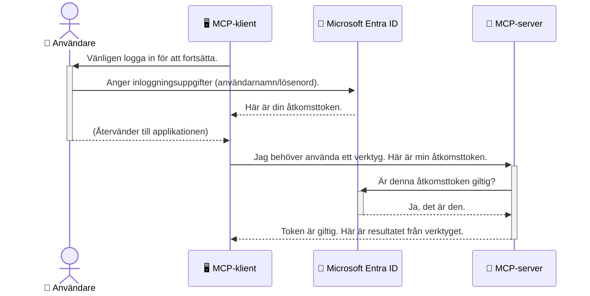

# Säkerställa AI-arbetsflöden: Entra ID-autentisering för Model Context Protocol-servrar

> [!NOTE]
> Den fjärrserverkod som används i denna lektion skyddar äldre `/sse` och `/message`
> slutpunkter och riktar sig mot MCP `2025-11-25`. Behåll dess identitets- och token-validerings
> metoder, men använd en `2026-07-28`-kompatibel Streamable HTTP-transport för nya
> implementationer.

## Introduktion
Att säkra din Model Context Protocol (MCP)-server är lika viktigt som att låsa ytterdörren till ditt hus. Att lämna din MCP-server öppen utsätter dina verktyg och data för obehörig åtkomst, vilket kan leda till säkerhetsintrång. Microsoft Entra ID tillhandahåller en robust molnbaserad identifierings- och åtkomsthanteringslösning, som hjälper till att säkerställa att endast auktoriserade användare och applikationer kan interagera med din MCP-server. I denna sektion lär du dig hur du skyddar dina AI-arbetsflöden med hjälp av Entra ID-autentisering.

## Lärandemål
I slutet av denna sektion kommer du att kunna:

- Förstå vikten av att säkra MCP-servrar.
- Förklara grunderna i Microsoft Entra ID och OAuth 2.0-autentisering.
- Känna igen skillnaden mellan offentliga och konfidentiella klienter.
- Implementera Entra ID-autentisering i både lokala (offentlig klient) och fjärran (konfidentiell klient) MCP-server scenarier.
- Tillämpa säkerhetsbästa praxis vid utveckling av AI-arbetsflöden.

## Säkerhet och MCP

Precis som du inte skulle lämna din ytterdörr olåst, bör du inte låta din MCP-server vara öppen för vem som helst att få åtkomst till. Att säkra dina AI-arbetsflöden är avgörande för att bygga robusta, pålitliga och säkra applikationer. Detta kapitel introducerar hur du använder Microsoft Entra ID för att säkra dina MCP-servrar, så att endast auktoriserade användare och applikationer kan interagera med dina verktyg och data.

## Varför säkerhet är viktigt för MCP-servrar

Föreställ dig att din MCP-server har ett verktyg som kan skicka e-post eller komma åt en kunddatabas. En osäker server skulle innebära att vem som helst potentiellt kan använda detta verktyg, vilket leder till obehörig dataåtkomst, skräppost eller andra skadliga aktiviteter.

Genom att implementera autentisering säkerställer du att varje förfrågan till din server verifieras, vilket bekräftar identiteten för användaren eller applikationen som gör förfrågan. Detta är det första och mest kritiska steget för att säkra dina AI-arbetsflöden.

## Introduktion till Microsoft Entra ID

[**Microsoft Entra ID**](https://adoption.microsoft.com/microsoft-security/entra/) är en molnbaserad tjänst för identitet och åtkomsthantering. Tänk på det som en universell säkerhetsvakt för dina applikationer. Den hanterar den komplexa processen att verifiera användaridentiteter (autentisering) och bestämma vad de får göra (auktorisering).

Genom att använda Entra ID kan du:

- Möjliggöra säker inloggning för användare.
- Skydda API:er och tjänster.
- Hantera åtkomstpolicyer från en central plats.

För MCP-servrar tillhandahåller Entra ID en robust och allmänt betrodd lösning för att hantera vem som kan få åtkomst till serverns funktioner.

---

## Förstå magin: Hur Entra ID-autentisering fungerar

Entra ID använder öppna standarder som **OAuth 2.0** för att hantera autentisering. Även om detaljerna kan vara komplexa är kärnkonceptet enkelt och kan förstås med en analogi.

### En mild introduktion till OAuth 2.0: Valettnyckeln

Tänk på OAuth 2.0 som en valettjänst för din bil. När du kommer fram till en restaurang ger du inte valettnyckeln till din huvudnyckel. Istället ger du en **valettnyckel** som har begränsade rättigheter—den kan starta bilen och låsa dörrarna, men den kan inte öppna bagageluckan eller handskfacket.

I denna analogi:

- **Du** är **Användaren**.
- **Din bil** är **MCP-servern** med dess värdefulla verktyg och data.
- **Valetten** är **Microsoft Entra ID**.
- **Parkeringsvakt** är **MCP-klienten** (applikationen som försöker få tillgång till servern).
- **Valettnyckeln** är **Åtkomsttoken**.

Åtkomsttoken är en säker textsträng som MCP-klienten tar emot från Entra ID efter att du har loggat in. Klienten presenterar sedan denna token för MCP-servern med varje förfrågan. Servern kan verifiera token för att säkerställa att förfrågan är legitim och att klienten har nödvändiga behörigheter, allt utan att någonsin behöva hantera dina faktiska uppgifter (som ditt lösenord).

### Autentiseringsflödet

Så här fungerar processen i praktiken:



### Introduktion till Microsoft Authentication Library (MSAL)

Innan vi dyker in i koden är det viktigt att introducera en nyckelkomponent som du kommer att se i exemplen: **Microsoft Authentication Library (MSAL)**.

MSAL är ett bibliotek utvecklat av Microsoft som gör det mycket enklare för utvecklare att hantera autentisering. Istället för att du måste skriva all komplex kod för att hantera säkerhetstokens, hantera inloggningar och uppdatera sessioner, tar MSAL hand om det tunga jobbet.

Att använda ett bibliotek som MSAL rekommenderas starkt eftersom:

- **Det är säkert:** Det implementerar branschstandardprotokoll och säkerhetsbästa praxis, vilket minskar risken för sårbarheter i din kod.
- **Det förenklar utveckling:** Det abstraherar komplexiteten i OAuth 2.0- och OpenID Connect-protokollen, vilket gör att du kan lägga till robust autentisering i din applikation med bara några kodrader.
- **Det är underhållet:** Microsoft underhåller och uppdaterar aktivt MSAL för att hantera nya säkerhetshot och plattformsförändringar.

MSAL stödjer ett brett utbud av språk och applikationsramverk, inklusive .NET, JavaScript/TypeScript, Python, Java, Go och mobila plattformar som iOS och Android. Det innebär att du kan använda samma konsekventa autentiseringsmönster över hela din teknologistack.

För att lära dig mer om MSAL kan du kolla in den officiella [MSAL-översiktsdokumentationen](https://learn.microsoft.com/entra/identity-platform/msal-overview).

---

## Säkerställa din MCP-server med Entra ID: En steg-för-steg-guide

Nu går vi igenom hur man säkrar en lokal MCP-server (en som kommunicerar över `stdio`) med Entra ID. Detta exempel använder en **offentlig klient**, som är lämplig för applikationer som körs på en användares dator, som en skrivbordsapp eller en lokal utvecklingsserver.

### Scenario 1: Säkerställa en lokal MCP-server (med en offentlig klient)

I detta scenario tittar vi på en MCP-server som körs lokalt, kommunicerar över `stdio` och använder Entra ID för att autentisera användaren innan tillgång ges till dess verktyg. Servern kommer att ha ett enda verktyg som hämtar användarens profilinformation från Microsoft Graph API.

#### 1. Ställa in applikationen i Entra ID

Innan du skriver någon kod måste du registrera din applikation i Microsoft Entra ID. Detta talar om för Entra ID vilken applikation det gäller och ger den behörighet att använda autentiseringstjänsten.

1. Navigera till **[Microsoft Entra-portalen](https://entra.microsoft.com/)**.
2. Gå till **Appregistreringar** och klicka på **Ny registrering**.
3. Ge din applikation ett namn (t.ex. "Min lokala MCP-server").
4. För **Stödda kontotyper**, välj **Konton endast i denna organisations katalog**.
5. Du kan lämna **Omdirigerings-URI** tom för detta exempel.
6. Klicka på **Registrera**.

När du har registrerat, notera **Applikations-ID (klient-ID)** och **Katalog-ID (hyresgästs-ID)**. Du kommer att behöva dessa i din kod.

#### 2. Koden: En genomgång

Låt oss titta på de viktiga delarna av koden som hanterar autentisering. Den fullständiga koden för detta exempel finns i mappen [Entra ID - Local - WAM](https://github.com/Azure-Samples/mcp-auth-servers/tree/main/src/entra-id-local-wam) i [mcp-auth-servers GitHub-repositoriet](https://github.com/Azure-Samples/mcp-auth-servers).

**`AuthenticationService.cs`**

Denna klass ansvarar för hanteringen av interaktionen med Entra ID.

- **`CreateAsync`**: Denna metod initierar `PublicClientApplication` från MSAL (Microsoft Authentication Library). Den är konfigurerad med din applikations `clientId` och `tenantId`.
- **`WithBroker`**: Detta möjliggör användning av en broker (som Windows Web Account Manager), som ger en säkrare och smidigare single sign-on-upplevelse.
- **`AcquireTokenAsync`**: Detta är kärnmetoden. Den försöker först hämta en token tyst (så att användaren inte behöver logga in igen om de redan har en giltig session). Om en tyst token inte kan erhållas, kommer användaren att uppmanas att logga in interaktivt.

```csharp
// Simplified for clarity
public static async Task<AuthenticationService> CreateAsync(ILogger<AuthenticationService> logger)
{
    var msalClient = PublicClientApplicationBuilder
        .Create(_clientId) // Your Application (client) ID
        .WithAuthority(AadAuthorityAudience.AzureAdMyOrg)
        .WithTenantId(_tenantId) // Your Directory (tenant) ID
        .WithBroker(new BrokerOptions(BrokerOptions.OperatingSystems.Windows))
        .Build();

    // ... cache registration ...

    return new AuthenticationService(logger, msalClient);
}

public async Task<string> AcquireTokenAsync()
{
    try
    {
        // Try silent authentication first
        var accounts = await _msalClient.GetAccountsAsync();
        var account = accounts.FirstOrDefault();

        AuthenticationResult? result = null;

        if (account != null)
        {
            result = await _msalClient.AcquireTokenSilent(_scopes, account).ExecuteAsync();
        }
        else
        {
            // If no account, or silent fails, go interactive
            result = await _msalClient.AcquireTokenInteractive(_scopes).ExecuteAsync();
        }

        return result.AccessToken;
    }
    catch (Exception ex)
    {
        _logger.LogError(ex, "An error occurred while acquiring the token.");
        throw; // Optionally rethrow the exception for higher-level handling
    }
}
```

**`Program.cs`**

Här sätts MCP-servern upp och autentiseringstjänsten integreras.

- **`AddSingleton<AuthenticationService>`**: Detta registrerar `AuthenticationService` med beroendeinjektionscontainern, så att den kan användas av andra delar av applikationen (som vårt verktyg).
- **`GetUserDetailsFromGraph` verktyget**: Detta verktyg kräver en instans av `AuthenticationService`. Innan det gör något anropar det `authService.AcquireTokenAsync()` för att få en giltig åtkomsttoken. Om autentiseringen lyckas använder det token för att anropa Microsoft Graph API och hämta användarens detaljer.

```csharp
// Simplified for clarity
[McpServerTool(Name = "GetUserDetailsFromGraph")]
public static async Task<string> GetUserDetailsFromGraph(
    AuthenticationService authService)
{
    try
    {
        // This will trigger the authentication flow
        var accessToken = await authService.AcquireTokenAsync();

        // Use the token to create a GraphServiceClient
        var graphClient = new GraphServiceClient(
            new BaseBearerTokenAuthenticationProvider(new TokenProvider(authService)));

        var user = await graphClient.Me.GetAsync();

        return System.Text.Json.JsonSerializer.Serialize(user);
    }
    catch (Exception ex)
    {
        return $"Error: {ex.Message}";
    }
}
```

#### 3. Hur allt fungerar tillsammans

1. När MCP-klienten försöker använda verktyget `GetUserDetailsFromGraph` anropar verktyget först `AcquireTokenAsync`.
2. `AcquireTokenAsync` triggar MSAL-biblioteket att kontrollera om en giltig token finns.
3. Om ingen token hittas kommer MSAL, via brokern, att uppmana användaren att logga in med sitt Entra ID-konto.
4. När användaren loggar in utfärdar Entra ID en åtkomsttoken.
5. Verktyget tar emot token och använder den för att göra ett säkert anrop till Microsoft Graph API.
6. Användarens detaljer returneras till MCP-klienten.

Denna process säkerställer att endast autentiserade användare kan använda verktyget, vilket effektivt säkrar din lokala MCP-server.

### Scenario 2: Säkerställa en fjärr MCP-server (med en konfidentiell klient)

När din MCP-server körs på en fjärrmaskin (som en molnserver) och kommunicerar över ett protokoll som HTTP Streaming är säkerhetskraven annorlunda. I detta fall bör du använda en **konfidentiell klient** och **Authorization Code Flow**. Detta är en säkrare metod eftersom applikationens hemligheter aldrig exponeras för webbläsaren.

Det här exemplet använder en TypeScript-baserad MCP-server som använder Express.js för att hantera HTTP-förfrågningar.

#### 1. Ställa in applikationen i Entra ID

Uppställningen i Entra ID är liknande den för den offentliga klienten, men med en viktig skillnad: du måste skapa en **klienthemlighet**.

1. Navigera till **[Microsoft Entra-portalen](https://entra.microsoft.com/)**.
2. I din appregistrering, gå till fliken **Certifikat och hemligheter**.
3. Klicka på **Ny klienthemlighet**, ge den en beskrivning och klicka på **Lägg till**.
4. **Viktigt:** Kopiera värdet av hemligheten omedelbart. Du kommer inte att kunna se den igen.
5. Du måste också konfigurera en **Omdirigerings-URI**. Gå till fliken **Autentisering**, klicka på **Lägg till en plattform**, välj **Webb** och ange omdirigerings-URI för din applikation (t.ex. `http://localhost:3001/auth/callback`).

> **⚠️ Viktig säkerhetsinformation:** För produktionsapplikationer rekommenderar Microsoft starkt att använda **hemlighetsfria autentiserings**metoder såsom **Managed Identity** eller **Workload Identity Federation** istället för klienthemligheter. Klienthemligheter utgör säkerhetsrisker eftersom de kan exponeras eller komprometteras. Managed identities ger en säkrare metod genom att eliminera behovet av att lagra autentiseringsuppgifter i din kod eller konfiguration.
>
> För mer information om managed identities och hur du implementerar dem, se [Managed identities for Azure resources overview](https://learn.microsoft.com/entra/identity/managed-identities-azure-resources/overview).

#### 2. Koden: En genomgång

Detta exempel använder ett sessionsbaserat tillvägagångssätt. När användaren autentiserar sig lagrar servern åtkomsttoken och refresh-token i en session och ger användaren en sessionstoken. Denna sessionstoken används sedan för efterföljande förfrågningar. Fullständig kod för detta exempel finns i mappen [Entra ID - Confidential client](https://github.com/Azure-Samples/mcp-auth-servers/tree/main/src/entra-id-cca-session) i [mcp-auth-servers GitHub-repositoriet](https://github.com/Azure-Samples/mcp-auth-servers).

**`Server.ts`**

Denna fil sätter upp Express-servern och MCP transportlagret.

- **`requireBearerAuth`**: Detta är en middleware som skyddar `/sse` och `/message` slutpunkterna. Den kontrollerar en giltig bearer-token i `Authorization`-huvudet i förfrågan.
- **`EntraIdServerAuthProvider`**: Detta är en anpassad klass som implementerar `McpServerAuthorizationProvider`-gränssnittet. Den ansvarar för hantering av OAuth 2.0-flödet.
- **`/auth/callback`**: Denna slutpunkt hanterar omdirigeringen från Entra ID efter att användaren har autentiserat sig. Den byter ut auktoriseringskoden mot en åtkomsttoken och en refresh-token.

```typescript
// Förenklat för tydlighet
const app = express();
const { server } = createServer();
const provider = new EntraIdServerAuthProvider();

// Skydda SSE-endpointen
app.get("/sse", requireBearerAuth({
  provider,
  requiredScopes: ["User.Read"]
}), async (req, res) => {
  // ... anslut till transporten ...
});

// Skydda meddelandeendpointen
app.post("/message", requireBearerAuth({
  provider,
  requiredScopes: ["User.Read"]
}), async (req, res) => {
  // ... hantera meddelandet ...
});

// Hantera OAuth 2.0 callback
app.get("/auth/callback", (req, res) => {
  provider.handleCallback(req.query.code, req.query.state)
    .then(result => {
      // ... hantera framgång eller misslyckande ...
    });
});
```

**`Tools.ts`**

Denna fil definierar de verktyg som MCP-servern tillhandahåller. Verktyget `getUserDetails` är liknande det i föregående exempel, men det hämtar åtkomsttoken från sessionen.

```typescript
// Förenklat för tydlighet
server.setRequestHandler(CallToolRequestSchema, async (request) => {
  const { name } = request.params;
  const context = request.params?.context as { token?: string } | undefined;
  const sessionToken = context?.token;

  if (name === ToolName.GET_USER_DETAILS) {
    if (!sessionToken) {
      throw new AuthenticationError("Authentication token is missing or invalid. Ensure the token is provided in the request context.");
    }

    // Hämta Entra ID-token från sessionslagret
    const tokenData = tokenStore.getToken(sessionToken);
    const entraIdToken = tokenData.accessToken;

    const graphClient = Client.init({
      authProvider: (done) => {
        done(null, entraIdToken);
      }
    });

    const user = await graphClient.api('/me').get();

    // ... returnera användaruppgifter ...
  }
});
```

**`auth/EntraIdServerAuthProvider.ts`**

Denna klass hanterar logiken för:

- Ombedda användaren till inloggningssidan för Entra ID.
- Byter auktoriseringskoden mot en åtkomsttoken.
- Lagrar token i `tokenStore`.
- Uppdaterar åtkomsttoken när den går ut.


#### 3. Hur allt fungerar tillsammans

1. När en användare först försöker ansluta till MCP-servern kommer `requireBearerAuth`-mellanprogrammet att se att de inte har en giltig session och omdirigera dem till inloggningssidan för Entra ID.
2. Användaren loggar in med sitt Entra ID-konto.
3. Entra ID omdirigerar användaren tillbaka till `/auth/callback`-slutpunkten med en auktoriseringskod.
4. Servern byter ut koden mot en åtkomsttoken och en uppfräschnings-token, lagrar dem och skapar en sessionstoken som skickas till klienten.
5. Klienten kan nu använda denna sessionstoken i `Authorization`-huvudet för alla framtida förfrågningar till MCP-servern.
6. När verktyget `getUserDetails` anropas använder det sessionstoken för att hitta åtkomsttoken för Entra ID och använder sedan den för att anropa Microsoft Graph API.

Detta flöde är mer komplext än flödet för publika klienter, men är nödvändigt för internet-exponerade slutpunkter. Eftersom fjärrstyrda MCP-servrar är tillgängliga över det publika internet behöver de starkare säkerhetsåtgärder för att skydda mot obehörig åtkomst och potentiella attacker.


## Säkerhetsbästa metoder

- **Använd alltid HTTPS**: Kryptera kommunikationen mellan klient och server för att skydda tokens från att bli avlyssnade.
- **Implementera rollbaserad åtkomstkontroll (RBAC)**: Kontrollera inte bara *om* en användare är autentiserad; kontrollera *vad* de är auktoriserade att göra. Du kan definiera roller i Entra ID och kontrollera dem i din MCP-server.
- **Övervaka och granska**: Logga alla autentiseringsevenemang så att du kan upptäcka och reagera på misstänkt aktivitet.
- **Hantera hastighetsbegränsning och avmattning**: Microsoft Graph och andra API:er implementerar hastighetsbegränsningar för att förhindra missbruk. Implementera exponentiell backoff och återförsökslogik i din MCP-server för att hantera HTTP 429 (För många förfrågningar) på ett smidigt sätt. Överväg att cacha ofta åtkomna data för att minska API-anrop.
- **Säker token-lagring**: Lagra åtkomsttokens och uppfräschnings-tokens säkert. För lokala applikationer, använd systemets säkra lagringsmekanismer. För serverapplikationer, överväg att använda krypterad lagring eller säkra nyckelhanteringstjänster som Azure Key Vault.
- **Hantera token-förfall**: Åtkomsttokens har en begränsad livslängd. Implementera automatisk token-uppfräschning med hjälp av uppfräschnings-tokens för att bibehålla en sömlös användarupplevelse utan att kräva återinloggning.
- **Överväg att använda Azure API Management**: Att implementera säkerhet direkt i din MCP-server ger dig finmaskig kontroll, men API-gateways som Azure API Management kan hantera många av dessa säkerhetsproblem automatiskt, inklusive autentisering, auktorisation, hastighetsbegränsning och övervakning. De erbjuder ett centraliserat säkerhetslager som sitter mellan dina klienter och dina MCP-servrar. För mer information om att använda API-gateways med MCP, se vår [Azure API Management Your Auth Gateway For MCP Servers](https://techcommunity.microsoft.com/blog/integrationsonazureblog/azure-api-management-your-auth-gateway-for-mcp-servers/4402690).


## Viktiga insikter

- Att säkra din MCP-server är avgörande för att skydda dina data och verktyg.
- Microsoft Entra ID erbjuder en robust och skalbar lösning för autentisering och auktorisation.
- Använd en **publik klient** för lokala applikationer och en **konfidentiell klient** för fjärrservrar.
- **Authorization Code Flow** är det säkraste alternativet för webbapplikationer.


## Övning

1. Fundera på en MCP-server du kanske kan bygga. Skulle den vara en lokal server eller en fjärrserver?
2. Baserat på ditt svar, skulle du använda en publik eller konfidentiell klient?
3. Vilken behörighet skulle din MCP-server begära för att utföra åtgärder mot Microsoft Graph?


## Praktiska övningar

### Övning 1: Registrera en applikation i Entra ID
Navigera till Microsoft Entra-portalen.
Registrera en ny applikation för din MCP-server.
Anteckna Application (client) ID och Directory (tenant) ID.

### Övning 2: Säkra en lokal MCP-server (Publik klient)
- Följ kodexemplet för att integrera MSAL (Microsoft Authentication Library) för användarautentisering.
- Testa autentiseringsflödet genom att anropa MCP-verktyget som hämtar användardetaljer från Microsoft Graph.

### Övning 3: Säkra en fjärr-MCP-server (Konfidentiell klient)
- Registrera en konfidentiell klient i Entra ID och skapa en klienthemlighet.
- Konfigurera din Express.js MCP-server för att använda Authorization Code Flow.
- Testa de skyddade slutpunkterna och bekräfta token-baserad åtkomst.

### Övning 4: Tillämpa säkerhetsbästa metoder
- Aktivera HTTPS för din lokala eller fjärrserver.
- Implementera rollbaserad åtkomstkontroll (RBAC) i din serverlogik.
- Lägg till hantering av token-förfall och säker token-lagring.

## Resurser

1. **MSAL Översiktsdokumentation**  
   Lär dig hur Microsoft Authentication Library (MSAL) möjliggör säker tokenförvärv över plattformar:  
   [MSAL Overview on Microsoft Learn](https://learn.microsoft.com/en-gb/entra/msal/overview)

2. **Azure-Samples/mcp-auth-servers GitHub Repository**  
   Referensimplementationer av MCP-servrar som demonstrerar autentiseringsflöden:  
   [Azure-Samples/mcp-auth-servers on GitHub](https://github.com/Azure-Samples/mcp-auth-servers)

3. **Managed Identities för Azure-resurser Översikt**  
   Förstå hur man eliminerar hemligheter genom att använda system- eller användartilldelade hanterade identiteter:  
   [Managed Identities Overview on Microsoft Learn](https://learn.microsoft.com/en-us/entra/identity/managed-identities-azure-resources/)

4. **Azure API Management: Din autentiseringsgateway för MCP-servrar**  
   En djupdykning i att använda APIM som en säker OAuth2-gateway för MCP-servrar:  
   [Azure API Management Your Auth Gateway For MCP Servers](https://techcommunity.microsoft.com/blog/integrationsonazureblog/azure-api-management-your-auth-gateway-for-mcp-servers/4402690)

5. **Microsoft Graph Behörighetsreferens**  
   Omfattande lista över delegerade och applikationsbehörigheter för Microsoft Graph:  
   [Microsoft Graph Permissions Reference](https://learn.microsoft.com/zh-tw/graph/permissions-reference)


## Inlärningsresultat
När du har slutfört detta avsnitt kommer du kunna:

- Redogöra för varför autentisering är kritiskt för MCP-servrar och AI-arbetsflöden.
- Ställa in och konfigurera Entra ID-autentisering för både lokala och fjärr-MCP-server-scenarier.
- Välja rätt klienttyp (publik eller konfidentiell) baserat på din servers distribution.
- Implementera säkra kodpraxis, inklusive tokenlagring och rollbaserad auktorisation.
- Tryggt skydda din MCP-server och dess verktyg från obehörig åtkomst.

## Vad som händer härnäst

- [5.13 Model Context Protocol (MCP) Integration med Microsoft Foundry](../mcp-foundry-agent-integration/README.md)

---

<!-- CO-OP TRANSLATOR DISCLAIMER START -->
**Ansvarsfriskrivning**:
Detta dokument har översatts med hjälp av AI-översättningstjänsten [Co-op Translator](https://github.com/Azure/co-op-translator). Även om vi strävar efter noggrannhet, var vänlig notera att automatiska översättningar kan innehålla fel eller brister. Det ursprungliga dokumentet på dess modersmål bör betraktas som den auktoritativa källan. För kritisk information rekommenderas professionell mänsklig översättning. Vi ansvarar inte för några missförstånd eller feltolkningar som uppstår till följd av användningen av denna översättning.
<!-- CO-OP TRANSLATOR DISCLAIMER END -->