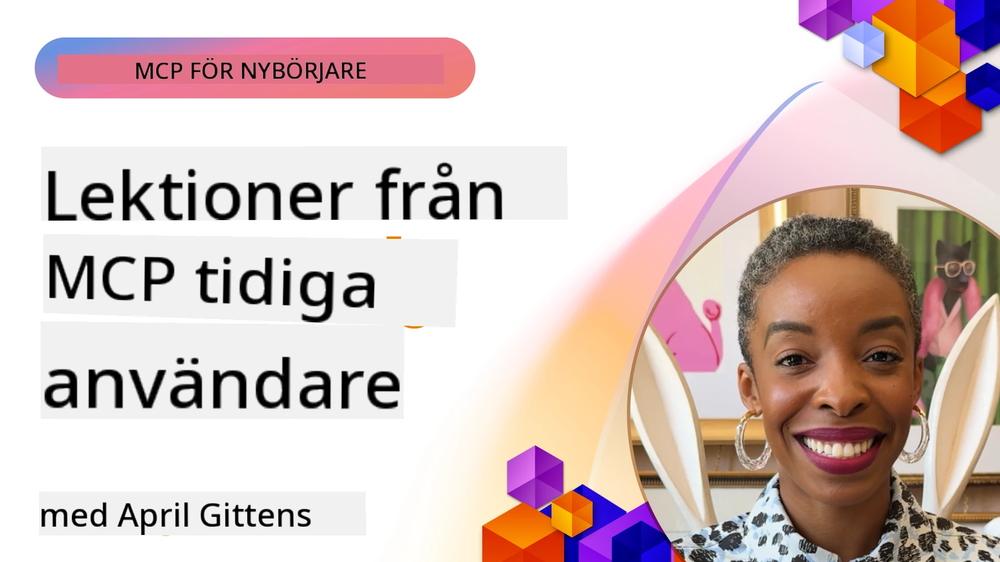

# 🌟 Lärdomar från tidiga användare

[](https://youtu.be/jds7dSmNptE)

_(Klicka på bilden ovan för att se video av denna lektion)_

## 🎯 Vad denna modul täcker

Denna modul utforskar hur riktiga organisationer och utvecklare använder Model Context Protocol (MCP) för att lösa verkliga utmaningar och driva innovation. Genom detaljerade fallstudier, praktiska projekt och exempel kommer du att upptäcka hur MCP möjliggör säker, skalbar AI-integration som kopplar samman språkmodeller, verktyg och företagsdata.

### 📚 Se MCP i praktiken

Vill du se dessa principer tillämpas på produktionsfärdiga verktyg? Kolla in våra [**10 Microsoft MCP-servrar som förändrar utvecklarproduktiviteten**](microsoft-mcp-servers.md), som visar riktiga Microsoft MCP-servrar du kan använda idag.

## Översikt

Denna lektion undersöker hur tidiga användare har använt Model Context Protocol (MCP) för att lösa verkliga utmaningar och driva innovation inom olika branscher. Genom detaljerade fallstudier och praktiska projekt kommer du att se hur MCP möjliggör standardiserad, säker och skalbar AI-integration — som kopplar samman stora språkmodeller, verktyg och företagsdata i en enhetlig ram. Du får praktisk erfarenhet av att designa och bygga MCP-baserade lösningar, lära dig från beprövade implementationsmönster och upptäcka bästa praxis för att distribuera MCP i produktionsmiljöer. Lektionen lyfter också fram nya trender, framtida riktningar och open-source resurser för att hjälpa dig ligga i framkant av MCP-teknologin och dess utvecklande ekosystem.

## Lärandemål

- Analysera verkliga MCP-implementationer inom olika industrier
- Designa och bygga kompletta MCP-baserade applikationer
- Utforska nya trender och framtida riktningar inom MCP-teknologi
- Tillämpa bästa praxis i verkliga utvecklingsscenarier

## Verkliga MCP-implementationer

### Fallstudie 1: Automatisering av företagskundsupport

Ett multinationellt företag implementerade en MCP-baserad lösning för att standardisera AI-interaktioner över sina kundsupportsystem. Detta tillät dem att:

- Skapa ett enhetligt gränssnitt för flera LLM-leverantörer
- Bibehålla konsekvent prompt-hantering över avdelningar
- Implementera robusta säkerhets- och efterlevnadskontroller
- Enkelt byta mellan olika AI-modeller baserat på specifika behov

**Teknisk implementering:**

```python
# Python MCP-serverimplementering för kundsupport
import logging
import asyncio
from modelcontextprotocol import create_server, ServerConfig
from modelcontextprotocol.server import MCPServer
from modelcontextprotocol.transports import create_http_transport
from modelcontextprotocol.resources import ResourceDefinition
from modelcontextprotocol.prompts import PromptDefinition
from modelcontextprotocol.tool import ToolDefinition

# Konfigurera loggning
logging.basicConfig(level=logging.INFO)

async def main():
    # Skapa serverkonfiguration
    config = ServerConfig(
        name="Enterprise Customer Support Server",
        version="1.0.0",
        description="MCP server for handling customer support inquiries"
    )
    
    # Initiera MCP-server
    server = create_server(config)
    
    # Registrera kunskapsbasresurser
    server.resources.register(
        ResourceDefinition(
            name="customer_kb",
            description="Customer knowledge base documentation"
        ),
        lambda params: get_customer_documentation(params)
    )
    
    # Registrera promptmallar
    server.prompts.register(
        PromptDefinition(
            name="support_template",
            description="Templates for customer support responses"
        ),
        lambda params: get_support_templates(params)
    )
    
    # Registrera supportverktyg
    server.tools.register(
        ToolDefinition(
            name="ticketing",
            description="Create and update support tickets"
        ),
        handle_ticketing_operations
    )
    
    # Starta server med HTTP-transport
    transport = create_http_transport(port=8080)
    await server.run(transport)

if __name__ == "__main__":
    asyncio.run(main())
```

**Resultat:** 30 % minskning i modellkostnader, 45 % förbättring i svarskonsistens samt förbättrad efterlevnad globalt.

### Fallstudie 2: Diagnostisk assistent inom sjukvården

En vårdgivare utvecklade en MCP-infrastruktur för att integrera flera specialiserade medicinska AI-modeller samtidigt som känslig patientdata skyddades:

- Sömlöst byte mellan generella och specialiserade medicinska modeller
- Strikta sekretesskontroller och revisionsspår
- Integration med befintliga elektroniska journalsystem (EHR)
- Konsekvent prompt-engineering för medicinsk terminologi

**Teknisk implementering:**

```csharp
// C# MCP host application implementation in healthcare application
using Microsoft.Extensions.DependencyInjection;
using ModelContextProtocol.SDK.Client;
using ModelContextProtocol.SDK.Security;
using ModelContextProtocol.SDK.Resources;

public class DiagnosticAssistant
{
    private readonly MCPHostClient _mcpClient;
    private readonly PatientContext _patientContext;
    
    public DiagnosticAssistant(PatientContext patientContext)
    {
        _patientContext = patientContext;
        
        // Configure MCP client with healthcare-specific settings
        var clientOptions = new ClientOptions
        {
            Name = "Healthcare Diagnostic Assistant",
            Version = "1.0.0",
            Security = new SecurityOptions
            {
                Encryption = EncryptionLevel.Medical,
                AuditEnabled = true
            }
        };
        
        _mcpClient = new MCPHostClientBuilder()
            .WithOptions(clientOptions)
            .WithTransport(new HttpTransport("https://healthcare-mcp.example.org"))
            .WithAuthentication(new HIPAACompliantAuthProvider())
            .Build();
    }
    
    public async Task<DiagnosticSuggestion> GetDiagnosticAssistance(
        string symptoms, string patientHistory)
    {
        // Create request with appropriate resources and tool access
        var resourceRequest = new ResourceRequest
        {
            Name = "patient_records",
            Parameters = new Dictionary<string, object>
            {
                ["patientId"] = _patientContext.PatientId,
                ["requestingProvider"] = _patientContext.ProviderId
            }
        };
        
        // Request diagnostic assistance using appropriate prompt
        var response = await _mcpClient.SendPromptRequestAsync(
            promptName: "diagnostic_assistance",
            parameters: new Dictionary<string, object>
            {
                ["symptoms"] = symptoms,
                patientHistory = patientHistory,
                relevantGuidelines = _patientContext.GetRelevantGuidelines()
            });
            
        return DiagnosticSuggestion.FromMCPResponse(response);
    }
}
```

**Resultat:** Förbättrade diagnostiska förslag för läkare samtidigt som full HIPAA-efterlevnad bibehölls och signifikant minskning av kontextbyten mellan system.

### Fallstudie 3: Riskanalys inom finanssektorn

En finansiell institution implementerade MCP för att standardisera deras riskanalysprocesser över olika avdelningar:

- Skapade ett enhetligt gränssnitt för kreditrisk, bedrägeribekämpning och investeringsriskmodeller
- Implementerade strikt åtkomstkontroll och versionshantering av modeller
- Säkerställde att alla AI-rekommendationer var möjliga att revidera
- Bibehöll konsekvent dataformat över olika system

**Teknisk implementering:**

```java
// Java MCP-server för finansiell riskbedömning
import org.mcp.server.*;
import org.mcp.security.*;

public class FinancialRiskMCPServer {
    public static void main(String[] args) {
        // Skapa MCP-server med funktioner för finansiell efterlevnad
        MCPServer server = new MCPServerBuilder()
            .withModelProviders(
                new ModelProvider("risk-assessment-primary", new AzureOpenAIProvider()),
                new ModelProvider("risk-assessment-audit", new LocalLlamaProvider())
            )
            .withPromptTemplateDirectory("./compliance/templates")
            .withAccessControls(new SOCCompliantAccessControl())
            .withDataEncryption(EncryptionStandard.FINANCIAL_GRADE)
            .withVersionControl(true)
            .withAuditLogging(new DatabaseAuditLogger())
            .build();
            
        server.addRequestValidator(new FinancialDataValidator());
        server.addResponseFilter(new PII_RedactionFilter());
        
        server.start(9000);
        
        System.out.println("Financial Risk MCP Server running on port 9000");
    }
}
```

**Resultat:** Förbättrad regulatorisk efterlevnad, 40 % snabbare modellutrullningscykler och förbättrad konsistens i riskbedömningar över avdelningar.

### Fallstudie 4: Microsoft Playwright MCP-server för webbläsarautomation

Microsoft utvecklade [Playwright MCP-servern](https://github.com/microsoft/playwright-mcp) för att möjliggöra säker, standardiserad webbläsarautomation via Model Context Protocol. Denna produktionsfärdiga server låter AI-agenter och LLMs interagera med webbläsare på ett kontrollerat, reviderbart och utbyggbart sätt — vilket möjliggör användningsfall som automatiserad webbtestning, datautvinning och end-to-end arbetsflöden.

> **🎯 Produktionsfärdigt verktyg**
> 
> Denna fallstudie visar en riktig MCP-server som du kan använda idag! Läs mer om Playwright MCP Server och 9 andra produktionsfärdiga Microsoft MCP-servrar i vår [**Microsoft MCP Servers Guide**](microsoft-mcp-servers.md#8--playwright-mcp-server).

**Nyckelfunktioner:**
- Exponerar webbläsarautomationsfunktioner (navigering, formulärifyllning, skärmdumpsfångst, etc.) som MCP-verktyg
- Implementerar strikt åtkomstkontroll och sandboxning för att förhindra obehöriga åtgärder
- Tillhandahåller detaljerade revisionsloggar för alla webbläsarinteraktioner
- Stöder integration med Azure OpenAI och andra LLM-leverantörer för agentstyrd automation
- Driver GitHub Copilots kodningsagent med webbsökningsfunktioner

**Teknisk implementering:**

```typescript
// TypeScript: Registrerar Playwright webbläsarautomatiseringsverktyg i en MCP-server
import { createServer, ToolDefinition } from 'modelcontextprotocol';
import { launch } from 'playwright';

const server = createServer({
  name: 'Playwright MCP Server',
  version: '1.0.0',
  description: 'MCP server for browser automation using Playwright'
});

// Registrera ett verktyg för att navigera till en URL och ta en skärmdump
server.tools.register(
  new ToolDefinition({
    name: 'navigate_and_screenshot',
    description: 'Navigate to a URL and capture a screenshot',
    parameters: {
      url: { type: 'string', description: 'The URL to visit' }
    }
  }),
  async ({ url }) => {
    const browser = await launch();
    const page = await browser.newPage();
    await page.goto(url);
    const screenshot = await page.screenshot();
    await browser.close();
    return { screenshot };
  }
);

// Starta MCP-servern
server.listen(8080);
```

**Resultat:**

- Möjliggjorde säker, programmatisk webbläsarautomation för AI-agenter och LLMs
- Minskade manuellt testarbete och förbättrade testtäckningen för webbapplikationer
- Erbjöd en återanvändbar, utbyggbar ram för webbläsarbaserad verktygsintegration i företagsmiljöer
- Driver GitHub Copilots webbläsningsfunktioner

**Referenser:**

- [Playwright MCP Server GitHub Repository](https://github.com/microsoft/playwright-mcp)
- [Microsoft AI and Automation Solutions](https://azure.microsoft.com/en-us/products/ai-services/)

### Fallstudie 5: Azure MCP – Model Context Protocol i företagsklass som tjänst

Azure MCP Server ([https://aka.ms/azmcp](https://aka.ms/azmcp)) är Microsofts hanterade, företagsklassiga implementation av Model Context Protocol, designad för att tillhandahålla skalbara, säkra och efterlevnadssäkra MCP-serverfunktioner som en molntjänst. Azure MCP gör det möjligt för organisationer att snabbt distribuera, hantera och integrera MCP-servrar med Azure AI, data och säkerhetstjänster, vilket minskar driftkostnader och påskyndar AI-antagande.

> **🎯 Produktionsfärdigt verktyg**
> 
> Detta är en riktig MCP-server som du kan använda idag! Läs mer om Microsoft Foundry MCP Server i vår [**Microsoft MCP Servers Guide**](microsoft-mcp-servers.md).


- Fullt hanterad MCP-serverhosting med inbyggd skalning, övervakning och säkerhet
- Native integration med Azure OpenAI, Azure AI Search och andra Azure-tjänster
- Företagsautentisering och auktorisering via Microsoft Entra ID
- Stöd för anpassade verktyg, promptmallar och resurskopplingar
- Efterlevnad av säkerhets- och regulatoriska krav för företag

**Teknisk implementering:**

```yaml
# Example: Azure MCP server deployment configuration (YAML)
apiVersion: mcp.microsoft.com/v1
kind: McpServer
metadata:
  name: enterprise-mcp-server
spec:
  modelProviders:
    - name: azure-openai
      type: AzureOpenAI
      endpoint: https://<your-openai-resource>.openai.azure.com/
      apiKeySecret: <your-azure-keyvault-secret>
  tools:
    - name: document_search
      type: AzureAISearch
      endpoint: https://<your-search-resource>.search.windows.net/
      apiKeySecret: <your-azure-keyvault-secret>
  authentication:
    type: EntraID
    tenantId: <your-tenant-id>
  monitoring:
    enabled: true
    logAnalyticsWorkspace: <your-log-analytics-id>
```

**Resultat:**  
- Minskat time-to-value för företags-AI-projekt genom att erbjuda en färdig, efterlevnadssäker MCP-serverplattform
- Förenklad integration av LLM:er, verktyg och företagsdatakällor
- Förbättrad säkerhet, observerbarhet och driftseffektivitet för MCP-arbetsbelastningar
- Förbättrad kodkvalitet med Azure SDK bästa praxis och aktuella autentiseringsmönster

**Referenser:**  
- [Azure MCP Documentation](https://aka.ms/azmcp)
- [Azure MCP Server GitHub Repository](https://github.com/Azure/azure-mcp)
- [Azure AI Services](https://azure.microsoft.com/en-us/products/ai-services/)
- [Microsoft MCP Center](https://mcp.azure.com)

## Fallstudie 6: NLWeb 
MCP (Model Context Protocol) är ett växande protokoll för chattbottar och AI-assistenter att interagera med verktyg. Varje NLWeb-instans är också en MCP-server, som stödjer en kärnmetod, ask, som används för att ställa en webbplats en fråga på naturligt språk. Det returnerade svaret använder schema.org, ett allmänt använt vokabulär för att beskriva webbdatan. Uttryckt enkelt är MCP för NLWeb vad Http är för HTML. NLWeb kombinerar protokoll, schema.org-format och exempel för att hjälpa webbplatser snabbt skapa dessa ändpunkter, vilket gynnar både människor via konversationsgränssnitt och maskiner via naturlig agent-till-agent-interaktion.

Det finns två distinkta komponenter i NLWeb.
- Ett protokoll, mycket enkelt att börja med, för att gränssnitt mot en webbplats i naturligt språk och ett format, som använder json och schema.org för det returnerade svaret. Se dokumentationen för REST API för fler detaljer.
- En enkel implementation av (1) som använder befintlig markup, för webbplatser som kan abstrakteras som listor av objekt (produkter, recept, attraktioner, recensioner etc.). Tillsammans med ett set UI-widgets kan webbplatser lätt erbjuda konversationsgränssnitt till sitt innehåll. Se dokumentationen för Life of a chat query för detaljer om hur detta fungerar.
 
**Referenser:**  
- [Azure MCP Documentation](https://aka.ms/azmcp)
- [NLWeb](https://github.com/microsoft/NlWeb)

### Fallstudie 7: Microsoft Foundry MCP Server – Integration av AI-agenter för företag

Microsoft Foundry MCP-servrar visar hur MCP kan användas för att orkestrera och hantera AI-agenter och arbetsflöden i företagsmiljöer. Genom att integrera MCP med Microsoft Foundry kan organisationer standardisera agentinteraktioner, utnyttja Foundrys arbetsflödeshantering och säkerställa säkra, skalbara distributioner.

> **🎯 Produktionsfärdigt verktyg**
> 
> Detta är en riktig MCP-server som du kan använda idag! Läs mer om Microsoft Foundry MCP Server i vår [**Microsoft MCP Servers Guide**](microsoft-mcp-servers.md#9--microsoft-foundry-mcp-server).

**Nyckelfunktioner:**
- Omfattande tillgång till Azures AI-ekosystem, inklusive modellkataloger och hantering av distributioner
- Kunskapsindexering med Azure AI Search för RAG-applikationer
- Utvärderingsverktyg för AI-modellprestanda och kvalitetssäkring
- Integration med Microsoft Foundry Catalog och Labs för banbrytande forskningsmodeller
- Agenthantering och utvärderingsfunktioner för produktionsscenarier

**Resultat:**
- Snabb prototypframtagning och robust övervakning av AI-agentarbetsflöden
- Sömlös integration med Azure AI-tjänster för avancerade scenarier
- Enhetligt gränssnitt för att bygga, distribuera och övervaka agentrörledningar
- Förbättrad säkerhet, efterlevnad och driftseffektivitet för företag
- Acceleration av AI-antagande samtidigt som kontroll bibehålls över komplexa agentstyrda processer

**Referenser:**
- [Microsoft Foundry MCP Server GitHub Repository](https://github.com/azure-ai-foundry/mcp-foundry)
- [Integrating Azure AI Agents with MCP (Microsoft Foundry Blog)](https://devblogs.microsoft.com/foundry/integrating-azure-ai-agents-mcp/)

### Fallstudie 8: Foundry MCP Playground – Experiment och prototyper

Foundry MCP Playground erbjuder en färdig miljö för att experimentera med MCP-servrar och Microsoft Foundry-integrationer. Utvecklare kan snabbt skapa prototyper, testa och utvärdera AI-modeller och agentarbetsflöden med resurser från Microsoft Foundry Catalog och Labs. Lekplatsen förenklar uppsättning, tillhandahåller exempelprojekt och stödjer samarbetsutveckling, vilket gör det lätt att utforska bästa praxis och nya scenarier med minimal arbetsinsats. Den är särskilt användbar för team som vill validera idéer, dela experiment och påskynda lärande utan komplex infrastruktur. Genom att sänka tröskeln hjälper lekplatsen till att främja innovation och gemenskapsbidrag i MCP- och Microsoft Foundry-ekosystemet.

**Referenser:**

- [Foundry MCP Playground GitHub Repository](https://github.com/azure-ai-foundry/foundry-mcp-playground)

### Fallstudie 9: Microsoft Learn Docs MCP Server – AI-driven dokumentationsåtkomst

Microsoft Learn Docs MCP Server är en molnhostad tjänst som ger AI-assistenter realtidsåtkomst till officiell Microsoft-dokumentation via Model Context Protocol. Denna produktionsfärdiga server kopplas till det omfattande Microsoft Learn-ekosystemet och möjliggör semantisk sökning över alla officiella Microsoft-källor.

> **🎯 Produktionsfärdigt verktyg**
> 
> Detta är en riktig MCP-server som du kan använda idag! Läs mer om Microsoft Learn Docs MCP Server i vår [**Microsoft MCP Servers Guide**](microsoft-mcp-servers.md#1--microsoft-learn-docs-mcp-server).

**Nyckelfunktioner:**
- Realtidsåtkomst till officiell Microsoft-dokumentation, Azure-dokument och Microsoft 365-dokumentation
- Avancerade semantiska sökfunktioner som förstår kontext och avsikt
- Alltid uppdaterad information när Microsoft Learn-innehåll publiceras
- Omfattande täckning över Microsoft Learn, Azure-dokumentation och Microsoft 365-källor
- Returnerar upp till 10 högkvalitativa innehållsbitar med artikelrubriker och URL:er

**Varför det är kritiskt:**
- Löser problemet med "föråldrad AI-kunskap" för Microsoft-teknologier
- Säkerställer att AI-assistenter har tillgång till de senaste .NET-, C#-, Azure- och Microsoft 365-funktionerna
- Förser auktoritativ, förstahandsinformation för noggrann kodgenerering
- Avgörande för utvecklare som arbetar med snabbt utvecklande Microsoft-teknologier

**Resultat:**
- Dramatiskt förbättrad noggrannhet i AI-genererad kod för Microsoft-teknologier
- Minskat tidsspill vid sökning efter aktuell dokumentation och bästa praxis
- Förbättrad utvecklarproduktivitet med kontextmedveten dokumentationshämtning
- Sömlös integration med utvecklingsarbetsflöden utan att lämna IDE:n

**Referenser:**
- [Microsoft Learn Docs MCP Server GitHub Repository](https://github.com/MicrosoftDocs/mcp)
- [Microsoft Learn Documentation](https://learn.microsoft.com/)

## Praktiska projekt

### Projekt 1: Bygg en MCP-server med flera leverantörer

**Mål:** Skapa en MCP-server som kan routa förfrågningar till flera AI-modellleverantörer baserat på specifika kriterier.

**Krav:**

- Stöd för minst tre olika modellleverantörer (t.ex. OpenAI, Anthropic, lokala modeller)
- Implementera en routingmekanism baserad på förfrågningsmetadata
- Skapa ett konfigurationssystem för att hantera leverantörsautentisering
- Lägg till caching för att optimera prestanda och kostnader
- Bygg en enkel dashboard för att övervaka användning

**Implementeringssteg:**

1. Sätt upp den grundläggande MCP-serverinfrastrukturen
2. Implementera leverantörsadaptrar för varje AI-modelltjänst
3. Skapa routinglogiken baserat på förfrågningsattribut
4. Lägg till cachingmekanismer för frekventa förfrågningar
5. Utveckla övervakningsdashboard
6. Testa med olika förfrågningsmönster

**Teknologier:** Välj bland Python (.NET/Java/Python beroende på din preferens), Redis för caching och ett enkelt webbframework för dashboarden.

### Projekt 2: Företagsomfattande system för prompt-hantering

**Mål:** Utveckla ett MCP-baserat system för att hantera, versionera och distribuera promptmallar inom en organisation.

**Krav:**


- Skapa ett centraliserat arkiv för promptmallar
- Implementera versionshantering och arbetsflöden för godkännande
- Bygg kapaciteter för testning av mallar med exempelinmatningar
- Utveckla rollbaserade åtkomstkontroller
- Skapa ett API för hämtning och distribution av mallar

**Implementeringssteg:**

1. Designa databasschemat för malllagring
2. Skapa kärn-API:et för CRUD-operationer på mallar
3. Implementera versionshanteringssystemet
4. Bygg godkännandearbetsflödet
5. Utveckla testningsramverket
6. Skapa ett enkelt webbgränssnitt för hantering
7. Integrera med en MCP-server

**Teknologier:** Valfritt backend-ramverk, SQL- eller NoSQL-databas, och frontend-ramverk för hanteringsgränssnittet.

### Projekt 3: MCP-baserad plattform för innehållsgenerering

**Mål:** Bygg en plattform för innehållsgenerering som använder MCP för att leverera konsekventa resultat över olika innehållstyper.

**Krav:**

- Stöd för flera innehållsformat (blogginlägg, sociala medier, marknadsföringstexter)
- Implementera mallbaserad generering med anpassningsmöjligheter
- Skapa ett system för innehållsgranskning och feedback
- Spåra prestandamått för innehåll
- Stöd för versionering och iteration av innehåll

**Implementeringssteg:**

1. Sätt upp MCP-klientinfrastruktur
2. Skapa mallar för olika innehållstyper
3. Bygg innehållsgenereringspipen
4. Implementera granskningssystemet
5. Utveckla systemet för spårning av mått
6. Skapa ett användargränssnitt för mallhantering och innehållsgenerering

**Teknologier:** Valfritt programmeringsspråk, webbframework och databassystem.

## Framtida inriktningar för MCP-teknologin

### Framväxande trender

1. **Multimodal MCP**
   - Utvidgning av MCP för att standardisera interaktioner med bild-, ljud- och videomodeller
   - Utveckling av tvärmodal resonemangskapacitet
   - Standardiserade promptformat för olika modaliteter

2. **Federerad MCP-infrastruktur**
   - Distribuerade MCP-nätverk som kan dela resurser mellan organisationer
   - Standardiserade protokoll för säker delning av modeller
   - Sekretessbevarande beräkningstekniker

3. **MCP-marknadsplatser**
   - Ekosystem för delning och monetarisering av MCP-mallar och plugin-program
   - Kvalitetssäkrings- och certifieringsprocesser
   - Integration med marknadsplatser för modeller

4. **MCP för Edge Computing**
   - Anpassning av MCP-standarder för resursbegränsade edge-enheter
   - Optimerade protokoll för miljöer med låg bandbredd
   - Specialiserade MCP-implementationer för IoT-ekosystem

5. **Regulatoriska ramverk**
   - Utveckling av MCP-tillägg för efterlevnad av regler
   - Standardiserade revisionsspår och gränssnitt för förklarbarhet
   - Integration med framväxande styrningsramverk för AI

### MCP-lösningar från Microsoft

Microsoft och Azure har utvecklat flera open-source-repositorier för att hjälpa utvecklare implementera MCP i olika scenarier:

#### Microsoft-organisationen

1. [playwright-mcp](https://github.com/microsoft/playwright-mcp) - En Playwright MCP-server för webbläsarautomatisering och testning
2. [files-mcp-server](https://github.com/microsoft/files-mcp-server) - En OneDrive MCP-serverimplementation för lokal testning och community-bidrag
3. [NLWeb](https://github.com/microsoft/NlWeb) - NLWeb är en samling av öppna protokoll och tillhörande open source-verktyg. Dess huvudsakliga fokus är att etablera ett grundläggande lager för AI-webben

#### Azure-Samples-organisationen

1. [mcp](https://github.com/Azure-Samples/mcp) - Länkar till exempel, verktyg och resurser för att bygga och integrera MCP-servrar på Azure med flera språk
2. [mcp-auth-servers](https://github.com/Azure-Samples/mcp-auth-servers) - Referens-MCP-servrar som visar autentisering med den nuvarande Model Context Protocol-specifikationen
3. [remote-mcp-functions](https://github.com/Azure-Samples/remote-mcp-functions) - Landningssida för implementeringar av Remote MCP Server i Azure Functions med länkar till språksspecifika repositorier
4. [remote-mcp-functions-python](https://github.com/Azure-Samples/remote-mcp-functions-python) - Snabbstartsmall för att bygga och distribuera anpassade Remote MCP-servrar med Azure Functions och Python
5. [remote-mcp-functions-dotnet](https://github.com/Azure-Samples/remote-mcp-functions-dotnet) - Snabbstartsmall för att bygga och distribuera anpassade Remote MCP-servrar med Azure Functions och .NET/C#
6. [remote-mcp-functions-typescript](https://github.com/Azure-Samples/remote-mcp-functions-typescript) - Snabbstartsmall för att bygga och distribuera anpassade Remote MCP-servrar med Azure Functions och TypeScript
7. [remote-mcp-apim-functions-python](https://github.com/Azure-Samples/remote-mcp-apim-functions-python) - Azure API Management som AI-gateway till Remote MCP-servrar med Python
8. [AI-Gateway](https://github.com/Azure-Samples/AI-Gateway) - APIM ❤️ AI-experiment inklusive MCP-kapabiliteter, integrerat med Azure OpenAI och AI Foundry

Dessa repositorier erbjuder olika implementationer, mallar och resurser för arbete med Model Context Protocol över olika programmeringsspråk och Azure-tjänster. De täcker en rad användningsfall från grundläggande serverimplementationer till autentisering, molndistribution och företagsintegrationsscenarier.

#### MCP-resurskatalog

Den [MCP Resources-katalogen](https://github.com/microsoft/mcp/tree/main/Resources) i det officiella Microsoft MCP-repositioriet erbjuder en utvald samling av exemplet resurser, promptmallar och verktygsdefinitioner för användning med Model Context Protocol-servrar. Denna katalog är designad för att hjälpa utvecklare komma igång snabbt med MCP genom att erbjuda återanvändbara byggstenar och bästa praxis-exempel för:

- **Promptmallar:** Färdiga promptmallar för vanliga AI-uppgifter och scenarier, som kan anpassas för dina egna MCP-serverimplementationer.
- **Verktygsdefinitioner:** Exempel på verktygsscheman och metadata för att standardisera verktygsintegration och anrop över olika MCP-servrar.
- **Resursprover:** Exempel på resursdefinitioner för anslutning till datakällor, API:er och externa tjänster inom MCP-ramverket.
- **Referensimplementationer:** Praktiska exempel som visar hur man strukturerar och organiserar resurser, prompts och verktyg i verkliga MCP-projekt.

Dessa resurser påskyndar utveckling, främjar standardisering och hjälper till att säkerställa bästa praxis vid byggande och distribution av MCP-baserade lösningar.

#### MCP-resurskatalog

- [MCP Resources (Exempel på Prompter, Verktyg och Resursdefinitioner)](https://github.com/microsoft/mcp/tree/main/Resources)

### Forskningsmöjligheter

- Effektiva tekniker för promptoptimering inom MCP-ramverk
- Säkerhetsmodeller för multi-tenant MCP-implementationer
- Prestandajämförelser mellan olika MCP-implementationer
- Formella verifieringsmetoder för MCP-servrar

## Slutsats

Model Context Protocol (MCP) formar snabbt framtiden för standardiserad, säker och interoperabel AI-integration över branscher. Genom fallstudierna och praktiska projekt i denna lektion har du sett hur tidiga användare—including Microsoft och Azure—använder MCP för att lösa verkliga utmaningar, påskynda AI-adoptionen och säkerställa efterlevnad, säkerhet och skalbarhet. MCP:s modulära tillvägagångssätt gör det möjligt för organisationer att koppla samman stora språkmodeller, verktyg och företagsdata i en enhetlig, granskbar ram. När MCP fortsätter att utvecklas kommer det vara viktigt att engagera sig i communityn, utforska open-source-resurser och tillämpa bästa praxis för att bygga robusta, framtidssäkra AI-lösningar.

## Ytterligare resurser

- [MCP Foundry GitHub Repository](https://github.com/azure-ai-foundry/mcp-foundry)
- [Foundry MCP Playground](https://github.com/azure-ai-foundry/foundry-mcp-playground)
- [Integrering av Azure AI-agenter med MCP (Microsoft Foundry-blogg)](https://devblogs.microsoft.com/foundry/integrating-azure-ai-agents-mcp/)
- [MCP GitHub Repository (Microsoft)](https://github.com/microsoft/mcp)
- [MCP Resources Directory (Exempel på promptar, verktyg och resursdefinitioner)](https://github.com/microsoft/mcp/tree/main/Resources)
- [MCP Community & Dokumentation](https://modelcontextprotocol.io/introduction)
- [MCP-specifikation (2026-07-28)](https://modelcontextprotocol.io/specification/2026-07-28/)
- [Azure MCP-dokumentation](https://aka.ms/azmcp)
- [OWASP MCP Topp 10](https://microsoft.github.io/mcp-azure-security-guide/mcp/) - Säkerhetsbästa praxis
- [Playwright MCP Server GitHub Repository](https://github.com/microsoft/playwright-mcp)
- [Files MCP Server (OneDrive)](https://github.com/microsoft/files-mcp-server)
- [Azure-Samples MCP](https://github.com/Azure-Samples/mcp)
- [MCP Auth Servers (Azure-Samples)](https://github.com/Azure-Samples/mcp-auth-servers)
- [Remote MCP Functions (Azure-Samples)](https://github.com/Azure-Samples/remote-mcp-functions)
- [Remote MCP Functions Python (Azure-Samples)](https://github.com/Azure-Samples/remote-mcp-functions-python)
- [Remote MCP Functions .NET (Azure-Samples)](https://github.com/Azure-Samples/remote-mcp-functions-dotnet)
- [Remote MCP Functions TypeScript (Azure-Samples)](https://github.com/Azure-Samples/remote-mcp-functions-typescript)
- [Remote MCP APIM Functions Python (Azure-Samples)](https://github.com/Azure-Samples/remote-mcp-apim-functions-python)
- [AI-Gateway (Azure-Samples)](https://github.com/Azure-Samples/AI-Gateway)
- [Microsoft AI- och automationslösningar](https://azure.microsoft.com/en-us/products/ai-services/)

## Övningar

1. Analysera en av fallstudierna och föreslå ett alternativt implementationssätt.
2. Välj ett av projektidéerna och skapa en detaljerad teknisk specifikation.
3. Undersök en bransch som inte täcks i fallstudierna och beskriv hur MCP skulle kunna lösa dess specifika utmaningar.
4. Utforska en av de framtida inriktningarna och skapa ett koncept för ett nytt MCP-tillägg för att stödja den.

## Vad kommer härnäst

Utforska mer: [Microsoft MCP-Servrar](./microsoft-mcp-servers.md)

Fortsätt till: [Modul 8: Bästa praxis](../08-BestPractices/README.md)

---

<!-- CO-OP TRANSLATOR DISCLAIMER START -->
**Ansvarsfriskrivning**:
Detta dokument har översatts med hjälp av AI-översättningstjänsten [Co-op Translator](https://github.com/Azure/co-op-translator). Även om vi strävar efter noggrannhet, var vänlig notera att automatiska översättningar kan innehålla fel eller brister. Det ursprungliga dokumentet på dess modersmål bör betraktas som den auktoritativa källan. För kritisk information rekommenderas professionell mänsklig översättning. Vi ansvarar inte för några missförstånd eller feltolkningar som uppstår till följd av användningen av denna översättning.
<!-- CO-OP TRANSLATOR DISCLAIMER END -->