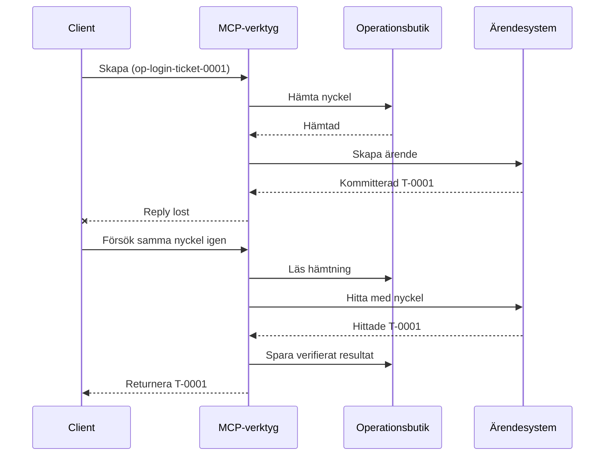
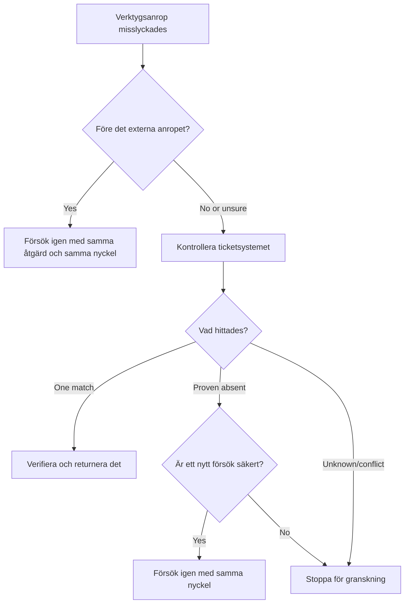

# Säkra försök för MCP-verktyg: Ett reliabilitets-sidecar-mönster

En saknad svar betyder inte att åtgärden saknas. Ett supportärendeverktyg
kan skapa ärende `T-0001` och sedan förlora sin anslutning innan klienten ser
resultatet. Om klienten försöker igen blint kan det skapa `T-0002`.

Denna lektion visar hur man känner igen det osäkra utfallet, behåller en stabil
identitet för den avsedda åtgärden och kontrollerar ärendesystemet innan man försöker
igen. Det medföljande Python-övningen körs lokalt med standardbiblioteket
och SQLite.

## Varför en timeout betyder "Utfall okänt"

Antag att klienten anropar `create_support_ticket` med operation nyckel
`op-login-ticket-0001`:



Anslutningen misslyckas efter att ärendet har sparats men innan resultatet anländer.
Klienten vet bara att svaret saknas. Den vet inte om
ärendet saknas. Att återanvända operation nyckeln låter verktyget hitta och returnera
`T-0001` istället för att skapa `T-0002`.

## Vad en reliabilitets-sidecar gör

En reliabilitets-sidecar är applikationskod som behåller återställningsstatus runt ett
verktyg. Det kan vara ett bibliotek, mellanprogramvara, en databashanterad tjänst, eller helt enkelt
en del av verktygets implementation. Det behöver inte vara en separat process,
och det är inte en funktion i MCP-protokollet.

Sidecaren har fyra uppgifter:

1. spara den avsedda åtgärden innan det externa systemet anropas;
2. låta endast en arbetare hävda den åtgärden;
3. komma ihåg tillräckligt med status för att återhämta sig efter en krasch; och
4. kontrollera det externa systemet när utfallet är osäkert.

Denna lektion riktar sig till den slutgiltiga MCP-specifikationen `2026-07-28`. MCP har ingen
protokollnivå-session, så operation nyckeln är ett vanligt verktygsargument
som stöds av hållbar applikationsstatus. Samma mönster fungerar också med tidigare
MCP-versioner.

## Fyra ID:n som löser olika problem

Dessa identifierare är relaterade, men de är inte utbytbara:

| Identifierare | Vad den identifierar | Överlever ett försök igen? |
| --- | --- | --- |
| JSON-RPC ID | En förfrågan och svar | Nej; använd ett nytt förfrågnings-ID |
| MCP Task ID | En långvarig uppgift | Ja; behåll den för polling |
| Operation nyckel | En avsedd åtgärd | Ja; återanvänd den för den åtgärden |
| Ärende-ID | Det lagrade resultatet | Ja; returnera det efter verifiering |

Framstegsaviseringar och spårningskontext hjälper dig att observera en förfrågan.
Avbokning ber om att arbetet stoppas. Ingen av dem förhindrar ett duplicerat ärende.

## Bygg vakten

Skapa operation nyckeln innan det första verktygsanropet och spara den med
arbetsflödet. Varje försök att skapa samma avsedda ärende använder samma nyckel:

```json
{
  "operation_key": "op-login-ticket-0001",
  "title": "Cannot sign in"
}
```

Ett annat avsett ärende får en ny nyckel. I produktion generera ett ogenomskinligt,
oförutsägbart värde istället för att lägga kunddata i nyckeln.

Här är det kompletta MCP-verktygsschemat som används i denna lektion:

```json
{
  "name": "create_support_ticket",
  "title": "Create support ticket",
  "description": "Creates or recovers one support ticket for an operation key.",
  "inputSchema": {
    "$schema": "https://json-schema.org/draft/2020-12/schema",
    "type": "object",
    "properties": {
      "operation_key": {
        "type": "string",
        "minLength": 16,
        "maxLength": 128,
        "description": "Stable key reused for the same intended action."
      },
      "title": {
        "type": "string",
        "minLength": 1,
        "maxLength": 200
      }
    },
    "required": ["operation_key", "title"],
    "additionalProperties": false
  },
  "outputSchema": {
    "$schema": "https://json-schema.org/draft/2020-12/schema",
    "type": "object",
    "properties": {
      "ticket_id": {
        "type": "string"
      },
      "operation_key": {
        "type": "string"
      },
      "status": {
        "type": "string",
        "const": "verified"
      }
    },
    "required": ["ticket_id", "operation_key", "status"],
    "additionalProperties": false
  }
}
```

Den autentiserade anroparens identitet kommer från serverkontext, inte från
modellens levererade verktygsinmatning. Begränsa varje sparad operation till:

- den anroparen, hyresgästen eller tjänstekontot;
- verktygets namn och version; och
- en hash av de normaliserade indata som definierar den externa åtgärden.

Inhashningen svarar på en enkel fråga: "Är detta försök igen en förfrågan om samma
ärende?" Om nyckeln redan tillhör en annan titel, avvisa anropet.
Att returnera ett tidigare resultat för ändrad inmatning skulle dölja ett kontraktsfel.

Spara anspråket med en atomär databasoperation. "Atomär" betyder att två arbetare
inte båda kan observera en tom post och båda bli ägare. En processlokal
låsning räcker inte när en annan serverinstans kan ta emot försöket igen.

Arbetsflödet skapar nyckeln medan åtgärden är `planned`. Exemplet
sparar sedan dessa tillstånd:

- `claimed`: en arbetare har reserverat operationen;
- `completed`: ärendesystemet returnerade ett resultat; och
- `verified`: en läsning från ärendesystemet bekräftar resultatet.

En krasch kan lämna det sparade tillståndet på `claimed` även efter att ärendet
skapades. Behandla varje icke-slutgiltigt anspråk som osäkert tills extern bevisning
fastställer det. Anta inte att `claimed` betyder "inget hände."

## Återställ innan du försöker igen

När ett verktygsanrop misslyckas, avgör vad som är känt innan ett nytt externt
skrivs:



Validering som misslyckas innan ärende-API:et anropas är ett känt fel.
Försök igen med samma operation nyckel för oförändrad åtgärd. Om korrigerande inmatning
ändrar det avsedda ärendet, skapa en ny nyckel för den nya åtgärden.

Om förfrågan kan ha nått ärendesystemet, anpassa den först.
Anpassning betyder att jämföra det sparade anspråket med den auktoritativa ärende-
posten. Returnera det befintliga ärendet när exakt en matchande post hittas.
Försök igen endast när ärendet är otvetydigt frånvarande och den nedströms kontrakten
gör ett nytt försök säkert.

"Hittades inte" är inte alltid avgörande. En leverantör med till sist konsekvent
sökning kan behöva en begränsad väntan och en ny kontroll. Om systemet inte kan
sökas, ger motstridiga resultat eller inte kan säkert deduplicera ett nytt
försök, stoppa och rapportera `utfall okänt`. Att stoppa här kallas ibland
"fail closed": arbetsflödet vägrar att gissa.

## Bevis, uppgifter och avbokning

Ett verktygssvar säger vad verktyget rapporterade. En sparad kontrollpunkt säger vad
arbetsflödet registrerade. Starkast bevis kommer från systemet som äger
resultatet: för detta exempel, en läsning från ärendesystemet som hittar exakt ett
matchande ärende.

Anpassa beviset till risken. En leverantörs meddelande-ID kan räcka för en
lågriskavisering. Betalningar, distributioner och destruktiva åtgärder kan
behöva leverantörsstatus, ledger eller manuell granskningsbevis.

MCP Tasks-tillägget kompletterar detta mönster för långvarigt arbete. En Task
ID låter klienten återuppta polling efter en frånkoppling, men det identifierar inte
eller deduplicerar ärendet självt. När Tasks används kopplas identiteterna
så här:

```text
operation key -> Task ID -> ticket ID -> verification evidence
```

Avbokning är samarbetsvillig, inte en rollback. Ärendet kan fortfarande skapas
efter att avbokningen bekräftats, så ett osäkert resultat behöver
fortfarande anpassning.

## Kör felinjektionsövningen

Exemplet använder två SQLite-filer: en representerar operationslagret och den
andra representerar det externa ärendesystemet. Det finns ingen transaktion som täcker
båda filerna. Felet injiceras efter att ärendet har sparats men innan
sidecar-delen registrerar fullbordandet.

Den direkta Python-metoden accepterar `caller_id` som en ersättning för autentiserad
serverkontext. Lägg inte till `caller_id` i den modellstyrda MCP-inmatnings
schemat.

Förutse resultatet innan du kör testerna:

| Sökväg | Resultat efter försök igen | Ärendeantal |
| --- | --- | --- |
| Blint försök igen | Skapar `T-0002` efter att svaret för `T-0001` gått förlorat | 2 |
| Garantiförsök igen | Hittar och returnerar `T-0001` | 1 |

Kör:

```bash
cd 08-BestPractices/reliability-sidecars/python
python -m unittest discover -p "test_*.py" -v
```

De sex testerna visar att:

1. ett blint försök igen skapar en dubblett;
2. svarsförlust plus en omstart återställer ett ärende från ett hållbart anspråk;
3. ett verifierat försök igen återanvänder det sparade resultatet;
4. ändrad inmatning eller motstridiga externa bevis avvisas;
5. ett befintligt anspråk utan externa bevis stoppar säkert; och
6. samtidiga anspråk godkänner en ägare utan att reducera ett verifierat resultat.

Öppna exemplet:

- [Python-implementation](../../../../08-BestPractices/reliability-sidecars/python/reliability_sidecar.py)
- [Deterministiska tester](../../../../08-BestPractices/reliability-sidecars/python/test_reliability_sidecar.py)

Exemplet utelämnar medvetet stale-claim-leasing. En produktionspolicy för övertagande
behöver en begränsad leasing, atomär ägarskapsöverföring och ytterligare en extern
kontroll innan verkställande.

## Valfri community-implementation

Agent Enhancer Utilities är en community-implementation av detta
applikationsnivå-mönster. Dess planerare väljer en återhämtningsmetod, medan dess
checkpoint registrerar anspråk och osäkra resultat. Domänverktyget eller MCP-
servern utför och verifierar fortfarande den verkliga åtgärden. Denna tjänst är inte del
av MCP-specifikationen och är inte nödvändig för denna lektion.

| Lektionens koncept | Agent Enhancer-del | Viktig begränsning |
| --- | --- | --- |
| Återhämtningsplan | `workflow-guard-planner` | Anropar inte domänverktyget |
| Anspråk och återhämtning | `workflow-checkpoint` | `external_proof` förblir `false` |
| Exakt sidecar-uppspelning | `lab.invoke_tool` | Använder en separat idempotensnyckel |
| Verifiera verklig åtgärd | Destination sökning/läsning | Domän MCP äger det |

För ett exakt försök igen av en sidecar-anrop accepterar `lab.invoke_tool` en yttre
`idempotency_key`. Den nyckeln identifierar sidecar-anropet; det är inte den
affärsrelaterade `operation_key` som används för ärendet.

Den taggade offentliga kontrakten och ett valfritt nätverksexempel finns
här:

- [Reliability Sidecar Contract v1](https://github.com/artiehinz/Agent-Enhancer-Utilities/blob/v1.6.0/docs/RELIABILITY_SIDECAR_CONTRACT_V1.md)
- [Planner och mock-domain-example](https://github.com/artiehinz/Agent-Enhancer-Utilities/tree/v1.6.0/examples/reliability-sidecar)

Dessa länkar illustrerar applikationsmönstret. De hävdar inte att den
hostade tjänsten följer MCP `2026-07-28`, och checkpoint-status räknas aldrig
som extern bevisning av ärendet.

## Produktionschecklista

- [ ] Skapa och spara operation nyckeln innan första externa försöket.
- [ ] Binda nyckeln till anroparens identitet, verktygsversion och normaliserad inhash.
- [ ] Avvisa ändrad inmatning under en befintlig nyckel.
- [ ] Tillåt en ägare med en atomär delad lagringsoperation.
- [ ] Vidarebefordra nyckeln till nedströmsleverantören när den stöder idempotens.
- [ ] Anpassa osäkra utfall innan nästa skrivning.
- [ ] Bevara verifierade resultat och bevis för hela återförsökfönstret.
- [ ] Stoppa för granskning när det externa utfallet inte kan fastställas säkert.

## Referenser

- [MCP-specifikation `2026-07-28`](https://modelcontextprotocol.io/specification/2026-07-28)
- [MCP `2026-07-28` verktygsanvisningar](https://modelcontextprotocol.io/specification/2026-07-28/server/tools)
- [MCP Tasks-tillägg](https://modelcontextprotocol.io/extensions/tasks/overview)
- [JSON-RPC 2.0 specification](https://www.jsonrpc.org/specification)

---

<!-- CO-OP TRANSLATOR DISCLAIMER START -->
**Ansvarsfriskrivning**:
Detta dokument har översatts med hjälp av AI-översättningstjänsten [Co-op Translator](https://github.com/Azure/co-op-translator). Även om vi strävar efter noggrannhet, var vänlig notera att automatiska översättningar kan innehålla fel eller brister. Det ursprungliga dokumentet på dess modersmål bör betraktas som den auktoritativa källan. För kritisk information rekommenderas professionell mänsklig översättning. Vi ansvarar inte för några missförstånd eller feltolkningar som uppstår till följd av användningen av denna översättning.
<!-- CO-OP TRANSLATOR DISCLAIMER END -->