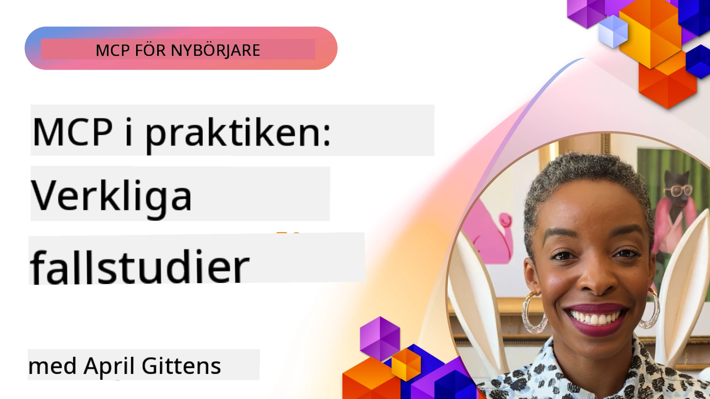

# MCP i praktiken: Fallstudier från verkliga livet

_(Klicka på bilden ovan för att se lektionen i videoform)_

Model Context Protocol (MCP) förändrar hur AI-applikationer interagerar med data, verktyg och tjänster. Denna sektion presenterar fallstudier från verkliga livet som visar praktiska tillämpningar av MCP i olika företagsmiljöer.

## Översikt

Denna sektion visar konkreta exempel på MCP-implementeringar och lyfter fram hur organisationer använder detta protokoll för att lösa komplexa affärsutmaningar. Genom att studera dessa fallstudier får du insikter i MCP:s mångsidighet, skalbarhet och praktiska fördelar i verkliga scenarier.

## Viktiga lärandemål

Genom att utforska dessa fallstudier kommer du att:

- Förstå hur MCP kan tillämpas för att lösa specifika affärsproblem
- Lära dig om olika integrationsmönster och arkitekturmetoder
- Känna igen bästa praxis för implementering av MCP i företagsmiljöer
- Få insikter i de utmaningar och lösningar som mötts i verkliga implementationer
- Identifiera möjligheter att använda liknande mönster i dina egna projekt

## Utvalda fallstudier

### 1. [Azure AI Travel Agents – Referensimplementation](./travelagentsample.md)

Denna fallstudie granskar Microsofts omfattande referenslösning som visar hur man bygger en multi-agent, AI-driven reseplaneringsapplikation med MCP, Azure OpenAI och Azure AI Search. Projektet visar:

- Multi-agent orkestrering genom MCP
- Företagsdataintegration med Azure AI Search
- Säker och skalbar arkitektur med Azure-tjänster
- Utbyggbara verktyg med återanvändbara MCP-komponenter
- Konversationsbaserad användarupplevelse driven av Azure OpenAI

Arkitektur- och implementeringsdetaljerna ger värdefulla insikter i hur man bygger komplexa multi-agent system med MCP som koordineringslager.

### 2. [Uppdatering av Azure DevOps-objekt med YouTube-data](./UpdateADOItemsFromYT.md)

Denna fallstudie visar en praktisk tillämpning av MCP för att automatisera arbetsflöden. Den visar hur MCP-verktyg kan användas för att:

- Extrahera data från onlineplattformar (YouTube)
- Uppdatera arbetsobjekt i Azure DevOps-system
- Skapa upprepningsbara automatiseringsarbetsflöden
- Integrera data över skilda system

Exemplet illustrerar hur även relativt enkla MCP-implementeringar kan ge avsevärda effektivitetsvinster genom att automatisera rutinuppgifter och förbättra datakonsistensen mellan system.

### 3. [Dokumentationshämtning i realtid med MCP](./docs-mcp/README.md)

Denna fallstudie guidar dig genom att koppla en Python-konsolklient till en Model Context Protocol (MCP)-server för att hämta och logga Microsoft-dokumentation i realtid som är kontextmedveten. Du lär dig hur man:

- Ansluter till en MCP-server med en Python-klient och den officiella MCP SDK:n
- Använder streaming HTTP-klienter för effektiv dokumentationshämtning i realtid
- Anropar dokumentationsverktyg på servern och loggar svar direkt till konsolen
- Integrerar uppdaterad Microsoft-dokumentation i ditt arbetsflöde utan att lämna terminalen

Kapitel avhandlar en praktisk uppgift, ett minimalt fungerande kodexempel och länkar till ytterligare resurser för djupare lärande. Se den fullständiga genomgången och koden i det länkade kapitlet för att förstå hur MCP kan förändra tillgång till dokumentation och utvecklarproduktivitet i konsolbaserade miljöer.

### 4. [Interaktiv webbapp för studieplansgenerering med MCP](./docs-mcp/README.md)

Denna fallstudie visar hur man bygger en interaktiv webbapplikation med Chainlit och Model Context Protocol (MCP) för att generera personliga studieplaner för vilket ämne som helst. Användare kan ange ett ämne (som "AI-900 certifiering") och en studietid (t.ex. 8 veckor), och appen ger en vecka-för-vecka nedbrytning av rekommenderat innehåll. Chainlit möjliggör en konversationsbaserad chattgränssnitt som gör upplevelsen engagerande och adaptiv.

- Konversationsbaserad webbapp driven av Chainlit
- Användardrivna promptar för ämne och tid
- Vecka-för-vecka innehållsrekommendationer med MCP
- Real-tids, adaptiva svar i en chattgränssnitt

Projektet illustrerar hur konversations-AI och MCP kan kombineras för att skapa dynamiska, användardrivna utbildningsverktyg i en modern webbmiljö.

### 5. [Dokumentation i redigeraren med MCP-server i VS Code](./docs-mcp/README.md)

Denna fallstudie visar hur du kan ta in Microsoft Learn Docs direkt i din VS Code-miljö med MCP-servern—ingen mer flikväxling i webbläsaren! Du får se hur man:

- Omedelbart söker och läser dokumentation inuti VS Code med MCP-panelen eller kommandopaletten
- Refererar till dokumentation och infogar länkar direkt i din README- eller kursmarkdown-filer
- Använder GitHub Copilot och MCP tillsammans för sömlösa, AI-drivna dokumentations- och kodarbetsflöden
- Validerar och förbättrar din dokumentation med feedback i realtid och Microsoft-säkrad noggrannhet
- Integrerar MCP med GitHub-arbetsflöden för kontinuerlig dokumentationsvalidering

Implementeringen inkluderar:

- Exempel på `.vscode/mcp.json` konfiguration för enkel installation
- Skärmbildsbaserade genomgångar av in-editor-upplevelsen
- Tips för att kombinera Copilot och MCP för maximal produktivitet

Detta scenario är idealiskt för kursförfattare, dokumentationsförfattare och utvecklare som vill behålla fokus i sin editor medan de arbetar med dokumentation, Copilot och valideringsverktyg—allt drivet av MCP.

### 6. [Skapande av APIM MCP-server](./apimsample.md)

Denna fallstudie ger en steg-för-steg-guide om hur man skapar en MCP-server med Azure API Management (APIM). Den täcker:

- Uppstart av en MCP-server i Azure API Management
- Exponering av API-operationer som MCP-verktyg
- Konfigurering av policyer för hastighetsbegränsning och säkerhet
- Testning av MCP-servern med Visual Studio Code och GitHub Copilot

Exemplet visar hur man utnyttjar Azures kapacitet för att skapa en robust MCP-server som kan användas i olika applikationer och förbättra integrationen av AI-system med företags-API:er.

### 7. [GitHub MCP Registry — Accelererar agentintegration](https://github.com/mcp)

Denna fallstudie undersöker hur GitHubs MCP Registry, lanserat i september 2025, löser en kritisk utmaning i AI-ekosystemet: den splittrade upptäckten och distributionen av Model Context Protocol (MCP) servrar.

#### Översikt
**MCP-registret** löser smärtan med utspridda MCP-servrar över repositories och register, vilket tidigare gjorde integration långsam och felbenägen. Dessa servrar gör det möjligt för AI-agenter att interagera med externa system som API:er, databaser och dokumentationskällor.

#### Problemställning
Utvecklare som bygger agentbaserade arbetsflöden har mött flera utmaningar:
- **Dålig upptäckbarhet** av MCP-servrar på olika plattformar
- **Redundanta uppsättningsfrågor** utspridda över forum och dokumentation
- **Säkerhetsrisker** från icke verifierade och opålitliga källor
- **Brist på standardisering** i serverkvalitet och kompatibilitet

#### Lösningsarkitektur
GitHubs MCP Registry centraliserar betrodda MCP-servrar med nyckelfunktioner:
- **Installera med ett klick** via VS Code för enkel setup
- **Signal-över-brus sortering** baserat på stjärnor, aktivitet och communityvalidering
- **Direkt integration** med GitHub Copilot och andra MCP-kompatibla verktyg
- **Öppet bidragsmodell** som möjliggör bidrag från både community och företagsparter

#### Affärspåverkan
Registret har levererat mätbara förbättringar:
- **Snabbare onboarding** för utvecklare med verktyg som Microsoft Learn MCP Server, som strömmar officiell dokumentation direkt till agenter
- **Förbättrad produktivitet** via specialiserade servrar som `github-mcp-server`, vilket möjliggör naturlig språkstyrd GitHub-automation (PR-skapande, CI-omkörningar, kodscanning)
- **Starkare förtroende för ekosystemet** genom kuraterade listor och transparenta konfigurationsstandarder

#### Strategiskt värde
För praktiker specialiserade på agentlivscykelhantering och repeterbara arbetsflöden erbjuder MCP-registret:
- **Modulär agentdistribuering** med standardiserade komponenter
- **Registrets stödda evalueringspipelines** för konsekvent testning och validering
- **Tvärverktygsinteroperabilitet** som möjliggör sömlös integration över olika AI-plattformar

Denna fallstudie visar att MCP-registret är mer än bara en katalog—det är en grundläggande plattform för skalbar, verklig modellintegration och agentbaserad systemdistribuering.

### 8. [Publicering till sociala nätverk från en agent](./publora-social-publishing.md)

Denna fallstudie går igenom en **skrivbar fjärr-MCP-server** — en vars verktyg utför irreversibla åtgärder på användarens vägnar — med social publicering som exempel. En agent skriver ett inlägg, en människa godkänner det, och servern schemalägger det över nätverk.

Det intressanta är designbegränsningarna som publicering medför och som gäller för vilken server som helst som skriver snarare än läser:

- **Öppen upptäckt, autentiserad exekvering** — `tools/list` besvaras utan autentisering så att register och klienter kan undersöka innehållet, medan varje `tools/call` kräver en token och annars returnerar `401` med en `WWW-Authenticate`-header
- **OAuth-registrering utan steg utanför bandet** — dynamisk klientregistrering idag, med Client ID Metadata Documents enligt riktningen i specifikationen `2026-07-28`
- **Verktygsannoteringar** (`readOnlyHint`, `destructiveHint`, `idempotentHint`) som klienter använder för att avgöra vad som ska bekräftas — ledtrådar snarare än tvång, och något som kopplingskataloger nu förväntar sig vid granskning
- **Oupptäckbara identifierare**, så att hallucinerade värden felaktigt signaleras istället för att agera på ett trovärdigt utseende
- **Idempotentnycklar på verktyg som skapar inlägg**, så att en agents runtime-omförsök inte resulterar i duplicerad publicering
- **En no-op-målbeskrivning i verktygsschemat** som testkör hela skrivvägen utan att publicera något, för granskare och CI

Kapitel avslutas med en kort checklista som du kan applicera på en server du bygger.

## Slutsats

Dessa åtta omfattande fallstudier visar på Model Context Protocols anmärkningsvärda mångsidighet och praktiska tillämpningar i olika verkliga scenarier. Från komplexa multi-agent reseplaneringssystem och företags-API-hantering till effektiva dokumentationsarbetsflöden och det revolutionerande GitHub MCP-registret, visar dessa exempel hur MCP erbjuder ett standardiserat, skalbart sätt att koppla AI-system till de verktyg, data och tjänster de behöver för att leverera fantastiskt värde.

Fallstudierna sträcker sig över flera dimensioner av MCP-implementering:
- **Företagsintegration**: Azure API Management och automatisering i Azure DevOps
- **Multi-Agent orkestrering**: Resebranschplanering med koordinerade AI-agenter
- **Utvecklarproduktivitet**: Integration i VS Code och tillgång till dokumentation i realtid
- **Ekosystemutveckling**: GitHubs MCP-registry som grundläggande plattform
- **Utbildningsapplikationer**: Interaktiva studieplangeneratorer och konversationsgränssnitt

Genom att studera dessa implementationer får du viktiga insikter i:
- **Arkitekturmönster** för olika skala och användningsfall
- **Implementeringsstrategier** som balanserar funktionalitet med underhållbarhet
- **Säkerhets- och skalbarhets**överväganden för produktionsdistribueringar
- **Bästa praxis** för MCP-serverutveckling och klientintegration
- **Ekosystemtänkande** för att bygga sammankopplade AI-drivna lösningar

Dessa exempel visar tillsammans att MCP inte bara är en teoretisk modell utan ett moget, produktionsklart protokoll som möjliggör praktiska lösningar på komplexa affärsutmaningar. Oavsett om du bygger enkla automatiseringsverktyg eller avancerade multi-agent-system, ger de mönster och metoder som illustreras här en stabil grund för dina egna MCP-projekt.

## Ytterligare resurser

- [Azure AI Travel Agents GitHub Repository](https://github.com/Azure-Samples/azure-ai-travel-agents)
- [Azure DevOps MCP Tool](https://github.com/microsoft/azure-devops-mcp)
- [Playwright MCP Tool](https://github.com/microsoft/playwright-mcp)
- [Microsoft Docs MCP Server](https://github.com/MicrosoftDocs/mcp)
- [GitHub MCP Registry — Accelererar agentintegration](https://github.com/mcp)
- [MCP Community Examples](https://github.com/microsoft/mcp)

## Vad händer härnäst

- Föregående: [Modul 8: Bästa praxis](../08-BestPractices/README.md)
- Nästa: [Modul 10: Effektivisera AI-arbetsflöden: Bygga en MCP-server med AI Toolkit](../10-StreamliningAIWorkflowsBuildingAnMCPServerWithAIToolkit/README.md)

---

<!-- CO-OP TRANSLATOR DISCLAIMER START -->
**Ansvarsfriskrivning**:
Detta dokument har översatts med hjälp av AI-översättningstjänsten [Co-op Translator](https://github.com/Azure/co-op-translator). Även om vi strävar efter noggrannhet, var vänlig notera att automatiska översättningar kan innehålla fel eller brister. Det ursprungliga dokumentet på dess modersmål bör betraktas som den auktoritativa källan. För kritisk information rekommenderas professionell mänsklig översättning. Vi ansvarar inte för några missförstånd eller feltolkningar som uppstår till följd av användningen av denna översättning.
<!-- CO-OP TRANSLATOR DISCLAIMER END -->