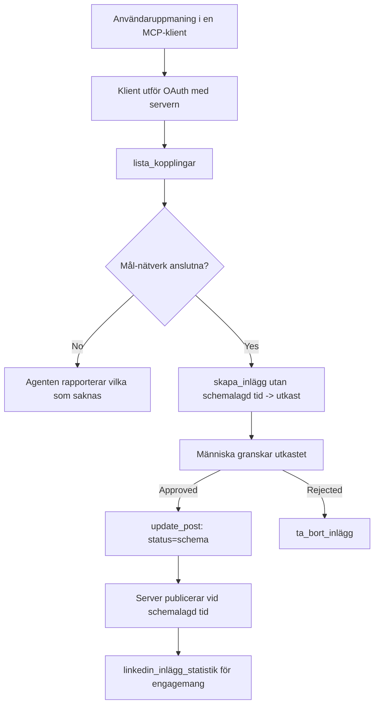

# Fallstudie: Publicering till sociala nätverk från en agent med en fjärr-MCP-server

> **Disclaimer:** Flera tjänster och open source-projekt kan publicera till sociala nätverk, och ett team kan också integrera varje nätverks API direkt. Scenariot nedan ges som ett genomarbetat exempel på hur en **skrivkapabel fjärr-MCP-server** kan utformas och användas. Publora är en kommersiell tjänst med ett gratisnivå; mönstren som beskrivs här gäller för vilken MCP-server som helst som utför irreversibla åtgärder på en användares vägnar.

## Översikt

Agenter är bra på att utforma innehåll men dåliga på att leverera det. En modell kan skriva ett pressmeddelande på sekunder, och sedan upphör arbetet: att publicera det innebär ett API per nätverk, en OAuth-app per nätverk och en annan uppsättning medieregler för varje. De flesta team löser detta genom att kopiera texten till en webbläsare för hand.

Denna fallstudie tittar på hur det sista steget stängs med en enda fjärr-MCP-server, och — mer användbart för den som bygger en — på de designbeslut som en **skrivkapabel** server måste få rätt. Att läsa data är förlåtande. Att publicera är inte det: ett felaktigt verktygsanrop syns för en publik och kan inte ångras.

## Scenario

Ett litet developer-relations-team utformar inlägg i en agent (Claude, VS Code, Cursor — klienten spelar ingen roll). De vill att agenten ska:

- se vilka sociala konton teamet har kopplat,
- utforma ett inlägg och behålla det som ett utkast för mänskligt godkännande,
- bifoga en bild,
- schemalägga det till flera nätverk vid vald tid,
- och senare rapportera hur det presterade.

Det är avgörande att de vill att agenten *inte ska* kunna publicera av misstag medan de fortfarande experimenterar.

## Använda verktyg

- [Publora MCP Server](https://github.com/publora/mcp-server) — en fjärr-MCP-server (`streamable-http`) som exponerar publicering, schemaläggning, media och LinkedIn-analysverktyg. Registrerad i den officiella MCP-registret som `com.publora/mcp-server`.

## Steg-för-steg arbetsflöde

1. **Anslut servern.** Klienter som använder OAuth fullbordar auktoriseringskodflödet med PKCE mot serverns egen samtyckesskärm; klienter som inte gör det, som headless CLI:er, använder en Publora API-nyckel i en header. Båda vägarna stöds, och vilken du får beror på klienten, inte på servern.
2. **Lista anslutningar.** Agenten anropar `list_connections` och får tillbaka de anslutna kontona med deras identifierare.
3. **Skriv utkastet.** Agenten anropar `create_post` *utan* ett schemalagt tid. Inlägget sparas som ett utkast – ingenting publiceras.
4. **Bifoga media.** Offentliga bild-URL:er skickas med i samma anrop; servern laddar ner och validerar dessa.
5. **Schemalägg.** Efter att en människa godkänt ändrar `update_post` status till schemalagd med en ISO 8601-tid.
6. **Mät.** För LinkedIn returnerar `linkedin_post_stats` engagemang när inlägget är live.

## Exempelprompt

```text
Which social accounts do I have connected?
Draft a post announcing our new changelog page, attach the screenshot at
https://example.com/changelog.png, and keep it as a draft — do not publish it.
Once I approve, schedule it to LinkedIn and Bluesky for tomorrow at 09:00 UTC.
```

## Mermaid-flödesschema



## Teknisk implementation

Lärdomarna nedan är den överförbara delen av denna fallstudie.

### Öppen upptäckt, autentiserad exekvering

`tools/list` tillhandahålls utan autentisering; varje `tools/call` kräver en token
och returnerar annars `401` med en `WWW-Authenticate` header som pekar på
protected-resource metadata. Serverns äldre endpoint svarar också på ett
icke-autentiserat `initialize` för klienter med protokollversioner innan
`2026-07-28`; nuvarande klienter använder inte detta handslag.

Denna serverspecifika uppdelning låter register, kataloger och klienter inspektera verktygsnamn,
scheman och annotationer utan en hemlighet, samtidigt som anonym
exekvering förhindras. Öppen upptäckt är ett driftsättningsval, inte ett MCP-krav; en
skyddad driftsättning kan också kräva auktorisation för `tools/list`.

### Registrering: dynamisk klientregistrering, och vad som ersätter den

Servern annonserar `/.well-known/oauth-protected-resource` och `/.well-known/oauth-authorization-server`, och stödjer auktoriseringskodflödet med PKCE (`S256`), uppfräschnings-token och **dynamisk klientregistrering**.

Dynamisk registrering tog bort det manuella steget för äldre klienter: utan den
behövde varje klient ett förututfärdat `client_id` från leverantören.

Behandla detta som kompatibilitetsbeteende snarare än som en design att kopiera. Revisionen `2026-07-28` av specifikationen avskrivs dynamisk klientregistrering till förmån för Client ID Metadata Documents, där klienten hostar ett metadata-dokument på en stabil HTTPS-URL och den URL:en *är* `client_id`. DCR fortsätter fungera för nu, men en server som byggs idag bör planera för CIMD och behålla DCR endast för äldre klienter.

### Verktygs-annoteringar är inte dekoration

Varje verktyg bär en `title` och tillämpliga ledtrådar: `readOnlyHint`, `destructiveHint`, `idempotentHint`, `openWorldHint`.

Två skäl att investera i dem. För det första använder klienter ledtrådarna för att avgöra vad som ska bekräftas med användaren — en klient kan automatiskt köra en läs-only uppslagning och stoppa för godkännande före en radering. Specifikationen är tydlig med att annotationer är opålitliga ledtrådar, inte en auktorisationsmekanism: de formar vad en klient erbjuder att göra, de stoppar inget på servern, och en server måste fortfarande upprätthålla sina egna regler. För det andra kräver de stora connector-katalogerna nu *dem* för granskning; en server vars verktyg saknar titlar och ledtrådar kommer att skickas tillbaka oavsett hur väl den fungerar.

### Gör identifierare oinrättbara

Plattformidentifierare är ogenomskinliga strängar som returneras av `list_connections`, och schema-beskrivningen säger explicit att de måste kopieras ordagrant och aldrig gissas. Servern avvisar allt annat.

Modeller är flytande gissare. Varje skrivkapabel server bör anta att en identifierare så småningom kommer att hallucineras och låta den vägen falla högljutt och tidigt, snarare än att agera på ett rimligt utseende värde.

### Misslyckas före publicering, med ett åtgärdbart meddelande

Vissa nätverk vägrar text-inlägg och kräver en bild eller video. Det valideras när inlägget schemaläggs, och felet namnger plattformen och den saknade kravet.

En agent kan återhämta sig från "Instagram kräver media — bifoga en bild eller video" utan en ny tur. Den kan inte återhämta sig från en generisk `400`.

### Gör omförsök säkra

De två verktygen som skapar innehåll, `create_post` och `update_post`, accepterar en idempotensnyckel: att återanvända den med en identisk begäran upprepar det ursprungliga svaret istället för att skapa ett andra inlägg. Agentkörningar gör omförsök vid timeout; utan idempotens blir ett långsamt svar en dubblettpublicering. De andra skrivverktygen – raderingar, mediasteg, LinkedIn-reaktioner och kommentarer – tar inte en nyckel, så omförsök där är inte automatiskt säkra. Värt att veta vilka av dina egna mutationer som är skyddade och vilka som inte är det.

### Ge ett sätt att testa som inte publicerar någonting

Servern accepterar ett reserverat mål, `publora-playground`, som valideras och bekräftas som en riktig destination och sedan förkastas – inget når ett livekonto. Det beskrivs i verktygsschemat självt, som vilken klient som helst kan läsa utan autentisering: fältet `platforms` av `create_post` dokumenterar det som "ett anslutningstestmål som inte kräver någon riktig anslutning — inlägget bekräftas och förkastas, ingenting publiceras". Anropa det genom att skicka det som enda inmatning: `platforms: ["publora-playground"]`.

Detta visade sig vara en av de mest användbara detaljerna på hela ytan. Granskare av connector-kataloger, bidragsgivare och CI kan köra hela skrivvägen från början till slut utan risk för en riktig publik. Alla MCP-servrar med irreversibla åtgärder har nytta av ett dokumenterat no-op mål.

## Resultat och påverkan

- Publiceringssteget flyttades från en webbläsare till samma konversation där innehållet skrivs, och en vana med utkast först håller en människa involverad. Var noga med vad det betyder: ett utkast är en konvention, inte en gräns. Samma behörighet kan schemalägga eller publicera, så den som behöver ett riktigt godkännande måste upprätthålla det utanför verktygsytan — separata behörigheter eller ett policylager framför servern.
- Per-nätverks-differenser — mediekrav, trådning, svarskontroller — hanteras en gång i servern istället för i varje agent som pratar med den.
- Samma server stödjer flera MCP-klienter utan förututfärdade behörigheter.
    Nuvarande klienter kan använda Client ID Metadata Documents; DCR förblir en fallback
    för äldre klienter.
- Designbegränsningarna ovan formades lika mycket av connector-kataloggranskningar som av användare: annotationer, OAuth och ett säkert testmål krävdes av minst en av dessa.

## Referenser

- [Publora MCP Server (källkod)](https://github.com/publora/mcp-server)
- [Publora API och MCP-dokumentation](https://docs.publora.com)
- [MCP Registry poster: `com.publora/mcp-server`](https://registry.modelcontextprotocol.io/v0/servers?search=com.publora/mcp-server)
- [MCP-specifikation — Auktorisation](https://modelcontextprotocol.io/specification/2026-07-28/basic/authorization)
- [MCP-specifikation — Verktygsannotationer](https://modelcontextprotocol.io/docs/concepts/tools)

## Vad nu?

- Ta en MCP-server du bygger och kontrollera de tre billigaste vinsterna här: annotationer på varje verktyg, en idempotensnyckel på varje skrivning, och ett dokumenterat no-op mål.
- Testa den öppna upptäcktsuppdelningen: anropa `tools/list` mot en publik fjärrserver utan autentisering, sedan anropa ett verktyg och inspektera `401`-utmaningen.
- Fundera på vad "ångra" betyder för din domän. Publicering har utkast och radering; om dina åtgärder inte har motsvarighet, hör bekräftelse hemma i verktygsdesignen, inte i prompten.

---

<!-- CO-OP TRANSLATOR DISCLAIMER START -->
**Ansvarsfriskrivning**:
Detta dokument har översatts med hjälp av AI-översättningstjänsten [Co-op Translator](https://github.com/Azure/co-op-translator). Även om vi strävar efter noggrannhet, var vänlig notera att automatiska översättningar kan innehålla fel eller brister. Det ursprungliga dokumentet på dess modersmål bör betraktas som den auktoritativa källan. För kritisk information rekommenderas professionell mänsklig översättning. Vi ansvarar inte för några missförstånd eller feltolkningar som uppstår till följd av användningen av denna översättning.
<!-- CO-OP TRANSLATOR DISCLAIMER END -->