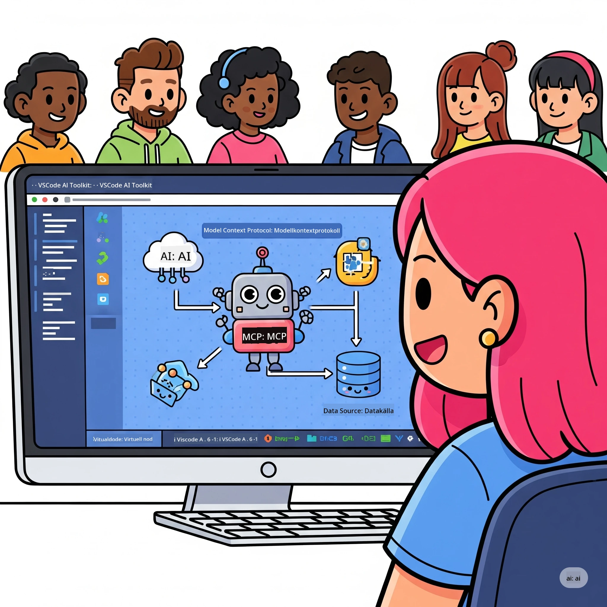
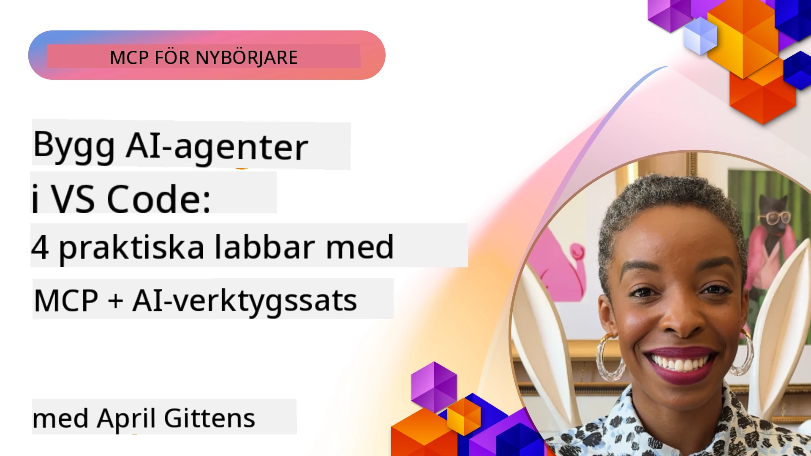

# Effektivisera AI-arbetsflöden: Bygga en MCP-server med Microsoft Foundry Toolkit

## 🎯 Översikt

_(Klicka på bilden ovan för att se video av denna lektion)_

Välkommen till **Model Context Protocol (MCP) Workshop**! Denna omfattande praktiska workshop kombinerar två banbrytande tekniker för att revolutionera AI-applikationsutveckling:

> **Kompatibilitetsnotis:** workshopens kod byggdes och testades med MCP
> `2025-11-25`, som visas av märket ovan. Använd
> [aktuella `2026-07-28` specifikationen](https://modelcontextprotocol.io/specification/2026-07-28/)
> för nya protokollimplementationer och granska SDK-släppnoterna innan
> du migrerar laborationerna.

- **🔗 Model Context Protocol (MCP)**: En öppen standard för sömlös AI-verktygsintegration
- **🛠️ Microsoft Foundry Toolkit Extension för VS Code**: Microsofts kraftfulla AI-utvecklingsförlängning

### 🎓 Vad du kommer att lära dig

Vid slutet av denna workshop kommer du att bemästra konsten att bygga intelligenta applikationer som kopplar AI-modeller till verkliga verktyg och tjänster. Från automatiserade tester till anpassade API-integrationer får du praktiska färdigheter för att lösa komplexa affärsutmaningar.

## 🏗️ Teknologistack

### 🔌 Model Context Protocol (MCP)

MCP är **"USB-C för AI"** - en universell standard som ansluter AI-modeller till externa verktyg och datakällor.

**✨ Viktiga funktioner:**

- 🔄 **Standardiserad integration**: Universellt gränssnitt för AI-verktygskopplingar
- 🏛️ **Flexibel arkitektur**: Lokala & fjärrservrar via stdio/SSE-transport
- 🧰 **Rikt ekosystem**: Verktyg, uppmaningar och resurser i ett protokoll
- 🔒 **Färdig för företag**: Inbyggd säkerhet och tillförlitlighet

**🎯 Varför MCP är viktigt:**
Precis som USB-C eliminerade kabelkaos, eliminerar MCP komplexiteten i AI-integrationer. Ett protokoll, oändliga möjligheter.

### 🤖 Microsoft Foundry Toolkit Extension för VS Code

Microsofts flagship AI-utvecklingsförlängning som förvandlar VS Code till en AI-kraftstation.

**🚀 Kärnfunktioner:**

- 📦 **Model Catalog**: Tillgång till modeller från Azure AI, GitHub, Hugging Face, Ollama
- ⚡ **Lokal inferens**: ONNX-optimerad CPU/GPU/NPU-körning
- 🏗️ **Agent Builder**: Visuell AI-agentutveckling med MCP-integration
- 🎭 **Multimodal**: Stöd för text, vision och strukturerad utdata

**💡 Utvecklingsfördelar:**

- Nollkonfigurations modellutrullning
- Visuell promptdesign
- Realtids testmiljö
- Sömlös integration med MCP-server

## 📚 Inlärningsresa

### [🚀 Modul 1: Microsoft Foundry Toolkit Grunder](./lab1/README.md)

**Varaktighet**: 15 minuter

- 🛠️ Installera och konfigurera Microsoft Foundry Toolkit för VS Code
- 🗂️ Utforska Model Catalog (100+ modeller från GitHub, ONNX, OpenAI, Anthropic, Google)
- 🎮 Bemästra den interaktiva lekplatsen för realtidstestning av modeller
- 🤖 Bygg din första AI-agent med Agent Builder
- 📊 Utvärdera modellprestanda med inbyggda mått (F1, relevans, likhet, sammanhang)
- ⚡ Lär dig batchbearbetning och multimodala stöd

**🎯 Läranderesultat**: Skapa en fungerande AI-agent med omfattande förståelse för Microsoft Foundry Toolkits möjligheter

### [🌐 Modul 2: MCP med Microsoft Foundry Toolkit Grunder](./lab2/README.md)

**Varaktighet**: 20 minuter

- 🧠 Bemästra Model Context Protocol (MCP) arkitektur och koncept
- 🌐 Utforska Microsofts MCP-serverekosystem
- 🤖 Bygg en webbläsarautomationsagent med Playwright MCP-server
- 🔧 Integrera MCP-servrar med Microsoft Foundry Toolkit Agent Builder
- 📊 Konfigurera och testa MCP-verktyg inom dina agenter
- 🚀 Exportera och distribuera MCP-drivna agenter för produktion

**🎯 Läranderesultat**: Distribuera en AI-agent driven av externa verktyg via MCP

### [🔧 Modul 3: Avancerad MCP-utveckling med Microsoft Foundry Toolkit](./lab3/README.md)

**Varaktighet**: 20 minuter

- 💻 Skapa anpassade MCP-servrar med Microsoft Foundry Toolkit
- 🐍 Konfigurera och använd senaste MCP Python SDK (v1.9.3)
- 🔍 Sätt upp och använd MCP Inspector för felsökning
- 🛠️ Bygg en Weather MCP Server med professionella felsökningsarbetsflöden
- 🧪 Felsök MCP-servrar i både Agent Builder och Inspector-miljöer

**🎯 Läranderesultat**: Utveckla och felsök anpassade MCP-servrar med moderna verktyg

### [🐙 Modul 4: Praktisk MCP-utveckling - Anpassad GitHub Clone Server](./lab4/README.md)

**Varaktighet**: 30 minuter

- 🏗️ Bygg en verklig GitHub Clone MCP Server för utvecklingsarbetsflöden
- 🔄 Implementera smart kloning av repos med validering och felhantering
- 📁 Skapa intelligent kataloghantering och VS Code-integration
- 🤖 Använd GitHub Copilot Agent Mode med anpassade MCP-verktyg
- 🛡️ Tillämpa produktionsklar tillförlitlighet och plattformsoberoende kompatibilitet

**🎯 Läranderesultat**: Distribuera en produktionsklar MCP-server som effektiviserar riktiga utvecklingsarbetsflöden

## 💡 Verkliga Användningsområden & Påverkan

### 🏢 Företagsanvändningsfall

#### 🔄 DevOps Automation

Förändra ditt utvecklingsarbetsflöde med intelligent automation:

- **Smart Repositoryhantering**: AI-driven kodgranskning och sammanslagningsbeslut
- **Intelligent CI/CD**: Automatiserad pipelineoptimering baserad på kodändringar
- **Issue Triage**: Automatisk buggklassificering och tilldelning

#### 🧪 Revolution inom Kvalitetssäkring

Höj testningen med AI-driven automation:

- **Intelligent testgenerering**: Skapa omfattande testsuiter automatiskt
- **Visuell regressionstestning**: AI-driven upptäckt av UI-förändringar
- **Prestandaövervakning**: Proaktiv identifiering och lösning av problem

#### 📊 Data Pipeline Intelligens

Bygg smartare datahanteringsarbetsflöden:

- **Adaptiva ETL-processer**: Självoptimerande datatransformationer
- **Anomalidetektion**: Realtidsövervakning av datakvalitet
- **Intelligent dirigering**: Smart hantering av dataflöde

#### 🎧 Förbättring av kundupplevelse

Skapa exceptionella kundinteraktioner:

- **Kontextmedveten support**: AI-agenter med tillgång till kundhistorik
- **Proaktiv problemlösning**: Prediktiv kundservice
- **Multikanalsintegration**: Enhetlig AI-upplevelse över plattformar

## 🛠️ Förutsättningar & Installation

### 💻 Systemkrav

| Komponent | Krav | Anteckningar |
|-----------|-------------|-------|
| **Operativsystem** | Windows 10+, macOS 10.15+, Linux | Alla moderna OS |
| **Visual Studio Code** | Senaste stabila versionen | Krävs för Microsoft Foundry Toolkit |
| **Node.js** | v18.0+ och npm | För MCP-serverutveckling |
| **Python** | 3.10+ | Valfritt för Python MCP-servrar |
| **Minne** | Minst 8GB RAM | 16GB rekommenderas för lokala modeller |

### 🔧 Utvecklingsmiljö

#### Rekommenderade VS Code-tillägg

- **Microsoft Foundry Toolkit** (ms-windows-ai-studio.windows-ai-studio)
- **Python** (ms-python.python)
- **Python-debugger** (ms-python.debugpy)
- **GitHub Copilot** (GitHub.copilot) - Valfritt men hjälpsamt

#### Valfria verktyg

- **uv**: Modernt Python-pakethanteringsverktyg
- **MCP Inspector**: Visuellt felsökningsverktyg för MCP-servrar
- **Playwright**: För exempel på webbautomatisering

## 🎖️ Läranderesultat & Certifieringsväg

### 🏆 Kompetenschecklista

Genom att slutföra denna workshop kommer du att uppnå behärskning i:

#### 🎯 Kärnkompetenser

- [ ] **MCP-protokollbehärskning**: Djup förståelse av arkitektur och implementeringsmönster
- [ ] **Microsoft Foundry Toolkit-färdighet**: Expertanvändning av Microsoft Foundry Toolkit för snabb utveckling
- [ ] **Anpassad serverutveckling**: Bygga, distribuera och underhålla produktions-MCP-servrar
- [ ] **Verktygsintegrationsexcellens**: Sömlös anslutning av AI till befintliga utvecklingsarbetsflöden
- [ ] **Problemlösningsapplikation**: Använd lärda färdigheter på verkliga affärsutmaningar

#### 🔧 Tekniska färdigheter

- [ ] Sätt upp och konfigurera Microsoft Foundry Toolkit i VS Code
- [ ] Designa och implementera anpassade MCP-servrar
- [ ] Integrera GitHub-modeller med MCP-arkitektur
- [ ] Bygg automatiserade testarbetsflöden med Playwright
- [ ] Distribuera AI-agenter för produktionsanvändning
- [ ] Felsök och optimera MCP-serverprestanda

#### 🚀 Avancerade funktioner

- [ ] Arkitektera AI-integrationer i företagsklass
- [ ] Implementera säkerhetsbästa praxis för AI-applikationer
- [ ] Designa skalbara MCP-serverarkitekturer
- [ ] Skapa anpassade verktygskedjor för specifika områden
- [ ] Mentorera andra inom AI-native utveckling

## 📖 Ytterligare resurser

- [MCP Specification (2026-07-28)](https://modelcontextprotocol.io/specification/2026-07-28/)
- [Microsoft Foundry Toolkit GitHub Repository](https://github.com/microsoft/vscode-ai-toolkit)
- [Sample MCP Servers Collection](https://github.com/modelcontextprotocol/servers)
- [Best Practices Guide](https://modelcontextprotocol.io/docs/best-practices)
- [OWASP MCP Top 10](https://microsoft.github.io/mcp-azure-security-guide/mcp/) - Säkerhetsbästa praxis

---

**🚀 Redo att revolutionera ditt AI-utvecklingsarbetsflöde?**

Låt oss tillsammans bygga framtidens intelligenta applikationer med MCP och Microsoft Foundry Toolkit!

## Vad händer härnäst

Fortsätt till: [Modul 11: MCP Server Praktiska Laborationer](../11-MCPServerHandsOnLabs/README.md)

---

<!-- CO-OP TRANSLATOR DISCLAIMER START -->
**Ansvarsfriskrivning**:
Detta dokument har översatts med hjälp av AI-översättningstjänsten [Co-op Translator](https://github.com/Azure/co-op-translator). Även om vi strävar efter noggrannhet, var vänlig notera att automatiska översättningar kan innehålla fel eller brister. Det ursprungliga dokumentet på dess modersmål bör betraktas som den auktoritativa källan. För kritisk information rekommenderas professionell mänsklig översättning. Vi ansvarar inte för några missförstånd eller feltolkningar som uppstår till följd av användningen av denna översättning.
<!-- CO-OP TRANSLATOR DISCLAIMER END -->