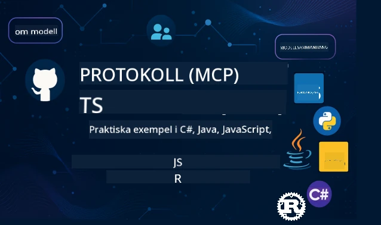

 

[](https://GitHub.com/microsoft/mcp-for-beginners/graphs/contributors)
[](https://GitHub.com/microsoft/mcp-for-beginners/issues)
[](https://GitHub.com/microsoft/mcp-for-beginners/pulls)
[](http://makeapullrequest.com)
[](https://mcptoplist.com/server/mcp.so%2Fmcp-for-beginners%2Fmicrosoft)

[](https://GitHub.com/microsoft/mcp-for-beginners/watchers)
[](https://GitHub.com/microsoft/mcp-for-beginners/fork)
[](https://GitHub.com/microsoft/mcp-for-beginners/stargazers)


[](https://discord.gg/nTYy5BXMWG)

Följ dessa steg för att komma igång med dessa resurser:
1. **Gaffla repositoryt**: Klicka på [](https://GitHub.com/microsoft/mcp-for-beginners/fork)
2. **Klona repositoryt**:   `git clone https://github.com/microsoft/mcp-for-beginners.git`
3. **Gå med i** [](https://discord.gg/nTYy5BXMWG)


### 🌐 Fler språkstöd

#### Stöds via GitHub Action (Automatiserat & Alltid Uppdaterat)

<!-- CO-OP TRANSLATOR LANGUAGES TABLE START -->
[Arabiska](../ar/README.md) | [Bengali](../bn/README.md) | [Bulgariska](../bg/README.md) | [Burmese (Myanmar)](../my/README.md) | [Kinesiska (Förenklad)](../zh-CN/README.md) | [Kinesiska (Traditionell, Hongkong)](../zh-HK/README.md) | [Kinesiska (Traditionell, Macau)](../zh-MO/README.md) | [Kinesiska (Traditionell, Taiwan)](../zh-TW/README.md) | [Kroatiska](../hr/README.md) | [Tjeckiska](../cs/README.md) | [Danska](../da/README.md) | [Holländska](../nl/README.md) | [Estniska](../et/README.md) | [Finska](../fi/README.md) | [Franska](../fr/README.md) | [Tyska](../de/README.md) | [Grekiska](../el/README.md) | [Hebreiska](../he/README.md) | [Hindi](../hi/README.md) | [Ungerska](../hu/README.md) | [Indonesiska](../id/README.md) | [Italienska](../it/README.md) | [Japanska](../ja/README.md) | [Kannada](../kn/README.md) | [Khmer](../km/README.md) | [Koreanska](../ko/README.md) | [Litauiska](../lt/README.md) | [Malay](../ms/README.md) | [Malayalam](../ml/README.md) | [Marathi](../mr/README.md) | [Nepali](../ne/README.md) | [Nigeriansk Pidgin](../pcm/README.md) | [Norska](../no/README.md) | [Persiska (Farsi)](../fa/README.md) | [Polska](../pl/README.md) | [Portugisiska (Brasilien)](../pt-BR/README.md) | [Portugisiska (Portugal)](../pt-PT/README.md) | [Punjabi (Gurmukhi)](../pa/README.md) | [Rumänska](../ro/README.md) | [Ryska](../ru/README.md) | [Serbiska (Kyrilliska)](../sr/README.md) | [Slovakiska](../sk/README.md) | [Slovenska](../sl/README.md) | [Spanska](../es/README.md) | [Swahili](../sw/README.md) | [Svenska](./README.md) | [Tagalog (Filippinska)](../tl/README.md) | [Tamil](../ta/README.md) | [Telugu](../te/README.md) | [Thailändska](../th/README.md) | [Turkiska](../tr/README.md) | [Ukrainska](../uk/README.md) | [Urdu](../ur/README.md) | [Vietnamesiska](../vi/README.md)

> **Föredrar du att klona lokalt?**
>
> Detta repository inkluderar över 50 språköversättningar vilket ökar nedladdningsstorleken avsevärt. För att klona utan översättningar, använd spars checkout:
>
> **Bash / macOS / Linux:**
> ```bash
> git clone --filter=blob:none --sparse https://github.com/microsoft/mcp-for-beginners.git
> cd mcp-for-beginners
> git sparse-checkout set --no-cone '/*' '!translations' '!translated_images'
> ```
>
> **CMD (Windows):**
> ```cmd
> git clone --filter=blob:none --sparse https://github.com/microsoft/mcp-for-beginners.git
> cd mcp-for-beginners
> git sparse-checkout set --no-cone "/*" "!translations" "!translated_images"
> ```
>
> Detta ger dig allt du behöver för att slutföra kursen med en mycket snabbare nedladdning.
<!-- CO-OP TRANSLATOR LANGUAGES TABLE END -->

# 🚀 Modell Kontextprotokoll (MCP) Kursplan för Nybörjare

## **Lär dig MCP med praktiska kodexempel i C#, Java, JavaScript, Rust, Python och TypeScript**

## 🧠 Översikt av Modell Kontextprotokoll-kursplanen
Välkommen på din resa in i Modell Kontextprotokoll! Om du någonsin undrat hur AI-applikationer kommunicerar med olika verktyg och tjänster, är du på väg att upptäcka den eleganta lösning som förändrar hur utvecklare bygger intelligenta system.

Tänk på MCP som en universell översättare för AI-applikationer - precis som USB-portar låter dig ansluta vilken enhet som helst till din dator, låter MCP AI-modeller ansluta till vilket verktyg eller tjänst som helst på ett standardiserat sätt. Oavsett om du bygger din första chatbot eller arbetar med komplexa AI-arbetsflöden, ger förståelsen för MCP dig kraften att skapa mer kapabla och flexibla applikationer.

Denna kursplan är utformad med tålamod och omsorg för din läranderesa. Vi börjar med enkla begrepp som du redan förstår och bygger gradvis upp din expertis genom praktisk övning i ditt favoritprogrammeringsspråk. Varje steg inkluderar tydliga förklaringar, praktiska exempel och mycket uppmuntran längs vägen.

När du har slutfört denna resa kommer du att ha självförtroendet att bygga dina egna MCP-servrar, integrera dem med populära AI-plattformar och förstå hur denna teknologi omformar AI-utvecklingens framtid. Låt oss börja detta spännande äventyr tillsammans!

### Officiell Dokumentation och Specifikationer

Den nuvarande protokollrevisionen är **MCP Specification 2026-07-28**. MCP
specifikationen använder datum-baserad versionskontroll (YYYY-MM-DD format) för att göra protokoll-
kompatibilitet tydlig.

> **Versionsnotering:** denna kursplan lär ut de aktuella `2026-07-28`
> koncepten, inklusive stateless-förfrågningar, Extensions-ramverket och
> utfasningen av Roots, Sampling och Logging. Några praktiska exempel är fortfarande
> explicit versionerade till `2025-11-25` medan SDK-stödet kommer ikapp. Se
> [Vad som ändrats i MCP: Specifikationen 2026-07-28](./01-CoreConcepts/mcp-2026-07-28.md)
> för ändringar och migrationsråd.

Dessa resurser blir mer värdefulla ju bättre du förstår, men känn ingen press att läsa allt på en gång. Börja med de områden som intresserar dig mest!
- 📘 [MCP Dokumentation](https://modelcontextprotocol.io/) – Detta är din huvudsakliga resurs för steg-för-steg-tutorials och användarguider. Dokumentationen är skriven med nybörjare i åtanke och ger tydliga exempel som du kan följa i din egen takt.
- 📜 [MCP Specifikation](https://modelcontextprotocol.io/specification/2026-07-28) – Tänk på detta som din omfattande referensmanual. När du arbetar dig genom kursplanen kommer du att återvända hit för att slå upp specifika detaljer och utforska avancerade funktioner.
- 📜 [MCP Specifikationsversioner](https://modelcontextprotocol.io/specification/versioning) – Här finns information om protokollversioner och hur MCP använder datum-baserad versionskontroll (YYYY-MM-DD).
- 🧑‍💻 [MCP GitHub Repository](https://github.com/modelcontextprotocol) – Här hittar du SDK:er, verktyg och kodexempel i flera programmeringsspråk. Det är som en skattkista av praktiska exempel och färdiga komponenter.
- 🌐 [MCP Community](https://github.com/orgs/modelcontextprotocol/discussions) – Gå med i diskussioner med medlärande och erfarna utvecklare om MCP. Det är en stödjande gemenskap där frågor är välkomna och kunskap delas fritt.
  
## Lärandemål

I slutet av denna kursplan kommer du att känna dig säker och entusiastisk över dina nya färdigheter. Här är vad du kommer att uppnå:

• **Förstå MCP-grunderna**: Du kommer att förstå vad Model Context Protocol är och varför det revolutionerar hur AI-applikationer arbetar tillsammans, med analogier och exempel som är lätta att förstå.

• **Bygg din första MCP-server**: Du kommer att skapa en fungerande MCP-server i ditt föredragna programmeringsspråk, börja med enkla exempel och utveckla dina färdigheter steg för steg.

• **Anslut AI-modeller till riktiga verktyg**: Du kommer att lära dig hur du bygger en brygga mellan AI-modeller och faktiska tjänster, vilket ger dina applikationer kraftfulla nya möjligheter.

• **Implementera säkerhetsbästa praxis**: Du kommer att förstå hur du håller dina MCP-implementationer säkra, och skyddar både dina applikationer och dess användare.

• **Distribuera med självförtroende**: Du kommer att veta hur du tar dina MCP-projekt från utveckling till produktion, med praktiska distributionsstrategier som fungerar i verkliga situationer.

• **Gå med i MCP-gemenskapen**: Du blir en del av en växande gemenskap av utvecklare som formar AI-applikationsutvecklingens framtid. 

## Nödvändig Bakgrund

Innan vi dyker in i MCP-specifika detaljer, låt oss se till att du är bekväm med några grundläggande begrepp. Oroa dig inte om du inte är expert på dessa områden – vi förklarar allt du behöver veta på vägen!

### Förstå Protokoll (Grunden)

Tänk på ett protokoll som reglerna för en konversation. När du ringer en vän vet båda att ni ska säga "hej" när ni svarar, turas om att prata och säga "hejdå" när ni är klara. Datorprogram behöver liknande regler för att kommunicera effektivt.

MCP är ett protokoll – en uppsättning överenskomna regler som hjälper AI-modeller och applikationer att ha produktiva "konversationer" med verktyg och tjänster. Precis som konversationsregler gör mänsklig kommunikation smidigare, gör MCP AI-applikationskommunikation mycket mer pålitlig och kraftfull.

### Klient-server-relationer (Hur program samarbetar)

Du använder redan klient-server-relationer varje dag! När du använder en webbläsare (klienten) för att besöka en webbplats ansluter du till en webbserver som skickar sidans innehåll till dig. Webbläsaren vet hur man ber om information, och servern vet hur den ska svara.

I MCP har vi en liknande relation: AI-modeller agerar som klienter som begär information eller åtgärder, medan MCP-servrar tillhandahåller den möjligheten. Det är som att ha en hjälpsam assistent (servern) som AI kan be utföra specifika uppgifter.

### Varför standardisering är viktigt (För att saker ska fungera tillsammans)

Föreställ dig om varje biltillverkare hade olika formade bensinpumpar – då skulle du behöva en annan adapter för varje bil! Standardisering betyder att man enas om gemensamma tillvägagångssätt så att saker fungerar sömlöst tillsammans.

MCP tillhandahåller denna standardisering för AI-applikationer. Istället för att varje AI-modell behöver specialkod för att fungera med varje verktyg, skapar MCP ett universellt sätt för dem att kommunicera. Det betyder att utvecklare kan bygga verktyg en gång och få dem att fungera med många olika AI-system.

## 🧭 Din Lärandestruktur Översikt

Din MCP-resa är noggrant strukturerad för att successivt bygga ditt självförtroende och dina färdigheter. Varje fas introducerar nya koncept samtidigt som det förstärker det du redan lärt dig.

### 🌱 Grundfas: Förstå grunderna (Moduler 0-2)

Här börjar ditt äventyr! Vi introducerar MCP-koncept med bekanta analogier och enkla exempel. Du kommer att förstå vad MCP är, varför det finns och hur det passar in i den större världen av AI-utveckling.


• **Modul 0 - Introduktion till MCP**: Vi börjar med att utforska vad MCP är och varför det är så viktigt för moderna AI-applikationer. Du kommer att se verkliga exempel på MCP i arbete och förstå hur det löser vanliga problem utvecklare ställs inför.

• **Modul 1 - Kärnkoncept förklarade**: Här lär du dig de grundläggande byggstenarna i MCP. Vi använder många analogier och visuella exempel för att säkerställa att dessa koncept känns naturliga och förståeliga.

• **Modul 2 - Säkerhet i MCP**: Säkerhet kan låta skrämmande, men vi visar hur MCP inkluderar inbyggda säkerhetsfunktioner och lär dig bästa praxis som skyddar dina applikationer från början.

### 🔨 Byggfas: Skapa dina första implementationer (Modul 3)

Nu börjar det riktiga roliga! Du får praktisk erfarenhet av att bygga riktiga MCP-servrar och klienter. Oroa dig inte – vi börjar enkelt och guidar dig genom varje steg.

Denna modul innehåller flera praktiska guider som låter dig öva i ditt föredragna programmeringsspråk. Du skapar din första server, bygger en klient för att ansluta till den och integrerar till och med med populära utvecklingsverktyg som VS Code.

Varje guide innehåller kompletta kodexempel, felsökningstips och förklaringar till varför vi gör specifika designval. I slutet av denna fas kommer du att ha fungerande MCP-implementationer som du kan vara stolt över!

### 🚀 Tillväxtfas: Avancerade koncept och verklig tillämpning (Modulerna 4-5)

Med grunderna behärskade är du redo att utforska mer sofistikerade MCP-funktioner. Vi täcker praktiska implementationsstrategier, felsökningstekniker och avancerade ämnen som multimodal AI-integration.

Du kommer också att lära dig hur du skalar dina MCP-implementationer för produktion och integrerar med molnplattformar som Azure. Dessa moduler förbereder dig för att bygga MCP-lösningar som kan hantera verkliga krav.

### 🌟 Mästarskapsfas: Community och specialisering (Modulerna 6-11)

Den sista fasen fokuserar på att gå med i MCP-communityt och specialisera dig inom områden som intresserar dig mest. Du lär dig hur du bidrar till open-source MCP-projekt, implementerar avancerade autentiseringsmönster och bygger omfattande lösningar med databasintegration.

Modul 11 förtjänar särskild uppmärksamhet – det är en komplett 13-laborativ praktisk lärandeväg som lär dig att bygga produktionsfärdiga MCP-servrar med PostgreSQL-integration. Det är som ett examensprojekt som sammanför allt du har lärt dig!

### 📚 Komplett kursstruktur

| Modul | Ämne | Beskrivning | Länk |
|--------|-------|-------------|------|
| **Modul 0-3: Grunder** | | | |
| 00 | Introduktion till MCP | Översikt över Model Context Protocol och dess betydelse i AI-pipelines | [Läs mer](./00-Introduction/README.md) |
| 01 | Kärnkoncept förklarade | Djupdykning i kärnkoncept för MCP | [Läs mer](./01-CoreConcepts/README.md) |
| 1.1 | Vad som ändrats i MCP (2026-07-28) | Statelöst protokoll, Extensions framework och begränsningar av funktioner i nuvarande specifikation | [Guide](./01-CoreConcepts/mcp-2026-07-28.md) |
| 02 | Säkerhet i MCP | Säkerhetshot och bästa praxis | [Läs mer](./02-Security/README.md) |
| 2.1 | CIMD och DCR-auktorisering | Jämför föredragen CIMD-registrering med föråldrad DCR-fallback med en skyddad MCP-server | [Exempel](./02-Security/samples/cimd-dcr-auth/README.md) |
| 03 | Kom igång med MCP | Miljöinställning, grundläggande servrar/klienter, integration | [Läs mer](./03-GettingStarted/README.md) |
| **Modul 3: Bygg din första server & klient** | | | |
| 3.1 | Första server | Skapa din första MCP-server | [Guide](./03-GettingStarted/01-first-server/README.md) |
| 3.2 | Första klient | Utveckla en grundläggande MCP-klient | [Guide](./03-GettingStarted/02-client/README.md) |
| 3.3 | Klient med LLM | Integrera stora språkmodeller | [Guide](./03-GettingStarted/03-llm-client/README.md) |
| 3.4 | VS Code-integration | Använd MCP-servrar i VS Code | [Guide](./03-GettingStarted/04-vscode/README.md) |
| 3.5 | stdio-server | Skapa servrar med stdio-transport | [Guide](./03-GettingStarted/05-stdio-server/README.md) |
| 3.6 | HTTP Streaming | Implementera HTTP-streaming i MCP | [Guide](./03-GettingStarted/06-http-streaming/README.md) |
| 3.7 | Microsoft Foundry Toolkit | Använd Microsoft Foundry Toolkit med MCP | [Guide](./03-GettingStarted/07-aitk/README.md) |
| 3.8 | Testning | Testa din MCP-serverimplementation | [Guide](./03-GettingStarted/08-testing/README.md) |
| 3.9 | Distribution | Distribuera MCP-servrar till produktion | [Guide](./03-GettingStarted/09-deployment/README.md) |
| 3.10 | Avancerad serveranvändning | Använd avancerade servrar för avancerad funktionsanvändning och förbättrad arkitektur | [Guide](./03-GettingStarted/10-advanced/README.md) |
| 3.11 | Enkel autentisering | Ett kapitel som visar autentisering från början och RBAC | [Guide](./03-GettingStarted/11-simple-auth/README.md) |
| 3.12 | MCP Hosts | Konfigurera Claude Desktop, Cursor, Cline och andra MCP-värdar | [Guide](./03-GettingStarted/12-mcp-hosts/README.md) |
| 3.13 | MCP Inspector | Felsök och testa MCP-servrar med verktyget Inspector | [Guide](./03-GettingStarted/13-mcp-inspector/README.md) |
| 3.14 | Sampling | Använd sampling för att samarbeta med klienten | [Guide](./03-GettingStarted/14-sampling/README.md) |
| 3.15 | MCP-appar | Bygg MCP-appar | [Guide](./03-GettingStarted/15-mcp-apps/README.md) |
| **Modul 4-5: Praktiskt & avancerat** | | | |
| 04 | Praktisk implementation | SDK:er, felsökning, testning, återanvändbara promptmallar | [Läs mer](./04-PracticalImplementation/README.md) |
| 4.1 | Paginering | Hantera stora resultatuppsättningar med kursorbassinerad paginering | [Guide](./04-PracticalImplementation/pagination/README.md) |
| 05 | Avancerade ämnen i MCP | Multimodal AI, skalning, företagsanvändning | [Läs mer](./05-AdvancedTopics/README.md) |
| 5.1 | Azure-integration | MCP-integration med Azure | [Guide](./05-AdvancedTopics/mcp-integration/README.md) |
| 5.2 | Multimodalitet | Arbeta med flera modaliteter | [Guide](./05-AdvancedTopics/mcp-multi-modality/README.md) |
| 5.3 | OAuth2-demo | Implementera OAuth2-autentisering | [Guide](./05-AdvancedTopics/mcp-oauth2-demo/README.md) |
| 5.4 | Root Contexts | Förstå och implementera root contexts | [Guide](./05-AdvancedTopics/mcp-root-contexts/README.md) |
| 5.5 | Routing | MCP-routningsstrategier | [Guide](./05-AdvancedTopics/mcp-routing/README.md) |
| 5.6 | Sampling | Samplingstekniker i MCP | [Guide](./05-AdvancedTopics/mcp-sampling/README.md) |
| 5.7 | Skalning | Skala MCP-implementationer | [Guide](./05-AdvancedTopics/mcp-scaling/README.md) |
| 5.8 | Säkerhet | Avancerade säkerhetsoverväganden | [Guide](./05-AdvancedTopics/mcp-security/README.md) |
| 5.9 | Webbsökning | Implementera webbsökningsfunktioner | [Guide](./05-AdvancedTopics/web-search-mcp/README.md) |
| 5.10 | Realtidsstreaming | Bygg funktionalitet för streaming i realtid | [Guide](./05-AdvancedTopics/mcp-realtimestreaming/README.md) |
| 5.11 | Realtidssökning | Implementera sökning i realtid | [Guide](./05-AdvancedTopics/mcp-realtimesearch/README.md) |
| 5.12 | Entra ID-autentisering | Autentisering med Microsoft Entra ID | [Guide](./05-AdvancedTopics/mcp-security-entra/README.md) |
| 5.13 | Foundry-integration | Integrera med Microsoft Foundry | [Guide](./05-AdvancedTopics/mcp-foundry-agent-integration/README.md) |
| 5.14 | Kontextteknik | Tekniker för effektiv kontextteknik | [Guide](./05-AdvancedTopics/mcp-contextengineering/README.md) |
| 5.15 | MCP-anpassad transport | Anpassade transportimplementationer | [Guide](./05-AdvancedTopics/mcp-transport/README.md) |
| 5.16 | Protokollfunktioner | Framstegsmeddelanden, avbokning, resursmallar | [Guide](./05-AdvancedTopics/mcp-protocol-features/README.md) |
| 5.17 | Adversarial Multi-Agent Reasoning | Två agenter argumenterar motstående sidor med delade MCP-verktyg, utvärderade av en dommareagent | [Guide](./05-AdvancedTopics/mcp-adversarial-agents/README.md) |
| **Modul 6-10: Community & bästa praxis** | | | |
| 06 | Community-bidrag | Hur man bidrar till MCP-ekosystemet | [Guide](./06-CommunityContributions/README.md) |
| 07 | Insikter från tidig adoption | Verkliga implementeringsberättelser | [Guide](./07-LessonsfromEarlyAdoption/README.md) |
| 08 | Bästa praxis för MCP | Prestanda, feltolerans, resiliens | [Guide](./08-BestPractices/README.md) |
| 09 | MCP Fallstudier | Praktiska implementationsexempel | [Guide](./09-CaseStudy/README.md) |
| 10 | Praktisk workshop | Bygga en MCP-server med Microsoft Foundry Toolkit | [Lab](./10-StreamliningAIWorkflowsBuildingAnMCPServerWithAIToolkit/README.md) |
| **Modul 11: MCP Server Hands On-labb** | | | |
| 11 | MCP Server databasintegration | Omfattande 13-labbrig praktisk lärandeväg för PostgreSQL-integration | [Labbar](./11-MCPServerHandsOnLabs/README.md) |
| 11.1 | Introduktion | Översikt över MCP med databasintegration och detaljhandelsanalysfall | [Lab 00](./11-MCPServerHandsOnLabs/00-Introduction/README.md) |
| 11.2 | Kärnarkitektur | Förstå MCP-serverarkitektur, databaslager och säkerhetsmönster | [Lab 01](./11-MCPServerHandsOnLabs/01-Architecture/README.md) |
| 11.3 | Säkerhet & flerpartsmiljö | Radnivåsäkerhet, autentisering och flerpartsmiljö åtkomst till data | [Lab 02](./11-MCPServerHandsOnLabs/02-Security/README.md) |
| 11.4 | Miljöinställning | Setup av utvecklingsmiljö, Docker, Azure-resurser | [Lab 03](./11-MCPServerHandsOnLabs/03-Setup/README.md) |
| 11.5 | Databasdesign | PostgreSQL-setup, detaljhandelschema design och exempeldata | [Lab 04](./11-MCPServerHandsOnLabs/04-Database/README.md) |
| 11.6 | MCP Server-implementation | Bygga FastMCP-server med databasintegration | [Lab 05](./11-MCPServerHandsOnLabs/05-MCP-Server/README.md) |
| 11.7 | Verktygsutveckling | Skapa verktyg för databasfrågor och schemainformation | [Lab 06](./11-MCPServerHandsOnLabs/06-Tools/README.md) |
| 11.8 | Semantisk sökning | Implementera vektor inbäddningar med Azure OpenAI och pgvector | [Lab 07](./11-MCPServerHandsOnLabs/07-Semantic-Search/README.md) |
| 11.9 | Testning & felsökning | Teststrategier, felsökningsverktyg och valideringsmetoder | [Lab 08](./11-MCPServerHandsOnLabs/08-Testing/README.md) |
| 11.10 | VS Code-integration | Konfigurera VS Code MCP-integration och AI Chat-användning | [Lab 09](./11-MCPServerHandsOnLabs/09-VS-Code/README.md) |
| 11.11 | Distributionsstrategier | Docker-distribution, Azure Container Apps och skalningsöverväganden | [Lab 10](./11-MCPServerHandsOnLabs/10-Deployment/README.md) |
| 11.12 | Övervakning | Application Insights, loggning, prestandaövervakning | [Lab 11](./11-MCPServerHandsOnLabs/11-Monitoring/README.md) |
| 11.13 | Bästa praxis | Prestandaoptimering, säkerhetshärdning och produktionstips | [Lab 12](./11-MCPServerHandsOnLabs/12-Best-Practices/README.md) |
| **Modul 12: MCP-verktyg** | | | |
| 12.1 | Verktyg | MCP-användning i Copilot App | [ Guide ](./12-tooling/README.md) |

### 💻 Exempelkodprojekt


En av de mest spännande delarna av att lära sig MCP är att se dina kodningsfärdigheter utvecklas steg för steg. Vi har utformat våra kodexempel för att börja enkelt och bli mer sofistikerade i takt med att din förståelse fördjupas. Så här introducerar vi koncept – med kod som är lätt att förstå men som visar verkliga MCP-principer, kommer du att förstå inte bara vad denna kod gör, utan också varför den är strukturerad på detta sätt och hur den passar in i större MCP-applikationer.

#### Grundläggande MCP Calculator Exempel

| Språk | Beskrivning | Länk |
|----------|-------------|------|
| C# | MCP Server Exempel | [Visa kod](./03-GettingStarted/samples/csharp/README.md) |
| Java | MCP Calculator | [Visa kod](./03-GettingStarted/samples/java/calculator/README.md) |
| JavaScript | MCP Demo | [Visa kod](./03-GettingStarted/samples/javascript/README.md) |
| Python | MCP Server | [Visa kod](../../03-GettingStarted/samples/python/mcp_calculator_server.py) |
| TypeScript | MCP Exempel | [Visa kod](./03-GettingStarted/samples/typescript/README.md) |
| Rust | MCP Exempel | [Visa kod](./03-GettingStarted/samples/rust/README.md) |

#### Avancerade MCP-Implementeringar

| Språk | Beskrivning | Länk |
|----------|-------------|------|
| C# | Avancerat Exempel | [Visa kod](./04-PracticalImplementation/samples/csharp/README.md) |
| Java med Spring | Container App Exempel | [Visa kod](./04-PracticalImplementation/samples/java/containerapp/README.md) |
| JavaScript | Avancerat Exempel | [Visa kod](./04-PracticalImplementation/samples/javascript/README.md) |
| Python | Komplex Implementering | [Visa kod](./04-PracticalImplementation/samples/python/README.md) |
| TypeScript | Container Exempel | [Visa kod](./04-PracticalImplementation/samples/typescript/README.md) |


## 🎯 Förutsättningar för att Lära sig MCP

För att få ut det mesta av detta utbildningsprogram bör du ha:

- Grundläggande kunskaper i programmering i minst ett av följande språk: C#, Java, JavaScript, Python eller TypeScript
- Förståelse för klient-server-modellen och API:er
- Bekantskap med REST och HTTP-koncept
- (Valfritt) Bakgrund inom AI/ML-koncept

- Delta i våra community-diskussioner för stöd

## 📚 Studieguide & Resurser

Detta repository inkluderar flera resurser för att hjälpa dig navigera och lära dig effektivt:

### Studieguide

En omfattande [Studieguide](./study_guide.md) finns tillgänglig för att hjälpa dig navigera detta repository effektivt. Denna visuella läroplan visar hur alla ämnen hänger ihop och ger vägledning för hur du använder exempelprojekten på bästa sätt. Den är särskilt hjälpsam om du är en visuell lärande som gillar att se helheten.

Guiden innehåller:
- En visuell läroplanskarta som visar alla täckta ämnen
- Detaljerad uppdelning av varje sections i repositoryt
- Vägledning om hur du använder exempelprojekten
- Rekommenderade lärvägar för olika färdighetsnivåer
- Ytterligare resurser för att komplettera din läranderesa

### Ändringslogg

Vi underhåller en detaljerad [Ändringslogg](./changelog.md) som spårar alla viktiga uppdateringar av kursmaterialet, så att du kan hålla dig uppdaterad med de senaste förbättringarna och tilläggen.
- Nya innehållstillägg
- Strukturella förändringar
- Funktionsförbättringar
- Dokumentationsuppdateringar

## 🛠️ Hur Du Använder Denna Kurs Effektivt

Varje lektion i denna guide innehåller:

1. Klara förklaringar av MCP-koncept  
2. Levande kodexempel i flera språk  
3. Övningar för att bygga riktiga MCP-applikationer  
4. Extra resurser för avancerade studerande

### Låt oss lära oss MCP med C# - Tutorialsserie
Låt oss lära oss om Model Context Protocol (MCP), ett banbrytande ramverk designat för att standardisera interaktioner mellan AI-modeller och klientapplikationer. Genom denna nybörjarvänliga session kommer vi att introducera dig till MCP och guida dig genom att skapa din första MCP-server.
#### C#: [https://aka.ms/letslearnmcp-csharp](https://aka.ms/letslearnmcp-csharp)
#### Java: [https://aka.ms/letslearnmcp-java](https://aka.ms/letslearnmcp-java)
#### JavaScript: [https://aka.ms/letslearnmcp-javascript](https://aka.ms/letslearnmcp-javascript)
#### Python: [https://aka.ms/letslearnmcp-python](https://aka.ms/letslearnmcp-python)

## 🎓 Din MCP-resa Börjar Här

Grattis! Du har just tagit det första steget i en spännande resa som kommer att utöka dina programmeringsmöjligheter och koppla dig till den senaste utvecklingen inom AI.

### Vad Du Redan Har Uppnått

Genom att läsa denna introduktion har du redan börjat bygga din MCP-kunskapsgrund. Du förstår vad MCP är, varför det är viktigt och hur denna kurs kommer att stödja din läranderesa. Det är en betydande prestation och början på din expertis inom denna viktiga teknik.

### Äventyret Framför Dig

När du går igenom modulerna, kom ihåg att varje expert en gång var en nybörjare. De koncept som kan verka komplexa nu kommer att bli andra natur när du övar och tillämpar dem. Varje litet steg bygger mot kraftfulla färdigheter som kommer att tjäna dig genom hela din utvecklarkarriär.

### Ditt Supportnätverk

Du går med i ett community av lärande och experter som är passionerade om MCP och ivriga att hjälpa andra lyckas. Oavsett om du fastnar på en kodningsutmaning eller är entusiastisk att dela en genombrott, finns communityn här för att stödja din resa.

Om du fastnar eller har frågor om att bygga AI-appar, delta i diskussioner om MCP med andra studerande och erfarna utvecklare. Det är en stödjande community där frågor är välkomna och kunskap delas fritt.

[](https://discord.gg/nTYy5BXMWG)

Om du har produktfeedback eller hittar fel under bygget, besök:

[](https://aka.ms/foundry/forum)

### Redo att Börja?

Ditt MCP-äventyr börjar nu! Starta med Modul 0 för att dyka in i dina första praktiska MCP-upplevelser, eller utforska exempelprojekten för att se vad du kommer att bygga. Kom ihåg – varje expert började precis där du är nu, och med tålamod och övning kommer du bli förvånad över vad du kan åstadkomma.

Välkommen till världen av Model Context Protocol-utveckling. Låt oss bygga något fantastiskt tillsammans!

## 🤝 Bidra till Lärandegemenskapen

Denna kurs växer sig starkare med bidrag från lärande som du! Oavsett om du rättar ett stavfel, föreslår en tydligare förklaring eller lägger till ett nytt exempel, hjälper dina bidrag andra nybörjare att lyckas.

Tack till Microsoft Valued Professional [Shivam Goyal](https://www.linkedin.com/in/shivam2003/) för att ha bidragit med kodexempel.

Bidragsprocessen är utformad för att vara välkomnande och stödjande. De flesta bidrag kräver ett Contributor License Agreement (CLA), men de automatiska verktygen kommer att guida dig genom processen smidigt.

## 📜 Öppen Källkod för Lärande

Denna hela kurs finns tillgänglig under MIT [LICENSE](../../LICENSE), vilket innebär att du kan använda, modifiera och dela den fritt. Detta stödjer vårt uppdrag att göra MCP-kunskap tillgängligt för utvecklare överallt.
## 🤝 Bidragsriktlinjer

Detta projekt välkomnar bidrag och förslag. De flesta bidrag kräver att du samtycker till ett
Contributor License Agreement (CLA) som deklarerar att du har rätten att, och faktiskt gör det, ge oss
rättigheterna att använda ditt bidrag. För detaljer, besök <https://cla.opensource.microsoft.com>.

När du skickar in en pull request kommer en CLA-bot automatiskt att avgöra om du behöver tillhandahålla
en CLA och märka PR på lämpligt sätt (t.ex. statuskontroll, kommentar). Följ helt enkelt instruktionerna
som boten ger. Du behöver bara göra detta en gång för alla repos som använder vår CLA.

Detta projekt har antagit [Microsoft Open Source Code of Conduct](https://opensource.microsoft.com/codeofconduct/).
För mer information se [Code of Conduct FAQ](https://opensource.microsoft.com/codeofconduct/faq/) eller
kontakta [opencode@microsoft.com](mailto:opencode@microsoft.com) med eventuella frågor eller kommentarer.

---

*Redo att starta din MCP-resa? Börja med [Modul 00 - Introduktion till MCP](./00-Introduction/README.md) och ta dina första steg in i världen av Model Context Protocol-utveckling!*


## 🎒 Andra Kurser
Vårt team producerar andra kurser! Kolla in:

<!-- CO-OP TRANSLATOR OTHER COURSES START -->
### LangChain
[](https://aka.ms/langchain4j-for-beginners)
[](https://aka.ms/langchainjs-for-beginners?WT.mc_id=m365-94501-dwahlin)
[](https://github.com/microsoft/langchain-for-beginners?WT.mc_id=m365-94501-dwahlin)
---

### Azure / Edge / MCP / Agents
[](https://github.com/microsoft/AZD-for-beginners?WT.mc_id=academic-105485-koreyst)
[](https://github.com/microsoft/edgeai-for-beginners?WT.mc_id=academic-105485-koreyst)
[](https://github.com/microsoft/mcp-for-beginners?WT.mc_id=academic-105485-koreyst)
[](https://github.com/microsoft/ai-agents-for-beginners?WT.mc_id=academic-105485-koreyst)

---
 
### Generativ AI-serie
[](https://github.com/microsoft/generative-ai-for-beginners?WT.mc_id=academic-105485-koreyst)
[-9333EA?style=for-the-badge&labelColor=E5E7EB&color=9333EA)](https://github.com/microsoft/Generative-AI-for-beginners-dotnet?WT.mc_id=academic-105485-koreyst)
[-C084FC?style=for-the-badge&labelColor=E5E7EB&color=C084FC)](https://github.com/microsoft/generative-ai-for-beginners-java?WT.mc_id=academic-105485-koreyst)
[-E879F9?style=for-the-badge&labelColor=E5E7EB&color=E879F9)](https://github.com/microsoft/generative-ai-with-javascript?WT.mc_id=academic-105485-koreyst)

---
 
### Core Learning
[](https://aka.ms/ml-beginners?WT.mc_id=academic-105485-koreyst)
[](https://aka.ms/datascience-beginners?WT.mc_id=academic-105485-koreyst)

[](https://aka.ms/ai-beginners?WT.mc_id=academic-105485-koreyst)
[](https://github.com/microsoft/Security-101?WT.mc_id=academic-96948-sayoung)
[](https://aka.ms/webdev-beginners?WT.mc_id=academic-105485-koreyst)
[](https://aka.ms/iot-beginners?WT.mc_id=academic-105485-koreyst)
[](https://github.com/microsoft/xr-development-for-beginners?WT.mc_id=academic-105485-koreyst)

---
 
### Copilot-serien
[](https://aka.ms/GitHubCopilotAI?WT.mc_id=academic-105485-koreyst)
[](https://github.com/microsoft/mastering-github-copilot-for-dotnet-csharp-developers?WT.mc_id=academic-105485-koreyst)
[](https://github.com/microsoft/CopilotAdventures?WT.mc_id=academic-105485-koreyst)
<!-- CO-OP TRANSLATOR OTHER COURSES END -->

---

<!-- CO-OP TRANSLATOR DISCLAIMER START -->
**Ansvarsfriskrivning**:
Detta dokument har översatts med hjälp av AI-översättningstjänsten [Co-op Translator](https://github.com/Azure/co-op-translator). Även om vi strävar efter noggrannhet, var vänlig notera att automatiska översättningar kan innehålla fel eller brister. Det ursprungliga dokumentet på dess modersmål bör betraktas som den auktoritativa källan. För kritisk information rekommenderas professionell mänsklig översättning. Vi ansvarar inte för några missförstånd eller feltolkningar som uppstår till följd av användningen av denna översättning.
<!-- CO-OP TRANSLATOR DISCLAIMER END -->