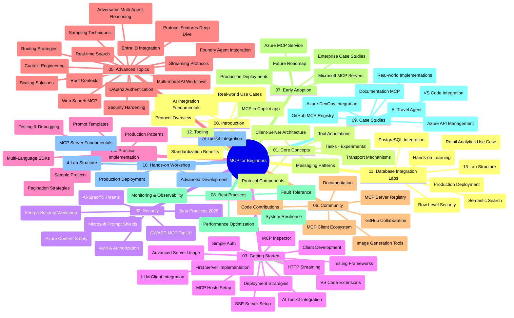

# Model Context Protocol (MCP) för nybörjare - Studievägledning

Denna studievägledning ger en översikt över lagringsstruktur och innehåll för kursplanen "Model Context Protocol (MCP) för nybörjare". Använd denna guide för att navigera i lagret effektivt och utnyttja de tillgängliga resurserna maximalt.

## Översikt av lagret

Model Context Protocol (MCP) är ett standardiserat ramverk för interaktioner mellan AI-modeller och klientapplikationer. Ursprungligen skapat av Anthropic, underhålls MCP nu av den bredare MCP-gemenskapen via den officiella GitHub-organisationen. Detta repository tillhandahåller en heltäckande kursplan med praktiska kodexempel i C#, Java, JavaScript, Python, och TypeScript, designad för AI-utvecklare, systemarkitekter och mjukvaruingenjörer.

## Visuell kurskarta

## Repositorystruktur

Repositoryt är organiserat i tolv huvudsektioner, var och en med fokus på olika aspekter av MCP:

1. **Introduktion (00-Introduction/)**
   - Översikt av Model Context Protocol
   - Varför standardisering är viktigt i AI-pipelines
   - Praktiska användningsfall och fördelar

2. **Kärnkoncept (01-CoreConcepts/)**
   - Klient-serverarkitektur
   - Viktiga protokollkomponenter
   - Meddelandemönster i MCP
   - Nuvarande specifikation: [Vad har förändrats i MCP: Specifikationen 2026-07-28](./01-CoreConcepts/mcp-2026-07-28.md) — den stateless protollkärnan, Extensions-ramverket, och avveckling av Roots/Sampling/Logging

3. **Säkerhet (02-Security/)**
   - Säkerhetshot i MCP-baserade system
   - Bästa praxis för att säkra implementationer
   - Autentiserings- och auktoriseringsstrategier
   - Praktiskt exempel: [CIMD och DCR auktorisering](./02-Security/samples/cimd-dcr-auth/README.md)
   - **Omfattande säkerhetsdokumentation**:
     - MCP säkerhetsbästa praxis
     - Azure Content Safety implementeringsguide
     - MCP säkerhetskontroller och tekniker
     - MCP snabbreferens för bästa praxis
   - **Viktiga säkerhetsteman**:
     - Promptinjektion och verktygsförgiftning
     - Kapning av session och förväxlade fullmaktsproblem
     - Sårbarheter vid tokenpassering
     - Överdrivna behörigheter och åtkomstkontroll
     - Leveranskedjesäkerhet för AI-komponenter
     - Integrering av Microsoft Prompt Shields

4. **Kom igång (03-GettingStarted/)**
   - Miljöinstallation och konfiguration
   - Skapa grundläggande MCP-servrar och klienter
   - Integration med befintliga applikationer
   - Inkluderar sektioner för:
     - Första serverimplementeringen
     - Klientutveckling
     - LLM-klientintegration
     - VS Code-integration
     - Server-Sent Events (SSE) server
     - Avancerad serveranvändning
     - HTTP-streaming
     - AI Toolkit-integration
     - Teststrategier
     - Riktlinjer för distribution

5. **Praktisk implementation (04-PracticalImplementation/)**
   - Användning av SDK:er i olika programspråk
   - Felsökning, testning och valideringstekniker
   - Skapa återanvändbara promptmallar och arbetsflöden
   - Exempelprojekt med implementationsexempel

6. **Avancerade ämnen (05-AdvancedTopics/)**
   - Tekniker för kontextengineering
   - Foundry agent-integration
   - Mångmodala AI-arbetsflöden
   - OAuth2 autentiseringsdemonstrationer
   - Realtidssökning
   - Realtidsstreaming
   - Implementation av root contexts
   - Routringstrategier
   - Samplingstekniker
   - Skalningsmetoder
   - Säkerhetsaspekter
   - Entra ID säkerhetsintegration
   - Webb-sökintegration
   - Adversariell multi-agentresonemang (debattmönster)

7. **Community-bidrag (06-CommunityContributions/)**
   - Hur man bidrar med kod och dokumentation
   - Samarbete via GitHub
   - Community-drivna förbättringar och feedback
   - Använda olika MCP-klienter (Claude Desktop, Cline, VSCode)
   - Arbeta med populära MCP-servrar inklusive bildgenerering

8. **Lärdomar från tidig användning (07-LessonsfromEarlyAdoption/)**
   - Verkliga implementationer och framgångshistorier
   - Bygga och distribuera MCP-baserade lösningar
   - Trender och framtida färdplan
   - **Microsoft MCP Servers Guide**: Utförlig guide till 10 produktionsklara Microsoft MCP-servrar inklusive:
     - Microsoft Learn Docs MCP Server
     - Azure MCP Server (15+ specialiserade kopplingar)
     - GitHub MCP Server
     - Azure DevOps MCP Server
     - MarkItDown MCP Server
     - SQL Server MCP Server
     - Playwright MCP Server
     - Dev Box MCP Server
     - Microsoft Foundry MCP Server
     - Microsoft 365 Agents Toolkit MCP Server

9. **Bästa praxis (08-BestPractices/)**
   - Prestandaoptimering och justering
   - Design av feltoleranta MCP-system
   - Test- och robusthetsstrategier

10. **Fallstudier (09-CaseStudy/)**
    - **Sju heltäckande fallstudier** som visar MCP:s mångsidighet i olika scenarier:
    - **Azure AI Resebyråer**: Multi-agentorkestrering med Azure OpenAI och AI Search
    - **Azure DevOps-integration**: Automatisering av arbetsflöden med YouTube-datauppdateringar
    - **Dokumenthämtning i realtid**: Python-konsolklient med streaming HTTP
    - **Interaktiv studieplansgenerator**: Chainlit webbapp med konverserande AI
    - **Dokumentation inuti editor**: VS Code-integration med GitHub Copilot-arbetsflöden
    - **Azure API Management**: Företags-API-integration med skapande av MCP-server
    - **GitHub MCP Register**: Ekosystemutveckling och agentbaserad integrationsplattform
    - Implementations exempel som spänner över företagsintegration, utvecklarproduktivitet och ekosystemutveckling

11. **Praktisk workshop (10-StreamliningAIWorkflowsBuildingAnMCPServerWithAIToolkit/)**
    - Omfattande praktisk workshop som kombinerar MCP med AI Toolkit
    - Bygga intelligenta applikationer som förbinder AI-modeller med verkliga verktyg
    - Praktiska moduler som täcker grunderna, egenutveckling av server och produktionsdistributionsstrategier
    - **Labstruktur**:
      - Lab 1: MCP-serverns grunder
      - Lab 2: Avancerad MCP-serverutveckling
      - Lab 3: AI Toolkit-integration
      - Lab 4: Produktionsdistribution och skalning
    - Lab-baserat lärande med steg-för-steginstruktioner

12. **MCP Server Database Integration Labs (11-MCPServerHandsOnLabs/)**
    - **Omfattande 13-labb utvecklingsväg** för att bygga produktionsfärdiga MCP-servrar med PostgreSQL-integration
    - **Verklig implementation av detaljhandelsanalys** med användningsfallet Zava Retail
    - **Företagsmönster** inklusive Row Level Security (RLS), semantisk sökning och multi-tenant dataåtkomst
    - **Fullständig labbstruktur**:
      - **Labbar 00-03: Grunderna** - Introduktion, Arkitektur, Säkerhet, Miljösetup
      - **Labbar 04-06: Bygga MCP-servern** - Databasutformning, MCP-serverimplementering, verktygsutveckling
      - **Labbar 07-09: Avancerade funktioner** - Semantisk sökning, testning & felsökning, VS Code-integration
      - **Labbar 10-12: Produktion & bästa praxis** - Distribution, övervakning, optimering
    - **Täcka teknologier**: FastMCP-ramverk, PostgreSQL, Azure OpenAI, Azure Container Apps, Application Insights
    - **Lärandemål**: Produktionsklara MCP-servrar, databasintegrationsmönster, AI-driven analys, företagsäkerhet

13. **Verktyg (12-tooling/)**
    - Lär dig använda MCP i Copilot-appar och andra verktyg

## Ytterligare resurser

Repositoryt inkluderar stödnresurser:

- **Mapp med bilder**: Innehåller diagram och illustrationer som används i kursplanen
- **Översättningar**: Mångspråkigt stöd med automatiska översättningar av dokumentation
- **Officiella MCP-resurser**:
  - [MCP-dokumentation](https://modelcontextprotocol.io/)
  - [MCP-specifikation](https://modelcontextprotocol.io/specification/2026-07-28/)
  - [MCP GitHub-lagring](https://github.com/modelcontextprotocol)

## Hur man använder detta repository

1. **Sekventiell inlärning**: Följ kapitlen i ordning (00 till 11) för en strukturerad inlärningsupplevelse.
2. **Språkspecifikt fokus**: Om du är intresserad av ett särskilt programspråk, utforska mappstrukturerna för exempel på implementationer i det språk du föredrar.
3. **Praktisk implementation**: Börja med sektionen "Kom igång" för att ställa in din miljö och skapa din första MCP-server och klient.
4. **Avancerad utforskning**: När du känner dig bekväm med grunderna, fördjupa dig i avancerade ämnen för att utöka din kunskap.
5. **Community-engagemang**: Gå med i MCP-gemenskapen genom GitHub-diskussioner och Discord-kanaler för att knyta kontakter med experter och andra utvecklare.

## MCP-klienter och verktyg

Kursplanen täcker olika MCP-klienter och verktyg:

1. **Officiella klienter**:
   - Visual Studio Code
   - MCP i Visual Studio Code
   - Claude Desktop
   - Claude i VSCode
   - Claude API

2. **Community-klienter**:
   - Cline (terminalbaserad)
   - Cursor (kodredigerare)
   - ChatMCP
   - Windsurf

3. **MCP hanteringsverktyg**:
   - MCP CLI
   - MCP Manager
   - MCP Linker
   - MCP Router

## Populära MCP-servrar

Repositoryt introducerar olika MCP-servrar, inklusive:

1. **Officiella Microsoft MCP-servrar**:
   - Microsoft Learn Docs MCP Server
   - Azure MCP Server (15+ specialiserade kopplingar)
   - GitHub MCP Server
   - Azure DevOps MCP Server
   - MarkItDown MCP Server
   - SQL Server MCP Server
   - Playwright MCP Server
   - Dev Box MCP Server
   - Microsoft Foundry MCP Server
   - Microsoft 365 Agents Toolkit MCP Server

2. **Officiella referensservrar**:
   - Filesystem
   - Fetch
   - Memory
   - Sequential Thinking

3. **Bildgenerering**:
   - Azure OpenAI DALL-E 3
   - Stable Diffusion WebUI
   - Replicate

4. **Utvecklingsverktyg**:
   - Git MCP
   - Terminal Control
   - Code Assistant

5. **Specialiserade servrar**:
   - Salesforce
   - Microsoft Teams
   - Jira & Confluence

## Bidra

Detta repository välkomnar bidrag från communityn. Se sektionen Community Contributions för vägledning om hur man bidrar effektivt till MCP-ekosystemet.

----

*Denna studievägledning uppdaterades senast den 9 september 2026. Den speglar MCP
Specifikation `2026-07-28`, den aktuella protokollrevisionen. Några praktiska
exempel är fortfarande explicit versionerade till `2025-11-25` medan deras SDK:er och verktyg
använder de stateless protokoll-API:erna.*

---

<!-- CO-OP TRANSLATOR DISCLAIMER START -->
**Ansvarsfriskrivning**:
Detta dokument har översatts med hjälp av AI-översättningstjänsten [Co-op Translator](https://github.com/Azure/co-op-translator). Även om vi strävar efter noggrannhet, var vänlig notera att automatiska översättningar kan innehålla fel eller brister. Det ursprungliga dokumentet på dess modersmål bör betraktas som den auktoritativa källan. För kritisk information rekommenderas professionell mänsklig översättning. Vi ansvarar inte för några missförstånd eller feltolkningar som uppstår till följd av användningen av denna översättning.
<!-- CO-OP TRANSLATOR DISCLAIMER END -->