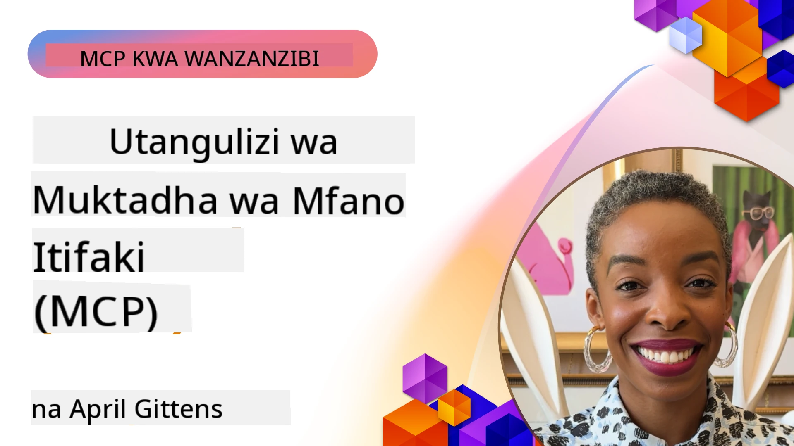
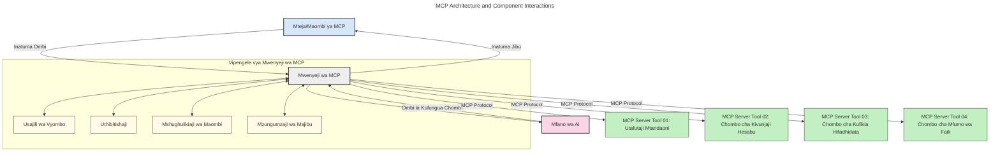
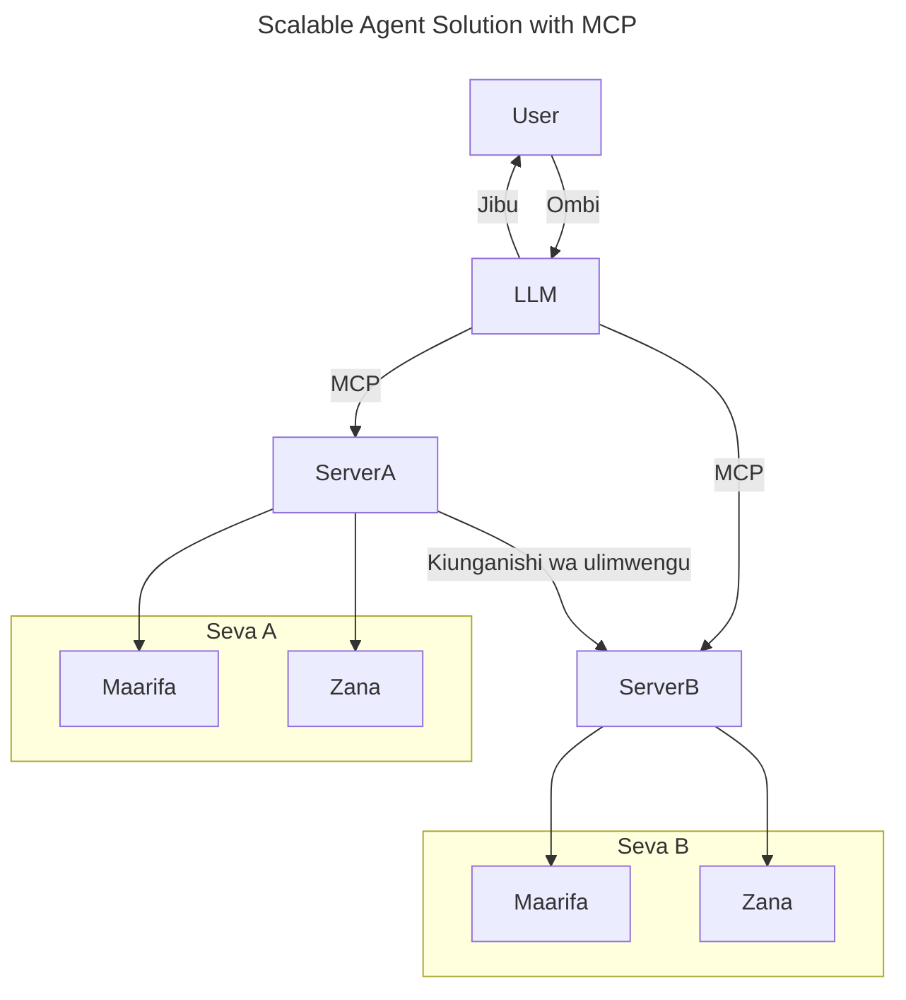
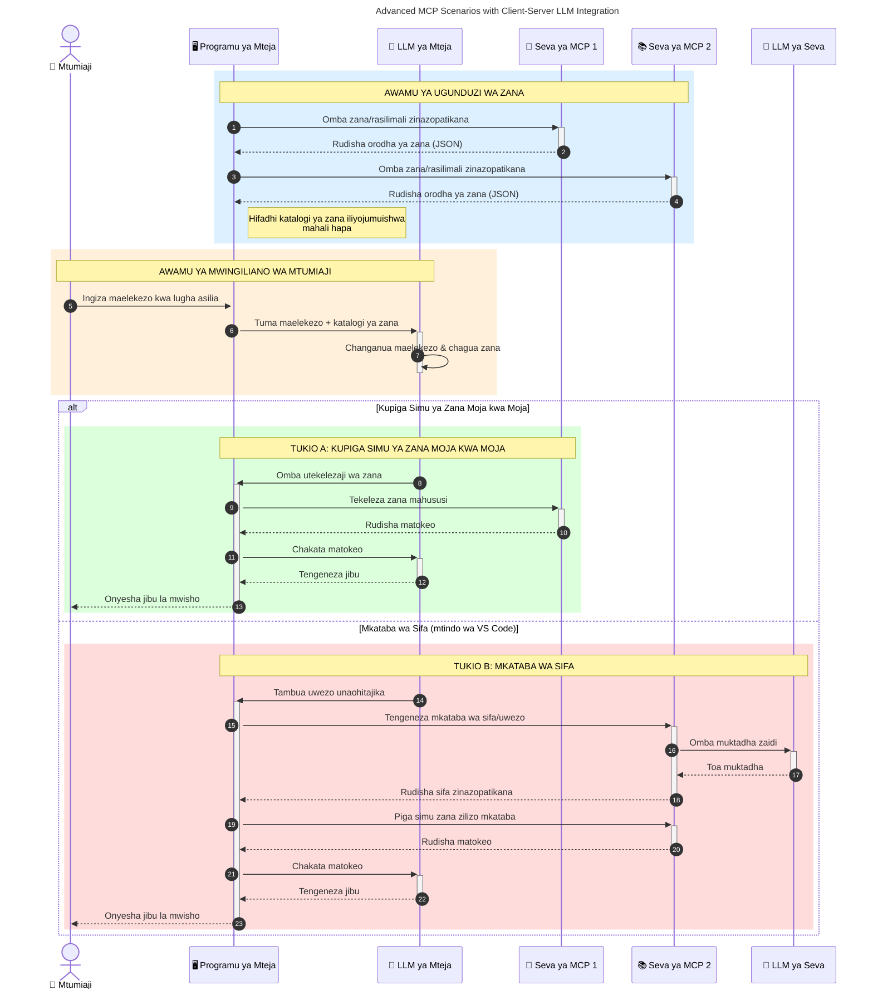

# Utangulizi wa Itifaki ya Muktadha wa Mfano (MCP): Kwa Nini Inajali kwa Maombi Yanayoweza Kupanuka ya AI

_(Bofya picha iliyo juu kutazama video ya somo hili)_

Maombi ya AI yanayozalisha ni hatua kubwa mbele kwani mara nyingi huruhusu mtumiaji kuingiliana na programu kwa kutumia maagizo ya lugha ya asili. Hata hivyo, kadiri muda na rasilimali zinavyowekezewa katika programu hizo, unataka kuhakikisha unaweza kuunganisha kwa urahisi functionalities na rasilimali kwa njia ambayo ni rahisi kupanua, kwamba programu yako inaweza kushughulikia zaidi ya mfano mmoja unaotumika, na kushughulikia ugumu mbalimbali wa mfano. Kwa kifupi, kujenga programu za AI za Gen ni rahisi kuanza nazo, lakini zinapokua na kuwa ngumu zaidi, unahitaji kuanza kuainisha usanifu na huenda ukahitaji kutegemea kiwango cha kuhakikisha programu zako zinajengwa kwa njia thabiti. Hapa ndipo MCP inapoingia kupanga mambo na kutoa kiwango.

---

## **🔍 Itifaki ya Muktadha wa Mfano (MCP) ni Nini?**

**Itifaki ya Muktadha wa Mfano (MCP)** ni **mwangala wa wazi, uliopangwa** unaoruhusu Mifano Mikubwa ya Lugha (LLMs) kuingiliana kwa urahisi na zana za nje, API, na vyanzo vya data. Inatoa usanifu thabiti wa kuboresha utendaji wa mfano wa AI zaidi ya data zao za mafunzo, kuruhusu mifumo ya AI kuwa smart, inayoweza kupanuka, na yenye majibu ya haraka.

---

## **🎯 Kwa Nini Kuwepo kwa Viwango Katika AI ni Muhimu**

Kadiri maombi ya AI yanazalisha yanavyokuwa magumu zaidi, ni muhimu kuzingatia viwango vinavyohakikisha **upanuku, upanuzi, uendelezaji kwa urahisi,** na **kuepuka kutoeleweka na muuzaji mmoja.** MCP inashughulikia mahitaji haya kwa:

- Kuunganisha ushirikiano kati ya mfano na zana
- Kupunguza suluhisho dhaifu za kipekee
- Kuruhusu mifano mingi kutoka kwa wauzaji tofauti kuishi pamoja ndani ya mfumo mmoja

**Kumbuka:** Ingawa MCP inajitangaza kama kiwango wazi, hakuna mipango ya kuifanya MCP kuwa kiwango rasmi kupitia taasisi zozote za viwango zilizopo kama IEEE, IETF, W3C, ISO, au taasisi nyingine yoyote ya viwango.

---

## **📚 Malengo ya Kujifunza**

Mwishoni mwa makala hii, utaweza:

- Eleza **Itifaki ya Muktadha wa Mfano (MCP)** na matumizi yake
- Elewa jinsi MCP inavyopanga mawasiliano kati ya mfano na zana
- Tambua vipengele vikuu vya usanifu wa MCP
- Chunguza matumizi halisi ya MCP katika muktadha wa biashara na maendeleo

---

## **💡 Kwa Nini Itifaki ya Muktadha wa Mfano (MCP) ni Mabadiliko Makubwa**

### **🔗 MCP Inatatua Tatizo la Ugawanyiko katika Mwingiliano wa AI**

Kabla ya MCP, kuunganisha mifano na zana ilihitaji:

- Msimbo wa kipekee kwa kila zana-mfano
- API zisizo za viwango kwa kila muuzaji
- Kuharibika mara kwa mara kwa sababu ya masasisho
- Ugumu wa kupanuka na zana zaidi

### **✅ Faida za Kuweka Viwango vya MCP**

| **Faida**               | **Maelezo**                                                                  |
|------------------------|------------------------------------------------------------------------------|
| Usalishaji             | LLMs hufanya kazi kwa urahisi na zana kutoka kwa wauzaji tofauti              |
| Uhalisia               | Tabia sawa katika majukwaa na zana                                            |
| Tumia Tena             | Zana zilizojengwa mara moja zinaweza kutumika katika miradi na mifumo         |
| Harakisha Maendeleo    | Punguza muda wa maendeleo kwa kutumia kiolesura cha viwango vya plug-and-play  |

---

## **🧱 Muhtasari wa Usanifu wa Juu wa MCP**

MCP inafuata **mfano wa mteja-mtoaji**, ambapo:

- **MCP Hosts** huendesha mifano ya AI
- **MCP Clients** huanzisha maombi
- **MCP Servers** hutoa muktadha, zana, na uwezo

### **Vipengele Muhimu:**

- **Rasilimali** – Data ya kawaida au ya mabadiliko kwa mifano  
- **Maagizo** – Mifumbo ya awali ya michakato ya uzalishaji uliyoongozwa  
- **Zana** – Kazi zinazotekelezwa kama utafutaji, hesabu  
- **Kuchagua Sampuli** – Tabia ya wakala kupitia mwingiliano mfululizo (haitatumiki tena katika
    MCP `2026-07-28`; utekelezaji mpya unapaswa kuunganishwa moja kwa moja na mtoa huduma wa LLM)

- **Kuomba** – Maombi yanayotokana na seva kwa ajili ya maingilio ya mtumiaji
- **Mizizi** – Mahali pa faili za taarifa muhimu kwa seva
    (haitatumiki tena katika MCP `2026-07-28`; tumia vipengele vya zana, URI za rasilimali, au usanifu wa seva)

### **Usanifu wa Itifaki:**

MCP hutumia usanifu wa tabaka mbili:
- **Tabaka la Data**: Ujumbe wa JSON-RPC 2.0, metadata kwa kila ombi, ugunduzi, na vitu vya msingi vya itifaki

- **Tabaka la Usafirishaji**: stdio kwa michakato ndogo za ndani na Streamable HTTP kwa seva za mbali. Streamable HTTP inaweza kutumia uundaji wa SSE kwa majibu ya mtiririko,
-     lakini usafirishaji wa zamani wa HTTP+SSE hautatumiwi tena.

---

## Jinsi Seva za MCP Zinavyofanya Kazi

Seva za MCP hufanya kazi kwa njia ifuatayo:

- **Mtiririko wa OMBI**:
    1. Ombi huanzishwa na mtumiaji wa mwisho au programu inayomtumikia.
    2. **MCP Client** hutuma ombi kwa **MCP Host**, anayesimamia wakati wa kutekeleza Mfano wa AI.
    3. **Mfano wa AI** hupokea ombi la mtumiaji na huenda ukaomba upatikanaji wa zana za nje au data kupitia simu moja au zaidi za zana.
    4. **MCP Host**, si mfano moja kwa moja, hufanya mawasiliano na **Seva za MCP** zinazofaa kwa kutumia itifaki iliyo sanifu.
- **Utendaji wa MCP Host**:
    - **Katalogi ya Zana**: Huduandaa orodha ya zana zinazopatikana na uwezo wake.
    - **Uthibitishaji**: Huthibitisha ruhusa za upatikanaji wa zana.
    - **Mhusika wa Ombi**: Hushughulikia maombi yanayotoka kwa mfano.
    - **Mtayarishaji wa Majibu**: Huunda matokeo ya zana katika muundo unaoeleweka na mfano.
- **Utekelezaji wa Seva za MCP**:
    - **MCP Host** hutuma simu za zana kwa moja au zaidi ya **Seva za MCP**, kila moja ikitoa kazi maalum (mfano, utafutaji, hesabu, maswali ya hifadhidata).
    - **Seva za MCP** hufanya kazi zao na kurudisha matokeo kwa **MCP Host** kwa muundo thabiti.
    - **MCP Host** huandaa na kuwasilisha matokeo haya kwa **Mfano wa AI**.
- **Kumaliza Jibu**:
    - **Mfano wa AI** huingiza matokeo ya zana katika jibu la mwisho.
    - **MCP Host** hutuma jibu hili kwa **MCP Client**, ambayo hushikilia kwa mtumiaji wa mwisho au programu inayoitisha.
    

## 👨‍💻 Jinsi ya Kuunda Seva ya MCP (Kwa Mifano)

Seva za MCP zinakuwezesha kupanua uwezo wa LLM kwa kutoa data na utendaji.

Tayari kujaribu? Hapa kuna SDK za lugha na/au zana maalum na mifano ya kuunda seva rahisi za MCP katika lugha/stack tofauti:

- **Python SDK**: https://github.com/modelcontextprotocol/python-sdk

- **TypeScript SDK**: https://github.com/modelcontextprotocol/typescript-sdk

- **Java SDK**: https://github.com/modelcontextprotocol/java-sdk

- **C#/.NET SDK**: https://github.com/modelcontextprotocol/csharp-sdk

## 🌍 Matumizi Halisi ya MCP

MCP inaruhusu aina nyingi za maombi kwa kupanua uwezo wa AI:

| **Maombi**             | **Maelezo**                                                                 |
|-----------------------|-----------------------------------------------------------------------------|
| Muunganiko wa Data wa Biashara | Unganisha LLM na bidhaa za data, CRM, au zana za ndani                       |
| Mifumo ya AI ya Wakala | Ruhusu mawakala huru kwa upatikanaji wa zana na michakato ya kufanya maamuzi |
| Maombi ya Mchanganyiko   | Changanya zana za maandishi, picha, na sauti ndani ya programu moja ya AI    |
| Muunganisho wa Data wa Wakati Halisi | Leta data ya moja kwa moja ndani ya mwingiliano wa AI kwa matokeo sahihi zaidi |

### 🧠 MCP = Kiwango cha Ulimwenguni kwa Mwingiliano wa AI

Itifaki ya Muktadha wa Mfano (MCP) hufanya kama kiwango cha ulimwengu kwa mwingiliano wa AI, kama vile USB-C ilivyoweka kiwango cha muunganisho wa vifaa kimwili. Katika ulimwengu wa AI, MCP hutoa kiolesura thabiti, kuruhusu mifano (wateja) kuungana kwa urahisi na zana za nje na watoa data (seva). Hii inahakikisha hakuna haja ya itifaki mbalimbali za kipekee kwa kila API au chanzo cha data.

Chini ya MCP, zana inayoungwa mkono na MCP (inayojulikana kama seva ya MCP) huifuata kiwango kimoja. Seva hizi zinaweza kuorodhesha zana au vitendo vinavyotolewa na kuvitekeleza wakati wakala wa AI anapoomba. Majukwaa ya wakala wa AI yanayounga mkono MCP yana uwezo wa kugundua zana zinazopatikana kutoka kwa seva na kuzitumia kupitia itifaki hii ya kiwango.

### 💡 Inarahisisha upatikanaji wa maarifa

Zaidi ya kutoa zana, MCP pia inarahisisha upatikanaji wa maarifa. Inaruhusu maombi kutoa muktadha kwa mifano mikubwa ya lugha (LLMs) kwa kuziunganisha na vyanzo mbalimbali vya data. Kwa mfano, seva ya MCP inaweza kuwakilisha hazina ya nyaraka ya kampuni, kuruhusu mawakala kupata taarifa muhimu wanaporuhusiwa. Seva nyingine inaweza kushughulikia vitendo maalum kama kutuma barua pepe au kusasisha rekodi. Kwa mtazamo wa wakala, hizi ni zana anazotumia—baadhi ya zana hurudisha data (muktadha wa maarifa), wakati zingine hufanya vitendo. MCP inasimamia vyote kwa ufanisi.

Wakala anayejumuika na seva ya MCP hujifunza kiotomati uwezo wa seva na data inayopatikana kwa muundo wa kiwango. Uwekaji viwango huu unaruhusu zana kupatikana kihudumu. Kwa mfano, kuongeza seva mpya ya MCP katika mfumo wa wakala hufanya kazi zake ziweze kutumika mara moja bila hitaji la kubadilisha maelekezo ya wakala.

Muunganiko huu uliorahisishwa unaendana na mtiririko unaoonyeshwa kwenye mchoro ufuatao, ambapo seva hutoa zana na maarifa, kuhakikisha ushirikiano laini kati ya mifumo.

### 👉 Mfano: Suluhisho la Wakala Linaloweza Kupanuka

Kiwango cha Muunganisho wa Ulimwengu huruhusu seva za MCP kuwasiliana na kushirikiana uwezo wao, kuruhusu ServerA kuazimia majukumu kwa ServerB au kupata zana zake na maarifa. Hii huwafedhesha zana na data kati ya seva, kuunga mkono usanifu wa wakala wa modulai na unaoweza kupanuka. Kwa sababu MCP huweka viwango vya mlango wa zana, mawakala wanaweza kugundua na kuongoza maombi kati ya seva bila integrasiyo ngumu.

Ushirikiano wa zana na maarifa: Zana na data zinaweza kupatikana kati ya seva, kuruhusu usanifu zaidi unaoweza kupanuka na modulai wa wakala.

### 🔄 Senario za Juu za MCP zenye Uunganisho wa LLM Upande wa Mteja

Zaidi ya usanifu wa msingi wa MCP, kuna senario za juu ambapo wateja na seva zote zina LLM, kuruhusu mwingiliano zaidi wa kisasa. Katika mchoro ufuatao, **App ya Mteja** inaweza kuwa IDE yenye zana kadhaa za MCP zinazopatikana kwa mtumiaji kwa kutumia LLM:

## 🔐 Faida za Kina za MCP

Hapa ni faida za vitendo za kutumia MCP:

- **Uchanga**: Mifano inaweza kupata taarifa za hivi punde zaidi kuliko data zao za mafunzo
- **Upanuzi wa Uwezo**: Mifano inaweza kutumia zana maalum kwa kazi ambazo haikuandaliwa kwa ajili yake
- **Kupunguza Hallucinations**: Vyanzo vya data vya nje hutoa msingi wa ukweli
- **Faragha**: Data nyeti inaweza kubaki ndani ya mazingira salama badala ya kuwekwa ndani ya maagizo

## 📌 Muhimu wa Kuzingatia

Haya ni mambo muhimu ya kuzingatia kuhusu MCP:

- **MCP** huainisha jinsi mifano ya AI inavyowasiliana na zana na data
- Hukuza **upanuku, uhalisia, na usalamu**
- MCP husaidia **kupunguza muda wa maendeleo, kuboresha uaminifu, na kupanua uwezo wa mfano**
- Usanifu wa mteja-mtoaji **huruhusu maombi ya AI kuwa ya kubadilika na yanayopanuka**

## 🧠 Mazoezi

Fikiria kuhusu AI programu unayopenda kuijenga.

- Ni zana gani za nje au data zinaweza kuongeza uwezo wake?
- Je, MCP inaweza kufanya ujumuishaji kuwa rahisi na wa kuaminika zaidi?

## Rasilimali Zaidi

- [Hazina ya MCP GitHub](https://github.com/modelcontextprotocol)

## Nini Kifuatao

Inayofuata: [Sura 1: Dhana Muhimu](../01-CoreConcepts/README.md)

---

<!-- CO-OP TRANSLATOR DISCLAIMER START -->
**Kionyozo**:
Hati hii imetafsiriwa kwa kutumia huduma ya tafsiri ya AI [Co-op Translator](https://github.com/Azure/co-op-translator). Ingawa tunajitahidi kupata usahihi, tafadhali fahamu kwamba tafsiri za kiotomatiki zinaweza kuwa na makosa au upungufu wa usahihi. Hati ya asili katika lugha yake halisi inapaswa kuchukuliwa kama chanzo cha mamlaka. Kwa taarifa muhimu, tafsiri ya kitaalamu inayofanywa na binadamu inapendekezwa. Hatutojibu kwa kuelewa vibaya au tafsiri potofu zinazotokea kutokana na matumizi ya tafsiri hii.
<!-- CO-OP TRANSLATOR DISCLAIMER END -->