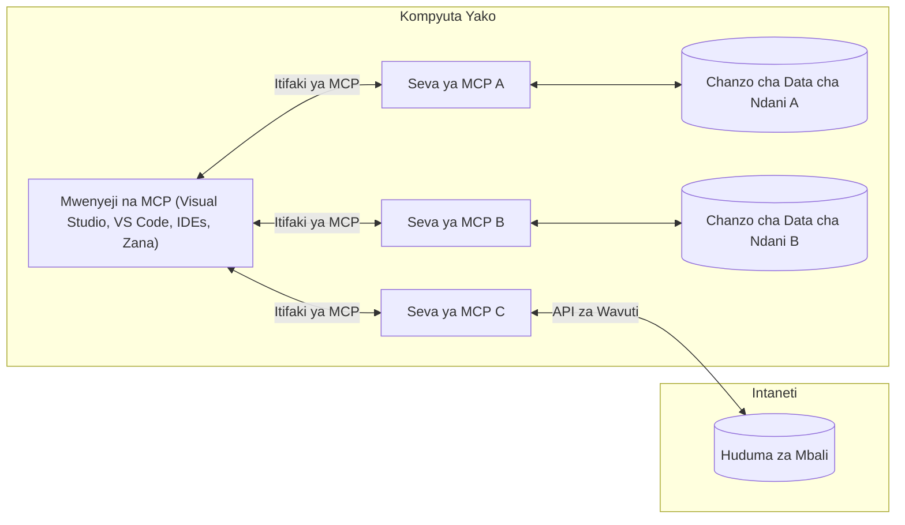

# MCP Core Concepts: Utaalamu wa Itifaki ya Muktadha wa Mfano kwa Uunganishaji wa AI

[](https://youtu.be/earDzWGtE84)

_(Bonyeza picha hapo juu kutazama video ya somo hili)_

[Model Context Protocol (MCP)](https://github.com/modelcontextprotocol) ni mfumo wenye nguvu, uliowekwa viwango unaoimarisha mawasiliano kati ya Modeli Kubwa za Lugha (LLMs) na zana za nje, programu, na vyanzo vya data.  
Mwongozo huu utakuelekeza kupitia dhana kuu za MCP. Utajifunza kuhusu usanifu wake wa mteja-mtumiaji, vipengele muhimu, mbinu za mawasiliano, na mbinu bora za utekelezaji.

- **Idhini ya Wazi ya Mtumiaji**: Upatikanaji wote wa data na shughuli zinahitaji idhini wazi ya mtumiaji kabla ya utekelezaji. Watumiaji lazima waelewe wazi ni data gani itapatikana na ni hatua gani zitatolewa, kwa udhibiti wa kina juu ya ruhusa na idhini.

- **Ulinzi wa Faragha ya Data**: Data za mtumiaji zinaonyeshwa tu kwa idhini wazi na lazima zilindwe kwa udhibiti thabiti wa upatikanaji katika mzunguko mzima wa mwingiliano. Utekelezaji lazima uzuiwe usambazaji wa data usioidhinishwa na kudumisha mipaka thabiti ya faragha.

- **Usalama wa Utekelezaji wa Zana**: Kila kuitwa kwa zana kunahitaji idhini wazi ya mtumiaji na uelewa wazi wa utendaji wa zana, vigezo, na athari zinazoweza kutokea. Mipaka thabiti ya usalama lazima izuie utekelezaji usiofaa, usio salama, au wa uovu wa zana.

- **Usalama wa Tabaka la Usafirishaji**: Njia zote za mawasiliano zinapaswa kutumia mbinu zinazofaa za usimbaji fiche na uthibitishaji. Muunganisho wa mbali unapaswa kutekeleza itifaki salama za usafirishaji na usimamizi sahihi wa vyeti.

#### Miongozo ya Utekelezaji:

- **Usimamizi wa Ruhusa**: Tekeleza mifumo ya ruhusa yenye udhibiti wa kina inayowaruhusu watumiaji kudhibiti seva, zana, na rasilimali zinazopatikana  
- **Uthibitishaji & Idhini**: Tumia mbinu salama za uthibitishaji (OAuth, API keys) na usimamizi sahihi wa tokeni na muda wake wa kumalizika  
- **Uthibitishaji wa Ingizo**: Thibitisha vigezo vyote na data za ingizo kulingana na skimu zilizobainishwa ili kuzuia mashambulizi ya sindano  
- **Kumbukumbu za Ukaguzi**: Dumisha kumbukumbu kamili za shughuli zote kwa ajili ya ufuatiliaji wa usalama na uzingatiaji

## Muhtasari

Somo hili linachunguza usanifu wa msingi na vipengele vinavyojumuisha mfumo wa Model Context Protocol (MCP). Utajifunza kuhusu usanifu wa mteja-mtumiaji, vipengele muhimu, na mbinu za mawasiliano zinazowezesha mwingiliano wa MCP.

## Malengo Muhimu ya Kujifunza

Mwisho wa somo hili, utakuwa umeweza:

- Kuelewa usanifu wa mteja-mtumiaji wa MCP.  
- Kutambua majukumu na wajibu wa Wenyeji, Wateja, na Seva.  
- Kuchambua sifa kuu zinazofanya MCP kuwa tabaka la uunganishaji lenye kubadilika.  
- Kujifunza jinsi taarifa zinavyosambaa ndani ya mfumo wa MCP.  
- Kupata maarifa ya vitendo kupitia mifano ya msimbo katika .NET, Java, Python, na JavaScript.

## Usanifu wa MCP: Mtazamo wa Kina

Mfumo wa MCP umejengwa kwa mfano wa mteja-mtumiaji. Muundo huu wa moduli unaruhusu programu za AI kuingiliana na zana, hifadhidata, API, na rasilimali za muktadha kwa ufanisi. Hebu tugawanye usanifu huu katika vipengele vyake vya msingi.

Katika msingi wake, MCP hufuata usanifu wa mteja-mtumiaji ambapo programu mwenyeji inaweza kuunganishwa na seva nyingi:


- **Wenyeji wa MCP**: Programu kama VSCode, Claude Desktop, IDEs, au zana za AI zinazotaka kupata data kupitia MCP  
- **Wateja wa MCP**: Wateja wa itifaki wanaoshikilia muunganisho wa 1:1 na seva  
- **Seva za MCP**: Programu nyepesi zinazotoa uwezo maalum kupitia Itifaki ya Muktadha wa Mfano iliyowekwa viwango  
- **Vyanzo vya Data vya Ndani**: Faili, hifadhidata, na huduma za kompyuta yako ambazo seva za MCP zinaweza kufikia kwa usalama  
- **Huduma za Mbali**: Mifumo ya nje inayopatikana mtandaoni ambayo seva za MCP zinaweza kuunganishwa nayo kupitia API.

Itifaki ya MCP ni kiwango kinachobadilika kinachotumia toleo la tarehe (muundo wa YYYY-MM-DD). Toleo la sasa la itifaki ni **2025-11-25**. Unaweza kuona masasisho ya hivi karibuni kwenye [maelezo ya itifaki](https://modelcontextprotocol.io/specification/2025-11-25/)

### 1. Wenyeji

Katika Model Context Protocol (MCP), **Wenyeji** ni programu za AI zinazotumika kama kiolesura kikuu ambacho watumiaji wanavyoshirikiana na itifaki. Wenyeji huandaa na kusimamia muunganisho na seva nyingi za MCP kwa kuunda wateja wa MCP waliotengwa kwa kila muunganisho wa seva. Mifano ya Wenyeji ni:

- **Programu za AI**: Claude Desktop, Visual Studio Code, Claude Code  
- **Mazingira ya Maendeleo**: IDEs na wahariri wa msimbo wenye uunganisho wa MCP  
- **Programu Maalum**: Wakala na zana za AI zilizojengwa kwa madhumuni maalum

**Wenyeji** ni programu zinazoratibu mwingiliano wa modeli za AI. Wan:

- **Kupanga Modeli za AI**: Kutekeleza au kuingiliana na LLMs ili kuzalisha majibu na kuratibu mtiririko wa AI  
- **Kusimamia Muunganisho wa Wateja**: Kuunda na kudumisha mteja mmoja wa MCP kwa kila muunganisho wa seva ya MCP  
- **Kudhibiti Kiolesura cha Mtumiaji**: Kushughulikia mtiririko wa mazungumzo, mwingiliano wa watumiaji, na uwasilishaji wa majibu  
- **Kutekeleza Usalama**: Kudhibiti ruhusa, vizingiti vya usalama, na uthibitishaji  
- **Kushughulikia Idhini ya Mtumiaji**: Kusimamia idhini ya mtumiaji kwa kushiriki data na utekelezaji wa zana

### 2. Wateja

**Wateja** ni vipengele muhimu vinavyoshikilia muunganisho wa moja kwa moja kati ya Wenyeji na seva za MCP. Kila mteja wa MCP huanzishwa na Mwenyeji kuunganishwa na seva maalum ya MCP, kuhakikisha njia za mawasiliano zilizoandaliwa na salama. Wateja wengi huruhusu Wenyeji kuunganishwa na seva nyingi kwa wakati mmoja.

**Wateja** ni vipengele vya kiunganishi ndani ya programu mwenyeji. Wan:

- **Mawasiliano ya Itifaki**: Kutuma maombi ya JSON-RPC 2.0 kwa seva zenye maelekezo na maagizo  
- **Mazungumzo ya Uwezo**: Kujadiliana kuhusu sifa zinazotegemewa na toleo la itifaki na seva wakati wa kuanzisha  
- **Utekelezaji wa Zana**: Kusimamia maombi ya utekelezaji wa zana kutoka kwa modeli na kushughulikia majibu  
- **Mabadiliko ya Wakati Halisi**: Kushughulikia taarifa na masasisho ya wakati halisi kutoka kwa seva  
- **Usindikaji wa Majibu**: Kusindika na kuandaa majibu ya seva kwa ajili ya kuonyeshwa kwa watumiaji

### 3. Seva

**Seva** ni programu zinazotoa muktadha, zana, na uwezo kwa wateja wa MCP. Zinaweza kutekelezwa ndani (kifaa kimoja na Mwenyeji) au mbali (kwenye majukwaa ya nje), na zinawajibika kushughulikia maombi ya mteja na kutoa majibu yaliyoandaliwa. Seva zinaonyesha utendaji maalum kupitia Itifaki ya Muktadha wa Mfano iliyowekwa viwango.

**Seva** ni huduma zinazotoa muktadha na uwezo. Wan:

- **Usajili wa Sifa**: Kusajili na kuonyesha vitu vinavyopatikana (rasilimali, maagizo, zana) kwa wateja  
- **Usindikaji wa Maombi**: Kupokea na kutekeleza simu za zana, maombi ya rasilimali, na maombi ya maagizo kutoka kwa wateja  
- **Utoaji wa Muktadha**: Kutoa taarifa za muktadha na data ili kuboresha majibu ya modeli  
- **Usimamizi wa Hali**: Kudumisha hali ya kikao na kushughulikia mwingiliano wenye hali inapohitajika  
- **Taarifa za Wakati Halisi**: Kutuma taarifa kuhusu mabadiliko ya uwezo na masasisho kwa wateja waliounganishwa

Seva zinaweza kuendelezwa na mtu yeyote kuongeza uwezo wa modeli kwa utendaji maalum, na zinaunga mkono mazingira ya usambazaji wa ndani na mbali.

### 4. Vitu vya Msingi vya Seva

Seva katika Model Context Protocol (MCP) hutoa vitu vitatu vya msingi vinavyoelezea vipengele vya msingi vya mwingiliano tajiri kati ya wateja, wenyeji, na modeli za lugha. Vitu hivi vinaelezea aina za taarifa za muktadha na vitendo vinavyopatikana kupitia itifaki.

Seva za MCP zinaweza kuonyesha mchanganyiko wowote wa vitu vitatu vya msingi vifuatavyo:

#### Rasilimali

**Rasilimali** ni vyanzo vya data vinavyotoa taarifa za muktadha kwa programu za AI. Zinawakilisha maudhui ya kimya au ya mabadiliko yanayoweza kuboresha uelewa wa modeli na uamuzi:

- **Data za Muktadha**: Taarifa zilizoandaliwa na muktadha kwa matumizi ya modeli za AI  
- **Misingi ya Maarifa**: Hifadhi za nyaraka, makala, mikataba, na karatasi za utafiti  
- **Vyanzo vya Data vya Ndani**: Faili, hifadhidata, na taarifa za mfumo wa ndani  
- **Data ya Nje**: Majibu ya API, huduma za wavuti, na data za mifumo ya mbali  
- **Maudhui ya Mabadiliko**: Data ya wakati halisi inayosasishwa kulingana na hali za nje

Rasilimali hutambulika kwa URI na zinaunga mkono ugunduzi kupitia `resources/list` na upokeaji kupitia `resources/read`:

```text
file://documents/project-spec.md
database://production/users/schema
api://weather/current
```

#### Maagizo

**Maagizo** ni templeti zinazoweza kutumika tena zinazosaidia kuunda muundo wa mwingiliano na modeli za lugha. Zinatoa mifumo ya kawaida ya mwingiliano na mtiririko wa kazi uliotembelewa:

- **Mwingiliano wa Kitempleti**: Ujumbe uliopangwa awali na vianzishaji vya mazungumzo  
- **Mifano ya Mtiririko wa Kazi**: Mfululizo uliowekwa viwango kwa kazi na mwingiliano ya kawaida  
- **Mifano ya Few-shot**: Templeti za mfano kwa maelekezo ya modeli  
- **Maagizo ya Mfumo**: Maagizo ya msingi yanayoelezea tabia na muktadha wa modeli  
- **Templeti Zinazobadilika**: Maagizo yenye vigezo vinavyobadilika kulingana na muktadha maalum

Maagizo yanaunga mkono mbadilishaji wa vigezo na yanaweza kugunduliwa kupitia `prompts/list` na kupokelewa kwa `prompts/get`:

```markdown
Generate a {{task_type}} for {{product}} targeting {{audience}} with the following requirements: {{requirements}}
```

#### Zana

**Zana** ni kazi zinazotekelezwa ambazo modeli za AI zinaweza kuitisha kufanya vitendo maalum. Zinawakilisha "vitenzi" vya mfumo wa MCP, zikiruhusu modeli kuingiliana na mifumo ya nje:

- **Kazi Zinazotekelezwa**: Operesheni za pekee ambazo modeli zinaweza kuitisha kwa vigezo maalum  
- **Uunganisho wa Mifumo ya Nje**: Simu za API, maswali ya hifadhidata, operesheni za faili, mahesabu  
- **Utambulisho wa Kipekee**: Kila zana ina jina la kipekee, maelezo, na skimu ya vigezo  
- **Ingizo na Matokeo Yaliyoandaliwa**: Zana zinakubali vigezo vilivyothibitishwa na kurudisha majibu yaliyoandaliwa na yenye aina  
- **Uwezo wa Vitendo**: Kuruhusu modeli kufanya vitendo halisi na kupata data ya moja kwa moja

Zana zinafafanuliwa kwa JSON Schema kwa uthibitishaji wa vigezo na kugunduliwa kupitia `tools/list` na kutekelezwa kwa `tools/call`:

```typescript
server.tool(
  "search_products", 
  {
    query: z.string().describe("Search query for products"),
    category: z.string().optional().describe("Product category filter"),
    max_results: z.number().default(10).describe("Maximum results to return")
  }, 
  async (params) => {
    // Fanya utafutaji na urudishe matokeo yaliyopangwa
    return await productService.search(params);
  }
);
```

## Vitu vya Msingi vya Mteja

Katika Model Context Protocol (MCP), **wateja** wanaweza kuonyesha vitu vinavyowezesha seva kuomba uwezo zaidi kutoka kwa programu mwenyeji. Vitu hivi vya upande wa mteja huruhusu utekelezaji wa seva wenye mwingiliano tajiri zaidi unaoweza kufikia uwezo wa modeli za AI na mwingiliano wa watumiaji.

### Sampuli

**Sampuli** inaruhusu seva kuomba ukamilisho wa modeli za lugha kutoka kwa programu ya AI ya mteja. Kitu hiki huruhusu seva kupata uwezo wa LLM bila kuingiza utegemezi wa modeli zao:

- **Upatikanaji Bila Kutegemea Modeli**: Seva zinaweza kuomba ukamilisho bila kujumuisha SDK za LLM au kusimamia upatikanaji wa modeli  
- **AI Inayoanzishwa na Seva**: Inaruhusu seva kuzalisha maudhui kwa kujitegemea kwa kutumia modeli ya AI ya mteja  
- **Mwingiliano wa Kurudia wa LLM**: Inasaidia hali ngumu ambapo seva zinahitaji msaada wa AI kwa usindikaji  
- **Uzalishaji wa Maudhui ya Muktadha**: Inaruhusu seva kuunda majibu ya muktadha kwa kutumia modeli ya mwenyeji

Sampuli huanzishwa kupitia njia ya `sampling/complete`, ambapo seva hutuma maombi ya ukamilisho kwa wateja.

### Utoaji wa Maelezo

**Utoaji wa Maelezo** unaruhusu seva kuomba taarifa za ziada au uthibitisho kutoka kwa watumiaji kupitia kiolesura cha mteja:

- **Maombi ya Ingizo la Mtumiaji**: Seva zinaweza kuomba taarifa za ziada inapohitajika kwa utekelezaji wa zana  
- **Mijadala ya Uthibitisho**: Kuomba idhini ya mtumiaji kwa shughuli nyeti au zenye athari  
- **Mtiririko wa Kazi wa Kuingiliana**: Kuruhusu seva kuunda mwingiliano wa mtumiaji hatua kwa hatua  
- **Ukusanyaji wa Vigezo Vinavyobadilika**: Kukusanya vigezo vinavyokosekana au hiari wakati wa utekelezaji wa zana

Maombi ya utoaji wa maelezo hufanywa kwa kutumia njia ya `elicitation/request` kukusanya ingizo la mtumiaji kupitia kiolesura cha mteja.

### Kumbukumbu

**Kumbukumbu** inaruhusu seva kutuma ujumbe wa kumbukumbu uliopangwa kwa wateja kwa ajili ya utambuzi wa hitilafu, ufuatiliaji, na uwazi wa uendeshaji:

- **Msaada wa Utambuzi wa Hitilafu**: Kuruhusu seva kutoa kumbukumbu za kina za utekelezaji kwa ajili ya utambuzi wa matatizo  
- **Ufuatiliaji wa Uendeshaji**: Kutuma masasisho ya hali na vipimo vya utendaji kwa wateja  
- **Ripoti za Makosa**: Kutoa muktadha wa makosa kwa kina na taarifa za uchunguzi  
- **Mifumo ya Ukaguzi**: Kuunda kumbukumbu kamili za shughuli na maamuzi ya seva

Ujumbe wa kumbukumbu hutumwa kwa wateja kutoa uwazi katika shughuli za seva na kuwezesha utambuzi wa hitilafu.

## Mtiririko wa Taarifa katika MCP

Model Context Protocol (MCP) inaelezea mtiririko uliopangwa wa taarifa kati ya wenyeji, wateja, seva, na modeli. Kuelewa mtiririko huu husaidia kufafanua jinsi maombi ya watumiaji yanavyosindika na jinsi zana za nje na data zinavyounganishwa katika majibu ya modeli.

- **Mwenyeji Anaanzisha Muunganisho**  
  Programu mwenyeji (kama IDE au kiolesura cha mazungumzo) huanzisha muunganisho na seva ya MCP, kawaida kupitia STDIO, WebSocket, au usafirishaji mwingine unaoungwa mkono.

- **Mazungumzo ya Uwezo**  
  Mteja (aliyejumuishwa katika mwenyeji) na seva hubadilishana taarifa kuhusu sifa, zana, rasilimali, na matoleo ya itifaki wanayounga mkono. Hii huhakikisha pande zote mbili zinaelewa uwezo unaopatikana kwa kikao.

- **Ombi la Mtumiaji**  
  Mtumiaji huingiliana na mwenyeji (mfano, kuingiza agizo au maelekezo). Mwenyeji hukusanya ingizo hili na kuwasilisha kwa mteja kwa usindikaji.

- **Matumizi ya Rasilimali au Zana**  
  - Mteja anaweza kuomba muktadha au rasilimali zaidi kutoka kwa seva (kama faili, rekodi za hifadhidata, au makala za misingi ya maarifa) ili kuongeza uelewa wa modeli.  
  - Ikiwa modeli inaamua zana inahitajika (mfano, kupata data, kufanya mahesabu, au kuita API), mteja hutuma ombi la kuitisha zana kwa seva, akibainisha jina la zana na vigezo.

- **Utekelezaji wa Seva**  
  Seva hupokea ombi la rasilimali au zana, hufanya shughuli zinazohitajika (kama kuendesha kazi, kuuliza hifadhidata, au kupata faili), na hurudisha matokeo kwa mteja kwa muundo uliopangwa.

- **Uzalishaji wa Majibu**  
  Mteja huunganisha majibu ya seva (data za rasilimali, matokeo ya zana, n.k.) katika mwingiliano unaoendelea wa modeli. Modeli hutumia taarifa hii kuzalisha jibu kamili na linalofaa kwa muktadha.

- **Uwasilishaji wa Matokeo**  
  Mwenyeji hupokea matokeo ya mwisho kutoka kwa mteja na kuwasilisha kwa mtumiaji, mara nyingi ikiwa ni pamoja na maandishi yaliyotengenezwa na modeli na matokeo yoyote kutoka kwa utekelezaji wa zana au utafutaji wa rasilimali.

Mtiririko huu unaruhusu MCP kuunga mkono programu za AI za hali ya juu, zenye mwingiliano, na zenye ufahamu wa muktadha kwa kuunganisha modeli na zana za nje na vyanzo vya data kwa urahisi.

## Usanifu wa Itifaki & Tabaka

MCP ina tabaka mawili tofauti za usanifu zinazofanya kazi pamoja kutoa mfumo kamili wa mawasiliano:

### Tabaka la Data

**Tabaka la Data** hutekeleza itifaki kuu ya MCP kwa kutumia **JSON-RPC 2.0** kama msingi wake. Tabaka hili linaelezea muundo wa ujumbe, maana, na mifumo ya mwingiliano:

#### Vipengele vya Msingi:

- **Itifaki ya JSON-RPC 2.0**: Mawasiliano yote hutumia muundo wa ujumbe wa JSON-RPC 2.0 uliowekwa viwango kwa simu za njia, majibu, na taarifa
- **Usimamizi wa Mzunguko wa Maisha**: Husimamia uanzishaji wa muunganisho, mazungumzo ya uwezo, na kumalizika kwa kikao kati ya wateja na seva
- **Vifungu vya Seva**: Huruhusu seva kutoa utendaji msingi kupitia zana, rasilimali, na maelekezo
- **Vifungu vya Mteja**: Huruhusu seva kuomba sampuli kutoka kwa LLMs, kuomba maoni ya mtumiaji, na kutuma ujumbe wa kumbukumbu
- **Arifa za Wakati Halisi**: Husaidia arifa zisizo za wakati mmoja kwa masasisho ya mabadiliko bila uchunguzi wa mara kwa mara

#### Sifa Muhimu:

- **Mazungumzo ya Toleo la Itifaki**: Inatumia toleo la tarehe (YYYY-MM-DD) kuhakikisha ulinganifu
- **Ugunduzi wa Uwezo**: Wateja na seva hubadilishana taarifa za vipengele vinavyounga mkono wakati wa uanzishaji
- **Vikao Vyenye Hali**: Huhifadhi hali ya muunganisho katika mwingiliano kadhaa kwa muktadha wa mfululizo

### Tabaka la Usafirishaji

**Tabaka la Usafirishaji** husimamia njia za mawasiliano, uundaji wa ujumbe, na uthibitishaji kati ya washiriki wa MCP:

#### Njia Zinazounga Mkono Usafirishaji:

1. **Usafirishaji wa STDIO**:
   - Inatumia mtiririko wa pembejeo/pembezoni kwa mawasiliano ya moja kwa moja ya mchakato
   - Inafaa kwa michakato ya ndani kwenye mashine ile ile bila mzigo wa mtandao
   - Inatumiwa sana kwa utekelezaji wa seva za MCP za ndani

2. **Usafirishaji wa HTTP Unaoweza Kutiririka**:
   - Inatumia HTTP POST kwa ujumbe kutoka mteja kwenda seva  
   - Chaguo la Matukio Yanayotumwa na Seva (SSE) kwa utiririshaji kutoka seva kwenda mteja
   - Huruhusu mawasiliano ya seva za mbali kupitia mitandao
   - Inasaidia uthibitishaji wa kawaida wa HTTP (tokeni za bearer, funguo za API, vichwa maalum)
   - MCP inapendekeza OAuth kwa uthibitishaji salama wa tokeni

#### Ufafanuzi wa Usafirishaji:

Tabaka la usafirishaji linaficha maelezo ya mawasiliano kutoka tabaka la data, kuruhusu muundo ule ule wa ujumbe wa JSON-RPC 2.0 kutumika kwa njia zote za usafirishaji. Ufafanuzi huu huruhusu programu kubadilisha kati ya seva za ndani na za mbali kwa urahisi.

### Mambo ya Usalama

Utekelezaji wa MCP lazima uzingatie kanuni kadhaa muhimu za usalama kuhakikisha mwingiliano salama, wa kuaminika, na ulio salama katika shughuli zote za itifaki:

- **Idhini na Udhibiti wa Mtumiaji**: Watumiaji lazima watoe idhini wazi kabla ya data yoyote kufikiwa au shughuli kufanyika. Wanapaswa kuwa na udhibiti wazi juu ya data inayoshirikiwa na hatua zinazoruhusiwa, zikiwa na kiolesura rahisi cha mtumiaji kwa ukaguzi na idhini ya shughuli.

- **Faragha ya Data**: Data ya mtumiaji inapaswa kufichuliwa tu kwa idhini wazi na kulindwa kwa udhibiti sahihi wa upatikanaji. Utekelezaji wa MCP lazima ulinde dhidi ya usambazaji usioidhinishwa wa data na kuhakikisha faragha inahifadhiwa katika mwingiliano wote.

- **Usalama wa Zana**: Kabla ya kuitisha zana yoyote, idhini wazi ya mtumiaji inahitajika. Watumiaji wanapaswa kuelewa vizuri utendaji wa kila zana, na mipaka thabiti ya usalama lazima itekelezwe kuzuia utekelezaji usiofaa au hatari wa zana.

Kwa kufuata kanuni hizi za usalama, MCP huhakikisha kuaminika, faragha, na usalama wa mtumiaji vinahifadhiwa katika mwingiliano yote ya itifaki huku ikiruhusu ushirikiano wenye nguvu wa AI.

## Mifano ya Msimbo: Vipengele Muhimu

Hapa chini ni mifano ya msimbo katika lugha maarufu kadhaa inayoonyesha jinsi ya kutekeleza vipengele muhimu vya seva ya MCP na zana.

### Mfano wa .NET: Kuunda Seva Rahisi ya MCP na Zana

Huu ni mfano wa msimbo wa .NET unaoonyesha jinsi ya kutekeleza seva rahisi ya MCP na zana maalum. Mfano huu unaonyesha jinsi ya kufafanua na kusajili zana, kushughulikia maombi, na kuunganisha seva kwa kutumia Itifaki ya Muktadha wa Mfano.

```csharp
using System;
using System.Threading.Tasks;
using ModelContextProtocol.Server;
using ModelContextProtocol.Server.Transport;
using ModelContextProtocol.Server.Tools;

public class WeatherServer
{
    public static async Task Main(string[] args)
    {
        // Create an MCP server
        var server = new McpServer(
            name: "Weather MCP Server",
            version: "1.0.0"
        );
        
        // Register our custom weather tool
        server.AddTool<string, WeatherData>("weatherTool", 
            description: "Gets current weather for a location",
            execute: async (location) => {
                // Call weather API (simplified)
                var weatherData = await GetWeatherDataAsync(location);
                return weatherData;
            });
        
        // Connect the server using stdio transport
        var transport = new StdioServerTransport();
        await server.ConnectAsync(transport);
        
        Console.WriteLine("Weather MCP Server started");
        
        // Keep the server running until process is terminated
        await Task.Delay(-1);
    }
    
    private static async Task<WeatherData> GetWeatherDataAsync(string location)
    {
        // This would normally call a weather API
        // Simplified for demonstration
        await Task.Delay(100); // Simulate API call
        return new WeatherData { 
            Temperature = 72.5,
            Conditions = "Sunny",
            Location = location
        };
    }
}

public class WeatherData
{
    public double Temperature { get; set; }
    public string Conditions { get; set; }
    public string Location { get; set; }
}
```

### Mfano wa Java: Vipengele vya Seva ya MCP

Mfano huu unaonyesha seva ile ile ya MCP na usajili wa zana kama ilivyo kwenye mfano wa .NET hapo juu, lakini umeandikwa kwa Java.

```java
import io.modelcontextprotocol.server.McpServer;
import io.modelcontextprotocol.server.McpToolDefinition;
import io.modelcontextprotocol.server.transport.StdioServerTransport;
import io.modelcontextprotocol.server.tool.ToolExecutionContext;
import io.modelcontextprotocol.server.tool.ToolResponse;

public class WeatherMcpServer {
    public static void main(String[] args) throws Exception {
        // Unda seva ya MCP
        McpServer server = McpServer.builder()
            .name("Weather MCP Server")
            .version("1.0.0")
            .build();
            
        // Sajili chombo cha hali ya hewa
        server.registerTool(McpToolDefinition.builder("weatherTool")
            .description("Gets current weather for a location")
            .parameter("location", String.class)
            .execute((ToolExecutionContext ctx) -> {
                String location = ctx.getParameter("location", String.class);
                
                // Pata data ya hali ya hewa (imefupishwa)
                WeatherData data = getWeatherData(location);
                
                // Rudisha jibu lililopangwa
                return ToolResponse.content(
                    String.format("Temperature: %.1f°F, Conditions: %s, Location: %s", 
                    data.getTemperature(), 
                    data.getConditions(), 
                    data.getLocation())
                );
            })
            .build());
        
        // Unganisha seva kwa kutumia usafirishaji wa stdio
        try (StdioServerTransport transport = new StdioServerTransport()) {
            server.connect(transport);
            System.out.println("Weather MCP Server started");
            // Weka seva ikifanya kazi hadi mchakato uishe
            Thread.currentThread().join();
        }
    }
    
    private static WeatherData getWeatherData(String location) {
        // Utekelezaji ungetumia API ya hali ya hewa
        // Imefupishwa kwa madhumuni ya mfano
        return new WeatherData(72.5, "Sunny", location);
    }
}

class WeatherData {
    private double temperature;
    private String conditions;
    private String location;
    
    public WeatherData(double temperature, String conditions, String location) {
        this.temperature = temperature;
        this.conditions = conditions;
        this.location = location;
    }
    
    public double getTemperature() {
        return temperature;
    }
    
    public String getConditions() {
        return conditions;
    }
    
    public String getLocation() {
        return location;
    }
}
```

### Mfano wa Python: Kujenga Seva ya MCP

Mfano huu unatumia fastmcp, tafadhali hakikisha umeisakinisha kwanza:

```python
pip install fastmcp
```
Mfano wa Msimbo:

```python
#!/usr/bin/env python3
import asyncio
from fastmcp import FastMCP
from fastmcp.transports.stdio import serve_stdio

# Unda seva ya FastMCP
mcp = FastMCP(
    name="Weather MCP Server",
    version="1.0.0"
)

@mcp.tool()
def get_weather(location: str) -> dict:
    """Gets current weather for a location."""
    return {
        "temperature": 72.5,
        "conditions": "Sunny",
        "location": location
    }

# Njia mbadala kutumia darasa
class WeatherTools:
    @mcp.tool()
    def forecast(self, location: str, days: int = 1) -> dict:
        """Gets weather forecast for a location for the specified number of days."""
        return {
            "location": location,
            "forecast": [
                {"day": i+1, "temperature": 70 + i, "conditions": "Partly Cloudy"}
                for i in range(days)
            ]
        }

# Sajili zana za darasa
weather_tools = WeatherTools()

# Anzisha seva
if __name__ == "__main__":
    asyncio.run(serve_stdio(mcp))
```

### Mfano wa JavaScript: Kuunda Seva ya MCP

Mfano huu unaonyesha uundaji wa seva ya MCP kwa JavaScript na jinsi ya kusajili zana mbili zinazohusiana na hali ya hewa.

```javascript
// Kutumia SDK Rasmi ya Itifaki ya Muktadha wa Mfano
import { McpServer } from "@modelcontextprotocol/sdk/server/mcp.js";
import { StdioServerTransport } from "@modelcontextprotocol/sdk/server/stdio.js";
import { z } from "zod"; // Kwa uthibitishaji wa vigezo

// Tengeneza seva ya MCP
const server = new McpServer({
  name: "Weather MCP Server",
  version: "1.0.0"
});

// Eleza chombo cha hali ya hewa
server.tool(
  "weatherTool",
  {
    location: z.string().describe("The location to get weather for")
  },
  async ({ location }) => {
    // Hii kawaida itaita API ya hali ya hewa
    // Imepunguzwa kwa ajili ya maonyesho
    const weatherData = await getWeatherData(location);
    
    return {
      content: [
        { 
          type: "text", 
          text: `Temperature: ${weatherData.temperature}°F, Conditions: ${weatherData.conditions}, Location: ${weatherData.location}` 
        }
      ]
    };
  }
);

// Eleza chombo cha utabiri
server.tool(
  "forecastTool",
  {
    location: z.string(),
    days: z.number().default(3).describe("Number of days for forecast")
  },
  async ({ location, days }) => {
    // Hii kawaida itaita API ya hali ya hewa
    // Imepunguzwa kwa ajili ya maonyesho
    const forecast = await getForecastData(location, days);
    
    return {
      content: [
        { 
          type: "text", 
          text: `${days}-day forecast for ${location}: ${JSON.stringify(forecast)}` 
        }
      ]
    };
  }
);

// Kazi za msaada
async function getWeatherData(location) {
  // Tengeneza simu ya API
  return {
    temperature: 72.5,
    conditions: "Sunny",
    location: location
  };
}

async function getForecastData(location, days) {
  // Tengeneza simu ya API
  return Array.from({ length: days }, (_, i) => ({
    day: i + 1,
    temperature: 70 + Math.floor(Math.random() * 10),
    conditions: i % 2 === 0 ? "Sunny" : "Partly Cloudy"
  }));
}

// Unganisha seva kwa kutumia usafirishaji wa stdio
const transport = new StdioServerTransport();
server.connect(transport).catch(console.error);

console.log("Weather MCP Server started");
```

Mfano huu wa JavaScript unaonyesha jinsi ya kuunda mteja wa MCP anayejumuika na seva, kutuma maelekezo, na kushughulikia majibu ikiwa ni pamoja na simu za zana zilizofanywa.

## Usalama na Idhini

MCP ina dhana na mbinu kadhaa zilizojengwa ndani za kusimamia usalama na idhini katika itifaki yote:

1. **Udhibiti wa Ruhusa za Zana**:  
  Wateja wanaweza kubainisha zana gani mfano anaruhusiwa kutumia wakati wa kikao. Hii huhakikisha zana zilizoidhinishwa wazi tu ndizo zinazopatikana, kupunguza hatari ya shughuli zisizotarajiwa au hatari. Ruhusa zinaweza kusanidiwa kwa nguvu kulingana na mapendeleo ya mtumiaji, sera za shirika, au muktadha wa mwingiliano.

2. **Uthibitishaji**:  
  Seva zinaweza kuhitaji uthibitishaji kabla ya kutoa upatikanaji wa zana, rasilimali, au shughuli nyeti. Hii inaweza kujumuisha funguo za API, tokeni za OAuth, au mifumo mingine ya uthibitishaji. Uthibitishaji sahihi huhakikisha wateja na watumiaji wa kuaminika tu wanaweza kuitisha uwezo wa seva.

3. **Uthibitishaji wa Vigezo**:  
  Uthibitishaji wa vigezo unatekelezwa kwa simu zote za zana. Kila zana huainisha aina, muundo, na vizingiti vinavyotarajiwa kwa vigezo vyake, na seva huhakikisha maombi yanayopokelewa yanakidhi vigezo hivyo. Hii huzuia pembejeo zisizo sahihi au hatari kufikia utekelezaji wa zana na kusaidia kudumisha uadilifu wa shughuli.

4. **Kuzuia Kiwango cha Matumizi**:  
  Ili kuzuia matumizi mabaya na kuhakikisha usawa wa rasilimali za seva, seva za MCP zinaweza kutekeleza mipaka ya kiwango cha simu za zana na upatikanaji wa rasilimali. Mipaka inaweza kuwekwa kwa mtumiaji, kikao, au kwa jumla, na kusaidia kulinda dhidi ya mashambulizi ya kukatiza huduma au matumizi ya rasilimali kupita kiasi.

Kwa kuunganisha mbinu hizi, MCP hutoa msingi salama wa kuingiza mifano ya lugha na zana za nje na vyanzo vya data, huku ikiwapa watumiaji na waendelezaji udhibiti wa kina juu ya upatikanaji na matumizi.

## Ujumbe wa Itifaki & Mtiririko wa Mawasiliano

Mawasiliano ya MCP hutumia ujumbe uliopangwa wa **JSON-RPC 2.0** kuwezesha mwingiliano wazi na wa kuaminika kati ya mwenyeji, wateja, na seva. Itifaki inaeleza mifumo maalum ya ujumbe kwa aina tofauti za shughuli:

### Aina Muhimu za Ujumbe:

#### **Ujumbe wa Uanzishaji**
- Ombi la **`initialize`**: Huweka muunganisho na kuzungumzia toleo la itifaki na uwezo
- Jibu la **`initialize`**: Thibitisha vipengele vinavyounga mkono na taarifa za seva  
- **`notifications/initialized`**: Inaashiria kuwa uanzishaji umekamilika na kikao kiko tayari

#### **Ujumbe wa Ugunduzi**
- Ombi la **`tools/list`**: Ugundua zana zinazopatikana kutoka seva
- Ombi la **`resources/list`**: Orodhesha rasilimali zinazopatikana (vyanzo vya data)
- Ombi la **`prompts/list`**: Inapata templeti za maelekezo zinazopatikana

#### **Ujumbe wa Utekelezaji**  
- Ombi la **`tools/call`**: Hufanya zana maalum kwa vigezo vilivyotolewa
- Ombi la **`resources/read`**: Inapata maudhui kutoka rasilimali maalum
- Ombi la **`prompts/get`**: Inapata templeti ya maelekezo na vigezo vya hiari

#### **Ujumbe wa Mteja**
- Ombi la **`sampling/complete`**: Seva inaomba ukamilishaji wa LLM kutoka kwa mteja
- **`elicitation/request`**: Seva inaomba maoni ya mtumiaji kupitia kiolesura cha mteja
- Ujumbe wa Kumbukumbu: Seva hutuma ujumbe wa kumbukumbu uliopangwa kwa mteja

#### **Ujumbe wa Arifa**
- **`notifications/tools/list_changed`**: Seva inaarifu mteja kuhusu mabadiliko ya zana
- **`notifications/resources/list_changed`**: Seva inaarifu mteja kuhusu mabadiliko ya rasilimali  
- **`notifications/prompts/list_changed`**: Seva inaarifu mteja kuhusu mabadiliko ya maelekezo

### Muundo wa Ujumbe:

Ujumbe wote wa MCP hufuata muundo wa JSON-RPC 2.0 na:
- **Ujumbe wa Ombi**: Unajumuisha `id`, `method`, na `params` za hiari
- **Ujumbe wa Jibu**: Unajumuisha `id` na `result` au `error`  
- **Ujumbe wa Arifa**: Unajumuisha `method` na `params` za hiari (hakuna `id` au jibu linalotarajiwa)

Mawasiliano haya yaliyopangwa huhakikisha mwingiliano wa kuaminika, unaoweza kufuatiliwa, na unaoweza kupanuliwa unaounga mkono hali za juu kama masasisho ya wakati halisi, mnyororo wa zana, na usimamizi thabiti wa makosa.

## Muhimu ya Kumbuka

- **Mimari**: MCP hutumia usanifu wa mteja-seva ambapo wenyeji husimamia muunganisho wa wateja wengi kwa seva
- **Washiriki**: Eneo lina wenyeji (programu za AI), wateja (vionganishi vya itifaki), na seva (watoa uwezo)
- **Njia za Usafirishaji**: Mawasiliano yanaunga mkono STDIO (ndani) na HTTP Inayotiririka na SSE ya hiari (mbali)
- **Vifungu Muhimu**: Seva huonyesha zana (kazi zinazotekelezwa), rasilimali (vyanzo vya data), na maelekezo (templeti)
- **Vifungu vya Mteja**: Seva zinaweza kuomba sampuli (ukamilishaji wa LLM), maoni (maoni ya mtumiaji), na kumbukumbu kutoka kwa wateja
- **Msingi wa Itifaki**: Imejengwa juu ya JSON-RPC 2.0 na toleo la tarehe (sasa: 2025-11-25)
- **Uwezo wa Wakati Halisi**: Husaidia arifa kwa masasisho ya mabadiliko na usawazishaji wa wakati halisi
- **Usalama Kwanza**: Idhini wazi ya mtumiaji, ulinzi wa faragha ya data, na usafirishaji salama ni mahitaji muhimu

## Zoef

Buni zana rahisi ya MCP ambayo itakuwa na manufaa katika eneo lako. Tafsiri:
1. Jina la zana
2. Vigezo itakavyokubali
3. Matokeo itakayorudisha
4. Jinsi mfano unavyoweza kutumia zana hii kutatua matatizo ya mtumiaji


---

## Ifuatayo

Ifuatayo: [Sura ya 2: Usalama](../02-Security/README.md)

---

<!-- CO-OP TRANSLATOR DISCLAIMER START -->
**Kiarifa cha Kukataa**:
Hati hii imetafsiriwa kwa kutumia huduma ya tafsiri ya AI [Co-op Translator](https://github.com/Azure/co-op-translator). Ingawa tunajitahidi kwa usahihi, tafadhali fahamu kwamba tafsiri za kiotomatiki zinaweza kuwa na makosa au upungufu wa usahihi. Hati ya asili katika lugha yake ya asili inapaswa kuchukuliwa kama chanzo cha mamlaka. Kwa taarifa muhimu, tafsiri ya kitaalamu ya binadamu inapendekezwa. Hatubebei dhamana kwa kutoelewana au tafsiri potofu zinazotokana na matumizi ya tafsiri hii.
<!-- CO-OP TRANSLATOR DISCLAIMER END -->