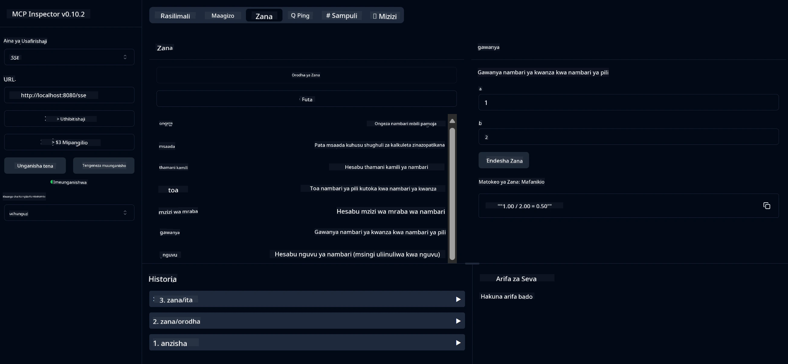

# Huduma ya Kimsingi ya Kalkuleta MCP

> [!NOTE]
> Suluhisho hili la Java linatumia usafirishaji wa zamani wa HTTP+SSE na linalenga SDK
> inayolingana na MCP `2025-11-25`. Limehifadhiwa kwa ajili ya kuendana na msimbo wa kozi;
> seva mpya za mbali zinapaswa kutumia msaada wa Streamable HTTP wa `2026-07-28`.

Huduma hii hutoa shughuli za kimsingi za kalkuleta kupitia Itifaki ya Muktadha wa Mfano (MCP) kwa kutumia Spring Boot na usafirishaji wa WebFlux. Imesanifiwa kama mfano rahisi kwa wanaoanza kujifunza kuhusu utekelezaji wa MCP.

Kwa maelezo zaidi, angalia nyaraka za rejeleo za [MCP Server Boot Starter](https://docs.spring.io/spring-ai/reference/api/mcp/mcp-server-boot-starter-docs.html).


## Kutumia Huduma

Huduma inaonyesha sehemu zifuatazo za API kupitia itifaki ya MCP:

- `add(a, b)`: Ongeza nambari mbili pamoja
- `subtract(a, b)`: Toa nambari ya pili kutoka ya kwanza
- `multiply(a, b)`: Zidisha nambari mbili
- `divide(a, b)`: Gawanya nambari ya kwanza kwa ya pili (kwa ukaguzi wa sifuri)
- `power(base, exponent)`: Pata nguvu ya nambari
- `squareRoot(number)`: Pata mzizi wa mraba (kwa ukaguzi wa nambari hasi)
- `modulus(a, b)`: Pata mabaki ya kugawanya
- `absolute(number)`: Pata thamani halisi (absolute value)

## Vitegemezi

Mradi unahitaji vitegemezi kuu vifuatavyo:

```xml
<dependency>
    <groupId>org.springframework.ai</groupId>
    <artifactId>spring-ai-starter-mcp-server-webflux</artifactId>
</dependency>
```

## Kujenga Mradi

Jenga mradi kwa kutumia Maven:
```bash
./mvnw clean install -DskipTests
```

## Kuendesha Seva

### Kutumia Java

```bash
java -jar target/calculator-server-0.0.1-SNAPSHOT.jar
```

### Kutumia MCP Inspector

MCP Inspector ni chombo kinachosaidia kuingiliana na huduma za MCP. Ili kuitumia na huduma hii ya kalkuleta:

1. **Sakinisha na endesha MCP Inspector** katika dirisha jipya la terminal:
   ```bash
   npx @modelcontextprotocol/inspector
   ```

2. **Fikia UI ya wavuti** kwa kubofya URL inayoonekana kwenye programu (kawaida http://localhost:6274)

3. **Sanidi muunganisho**:
   - Weka aina ya usafirishaji kuwa "SSE"
   - Weka URL ya endpoint ya SSE inayoendesha kwenye seva yako: `http://localhost:8080/sse`
   - Bonyeza "Connect"

4. **Tumia zana**:
   - Bonyeza "List Tools" kuona shughuli za kalkuleta zinazopatikana
   - Chagua zana na bonyeza "Run Tool" kuendesha shughuli



---

<!-- CO-OP TRANSLATOR DISCLAIMER START -->
**Kionyozo**:
Hati hii imetafsiriwa kwa kutumia huduma ya tafsiri ya AI [Co-op Translator](https://github.com/Azure/co-op-translator). Ingawa tunajitahidi kupata usahihi, tafadhali fahamu kwamba tafsiri za kiotomatiki zinaweza kuwa na makosa au upungufu wa usahihi. Hati ya asili katika lugha yake halisi inapaswa kuchukuliwa kama chanzo cha mamlaka. Kwa taarifa muhimu, tafsiri ya kitaalamu inayofanywa na binadamu inapendekezwa. Hatutojibu kwa kuelewa vibaya au tafsiri potofu zinazotokea kutokana na matumizi ya tafsiri hii.
<!-- CO-OP TRANSLATOR DISCLAIMER END -->