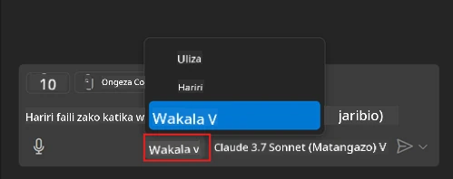
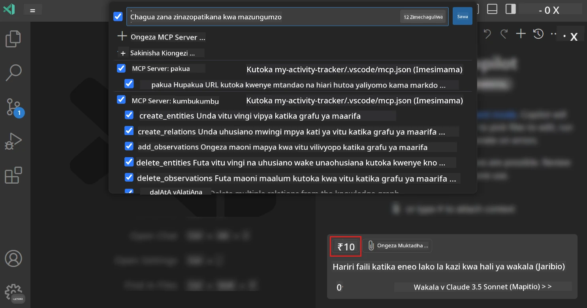
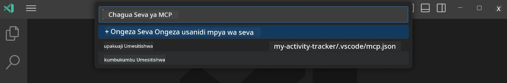
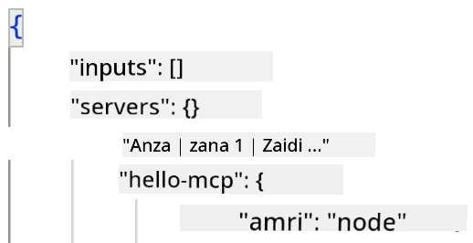
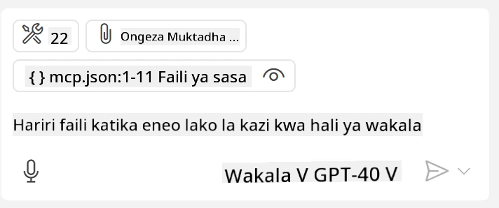
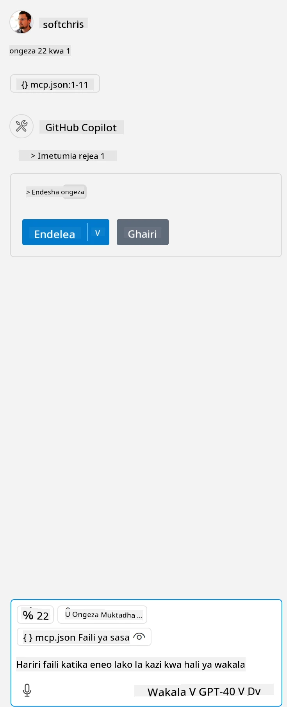

# Kutumia seva kutoka kwa GitHub Copilot Agent mode

Visual Studio Code na GitHub Copilot vinaweza kutenda kama mteja na kutumia MCP Server. Mbona tungependa kufanya hivyo unaweza kuuliza? Vizuri, hiyo inamaanisha kwamba sifa zozote ambazo MCP Server ina sasa zinaweza kutumika kutoka ndani ya IDE yako. Fikiria unazidisha kwa mfano seva ya MCP ya GitHub, hii itaruhusu kudhibiti GitHub kupitia maagizo badala ya kuandika amri maalum kwenye terminal. Au fikiria lolote kwa ujumla linaloweza kuboresha uzoefu wako wa mtengenezaji lililodhibitiwa kwa lugha ya kawaida. Sasa unaanza kuona faida, sivyo?

## Muhtasari

Somo hili linaelezea jinsi ya kutumia Visual Studio Code na GitHub Copilot Agent mode kama mteja kwa MCP Server yako.

## Malengo ya Kujifunza

Mwishoni mwa somo hili, utakuwa na uwezo wa:

- Kutumia MCP Server kupitia Visual Studio Code.
- Kuendesha uwezo kama zana kupitia GitHub Copilot.
- Kusanidi Visual Studio Code ili kupata na kusimamia MCP Server yako.

## Matumizi

Unaweza kudhibiti seva yako ya MCP kwa njia mbili tofauti:

- Kiolesura cha mtumiaji, utaona jinsi inavyofanywa baadaye katika sura hii.
- Terminal, inawezekana kudhibiti vitu kutoka terminal kwa kutumia executable ya `code`:

  Kuongeza seva ya MCP kwenye wasifu wako wa mtumiaji, tumia chaguo la mstari wa amri --add-mcp, na toa usanidi wa seva wa JSON kwa namna {\"name\":\"server-name\",\"command\":...}.

  ```
  code --add-mcp "{\"name\":\"my-server\",\"command\": \"uvx\",\"args\": [\"mcp-server-fetch\"]}"
  ```

### Picha za Skrini





Hebu tuzungumze zaidi kuhusu jinsi tunavyotumia kiolesura cha kuona katika sehemu zinazofuata.

## Mbinu

Hivi ndivyo tunavyohitaji kukabiliana na hili kwa kiwango cha juu:

- Sanidi faili ili kupata MCP Server yetu.
- Anza/Kuwaunganishe na seva hiyo ili iorodheshe uwezo wake.
- Tumia uwezo huo kupitia kiolesura cha mazungumzo cha GitHub Copilot Chat.

Vizuri, sasa tunapoelewa mtiririko, hebu jaribu kutumia MCP Server kupitia Visual Studio Code kupitia zoezi.

## Zoezi: Kutumia seva

Katika zoezi hili, tutasanidi Visual Studio Code ili ipate seva yako ya MCP ili itumike kutoka kiolesura cha mazungumzo cha GitHub Copilot.

### -0- Hatua ya awali, wezesha ugunduzi wa seva za MCP

Huenda ukahitaji kuwezesha ugunduzi wa seva za MCP.

1. Nenda kwenye `File -> Preferences -> Settings` ndani Visual Studio Code.

1. Tafuta "MCP" na uwezeshe `chat.mcp.discovery.enabled` katika faili la settings.json.

### -1- Tengeneza faili la usanidi

Anza kwa kutengeneza faili la usanidi katika mzizi wa mradi wako, utahitaji faili inayoitwa MCP.json na kuiweka katika folda inayoitwa .vscode. Inapaswa kuwa kama hii:

```text
.vscode
|-- mcp.json
```

Ifuatayo, tuchunguie jinsi ya kuongeza kumbukumbu ya seva.

### -2- Sanidi seva

Ongeza maudhui yafuatayo kwenye *mcp.json*:

```json
{
    "inputs": [],
    "servers": {
       "hello-mcp": {
           "command": "node",
           "args": [
               "build/index.js"
           ]
       }
    }
}
```

Hapa juu ni mfano rahisi jinsi ya kuanzisha seva iliyoandikwa kwa Node.js, kwa runtimes nyingine elezea amri sahihi ya kuanzisha seva kwa kutumia `command` na `args`.

### -3- Anzisha seva

Sasa umeongeza kumbukumbu, hebu anzisha seva:

1. Tafuta kumbukumbu yako katika *mcp.json* na hakikisha unapata ikoni ya "play":

    

1. Bonyeza ikoni ya "play", unapaswa kuona ikoni ya zana katika GitHub Copilot Chat ikiongezeka idadi ya zana zinazopatikana. Ukibonyeza ikoni ya zana hizo, utaona orodha ya zana zilizosajiliwa. Unaweza kuchagua/kutoa alama zana yoyote kulingana na ikiwa unataka GitHub Copilot izitumie kama muktadha:

  

1. Kuendesha zana, andika maelekezo unayoyajua yataendana na maelezo ya moja ya zana zako, kwa mfano maelekezo kama "ongeza 22 kwa 1":

  

  Unapaswa kuona majibu yake ni 23.

## Kazi ya nyumbani

Jaribu kuongeza kumbukumbu ya seva kwenye faili yako ya *mcp.json* na hakikisha unaweza kuanza/kusitisha seva. Hakikisha pia unaweza kuwasiliana na zana kwenye seva yako kupitia kiolesura cha mazungumzo cha GitHub Copilot.

## Suluhisho

[Suluhisho](./solution/README.md)

## Muhimu wa Kujifunza

Muhimu wa kujifunza kutoka sura hii ni yafuatayo:

- Visual Studio Code ni mteja mzuri anayekuwezesha kutumia seva nyingi za MCP na zana zao.
- Kiolesura cha mazungumzo cha GitHub Copilot ndicho unachotumia kuwasiliana na seva.
- Unaweza kumuuliza mtumiaji maingizo kama funguo za API ambazo zinaweza kupelekwa kwa MCP Server wakati wa kusanidi kumbukumbu ya seva katika faili la *mcp.json*.

## Sampuli

- [Kalkuleta ya Java](../samples/java/calculator/README.md)
- [Kalkuleta ya .Net](../../../../03-GettingStarted/samples/csharp)
- [Kalkuleta ya JavaScript](../samples/javascript/README.md)
- [Kalkuleta ya TypeScript](../samples/typescript/README.md)
- [Kalkuleta ya Python](../../../../03-GettingStarted/samples/python)

## Rasilimali Zaidi

- [Nyaraka za Visual Studio](https://code.visualstudio.com/docs/copilot/chat/mcp-servers)

## Kile Kinachofuata

- Kifuatazo: [Kutengeneza seva ya stdio](../05-stdio-server/README.md)

---

<!-- CO-OP TRANSLATOR DISCLAIMER START -->
**Kionyozo**:
Hati hii imetafsiriwa kwa kutumia huduma ya tafsiri ya AI [Co-op Translator](https://github.com/Azure/co-op-translator). Ingawa tunajitahidi kupata usahihi, tafadhali fahamu kwamba tafsiri za kiotomatiki zinaweza kuwa na makosa au upungufu wa usahihi. Hati ya asili katika lugha yake halisi inapaswa kuchukuliwa kama chanzo cha mamlaka. Kwa taarifa muhimu, tafsiri ya kitaalamu inayofanywa na binadamu inapendekezwa. Hatutojibu kwa kuelewa vibaya au tafsiri potofu zinazotokea kutokana na matumizi ya tafsiri hii.
<!-- CO-OP TRANSLATOR DISCLAIMER END -->