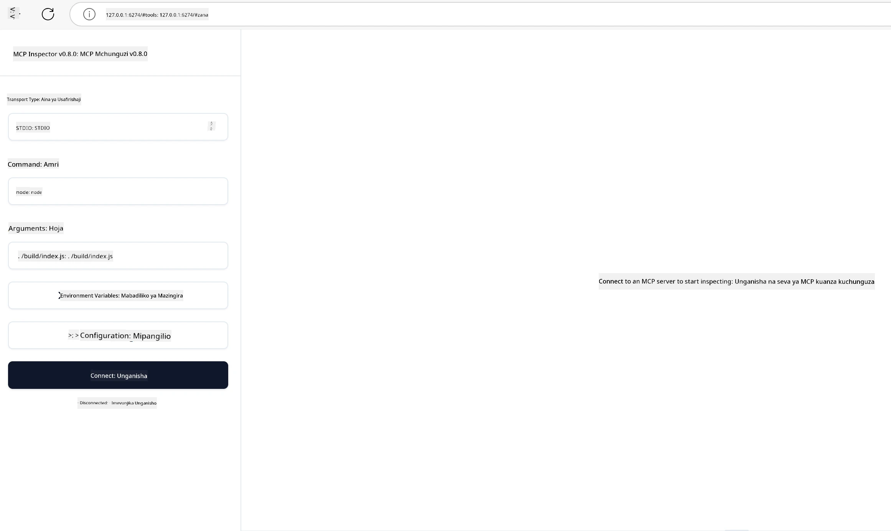

## Kupima na Kuchunguza Hitilafu

Kabla hujaanza kupima server yako ya MCP, ni muhimu kuelewa zana zilizopo na mbinu bora za kuchunguza hitilafu. Kupima kwa ufanisi kunahakikisha server yako inafanya kazi kama inavyotarajiwa na kukusaidia kubaini na kutatua matatizo haraka. Sehemu inayofuata inaelezea mbinu zinazopendekezwa za kuthibitisha utekelezaji wa MCP wako.

## Muhtasari

Somo hili linashughulikia jinsi ya kuchagua mbinu sahihi ya kupima na zana bora zaidi za kupima.

## Malengo ya Kujifunza

Mwisho wa somo hili, utaweza:

- Eleza mbinu mbalimbali za kupima.
- Tumia zana tofauti kupima msimbo wako kwa ufanisi.


## Kupima Servers za MCP

MCP hutoa zana zinazokusaidia kupima na kuchunguza hitilafu za seva zako:

- **MCP Inspector**: Zana ya amri inayoweza kuendeshwa kama zana ya CLI na pia kama zana ya kuona.
- **Upimaji kwa mkono**: Unaweza kutumia zana kama curl kuendesha maombi ya wavuti, lakini zana yoyote inayoweza kuendesha HTTP itatosha.
- **Upimaji wa vitengo**: Inawezekana kutumia mfumo wa upimaji unaouc prefer ili kupima vipengele vya server na mteja.

### Kutumia MCP Inspector

Tumeelezea matumizi ya zana hii katika masomo yaliyopita lakini hebu tuchukulie kidogo kwa kiwango cha juu. Ni zana iliyojengwa kwa Node.js na unaweza kuitumia kwa kuwaita faili la `npx` ambalo litasakinisha na kuendesha zana kwa muda wa ombi lako na kisha kujisafisha.

[MCP Inspector](https://github.com/modelcontextprotocol/inspector) inakusaidia:

- **Kugundua Uwezo wa Server**: Kugundua kwa moja kwa moja rasilimali, zana na maelekezo yanayopatikana
- **Kujaribu Uendeshaji wa Zana**: Jaribu vigezo tofauti na uone majibu kwa wakati halisi
- **Kuangalia Metadata za Server**: Chunguza taarifa za server, skimu, na usanidi

Kuendesha zana kawaida huenda hivi:

```bash
npx @modelcontextprotocol/inspector node build/index.js
```

Amri hapo juu inaanzisha MCP na kiolesura chake cha kuona na kuanzisha kiolesura cha wavuti cha ndani kwenye kivinjari chako. Unaweza kutarajia kuona dashibodi ikionyesha seva zako za MCP zilizosajiliwa, zana zao zinazopatikana, rasilimali, na maelekezo. Kiolesura kinakuruhusu kujaribu uendeshaji wa zana kwa njia ya mwingiliano, kuchunguza metadata ya server, na kuona majibu kwa wakati halisi, kufanya iwe rahisi kuthibitisha na kuchunguza hitilafu katika utekelezaji wa seva zako za MCP.

Hivi ndivyo kinaweza kuonekana: 

Pia unaweza kuendesha zana hii kwa hali ya CLI ambapo unatumia sifa `--cli`. Hapa kuna mfano wa kuendesha zana kwa "CLI" ambayo inaorodhesha zana zote kwenye server:

```sh
npx @modelcontextprotocol/inspector --cli node build/index.js --method tools/list
```

### Upimaji kwa Mkono

Mbali na kuendesha zana ya inspector kupima uwezo wa server, njia nyingine kama hiyo ni kuendesha mteja anayeweza kutumia HTTP kama curl.

Kwa kutumia curl, unaweza kupima seva za MCP moja kwa moja kwa maombi ya HTTP:

```bash
# Mfano: Metadata ya seva ya majaribio
curl http://localhost:3000/v1/metadata

# Mfano: Endesha zana
curl -X POST http://localhost:3000/v1/tools/execute \
  -H "Content-Type: application/json" \
  -d '{"name": "calculator", "parameters": {"expression": "2+2"}}'
```

Kama unavyoona katika matumizi ya curl hapo juu, unatumia ombi la POST kuitisha zana kwa kutumia payload inayojumuisha jina la zana na vigezo vyake. Tumia mbinu inayokufaa zaidi. Zana za CLI kwa ujumla huwa za haraka kutumia na zinafaa kuandikwa kwenye skiripti ambayo inaweza kuwa muhimu katika mazingira ya CI/CD.

### Upimaji wa Vitengo

Unda vipimo vya vitengo kwa zana na rasilimali zako kuhakikisha zinafanya kazi kama inavyotarajiwa. Hapa kuna mfano wa msimbo wa upimaji.

```python
import pytest

from mcp.server.fastmcp import FastMCP
from mcp.shared.memory import (
    create_connected_server_and_client_session as create_session,
)

# Tambaza moduli yote kwa majaribio async
pytestmark = pytest.mark.anyio


async def test_list_tools_cursor_parameter():
    """Test that the cursor parameter is accepted for list_tools.

    Note: FastMCP doesn't currently implement pagination, so this test
    only verifies that the cursor parameter is accepted by the client.
    """

 server = FastMCP("test")

    # Tengeneza zana chache za majaribio
    @server.tool(name="test_tool_1")
    async def test_tool_1() -> str:
        """First test tool"""
        return "Result 1"

    @server.tool(name="test_tool_2")
    async def test_tool_2() -> str:
        """Second test tool"""
        return "Result 2"

    async with create_session(server._mcp_server) as client_session:
        # Jaribu bila parameter ya cursor (imeachwa)
        result1 = await client_session.list_tools()
        assert len(result1.tools) == 2

        # Jaribu na cursor=None
        result2 = await client_session.list_tools(cursor=None)
        assert len(result2.tools) == 2

        # Jaribu na cursor kama mfuatano wa herufi
        result3 = await client_session.list_tools(cursor="some_cursor_value")
        assert len(result3.tools) == 2

        # Jaribu na cursor tupu mfuatano wa herufi
        result4 = await client_session.list_tools(cursor="")
        assert len(result4.tools) == 2
    
```

Msimbo uliotangulia hufanya yafuatayo:

- Inatumia mfumo wa pytest unaokuwezesha kuunda vipimo kama kazi na kutumia kauli za assert.
- Unda Server ya MCP yenye zana mbili tofauti.
- Inatumia kauli ya `assert` kuangalia kwamba masharti fulani yametimizwa.

Tazama [faili kamili hapa](https://github.com/modelcontextprotocol/python-sdk/blob/main/tests/client/test_list_methods_cursor.py)

Kutokana na faili hapo juu, unaweza kupima server yako mwenyewe kuhakikisha uwezo umeundwa kama ilivyo lazima.

Maktaba kubwa za SDK zote zina sehemu za upimaji kama hizo hivyo unaweza kuzoea mazingira yako ya utekelezaji.

## Sampuli

- [Kalkuleta ya Java](../samples/java/calculator/README.md)
- [Kalkuleta ya .Net](../../../../03-GettingStarted/samples/csharp)
- [Kalkuleta ya JavaScript](../samples/javascript/README.md)
- [Kalkuleta ya TypeScript](../samples/typescript/README.md)
- [Kalkuleta ya Python](../../../../03-GettingStarted/samples/python)

## Vyanzo Zaidi

- [SDK ya Python](https://github.com/modelcontextprotocol/python-sdk)

## Nini Kifuatacho

- Ifuatayo: [Uwekaji wa mazingira](../09-deployment/README.md)

---

<!-- CO-OP TRANSLATOR DISCLAIMER START -->
**Kionyozo**:
Hati hii imetafsiriwa kwa kutumia huduma ya tafsiri ya AI [Co-op Translator](https://github.com/Azure/co-op-translator). Ingawa tunajitahidi kupata usahihi, tafadhali fahamu kwamba tafsiri za kiotomatiki zinaweza kuwa na makosa au upungufu wa usahihi. Hati ya asili katika lugha yake halisi inapaswa kuchukuliwa kama chanzo cha mamlaka. Kwa taarifa muhimu, tafsiri ya kitaalamu inayofanywa na binadamu inapendekezwa. Hatutojibu kwa kuelewa vibaya au tafsiri potofu zinazotokea kutokana na matumizi ya tafsiri hii.
<!-- CO-OP TRANSLATOR DISCLAIMER END -->