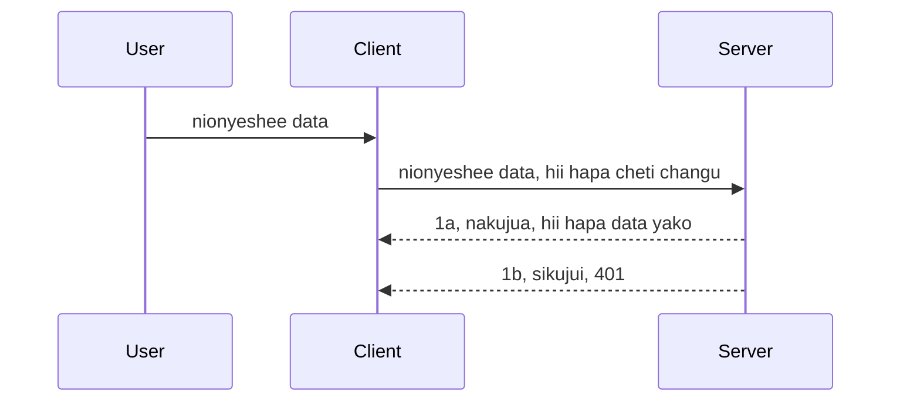

# Uidhinishaji rahisi

SDK za MCP zinaunga mkono matumizi ya OAuth 2.1 ambayo kwa kweli ni mchakato mgumu unaohusisha dhana kama seva ya uidhinishaji, seva ya rasilimali, kutuma vyeti, kupata msimbo, kubadilisha msimbo kwa tokeni ya kubeba hadi hatimaye uweze kupata data yako ya rasilimali. Ikiwa huna uzoefu na OAuth ambayo ni jambo zuri kutekeleza, ni wazo nzuri kuanza na kiwango cha msingi cha uidhinishaji na kujenga hadi usalama bora zaidi. Ndio maana sura hii ipo, kukuinua hadi uidhinishaji wa hali ya juu zaidi.

## Uidhinishaji, tunamaanisha nini?

Uidhinishaji ni kifupi cha uthibitishaji na ruhusa. Wazo ni kwamba tunahitaji kufanya mambo mawili:

- **Uthibitishaji**, ni mchakato wa kugundua kama tunamruhusu mtu kuingia katika nyumba yetu, kwamba ana haki ya "kuwa hapa" yaani kuweza kupata seva yetu ya rasilimali ambapo vipengele vyetu vya MCP Server vipo.
- **Ruhusa**, ni mchakato wa kugundua kama mtumiaji anapaswa kuwa na ufikiaji wa rasilimali hizi maalum anaomba, kwa mfano agizo hizi au bidhaa hizi au kama anaruhusiwa kusoma maudhui lakini si kufuta kama mfano mwingine.

## Vyeti: jinsi tunavyomwambia mfumo ni nani sisi

Vizuri, wengi wa waendelezaji wa wavuti hufikiria kwa mujibu wa kutoa cheti kwa seva, kawaida siri inayosema kama wanaruhusiwa kuwa hapa "Uthibitishaji". Cheti hiki kawaida ni toleo lililosimbwa la base64 la jina la mtumiaji na nywila au kitambulisho cha API kinachoonyesha mtumiaji maalum.

Hii inahusisha kutuma kupitia kichwa kinachoitwa "Authorization" kama hii:

```json
{ "Authorization": "secret123" }
```

Hii kawaida huitwa uthibitishaji wa msingi. Mchakato mzima unavyofanya kazi kisha ni kama ifuatavyo:


Sasa tunapofahamu jinsi inavyofanya kazi kutoka mtazamo wa mchakato, tunaitekelezaje? Vizuri, seva nyingi za wavuti zina dhana ya middleware, kipande cha msimbo kinachoendeshwa kama sehemu ya ombi ambalo linaweza kuthibitisha vyeti, na ikiwa vyeti ni halali linaweza kuruhusu ombi liendelee. Ikiwa ombi halina vyeti halali basi unapata kosa la uidhinishaji. Tuwezaje kuitekeleza hii:

**Python**

```python
class AuthMiddleware(BaseHTTPMiddleware):
    async def dispatch(self, request, call_next):

        has_header = request.headers.get("Authorization")
        if not has_header:
            print("-> Missing Authorization header!")
            return Response(status_code=401, content="Unauthorized")

        if not valid_token(has_header):
            print("-> Invalid token!")
            return Response(status_code=403, content="Forbidden")

        print("Valid token, proceeding...")
       
        response = await call_next(request)
        # ongeza vichwa vya wateja vyovyote au badilisha jibu kwa namna fulani
        return response


starlette_app.add_middleware(CustomHeaderMiddleware)
```

Hapa tuna:

- Kuunda middleware iitwayo `AuthMiddleware` ambapo njia yake `dispatch` inaitwa na seva ya wavuti.
- Kuongeza middleware kwenye seva ya wavuti:

    ```python
    starlette_app.add_middleware(AuthMiddleware)
    ```

- Kuandika mantiki ya uthibitishaji inayothibitisha kama kichwa cha Authorization kiko na siri inayotumwa ni halali:

    ```python
    has_header = request.headers.get("Authorization")
    if not has_header:
        print("-> Missing Authorization header!")
        return Response(status_code=401, content="Unauthorized")

    if not valid_token(has_header):
        print("-> Invalid token!")
        return Response(status_code=403, content="Forbidden")
    ```

    ikiwa siri ipo na ni halali basi tunaruhusu ombi liendelee kwa kuita `call_next` na kurudisha majibu.

    ```python
    response = await call_next(request)
    # ongeza vichwa vya wateja au badilisha jibu kwa namna fulani
    return response
    ```

Inavyofanya kazi ni kwamba ikiwa ombi la wavuti limefanywa kuelekea seva, middleware itaitwa na kutokana na utekelezaji wake itaruhusu ombi liendelee au kurudisha kosa linalosema mteja haruhusiwi kuendelea.

**TypeScript**

Hapa tunaunda middleware kwa kutumia fremu maarufu Express na kuingilia ombi kabla halijafika MCP Server. Hapa ni msimbo wa hilo:

```typescript
function isValid(secret) {
    return secret === "secret123";
}

app.use((req, res, next) => {
    // 1. Je, kichwa cha idhini kiko?
    if(!req.headers["Authorization"]) {
        res.status(401).send('Unauthorized');
    }
    
    let token = req.headers["Authorization"];

    // 2. Angalia uhalali.
    if(!isValid(token)) {
        res.status(403).send('Forbidden');
    }

   
    console.log('Middleware executed');
    // 3. Pitia ombi kwa hatua inayofuata katika mfululizo wa maombi.
    next();
});
```

Katika msimbo huu tunafanya:

1. Kukagua kama kichwa cha Authorization kiko hata katika hatua ya kwanza, kama hakipo, tunatuma kosa la 401.
2. Kuhakikisha cheti/tokeni ni halali, ikiwa si halali, tunatuma kosa la 403.
3. Hatimaye huruhusu ombi kuendelea katika mzunguko wa maombi na kurudisha rasilimali iliyoombwa.

## Zoef: Tekeleza uthibitishaji

Tuchukue maarifa yetu na tujue jinsi ya kuutekeleza. Hii hapa mpango:

Seva

- Tengeneza seva ya wavuti na mfano wa MCP.
- Tekeleza middleware kwa seva.

Mteja

- Tuma ombi la wavuti, kwa vyeti, kupitia kichwa.

### -1- Tengeneza seva ya wavuti na mfano wa MCP

Katika hatua yetu ya kwanza, tunahitaji kuunda mfano wa seva ya wavuti na MCP Server.

**Python**

Hapa tunaunda mfano wa seva ya MCP, kuunda app ya wavuti ya starlette na kuiendesha kwa uvicorn.

```python
# kuunda Server ya MCP

app = FastMCP(
    name="MCP Resource Server",
    instructions="Resource Server that validates tokens via Authorization Server introspection",
    host=settings["host"],
    port=settings["port"],
    debug=True
)

# kuunda app ya wavuti ya starlette
starlette_app = app.streamable_http_app()

# kuhudumia app kupitia uvicorn
async def run(starlette_app):
    import uvicorn
    config = uvicorn.Config(
            starlette_app,
            host=app.settings.host,
            port=app.settings.port,
            log_level=app.settings.log_level.lower(),
        )
    server = uvicorn.Server(config)
    await server.serve()

run(starlette_app)
```

Katika msimbo huu tunafanya:

- Kuunda MCP Server.
- Kujenga app ya wavuti ya starlette kutoka MCP Server, `app.streamable_http_app()`.
- Kuendesha na kuhudumia app ya wavuti kwa kutumia uvicorn `server.serve()`.

**TypeScript**

Hapa tunaunda mfano wa MCP Server.

```typescript
const server = new McpServer({
      name: "example-server",
      version: "1.0.0"
    });

    // ... seta rasilimali za seva, zana, na maagizo ...
```

Uundaji huu wa MCP Server utahitaji kufanyika ndani ya ufafanua wa njia ya POST /mcp, kwa hivyo chukua msimbo uliotajwa hapo juu na uuhamishe kama ifuatavyo:

```typescript
import express from "express";
import { randomUUID } from "node:crypto";
import { McpServer } from "@modelcontextprotocol/sdk/server/mcp.js";
import { StreamableHTTPServerTransport } from "@modelcontextprotocol/sdk/server/streamableHttp.js";
import { isInitializeRequest } from "@modelcontextprotocol/sdk/types.js"

const app = express();
app.use(express.json());

// Ramani ya kuhifadhi usafirishaji kwa ID ya kikao
const transports: { [sessionId: string]: StreamableHTTPServerTransport } = {};

// Shughulikia maombi ya POST kwa mawasiliano ya mteja-kwenda-server
app.post('/mcp', async (req, res) => {
  // Angalia kama ID ya kikao tayari ipo
  const sessionId = req.headers['mcp-session-id'] as string | undefined;
  let transport: StreamableHTTPServerTransport;

  if (sessionId && transports[sessionId]) {
    // Tumia tena usafirishaji uliopo
    transport = transports[sessionId];
  } else if (!sessionId && isInitializeRequest(req.body)) {
    // Ombi jipya la kuanzisha
    transport = new StreamableHTTPServerTransport({
      sessionIdGenerator: () => randomUUID(),
      onsessioninitialized: (sessionId) => {
        // Hifadhi usafirishaji kwa ID ya kikao
        transports[sessionId] = transport;
      },
      // Ulinzi wa DNS rebinding umezimwa kwa default kwa ajili ya ulinganifu wa nyuma. Ikiwa unafanya kazi na server hii
      // kwa eneo lako, hakikisha umeweka:
      // enableDnsRebindingProtection: true,
      // allowedHosts: ['127.0.0.1'],
    });

    // Safisha usafirishaji wakati unafungwa
    transport.onclose = () => {
      if (transport.sessionId) {
        delete transports[transport.sessionId];
      }
    };
    const server = new McpServer({
      name: "example-server",
      version: "1.0.0"
    });

    // ... anza rasilimali za server, zana, na vidokezo ...

    // Unganisha kwenye server ya MCP
    await server.connect(transport);
  } else {
    // Ombi batili
    res.status(400).json({
      jsonrpc: '2.0',
      error: {
        code: -32000,
        message: 'Bad Request: No valid session ID provided',
      },
      id: null,
    });
    return;
  }

  // Shughulikia ombi
  await transport.handleRequest(req, res, req.body);
});

// Mshughulikiaji wa kutumika tena kwa maombi ya GET na DELETE
const handleSessionRequest = async (req: express.Request, res: express.Response) => {
  const sessionId = req.headers['mcp-session-id'] as string | undefined;
  if (!sessionId || !transports[sessionId]) {
    res.status(400).send('Invalid or missing session ID');
    return;
  }
  
  const transport = transports[sessionId];
  await transport.handleRequest(req, res);
};

// Shughulikia maombi ya GET kwa taarifa kutoka server hadi mteja kupitia SSE
app.get('/mcp', handleSessionRequest);

// Shughulikia maombi ya DELETE kwa kumalizika kwa kikao
app.delete('/mcp', handleSessionRequest);

app.listen(3000);
```

Sasa unaona jinsi uundaji wa MCP Server ulivyo hamishwa ndani ya `app.post("/mcp")`.

Tuendelee na hatua inayofuata ya kuunda middleware ili tuweze kuthibitisha cheti kinachoingia.

### -2- Tekeleza middleware kwa seva

Hebu tuangalie sehemu ya middleware. Hapa tutaunda middleware inayotafuta cheti katika kichwa cha `Authorization` na kukithibitisha. Ikiwa kinakubalika basi ombi litaendelea kufanya kile kinachotakiwa (mfano orodha ya zana, soma rasilimali au kazi nyingine ya MCP anaomba mteja).

**Python**

Ili kuunda middleware, tunahitaji kuunda darasa linaloachilia kutoka `BaseHTTPMiddleware`. Kuna sehemu mbili za kuvutia:

- Ombi `request`, ambayo tunasoma habari za kichwa kutoka.
- `call_next` calli ya kawaida tunayotakiwa kuita ikiwa mteja ametua cheti tunayokubali.

Kwanza, tunahitaji kushughulikia hali ikiwa kichwa cha `Authorization` hakipo:

```python
has_header = request.headers.get("Authorization")

# hakuna kichwa kilichopo, kosa na 401, vinginevyo endelea.
if not has_header:
    print("-> Missing Authorization header!")
    return Response(status_code=401, content="Unauthorized")
```

Hapa tunatuma ujumbe wa 401 unauthorized kwa sababu mteja ameshindwa uthibitishaji.

Ifuatayo, ikiwa cheti kimetumwa, tunahitaji kukagua uhalali wake kama ifuatavyo:

```python
 if not valid_token(has_header):
    print("-> Invalid token!")
    return Response(status_code=403, content="Forbidden")
```

Angalia jinsi tunavyotuma ujumbe wa 403 forbidden hapo juu. Tazama middleware kamili hapa chini inatekeleza yote tuliotaja:

```python
class AuthMiddleware(BaseHTTPMiddleware):
    async def dispatch(self, request, call_next):

        has_header = request.headers.get("Authorization")
        if not has_header:
            print("-> Missing Authorization header!")
            return Response(status_code=401, content="Unauthorized")

        if not valid_token(has_header):
            print("-> Invalid token!")
            return Response(status_code=403, content="Forbidden")

        print("Valid token, proceeding...")
        print(f"-> Received {request.method} {request.url}")
        response = await call_next(request)
        response.headers['Custom'] = 'Example'
        return response

```

Nzuri, lakini kuhusu kazi ya `valid_token`? Hii ipo hapa chini:
:

```python
# USITUMIE kwa ajili ya uzalishaji - iboresha !!
def valid_token(token: str) -> bool:
    # ondoa kiambishi "Bearer "
    if token.startswith("Bearer "):
        token = token[7:]
        return token == "secret-token"
    return False
```

Hii inapaswa kuboreshwa zaidi.

MUHIMU: Haukufai kamwe kuweka siri kama hizi ndani ya msimbo. Unapaswa kupata thamani ya kulinganisha nayo kutoka chanzo cha data au kutoka kwa IDP (mtoa huduma wa kitambulisho) au bora zaidi, ruhusu IDP ifanye uthibitishaji.

**TypeScript**

Ili kutekeleza hii na Express, tunahitaji kuita njia ya `use` inayopokea middleware functions.

Tunahitaji:

- Kujishughulisha na variable ya ombi ili kukagua cheti kilichotumwa kupitia sifa ya `Authorization`.
- Thibitisha cheti, na kama ni halali kuruhusu ombi liendelee na mteja akamilishe ombi lake la MCP (mfano orodha ya zana, soma rasilimali au huduma nyingine yoyote ya MCP).

Hapa tunakagua kama kichwa cha `Authorization` kiko, na kama hakipo, tunazuia ombi haliji kuendelea:

```typescript
if(!req.headers["authorization"]) {
    res.status(401).send('Unauthorized');
    return;
}
```

Kama kichwa hakikutumwa hata katika hatua ya kwanza, unapata kosa la 401.

Ifuatayo, tunakagua kama cheti ni halali, kama si halali tena tunazuia ombi lakini na ujumbe tofauti kidogo:

```typescript
if(!isValid(token)) {
    res.status(403).send('Forbidden');
    return;
} 
```

Angalia sasa unapokea kosa la 403.

Hapa ni msimbo kamili:

```typescript
app.use((req, res, next) => {
    console.log('Request received:', req.method, req.url, req.headers);
    console.log('Headers:', req.headers["authorization"]);
    if(!req.headers["authorization"]) {
        res.status(401).send('Unauthorized');
        return;
    }
    
    let token = req.headers["authorization"];

    if(!isValid(token)) {
        res.status(403).send('Forbidden');
        return;
    }  

    console.log('Middleware executed');
    next();
});
```

Tumeandaa seva ya wavuti ili ikubali middleware kukagua cheti ambacho mteja anatumaini kututumia. Vipi kuhusu mteja mwenyewe?

### -3- Tuma ombi la wavuti na cheti kupitia kichwa

Tunahitaji kuhakikisha mteja anapitisha cheti kupitia kichwa. Kwa kuwa tuta tumia mteja wa MCP kufanya hivyo, tunahitaji kufahamu jinsi ya kufanya hivyo.

**Python**

Kwa mteja, tunahitaji kupitisha kichwa chenye cheti chetu kama ifuatavyo:

```python
# USIWEKE thamani moja kwa moja, iwe angalau katika variable ya mazingira au hifadhi salama zaidi
token = "secret-token"

async with streamablehttp_client(
        url = f"http://localhost:{port}/mcp",
        headers = {"Authorization": f"Bearer {token}"}
    ) as (
        read_stream,
        write_stream,
        session_callback,
    ):
        async with ClientSession(
            read_stream,
            write_stream
        ) as session:
            await session.initialize()
      
            # KUFANYA, unachotaka kifanyike kwenye mteja, kwa mfano orodha ya zana, kuita zana nk.
```

Angalia jinsi tunavyojaza sifa ya `headers` kama ` headers = {"Authorization": f"Bearer {token}"}`.

**TypeScript**

Tunaweza kutatua hili kwa hatua mbili:

1. Kujaza kitu cha usanidi na cheti chetu.
2. Kupitisha kitu cha usanidi kwa usafirishaji.

```typescript

// USIWEKE thamani moja kwa moja kama ilivyoonyeshwa hapa. Angalau iwe kama kigezo cha mazingira na tumia kitu kama dotenv (katika mode ya maendeleo).
let token = "secret123"

// fafanua chaguo la usafiri la mteja
let options: StreamableHTTPClientTransportOptions = {
  sessionId: sessionId,
  requestInit: {
    headers: {
      "Authorization": "secret123"
    }
  }
};

// pita kitu cha chaguo kwa usafiri
async function main() {
   const transport = new StreamableHTTPClientTransport(
      new URL(serverUrl),
      options
   );
```

Hapa unaona juu jinsi ilivyohitajika kuunda kitu cha `options` na kuweka vichwa vyetu chini ya sifa ya `requestInit`.

MUHIMU: Tunawezaje kuiboresha kutoka hapa? Vizuri, utekelezaji wa sasa una matatizo fulani. Kwanza, kupitisha cheti kama hiki ni hatari isipokuwa angalau unatumia HTTPS. Hata hivyo, cheti kinaweza kuibiwa hivyo unahitaji mfumo ambapo unaweza kufuta tokeni kwa urahisi na kuongeza ukaguzi wa ziada kama kutoka wapi duniani linatoka, kama maombi yanatokea mara nyingi sana (tabia ya bot), kwa ufupi, kuna mengi ya kuzingatia.

Hata hivyo, inapaswa kusemwa kwamba, kwa API rahisi sana ambapo hutaki mtu yeyote aitumie API yako bila kuwa na uthibitisho na kile tunachokifanya hapa ni mwanzo mzuri.

Kwamba tuseme, najaribu kuimarisha usalama kidogo kwa kutumia muundo uliowekwa kama JSON Web Token, pia inajulikana kama JWT au tokeni za "JOT".

## JSON Web Tokens, JWT

Hivyo, tunajaribu kuboresha mambo kutoka kwa kupitisha vyeti rahisi sana. Maboresho ya papo hapo tunayopata kwa kutumia JWT ni yapi?

- **Maboresho ya usalama**. Katika uthibitishaji wa msingi, unatumia jina la mtumiaji na nywila kama tokeni iliyosimbwa base64 (au unatumia API key) mara kwa mara jambo linaloongeza hatari. Kwa JWT, unatumia jina la mtumiaji na nywila na unapata tokeni badala yake na ni tokeni yenye muda wa kumalizika. JWT hukuwezesha kutumia udhibiti wa ufikiaji uliobinafsishwa kwa kutumia majukumu, wigo na ruhusa.
- **Ukiwa haina hali na unaongezeka kwa urahisi**. JWT ni zilizo na taarifa zinazojimiliki, zinabeba maelezo yote ya mtumiaji na hazihitaji kuhifadhi kikao upande wa seva. Tokeni pia zinaweza kuthibitishwa kiasili.
- **Ushirikiano na ushirikiano**. JWT ni kiini cha Open ID Connect na hutumiwa na watoa huduma wa utambulisho kama Entra ID, Google Identity na Auth0. Pia hutoa uwezekano wa kutumia kuingia mara moja (single sign on) na mengine mengi yakifanya kuwa daraja la viwanda.
- **Utaratibu na ufanisi**. JWT pia zinaweza kutumika na API Gateways kama Azure API Management, NGINX na mengine. Pia hutoa usaidizi wa hali za uthibitishaji na mawasiliano kati ya seva na huduma ikiwa ni pamoja na kuigiza na usimamizi wa ruhusa.
- **Utendaji na caching**. JWT zinaweza kuwekwa cache baada ya kuondolewa usimbaji na hivyo kupunguza hitaji la utambuzi wa mara kwa mara. Hii husaidia hasa kwa programu zenye trafiki kubwa kwa kuboresha kasi na kupunguza mzigo kwenye miundombinu uliyochaguliwa.
- **Sifa za hali ya juu**. Pia zinasaidia introspection (kukagua uhalali kwenye seva) na kurekebisha (kufanya tokeni isifanye kazi).

Kwa faida zote hizi, tusee jinsi ya kuboresha utekelezaji wetu hadi ngazi inayofuata.

## Kubadilisha uthibitishaji wa msingi kuwa JWT

Hivyo, mabadiliko ambayo tunahitaji kwa kiwango kikubwa ni:

- **Jifunze jinsi ya kujenga tokeni ya JWT** na kuifanya tayari kutumwa kutoka kwa mteja kwenda seva.
- **Thibitisha tokeni ya JWT**, na ikiwa ni halali, ruhusu mteja kupata rasilimali zetu.
- **Hifadhi ya tokeni salama**. Jinsi tunavyohifadhi tokeni hii.
- **Linda njia za kufikia**. Tunahitaji kulinda njia, katika kesi yetu, tunahitaji kulinda njia na vipengele maalum vya MCP.
- **Ongeza tokeni za ukarabati**. Hakikisha tunaunda tokeni za muda mfupi lakini tokeni za ukarabati za muda mrefu ambazo zinaweza kutumika kupata tokeni mpya ikiwa zinamalizika muda. Pia hakikisha kuna njia ya ukarabati na mkakati wa mzunguko.

### -1- Jenga tokeni ya JWT

Kwanza kabisa, tokeni ya JWT ina sehemu zifuatazo:

- **kichwa**, algorithm inayotumiwa na aina ya tokeni.
- **mzigo**, madai, kama sub (mtumiaji au kitu kinacho wakilishwa na tokeni. Katika tukio la uthibitishaji hili ni kawaida userid), exp (muda wa kumalizika) role (jina la jukumu)
- **sahihi**, imesainiwa kwa siri au ufunguo wa kibinafsi.

Kwa hili, tutahitaji kujenga kichwa, mzigo na tokeni iliyosimbwa.

**Python**

```python

import jwt
import jwt
from jwt.exceptions import ExpiredSignatureError, InvalidTokenError
import datetime

# Ufunguo wa siri unaotumika kusaini JWT
secret_key = 'your-secret-key'

header = {
    "alg": "HS256",
    "typ": "JWT"
}

# taarifa za mtumiaji na madai yake na muda wake wa kumalizika
payload = {
    "sub": "1234567890",               # Mada (kitambulisho cha mtumiaji)
    "name": "User Userson",                # Dhamana maalum
    "admin": True,                     # Dhamana maalum
    "iat": datetime.datetime.utcnow(),# Imetolewa saa
    "exp": datetime.datetime.utcnow() + datetime.timedelta(hours=1)  # Muda wa kumalizika
}

# funga msingi
encoded_jwt = jwt.encode(payload, secret_key, algorithm="HS256", headers=header)
```

Katika msimbo hapo juu tume:

- Taja kichwa kwa kutumia HS256 kama algorithm na aina kuwa JWT.
- Tunda mzigo wenye somo au kitambulisho cha mtumiaji, jina la mtumiaji, jukumu, wakati ulilotolewa na wakati utakapokamilika hivyo kutekeleza kipengele cha muda tulichotaja awali.

**TypeScript**

Hapa tutahitaji baadhi ya utegemezi utakaotusaidia kujenga tokeni ya JWT.

Utegemezi

```sh

npm install jsonwebtoken
npm install --save-dev @types/jsonwebtoken
```

Sasa tulipokuwa na hayo, tuunde kichwa, mzigo na kupitia hicho tunda tokeni iliyosimbwa.

```typescript
import jwt from 'jsonwebtoken';

const secretKey = 'your-secret-key'; // Tumia mabadiliko ya mazingira katika uzalishaji

// Elezea mzigo wa data
const payload = {
  sub: '1234567890',
  name: 'User usersson',
  admin: true,
  iat: Math.floor(Date.now() / 1000), // Imetolewa wakati
  exp: Math.floor(Date.now() / 1000) + 60 * 60 // Huitimisha baada ya saa 1
};

// Elezea kichwa (hiari, jsonwebtoken huweka vipaumbele)
const header = {
  alg: 'HS256',
  typ: 'JWT'
};

// Tengeneza tokeni
const token = jwt.sign(payload, secretKey, {
  algorithm: 'HS256',
  header: header
});

console.log('JWT:', token);
```

Tokeni hii ni:

Imesainiwa kwa kutumia HS256
Inatumika kwa saa 1
Inajumuisha madai kama sub, name, admin, iat, na exp.

### -2- Thibitisha tokeni

Pia tunahitaji kuthibitisha tokeni, jambo hili linapaswa kufanyika kwenye seva ili kuhakikisha kile mteja anatuma ni halali. Kuna mambo mengi ya kukagua hapa kuanzia muundo wa tokeni hadi uhalali wake. Pia unahimizwa kuongeza ukaguzi mwingine kuona kama mtumiaji yupo kwenye mfumo wako na zaidi.

Ili kuthibitisha tokeni, tunahitaji kuihariri ili tuisome na kuanza kuangalia uhalali wake:

**Python**

```python

# Tafsiri na hakiki JWT
try:
    decoded = jwt.decode(token, secret_key, algorithms=["HS256"])
    print("✅ Token is valid.")
    print("Decoded claims:")
    for key, value in decoded.items():
        print(f"  {key}: {value}")
except ExpiredSignatureError:
    print("❌ Token has expired.")
except InvalidTokenError as e:
    print(f"❌ Invalid token: {e}")

```

Katika msimbo huu, tunaita `jwt.decode` tukitumia tokeni, ufunguo wa siri na algorithm iliyochaguliwa kama ingizo. Angalia jinsi tunavyotumia muundo wa jaribu-kamata kwani uthibitishaji usiofanikiwa husababisha kosa.

**TypeScript**

Hapa tunahitaji kuita `jwt.verify` kupata toleo lililosomwa la tokeni ambalo tunaweza kuchambua zaidi. Ikiwa wito huu utashindwa, inamaanisha muundo wa tokeni si sahihi au haifanyi kazi tena.

```typescript

try {
  const decoded = jwt.verify(token, secretKey);
  console.log('Decoded Payload:', decoded);
} catch (err) {
  console.error('Token verification failed:', err);
}
```

KUMBUKA: kama tulivyosema awali, tunapaswa kufanya ukaguzi wa ziada kuhakikisha tokeni hii inaonyesha mtumiaji katika mfumo wetu na kuhakikisha mtumiaji ana haki anazodai.

Ifuatayo, tuchunguze udhibiti wa ufikiaji unaotegemea jukumu, pia unaojulikana kama RBAC.
## Kuongeza udhibiti wa ufikiaji wa msingi wa majukumu

Wazo ni kwamba tunataka kueleza kwamba majukumu tofauti yana ruhusa tofauti. Kwa mfano, tunadhani admin anaweza kufanya kila kitu na kwamba watumiaji wa kawaida wanaweza kusoma/kuandika na kwamba mgeni anaweza kusoma tu. Kwa hivyo, hapa kuna viwango vya ruhusa vinavyowezekana:

- Admin.Write 
- User.Read
- Guest.Read

Tuchunguze jinsi tunaweza kutekeleza udhibiti kama huo kwa kutumia middleware. Middleware inaweza kuongezwa kwa kila njia pamoja na kwa njia zote.

**Python**

```python
from starlette.middleware.base import BaseHTTPMiddleware
from starlette.responses import JSONResponse
import jwt

# USIWE na siri ndani ya msimbo kama huu, huu ni kwa madhumuni ya kuonyesha tu. Isome kutoka mahali salama.
SECRET_KEY = "your-secret-key" # weka hii katika variable ya env
REQUIRED_PERMISSION = "User.Read"

class JWTPermissionMiddleware(BaseHTTPMiddleware):
    async def dispatch(self, request, call_next):
        auth_header = request.headers.get("Authorization")
        if not auth_header or not auth_header.startswith("Bearer "):
            return JSONResponse({"error": "Missing or invalid Authorization header"}, status_code=401)

        token = auth_header.split(" ")[1]
        try:
            decoded = jwt.decode(token, SECRET_KEY, algorithms=["HS256"])
        except jwt.ExpiredSignatureError:
            return JSONResponse({"error": "Token expired"}, status_code=401)
        except jwt.InvalidTokenError:
            return JSONResponse({"error": "Invalid token"}, status_code=401)

        permissions = decoded.get("permissions", [])
        if REQUIRED_PERMISSION not in permissions:
            return JSONResponse({"error": "Permission denied"}, status_code=403)

        request.state.user = decoded
        return await call_next(request)


```

Kuna njia chache tofauti za kuongeza middleware kama ifuatavyo:

```python

# Jambo la 1: ongeza middleware wakati wa kujenga programu ya starlette
middleware = [
    Middleware(JWTPermissionMiddleware)
]

app = Starlette(routes=routes, middleware=middleware)

# Jambo la 2: ongeza middleware baada ya programu ya starlette kujengwa tayari
starlette_app.add_middleware(JWTPermissionMiddleware)

# Jambo la 3: ongeza middleware kwa kila njia
routes = [
    Route(
        "/mcp",
        endpoint=..., # mshughulikiaji
        middleware=[Middleware(JWTPermissionMiddleware)]
    )
]
```

**TypeScript**

Tunaweza kutumia `app.use` na middleware ambayo itafanya kazi kwa maombi yote. 

```typescript
app.use((req, res, next) => {
    console.log('Request received:', req.method, req.url, req.headers);
    console.log('Headers:', req.headers["authorization"]);

    // 1. Angalia kama kichwa cha idhini kimetumwa

    if(!req.headers["authorization"]) {
        res.status(401).send('Unauthorized');
        return;
    }
    
    let token = req.headers["authorization"];

    // 2. Angalia kama tokeni ni halali
    if(!isValid(token)) {
        res.status(403).send('Forbidden');
        return;
    }  

    // 3. Angalia kama mtumiaji wa tokeni yupo katika mfumo wetu
    if(!isExistingUser(token)) {
        res.status(403).send('Forbidden');
        console.log("User does not exist");
        return;
    }
    console.log("User exists");

    // 4. Thibitisha kuwa tokeni ina ruhusa sahihi
    if(!hasScopes(token, ["User.Read"])){
        res.status(403).send('Forbidden - insufficient scopes');
    }

    console.log("User has required scopes");

    console.log('Middleware executed');
    next();
});

```

Kuna mambo kadhaa ambayo tunaweza kuruhusu middleware yetu na ambayo middleware yetu INASTAA kufanyia kazi, yaani:

1. Angalia kama kichwa cha idhini kipo
2. Angalia kama tokeni ni halali, tunaita `isValid` ambayo ni njia tuliyoandika inayokagua uhalali na usahihi wa tokeni ya JWT.
3. Thibitisha kuwa mtumiaji yupo katika mfumo wetu, tunapaswa kuangalia hili.

   ```typescript
    // watumiaji katika DB
   const users = [
     "user1",
     "User usersson",
   ]

   function isExistingUser(token) {
     let decodedToken = verifyToken(token);

     // TODO, hakikisha kama mtumiaji yupo katika DB
     return users.includes(decodedToken?.name || "");
   }
   ```

   Hapo juu, tumetengeneza orodha rahisi sana ya `users`, ambayo inapaswa kuwa katika hifadhidata bila shaka.

4. Zaidi ya hayo, tunapaswa pia kuangalia tokeni ina ruhusa sahihi.

   ```typescript
   if(!hasScopes(token, ["User.Read"])){
        res.status(403).send('Forbidden - insufficient scopes');
   }
   ```

   Katika msimbo huu hapo juu kutoka kwa middleware, tunakagua kwamba tokeni ina ruhusa ya User.Read, kama haiko tunatuma kosa la 403. Hapa chini ni njia ya msaada `hasScopes`.

   ```typescript
   function hasScopes(scope: string, requiredScopes: string[]) {
     let decodedToken = verifyToken(scope);
    return requiredScopes.every(scope => decodedToken?.scopes.includes(scope));
  }
   ```

Have a think which additional checks you should be doing, but these are the absolute minimum of checks you should be doing.

Using Express as a web framework is a common choice. There are helpers library when you use JWT so you can write less code.

- `express-jwt`, helper library that provides a middleware that helps decode your token.
- `express-jwt-permissions`, this provides a middleware `guard` that helps check if a certain permission is on the token.

Here's what these libraries can look like when used:

```typescript
const express = require('express');
const jwt = require('express-jwt');
const guard = require('express-jwt-permissions')();

const app = express();
const secretKey = 'your-secret-key'; // put this in env variable

// Decode JWT and attach to req.user
app.use(jwt({ secret: secretKey, algorithms: ['HS256'] }));

// Check for User.Read permission
app.use(guard.check('User.Read'));

// multiple permissions
// app.use(guard.check(['User.Read', 'Admin.Access']));

app.get('/protected', (req, res) => {
  res.json({ message: `Welcome ${req.user.name}` });
});

// Error handler
app.use((err, req, res, next) => {
  if (err.code === 'permission_denied') {
    return res.status(403).send('Forbidden');
  }
  next(err);
});

```

Sasa umeona jinsi middleware inavyoweza kutumika kwa uthibitishaji na idhini, vipi kuhusu MCP, je, hubadilisha jinsi tunavyofanya uthibitishaji? Tuchunguze katika sehemu inayofuata.

### -3- Ongeza RBAC kwa MCP

Umeona hadi sasa jinsi unavyoweza kuongeza RBAC kupitia middleware, hata hivyo, kwa MCP hakuna njia rahisi ya kuongeza RBAC kwa kipengele cha MCP kimoja, basi tunafanya nini? Naam, tunapaswa tu kuongeza msimbo kama huu unaokagua katika kesi hii kama mteja ana haki ya kutumia chombo fulani:

Una chaguo kadhaa tofauti jinsi ya kufanikisha RBAC kwa kila kipengele, hapa kuna baadhi:

- Ongeza ukaguzi kwa kila chombo, rasilimali, au maelekezo ambapo unahitaji kuangalia kiwango cha ruhusa.

   **python**

   ```python
   @tool()
   def delete_product(id: int):
      try:
          check_permissions(role="Admin.Write", request)
      catch:
        pass # mteja alipata tatizo la idhini, onyesha kosa la idhini
   ```

   **typescript**

   ```typescript
   server.registerTool(
    "delete-product",
    {
      title: Delete a product",
      description: "Deletes a product",
      inputSchema: { id: z.number() }
    },
    async ({ id }) => {
      
      try {
        checkPermissions("Admin.Write", request);
        // todo, tuma kitambulisho kwa productService na entry ya mbali
      } catch(Exception e) {
        console.log("Authorization error, you're not allowed");  
      }

      return {
        content: [{ type: "text", text: `Deletected product with id ${id}` }]
      };
    }
   );
   ```


- Tumia mbinu ya seva ya hali ya juu na wasindikaji wa maombi ili kupunguza idadi ya maeneo unayohitaji kufanya ukaguzi.

   **Python**

   ```python
   
   tool_permission = {
      "create_product": ["User.Write", "Admin.Write"],
      "delete_product": ["Admin.Write"]
   }

   def has_permission(user_permissions, required_permissions) -> bool:
      # user_permissions: orodha ya ruhusa ambazo mtumiaji ana
      # required_permissions: orodha ya ruhusa zinazohitajika kwa zana
      return any(perm in user_permissions for perm in required_permissions)

   @server.call_tool()
   async def handle_call_tool(
     name: str, arguments: dict[str, str] | None
   ) -> list[types.TextContent]:
    # Kubali request.user.permissions ni orodha ya ruhusa za mtumiaji
     user_permissions = request.user.permissions
     required_permissions = tool_permission.get(name, [])
     if not has_permission(user_permissions, required_permissions):
        # Inua kosa "Huna ruhusa ya kutumia zana {name}"
        raise Exception(f"You don't have permission to call tool {name}")
     # endelea na itumie zana
     # ...
   ```   
   

   **TypeScript**

   ```typescript
   function hasPermission(userPermissions: string[], requiredPermissions: string[]): boolean {
       if (!Array.isArray(userPermissions) || !Array.isArray(requiredPermissions)) return false;
       // Rudisha kweli ikiwa mtumiaji ana angalau ruhusa moja inayohitajika
       
       return requiredPermissions.some(perm => userPermissions.includes(perm));
   }
  
   server.setRequestHandler(CallToolRequestSchema, async (request) => {
      const { params: { name } } = request;
  
      let permissions = request.user.permissions;
  
      if (!hasPermission(permissions, toolPermissions[name])) {
         return new Error(`You don't have permission to call ${name}`);
      }
  
      // endelea..
   });
   ```

   Kumbuka, utahitaji kuhakikisha middleware yako inahifadhi tokeni iliyo shughulikiwa kwenye mali ya user ya ombi ili msimbo uliotajwa juu uwe rahisi.

### Muhtasari

Sasa tumekutana na jinsi ya kuongeza msaada wa RBAC kwa ujumla na kwa MCP hasa, ni wakati wa kujaribu kutekeleza usalama kwa mwenyewe ili kuhakikisha umeelewa dhana zilizokuwezeshwa.

## Kazi ya Kwanza: Tengeneza seva ya MCP na mteja wa MCP kwa kutumia uthibitishaji wa msingi

Hapa utachukua kile ulichojifunza kuhusu jinsi ya kutuma taarifa za kuingia kupitia vichwa vya maombi.

## Suluhisho la Kwanza

[Solution 1](./code/basic/README.md)

## Kazi ya Pili: Boresha suluhisho kutoka Kazi ya Kwanza kutumia JWT

Chukua suluhisho la kwanza lakini wakati huu, tuiboreshe.

Badala ya kutumia Basic Auth, tumia JWT.

## Suluhisho la Pili

[Solution 2](./solution/jwt-solution/README.md)

## Changamoto

Ongeza RBAC kwa kila chombo kama tulivyoelezea katika sehemu "Ongeza RBAC kwa MCP".

## Muhtasari

Tumekuwa tukijifunza mengi katika sura hii, kutoka usalama wa kutokuwa na usalama wowote, hadi usalama wa msingi, hadi JWT na jinsi inavyoweza kuongezwa kwa MCP.

Tumetengeneza msingi imara na JWT maalum, lakini tunapokua, tunahamia kuelekea mfano wa utambulisho wa viwango. Kukubali IdP kama Entra au Keycloak kunatuwezesha kuhamisha utoaji tokeni, uhakiki, na usimamizi wa maisha kwa jukwaa la kuaminika — kuturuhusu kuzingatia mantiki ya programu na uzoefu wa mtumiaji.

Kwa hiyo, tuna sura ya [juu zaidi ya Entra](../../05-AdvancedTopics/mcp-security-entra/README.md)

## Nini Kifuatao

- Ifuatayo: [Kuweka MCP Hosts](../12-mcp-hosts/README.md)

---

<!-- CO-OP TRANSLATOR DISCLAIMER START -->
**Tangazo la Kutojumuisha**:  
Hati hii imetafsiriwa kwa kutumia huduma ya tafsiri ya AI [Co-op Translator](https://github.com/Azure/co-op-translator). Ingawa tunajitahidi kwa usahihi, tafadhali fahamu kuwa tafsiri za moja kwa moja zinaweza kuwa na makosa au ukosefu wa usahihi. Hati ya awali katika lugha yake ya asili inapaswa kuchukuliwa kama chanzo cha mamlaka. Kwa habari muhimu, tafsiri ya kitaalamu kutoka kwa mwanadamu inapendekezwa. Hatuwezi kuwajibika kwa maelewano mabaya au tafsiri potofu zinazotokana na matumizi ya tafsiri hii.
<!-- CO-OP TRANSLATOR DISCLAIMER END -->