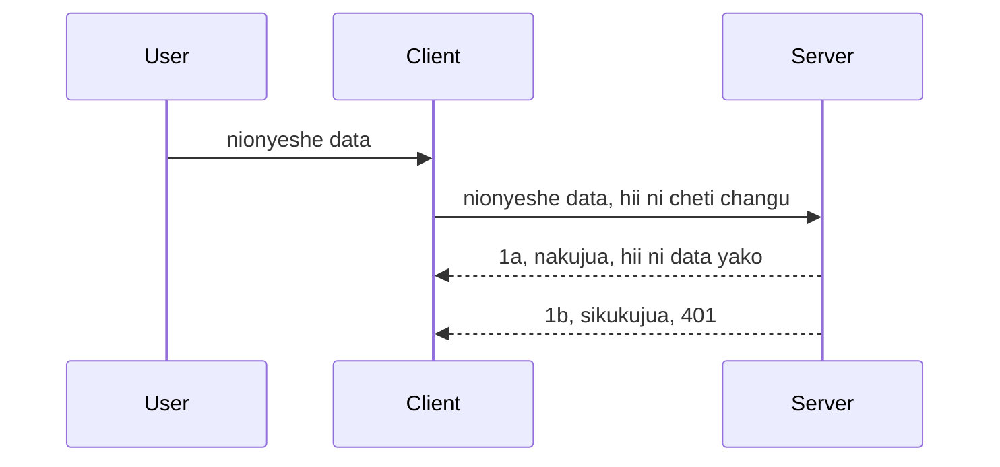

# Uthibitishaji rahisi

MCP SDKs zinaunga mkono matumizi ya OAuth 2.1 ambayo ni mchakato mgumu unaojumuisha dhana kama seva ya uthibitishaji, seva ya rasilimali, kutuma nyaraka za uthibitisho, kupata msimbo, kubadilisha msimbo kwa tokeni ya bearer hadi hatimaye uweze kupata data zako za rasilimali. Ikiwa haujajihusisha na OAuth ambayo ni jambo zuri kutekeleza, ni wazo zuri kuanza na kiwango fulani cha msingi cha uthibitishaji na kujenga usalama bora zaidi. Ndiyo maana sura hii ipo, kukuandaa kwa uthibitishaji wa hali ya juu zaidi.

## Uthibitishaji, tunamaanisha nini?

Uthibitishaji ni kifupi cha authentication na authorization. Wazo ni kwamba tunahitaji kufanya mambo mawili:

- **Authentication**, ambayo ni mchakato wa kubaini kama tunawaruhusu mtu kuingia nyumbani kwetu, kwamba wana haki ya kuwa "hapa" yaani kupata ufikiaji wa seva yetu ya rasilimali ambapo huduma za MCP Server zipo.
- **Authorization**, ni mchakato wa kugundua kama mtumiaji anapaswa kupata rasilimali fulani alizoziomba, kwa mfano maagizo haya au bidhaa hizi au kama wanaruhusiwa kusoma maudhui lakini si kufuta kama mfano mwingine.

## Nyaraka za uthibitisho: jinsi tunavyoambia mfumo sisi ni nani

Vizuri, wengi wa waendelezaji wa mtandao hufikiria kutoa nyaraka za uthibitisho kwa seva, kawaida ni siri inayosema kama wanaruhusiwa kuwa hapa "Authentication". Hii ni kawaida kuwa toleo la base64 lililohifadhiwa la jina la mtumiaji na nywila au ufunguo wa API unaotambulisha mtumiaji fulani kwa kipekee.

Hii inahusisha kutuma kupitia kichwa kinachoitwa "Authorization" kama ifuatavyo:

```json
{ "Authorization": "secret123" }
```

Hii kawaida huitwa uthibitishaji wa msingi. Mtiririko mzima hufanya kazi kwa njia ifuatayo:


```mermaid
sequenceDiagram
   participant User
   participant Client
   participant Server

   User->>Client: nionyeshe data
   Client->>Server: nionyeshe data, hii ni cheti changu
   Server-->>Client: 1a, nakujua, hii ni data yako
   Server-->>Client: 1b, sikukujua, 401 
```

Sasa tunapoelewa jinsi inavyofanya kazi kutoka mtazamo wa mtiririko, tunaiwekaje? Vizuri, seva nyingi za mtandao zina dhana ya middleware, kipande cha msimbo kinachoendeshwa kama sehemu ya ombi ambayo inaweza kuthibitisha nyaraka za uthibitisho, na ikiwa ni halali basi inaweza kuruhusu ombi kupitishwa. Ikiwa ombi halina nyaraka halali basi unapata kosa la uthibitishaji. Tuwe tazame jinsi hii inaweza kutekelezwa:

**Python**

```python
class AuthMiddleware(BaseHTTPMiddleware):
    async def dispatch(self, request, call_next):

        has_header = request.headers.get("Authorization")
        if not has_header:
            print("-> Missing Authorization header!")
            return Response(status_code=401, content="Unauthorized")

        if not valid_token(has_header):
            print("-> Invalid token!")
            return Response(status_code=403, content="Forbidden")

        print("Valid token, proceeding...")
       
        response = await call_next(request)
        # ongeza vichwa vya wateja au badilisha jibu kwa njia fulani
        return response


starlette_app.add_middleware(CustomHeaderMiddleware)
```

Hapa tuna:

- Tumeunda middleware iitwayo `AuthMiddleware` ambapo njia yake `dispatch` inaitwa na seva ya mtandao.
- Tumeongeza middleware kwenye seva ya mtandao:

    ```python
    starlette_app.add_middleware(AuthMiddleware)
    ```

- Tumeandika lohiki ya uthibitishaji inayopima kama kichwa cha Authorization kipo na kama siri inayotumwa ni halali:

    ```python
    has_header = request.headers.get("Authorization")
    if not has_header:
        print("-> Missing Authorization header!")
        return Response(status_code=401, content="Unauthorized")

    if not valid_token(has_header):
        print("-> Invalid token!")
        return Response(status_code=403, content="Forbidden")
    ```

    ikiwa siri iko na ni halali basi tunaruhusu ombi kupita kwa kuitwa `call_next` na kurudisha jibu.

    ```python
    response = await call_next(request)
    # ongeza vichwa vya mteja au badilisha majibu kwa njia fulani
    return response
    ```

Jinsi inavyofanya kazi ni kwamba ikiwa ombi la mtandao linafanywa kuelekea seva middleware itaitwa na kutokana na utekelezaji wake itaruhusu ombi kupita au kurudisha kosa linaloonyesha mteja haruhusiwi kuendelea.

**TypeScript**

Hapa tunaunda middleware kwa kutumia fremu maarufu ya Express na kukamata ombi kabla halijafikia MCP Server. Hii hapa ni msimbo wa hilo:

```typescript
function isValid(secret) {
    return secret === "secret123";
}

app.use((req, res, next) => {
    // 1. Kichwa cha idhini kiko?
    if(!req.headers["Authorization"]) {
        res.status(401).send('Unauthorized');
    }
    
    let token = req.headers["Authorization"];

    // 2. Angalia uhalali.
    if(!isValid(token)) {
        res.status(403).send('Forbidden');
    }

   
    console.log('Middleware executed');
    // 3. Pitia ombi hadi hatua inayofuata katika mchakato wa ombi.
    next();
});
```

Katika msimbo huu tunafanya:

1. Kukagua kama kichwa cha Authorization kipo, kama hakipo tunatuma kosa la 401.
2. Kuhakikisha nyaraka/token ni halali, kama si halali tunatuma kosa la 403.
3. Hatimaye ruhusu ombi kuendelea katika mnyororo wa maombi na kurudisha rasilimali zilizombwa.

## Zoefa: Tekeleza uthibitishaji

Hebu tuchukue maarifa yetu na tujaribu kuutekeleza. Hapa ni mpango:

Seva

- Unda seva ya mtandao na mfano wa MCP.
- Tekeleza middleware kwa seva.

Mteja

- Tuma ombi la mtandao, na nyaraka za uthibitisho, kupitia kichwa.

### -1- Unda seva ya mtandao na mfano wa MCP

> [!WARNING]
> Mfano wa TypeScript hapa chini unalenga MCP `2025-11-25`. Unafuatilia usafirishaji
> kwa `mcp-session-id` na si mfano wa usafirishaji wa sasa `2026-07-28`. MCP
> `2026-07-28` unatoa ufafanuzi wa kuondoa mkutano wa `initialize` na kitambulisho cha itifaki; utekelezaji mpya
> hutumia maombi yaliyojitegemea. Angalia
> [Nini Kilibadilika katika MCP: Ufafanuzi wa 2026-07-28](../../01-CoreConcepts/mcp-2026-07-28.md).

Katika hatua yetu ya kwanza, tunahitaji kuunda mfano wa seva ya mtandao na MCP Server.

**Python**

Hapa tunaunda mfano wa MCP server, tunaunda app ya starlette ya mtandao na kuitoa mwenyeji kwa uvicorn.

```python
# kuunda seva ya MCP

app = FastMCP(
    name="MCP Resource Server",
    instructions="Resource Server that validates tokens via Authorization Server introspection",
    host=settings["host"],
    port=settings["port"],
    debug=True
)

# kuunda programu ya wavuti ya starlette
starlette_app = app.streamable_http_app()

# kuhudumia programu kupitia uvicorn
async def run(starlette_app):
    import uvicorn
    config = uvicorn.Config(
            starlette_app,
            host=app.settings.host,
            port=app.settings.port,
            log_level=app.settings.log_level.lower(),
        )
    server = uvicorn.Server(config)
    await server.serve()

run(starlette_app)
```

Katika msimbo huu tunafanya:

- Unda MCP Server.
- Tengeneza app ya starlette kutoka MCP Server, `app.streamable_http_app()`.
- Tolea mwenyeji na tumia uvicorn `server.serve()` kuhudumia app.

**TypeScript**

Hapa tunaunda mfano wa MCP Server.

```typescript
const server = new McpServer({
      name: "example-server",
      version: "1.0.0"
    });

    // ... weka rasilimali za seva, zana, na maagizo ...
```

Uundaji huu wa MCP Server utatakiwa kufanyika ndani ya ufafanuzi wa njia ya POST /mcp, basi tuchukue msimbo ulio hapo juu na kuuweka kama ifuatavyo:

```typescript
import express from "express";
import { randomUUID } from "node:crypto";
import { McpServer } from "@modelcontextprotocol/sdk/server/mcp.js";
import { StreamableHTTPServerTransport } from "@modelcontextprotocol/sdk/server/streamableHttp.js";
import { isInitializeRequest } from "@modelcontextprotocol/sdk/types.js"

const app = express();
app.use(express.json());

// Ramani ya kuhifadhi usafirishaji kwa kitambulisho cha kikao
const transports: { [sessionId: string]: StreamableHTTPServerTransport } = {};

// Shughulikia maombi ya POST kwa mawasiliano ya mteja-kwa-server
app.post('/mcp', async (req, res) => {
  // Angalia kama kuna kitambulisho cha kikao kilicho tayari
  const sessionId = req.headers['mcp-session-id'] as string | undefined;
  let transport: StreamableHTTPServerTransport;

  if (sessionId && transports[sessionId]) {
    // Tumia tena usafirishaji uliopo
    transport = transports[sessionId];
  } else if (!sessionId && isInitializeRequest(req.body)) {
    // Ombi jipya la kuanzisha
    transport = new StreamableHTTPServerTransport({
      sessionIdGenerator: () => randomUUID(),
      onsessioninitialized: (sessionId) => {
        // Hifadhi usafirishaji kwa kitambulisho cha kikao
        transports[sessionId] = transport;
      },
      // Ulinzi wa kuanzisha upya DNS umetimizwa kiasili kwa ajili ya ulinganifu wa nyuma. Ikiwa unaendesha seva hii
      // kikazi, hakikisha kuweka:
      // enableDnsRebindingProtection: kweli,
      // allowedHosts: ['127.0.0.1'],
    });

    // Safisha usafirishaji unapo fungwa
    transport.onclose = () => {
      if (transport.sessionId) {
        delete transports[transport.sessionId];
      }
    };
    const server = new McpServer({
      name: "example-server",
      version: "1.0.0"
    });

    // ... panga rasilimali za seva, zana, na maelekezo ...

    // Unganisha na seva ya MCP
    await server.connect(transport);
  } else {
    // Ombi batili
    res.status(400).json({
      jsonrpc: '2.0',
      error: {
        code: -32000,
        message: 'Bad Request: No valid session ID provided',
      },
      id: null,
    });
    return;
  }

  // Shughulikia ombi
  await transport.handleRequest(req, res, req.body);
});

// Mshughulikiaji unaoweza kutumika tena kwa maombi ya GET na DELETE
const handleSessionRequest = async (req: express.Request, res: express.Response) => {
  const sessionId = req.headers['mcp-session-id'] as string | undefined;
  if (!sessionId || !transports[sessionId]) {
    res.status(400).send('Invalid or missing session ID');
    return;
  }
  
  const transport = transports[sessionId];
  await transport.handleRequest(req, res);
};

// Shughulikia maombi ya GET kwa taarifa kutoka seva kwenda kwa mteja kupitia SSE
app.get('/mcp', handleSessionRequest);

// Shughulikia maombi ya DELETE kwa kumaliza kikao
app.delete('/mcp', handleSessionRequest);

app.listen(3000);
```

Sasa unaona jinsi uundaji wa MCP Server ulivyohamishwa ndani ya `app.post("/mcp")`.

Tuelekee hatua inayofuata ya kuunda middleware ili tuweze kuangalia nyaraka za uthibitisho zinazoingia.

### -2- Tekeleza middleware kwa seva

Twende kwenye sehemu ya middleware sasa. Hapa tutaunda middleware inayotafuta nyaraka katika kichwa cha `Authorization` na kuithibitisha. Ikiwa inakubalika basi ombi litaendelea kufanya kilichohitajika (kwa mfano orodha ya zana, soma rasilimali au chochote kinachohusiana na MCP).

**Python**

Kuunda middleware, tunahitaji kuunda darasa linalorithi kutoka `BaseHTTPMiddleware`. Kuna vipande viwili vya kuvutia:

- Ombi `request`, ambalo tunasoma taarifa za kichwa.
- `call_next` ambayo ni callback tunayohitaji kuitisha kama mteja ameleta nyaraka yanayokubalika.

Kwanza, tunahitaji kushughulikia mgogoro wa ikiwa kichwa cha `Authorization` hakipo:

```python
has_header = request.headers.get("Authorization")

# hakuna kichwa kilichopo, kosa na 401, vinginevyo endelea.
if not has_header:
    print("-> Missing Authorization header!")
    return Response(status_code=401, content="Unauthorized")
```

Hapa tunatuma ujumbe wa 401 unauthorized kwani mteja anashindwa uthibitishaji.

Hii ifuatayo, ikiwa nyaraka zimetumwa, tunahitaji kuangalia uhalali wake kama ifuatavyo:

```python
 if not valid_token(has_header):
    print("-> Invalid token!")
    return Response(status_code=403, content="Forbidden")
```

Angalia jinsi tunavyotuma ujumbe wa 403 forbidden hapo juu. Tazama middleware kamili hapa chini ikitekereza kila tulichosema hapo juu:

```python
class AuthMiddleware(BaseHTTPMiddleware):
    async def dispatch(self, request, call_next):

        has_header = request.headers.get("Authorization")
        if not has_header:
            print("-> Missing Authorization header!")
            return Response(status_code=401, content="Unauthorized")

        if not valid_token(has_header):
            print("-> Invalid token!")
            return Response(status_code=403, content="Forbidden")

        print("Valid token, proceeding...")
        print(f"-> Received {request.method} {request.url}")
        response = await call_next(request)
        response.headers['Custom'] = 'Example'
        return response

```

Vizuri, lakini vipi kuhusu kazi ya `valid_token`? Hii iko hapa chini:

```python
# USITUMIE kwa ajili ya uzalishaji - boresha !!
def valid_token(token: str) -> bool:
    # onaondoa kiambatanisho cha "Bearer "
    if token.startswith("Bearer "):
        token = token[7:]
        return token == "secret-token"
    return False
```

Hii haswa inapaswa kuboreshwa.

MUHIMU: Haupaswi KWA HALI YOYOTE kuwa na siri kama hizi ndani ya msimbo. Unapaswa bora kupata thamani ya kulinganisha kutoka chanzo cha data au kutoka IDP (mtoa huduma ya kitambulisho) au bora zaidi, acha IDP ifanye uthibitishaji.

**TypeScript**

Kutekeleza hii na Express, tunahitaji kuitisha njia `use` inayopokea kazi za middleware.

Tunahitaji:

- Kuingiliana na kigezo cha ombi ili kuchunguza nyaraka zinazopitishwa kwenye mali ya `Authorization`.
- Kuthibitisha nyaraka, na kama ni halali ruhusu ombi liendelee na kufanya shughuli zinazohitajika za MCP.

Hapa, tunakagua kama kichwa cha `Authorization` kiko na kama hakiko, tunazuia ombi jipite:

```typescript
if(!req.headers["authorization"]) {
    res.status(401).send('Unauthorized');
    return;
}
```

Ikiwa kichwa hakitumwi kabisa, unapata kosa la 401.

Kisha tunakagua kama nyaraka ni halali, kama si halali tena tunazuia ombi lakini na ujumbe tofauti kidogo:

```typescript
if(!isValid(token)) {
    res.status(403).send('Forbidden');
    return;
} 
```

Angalia jinsi sasa unapata kosa la 403.

Hii hapa msimbo kamili:

```typescript
app.use((req, res, next) => {
    console.log('Request received:', req.method, req.url, req.headers);
    console.log('Headers:', req.headers["authorization"]);
    if(!req.headers["authorization"]) {
        res.status(401).send('Unauthorized');
        return;
    }
    
    let token = req.headers["authorization"];

    if(!isValid(token)) {
        res.status(403).send('Forbidden');
        return;
    }  

    console.log('Middleware executed');
    next();
});
```

Tumepanga seva ya mtandao kukubali middleware ya kuangalia nyaraka ambayo mteja tunategemea atatuma. Vipi kuhusu mteja mwenyewe?

### -3- Tuma ombi la mtandao na nyaraka kupitia kichwa

Tunahitaji kuhakikisha mteja anapitisha nyaraka kupitia kichwa. Kwa kuwa tutatumia mteja wa MCP kufanya hivyo, tunahitaji kujua jinsi inavyofanyika.

**Python**

Kwa mteja, tunahitaji kupitisha kichwa chenye nyaraka zetu hivi:

```python
# USIDHARAU thamani, iwe angalau katika variable ya mazingira au hifadhi salama zaidi
token = "secret-token"

async with streamablehttp_client(
        url = f"http://localhost:{port}/mcp",
        headers = {"Authorization": f"Bearer {token}"}
    ) as (
        read_stream,
        write_stream,
        session_callback,
    ):
        async with ClientSession(
            read_stream,
            write_stream
        ) as session:
            await session.initialize()
      
            # KUFANYA, unachotaka kifanyike kwa mteja, mfano orodha ya zana, wito wa zana n.k.
```

Angalia jinsi tunajaza mali ya `headers` hivi ` headers = {"Authorization": f"Bearer {token}"}`.

**TypeScript**

Tunaweza kutatua hili kwa hatua mbili:

1. Kujaza kitu cha usanidi na nyaraka zetu.
2. Kupitisha kitu cha usanidi kwa usafirishaji.

```typescript

// USIBADILISHE thamani moja kwa moja kama ilivyoonyeshwa hapa. Angalau iwe kama variable ya mazingira na tumia kitu kama dotenv (katika hali ya maendeleo).
let token = "secret123"

// fafanua chaguo la usafirishaji la mteja
let options: StreamableHTTPClientTransportOptions = {
  sessionId: sessionId,
  requestInit: {
    headers: {
      "Authorization": "secret123"
    }
  }
};

// pitisha chaguzi za kitu kwenye usafirishaji
async function main() {
   const transport = new StreamableHTTPClientTransport(
      new URL(serverUrl),
      options
   );
```

Hapa unaona juu jinsi tulivyotakiwa kuunda kitu cha `options` na kuweka vichwa chini ya mali `requestInit`.

MUHIMU: Tutawezaje kuboresha kutoka hapa? Vizuri, utekelezaji huu wa sasa una changamoto. Kwanza, kupitisha nyaraka hivi ni hatari isipokuwa angalau una HTTPS. Hata hivyo, nyaraka zinaweza kuibiwa hivyo unahitaji mfumo ambao unaweza kuiondoa tokeni na kuongeza ukaguzi wa ziada kama wapi ulimwenguni zinatoka, kama maombi yanatokea mara nyingi sana (tabia kama bot), kwa kifupi kuna masuala mengi ya kuzingatia.

Inapaswa kusemwa hata hivyo, kwa API rahisi sana ambapo hutaki mtu yeyote kupiga simu API yako bila kuthibitishwa, kile tulichonacho hapa ni mwanzo mzuri.

Kwa kusema hivyo, hebu jaribu kuimarisha usalama kidogo kwa kutumia mfumo uliowekwa kama JSON Web Token, unaojulikana pia kama JWT au tokeni za "JOT".

## JSON Web Tokens, JWT

Hivyo, tunajaribu kuboresha mambo zaidi ya kutuma nyaraka rahisi. Maboresho ya haraka tunayopata kwa kutumia JWT ni yapi?

- **Maboresho ya usalama**. Katika uthibitishaji wa msingi, unatumia jina la mtumiaji na nywila kama tokeni ya base64 (au unatumia ufunguo wa API) mara kwa mara ambayo huongeza hatari. Kwa JWT, unatumia jina lako la mtumiaji na nywila na unapata tokeni kama malipo na pia ni ya muda mfupi yaani itatoweka baada ya muda. JWT inakuwezesha kutumia udhibiti wa ufikiaji wa kina kwa kutumia majukumu, muktadha na ruhusa.
- **Kutokuwepo kwa hifadhi ya hali na uwezo wa kupanuka**. JWTs ni zilizojitegemea, zinabeba taarifa zote za mtumiaji na kuondoa hitaji la kuhifadhi kikao kwenye seva. Tokeni pia zinaweza kuthibitishwa huko mahali hapo.
- **Ushirikiano na usambazaji**. JWTs ni msingi wa Open ID Connect na hutumika na watoa huduma wanayojulikana kama Entra ID, Google Identity na Auth0. Pia hutoa uwezekano wa kutumia kuingia mara moja na zaidi kuhakikisha kiwango cha biashara.
- **Uwezo wa kuunganishwa na kubadilika**. JWTs pia zinaweza kutumika na Milango ya API kama Azure API Management, NGINX na zaidi. Inasaidia hali za uthibitishaji na mawasiliano meziya- huduma ikijumuisha kuigiza na kuidhinisha.
- **Ufanisi na kuhifadhiwa kwa muda mfupi**. JWTs zinaweza kuhifadhiwa baada ya kufichuliwa, jambo linalopunguza hitaji la uchambuzi wa mara kwa mara. Hii huwasaidia hasa programu zenye trafiki kubwa kwa kuboresha mtiririko na kupunguza mzigo kwenye miundombinu yako.
- **Vipengele vya hali ya juu**. Pia husaidia kufanyia ukaguzi (kuangalia uhalali kwa seva) na kuacha tokeni (kufanya tokeni isizumike).

Kwa faida hizi zote, tuchukulie jinsi tunavyoweza kuboresha utekelezaji wetu hadi kiwango kingine.

## Kubadilisha uthibitishaji wa msingi kuwa JWT

Hivyo, mabadiliko tunayohitaji kufanya kwa mtazamo wa juu ni:

- **Jifunze jinsi ya kuunda tokeni ya JWT** na kuitayarisha kutumwa kutoka kwa mteja kwenda seva.
- **Thibitisha tokeni ya JWT**, na kama ni halali, ruhusu mteja kupata rasilimali zetu.
- **Uhifadhi salama wa tokeni**. Jinsi tunavyohifadhi tokeni hii.
- **Linda njia za maombi**. Tunahitaji kulinda njia za maombi, katika kesi yetu, tunahitaji kulinda njia na vipengele maalum vya MCP.
- **Ongeza tokeni za kusasisha**. Hakikisha tunaunda tokeni zenye muda mfupi lakini tokeni za kusasisha zenye muda mrefu zinazotumika kupata tokeni mpya kama zitakapokoma. Pia hakikisha kuna mwisho wa kusasisha na mkakati wa mzunguko.

### -1- Unda tokeni ya JWT

Kwanza kabisa, tokeni ya JWT ina sehemu zifuatazo:

- **kichwa (header)**, algorithimu inayotumika na aina ya tokeni.
- **mzigo (payload)**, madai, kama sub (mtumiaji au entiti tokeni inayowakilisha. Katika hali ya uthibitishaji hii kawaida ni kitambulisho cha mtumiaji), exp (wakati inavyokoma) role (jukuumu)
- **saini (signature)**, iliyosainiwa na siri au ufunguo wa kibinafsi.

Kwa hili, tutahitaji kuunda kichwa, mzigo na tokeni iliyosimbwa.

**Python**

```python

import jwt
import jwt
from jwt.exceptions import ExpiredSignatureError, InvalidTokenError
import datetime

# Ufunguzi wa siri unaotumika kusaini JWT
secret_key = 'your-secret-key'

header = {
    "alg": "HS256",
    "typ": "JWT"
}

# habari za mtumiaji pamoja na dai zake na wakati wa kumalizika
payload = {
    "sub": "1234567890",               # Somo (kitambulisho cha mtumiaji)
    "name": "User Userson",                # Dai la kawaida
    "admin": True,                     # Dai la kawaida
    "iat": datetime.datetime.utcnow(),# Ilitolewa wakati
    "exp": datetime.datetime.utcnow() + datetime.timedelta(hours=1)  # Kumalizika
}

# fanya iwe encoded
encoded_jwt = jwt.encode(payload, secret_key, algorithm="HS256", headers=header)
```

Katika msimbo huu hapo juu tumefanya:

- Tumeeleza kichwa kwa kutumia HS256 kama algorithimu na aina kuwa JWT.
- Tumeunda mzigo unaojumuisha madai kama kifungu cha mtumiaji, jina la mtumiaji, jukumu, wakati ulipotolewa na wakati utakaporudiwa kugombea (expire) kwa kufuata kipengele cha muda tulichotaja awali.

**TypeScript**

Hapa tutahitaji utegemezi fulani utakaosaidia kuunda tokeni ya JWT.

Utegemezi

```sh

npm install jsonwebtoken
npm install --save-dev @types/jsonwebtoken
```

Sasa tulipokuwa na hayo, tuchukue kichwa, mzigo na kupitia hayo tujenge tokeni iliyosimbwa.

```typescript
import jwt from 'jsonwebtoken';

const secretKey = 'your-secret-key'; // Tumia vigezo vya mazingira katika uzalishaji

// Eleza mzigo
const payload = {
  sub: '1234567890',
  name: 'User usersson',
  admin: true,
  iat: Math.floor(Date.now() / 1000), // Imetolewa saa
  exp: Math.floor(Date.now() / 1000) + 60 * 60 // Inaisha ndani ya saa 1
};

// Eleza kichwa (hiari, jsonwebtoken inaweka chaguo-msingi)
const header = {
  alg: 'HS256',
  typ: 'JWT'
};

// Unda tokeni
const token = jwt.sign(payload, secretKey, {
  algorithm: 'HS256',
  header: header
});

console.log('JWT:', token);
```

Tokeni hii ni:

Imenasainiwa kwa kutumia HS256
Ina uhalali wa muda wa saa 1
Inajumuisha madai kama sub, jina, admin, iat, na exp.

### -2- Thibitisha tokeni

Pia tutahitaji kuthibitisha tokeni, hili ni jambo tunalopaswa kulifanya kwenye seva kuhakikisha kile mteja anachotuma ni halali. Kuna ukaguzi mwingi tunaweza kufanya hapa kuanzia kuthibitisha muundo hadi uhalali wake. Pia unahimizwa kuongeza ukaguzi zaidi kama kama mtumiaji yupo kwenye mfumo wako na mengine.

Ili kuthibitisha tokeni, tunahitaji kuifungua ili tuiweze kusoma kisha kuanza kuangalia uhalali wake:

**Python**

```python

# Tafsiri na thibitisha JWT
try:
    decoded = jwt.decode(token, secret_key, algorithms=["HS256"])
    print("✅ Token is valid.")
    print("Decoded claims:")
    for key, value in decoded.items():
        print(f"  {key}: {value}")
except ExpiredSignatureError:
    print("❌ Token has expired.")
except InvalidTokenError as e:
    print(f"❌ Invalid token: {e}")

```


Katika msimbo huu, tunaita `jwt.decode` tukitumia tokeni, funguo ya siri na algoriti iliyochaguliwa kama ingizo. Angalia jinsi tunavyotumia muundo wa jaribu-shika kwani uthibitisho uliofaulu husababisha kosa kutolewa.

**TypeScript**

Hapa tunahitaji kuita `jwt.verify` kupata toleo lililoambatanishwa la tokeni ambalo tunaweza kuchambua zaidi. Ikiwa simu hii itashindwa, hiyo inamaanisha muundo wa tokeni si sahihi au haipitiki tena.

```typescript

try {
  const decoded = jwt.verify(token, secretKey);
  console.log('Decoded Payload:', decoded);
} catch (err) {
  console.error('Token verification failed:', err);
}
```

KUMBUKA: kama ilivyotajwa awali, tunapaswa kufanya ukaguzi wa ziada kuhakikisha tokeni hii inaonyesha mtumiaji katika mfumo wetu na kuhakikisha mtumiaji ana haki anazodai kuwa nazo.

Sasa, tuchunguze udhibiti wa kufikia kulingana na majukumu, pia unajulikana kama RBAC.

## Kuongeza udhibiti wa kufikia kulingana na majukumu

Wazo ni kwamba tunataka kueleza kuwa majukumu tofauti yana ruhusa tofauti. Kwa mfano, tunadhani msimamizi anaweza kufanya kila kitu na mtumiaji wa kawaida anaweza kuwa na ruhusa ya kusoma/kuandika na mgeni anaweza kusoma tu. Kwa hivyo, hapa kuna viwango vya ruhusa vinavyowezekana:

- Admin.Write 
- User.Read
- Guest.Read

Tuchunguze jinsi tunavyoweza kutekeleza udhibiti wa aina hiyo kwa kutumia middleware. Middleware inaweza kuongezwa kwa kila njia pamoja na kwa njia zote.

**Python**

```python
from starlette.middleware.base import BaseHTTPMiddleware
from starlette.responses import JSONResponse
import jwt

# USIWAIWE siri katika msimbo kama huu, huu ni kwa madhumuni ya maonyesho tu. Iisome kutoka mahali salama.
SECRET_KEY = "your-secret-key" # Weka hii katika variable ya mazingira
REQUIRED_PERMISSION = "User.Read"

class JWTPermissionMiddleware(BaseHTTPMiddleware):
    async def dispatch(self, request, call_next):
        auth_header = request.headers.get("Authorization")
        if not auth_header or not auth_header.startswith("Bearer "):
            return JSONResponse({"error": "Missing or invalid Authorization header"}, status_code=401)

        token = auth_header.split(" ")[1]
        try:
            decoded = jwt.decode(token, SECRET_KEY, algorithms=["HS256"])
        except jwt.ExpiredSignatureError:
            return JSONResponse({"error": "Token expired"}, status_code=401)
        except jwt.InvalidTokenError:
            return JSONResponse({"error": "Invalid token"}, status_code=401)

        permissions = decoded.get("permissions", [])
        if REQUIRED_PERMISSION not in permissions:
            return JSONResponse({"error": "Permission denied"}, status_code=403)

        request.state.user = decoded
        return await call_next(request)


```

Kuna njia chache tofauti za kuongeza middleware kama ifuatavyo:

```python

# Alt 1: ongeza middleware wakati wa kuunda programu ya starlette
middleware = [
    Middleware(JWTPermissionMiddleware)
]

app = Starlette(routes=routes, middleware=middleware)

# Alt 2: ongeza middleware baada ya programu ya starlette kuundwa tayari
starlette_app.add_middleware(JWTPermissionMiddleware)

# Alt 3: ongeza middleware kwa kila njia
routes = [
    Route(
        "/mcp",
        endpoint=..., # mshughuliki
        middleware=[Middleware(JWTPermissionMiddleware)]
    )
]
```

**TypeScript**

Tunaweza kutumia `app.use` na middleware itakayokimbia kwa maombi yote.

```typescript
app.use((req, res, next) => {
    console.log('Request received:', req.method, req.url, req.headers);
    console.log('Headers:', req.headers["authorization"]);

    // 1. Angalia kama kichwa cha idhini kimetumwa

    if(!req.headers["authorization"]) {
        res.status(401).send('Unauthorized');
        return;
    }
    
    let token = req.headers["authorization"];

    // 2. Angalia kama tokeni ni halali
    if(!isValid(token)) {
        res.status(403).send('Forbidden');
        return;
    }  

    // 3. Angalia kama mtumiaji wa tokeni yupo katika mfumo wetu
    if(!isExistingUser(token)) {
        res.status(403).send('Forbidden');
        console.log("User does not exist");
        return;
    }
    console.log("User exists");

    // 4. Thibitisha tokeni ina ruhusa sahihi
    if(!hasScopes(token, ["User.Read"])){
        res.status(403).send('Forbidden - insufficient scopes');
    }

    console.log("User has required scopes");

    console.log('Middleware executed');
    next();
});

```

Kuna mambo kadhaa ambayo tunaweza kuruhusu middleware yetu kufanya na ambayo middleware yetu INAPASWA kufanya, yaani:

1. Angalia kama kichwa cha idhini kipo
2. Angalia kama tokeni ni halali, tunaita `isValid` ambayo ni njia tuliyoandika kuchunguza uadilifu na uhalali wa tokeni ya JWT.
3. Thibitisha mtumiaji yupo katika mfumo wetu, tunapaswa kuangalia hili.

   ```typescript
    // watumiaji katika DB
   const users = [
     "user1",
     "User usersson",
   ]

   function isExistingUser(token) {
     let decodedToken = verifyToken(token);

     // KAZI, hakiki kama mtumiaji yupo katika DB
     return users.includes(decodedToken?.name || "");
   }
   ```

   Juu, tumetengeneza orodha rahisi sana ya `users`, ambayo kwa kawaida ingekuwa katika hifadhidata.

4. Zaidi ya hayo, tunapaswa pia kuangalia tokeni ina ruhusa sahihi.

   ```typescript
   if(!hasScopes(token, ["User.Read"])){
        res.status(403).send('Forbidden - insufficient scopes');
   }
   ```

   Katika msimbo huu hapo juu kutoka middleware, tunakagua kwamba tokeni ina ruhusa ya User.Read, ikiwa haipo tunatuma kosa la 403. Hapo chini ni njia ya msaada `hasScopes`.

   ```typescript
   function hasScopes(scope: string, requiredScopes: string[]) {
     let decodedToken = verifyToken(scope);
    return requiredScopes.every(scope => decodedToken?.scopes.includes(scope));
  }
   ```

Have a think which additional checks you should be doing, but these are the absolute minimum of checks you should be doing.

Using Express as a web framework is a common choice. There are helpers library when you use JWT so you can write less code.

- `express-jwt`, helper library that provides a middleware that helps decode your token.
- `express-jwt-permissions`, this provides a middleware `guard` that helps check if a certain permission is on the token.

Here's what these libraries can look like when used:

```typescript
const express = require('express');
const jwt = require('express-jwt');
const guard = require('express-jwt-permissions')();

const app = express();
const secretKey = 'your-secret-key'; // put this in env variable

// Decode JWT and attach to req.user
app.use(jwt({ secret: secretKey, algorithms: ['HS256'] }));

// Check for User.Read permission
app.use(guard.check('User.Read'));

// multiple permissions
// app.use(guard.check(['User.Read', 'Admin.Access']));

app.get('/protected', (req, res) => {
  res.json({ message: `Welcome ${req.user.name}` });
});

// Error handler
app.use((err, req, res, next) => {
  if (err.code === 'permission_denied') {
    return res.status(403).send('Forbidden');
  }
  next(err);
});

```

Sasa umeona jinsi middleware inaweza kutumika kwa uthibitisho na idhini, lakini MCP je, hubadilisha jinsi tunavyofanya uthibitisho? Tuchunguze sehemu inayofuata.

### -3- Ongeza RBAC kwa MCP

Umekuwa umeona hadi sasa jinsi unavyoweza kuongeza RBAC kupitia middleware, hata hivyo, kwa MCP hakuna njia rahisi ya kuongeza RBAC ya kipengele kwa MCP, basi tuta kufanya nini? Vizuri, tunapaswa tu kuongeza msimbo kama huu unaokagua kama katika kesi hii mteja ana haki za kuitisha chombo maalum:

Una chaguzi kadhaa tofauti za kutekeleza RBAC kwa kipengele, hapa kuna baadhi:

- Ongeza ukaguzi kwa kila chombo, rasilimali, ombi ambapo unahitaji kuangalia kiwango cha ruhusa.

   **python**

   ```python
   @tool()
   def delete_product(id: int):
      try:
          check_permissions(role="Admin.Write", request)
      catch:
        pass # mteja ameshindwa kupata idhini, ondoa kosa la idhini
   ```

   **typescript**

   ```typescript
   server.registerTool(
    "delete-product",
    {
      title: Delete a product",
      description: "Deletes a product",
      inputSchema: { id: z.number() }
    },
    async ({ id }) => {
      
      try {
        checkPermissions("Admin.Write", request);
        // kufanya, tuma kitambulisho kwa productService na ingizo la mbali
      } catch(Exception e) {
        console.log("Authorization error, you're not allowed");  
      }

      return {
        content: [{ type: "text", text: `Deletected product with id ${id}` }]
      };
    }
   );
   ```


- Tumia mbinu ya seva ya hali ya juu na washughulikiaji wa ombi ili kupunguza maeneo unayohitaji kufanya ukaguzi.

   **Python**

   ```python
   
   tool_permission = {
      "create_product": ["User.Write", "Admin.Write"],
      "delete_product": ["Admin.Write"]
   }

   def has_permission(user_permissions, required_permissions) -> bool:
      # user_permissions: orodha ya ruhusa ambazo mtumiaji ana
      # required_permissions: orodha ya ruhusa zinazohitajika kwa chombo
      return any(perm in user_permissions for perm in required_permissions)

   @server.call_tool()
   async def handle_call_tool(
     name: str, arguments: dict[str, str] | None
   ) -> list[types.TextContent]:
    # Kubali request.user.permissions ni orodha ya ruhusa kwa mtumiaji
     user_permissions = request.user.permissions
     required_permissions = tool_permission.get(name, [])
     if not has_permission(user_permissions, required_permissions):
        # Toa kosa "Huna ruhusa ya kuitisha chombo {name}"
        raise Exception(f"You don't have permission to call tool {name}")
     # endelea na itisha chombo
     # ...
   ```   
   

   **TypeScript**

   ```typescript
   function hasPermission(userPermissions: string[], requiredPermissions: string[]): boolean {
       if (!Array.isArray(userPermissions) || !Array.isArray(requiredPermissions)) return false;
       // Rudisha kweli ikiwa mtumiaji ana angalau ruhusa moja inayohitajika
       
       return requiredPermissions.some(perm => userPermissions.includes(perm));
   }
  
   server.setRequestHandler(CallToolRequestSchema, async (request) => {
      const { params: { name } } = request;
  
      let permissions = request.user.permissions;
  
      if (!hasPermission(permissions, toolPermissions[name])) {
         return new Error(`You don't have permission to call ${name}`);
      }
  
      // endelea..
   });
   ```

   Kumbuka, utahitaji kuhakikisha middleware yako inaongeza tokeni iliyochambuliwa kwenye mali ya user ya ombi ili msimbo hapo juu uwe rahisi.

### Jumla

Sasa baada ya kujadili jinsi ya kuongeza msaada wa RBAC kwa ujumla na kwa MCP hasa, ni wakati wa kujaribu kutekeleza usalama kwa ajili yako mwenyewe ili kuhakikisha umeelewa dhana zilizotolewa kwako.

## Kazi 1: Jenga seva ya mcp na mteja wa mcp ukitumia uthibitisho wa msingi

Hapa utatumia kile ulichojifunza kuhusu kutuma hati kupitia vichwa.

## Suluhisho 1

[Solution 1](./code/basic/README.md)

## Kazi 2: Boresha suluhisho kutoka Kazi 1 kutumia JWT

Chukua suluhisho la kwanza lakini mara hii, tutaiboresha.

Badala ya kutumia Basic Auth, tumia JWT.

## Suluhisho 2

[Solution 2](./solution/jwt-solution/README.md)

## Changamoto

Ongeza RBAC kwa kila chombo tulichokielezea katika sehemu "Ongeza RBAC kwa MCP".

## Muhtasari

Tumekuwa na matumaini ya kwamba umejifunza mengi katika sura hii, kutoka kwa ukosefu wa usalama kabisa, hadi usalama wa msingi, hadi JWT na jinsi inaweza kuongezwa MCP.

Tumetengeneza msingi imara na JWT maalum, lakini kadri tunavyozidiwa, tunaelekea katika mfano wa kitambulisho kinachofuata viwango. Kuitumia IdP kama Entra au Keycloak kunaturuhusu kuhamisha utoaji wa tokeni, uthibitisho, na usimamizi wa mzunguko wa maisha kwa jukwaa la kuaminiwa - kuturuhusu kuzingatia mantiki ya programu na uzoefu wa mtumiaji.

Kwa hiyo, tuna sura zaidi [ya hali ya juu kuhusu Entra](../../05-AdvancedTopics/mcp-security-entra/README.md)

## Kielelezo kinachofuata

- Inayofuata: [Kuweka Wamiliki wa MCP](../12-mcp-hosts/README.md)

---

<!-- CO-OP TRANSLATOR DISCLAIMER START -->
**Kionyozo**:
Hati hii imetafsiriwa kwa kutumia huduma ya tafsiri ya AI [Co-op Translator](https://github.com/Azure/co-op-translator). Ingawa tunajitahidi kupata usahihi, tafadhali fahamu kwamba tafsiri za kiotomatiki zinaweza kuwa na makosa au upungufu wa usahihi. Hati ya asili katika lugha yake halisi inapaswa kuchukuliwa kama chanzo cha mamlaka. Kwa taarifa muhimu, tafsiri ya kitaalamu inayofanywa na binadamu inapendekezwa. Hatutojibu kwa kuelewa vibaya au tafsiri potofu zinazotokea kutokana na matumizi ya tafsiri hii.
<!-- CO-OP TRANSLATOR DISCLAIMER END -->