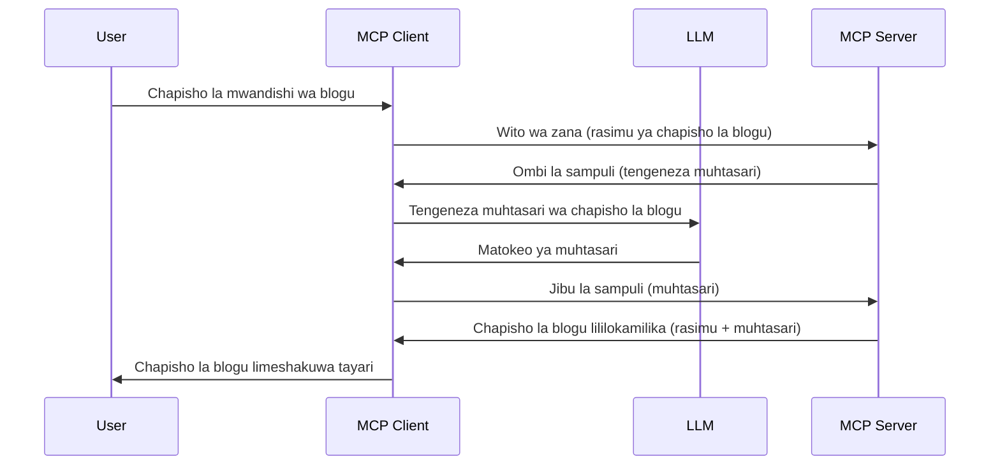

> [!WARNING]
> Kuchukua sampuli kumeachwa katika MCP `2026-07-28`. Somo hili limehifadhiwa kwa ajili ya
> utekelezaji wa urithi. Server mpya zinapaswa kuunganishwa moja kwa moja na API ya
> mtoa huduma wa LLM.

# Kuchukua sampuli - kuegemea vipengele kwa Mteja

> Kuchukua sampuli bado kiko katika sifa ya `2026-07-28` kwa usaidizi wa mende na ni
> kufaa kwa kuondolewa katika marekebisho ya kwanza yanayotolewa tarehe au baada ya Julai 28,
> 2027. Mifano katika somo hili inaweza kutumia API za SDK zinazotekeleza `2025-11-25`.
> Tazama [Nini Kimebadilika katika MCP: Sifa ya 2026-07-28](../../01-CoreConcepts/mcp-2026-07-28.md).

Katika utekelezaji wa urithi, Kuchukua sampuli huruhusu server ya MCP kuomba msaada kutoka kwa LLM
inayoendeshwa na mteja. Kwa utekelezaji mpya, piga simu kwa mtoa huduma wa LLM uliochaguliwa
moja kwa moja badala yake.

Hebu tuchunguze baadhi ya matumizi na jinsi ya kujenga suluhisho linalohusisha kuchukua sampuli.

## Muhtasari

Katika somo hili, tunazingatia kueleza lini na wapi kutumia Kuchukua sampuli na jinsi ya kuipanua.

## Malengo ya Kujifunza

Katika sura hii, tutafanya:

- Eleza nini maana ya Kuchukua sampuli na lini ya kuitumia.
- Onyesha jinsi ya kuipanua Kuchukua sampuli katika MCP.
- Toa mifano ya Kuchukua sampuli kwa vitendo.

## Kuchukua sampuli ni nini na kwa nini kuitumia?

Kuchukua sampuli ni kipengele cha hali ya juu ambacho hufanya kazi kwa njia ifuatayo:



### Ombi la kuchukua sampuli

Sawa, sasa tuna mtazamo wa juu wa hali halisi, hebu tuzungumze kuhusu ombi la kuchukua sampuli ambalo server inarudisha kwa mteja. Hapa ni mfano wa ombi kama hili kwa muundo wa JSON-RPC:

```json
{
  "jsonrpc": "2.0",
  "id": 1,
  "method": "sampling/createMessage",
  "params": {
    "messages": [
      {
        "role": "user",
        "content": {
          "type": "text",
          "text": "Create a blog post summary of the following blog post: <BLOG POST>"
        }
      }
    ],
    "modelPreferences": {
      "hints": [
        {
          "name": "claude-3-sonnet"
        }
      ],
      "intelligencePriority": 0.8,
      "speedPriority": 0.5
    },
    "systemPrompt": "You are a helpful assistant.",
    "maxTokens": 100
  }
}
```

Kuna mambo machache hapa yanayostahili kufafanuliwa:

- Prompt, chini ya content -> text, ni maelekezo yetu kwa LLM ya kufupisha yaliyomo kwenye chapisho la blogu.

- **modelPreferences**. Sehemu hii ni hiyo tu, upendeleo, pendekezo la usanidi wa kutumia na LLM. Mtumiaji anaweza kuchagua kufuata mapendekezo haya au kubadilisha. Katika kesi hii kuna mapendekezo ya mfano wa kutumia na kipaumbele cha kasi na akili.
- **systemPrompt**, hii ni prompt yako ya kawaida ya mfumo inayompa LLM yako tabia na ina maagizo ya mwongozo.
- **maxTokens**, hii ni mali nyingine inayotumika kusema ni tokens ngapi zinapendekezwa kutumika kwa kazi hii.

### Jibu la kuchukua sampuli

Jibu hili ndio MCP Client inarudisha kwa MCP Server na ni matokeo ya mteja kupiga simu kwa LLM, kusubiri jibu hilo kisha kuunda ujumbe huu. Hapa ni jinsi inavyoonekana katika JSON-RPC:

```json
{
  "jsonrpc": "2.0",
  "id": 1,
  "result": {
    "role": "assistant",
    "content": {
      "type": "text",
      "text": "Here's your abstract <ABSTRACT>"
    },
    "model": "gpt-5",
    "stopReason": "endTurn"
  }
}
```

Angalia jinsi jibu ni muhtasari wa chapisho la blogu kama tulivyoomba. Pia angalia jinsi `model` iliyotumika si ile tuliyoomba bali ni "gpt-5" badala ya "claude-3-sonnet". Hii inaonyesha kuwa mtumiaji anaweza kubadilisha mawazo juu ya matumizi na kwamba ombi lako la kuchukua sampuli ni pendekezo.

Sawa, sasa tunapoelewa mzunguko mkuu, na kazi inayofaa kuitumia kwa ajili ya "utengenezaji wa chapisho la blogu + muhtasari", hebu tuangalie tunahitaji kufanya nini kuitoa ifanye kazi.

### Aina za ujumbe

Ujumbe wa kuchukua sampuli haupunguzwi kwa maandishi tu bali pia unaweza kutuma picha na sauti. Hapa ni jinsi JSON-RPC inavyoonekana tofauti:

**Maandishi**

```json
{
  "type": "text",
  "text": "The message content"
}
```

**Yaliyomo ya picha**


```json
{
  "type": "image",
  "data": "base64-encoded-image-data",
  "mimeType": "image/jpeg"
}
```

**Yaliyomo ya sauti**

```json
{
  "type": "audio",
  "data": "base64-encoded-audio-data",
  "mimeType": "audio/wav"
}
```

> KUMBUKO: Kwa hali ya sasa na mwongozo wa uhamisho, ona
> [nyaraka za sampuli zilizoachwa](https://modelcontextprotocol.io/specification/2026-07-28/client/sampling).

## Jinsi ya Kusanidi Sampuli kwenye Mteja

> Kumbuka: ikiwa unajenga seva tu, huna haja ya kufanya mengi hapa.

Katika mteja, unahitaji kubainisha kipengele kinachofuata kama ifuatavyo:

```json
{
  "capabilities": {
    "sampling": {}
  }
}
```

Hii kisha itachukuliwa wakati mteja uliyochagua anapoanzisha na seva.

## Mfano wa Sampuli Kazini - Unda Chapisho la Blogu

Tuchapishe seva ya sampuli pamoja, tutahitaji kufanya yafuatayo:

1. Unda chombo kwenye Seva.
1. Chombo kilichosemwa kinapaswa kuunda ombi la sampuli
1. Chombo kinapaswa kusubiri ombi la sampuli la mteja litakaposadikika.
1. Kisha matokeo ya chombo yanapaswa kuzalishwa.

Tuje tupe kodhi hatua kwa hatua:

### -1- Unda chombo

**python**

```python
@mcp.tool()
async def create_blog(title: str, content: str, ctx: Context[ServerSession, None]) -> str:
    """Create a blog post and generate a summary"""

```

### -2- Unda ombi la sampuli

Panua chombo chako kwa kodhi ifuatayo:

**python**

```python
post = BlogPost(
        id=len(posts) + 1,
        title=title,
        content=content,
        abstract=""
    )

prompt = f"Create an abstract of the following blog post: title: {title} and draft: {content} "

result = await ctx.session.create_message(
        messages=[
            SamplingMessage(
                role="user",
                content=TextContent(type="text", text=prompt),
            )
        ],
        max_tokens=100,
)

```

### -3- Subiri jibu na rudisha jibu

**python**

```python
post.abstract = result.content.text

posts.append(post)

# rudisha bidhaa kamili
return json.dumps({
    "id": post.title,
    "abstract": post.abstract
})
```

### -4- Kodhi kamili

**python**

```python
from starlette.applications import Starlette
from starlette.routing import Mount, Host

from mcp.server.fastmcp import Context, FastMCP

from mcp.server.session import ServerSession
from mcp.types import SamplingMessage, TextContent

import json


from uuid import uuid4
from typing import List
from pydantic import BaseModel


mcp = FastMCP("Blog post generator")

# app = FastAPI()

posts = []

class BlogPost(BaseModel):
    id: int
    title: str
    content: str
    abstract: str

posts: List[BlogPost] = []

@mcp.tool()
async def create_blog(title: str, content: str, ctx: Context[ServerSession, None]) -> str:
    """Create a blog post and generate a summary"""

    post = BlogPost(
        id=len(posts) + 1,
        title=title,
        content=content,
        abstract=""
    )

    prompt = f"Create an abstract of the following blog post: title: {title} and draft: {content} "

    result = await ctx.session.create_message(
        messages=[
            SamplingMessage(
                role="user",
                content=TextContent(type="text", text=prompt),
            )
        ],
        max_tokens=100,
    )

    post.abstract = result.content.text

    posts.append(post)

    # rudisha chapisho lote la blogu
    return json.dumps({
        "id": post.title,
        "abstract": post.abstract
    })

if __name__ == "__main__":
    print("Starting server...")
    # mcp.endesha()
    mcp.run(transport="streamable-http")

# endesha app kwa: python server.py
```

### -5- Kuijaribu katika Visual Studio Code

Ili kujaribu hii katika Visual Studio Code, fanya yafuatayo:

1. Anzisha seva katika terminal
1. Iingize kwenye *mcp.json* (na hakikisha imeanzishwa) mfano kama ifuatavyo:

   ```json
   "servers": {
      "blog-server": {
        "type": "http",
        "url": "http://localhost:8000/mcp"
      }
   }
   ```

1. Andika ombi:

   ```text
   create a blog post named "Where Python comes from", the content is "Python is actually named after Monty Python Flying Circus"
   ```

1. Ruhusu sampuli ifanyike. Mara ya kwanza unapoijaribu hii utaonyeshwa dirisha la mazungumzo la ziada ambalo utalazimika kukubali, kisha utaona dirisha la kawaida la kukuomba uendeshe chombo

1. Kagua matokeo. Utaona matokeo yameonyeshwa vizuri katika GitHub Copilot Chat lakini pia unaweza kukagua jibu la JSON ghafi.

**Ziada**. Zana za Visual Studio Code zina msaada mkubwa kwa sampuli. Unaweza kusanidi upatikanaji wa Sampuli kwenye seva uliyoisakinisha kwa kwenda hivyo:

1. Nenda sehemu ya nyongeza.
1. Chagua ikoni ya gia kwa seva yako iliyosakinishwa katika sehemu ya "MCP SERVERS - INSTALLED".
1 Chagua "Configure Model Access", hapa unaweza kuchagua Ni Modeli gani GitHub Copilot inaruhusiwa kutumia wakati wa kufanya sampuli. Pia unaweza kuona maombi yote ya sampuli yaliyotokea hivi karibuni kwa kuchagua "Show Sampling requests".

## Kazi ya Nyumba

Katika kazi hii ya nyumbani, utajenga sampuli inayotofautiana kidogo yaani muunganisho wa sampuli unaounga mkono kuzalisha maelezo ya bidhaa. Hapa ni hali yako:

**Hali**: Mfanyakazi wa ofisi ya nyuma katika e-commerce anahitaji msaada, inachukua muda mrefu sana kuzalisha maelezo ya bidhaa. Kwa hiyo, utajenga suluhisho ambapo unaweza kuita chombo "create_product" na "title" na "keywords" kama hoja na kinapaswa kuzalisha bidhaa kamili ikiwa na sehemu ya "description" ambayo inapaswa kujazwa na LLM ya mteja.

SHUGHULI: tumia uliyojifunza awali kujenga seva hii na chombo chake ukiwa na ombi la sampuli.

## Suluhisho

[Suluhisho](./solution/README.md)

## Vidokezo Muhimu


Sampuli ni kipengele chenye nguvu kinachomruhusu seva kuhamisha majukumu kwa mteja anapohitaji msaada wa LLM.

## Nini Kifuatacho

- [Sura ya 4 - Utekelezaji wa vitendo](../../04-PracticalImplementation/README.md)

---

<!-- CO-OP TRANSLATOR DISCLAIMER START -->
**Kionyozo**:
Hati hii imetafsiriwa kwa kutumia huduma ya tafsiri ya AI [Co-op Translator](https://github.com/Azure/co-op-translator). Ingawa tunajitahidi kupata usahihi, tafadhali fahamu kwamba tafsiri za kiotomatiki zinaweza kuwa na makosa au upungufu wa usahihi. Hati ya asili katika lugha yake halisi inapaswa kuchukuliwa kama chanzo cha mamlaka. Kwa taarifa muhimu, tafsiri ya kitaalamu inayofanywa na binadamu inapendekezwa. Hatutojibu kwa kuelewa vibaya au tafsiri potofu zinazotokea kutokana na matumizi ya tafsiri hii.
<!-- CO-OP TRANSLATOR DISCLAIMER END -->