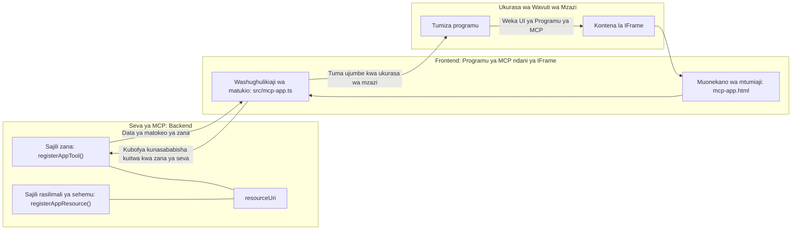
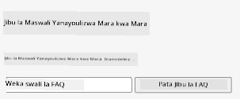
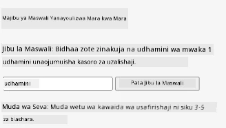
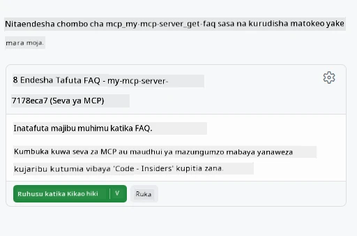

# MCP Apps

MCP Apps ni mtazamo mpya katika MCP. Wazo ni kwamba si tu unajibu kwa data nyuma kutoka kwa simu ya chombo, pia unatoa taarifa juu ya jinsi habari hii inapaswa kushirikiana nayo. Hiyo ina maana matokeo ya chombo sasa yanaweza kuwa na habari ya UI. Kwa nini tungetaka hiyo ingawa? Vizuri, fikiria jinsi unavyofanya mambo leo. Huenda unatumia matokeo ya MCP Server kwa kuweka aina fulani ya mbele mbele yake, hiyo ni msimbo unayohitaji kuandika na kudumisha. Wakati mwingine hiyo ndiyo unayotaka, lakini wakati mwingine itakuwa nzuri ikiwa unaweza tu kuleta kipande cha habari kinachojitegemea ambacho kina kila kitu kutoka data hadi kiolesura cha mtumiaji.

## Muhtasari

Somo hili linatoa mwongozo wa vitendo juu ya MCP Apps, jinsi ya kuanza nayo na jinsi ya kuijumuisha katika Web Apps zako zinazopo. MCP Apps ni nyongeza mpya sana kwa MCP Standard.

## Malengo ya Kujifunza

Mwisho wa somo hili, utaweza:

- Eleza MCP Apps ni nini.
- Lini kutumia MCP Apps.
- Jenga na jiunge na MCP Apps zako mwenyewe.

## MCP Apps - inavyofanya kazi

Wazo na MCP Apps ni kutoa majibu ambayo kimsingi ni sehemu ya kuonyeshwa. Sehemu kama hiyo inaweza kuwa na vitu vya kuona na mwingiliano, mfano kupiga vitufe, ingizo la mtumiaji na zaidi. Tuanze na upande wa seva na MCP Server yetu. Kuunda sehemu ya MCP App unahitaji kuunda chombo lakini pia chanzo cha programu. Nusu hizi mbili zinaunganishwa na resourceUri.

Hapa kuna mfano. Tujaribu kuona kinachojumuishwa na ni sehemu gani zinazofanya nini:

```text
server.ts -- responsible for registering tools and the component as a UI component
src/
  mcp-app.ts -- wiring up event handlers
mcp-app.html -- the user interface
```

Muonekano huu unaelezea usanifu wa kuunda sehemu na mantiki yake.


Tujaribu kuelezea majukumu yafuatayo kwa backend na frontend mtawalia.

### Upande wa backend

Kuna mambo mawili tunayopaswa kufanikisha hapa:

- Kusajili vyombo tunavyotaka kushirikiana navyo.
- Kuelezea sehemu.

**Kusajili chombo**

```typescript
registerAppTool(
    server,
    "get-time",
    {
      title: "Get Time",
      description: "Returns the current server time.",
      inputSchema: {},
      _meta: { ui: { resourceUri } }, // Inaunganisha chombo hiki na rasilimali yake ya UI
    },
    async () => {
      const time = new Date().toISOString();
      return { content: [{ type: "text", text: time }] };
    },
  );

```

Msimbo uliotangulia unaelezea tabia, ambapo unaonyesha chombo kinachoitwa `get-time`. Hakuna ingizo linalochukuliwa lakini kinamaliza kutoa wakati wa sasa. Tuna uwezo wa kufafanua `inputSchema` kwa vyombo tunapohitaji kupokea ingizo la mtumiaji.

**Kusajili sehemu**

Katika faili hiyo hiyo, tunapaswa pia kusajili sehemu:

```typescript
const resourceUri = "ui://get-time/mcp-app.html";

// Sajili rasilimali, ambayo inarejesha HTML/JavaScript iliyofungamanishwa kwa UI.
registerAppResource(
  server,
  resourceUri,
  resourceUri,
  { mimeType: RESOURCE_MIME_TYPE },
  async () => {
    const html = await fs.readFile(path.join(DIST_DIR, "mcp-app.html"), "utf-8");

    return {
    contents: [
        { uri: resourceUri, mimeType: RESOURCE_MIME_TYPE, text: html },
    ],
    };
  },
);
```

Tambua jinsi tunavyotaja `resourceUri` kuunganisha sehemu na vyombo vyake. Kinachovutia pia ni callback ambapo tunapakia faili ya UI na kurudisha sehemu.

### Upande wa frontend ya sehemu

Kama vile backend, kunakuwa na vipande viwili hapa:

- Frontend imeandikwa kwa HTML safi.
- Msimbo unaoshughulikia matukio na kinachofanyika, mfano kuitisha vyombo au kutuma ujumbe kwa dirisha la mzazi.

**Kiolesura cha mtumiaji**

Tazama kiolesura cha mtumiaji.

```html
<!-- mcp-app.html -->
<!DOCTYPE html>
<html lang="en">
  <head>
    <meta charset="UTF-8" />
    <title>Get Time App</title>
  </head>
  <body>
    <p>
      <strong>Server Time:</strong> <code id="server-time">Loading...</code>
    </p>
    <button id="get-time-btn">Get Server Time</button>
    <script type="module" src="/src/mcp-app.ts"></script>
  </body>
</html>
```

**Kufunga matukio**

Sehemu ya mwisho ni kufunga matukio. Hii ina maana sisi hutambua sehemu gani katika UI yetu inahitaji waendeshaji wa matukio na cha kufanyia matukio yanapotokea:

```typescript
// mcp-app.ts

import { App } from "@modelcontextprotocol/ext-apps";

// Pata rejea za vipengele
const serverTimeEl = document.getElementById("server-time")!;
const getTimeBtn = document.getElementById("get-time-btn")!;

// Unda mfano wa programu
const app = new App({ name: "Get Time App", version: "1.0.0" });

// Shughulikia matokeo ya zana kutoka kwa seva. Weka kabla ya `app.connect()` kuepuka
// kukosa matokeo ya kwanza ya zana.
app.ontoolresult = (result) => {
  const time = result.content?.find((c) => c.type === "text")?.text;
  serverTimeEl.textContent = time ?? "[ERROR]";
};

// Unganisha bonyeza la kitufe
getTimeBtn.addEventListener("click", async () => {
  // `app.callServerTool()` huruhusu UI kuomba data mpya kutoka kwa seva
  const result = await app.callServerTool({ name: "get-time", arguments: {} });
  const time = result.content?.find((c) => c.type === "text")?.text;
  serverTimeEl.textContent = time ?? "[ERROR]";
});

// Unganisha na mwenyeji
app.connect();
```

Kama unavyoona kutoka hapo juu, huu ni msimbo wa kawaida wa kuunganisha vipengele vya DOM na matukio. Thamani ya kutaja ni simu ya `callServerTool` inayomaliza kuitisha chombo upande wa backend.

## Kukabiliana na ingizo la mtumiaji

Mpaka sasa, tumeshuhudia sehemu inayokuwa na kitufe kinachopigiwa simu chombo. Tujaribu kuongeza vipengele zaidi vya UI kama kifungu cha ingizo na kuona kama tunaweza kutuma hoja kwa chombo. Tutaweka utendakazi wa maswali ya mara kwa mara (FAQ). Hivi ndivyo inavyopaswa kufanya kazi:

- Inapaswa kuwepo kitufe na elementi ya ingizo ambapo mtumiaji anaandika neno kuu la kutafuta kama "Shipping". Hii inapaswa kuitisha chombo upande wa backend kinachofanya utafutaji katika data ya FAQ.
- Chombo kinachounga mkono utafutaji wa FAQ ulioelezwa.

Tuweke kwanza msaada unaohitajika kwa upande wa backend:

```typescript
const faq: { [key: string]: string } = {
    "shipping": "Our standard shipping time is 3-5 business days.",
    "return policy": "You can return any item within 30 days of purchase.",
    "warranty": "All products come with a 1-year warranty covering manufacturing defects.",
  }

registerAppTool(
    server,
    "get-faq",
    {
      title: "Search FAQ",
      description: "Searches the FAQ for relevant answers.",
      inputSchema: zod.object({
        query: zod.string().default("shipping"),
      }),
      _meta: { ui: { resourceUri: faqResourceUri } }, // Inaunganisha chombo hiki na rasilimali ya UI yake
    },
    async ({ query }) => {
      const answer: string = faq[query.toLowerCase()] || "Sorry, I don't have an answer for that.";
      return { content: [{ type: "text", text: answer }] };
    },
  );
```

Tunavyoona hapa ni jinsi tunavyojaza `inputSchema` na kuipa kielelezo cha `zod` kama ifuatavyo:

```typescript
inputSchema: zod.object({
  query: zod.string().default("shipping"),
})
```

Katika kielelezo hapo juu tunatangaza parameter ya ingizo inayoitwa `query` na kwamba ni hiari yenye thamani ya asili ya "shipping".

Sawa, tuendelee kwenye *mcp-app.html* kuona UI tunayopaswa kuunda kwa hili:

```html
<div class="faq">
    <h1>FAQ response</h1>
    <p>FAQ Response: <code id="faq-response">Loading...</code></p>
    <input type="text" id="faq-query" placeholder="Enter FAQ query" />
    <button id="get-faq-btn">Get FAQ Response</button>
  </div>
```

Nzuri, sasa tuna elementi ya ingizo na kitufe. Tuende kwenye *mcp-app.ts* kuunganisha matukio haya:

```typescript
const getFaqBtn = document.getElementById("get-faq-btn")!;
const faqQueryInput = document.getElementById("faq-query") as HTMLInputElement;

getFaqBtn.addEventListener("click", async () => {
  const query = faqQueryInput.value;
  const result = await app.callServerTool({ name: "get-faq", arguments: { query } });
  const faq = result.content?.find((c) => c.type === "text")?.text;
  faqResponseEl.textContent = faq ?? "[ERROR]";
});
```

Katika msimbo hapo juu tume:

- Tengeneza marejeleo kwa vipengele vya UI vinavyovutia.
- Shughulikia bonyeza kitufe kuchambua thamani ya elementi ya ingizo na pia tuita `app.callServerTool()` na `name` na `arguments` ambapo hii ya mwisho inapita `query` kama thamani.

Kinachotokea hasa unapopita `callServerTool` ni kwamba hutuma ujumbe kwa dirisha la mzazi na dirisha hilo hufanya simu kwa MCP Server.

### Jaribu

Kwa kujaribu hili sasa tunapaswa kuona yafuatayo:



na hapa ambapo tunajaribu na ingizo kama "warranty"



Ili kuendesha msimbo huu, nenda sehemu ya [Code section](./code/README.md)

## Kupima katika Visual Studio Code

Visual Studio Code ina msaada mzuri kwa MVP Apps na ni mojawapo ya njia rahisi za kupima MCP Apps zako. Ili kutumia Visual Studio Code, ongeza kipengele cha seva ndani ya *mcp.json* kama ifuatavyo:

```json
"my-mcp-server-7178eca7": {
    "url": "http://localhost:3001/mcp",
    "type": "http"
  }
```

Kisha anza seva, unapaswa kuwa na uwezo wa kuwasiliana na MVP App yako kupitia Dirisha la Chat ikiwa umesakinisha GitHub Copilot.

pamoja na kuzinduwa kwa njia ya prompt, kwa mfano "#get-faq":



na sawa na jinsi ulivyoiendesha kupitia kivinjari cha wavuti, inatoa muonekano ule ule kama ifuatavyo:


## Kazi ya Nyumbani

Tengeneza mchezo wa jiwe karatasi mkono. Inapaswa kuhusisha yafuatayo:

UI:

- orodha ya kushuka chini yenye chaguzi
- kitufe cha kuwasilisha chaguo
- lebo inayoonyesha nani alichagua nini na nani alishinda

Seva:

- inapaswa kuwa na chombo cha jiwe karatasi mkono kinachochukua "choice" kama ingizo. Pia inapaswa kutoa chaguo la kompyuta na kuamua mshindi

## Suluhisho

[Suluhisho](./assignment/README.md)

## Muhtasari

Tumekuwa tukijifunza kuhusu mtazamo huu mpya wa MCP Apps. Ni mtazamo mpya unaoruhusu MCP Servers kuwa na maoni kuhusu si tu data bali pia jinsi data hii inapaswa kuonyeshwa.

Zaidi ya hayo, tumegundua kuwa MCP Apps hizi zinaishiwa ndani ya IFrame na kuwasiliana na MCP Servers zinahitaji kutuma ujumbe kwa app ya wavuti ya mzazi. Kuna maktaba kadhaa zinazopatikana kwa JavaScript mbichi na React na zaidi zinazofanya mawasiliano haya kuwa rahisi.

## Mambo Muhimu ya Kumbuka

Hapa ni mambo uliyoyajifunza:

- MCP Apps ni kiwango kipya ambacho kinaweza kuwa na manufaa unapotaka kusafirisha data na sifa za UI.
- Aina hizi za apps zinaendeshwa ndani ya IFrame kwa sababu za usalama.

## Kile Kinachofuata

- [Sura ya 4](../../04-PracticalImplementation/README.md)

---

<!-- CO-OP TRANSLATOR DISCLAIMER START -->
**Kifungu cha Kutangaza**:
Hati hii imetafsiriwa kwa kutumia huduma ya utafsiri wa AI [Co-op Translator](https://github.com/Azure/co-op-translator). Ingawa tunajitahidi kuhakikisha usahihi, tafadhali fahamu kuwa tafsiri za kiotomatiki zinaweza kuwa na makosa au upungufu. Hati ya asili katika lugha yake halali inapaswa kuchukuliwa kama chanzo cha mamlaka. Kwa taarifa muhimu, tafsiri za kitaalamu za binadamu zinapendekezwa. Hatutawajibika kwa kutoelewana au tafsiri zisizo sahihi zinazotokana na matumizi ya tafsiri hii.
<!-- CO-OP TRANSLATOR DISCLAIMER END -->