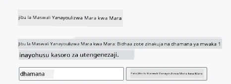
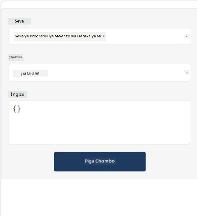
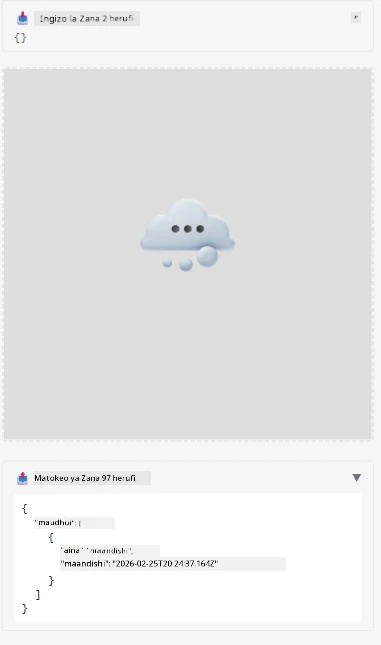

Huu ni mfano unaoonyesha MCP App

## Sakinisha

1. Elekeza kwenye folda ya *mcp-app*
1. Endesha `npm install`, hii inapaswa kusakinisha utegemezi wa frontend na backend

Thibitisha backend inakusanya kwa kuendesha:

```sh
npx tsc --noEmit
```

Hakuna kitu kinapaswa kuonekana kama kila kitu kiko sawa.

## Endesha backend

> Hii inahitaji kazi kidogo zaidi ikiwa uko kwenye mashine ya Windows kwani suluhisho la MCP Apps linatumia maktaba ya `concurrently` kwa ajili ya kuendesha ambayo unahitaji kupata mbadala yake. Hapa ni mstari wenye tatizo katika *package.json* kwenye MCP App:

    ```json
    "start": "concurrently \"cross-env NODE_ENV=development INPUT=mcp-app.html vite build --watch\" \"tsx watch main.ts\""
    ```

App hii ina sehemu mbili, sehemu ya backend na sehemu ya mwenyeji.

Anzisha backend kwa kuita:

```sh
npm start
```

Hii inapaswa kuanzisha backend kwenye `http://localhost:3001/mcp`.

> Kumbuka, ikiwa uko katika Codespace, huenda ukahitaji kuweka uonekano wa lango kuwa wa umma. Hakikisha unaweza kufikia mwisho wa huduma kupitia kivinjari kupitia https://<jina la Codespace>.app.github.dev/mcp

## Chaguo -1 Jaribu app katika Visual Studio Code

Ili kujaribu suluhisho katika Visual Studio Code, fanya yafuatayo:

- Ongeza kifungu cha server kwenye `mcp.json` kama ifuatavyo:

    ```json
    {
        "servers": {
            "my-mcp-server-7178eca7": {
                "url": "http://localhost:3001/mcp",
                "type": "http"
            }
        },
        "inputs": []
    }
    ```

1. Bonyeza kitufe cha "start" katika *mcp.json*
1. Hakikisha dirisha la mazungumzo limefunguka na andika `get-faq`, utapata matokeo kama haya:

    

## Chaguo -2- Jaribu app na mwenyeji

Repo <https://github.com/modelcontextprotocol/ext-apps> ina mwenyeji kadhaa tofauti ambazo unaweza kutumia kujaribu MVP Apps zako.

Tutakupa chaguzi mbili hapa:

### Mashine ya ndani

- Elekeza kwenye *ext-apps* baada ya kunakili repo.

- Sakinisha utegemezi

   ```sh
   npm install
   ```

- Katika dirisha tofauti la terminal, elekea *ext-apps/examples/basic-host*

    > ikiwa uko Codespace, unahitaji kwenda serve.ts na mstari 27 na kubadilisha http://localhost:3001/mcp na URL yako ya Codespace kwa backend, kwa mfano https://psychic-xylophone-657rpjgvxpc5g64-3001.app.github.dev/mcp

- Endesha mwenyeji:

    ```sh
    npm start
    ```

    Hii inapaswa kuunganisha mwenyeji na backend na utaona app ikikimbia kama ifuatavyo:

    

### Codespace

Inachukua kazi kidogo ziada kuifanya mazingira ya Codespace ifanye kazi. Ili kutumia mwenyeji kupitia Codespace:

- Tazama saraka ya *ext-apps* na elekea *examples/basic-host*.
- Endesha `npm install` kusakinisha utegemezi
- Endesha `npm start` kuanzisha mwenyeji.

## Jaribu app

Jaribu app kwa njia ifuatayo:

- Chagua kitufe cha "Call Tool" na utaona matokeo kama haya:

    

Nzuri, yote yanafanya kazi.

---

<!-- CO-OP TRANSLATOR DISCLAIMER START -->
**Tangazo la Hukumu**:
Hati hii imetafsiriwa kwa kutumia huduma ya tafsiri ya AI [Co-op Translator](https://github.com/Azure/co-op-translator). Ingawa tunajitahidi kufanikisha usahihi, tafadhali fahamu kwamba tafsiri zinazotolewa kiotomatiki zinaweza kuwa na makosa au upungufu wa usahihi. Hati ya asili katika lugha yake ya mama inapaswa kuzingatiwa kama chanzo cha mamlaka. Kwa taarifa muhimu, tafsiri ya kitaalamu ya binadamu inapendekezwa. Hatuna dhamana kwa kutoelewana au tafsiri mbaya zitokanazo na matumizi ya tafsiri hii.
<!-- CO-OP TRANSLATOR DISCLAIMER END -->