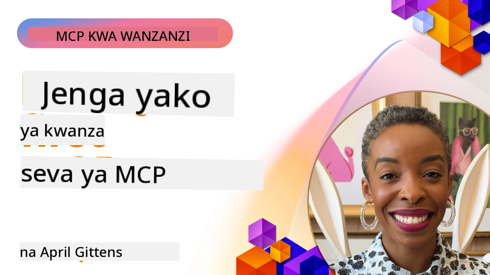

## Kuanzisha

_(Bonyeza picha hapo juu kutazama video ya somo hili)_

Sehemu hii ina masomo kadhaa:

- **1 Seva yako ya kwanza**, katika somo hili la kwanza, utajifunza jinsi ya kuunda seva yako ya kwanza na kuikagua kwa kutumia zana ya ukaguzi, njia muhimu ya kujaribu na kutatua matatizo ya seva yako, [kwenye somo](01-first-server/README.md)

- **2 Mteja**, katika somo hili, utajifunza jinsi ya kuandika mteja anayeweza kuungana na seva yako, [kwenye somo](02-client/README.md)

- **3 Mteja na LLM**, njia bora zaidi ya kuandika mteja ni kwa kuongeza LLM ili iweze "kujadiliana" na seva yako juu ya kitakachofanywa, [kwenye somo](03-llm-client/README.md)

- **4 Kutumia mode ya Wakala wa GitHub Copilot wa seva katika Visual Studio Code**. Hapa, tunangalia jinsi ya kuendesha Seva yetu ya MCP kutoka ndani ya Visual Studio Code, [kwenye somo](04-vscode/README.md)

- **5 Seva ya Usafirishaji wa stdio** usafirishaji wa stdio ni kiwango kilichopendekezwa kwa mawasiliano ya seva za MCP na wateja kwa karibu, ukitoa mawasiliano salama yanayotegemea michakato ndogo yenye upatanisho wa michakato uliyojengwa ndani [kwenye somo](05-stdio-server/README.md)

- **6 Utoaji wa Mkondo wa HTTP na MCP (HTTP Inayoweza Kutiririka)**. Jifunze kuhusu usafirishaji wa mkondo wa HTTP wa kisasa (njia inayopendekezwa kwa seva za MCP za mbali kulingana na [MCP Specification 2025-11-25](https://spec.modelcontextprotocol.io/specification/2025-11-25/basic/transports/#streamable-http)), arifa za maendeleo, na jinsi ya kutekeleza seva za MCP zinazoenea na wateja kwa wakati halisi kutumia HTTP inayoweza kutiririka. [kwenye somo](06-http-streaming/README.md)

- **7 Kutumia Kifaa cha AI kwa VSCode** ili kutumia na kujaribu wateja na seva zako za MCP [kwenye somo](07-aitk/README.md)

- **8 Upimaji**. Hapa tutazingatia hasa jinsi tunavyoweza kujaribu seva na mteja wetu kwa njia tofauti, [kwenye somo](08-testing/README.md)

- **9 Utoaji**. Sura hii itatazamia njia tofauti za kuweka suluhisho zako za MCP, [kwenye somo](09-deployment/README.md)

- **10 Matumizi ya hali ya juu ya seva**. Sura hii inahusu matumizi ya hali ya juu ya seva, [kwenye somo](./10-advanced/README.md)

- **11 Uthibitishaji**. Sura hii inahusu jinsi ya kuongeza uthibitishaji rahisi, kutoka Uthibitishaji wa Msingi hadi kutumia JWT na RBAC. Unahimizwa kuanza hapa kisha uangalie Mada za Juu katika Sura ya 5 na kufanya uimarishaji zaidi wa usalama kupitia mapendekezo katika Sura ya 2, [kwenye somo](./11-simple-auth/README.md)

- **12 Mabaki ya MCP**. Sanidi na tumia wateja maarufu wa mwenyeji wa MCP ikiwa ni pamoja na Claude Desktop, Cursor, Cline, na Windsurf. Jifunze aina za usafirishaji na kutatua matatizo, [kwenye somo](./12-mcp-hosts/README.md)

- **13 Mkaguzi wa MCP**. Tatua matatizo na jaribu seva zako za MCP kwa njia ya mwingiliano kwa kutumia zana ya Mkaguzi wa MCP. Jifunze kutatua matatizo ya zana, rasilimali, na ujumbe wa itifaki, [kwenye somo](./13-mcp-inspector/README.md)

- **14 Sampuli**. Tengeneza seva za MCP zinazoshirikiana na wateja wa MCP katika kazi zinazohusiana na LLM. [kwenye somo](./14-sampling/README.md)

- **15 Programu za MCP**. Jenga seva za MCP ambazo pia hutoa maagizo ya UI, [kwenye somo](./15-mcp-apps/README.md)

Itifaki ya Muktadha wa Mfano (MCP) ni itifaki ya wazi inayosanifisha jinsi programu zinavyotoa muktadha kwa LLMs. Fikiria MCP kama bandari ya USB-C kwa programu za AI - inatoa njia iliyosanifishwa ya kuunganisha mifano ya AI na vyanzo tofauti vya data na zana.

## Malengo ya Kujifunza

Mwisho wa somo hili, utaweza:

- Kuanzisha mazingira ya ukuzaji kwa MCP katika C#, Java, Python, TypeScript, na JavaScript
- Kujenga na kuweka seva za msingi za MCP zilizo na vipengele maalum (rasilimali, maelekezo, na zana)
- Kuunda programu za mwenyeji zinazounganisha na seva za MCP
- Kujaribu na kutatua matatizo ya utekelezaji wa MCP
- Kuelewa changamoto za kawaida za usanidi na suluhisho zake
- Kuunganisha utekelezaji wako wa MCP na huduma maarufu za LLM

## Kuandaa Mazingira Yako ya MCP

Kabla hujaanza kufanya kazi na MCP, ni muhimu kuandaa mazingira yako ya ukuzaji na kuelewa mtiririko wa kazi wa msingi. Sehemu hii itakuongoza kupitia hatua za usanidi wa mwanzo kuhakikisha kuanzisha kwa rahisi na MCP.

### Mahitaji ya Awali

Kabla ya kuingia kwenye ukuzaji wa MCP, hakikisha una:

- **Mazingira ya Ukuzaji**: Kwa lugha uliyoiamua kutumia (C#, Java, Python, TypeScript, au JavaScript)
- **IDE/Mhariri**: Visual Studio, Visual Studio Code, IntelliJ, Eclipse, PyCharm, au mhariri wa msimbo wa kisasa wowote
- **Wasimamizi wa Pakiti**: NuGet, Maven/Gradle, pip, au npm/yarn
- **Mafunguo ya API**: Kwa huduma zozote za AI unazopanga kutumia katika programu zako za mwenyeji

### SDK Rasmi

Katika sura zijazo utaona suluhisho zilizojengwa kwa kutumia Python, TypeScript, Java na .NET. Hapa ni SDK zote zinazotambuliwa rasmi.

MCP hutoa SDK rasmi kwa lugha nyingi (zinafuata [MCP Specification 2025-11-25](https://spec.modelcontextprotocol.io/specification/2025-11-25/)):
- [C# SDK](https://github.com/modelcontextprotocol/csharp-sdk) - Inasimamiwa kwa ushirikiano na Microsoft
- [Java SDK](https://github.com/modelcontextprotocol/java-sdk) - Inasimamiwa kwa ushirikiano na Spring AI
- [TypeScript SDK](https://github.com/modelcontextprotocol/typescript-sdk) - Utekelezaji rasmi wa TypeScript
- [Python SDK](https://github.com/modelcontextprotocol/python-sdk) - Utekelezaji rasmi wa Python (FastMCP)
- [Kotlin SDK](https://github.com/modelcontextprotocol/kotlin-sdk) - Utekelezaji rasmi wa Kotlin
- [Swift SDK](https://github.com/modelcontextprotocol/swift-sdk) - Inasimamiwa kwa ushirikiano na Loopwork AI
- [Rust SDK](https://github.com/modelcontextprotocol/rust-sdk) - Utekelezaji rasmi wa Rust
- [Go SDK](https://github.com/modelcontextprotocol/go-sdk) - Utekelezaji rasmi wa Go

## Vidokezo Muhimu

- Kuandaa mazingira ya ukuzaji wa MCP ni rahisi kwa kutumia SDK maalum kwa lugha
- Kujenga seva za MCP kunahusisha kuunda na kusajili zana zenye vipimo wazi
- Wateja wa MCP huungana na seva na mifano ili kutumia uwezo uliopanuliwa
- Kupima na kutatua matatizo ni muhimu kwa utekelezaji wa MCP unaotegemewa
- Chaguzi za utoaji zinatofautiana kutoka ukuzaji wa karibu hadi suluhisho za wingu

## Mazoezi

Tuna seti ya sampuli inayoongezea mazoezi utakayoyaona katika sura zote katika sehemu hii. Zaidi ya hayo kila sura pia ina mazoezi na kazi zake binafsi.

- [Kalkuleta ya Java](./samples/java/calculator/README.md)
- [Kalkuleta ya .Net](../../../03-GettingStarted/samples/csharp)
- [Kalkuleta ya JavaScript](./samples/javascript/README.md)
- [Kalkuleta ya TypeScript](./samples/typescript/README.md)
- [Kalkuleta ya Python](../../../03-GettingStarted/samples/python)

## Rasilimali Zaidi

- [Jenga Wakala kwa kutumia Itifaki ya Muktadha wa Mfano kwenye Azure](https://learn.microsoft.com/azure/developer/ai/intro-agents-mcp)
- [MCP ya Mbali na Azure Container Apps (Node.js/TypeScript/JavaScript)](https://learn.microsoft.com/samples/azure-samples/mcp-container-ts/mcp-container-ts/)
- [Mwakala wa MCP wa OpenAI wa .NET](https://learn.microsoft.com/samples/azure-samples/openai-mcp-agent-dotnet/openai-mcp-agent-dotnet/)

## Ifuayo

Anza na somo la kwanza: [Kuunda Seva Yako ya Kwanza ya MCP](01-first-server/README.md)

Mara utakapokamilisha moduli hii, endelea kwa: [Moduli 4: Utekelezaji wa Vitendo](../04-PracticalImplementation/README.md)

---

<!-- CO-OP TRANSLATOR DISCLAIMER START -->
**Kiondoa Hukumu**:
Nyaraka hii imefasiriwa kwa kutumia huduma ya tafsiri ya AI [Co-op Translator](https://github.com/Azure/co-op-translator). Ingawa tunajitahidi kwa usahihi, tafadhali fahamu kuwa tafsiri za mashine zinaweza kuwa na makosa au upungufu wa usahihi. Nyaraka asili katika lugha yake ya asili inapaswa kuchukuliwa kama chanzo cha mamlaka. Kwa habari muhimu, tafsiri ya mtaalamu wa binadamu inashauriwa. Hatuna dhamana kwa kownafahamu au tafsiri potofu zinazotokana na matumizi ya tafsiri hii.
<!-- CO-OP TRANSLATOR DISCLAIMER END -->